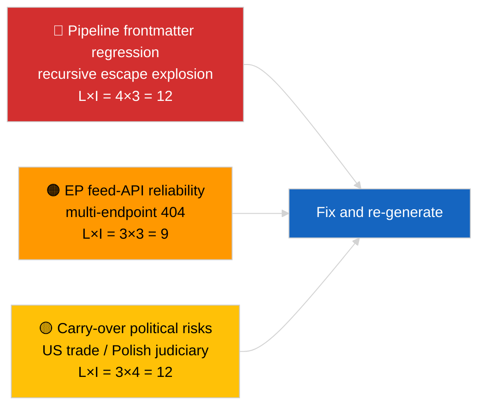

<!-- SPDX-FileCopyrightText: 2026 Hack23 AB -->
<!-- SPDX-License-Identifier: Apache-2.0 -->

# Lederorientering — Siste nyheter | 2026-04-02

**Klassifisering:** OSINT | Offentlig parlamentarisk dokument
**Konfidensnivå:** 🟡 Middels (artikkelens frontmatter er korrupt på grunn av nested escape-regresjon; underliggende analyse er substansiell)
**Generert:** 2026-04-02T00:00:00Z (retrospektivt dokument)
**Artikkeltype:** Breaking
**Kilde:** Europaparlamentets åpne dataportal

---

## 🎯 BLUF

**Andre dag etter marspausen; det fremhevede funnet er datapipeline-forringelse heller enn EP-aktivitet.** Artikkelens YAML-frontmatter er korrupt på grunn av rekursiv nested sitatescaping (`title:`- og `description:`-feltene inneholder sitateksplosionsartefakter), men brødtekstinnholdet er lesbart. Substantielt viser kjøringen igjen minimal ny EP-aktivitet (ferieuke 2 av 4), med nedarvede marsprioriteter (US tolltariff TA-10-2026-0096, utslippskreditter for tunge kjøretøy TA-10-2026-0084, Braun-immunitet TA-10-2026-0088, ECBs visepresident TA-10-2026-0060) på overvåkningslisten. Det viktigste nye signalet er frontmatter-korrupsjonsregresjonen — et datakvalitetsproblem som kjøringen 2026-04-03/breaking-2 formaliserer som en dedikert EP-API-pålitelighetsutredning. **🟡 MIDDELS konfidensnivå** om at den underliggende parlamentariske aktiviteten er null; **🟢 HØY konfidensnivå** om at pipeline sendte ut en feilformatert frontmatter-artikkel som bør merkes for omgenerering.

---

## 🧭 3 beslutninger dette dokumentet støtter

| # | Beslutning | Hvem beslutter | Frist | Bevis |
|:-:|-----------|----------------|:-----:|-------|
| 1 | **Redaksjonelt:** HOPP OVER daglige nyheter; merk artikkel for omgenerering på grunn av korrupt frontmatter | Redaktør | +12t | Rekursiv sitatartefakt i tittel |
| 2 | **Overvåking:** åpne datapipeline-sak for nested escape-regresjon | Datapipeline | +24t | Artikkelens frontmatter |
| 3 | **Fremtidsovervåking:** bekreft fix i 2026-04-03-kjøringene | Analyseleder | 2026-04-03 | Neste dags frontmatter |

---

## 📰 60-Second Read

- 🔴 **Frontmatter-regresjon** — tittel- og beskrivelsesfelt inneholder rekursive escape-artefakter (`title: "title: \"title: \\\"…"`). Sannsynligvis en deterministisk renderer / nettstedskart-interaksjon med tidligere escaped strenger. (🟢 Høy)
- 🟠 **Ferieuke 2 av 4** — Parlamentet er i intersesjonell pause; ingen plenum-, komité- eller trilogaktivitet forventes. (🟢 Høy)
- 🟢 **Mars-overvåkingsliste uendret** — US-tollsatser, HDV-utslipp, Braun-immunitet, ECBs visepresident. (🟢 Høy)
- 🟡 **Søsterkjøringer:** 2026-04-02/committee-reports / motions / propositions viser alle identisk tom tilstand — bekrefter systemomfattende ferie + feed-API-forhold. (🟢 Høy)
- 🔵 **Økonomisk kontekst:** US-EU-handels­trajektori forblir den dominerende eksterne pressevariabelen. (🟢 Høy)
- 🟣 **Kryss-referanse:** se 2026-04-03/breaking-2 for den formelle EP-API-pålitelighetsutredningen som følger av dagens anomali. (🟢 Høy)
- 🩷 **Forstyrrelsesvektoren:** datakvalitetsregresjon er den aktive vektoren i dag, ikke en politisk hendelse. (🟢 Høy)
- ⚪ **Fremover:** Mercosur ECJ-uttalelse fortsatt avventende; aprilplenarens agenda ikke publisert ennå.

---

## 🗂️ Toppdokumenter / prosedyrer tabell

| Rang | EP-referanse | Tittel (kort) | Betydning | Konfidensnivå | Status |
|:----:|--------------|--------------|:---------:|:-------------:|--------|
| 1 | — | Ingen nye prosedyrer eller vedtatte tekster 2026-04-02 | 0,0 | 🟢 HØY | Ferie — ingen aktivitet |
| 2 | TA-10-2026-0096 | US tolltariff (overført) | 7,0 | 🟢 HØY | Vedtatt 26. mars; overvåk |
| 3 | TA-10-2026-0088 | Braun-immunitetspresedent (overført) | 6,5 | 🟢 HØY | Vedtatt 26. mars; LIBE overvåk |

---

## ⚠️ Risiko- og trusselsbilde

| Risiko | L | I | Score | Utløser | Kilde | Admiralitet |
|--------|:-:|:-:|:-----:|---------|-------|:-----------:|
| Pipeline frontmatter-regresjon | 4 | 3 | 12 | Samme artefakt i 2026-04-03 | Artikkelens YAML | B2 |
| EP feed-API pålitelighet | 3 | 3 | 9 | Vedvarende 404-er | Samtidige søsterkjøringer | B2 |
| US-EU handelsretaliation (overført) | 3 | 4 | 12 | US mottiltak | TA-10-2026-0096 | A1 |
| EP-polsk rettssamspill (overført) | 4 | 3 | 12 | Ytterligere immunitetsak | TA-10-2026-0088 | A1 |

---

## 🔮 Viktigste fremtidige utløser

**2026-04-03-kjøringsserien** — tre separate breaking-kjøringer den dagen (breaking, breaking-2, breaking-3) formaliserer EP-API-pålitelighetsbekymringen (breaking-2) og konsoliderer den politiske koalisjonsbasislinje (breaking-1 og breaking-3). Sammenlign dagens feilformaterte frontmatter-output med disse kjøringene for å bekrefte om pipeline-regresjonen er tilbakevendende eller isolert.

---

## 🛡️ Vurdering av kildekvalitet

- **Primærkilder:** EP's åpne dataportal — analysekjøring (kjørings-ID ugjennopprettelig fra korrupt frontmatter); brødtekstinnhold konsistent med søsken for 2026-04-02.
- **Databegrensninger:** Frontmatter er strukturelt korrupt; nedstrøms renderer/SEO-konsumenter vil håndtere denne kjøringen feilaktig. Tiltak: kjør på nytt med renderer-fix.
- **Konfidensnivå for EP-sidenes nulltilstand:** 🟢 HØY.
- **Konfidensnivå for pipeline-regresjonen:** 🟢 HØY.

---

## 📎 Lenker

| Lenke | Sti |
|-------|-----|
| Artikkel (med korrupt frontmatter) | `./article.md` |
| Manifest | `./manifest.json` |
| Søsterkjøringer | `analysis/daily/2026-04-02/committee-reports/`, `motions/`, `propositions/` |
| Oppfølging | `analysis/daily/2026-04-03/breaking-2/` (formell EP-API-pålitelighetsutredning) |

---

## 🔄 Kryss-referanse

**Foregående:** 2026-04-01/breaking dokumenterte 6/8 rådgivningsfeed-404-mønsteret.
**Parallelt:** 2026-04-02/committee-reports / motions / propositions alle tomme maler.
**Neste:** 2026-04-03/breaking-2 eskalerer pipeline-pålitelighetsbekymringen til en dedikert kjøring.

---

**Dokumentkontroll**
- **Mal:** `/analysis/templates/executive-brief.md`
- **Artefaktsti:** `analysis/daily/2026-04-02/breaking/executive-brief.md`
- **Klassifisering:** Offentlig
- **Retrospektiv generering:** Backfill-sesjon; dette dokumentet erstatter den ubrukbare frontmatter-korrupte artikkelens BLUF-funksjon.
