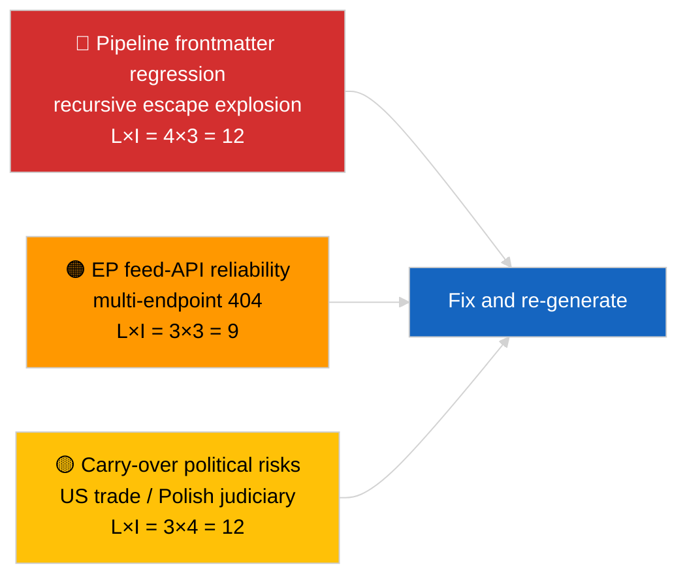

<!-- SPDX-FileCopyrightText: 2026 Hack23 AB -->
<!-- SPDX-License-Identifier: Apache-2.0 -->

# Verkställande sammanfattning — Senaste nyheter | 2026-04-02

**Klassificering:** OSINT | Offentlig parlamentarisk handling
**Konfidensgrad:** 🟡 Medel (artikelns frontmatter korrupt på grund av regression med kapslade escape; underliggande analys substantiell)
**Genererat:** 2026-04-02T00:00:00Z (retrospektivt underlag)
**Artikeltyp:** Breaking
**Källa:** Europaparlamentets öppna dataportal

---

## 🎯 BLUF

**Andra dagen efter marsuppehållet; det utmärkande fyndet är dataflödesdegradation snarare än EP-aktivitet.** Artikelns YAML-frontmatter är korrupt på grund av rekursiv kapslad citering (`title:`- och `description:`-fälten innehåller citatexplosionsartefakter), men brödtextinnehållet är läsbart. Substantiellt visar körningen återigen minimal ny EP-aktivitet (uppehållsvecka 2 av 4), med nedärvda marsprioriteter (US tulltariff TA-10-2026-0096, utsläppskrediter för tunga fordon TA-10-2026-0084, Braun-immunitet TA-10-2026-0088, ECB:s vice ordförande TA-10-2026-0060) på bevakningslistan. Den viktigaste nya signalen är frontmatter-korruptionsregressionen — ett problem med datakvaliteten som körningen 2026-04-03/breaking-2 formaliserar som en dedikerad EP-API-tillförlitlighetsbedömning. **🟡 MEDEL konfidensgrad** att den underliggande parlamentariska aktiviteten är noll; **🟢 HÖG konfidensgrad** att pipelinen emitterade en missformad frontmatter-artikel som bör markeras för omgenerering.

---

## 🧭 3 beslut detta underlag stödjer

| # | Beslut | Beslutsfattare | Deadline | Bevis |
|:-:|--------|---------------|:--------:|-------|
| 1 | **Redaktionellt:** HOPPA ÖVER dagliga nyheter; märk artikel för omgenerering på grund av korrupt frontmatter | Redaktör | +12h | Rekursiv citatartefakt i titel |
| 2 | **Övervakning:** öppna datapipelineärende för regression med kapslade escape | Datapipeline | +24h | Artikelns frontmatter |
| 3 | **Framtidsbevakning:** bekräfta åtgärd i körningarna 2026-04-03 | Analysansvarig | 2026-04-03 | Nästföljande dags frontmatter |

---

## 📰 60-Second Read

- 🔴 **Frontmatter-regression** — titel- och beskrivningsfält innehåller rekursiva escape-artefakter (`title: "title: \"title: \\\"…"`). Troligen en deterministisk renderare / webbkarta-interaktion med tidigare escaped strängar. (🟢 Hög)
- 🟠 **Uppehållsvecka 2 av 4** — Parlamentet är i intersessionell paus; ingen plenar-, kommittée- eller trilogaktivitet förväntas. (🟢 Hög)
- 🟢 **Marsbevakningslista oförändrad** — US-tullar, HDV-utsläpp, Braun-immunitet, ECB:s vice ordförande. (🟢 Hög)
- 🟡 **Syskorkörningar:** 2026-04-02/committee-reports / motions / propositions visar alla identiskt tomt tillstånd — bekräftar systemomfattande uppehåll + feed-API-förhållanden. (🟢 Hög)
- 🔵 **Ekonomiskt sammanhang:** US-EU-handels­trajektori förblir den dominerande externa tryckvariabeln. (🟢 Hög)
- 🟣 **Korsreferens:** se 2026-04-03/breaking-2 för den formella EP-API-tillförlitlighetsbedömningen som följer av denna dags anomali. (🟢 Hög)
- 🩷 **Störningsvektor:** datakvalitetsregression är den aktiva vektorn idag, inte en politisk händelse. (🟢 Hög)
- ⚪ **Framöver:** Mercosur ECJ-yttrande fortfarande avvaktat; aprilplenaragenda inte publicerad än.

---

## 🗂️ Tabell över topphandlingar / procedurer

| Rang | EP-referens | Titel (kort) | Betydelse | Konfidensgrad | Status |
|:----:|-------------|-------------|:---------:|:-------------:|--------|
| 1 | — | Inga nya procedurer eller antagna texter den 2026-04-02 | 0,0 | 🟢 HÖG | Uppehåll — ingen aktivitet |
| 2 | TA-10-2026-0096 | US tulltariff (överfört) | 7,0 | 🟢 HÖG | Antaget 26 mars; bevaka |
| 3 | TA-10-2026-0088 | Braun-immunitetsprecedens (överfört) | 6,5 | 🟢 HÖG | Antaget 26 mars; LIBE bevaka |

---

## ⚠️ Risker och hotbild i korthet

| Risk | L | I | Poäng | Utlösare | Källa | Admiralitet |
|------|:-:|:-:|:-----:|----------|-------|:-----------:|
| Pipeline frontmatter-regression | 4 | 3 | 12 | Samma artefakt i 2026-04-03 | Artikelns YAML | B2 |
| EP feed-API tillförlitlighet | 3 | 3 | 9 | Ihållande 404:or | Parallella körningar | B2 |
| US-EU handelsretaliation (överfört) | 3 | 4 | 12 | US motåtgärd | TA-10-2026-0096 | A1 |
| EP-polsk rättssystem spridning (överfört) | 4 | 3 | 12 | Ytterligare immunitetsmål | TA-10-2026-0088 | A1 |

---

## 🔮 Viktigaste framtida utlösare

**Körningsserie 2026-04-03** — tre separata breaking-körningar den dagen (breaking, breaking-2, breaking-3) formaliserar EP-API-tillförlitlighetsproblematiken (breaking-2) och konsoliderar den politiska koalitionsbaslinjen (breaking-1 och breaking-3). Jämför dagens missformade frontmatter-utdata med de körningarna för att bekräfta om pipeline-regressionen är återkommande eller isolerad.

---

## 🛡️ Bedömning av källkvalitet

- **Primärkällor:** EP:s öppna dataportal — analyslopp (löpnings-ID oåterkalleligt från korrupt frontmatter); brödtextinnehåll konsekvent med syskon för 2026-04-02.
- **Databegränsningar:** Frontmatter är strukturellt korrupt; nedströms renderer/SEO-konsumenter kommer att hantera denna körning felaktigt. Åtgärd: kör om med renderer-fix.
- **Konfidensgrad för EP-sidans nulltillstånd:** 🟢 HÖG.
- **Konfidensgrad för pipeline-regressionen:** 🟢 HÖG.

---

## 📎 Länkar

| Länk | Sökväg |
|------|--------|
| Artikel (med korrupt frontmatter) | `./article.md` |
| Manifest | `./manifest.json` |
| Syskonkörningar | `analysis/daily/2026-04-02/committee-reports/`, `motions/`, `propositions/` |
| Uppföljning | `analysis/daily/2026-04-03/breaking-2/` (formell EP-API-tillförlitlighetsbedömning) |

---

## 🔄 Korsreferens

**Föregående:** 2026-04-01/breaking dokumenterade 6/8 rådgivningsflödes-404-mönstret.
**Parallellt:** 2026-04-02/committee-reports / motions / propositions alla tomma mallar.
**Nästa:** 2026-04-03/breaking-2 höjer pipeline-tillförlitlighetsproblematiken till en dedikerad körning.

---

**Dokumentkontroll**
- **Mall:** `/analysis/templates/executive-brief.md`
- **Artefaktsökväg:** `analysis/daily/2026-04-02/breaking/executive-brief.md`
- **Klassificering:** Offentlig
- **Retrospektiv generering:** Bakåtfyllningssession; detta underlag ersätter den oanvändbara frontmatter-korrupta artikelns BLUF-funktion.
