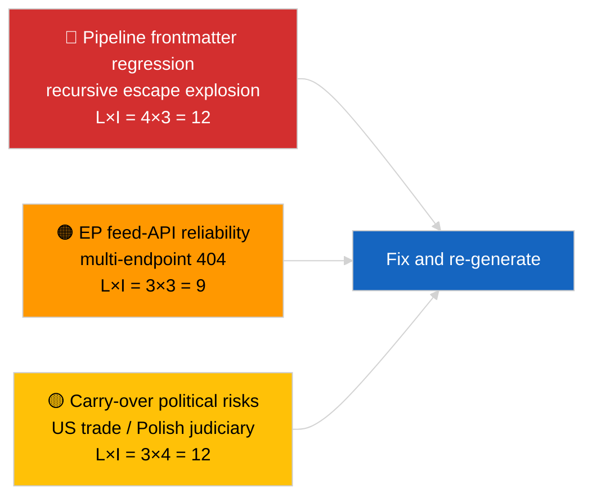

<!-- SPDX-FileCopyrightText: 2026 Hack23 AB -->
<!-- SPDX-License-Identifier: Apache-2.0 -->

# 执行摘要 — 最新新闻 | 2026-04-02

**分类：** OSINT | 公开议会文件
**置信度：** 🟡 中等（文章的前置元数据因嵌套转义回归而损坏；但底层分析内容实质丰富）
**生成日期：** 2026-04-02T00:00:00Z（追溯性补充文件）
**文章类型：** 速报
**来源：** 欧洲议会开放数据门户

---

## 🎯 核心结论

**3月休会后第二天；突出发现是数据管道退化，而非欧洲议会活动。** 文章的YAML前置元数据因递归嵌套引号转义链（`title:` 和 `description:` 字段含有引号爆炸残留物）而损坏，但正文内容可读。从实质内容来看，本次运行再次呈现极少的欧洲议会新活动（休会第2周/共4周），3月延续优先事项（美国关税 TA-10-2026-0096、重型车辆排放积分 TA-10-2026-0084、布劳恩豁免 TA-10-2026-0088、欧央行副行长 TA-10-2026-0060）仍在监控列表中。最重要的新信号是前置元数据损坏回归——这一数据质量问题将由 2026-04-03/breaking-2 运行正式化为专项欧洲议会API可靠性评估。**🟡 中等置信度**：底层议会活动为零；**🟢 高置信度**：管道输出了格式错误的前置元数据文章，应标记为重新生成。

---

## 🧭 本文件支持的3项决策

| # | 决策 | 决策者 | 截止时间 | 依据 |
|:-:|------|-------|:-------:|------|
| 1 | **编辑决策：** 跳过每日新闻；将文章标记为重新生成（前置元数据损坏） | 编辑 | +12小时 | 标题中的递归引号残留物 |
| 2 | **监控：** 为嵌套转义回归开立数据管道工单 | 数据管道 | +24小时 | 文章前置元数据 |
| 3 | **前瞻监控：** 在 2026-04-03 运行中确认修复 | 分析负责人 | 2026-04-03 | 次日前置元数据 |

---

## 📰 60秒速读

- 🔴 **前置元数据回归** — 标题和描述字段含有递归转义残留物（`title: "title: \"title: \\\"…"`）。很可能是渲染器/站点地图与之前已转义字符串的确定性交互。（🟢 高）
- 🟠 **休会第2周/共4周** — 议会处于会期间休假；本届全体会议、委员会及三边谈判均无活动。（🟢 高）
- 🟢 **3月监控列表无变化** — 美国关税、重型车辆排放量、布劳恩豁免、欧央行副行长。（🟢 高）
- 🟡 **同期运行：** 2026-04-02/committee-reports / motions / propositions 均呈现相同的空状态 — 确认全系统休会及数据源API状况。（🟢 高）
- 🔵 **经济背景：** 美国-欧盟贸易轨迹仍是主导性外部压力变量。（🟢 高）
- 🟣 **交叉参考：** 见 2026-04-03/breaking-2，获取源于今日异常的欧洲议会API正式可靠性评估。（🟢 高）
- 🩷 **扰动向量：** 数据质量回归是今日的活跃向量——非政治性事件。（🟢 高）
- ⚪ **展望：** 关于《南美共同市场》的欧盟法院意见仍待发布；4月全体会议议程尚未公布。

---

## 🗂️ 主要文件/程序表格

| 排名 | 欧洲议会参考 | 标题（简短） | 重要性 | 置信度 | 状态 |
|:---:|------------|-----------|:-----:|:-----:|------|
| 1 | — | 2026-04-02无新程序或通过文本 | 0.0 | 🟢 高 | 休会 — 无活动 |
| 2 | TA-10-2026-0096 | 美国关税（延续） | 7.0 | 🟢 高 | 3月26日通过；继续监控 |
| 3 | TA-10-2026-0088 | 布劳恩豁免先例（延续） | 6.5 | 🟢 高 | 3月26日通过；LIBE监控中 |

---

## ⚠️ 风险与威胁快照

| 风险 | 可 | 影 | 评分 | 触发因素 | 来源 | 上将评级 |
|-----|:-:|:-:|:---:|---------|------|:-------:|
| 管道前置元数据回归 | 4 | 3 | 12 | 2026-04-03出现相同残留物 | 文章YAML | B2 |
| 欧洲议会数据源API可靠性 | 3 | 3 | 9 | 持续404错误 | 同期同类运行 | B2 |
| 美国-欧盟贸易报复（延续） | 3 | 4 | 12 | 美国反制措施 | TA-10-2026-0096 | A1 |
| 欧洲议会-波兰司法蔓延（延续） | 4 | 3 | 12 | 更多豁免案例 | TA-10-2026-0088 | A1 |

---

## 🔮 最重要的未来触发因素

**2026-04-03运行系列** — 当日三个独立速报运行（breaking、breaking-2、breaking-3）正式化欧洲议会API可靠性问题（breaking-2），并整合政治联盟基准（breaking-1和breaking-3）。将今日错误格式的前置元数据输出与这些运行进行比较，以确认管道回归是重复性的还是孤立的。

---

## 🛡️ 信息来源质量评估

- **主要来源：** 欧洲议会开放数据门户 — 分析运行（运行ID无法从损坏的前置元数据中恢复）；正文内容与 2026-04-02 同类分析一致。
- **数据限制：** 前置元数据结构性损坏；下游渲染器/SEO消费者将错误处理本次运行。纠正措施：使用渲染器修复重新运行。
- **欧洲议会端零状态置信度：** 🟢 高。
- **管道回归置信度：** 🟢 高。

---

## 📎 链接

| 链接 | 路径 |
|------|------|
| 文章（含损坏的前置元数据） | `./article.md` |
| 清单 | `./manifest.json` |
| 同期运行 | `analysis/daily/2026-04-02/committee-reports/`、`motions/`、`propositions/` |
| 后续跟进 | `analysis/daily/2026-04-03/breaking-2/`（欧洲议会API正式可靠性评估） |

---

## 🔄 交叉参考

**前一次：** 2026-04-01/breaking 记录了6/8咨询数据源的404模式。
**并行：** 2026-04-02/committee-reports / motions / propositions — 均为空模板。
**下一次：** 2026-04-03/breaking-2 将管道可靠性问题升级为专项运行。

---

**文件控制**
- **模板：** `/analysis/templates/executive-brief.md`
- **产出路径：** `analysis/daily/2026-04-02/breaking/executive-brief.md`
- **分类：** 公开
- **追溯生成：** 补充回填会话；本文件替代不可用的前置元数据损坏文章的BLUF功能。
