# Committee Reports — 2026-04-02

<h2 id="section-executive-brief">Executive Brief</h2>

### 🎯 BLUF

**No new committee reports on 2026-04-02; recess week 2 of 4 continues.** Run `b64d7ca7-e49c-4fb7-9203-9946d31bfcae` returned **0 classified actors** and **ROUTINE** significance across all dimensions, identical to the 2026-04-01/committee-reports template state. Substantive committee baseline remains the March carry-over: ECON (ECB Vice-President TA-10-2026-0060), TRAN/ENVI (HDV emissions TA-10-2026-0084), JURI (Braun immunity TA-10-2026-0088), AFET (Georgia TA-10-2026-0083). **🟢 HIGH confidence** empty state is calendar-driven.

---

### 🧭 3 Decisions This Brief Supports

| # | Decision | Who Decides | Deadline | Evidence |
|:-:|----------|-------------|:--------:|----------|
| 1 | **Editorial:** SKIP committee-reports daily | Editor | +24h | Empty run output |
| 2 | **Monitoring:** maintain `get_committee_documents_feed` health watch | Data pipeline | +24h | Concurrent 404 pattern |
| 3 | **Forward-watch:** committee work-week 13-17 April for substantive Q2 reports | Analysis lead | 2026-04-13 | Pre-plenary cycle |

---

### 📰 60-Second Read

- 🔴 **No committee documents indexed** today; recess week, no committee sittings scheduled. (🟢 High)
- 🟠 **0 actors classified**; no rapporteurs, shadow rapporteurs, or committee chairs identified. (🟢 High)
- 🟢 **Committee carry-over baseline:** ECON, TRAN/ENVI, JURI, AFET portfolios remain the active Q2 surfaces. (🟢 High)
- 🟡 **Risk dimensions all "none"** — no acute committee-stage risk today. (🟢 High)
- 🔵 **Economic context:** ECON's ECB confirmation provides Q2 institutional anchor. (🟢 High)
- 🟣 **Cross-reference:** sibling 2026-04-02 runs all empty-template; system-wide recess pattern. (🟢 High)
- 🩷 **Disruption vector:** none acute today. (🟢 High)
- ⚪ **Carry-forward:** EU-Mercosur INTA file awaits ECJ opinion.

---

### 🗂️ Top Documents / Procedures Table

| Rank | EP reference | Title (short) | Significance | Confidence | Status |
|:----:|--------------|---------------|:------------:|:----------:|--------|
| 1 | — | No committee reports on 2026-04-02 | 0.0 | 🟢 HIGH | Recess — no activity |
| 2 | TA-10-2026-0060 | ECON — ECB Vice-President (carry-over) | 7.5 | 🟢 HIGH | Q2 baseline |
| 3 | TA-10-2026-0084 | TRAN/ENVI — HDV emissions (carry-over) | 7.0 | 🟢 HIGH | Transposition watch |

---

### ⚠️ Risk & Threat Snapshot

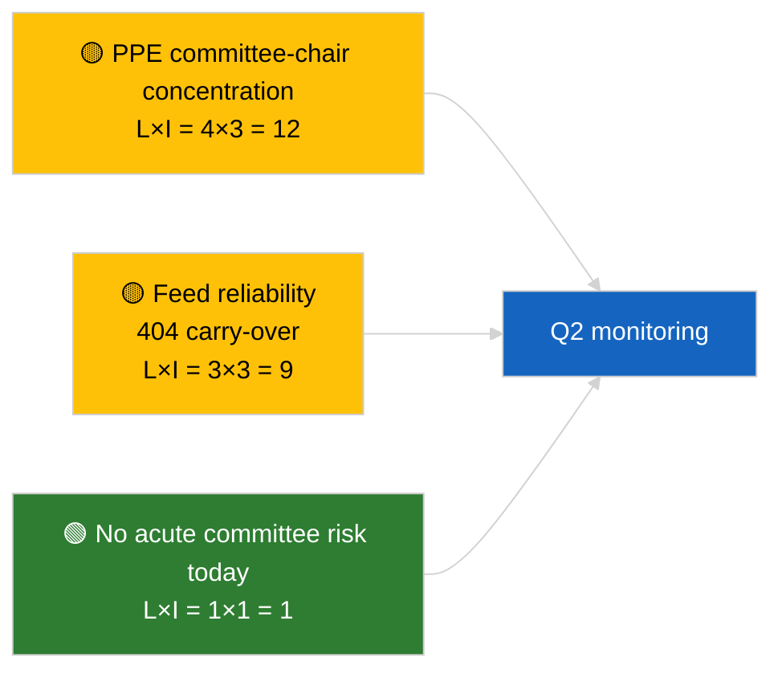
```mermaid
%%{init: {"theme":"dark"}}%%
graph LR
    R1["🟡 PPE committee-chair concentration<br/>L×I = 4×3 = 12"] --> CONS["Q2 monitoring"]
    R2["🟡 Feed reliability<br/>404 carry-over<br/>L×I = 3×3 = 9"] --> CONS
    R3["🟢 No acute committee risk today<br/>L×I = 1×1 = 1"] --> CONS
    style R1 fill:#FFC107,color:#000000
    style R2 fill:#FFC107,color:#000000
    style R3 fill:#2E7D32,color:#FFFFFF
    style CONS fill:#1565C0,color:#FFFFFF
```

| Risk | L | I | Score | Trigger | Source | Admiralty |
|------|:-:|:-:|:-----:|---------|--------|:---------:|
| PPE committee-chair concentration | 4 | 3 | 12 | Q2 rapporteur appointments | Structural | A2 |
| Feed-API reliability | 3 | 3 | 9 | Sustained 404 | Sibling breaking run | B2 |

---

### 🔮 Top Forward Trigger

**Committee work-week 13-17 April 2026** — first substantive Q2 committee-reports cycle.

---

### 🛡️ Source Quality Assessment

- **Primary sources:** EP Open Data Portal; run `b64d7ca7-e49c-4fb7-9203-9946d31bfcae`.
- **Data limitations:** Feed-API 404 carry-over from previous day.
- **Confidence:** 🟢 HIGH on calendar-driven inactivity.

---

### 📎 Links

| Link | Path |
|------|------|
| Article | `./article.md` |
| Sibling runs | `analysis/daily/2026-04-02/breaking/`, `motions/`, `propositions/` |
| Manifest | `./manifest.json` |

---

### 🔄 Cross-Reference

Concurrent 2026-04-02 runs all show identical empty-template output. Continues the 5+ day recess pattern logged since 2026-03-27.

---

**Document Control**
- **Template:** `/analysis/templates/executive-brief.md`
- **Artifact path:** `analysis/daily/2026-04-02/committee-reports/executive-brief.md`
- **Classification:** Public
- **Retrospective generation:** Back-fill session.

<h2 id="reader-intelligence-guide">Reader Intelligence Guide</h2>

Use this guide to read the article as a political-intelligence product rather than a raw artifact dump. High-value reader lenses appear first; technical provenance remains available in the audit appendices.

| Reader need | What you'll get | Source artifact |
|---|---|---|
| [BLUF and editorial decisions](#section-executive-brief) | fast answer to what happened, why it matters, who is accountable, and the next dated trigger | `executive-brief.md` |
| [Actors and forces](#section-actors-forces) | who is driving the story, what political forces line up behind them, and which institutional levers they can pull | `classification/actor-mapping.md` |
| [Coalitions and voting](#section-coalitions-voting) | political group alignment, voting evidence, and coalition pressure points | `existing/voting-patterns.md` |
| [Risk assessment](#section-risk) | policy, institutional, coalition, communications, and implementation risk register | `risk-scoring/risk-matrix.md` |
| [Threat landscape](#section-threat) | hostile actors, attack vectors, consequence trees, and legislative-disruption pathways | `threat-assessment/actor-threat-profiles.md` |
| [Cross-run continuity](#section-continuity) | what changed since prior sessions and how confidence shifted between runs | `existing/cross-session-intelligence.md` |
| [Deep analysis](#section-deep-analysis) | long-form Economist-style explanation for readers who want the full argument | `existing/deep-analysis.md` |
| [Supplementary intelligence](#section-supplementary-intelligence) | additional markdown discovered in the run that has not yet been assigned to a canonical section | `executive-brief_ar.md` |

<h2 id="section-actors-forces">Actors & Forces</h2>

### Actor Mapping

### Actors Identified: 0

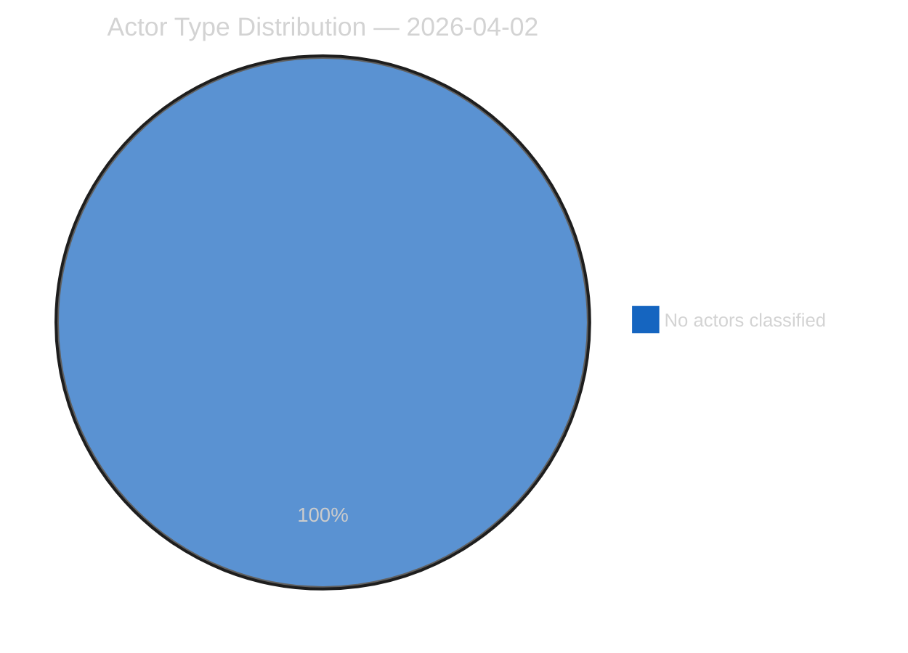
```mermaid
%%{init: {"theme":"dark","themeVariables":{"primaryColor":"#1565C0","primaryTextColor":"#ffffff","primaryBorderColor":"#0A3F7F","lineColor":"#90CAF9","secondaryColor":"#2E7D32","secondaryTextColor":"#ffffff","secondaryBorderColor":"#0F3F00","tertiaryColor":"#FF9800","tertiaryTextColor":"#000000","tertiaryBorderColor":"#7F4F00","mainBkg":"#1565C0","secondBkg":"#2E7D32","tertiaryBkg":"#FF9800","noteBkgColor":"#FFC107","noteTextColor":"#000000","noteBorderColor":"#7F6000","errorBkgColor":"#D32F2F","errorTextColor":"#ffffff","fontFamily":"Inter, Helvetica, Arial, sans-serif","pie1":"#1565C0","pie2":"#2E7D32","pie3":"#FF9800","pie4":"#D32F2F","pie5":"#FFC107","pie6":"#7B1FA2","pie7":"#9E9E9E","pie8":"#0288D1","pie9":"#388E3C","pie10":"#F57C00","pie11":"#C62828","pie12":"#FBC02D","pieTitleTextSize":"18px","pieSectionTextSize":"14px","pieLegendTextSize":"13px","pieStrokeColor":"#1e1e1e","pieOuterStrokeColor":"#1e1e1e","git0":"#1565C0","git1":"#2E7D32","git2":"#FF9800","git3":"#D32F2F","gitBranchLabel0":"#ffffff","gitBranchLabel1":"#ffffff","gitBranchLabel2":"#000000","gitBranchLabel3":"#ffffff","cScale0":"#1565C0","cScale1":"#2E7D32","cScale2":"#FF9800","cScale3":"#D32F2F","cScale4":"#FFC107","cScale5":"#7B1FA2","cScale6":"#9E9E9E","cScale7":"#0288D1","xyChart":{"backgroundColor":"#1e1e1e","plotColorPalette":"#1565C0,#2E7D32,#FF9800,#D32F2F,#FFC107,#7B1FA2,#9E9E9E"}}}}%%
pie title Actor Type Distribution — 2026-04-02
    "No actors classified" : 1
```

### Actor Classification

| Actor | Type | Influence | Position | Role |
|-------|------|-----------|----------|------|
| — | — | — | — | — |

### Type Counts

| Type | Count |
|------|-------|
| — | 0 |

### Date: 2026-04-02

### Forces Analysis

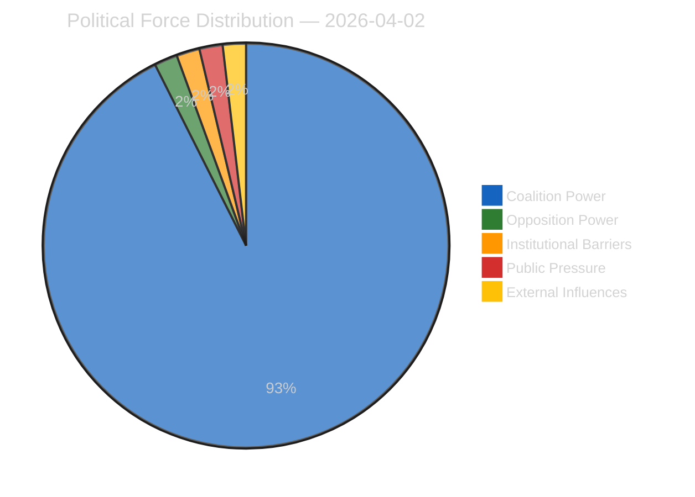
```mermaid
%%{init: {"theme":"dark","themeVariables":{"primaryColor":"#1565C0","primaryTextColor":"#ffffff","primaryBorderColor":"#0A3F7F","lineColor":"#90CAF9","secondaryColor":"#2E7D32","secondaryTextColor":"#ffffff","secondaryBorderColor":"#0F3F00","tertiaryColor":"#FF9800","tertiaryTextColor":"#000000","tertiaryBorderColor":"#7F4F00","mainBkg":"#1565C0","secondBkg":"#2E7D32","tertiaryBkg":"#FF9800","noteBkgColor":"#FFC107","noteTextColor":"#000000","noteBorderColor":"#7F6000","errorBkgColor":"#D32F2F","errorTextColor":"#ffffff","fontFamily":"Inter, Helvetica, Arial, sans-serif","pie1":"#1565C0","pie2":"#2E7D32","pie3":"#FF9800","pie4":"#D32F2F","pie5":"#FFC107","pie6":"#7B1FA2","pie7":"#9E9E9E","pie8":"#0288D1","pie9":"#388E3C","pie10":"#F57C00","pie11":"#C62828","pie12":"#FBC02D","pieTitleTextSize":"18px","pieSectionTextSize":"14px","pieLegendTextSize":"13px","pieStrokeColor":"#1e1e1e","pieOuterStrokeColor":"#1e1e1e","git0":"#1565C0","git1":"#2E7D32","git2":"#FF9800","git3":"#D32F2F","gitBranchLabel0":"#ffffff","gitBranchLabel1":"#ffffff","gitBranchLabel2":"#000000","gitBranchLabel3":"#ffffff","cScale0":"#1565C0","cScale1":"#2E7D32","cScale2":"#FF9800","cScale3":"#D32F2F","cScale4":"#FFC107","cScale5":"#7B1FA2","cScale6":"#9E9E9E","cScale7":"#0288D1","xyChart":{"backgroundColor":"#1e1e1e","plotColorPalette":"#1565C0,#2E7D32,#FF9800,#D32F2F,#FFC107,#7B1FA2,#9E9E9E"}}}}%%
pie title Political Force Distribution — 2026-04-02
    "Coalition Power" : 50
    "Opposition Power" : 1
    "Institutional Barriers" : 1
    "Public Pressure" : 1
    "External Influences" : 1
```

### Forces Data

| Force | Trend | Strength | Key Actors | Confidence |
|-------|-------|----------|------------|------------|
| Coalition Power | stable | 50% | — | low |
| Opposition Power | stable | 0% | — | low |
| Institutional Barriers | stable | 0% | — | low |
| Public Pressure | stable | 0% | — | low |
| External Influences | stable | 0% | — | low |

### Balance

| Metric | Value |
|--------|-------|
| Coalition vs Opposition | 50% vs 1% |
| Dominant force | Coalition |
| Date | 2026-04-02 |

### Date: 2026-04-02

### Impact Matrix

### Overall Significance: **ROUTINE**

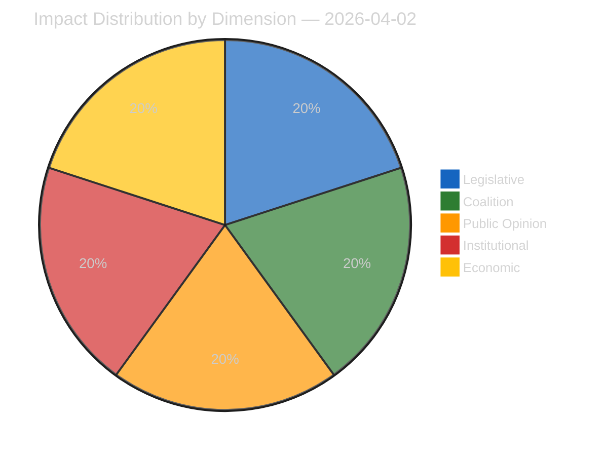
```mermaid
%%{init: {"theme":"dark","themeVariables":{"primaryColor":"#1565C0","primaryTextColor":"#ffffff","primaryBorderColor":"#0A3F7F","lineColor":"#90CAF9","secondaryColor":"#2E7D32","secondaryTextColor":"#ffffff","secondaryBorderColor":"#0F3F00","tertiaryColor":"#FF9800","tertiaryTextColor":"#000000","tertiaryBorderColor":"#7F4F00","mainBkg":"#1565C0","secondBkg":"#2E7D32","tertiaryBkg":"#FF9800","noteBkgColor":"#FFC107","noteTextColor":"#000000","noteBorderColor":"#7F6000","errorBkgColor":"#D32F2F","errorTextColor":"#ffffff","fontFamily":"Inter, Helvetica, Arial, sans-serif","pie1":"#1565C0","pie2":"#2E7D32","pie3":"#FF9800","pie4":"#D32F2F","pie5":"#FFC107","pie6":"#7B1FA2","pie7":"#9E9E9E","pie8":"#0288D1","pie9":"#388E3C","pie10":"#F57C00","pie11":"#C62828","pie12":"#FBC02D","pieTitleTextSize":"18px","pieSectionTextSize":"14px","pieLegendTextSize":"13px","pieStrokeColor":"#1e1e1e","pieOuterStrokeColor":"#1e1e1e","git0":"#1565C0","git1":"#2E7D32","git2":"#FF9800","git3":"#D32F2F","gitBranchLabel0":"#ffffff","gitBranchLabel1":"#ffffff","gitBranchLabel2":"#000000","gitBranchLabel3":"#ffffff","cScale0":"#1565C0","cScale1":"#2E7D32","cScale2":"#FF9800","cScale3":"#D32F2F","cScale4":"#FFC107","cScale5":"#7B1FA2","cScale6":"#9E9E9E","cScale7":"#0288D1","xyChart":{"backgroundColor":"#1e1e1e","plotColorPalette":"#1565C0,#2E7D32,#FF9800,#D32F2F,#FFC107,#7B1FA2,#9E9E9E"}}}}%%
pie title Impact Distribution by Dimension — 2026-04-02
    "Legislative" : 5
    "Coalition" : 5
    "Public Opinion" : 5
    "Institutional" : 5
    "Economic" : 5
```

### Impact Dimensions

| Dimension | Level | Indicator | Numeric |
|-----------|-------|-----------|---------|
| Legislative | none | 🟢 | 5 |
| Coalition | none | 🟢 | 5 |
| Public Opinion | none | 🟢 | 5 |
| Institutional | none | 🟢 | 5 |
| Economic | none | 🟢 | 5 |

### Summary

| Metric | Value |
|--------|-------|
| Overall significance | ROUTINE |
| Highest impact | Legislative |
| Date | 2026-04-02 |

### Date: 2026-04-02

### Significance Assessment

### Overall Significance: **ROUTINE**

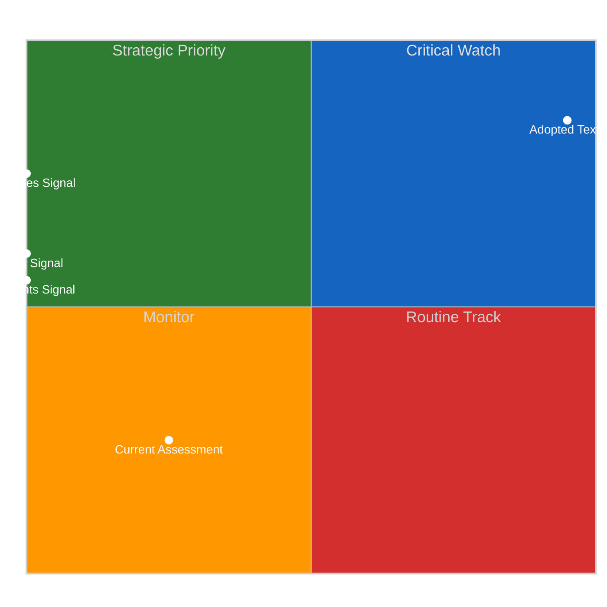
```mermaid
%%{init: {
  "theme": "dark",
  "themeVariables": {
    "quadrant1Fill": "#1565C0",
    "quadrant2Fill": "#2E7D32",
    "quadrant3Fill": "#FF9800",
    "quadrant4Fill": "#D32F2F",
    "quadrantTitleFill": "#ffffff",
    "quadrantPointFill": "#ffffff",
    "quadrantPointTextFill": "#ffffff",
    "quadrantXAxisTextFill": "#ffffff",
    "quadrantYAxisTextFill": "#ffffff"
  },
  "quadrantChart": {
    "chartWidth": 700,
    "chartHeight": 700,
    "pointLabelFontSize": 14,
    "titleFontSize": 22,
    "quadrantLabelFontSize": 18,
    "xAxisLabelFontSize": 16,
    "yAxisLabelFontSize": 16
  }
}}%%
quadrantChart
    title Political Significance Assessment — 2026-04-02
    x-axis Low Volume --> High Volume
    y-axis Low Impact --> High Impact
    quadrant-1 Critical Watch
    quadrant-2 Strategic Priority
    quadrant-3 Monitor
    quadrant-4 Routine Track
    Current Assessment: [0.25, 0.25]
    Events Signal: [0.00, 0.60]
    Documents Signal: [0.00, 0.55]
    Procedures Signal: [0.00, 0.75]
    Adopted Texts: [0.95, 0.85]
```

### 5-Signal Model Scores

| Signal | Raw Data | Score |
|--------|----------|-------|
| Volume | 0 events, 0 documents | 0.0/5 |
| Pipeline | 0 procedures | 0.0/5 |
| Output | 30 adopted texts | 5.0/5 |
| Anomalies | Pattern deviation detection | — |
| Coalition | Group alignment analysis | — |

### Data Summary

| Metric | Value |
|--------|-------|
| Computed significance | ROUTINE |
| Total data points | 30 |
| Events | 0 |
| Documents | 0 |
| Procedures | 0 |
| Adopted texts | 30 |
| Date | 2026-04-02 |

### Date: 2026-04-02

<h2 id="section-coalitions-voting">Coalitions & Voting</h2>

### Voting Patterns

### Overview
Detection and analysis of voting trends across European Parliament proceedings.

### Detected Trends
| Trend ID | Direction | Confidence | Data Points |
|----------|-----------|------------|-------------|
| No trend data available | — | — | — |

### Summary
- **Trends identified**: 0
- **Records analysed**: 0
- **Date**: 2026-04-02

<h2 id="section-risk">Risk Assessment</h2>

### Risk Matrix

### Overview

Quantitative risk scoring across 0 identified political dimensions.
This matrix uses a standardized likelihood × impact framework to quantify and
prioritize political risks affecting the European Parliament legislative process.

### Risk Heat Map

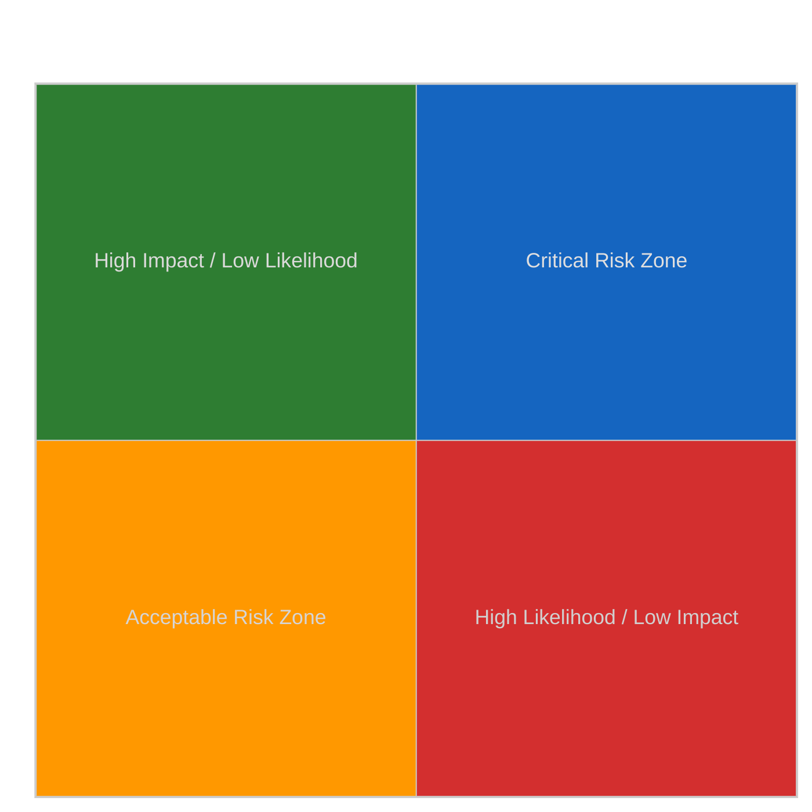
```mermaid
%%{init: {
  "theme": "dark",
  "themeVariables": {
    "quadrant1Fill": "#1565C0",
    "quadrant2Fill": "#2E7D32",
    "quadrant3Fill": "#FF9800",
    "quadrant4Fill": "#D32F2F",
    "quadrantTitleFill": "#ffffff",
    "quadrantPointFill": "#ffffff",
    "quadrantPointTextFill": "#ffffff",
    "quadrantXAxisTextFill": "#ffffff",
    "quadrantYAxisTextFill": "#ffffff"
  },
  "quadrantChart": {
    "chartWidth": 700,
    "chartHeight": 700,
    "pointLabelFontSize": 14,
    "titleFontSize": 22,
    "quadrantLabelFontSize": 18,
    "xAxisLabelFontSize": 16,
    "yAxisLabelFontSize": 16
  }
}}%%
quadrantChart
    title Political Risk Heat Map — 2026-04-02
    x-axis Low Likelihood --> High Likelihood
    y-axis Low Impact --> High Impact
    quadrant-1 Critical Risk Zone
    quadrant-2 High Impact / Low Likelihood
    quadrant-3 Acceptable Risk Zone
    quadrant-4 High Likelihood / Low Impact

```

### Risk Matrix

| Risk ID | Description | Likelihood | Impact | Score | Level |
|---------|-------------|------------|--------|-------|-------|
| — | — | — | — | — | — |

> **Risk Score** = Likelihood × Impact. **Levels**: 🟢 LOW (≤1.0), 🟡 MEDIUM (≤2.0), 🟠 HIGH (≤3.5), 🔴 CRITICAL (>3.5)

### Risk Assessment Details

| — | — | — | — | — | — |

### Risk Mitigation Framework

| Risk Level | Count | Tolerance | Action Required |
|------------|-------|-----------|-----------------|
| 🔴 CRITICAL | 0 | Zero tolerance | Immediate escalation |
| 🟠 HIGH | 0 | Low tolerance | Active mitigation |
| 🟡 MEDIUM | 0 | Moderate | Enhanced monitoring |
| 🟢 LOW | 0 | Acceptable | Routine tracking |

### Date: 2026-04-02

### Quantitative Swot

### Executive Summary

**Strategic Position Score**: 2.0/10
**Overall Assessment**: Weak strategic position: weaknesses and threats dominate — urgent mitigation needed.
**Analysis Date**: 2026-04-02

> This SWOT analysis is derived from 0 procedures, 0 events, 30 adopted texts, 0 documents, 0 voting records, and 0 coalition data points fetched from the European Parliament.

### SWOT Quadrant Chart

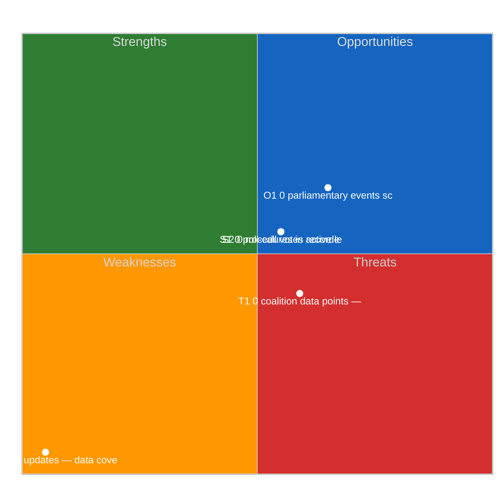
```mermaid
%%{init: {
  "theme": "dark",
  "themeVariables": {
    "quadrant1Fill": "#1565C0",
    "quadrant2Fill": "#2E7D32",
    "quadrant3Fill": "#FF9800",
    "quadrant4Fill": "#D32F2F",
    "quadrantTitleFill": "#ffffff",
    "quadrantPointFill": "#ffffff",
    "quadrantPointTextFill": "#ffffff",
    "quadrantXAxisTextFill": "#ffffff",
    "quadrantYAxisTextFill": "#ffffff"
  },
  "quadrantChart": {
    "chartWidth": 700,
    "chartHeight": 700,
    "pointLabelFontSize": 14,
    "titleFontSize": 22,
    "quadrantLabelFontSize": 18,
    "xAxisLabelFontSize": 16,
    "yAxisLabelFontSize": 16
  }
}}%%
quadrantChart
    title Political SWOT — Strategic Position (2026-04-02)
    x-axis Low Impact --> High Impact
    y-axis Low Priority --> High Priority
    quadrant-1 Opportunities
    quadrant-2 Strengths
    quadrant-3 Weaknesses
    quadrant-4 Threats
    S1 0 procedures in active le: [0.55, 0.55]
    S2 0 roll-call votes recorde: [0.55, 0.55]
    W1 0 MEP updates — data cove: [0.05, 0.05]
    O1 0 parliamentary events sc: [0.65, 0.65]
    T1 0 coalition data points —: [0.59, 0.41]
```

### SWOT Overview

| Category | Items | Avg Score | Trend |
|----------|-------|-----------|-------|
| 🟢 Strengths | 2 | 0.0 | stable |
| 🔴 Weaknesses | 1 | 5.0 | stable |
| 🔵 Opportunities | 1 | 1.5 | stable |
| 🟠 Threats | 1 | 0.9 | stable |

### 🟢 Strengths

#### S1: 0 procedures in active legislative pipeline
- **Score**: 0.0/5
- **Confidence**: low
- **Trend**: stable
- **Evidence**:
  - 0 procedures tracked in current period
  - 30 texts adopted
  - 0 documents published

#### S2: 0 roll-call votes recorded with 0 questions
- **Score**: 0.0/5
- **Confidence**: low
- **Trend**: stable
- **Evidence**:
  - 0 voting records available
  - 0 parliamentary questions filed
  - 0 MEP activity updates

### 🔴 Weaknesses

#### W1: 0 MEP updates — data coverage gap assessment
- **Score**: 5.0/5
- **Confidence**: medium
- **Trend**: stable
- **Evidence**:
  - 0 MEP updates in current period
  - 0 documents vs 0 procedures ratio
  - Data freshness depends on EP feed update frequency

### 🔵 Opportunities

#### O1: 0 parliamentary events scheduled
- **Score**: 1.5/5
- **Confidence**: medium
- **Trend**: stable
- **Evidence**:
  - 0 events in analysis period
  - 30 texts adopted indicates legislative throughput
  - 0 procedures in various stages

### 🟠 Threats

#### T1: 0 coalition data points — cohesion monitoring
- **Score**: 0.9/5
- **Confidence**: low
- **Trend**: stable
- **Evidence**:
  - 0 coalition observations recorded
  - Cross-reference with 0 voting records
  - 0 procedures may be affected by coalition shifts

### Cross-Impact Matrix

| Interaction | Net Effect | Rationale |
|-------------|-----------|----------|
| strength #1 × threat #1 | 0.00 | Strength "0 procedures in active legislative pipeline" partially mitigates threat "0 coalition data points — cohesion monitoring" |
| strength #2 × threat #1 | 0.00 | Strength "0 roll-call votes recorded with 0 questions" partially mitigates threat "0 coalition data points — cohesion monitoring" |
| weakness #1 × threat #1 | 0.75 | Weakness "0 MEP updates — data coverage gap assessment" amplifies threat "0 coalition data points — cohesion monitoring" |

### Strategic Priorities Matrix

### Data Summary

| Data Source | Count |
|-------------|-------|
| Procedures | 0 |
| Events | 0 |
| Documents | 0 |
| Voting Records | 0 |
| Adopted Texts | 30 |
| Coalitions | 0 |
| Questions | 0 |
| MEP Updates | 0 |
| **Total Data Points** | **30** |

### Date: 2026-04-02

### Political Capital Risk

### Data Inventory for Capital Risk Assessment
| Data Source | Count | Relevance |
|-------------|-------|-----------|
| Coalition data points | 0 | Group cohesion indicators |
| Voting records | 0 | Voting alignment metrics |
| Voting patterns | 0 | Trend and anomaly data |
| Active procedures | 0 | Legislative engagement |

### Date: 2026-04-02

### Legislative Velocity Risk

### Overview
Risk assessment based on legislative processing speed for 0 procedures.

### Top Velocity Risks
| Procedure | Title | Stage | Days (actual/expected) | Risk Score | Level |
|-----------|-------|-------|----------------------|------------|-------|
| — | — | — | — | — | — |

### Summary
- **Procedures analysed**: 0
- **High/Critical risks**: 0
- **Date**: 2026-04-02

### Agent Risk Workflow

### Risk Heat Map

| Impact ↓ / Likelihood → | Rare | Unlikely | Possible | Likely | Almost Certain |
|--------------------------|------|----------|----------|--------|----------------|
| **Severe** | 🟢 | 🟡 | 🟠 | 🟠 | 🔴 |
| **Major** | 🟢 | 🟡 | 🟡 | 🟠 | 🔴 |
| **Moderate** | 🟢 | 🟢 | 🟡 | 🟠 | 🟠 |
| **Minor** | 🟢 | 🟢 | 🟢 | 🟡 | 🟡 |
| **Negligible** | 🟢 | 🟢 | 🟢 | 🟢 | 🟢 |

### Identified Risks

#### RISK-W00: Baseline political risk
- **Likelihood**: rare (0.1) | **Impact**: minor (2) | **Score**: 0.2 (LOW) | **Confidence**: low
- **Evidence**: Routine parliamentary activity
- **Mitigating Factors**: Stable institutional framework

### Risk Evaluation Matrix

| Rank | Risk ID | Description | Score | Level | Confidence |
|------|---------|-------------|-------|-------|------------|
| 1 | RISK-W00 | Baseline political risk | 0.2 | LOW | low |

### Risk Treatment Plan

- Monitor legislative velocity indicators
- Track coalition voting patterns

### Recommendations

- Monitor legislative velocity indicators
- Track coalition voting patterns

<h2 id="section-threat">Threat Landscape</h2>

### Actor Threat Profiles

### Overview
Individual threat profiles for 0 political actors.

### Actor Threat Matrix
| Actor | Type | Capability | Motivation | Opportunity | Threat Level |
|-------|------|------------|------------|-------------|--------------|
| — | — | — | — | — | — |

### Date: 2026-04-02

### Consequence Trees

### Overview
Structured analysis of action-consequence chains for 0 legislative procedures.

### No procedures available for consequence analysis

### Date: 2026-04-02

### Legislative Disruption

### Overview
Identification of factors disrupting the normal legislative process.

### Disruption Assessment
| Procedure ID | Title | Stage | Resilience | Disruption Points |
|-------------|-------|-------|-----------|-------------------|
| — | — | — | — | — |

### Date: 2026-04-02

### Political Threat Landscape

### Political Threat Landscape Analysis

#### Coalition Shifts
**Threat Level**: 🟢 Low

Coalition stability appears maintained. No significant realignment signals.

**Evidence:**
- No coalition shift signals detected in available data

#### Transparency Deficit
**Threat Level**: ⚠️ Moderate

Transparency concerns at moderate level. Review committee meeting records and public documentation.

**Evidence:**
- No committee activity data available — potential information gap

#### Policy Reversal
**Threat Level**: 🟢 Low

Legislative trajectory appears stable. No major reversal signals.

**Evidence:**
- No significant policy reversal signals detected

#### Institutional Pressure
**Threat Level**: 🟢 Low

Institutional balance appears maintained. Power distribution within normal parameters.

**Evidence:**
- No institutional threat signals detected

#### Legislative Obstruction
**Threat Level**: 🟢 Low

Legislative pace within normal parameters. No obstruction signals.

**Evidence:**
- No significant legislative delay signals detected

#### Democratic Erosion
**Threat Level**: 🟢 Low

Democratic norms appear stable. Institutional processes functioning within expected parameters.

**Evidence:**
- Democratic norms appear stable. No systematic erosion signals.

### Actor Threat Profiles

*No actor threat profiles generated from available data.*

### Consequence Trees

#### Consequence Tree: Standard legislative activity assessment

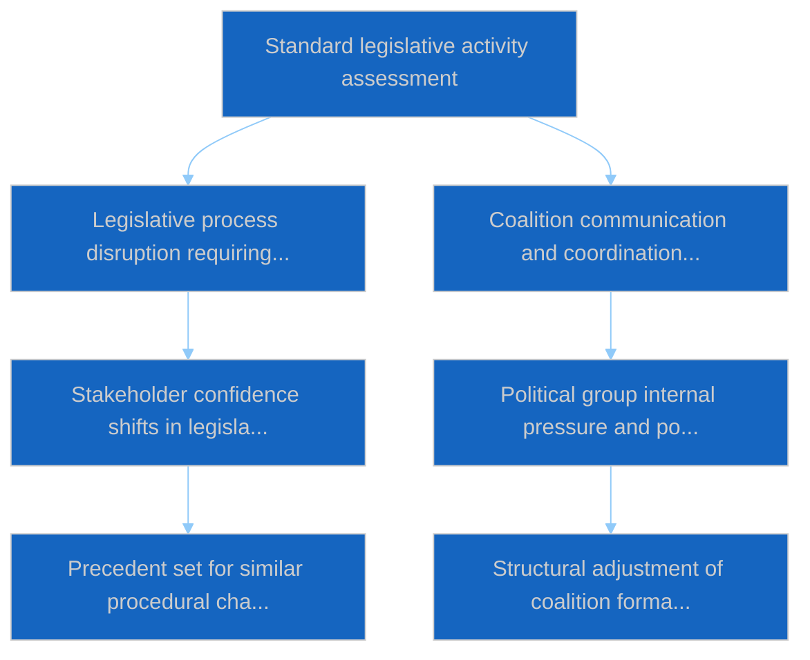
```mermaid
%%{init: {"theme":"dark","themeVariables":{"primaryColor":"#1565C0","primaryTextColor":"#ffffff","primaryBorderColor":"#0A3F7F","lineColor":"#90CAF9","secondaryColor":"#2E7D32","secondaryTextColor":"#ffffff","secondaryBorderColor":"#0F3F00","tertiaryColor":"#FF9800","tertiaryTextColor":"#000000","tertiaryBorderColor":"#7F4F00","mainBkg":"#1565C0","secondBkg":"#2E7D32","tertiaryBkg":"#FF9800","noteBkgColor":"#FFC107","noteTextColor":"#000000","noteBorderColor":"#7F6000","errorBkgColor":"#D32F2F","errorTextColor":"#ffffff","fontFamily":"Inter, Helvetica, Arial, sans-serif","pie1":"#1565C0","pie2":"#2E7D32","pie3":"#FF9800","pie4":"#D32F2F","pie5":"#FFC107","pie6":"#7B1FA2","pie7":"#9E9E9E","pie8":"#0288D1","pie9":"#388E3C","pie10":"#F57C00","pie11":"#C62828","pie12":"#FBC02D","pieTitleTextSize":"18px","pieSectionTextSize":"14px","pieLegendTextSize":"13px","pieStrokeColor":"#1e1e1e","pieOuterStrokeColor":"#1e1e1e","git0":"#1565C0","git1":"#2E7D32","git2":"#FF9800","git3":"#D32F2F","gitBranchLabel0":"#ffffff","gitBranchLabel1":"#ffffff","gitBranchLabel2":"#000000","gitBranchLabel3":"#ffffff","cScale0":"#1565C0","cScale1":"#2E7D32","cScale2":"#FF9800","cScale3":"#D32F2F","cScale4":"#FFC107","cScale5":"#7B1FA2","cScale6":"#9E9E9E","cScale7":"#0288D1","xyChart":{"backgroundColor":"#1e1e1e","plotColorPalette":"#1565C0,#2E7D32,#FF9800,#D32F2F,#FFC107,#7B1FA2,#9E9E9E"}}}}%%
graph TD
    A["Standard legislative activity assessment"]
    B0["Legislative process disruption requiring..."]
    A --> B0
    B1["Coalition communication and coordination..."]
    A --> B1
    C0["Stakeholder confidence shifts in legisla..."]
    B0 --> C0
    C1["Political group internal pressure and po..."]
    B1 --> C1
    D0["Precedent set for similar procedural cha..."]
    C0 --> D0
    D1["Structural adjustment of coalition forma..."]
    C1 --> D1
```

**Mitigating Factors:**
- Institutional resilience mechanisms
- Cross-party dialogue channels

**Amplifying Factors:**
- No significant amplifying factors identified

### Legislative Disruption Analysis

#### Procedure: General legislative pipeline

**Current Stage**: proposal | **Resilience**: high

| Stage | Threat Category | Likelihood | Risk Level |
|-------|----------------|------------|------------|
| proposal | delay | 8% | 🟢 Low |
| committee | transparency | 18% | 🟢 Low |
| plenary first reading | shift | 22% | 🟢 Low |
| council position | delay | 12% | 🟢 Low |
| plenary second reading | shift | 21% | 🟢 Low |
| conciliation | reversal | 17% | 🟢 Low |
| adoption | delay | 5% | 🟢 Low |

**Alternative Pathways:**
- Commission resubmission with revised proposal
- Enhanced informal trilogue engagement
- Interim resolution as procedural bridge

### Key Findings

- No high-priority threats detected across threat landscape dimensions

### Recommendations

- Continue routine monitoring of parliamentary activity

---
*Assessment generated by EU Parliament Monitor Political Threat Assessment Pipeline.*  
*Based on public European Parliament data. GDPR-compliant.*

<h2 id="section-continuity">Cross-Run Continuity</h2>

### Cross Session Intelligence

### Overview
Analysis of coalition stability patterns across multiple plenary sessions.

### Stability Report
- **Overall Stability**: 0.0%
- **Forecast**: volatile
- **Patterns Analysed**: 0

### Group Analysis
- **Stable Groups**: None identified
- **Declining Groups**: None identified

### Date: 2026-04-02

<h2 id="section-deep-analysis">Deep Analysis</h2>

### Raw Data Inventory
| Data Source | Count |
|-------------|-------|
| Events | 0 |
| Procedures | 0 |
| Documents | 0 |
| Adopted Texts | 30 |
| Questions | 0 |
| MEP Updates | 0 |
| **Total** | **30** |

### Stakeholder Groups for AI Analysis
| Stakeholder Group | Data Points Available |
|-------------------|---------------------|
| Political Groups | 30 (procedures + adopted texts) |
| Civil Society | 0 (documents + questions) |
| Industry | 0 (procedures) |
| National Governments | 30 (adopted texts) |
| Citizens | 0 (questions + MEP updates) |
| EU Institutions | 0 (events + procedures) |

### Date: 2026-04-02

<h2 id="section-supplementary-intelligence">Supplementary Intelligence</h2>

### Executive Brief Ar

**التصنيف:** OSINT | سجل برلماني عام
**الموثوقية:** 🟢 عالية (تقييم هيكلي خلال فترة عطلة البرلمان)
**تاريخ الإنشاء:** 2026-04-02T00:00:00Z (إحاطة استعادية)
**نوع المقال:** تقارير اللجان
**معرّف التشغيل:** `b64d7ca7-e49c-4fb7-9203-9946d31bfcae`
**المصدر:** البوابة المفتوحة للبيانات للبرلمان الأوروبي

---

### 🎯 BLUF

**لا تقارير لجان جديدة في 2026-04-02؛ أسبوع العطلة البرلمانية 2 من أصل 4 مستمر.** أعاد التشغيل `b64d7ca7-e49c-4fb7-9203-9946d31bfcae` **صفر فاعلين مصنّفين** ودرجة أهمية **روتينية** في جميع الأبعاد، مطابقة لحالة النموذج في 2026-04-01/committee-reports. يبقى الخط الأساسي الموضوعي للجان هو الإرث المنقول من مارس: ECON (نائب رئيس البنك المركزي الأوروبي TA-10-2026-0060)، TRAN/ENVI (انبعاثات المركبات الثقيلة TA-10-2026-0084)، JURI (حصانة براون TA-10-2026-0088)، AFET (جورجيا TA-10-2026-0083). **🟢 ثقة عالية** في الحالة الفارغة المدفوعة بالتقويم.

---

### 🧭 3 قرارات تدعمها هذه الإحاطة

| # | القرار | من يقرّر | الموعد النهائي | الدليل |
|:-:|--------|----------|:--------------:|--------|
| 1 | **تحريري:** تجاهل تقارير اللجان يومياً | المحرر | +24 ساعة | نتيجة تشغيل فارغة |
| 2 | **مراقبة:** صيانة فحص صحة `get_committee_documents_feed` | خط أنابيب البيانات | +24 ساعة | نمط 404 مستمر |
| 3 | **رصد مستقبلي:** أسبوع عمل اللجان 13-17 أبريل لتقارير الربع الثاني الجوهرية | رئيس التحليل | 2026-04-13 | دورة ما قبل الجلسة العامة |

---

### 📰 قراءة 60 ثانية

- 🔴 **لا وثائق لجان مفهرسة** اليوم؛ أسبوع عطلة، لا اجتماعات لجان مجدولة. (🟢 عالية)
- 🟠 **صفر فاعلين مصنّفين**؛ لا مقرّرين أو مقرّرين ظل أو رؤساء لجان محددين. (🟢 عالية)
- 🟢 **الخط الأساسي المنقول للجان:** تبقى محافظ ECON وTRAN/ENVI وJURI وAFET أسطحاً نشطة للربع الثاني. (🟢 عالية)
- 🟡 **جميع أبعاد المخاطر «لا شيء»** — لا مخاطر حادة في اللجان اليوم. (🟢 عالية)
- 🔵 **السياق الاقتصادي:** تأكيد ECON للبنك المركزي الأوروبي يوفر مرساة مؤسسية للربع الثاني. (🟢 عالية)
- 🟣 **الإسناد المتبادل:** تظهر جميع التشغيلات المتوازية في 2026-04-02 نماذج فارغة؛ نمط عطلة شامل للنظام. (🟢 عالية)
- 🩷 **متجه الاضطراب:** لا شيء حاد اليوم. (🟢 عالية)
- ⚪ **منقول:** ملف INTA للاتحاد الأوروبي-ميركوسور ينتظر رأي محكمة العدل الأوروبية.

---

### 🗂️ أبرز الوثائق / جدول الإجراءات

| الترتيب | المرجع في البرلمان | العنوان (مختصر) | الأهمية | الموثوقية | الحالة |
|:-------:|-------------------|-----------------|:-------:|:---------:|--------|
| 1 | — | لا تقارير لجان في 2026-04-02 | 0.0 | 🟢 عالية | عطلة — لا نشاط |
| 2 | TA-10-2026-0060 | ECON — نائب رئيس البنك المركزي الأوروبي (منقول) | 7.5 | 🟢 عالية | خط Q2 الأساسي |
| 3 | TA-10-2026-0084 | TRAN/ENVI — انبعاثات المركبات الثقيلة (منقول) | 7.0 | 🟢 عالية | مراقبة النقل |

---

### ⚠️ لمحة عن المخاطر والتهديدات

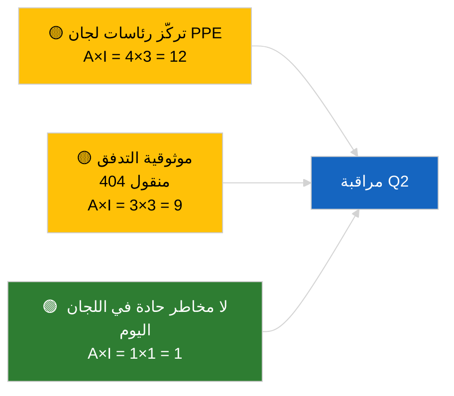
```mermaid
%%{init: {"theme":"dark"}}%%
graph LR
    R1["🟡 تركّز رئاسات لجان PPE<br/>A×I = 4×3 = 12"] --> CONS["مراقبة Q2"]
    R2["🟡 موثوقية التدفق<br/>404 منقول<br/>A×I = 3×3 = 9"] --> CONS
    R3["🟢 لا مخاطر حادة في اللجان اليوم<br/>A×I = 1×1 = 1"] --> CONS
    style R1 fill:#FFC107,color:#000000
    style R2 fill:#FFC107,color:#000000
    style R3 fill:#2E7D32,color:#FFFFFF
    style CONS fill:#1565C0,color:#FFFFFF
```

| المخاطرة | أ | I | الدرجة | المحرّك | المصدر | الأميرالية |
|---------|:-:|:-:|:------:|---------|--------|:----------:|
| تركّز رئاسات لجان PPE | 4 | 3 | 12 | تعيينات مقرري الربع الثاني | هيكلي | A2 |
| موثوقية واجهة API للتدفق | 3 | 3 | 9 | 404 مستمر | تشغيل موازٍ breaking | B2 |

---

### 🔮 أبرز محفّز مستقبلي

**أسبوع عمل اللجان 13-17 أبريل 2026** — أول دورة جوهرية لتقارير لجان الربع الثاني.

---

### 🛡️ تقييم جودة المصادر

- **المصادر الأولية:** البوابة المفتوحة للبيانات للبرلمان الأوروبي؛ التشغيل `b64d7ca7-e49c-4fb7-9203-9946d31bfcae`.
- **قيود البيانات:** واجهة API للتدفق 404 منقولة من اليوم السابق.
- **الموثوقية:** 🟢 عالية للخمول المدفوع بالتقويم.

---

### 📎 الروابط

| الرابط | المسار |
|--------|--------|
| المقال | `./article.md` |
| التشغيلات الموازية | `analysis/daily/2026-04-02/breaking/`, `motions/`, `propositions/` |
| البيان | `./manifest.json` |

---

### 🔄 الإسناد المتبادل

تُظهر جميع التشغيلات المتوازية في 2026-04-02 نتيجة نموذج فارغ مطابقة. يستمر نمط العطلة لمدة 5 أيام أو أكثر المسجّل منذ 2026-03-27.

---

**ضبط الوثيقة**
- **النموذج:** `/analysis/templates/executive-brief.md`
- **مسار المنتج:** `analysis/daily/2026-04-02/committee-reports/executive-brief.md`
- **التصنيف:** عام
- **الإنشاء الاستعادي:** جلسة التعبئة الخلفية.

### Executive Brief Da

### 🎯 BLUF

**Ingen nye udvalgsbetænkninger den 2026-04-02; recessuge 2 af 4 fortsætter.** Kørsel `b64d7ca7-e49c-4fb7-9203-9946d31bfcae` returnerede **0 klassificerede aktører** og **RUTINE**-signifikans i alle dimensioner, identisk med skabelonstatus for 2026-04-01/committee-reports. Det substantielle udvalgsbaseline er fortsat marts-overdragelsen: ECON (ECB's vicepræsident TA-10-2026-0060), TRAN/ENVI (HDV-emissioner TA-10-2026-0084), JURI (Braun-immunitet TA-10-2026-0088), AFET (Georgien TA-10-2026-0083). **🟢 HØJ tillid** for kalender-drevet tom tilstand.

---

### 🧭 3 Beslutninger denne briefing understøtter

| # | Beslutning | Hvem beslutter | Frist | Dokumentation |
|:-:|-----------|----------------|:-----:|---------------|
| 1 | **Redaktionelt:** SPRING committee-reports dagligt OVER | Redaktør | +24h | Tom kørselsoutput |
| 2 | **Overvågning:** oprethold `get_committee_documents_feed` sundhedstjek | Datapipeline | +24h | Løbende 404-mønster |
| 3 | **Fremtidsvagt:** udvalgsarbejdsuge 13-17 april for substantielle Q2-betænkninger | Analyseleder | 2026-04-13 | Præ-plenumcyklus |

---

### 📰 60-sekunders læsning

- 🔴 **Ingen udvalgsdokumenter indekseret** i dag; recessuge, ingen udvalgsmøder planlagt. (🟢 Høj)
- 🟠 **0 aktører klassificeret**; ingen ordførere, skyggeordførere eller udvalgsformænd identificeret. (🟢 Høj)
- 🟢 **Udvalgets overdragelsesbaseline:** ECON, TRAN/ENVI, JURI, AFET-porteføljer er fortsat aktive Q2-overflader. (🟢 Høj)
- 🟡 **Alle risicodimensioner "ingen"** — ingen akut udvalgsrisiko i dag. (🟢 Høj)
- 🔵 **Økonomisk kontekst:** ECON's ECB-bekræftelse giver Q2 institutionelt anker. (🟢 Høj)
- 🟣 **Krydshenvising:** parallelle kørsler 2026-04-02 alle tomme skabeloner; systemdækkende recessmønster. (🟢 Høj)
- 🩷 **Forstyrrelsesvektorer:** ingen akutte i dag. (🟢 Høj)
- ⚪ **Overføres:** EU-Mercosur INTA-sag afventer EUD-udtalelse.

---

### 🗂️ Topdokumenter / Procedurtabel

| Rang | EP-reference | Titel (kort) | Signifikans | Tillid | Status |
|:----:|--------------|--------------|:-----------:|:------:|--------|
| 1 | — | Ingen udvalgsbetænkninger 2026-04-02 | 0,0 | 🟢 HØJ | Recess — ingen aktivitet |
| 2 | TA-10-2026-0060 | ECON — ECB's vicepræsident (overdraget) | 7,5 | 🟢 HØJ | Q2-baseline |
| 3 | TA-10-2026-0084 | TRAN/ENVI — HDV-emissioner (overdraget) | 7,0 | 🟢 HØJ | Transpositionsovervågning |

---

### ⚠️ Risiko- og trusselbillede

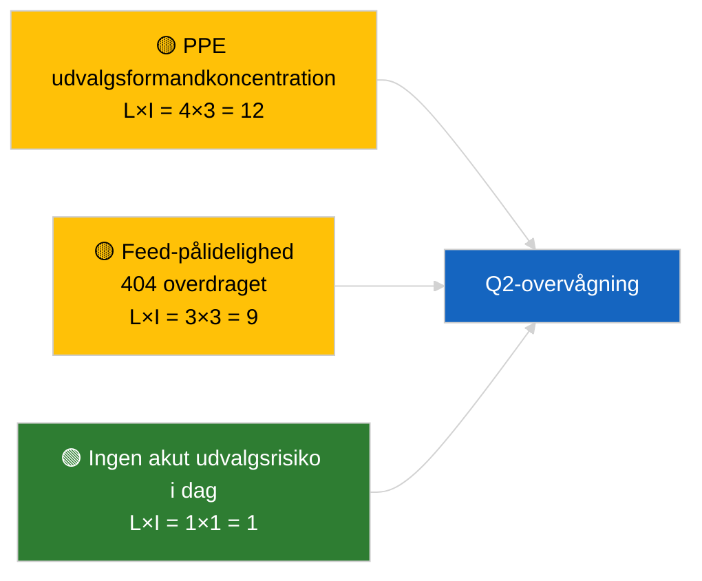
```mermaid
%%{init: {"theme":"dark"}}%%
graph LR
    R1["🟡 PPE udvalgsformandkoncentration<br/>L×I = 4×3 = 12"] --> CONS["Q2-overvågning"]
    R2["🟡 Feed-pålidelighed<br/>404 overdraget<br/>L×I = 3×3 = 9"] --> CONS
    R3["🟢 Ingen akut udvalgsrisiko i dag<br/>L×I = 1×1 = 1"] --> CONS
    style R1 fill:#FFC107,color:#000000
    style R2 fill:#FFC107,color:#000000
    style R3 fill:#2E7D32,color:#FFFFFF
    style CONS fill:#1565C0,color:#FFFFFF
```

| Risiko | S | I | Score | Udløser | Kilde | Admiralitet |
|--------|:-:|:-:|:-----:|---------|-------|:-----------:|
| PPE udvalgsformandkoncentration | 4 | 3 | 12 | Q2 ordførerforordninger | Strukturel | A2 |
| Feed-API-pålidelighed | 3 | 3 | 9 | Vedvarende 404 | Søsterløb breaking | B2 |

---

### 🔮 Vigtigste fremtidige udløser

**Udvalgsarbejdsuge 13-17 april 2026** — første substantielle Q2 udvalgsbetæknignscyklus.

---

### 🛡️ Kildekvalitetsvurdering

- **Primære kilder:** EP's åbne dataportal; kørsel `b64d7ca7-e49c-4fb7-9203-9946d31bfcae`.
- **Databegrænsninger:** Feed-API 404 overdraget fra forrige dag.
- **Tillid:** 🟢 HØJ for kalender-drevet inaktivitet.

---

### 📎 Links

| Link | Sti |
|------|-----|
| Artikel | `./article.md` |
| Søsterløb | `analysis/daily/2026-04-02/breaking/`, `motions/`, `propositions/` |
| Manifest | `./manifest.json` |

---

### 🔄 Krydshenvising

Samtlige parallelle kørsler 2026-04-02 viser identisk tom skabelonoutput. Fortsætter det 5+ dages recessmønster logget siden 2026-03-27.

---

**Dokumentkontrol**
- **Skabelon:** `/analysis/templates/executive-brief.md`
- **Artefaktsti:** `analysis/daily/2026-04-02/committee-reports/executive-brief.md`
- **Klassifikation:** Offentlig
- **Retrospektiv generering:** Back-fill-session.

### Executive Brief De

### 🎯 BLUF

**Keine neuen Ausschussberichte am 2026-04-02; Recesswoche 2 von 4 dauert an.** Lauf `b64d7ca7-e49c-4fb7-9203-9946d31bfcae` lieferte **0 klassifizierte Akteure** und **ROUTINE**-Signifikanz in allen Dimensionen, identisch mit dem Vorlagestatus für 2026-04-01/committee-reports. Die sachliche Ausschuss-Grundlinie bleibt der März-Übertrag: ECON (Vizepräsident der EZB TA-10-2026-0060), TRAN/ENVI (Schwere-Nutzfahrzeug-Emissionen TA-10-2026-0084), JURI (Braun-Immunität TA-10-2026-0088), AFET (Georgien TA-10-2026-0083). **🟢 HOHE Verlässlichkeit** für kalendergesteuerten Leerstand.

---

### 🧭 3 Entscheidungen, die dieses Briefing unterstützt

| # | Entscheidung | Wer entscheidet | Frist | Belege |
|:-:|-------------|-----------------|:-----:|--------|
| 1 | **Redaktionell:** committee-reports täglich ÜBERSPRINGEN | Redakteur | +24h | Leere Laufausgabe |
| 2 | **Überwachung:** `get_committee_documents_feed` Gesundheitscheck aufrechterhalten | Datenpipeline | +24h | Anhaltendes 404-Muster |
| 3 | **Vorschau:** Ausschuss-Arbeitswoche 13.–17. April für substanzielle Q2-Berichte | Analyseleiter | 2026-04-13 | Pré-Plenum-Zyklus |

---

### 📰 60-Sekunden-Lektüre

- 🔴 **Keine Ausschussdokumente indiziert** heute; Recesswoche, keine Ausschusssitzungen geplant. (🟢 Hoch)
- 🟠 **0 Akteure klassifiziert**; keine Berichterstatter, Schattenberichterstatter oder Ausschussvorsitzende identifiziert. (🟢 Hoch)
- 🟢 **Ausschuss-Übertragsgrundlinie:** ECON-, TRAN/ENVI-, JURI-, AFET-Portfolios bleiben aktive Q2-Flächen. (🟢 Hoch)
- 🟡 **Alle Risikodimensionen „keine"** — kein akutes Ausschussrisiko heute. (🟢 Hoch)
- 🔵 **Wirtschaftlicher Kontext:** ECONs EZB-Bestätigung liefert Q2-institutionellen Anker. (🟢 Hoch)
- 🟣 **Querverweise:** Parallelläufe 2026-04-02 alle leere Vorlagen; systemweites Recessmuster. (🟢 Hoch)
- 🩷 **Störungsvektor:** heute kein akuter. (🟢 Hoch)
- ⚪ **Übertragen:** EU-Mercosur INTA-Akte wartet auf EuGH-Stellungnahme.

---

### 🗂️ Wichtigste Dokumente / Verfahrenstabelle

| Rang | EP-Referenz | Titel (kurz) | Signifikanz | Verlässlichkeit | Status |
|:----:|-------------|--------------|:-----------:|:---------------:|--------|
| 1 | — | Keine Ausschussberichte 2026-04-02 | 0,0 | 🟢 HOCH | Recess — keine Aktivität |
| 2 | TA-10-2026-0060 | ECON — Vizepräsident der EZB (Übertrag) | 7,5 | 🟢 HOCH | Q2-Grundlinie |
| 3 | TA-10-2026-0084 | TRAN/ENVI — Schwere-Nutzfahrzeug-Emissionen (Übertrag) | 7,0 | 🟢 HOCH | Transpositionsüberwachung |

---

### ⚠️ Risiko- und Bedrohungsübersicht

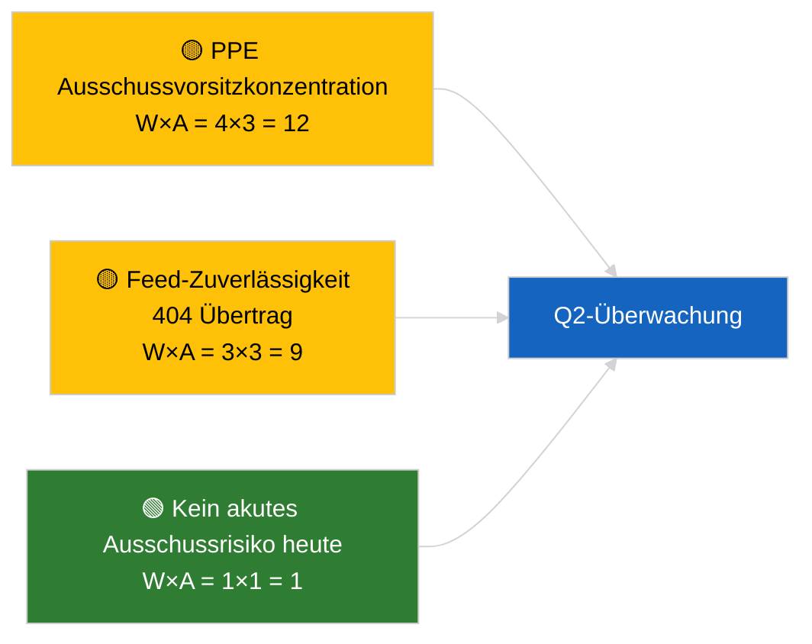
```mermaid
%%{init: {"theme":"dark"}}%%
graph LR
    R1["🟡 PPE Ausschussvorsitzkonzentration<br/>W×A = 4×3 = 12"] --> CONS["Q2-Überwachung"]
    R2["🟡 Feed-Zuverlässigkeit<br/>404 Übertrag<br/>W×A = 3×3 = 9"] --> CONS
    R3["🟢 Kein akutes Ausschussrisiko heute<br/>W×A = 1×1 = 1"] --> CONS
    style R1 fill:#FFC107,color:#000000
    style R2 fill:#FFC107,color:#000000
    style R3 fill:#2E7D32,color:#FFFFFF
    style CONS fill:#1565C0,color:#FFFFFF
```

| Risiko | W | A | Wert | Auslöser | Quelle | Admiralität |
|--------|:-:|:-:|:----:|----------|--------|:-----------:|
| PPE Ausschussvorsitzkonzentration | 4 | 3 | 12 | Q2 Berichterstatterberufungen | Strukturell | A2 |
| Feed-API-Zuverlässigkeit | 3 | 3 | 9 | Anhaltende 404 | Schwester-Lauf Breaking | B2 |

---

### 🔮 Wichtigster Zukunftsauslöser

**Ausschuss-Arbeitswoche 13.–17. April 2026** — erster substanzieller Q2-Ausschussberichtszyklus.

---

### 🛡️ Quellqualitätsbewertung

- **Primärquellen:** Offenes Datenportal des EP; Lauf `b64d7ca7-e49c-4fb7-9203-9946d31bfcae`.
- **Datenbeschränkungen:** Feed-API 404 Übertrag vom Vortag.
- **Verlässlichkeit:** 🟢 HOCH für kalendergesteuerte Inaktivität.

---

### 📎 Links

| Link | Pfad |
|------|------|
| Artikel | `./article.md` |
| Parallelläufe | `analysis/daily/2026-04-02/breaking/`, `motions/`, `propositions/` |
| Manifest | `./manifest.json` |

---

### 🔄 Querverweise

Alle Parallelläufe 2026-04-02 zeigen identische leere Vorlagenausgabe. Setzt das 5+ Tage anhaltende Recessmuster fort, das seit dem 2026-03-27 protokolliert wurde.

---

**Dokumentenkontrolle**
- **Vorlage:** `/analysis/templates/executive-brief.md`
- **Artefaktpfad:** `analysis/daily/2026-04-02/committee-reports/executive-brief.md`
- **Einstufung:** Öffentlich
- **Retrospektive Erstellung:** Back-fill-Sitzung.

### Executive Brief Es

### 🎯 BLUF

**Ningún informe nuevo de comisión el 2026-04-02; la semana de receso 2 de 4 continúa.** La ejecución `b64d7ca7-e49c-4fb7-9203-9946d31bfcae` devolvió **0 actores clasificados** y significancia **RUTINARIA** en todas las dimensiones, idéntica al estado de la plantilla para 2026-04-01/committee-reports. La base referencial sustantiva de comisiones sigue siendo el arrastre de marzo: ECON (Vicepresidente del BCE TA-10-2026-0060), TRAN/ENVI (emisiones de vehículos pesados TA-10-2026-0084), JURI (inmunidad Braun TA-10-2026-0088), AFET (Georgia TA-10-2026-0083). **🟢 ALTA fiabilidad** para el estado vacío impulsado por el calendario.

---

### 🧭 3 decisiones que este resumen apoya

| # | Decisión | Quién decide | Plazo | Evidencia |
|:-:|----------|--------------|:-----:|-----------|
| 1 | **Editorial:** OMITIR committee-reports diariamente | Editor | +24h | Salida de ejecución vacía |
| 2 | **Monitoreo:** mantener vigilancia de estado `get_committee_documents_feed` | Pipeline de datos | +24h | Patrón 404 continuo |
| 3 | **Vigilancia anticipatoria:** semana de trabajo de comisión 13-17 de abril para informes Q2 sustantivos | Responsable de análisis | 2026-04-13 | Ciclo pre-plenario |

---

### 📰 Lectura de 60 segundos

- 🔴 **Ningún documento de comisión indexado** hoy; semana de receso, ninguna sesión de comisión programada. (🟢 Alta)
- 🟠 **0 actores clasificados**; ningún ponente, ponente en la sombra o presidente de comisión identificado. (🟢 Alta)
- 🟢 **Base referencial de arrastre de comisión:** Las carteras ECON, TRAN/ENVI, JURI, AFET siguen siendo superficies activas Q2. (🟢 Alta)
- 🟡 **Todas las dimensiones de riesgo «ninguna»** — ningún riesgo agudo en comisión hoy. (🟢 Alta)
- 🔵 **Contexto económico:** La confirmación del BCE por parte de ECON proporciona un anclaje institucional Q2. (🟢 Alta)
- 🟣 **Referencia cruzada:** Ejecuciones paralelas del 2026-04-02 muestran todas plantillas vacías; patrón de receso a nivel de todo el sistema. (🟢 Alta)
- 🩷 **Vector de perturbación:** ninguno agudo hoy. (🟢 Alta)
- ⚪ **Arrastrado:** El expediente INTA UE-Mercosur aguarda dictamen del TJUE.

---

### 🗂️ Principales documentos / Tabla de procedimientos

| Rango | Referencia PE | Título (corto) | Significancia | Fiabilidad | Estado |
|:-----:|---------------|----------------|:-------------:|:----------:|--------|
| 1 | — | Ningún informe de comisión el 2026-04-02 | 0,0 | 🟢 ALTA | Receso — sin actividad |
| 2 | TA-10-2026-0060 | ECON — Vicepresidente del BCE (arrastrado) | 7,5 | 🟢 ALTA | Base Q2 |
| 3 | TA-10-2026-0084 | TRAN/ENVI — Emisiones de vehículos pesados (arrastrado) | 7,0 | 🟢 ALTA | Vigilancia de transposición |

---

### ⚠️ Panorama de riesgos y amenazas

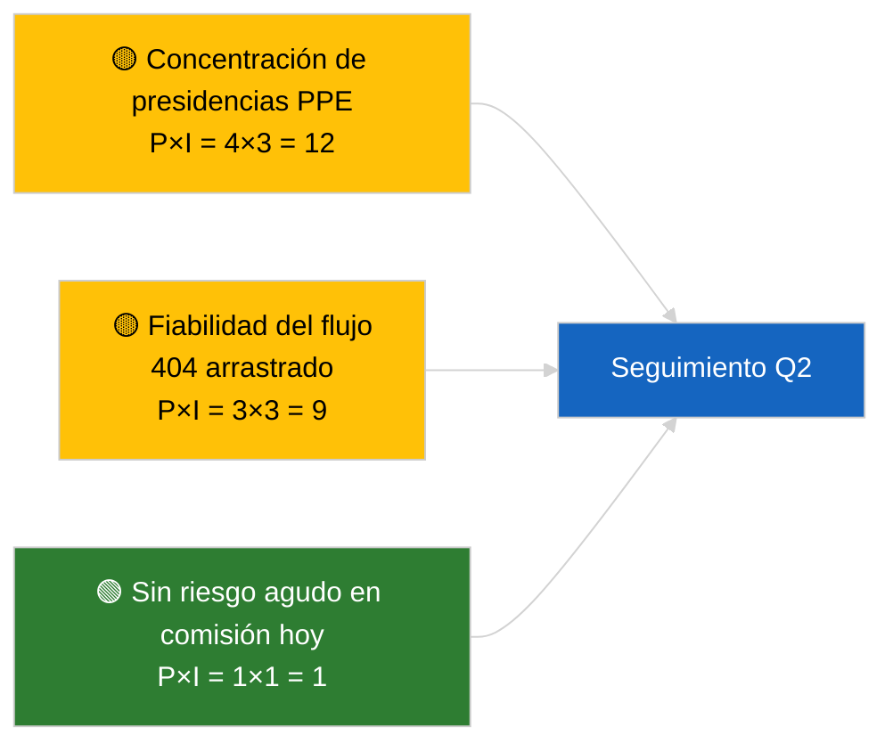
```mermaid
%%{init: {"theme":"dark"}}%%
graph LR
    R1["🟡 Concentración de presidencias PPE<br/>P×I = 4×3 = 12"] --> CONS["Seguimiento Q2"]
    R2["🟡 Fiabilidad del flujo<br/>404 arrastrado<br/>P×I = 3×3 = 9"] --> CONS
    R3["🟢 Sin riesgo agudo en comisión hoy<br/>P×I = 1×1 = 1"] --> CONS
    style R1 fill:#FFC107,color:#000000
    style R2 fill:#FFC107,color:#000000
    style R3 fill:#2E7D32,color:#FFFFFF
    style CONS fill:#1565C0,color:#FFFFFF
```

| Riesgo | P | I | Puntuación | Desencadenante | Fuente | Almirantazgo |
|--------|:-:|:-:|:----------:|----------------|--------|:------------:|
| Concentración de presidencias PPE | 4 | 3 | 12 | Nombramientos de ponentes Q2 | Estructural | A2 |
| Fiabilidad de la API de flujo | 3 | 3 | 9 | 404 sostenido | Ejecución hermana breaking | B2 |

---

### 🔮 Principal desencadenante futuro

**Semana de trabajo de comisión 13-17 de abril de 2026** — primer ciclo sustantivo de informes de comisión Q2.

---

### 🛡️ Evaluación de la calidad de las fuentes

- **Fuentes primarias:** Portal de datos abiertos del PE; ejecución `b64d7ca7-e49c-4fb7-9203-9946d31bfcae`.
- **Limitaciones de datos:** API de flujo 404 arrastrada del día anterior.
- **Fiabilidad:** 🟢 ALTA para la inactividad impulsada por el calendario.

---

### 📎 Enlaces

| Enlace | Ruta |
|--------|------|
| Artículo | `./article.md` |
| Ejecuciones hermanas | `analysis/daily/2026-04-02/breaking/`, `motions/`, `propositions/` |
| Manifiesto | `./manifest.json` |

---

### 🔄 Referencia cruzada

Todas las ejecuciones paralelas del 2026-04-02 muestran una salida de plantilla vacía idéntica. Continúa el patrón de receso de 5+ días registrado desde el 2026-03-27.

---

**Control del documento**
- **Plantilla:** `/analysis/templates/executive-brief.md`
- **Ruta del artefacto:** `analysis/daily/2026-04-02/committee-reports/executive-brief.md`
- **Clasificación:** Público
- **Generación retrospectiva:** Sesión de relleno.

### Executive Brief Fi

### 🎯 BLUF

**Ei uusia valiokuntaraportteja 2.4.2026; istuntotauon viikko 2/4 jatkuu.** Suoritus `b64d7ca7-e49c-4fb7-9203-9946d31bfcae` palautti **0 luokiteltua toimijaa** ja **RUTIINI**-merkittävyyden kaikissa ulottuvuuksissa, identtinen mallin tilan kanssa 2026-04-01/committee-reports. Aineellinen valiokuntaperustaso on edelleen maaliskuun siirtymä: ECON (EKP:n varapuheenjohtaja TA-10-2026-0060), TRAN/ENVI (HDV-päästöt TA-10-2026-0084), JURI (Braunin koskemattomuus TA-10-2026-0088), AFET (Georgia TA-10-2026-0083). **🟢 KORKEA luottamustaso** kalenterin ohjaamalle tyhjälle tilalle.

---

### 🧭 3 päätöstä, joita tämä tiedote tukee

| # | Päätös | Kuka päättää | Määräaika | Näyttö |
|:-:|--------|--------------|:---------:|--------|
| 1 | **Toimituksellinen:** OHITA committee-reports päivittäin | Toimittaja | +24h | Tyhjä suoritustulos |
| 2 | **Seuranta:** ylläpidä `get_committee_documents_feed` terveystarkistusta | Datapipeliini | +24h | Jatkuva 404-kaava |
| 3 | **Eteenpäin katsova:** valiokuntien työviikko 13.–17. huhtikuuta merkittäville Q2-raporteille | Analyysijohtaja | 2026-04-13 | Ennen täysistuntoa -sykli |

---

### 📰 60 sekunnin lukeminen

- 🔴 **Ei valiokunta-asiakirjoja indeksoitu** tänään; istuntotaukoviikko, ei valiokuntakokouksia suunniteltu. (🟢 Korkea)
- 🟠 **0 toimijaa luokiteltu**; ei esittelijöitä, varjoesittelijöitä tai valiokuntien puheenjohtajia tunnistettu. (🟢 Korkea)
- 🟢 **Valiokunnan siirtymäperustaso:** ECON, TRAN/ENVI, JURI, AFET-salkut ovat edelleen aktiivisia Q2-pintoja. (🟢 Korkea)
- 🟡 **Kaikki riskilosuluotteet "ei mitään"** — ei akuuttia valiokuntariskiä tänään. (🟢 Korkea)
- 🔵 **Taloudellinen konteksti:** ECONin EKP-vahvistus tarjoaa Q2 institutionaalisen ankkurin. (🟢 Korkea)
- 🟣 **Ristiviittaus:** rinnakkaissuoritukset 2026-04-02 kaikki tyhjiä malleja; koko järjestelmän istuntotaukokaava. (🟢 Korkea)
- 🩷 **Häiriövektori:** ei akuuttia tänään. (🟢 Korkea)
- ⚪ **Siirtyy eteenpäin:** EU–Mercosur INTA-asia odottaa EUT:n lausuntoa.

---

### 🗂️ Tärkeimmät asiakirjat / Menettelytaulukko

| Sija | EP-viite | Otsikko (lyhyt) | Merkittävyys | Luottamustaso | Tila |
|:----:|----------|-----------------|:------------:|:-------------:|------|
| 1 | — | Ei valiokuntaraportteja 2.4.2026 | 0,0 | 🟢 KORKEA | Istuntotauko — ei toimintaa |
| 2 | TA-10-2026-0060 | ECON — EKP:n varapuheenjohtaja (siirretty) | 7,5 | 🟢 KORKEA | Q2-perustaso |
| 3 | TA-10-2026-0084 | TRAN/ENVI — HDV-päästöt (siirretty) | 7,0 | 🟢 KORKEA | Täytäntöönpanon seuranta |

---

### ⚠️ Riski- ja uhkakatsaus

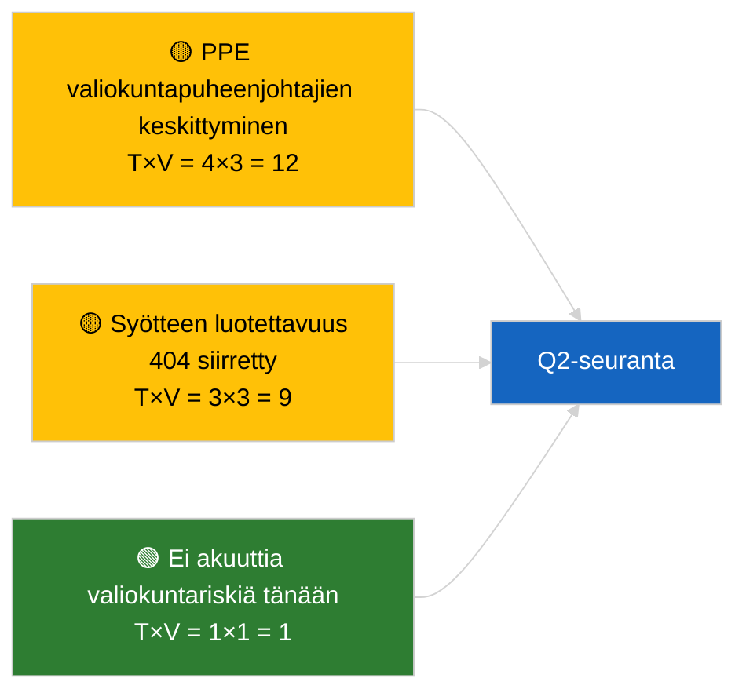
```mermaid
%%{init: {"theme":"dark"}}%%
graph LR
    R1["🟡 PPE valiokuntapuheenjohtajien keskittyminen<br/>T×V = 4×3 = 12"] --> CONS["Q2-seuranta"]
    R2["🟡 Syötteen luotettavuus<br/>404 siirretty<br/>T×V = 3×3 = 9"] --> CONS
    R3["🟢 Ei akuuttia valiokuntariskiä tänään<br/>T×V = 1×1 = 1"] --> CONS
    style R1 fill:#FFC107,color:#000000
    style R2 fill:#FFC107,color:#000000
    style R3 fill:#2E7D32,color:#FFFFFF
    style CONS fill:#1565C0,color:#FFFFFF
```

| Riski | T | V | Pisteet | Laukaisin | Lähde | Ammiraalisto |
|-------|:-:|:-:|:-------:|-----------|-------|:------------:|
| PPE valiokuntapuheenjohtajien keskittyminen | 4 | 3 | 12 | Q2 esittelijänimitykset | Rakenteellinen | A2 |
| Syöte-API:n luotettavuus | 3 | 3 | 9 | Jatkuva 404 | Rinnakkaissuoritus breaking | B2 |

---

### 🔮 Tärkein tuleva laukaisin

**Valiokuntien työviikko 13.–17. huhtikuuta 2026** — ensimmäinen merkittävä Q2 valiokuntaraporttisykli.

---

### 🛡️ Lähteen laadun arviointi

- **Ensisijaiset lähteet:** EP:n avoin dataporttaali; suoritus `b64d7ca7-e49c-4fb7-9203-9946d31bfcae`.
- **Datarajoitukset:** Syöte-API 404 siirretty edelliseltä päivältä.
- **Luottamustaso:** 🟢 KORKEA kalenterin ohjaamalle toiminnon puuttumiselle.

---

### 📎 Linkit

| Linkki | Polku |
|--------|-------|
| Artikkeli | `./article.md` |
| Rinnakkaissuoritukset | `analysis/daily/2026-04-02/breaking/`, `motions/`, `propositions/` |
| Manifesti | `./manifest.json` |

---

### 🔄 Ristiviittaus

Kaikki rinnakkaissuoritukset 2026-04-02 näyttävät identtisen tyhjän mallilähdön. Jatkaa 5+ päivän istuntotaukokaavaa, joka on kirjattu 27.3.2026 lähtien.

---

**Asiakirjan hallinta**
- **Malli:** `/analysis/templates/executive-brief.md`
- **Artefaktipolku:** `analysis/daily/2026-04-02/committee-reports/executive-brief.md`
- **Luokittelu:** Julkinen
- **Retrospektiivinen luonti:** Back-fill-istunto.

### Executive Brief Fr

### 🎯 BLUF

**Aucun nouveau rapport de commission le 2026-04-02 ; semaine de récession 2 sur 4 en cours.** L'exécution `b64d7ca7-e49c-4fb7-9203-9946d31bfcae` a retourné **0 acteur classifié** et une signification **ROUTINIÈRE** dans toutes les dimensions, identique à l'état du modèle pour 2026-04-01/committee-reports. La base de référence substantielle des commissions reste le transfert de mars : ECON (Vice-président de la BCE TA-10-2026-0060), TRAN/ENVI (émissions de poids lourds TA-10-2026-0084), JURI (immunité Braun TA-10-2026-0088), AFET (Géorgie TA-10-2026-0083). **🟢 HAUTE fiabilité** pour l'état vide piloté par le calendrier.

---

### 🧭 3 décisions que cette note appuie

| # | Décision | Qui décide | Délai | Justification |
|:-:|----------|-----------|:-----:|---------------|
| 1 | **Éditorial :** IGNORER committee-reports quotidiennement | Rédacteur | +24h | Sortie d'exécution vide |
| 2 | **Surveillance :** maintenir le contrôle d'état `get_committee_documents_feed` | Pipeline de données | +24h | Schéma 404 persistant |
| 3 | **Veille prospective :** semaine de travail des commissions 13-17 avril pour les rapports Q2 substantiels | Responsable analyse | 2026-04-13 | Cycle pré-plénière |

---

### 📰 Lecture en 60 secondes

- 🔴 **Aucun document de commission indexé** aujourd'hui ; semaine de récession, aucune réunion de commission prévue. (🟢 Élevée)
- 🟠 **0 acteur classifié** ; aucun rapporteur, rapporteur fictif ou président de commission identifié. (🟢 Élevée)
- 🟢 **Base de référence de report des commissions :** les portefeuilles ECON, TRAN/ENVI, JURI, AFET restent des surfaces actives pour le Q2. (🟢 Élevée)
- 🟡 **Toutes les dimensions de risque « aucun »** — aucun risque aigu en commission aujourd'hui. (🟢 Élevée)
- 🔵 **Contexte économique :** la confirmation de la BCE par l'ECON fournit l'ancrage institutionnel du Q2. (🟢 Élevée)
- 🟣 **Référence croisée :** les exécutions parallèles du 2026-04-02 affichent toutes des modèles vides ; schéma de récession à l'échelle du système. (🟢 Élevée)
- 🩷 **Vecteur de perturbation :** aucun aigu aujourd'hui. (🟢 Élevée)
- ⚪ **Report :** le dossier INTA EU-Mercosur attend l'avis de la CJUE.

---

### 🗂️ Principaux documents / Tableau des procédures

| Rang | Référence PE | Titre (abrégé) | Signification | Fiabilité | Statut |
|:----:|--------------|----------------|:-------------:|:---------:|--------|
| 1 | — | Aucun rapport de commission le 2026-04-02 | 0,0 | 🟢 ÉLEVÉE | Récession — aucune activité |
| 2 | TA-10-2026-0060 | ECON — Vice-président de la BCE (report) | 7,5 | 🟢 ÉLEVÉE | Base Q2 |
| 3 | TA-10-2026-0084 | TRAN/ENVI — Émissions de poids lourds (report) | 7,0 | 🟢 ÉLEVÉE | Surveillance de transposition |

---

### ⚠️ Panorama des risques et menaces

```mermaid
%%{init: {"theme":"dark"}}%%
graph LR
    R1["🟡 Concentration des présidences PPE<br/>V×I = 4×3 = 12"] --> CONS["Surveillance Q2"]
    R2["🟡 Fiabilité du flux<br/>404 reporté<br/>V×I = 3×3 = 9"] --> CONS
    R3["🟢 Aucun risque aigu en commission aujourd'hui<br/>V×I = 1×1 = 1"] --> CONS
    style R1 fill:#FFC107,color:#000000
    style R2 fill:#FFC107,color:#000000
    style R3 fill:#2E7D32,color:#FFFFFF
    style CONS fill:#1565C0,color:#FFFFFF
```

| Risque | V | I | Score | Déclencheur | Source | Amirauté |
|--------|:-:|:-:|:-----:|-------------|--------|:--------:|
| Concentration des présidences PPE | 4 | 3 | 12 | Désignations rapporteurs Q2 | Structurel | A2 |
| Fiabilité de l'API flux | 3 | 3 | 9 | 404 persistant | Exécution sœur breaking | B2 |

---

### 🔮 Principal déclencheur prospectif

**Semaine de travail des commissions 13-17 avril 2026** — premier cycle substantiel de rapports de commission Q2.

---

### 🛡️ Évaluation de la qualité des sources

- **Sources primaires :** Portail de données ouvertes du PE ; exécution `b64d7ca7-e49c-4fb7-9203-9946d31bfcae`.
- **Limites des données :** API flux 404 reportée du jour précédent.
- **Fiabilité :** 🟢 ÉLEVÉE pour l'inactivité pilotée par le calendrier.

---

### 📎 Liens

| Lien | Chemin |
|------|--------|
| Article | `./article.md` |
| Exécutions sœurs | `analysis/daily/2026-04-02/breaking/`, `motions/`, `propositions/` |
| Manifeste | `./manifest.json` |

---

### 🔄 Référence croisée

Toutes les exécutions parallèles du 2026-04-02 affichent une sortie de modèle vide identique. Prolongement du schéma de récession de 5 jours ou plus enregistré depuis le 2026-03-27.

---

**Contrôle du document**
- **Modèle :** `/analysis/templates/executive-brief.md`
- **Chemin de l'artefact :** `analysis/daily/2026-04-02/committee-reports/executive-brief.md`
- **Classification :** Public
- **Génération rétrospective :** Session de remplissage.

### Executive Brief He

**סיווג:** OSINT | תיעוד פרלמנטרי ציבורי
**אמינות:** 🟢 גבוהה (הערכה מבנית בתקופת הפגרה)
**נוצר:** 2026-04-02T00:00:00Z (תדריך רטרוספקטיבי)
**סוג כתבה:** דוחות ועדות
**מזהה הרצה:** `b64d7ca7-e49c-4fb7-9203-9946d31bfcae`
**מקור:** פורטל נתונים פתוח של הפרלמנט האירופי

---

### 🎯 BLUF

**אין דוחות ועדות חדשים ב-2026-04-02; שבוע פגרה 2 מתוך 4 נמשך.** הרצה `b64d7ca7-e49c-4fb7-9203-9946d31bfcae` החזירה **0 שחקנים מסווגים** ומשמעות **שגרתית** בכל הממדים, זהה למצב התבנית עבור 2026-04-01/committee-reports. קו הבסיס המהותי של הוועדות נשאר מהעברת מרץ: ECON (סגן נשיא הבנק המרכזי האירופי TA-10-2026-0060), TRAN/ENVI (פליטות רכבים כבדים TA-10-2026-0084), JURI (חסינות בראון TA-10-2026-0088), AFET (גיאורגיה TA-10-2026-0083). **🟢 אמינות גבוהה** עבור מצב ריק מונע-לוח שנה.

---

### 🧭 3 החלטות שתדריך זה תומך בהן

| # | החלטה | מי מחליט | מועד אחרון | ראיה |
|:-:|-------|----------|:----------:|------|
| 1 | **מערכתי:** דלג על דוחות ועדות יומי | עורך | +24 שעות | פלט הרצה ריק |
| 2 | **ניטור:** שמור על בדיקת תקינות `get_committee_documents_feed` | צינור נתונים | +24 שעות | דפוס 404 מתמשך |
| 3 | **מעקב קדימה:** שבוע עבודה של ועדות 13-17 באפריל לדוחות מהותיים של Q2 | ראש ניתוח | 2026-04-13 | מחזור טרום-מליאה |

---

### 📰 קריאה של 60 שניות

- 🔴 **אין מסמכי ועדה אינדקסים** היום; שבוע פגרה, אין ישיבות ועדה מתוכננות. (🟢 גבוהה)
- 🟠 **0 שחקנים מסווגים**; לא זוהו מדווחים, מדווחי צל, או יושבי ראש ועדה. (🟢 גבוהה)
- 🟢 **קו בסיס ועדתי של העברה:** תיקי ECON, TRAN/ENVI, JURI, AFET נשארים משטחים פעילים של Q2. (🟢 גבוהה)
- 🟡 **כל ממדי הסיכון «אפס»** — אין סיכון ועדתי חריף היום. (🟢 גבוהה)
- 🔵 **הקשר כלכלי:** אישור ה-ECB על ידי ECON מספק עוגן מוסדי ל-Q2. (🟢 גבוהה)
- 🟣 **הפניה צולבת:** הרצות מקבילות 2026-04-02 מציגות כולן תבניות ריקות; דפוס פגרה כלל-מערכתי. (🟢 גבוהה)
- 🩷 **וקטור הפרעה:** אין חריף היום. (🟢 גבוהה)
- ⚪ **מועבר:** תיק INTA EU-Mercosur ממתין לחוות דעת בית הדין של האיחוד האירופי.

---

### 🗂️ מסמכים עיקריים / טבלת נהלים

| דירוג | הפניה לפרלמנט | כותרת (קצרה) | משמעות | אמינות | סטטוס |
|:-----:|---------------|--------------|:------:|:------:|-------|
| 1 | — | אין דוחות ועדות ב-2026-04-02 | 0.0 | 🟢 גבוהה | פגרה — אין פעילות |
| 2 | TA-10-2026-0060 | ECON — סגן נשיא ה-ECB (מועבר) | 7.5 | 🟢 גבוהה | קו בסיס Q2 |
| 3 | TA-10-2026-0084 | TRAN/ENVI — פליטות רכבים כבדים (מועבר) | 7.0 | 🟢 גבוהה | מעקב יישום |

---

### ⚠️ תמונת מצב סיכונים ואיומים

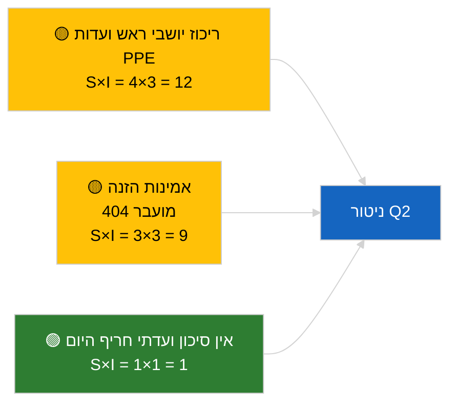
```mermaid
%%{init: {"theme":"dark"}}%%
graph LR
    R1["🟡 ריכוז יושבי ראש ועדות PPE<br/>S×I = 4×3 = 12"] --> CONS["ניטור Q2"]
    R2["🟡 אמינות הזנה<br/>404 מועבר<br/>S×I = 3×3 = 9"] --> CONS
    R3["🟢 אין סיכון ועדתי חריף היום<br/>S×I = 1×1 = 1"] --> CONS
    style R1 fill:#FFC107,color:#000000
    style R2 fill:#FFC107,color:#000000
    style R3 fill:#2E7D32,color:#FFFFFF
    style CONS fill:#1565C0,color:#FFFFFF
```

| סיכון | S | I | ציון | מפעיל | מקור | אדמירלות |
|-------|:-:|:-:|:----:|-------|------|:---------:|
| ריכוז יושבי ראש ועדות PPE | 4 | 3 | 12 | מינויי מדווחי Q2 | מבני | A2 |
| אמינות API הזנה | 3 | 3 | 9 | 404 מתמשך | הרצה אחות breaking | B2 |

---

### 🔮 מפעיל עתידי מוביל

**שבוע עבודה ועדתי 13-17 באפריל 2026** — מחזור הדוחות המהותי הראשון של הוועדות לרבעון Q2.

---

### 🛡️ הערכת איכות מקורות

- **מקורות ראשוניים:** פורטל נתונים פתוח של הפרלמנט האירופי; הרצה `b64d7ca7-e49c-4fb7-9203-9946d31bfcae`.
- **מגבלות נתונים:** API הזנה 404 מועברת מהיום הקודם.
- **אמינות:** 🟢 גבוהה עבור אי-פעילות מונעת-לוח שנה.

---

### 📎 קישורים

| קישור | נתיב |
|-------|------|
| כתבה | `./article.md` |
| הרצות אחיות | `analysis/daily/2026-04-02/breaking/`, `motions/`, `propositions/` |
| מניפסט | `./manifest.json` |

---

### 🔄 הפניה צולבת

כל ההרצות המקבילות של 2026-04-02 מציגות פלט תבנית ריק זהה. ממשיכות את דפוס הפגרה של 5+ ימים שתועד מאז 2026-03-27.

---

**בקרת מסמכים**
- **תבנית:** `/analysis/templates/executive-brief.md`
- **נתיב תוצר:** `analysis/daily/2026-04-02/committee-reports/executive-brief.md`
- **סיווג:** ציבורי
- **יצירה רטרוספקטיבית:** סשן מילוי-אחורי.

### Executive Brief Ja

**分類：** OSINT | 公開議会記録
**信頼性：** 🟢 高（会期休会期間の構造的評価）
**作成日：** 2026-04-02T00:00:00Z（遡及的概要）
**記事の種類：** 委員会報告
**実行ID：** `b64d7ca7-e49c-4fb7-9203-9946d31bfcae`
**情報源：** 欧州議会オープンデータポータル

---

### 🎯 BLUF

**2026年4月2日、新しい委員会報告はなし。休会第2週（全4週中）が継続中。** 実行 `b64d7ca7-e49c-4fb7-9203-9946d31bfcae` は**分類された関係者ゼロ**、および全ての次元において 2026-04-01/committee-reports のテンプレート状態と同一の**ルーティン**重要度を返した。実質的な委員会ベースラインは3月からの繰越のまま維持：ECON（ECB副総裁 TA-10-2026-0060）、TRAN/ENVI（大型車両排出量 TA-10-2026-0084）、JURI（ブラウン免責 TA-10-2026-0088）、AFET（ジョージア TA-10-2026-0083）。カレンダー主導の空の状態に対して**🟢 高い信頼性**。

---

### 🧭 この概要が支援する3つの意思決定

| # | 決定事項 | 決定者 | 期限 | 根拠 |
|:-:|---------|--------|:----:|------|
| 1 | **編集上の判断：** 委員会報告の日次発行をスキップ | 編集長 | +24時間 | 空の実行結果 |
| 2 | **監視：** `get_committee_documents_feed` の稼働状況を継続監視 | データパイプライン | +24時間 | 継続的な404パターン |
| 3 | **先行監視：** 実質的なQ2報告のための4月13〜17日の委員会活動週 | 分析責任者 | 2026-04-13 | 本会議前サイクル |

---

### 📰 60秒レビュー

- 🔴 **委員会文書なし**：今日は休会週のため、委員会会合の予定なし。（🟢 高）
- 🟠 **分類された関係者ゼロ**：報告者、シャドー報告者、委員会委員長のいずれも特定されず。（🟢 高）
- 🟢 **委員会の繰越ベースライン：** ECON、TRAN/ENVI、JURI、AFETの各ポートフォリオは引き続きQ2の活動フロントとして残る。（🟢 高）
- 🟡 **全リスク次元「なし」** — 今日、委員会に急迫したリスクはない。（🟢 高）
- 🔵 **経済的文脈：** ECONによるECB承認はQ2の制度的錨を提供。（🟢 高）
- 🟣 **相互参照：** 2026-04-02の並行実行はすべて同一の空テンプレート結果。システム全体の休会パターン。（🟢 高）
- 🩷 **混乱ベクトル：** 今日は急迫したものなし。（🟢 高）
- ⚪ **繰越：** EU-Mercosur INTAファイルはECJの見解を待機中。

---

### 🗂️ 主要文書 / 手続き一覧

| 順位 | EP参照 | タイトル（略称） | 重要度 | 信頼性 | 状態 |
|:---:|--------|----------------|:-----:|:------:|------|
| 1 | — | 2026-04-02、委員会報告なし | 0.0 | 🟢 高 | 休会 — 活動なし |
| 2 | TA-10-2026-0060 | ECON — ECB副総裁（繰越） | 7.5 | 🟢 高 | Q2ベースライン |
| 3 | TA-10-2026-0084 | TRAN/ENVI — 大型車両排出量（繰越） | 7.0 | 🟢 高 | 移行監視 |

---

### ⚠️ リスク・脅威スナップショット

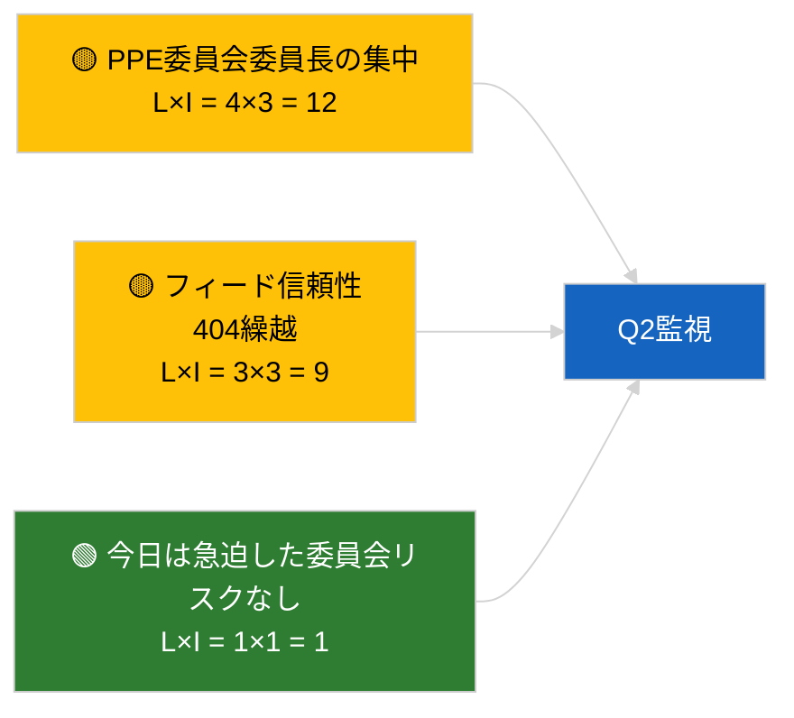
```mermaid
%%{init: {"theme":"dark"}}%%
graph LR
    R1["🟡 PPE委員会委員長の集中<br/>L×I = 4×3 = 12"] --> CONS["Q2監視"]
    R2["🟡 フィード信頼性<br/>404繰越<br/>L×I = 3×3 = 9"] --> CONS
    R3["🟢 今日は急迫した委員会リスクなし<br/>L×I = 1×1 = 1"] --> CONS
    style R1 fill:#FFC107,color:#000000
    style R2 fill:#FFC107,color:#000000
    style R3 fill:#2E7D32,color:#FFFFFF
    style CONS fill:#1565C0,color:#FFFFFF
```

| リスク | L | I | スコア | 引き金 | 情報源 | 提督評価 |
|--------|:-:|:-:|:------:|-------|--------|:-------:|
| PPE委員会委員長の集中 | 4 | 3 | 12 | Q2報告者任命 | 構造的 | A2 |
| フィードAPI信頼性 | 3 | 3 | 9 | 持続的404 | 並行実行breaking | B2 |

---

### 🔮 最重要将来引き金

**2026年4月13〜17日の委員会活動週** — 最初の実質的なQ2委員会報告サイクル。

---

### 🛡️ 情報源品質評価

- **一次情報源：** 欧州議会オープンデータポータル；実行 `b64d7ca7-e49c-4fb7-9203-9946d31bfcae`。
- **データ制限：** フィードAPI 404が前日から繰り越し。
- **信頼性：** 🟢 高、カレンダー主導の不活性状態について。

---

### 📎 リンク

| リンク | パス |
|-------|------|
| 記事 | `./article.md` |
| 並行実行 | `analysis/daily/2026-04-02/breaking/`, `motions/`, `propositions/` |
| マニフェスト | `./manifest.json` |

---

### 🔄 相互参照

2026-04-02の全並行実行が同一の空テンプレート出力を示している。2026年3月27日以来記録されている5日以上の休会パターンが継続。

---

**文書管理**
- **テンプレート：** `/analysis/templates/executive-brief.md`
- **成果物パス：** `analysis/daily/2026-04-02/committee-reports/executive-brief.md`
- **分類：** 公開
- **遡及的生成：** バックフィルセッション。

### Executive Brief Ko

**분류:** OSINT | 공개 의회 기록
**신뢰도:** 🟢 높음 (의회 휴회기간 구조적 평가)
**작성일:** 2026-04-02T00:00:00Z (소급 브리핑)
**기사 유형:** 위원회 보고서
**실행 ID:** `b64d7ca7-e49c-4fb7-9203-9946d31bfcae`
**출처:** 유럽의회 공개 데이터 포털

---

### 🎯 BLUF

**2026-04-02에 새로운 위원회 보고서 없음; 4주 중 2번째 휴회 주 진행 중.** 실행 `b64d7ca7-e49c-4fb7-9203-9946d31bfcae`은 **0명의 분류된 행위자**와 모든 차원에서 2026-04-01/committee-reports 템플릿 상태와 동일한 **일상적** 중요도를 반환했습니다. 실질적 위원회 기준선은 3월 이월 내용을 유지합니다: ECON (ECB 부총재 TA-10-2026-0060), TRAN/ENVI (대형차량 배출량 TA-10-2026-0084), JURI (브라운 면책 TA-10-2026-0088), AFET (조지아 TA-10-2026-0083). 일정 주도 공백 상태에 대해 **🟢 높은 신뢰도**.

---

### 🧭 이 브리핑이 지원하는 3가지 결정

| # | 결정 | 결정자 | 기한 | 근거 |
|:-:|------|--------|:----:|------|
| 1 | **편집:** 위원회 보고서 일일 게시 건너뜀 | 편집장 | +24시간 | 빈 실행 결과 |
| 2 | **모니터링:** `get_committee_documents_feed` 상태 점검 유지 | 데이터 파이프라인 | +24시간 | 지속적인 404 패턴 |
| 3 | **선행 모니터링:** 실질적 Q2 보고를 위한 4월 13-17일 위원회 활동 주 | 분석 책임자 | 2026-04-13 | 본회의 전 사이클 |

---

### 📰 60초 읽기

- 🔴 **위원회 문서 미색인:** 오늘은 휴회 주로 위원회 회의 예정 없음. (🟢 높음)
- 🟠 **0명의 행위자 분류됨;** 보고자, 그림자 보고자, 위원회 위원장 어느 누구도 확인되지 않음. (🟢 높음)
- 🟢 **위원회 이월 기준선:** ECON, TRAN/ENVI, JURI, AFET 포트폴리오가 Q2 활동 전선으로 남아 있음. (🟢 높음)
- 🟡 **모든 위험 차원 «없음»** — 오늘 위원회에 긴급 위험 없음. (🟢 높음)
- 🔵 **경제적 맥락:** ECON의 ECB 확인이 Q2 제도적 닻을 제공. (🟢 높음)
- 🟣 **교차 참조:** 2026-04-02 병렬 실행 모두 빈 템플릿 출력; 시스템 전체 휴회 패턴. (🟢 높음)
- 🩷 **교란 벡터:** 오늘 긴급한 것 없음. (🟢 높음)
- ⚪ **이월:** EU-Mercosur INTA 파일이 유럽사법재판소 의견 대기 중.

---

### 🗂️ 주요 문서 / 절차 표

| 순위 | EP 참조 | 제목 (약식) | 중요도 | 신뢰도 | 상태 |
|:---:|---------|------------|:-----:|:------:|------|
| 1 | — | 2026-04-02 위원회 보고서 없음 | 0.0 | 🟢 높음 | 휴회 — 활동 없음 |
| 2 | TA-10-2026-0060 | ECON — ECB 부총재 (이월) | 7.5 | 🟢 높음 | Q2 기준선 |
| 3 | TA-10-2026-0084 | TRAN/ENVI — 대형차량 배출량 (이월) | 7.0 | 🟢 높음 | 이행 모니터링 |

---

### ⚠️ 위험 및 위협 현황

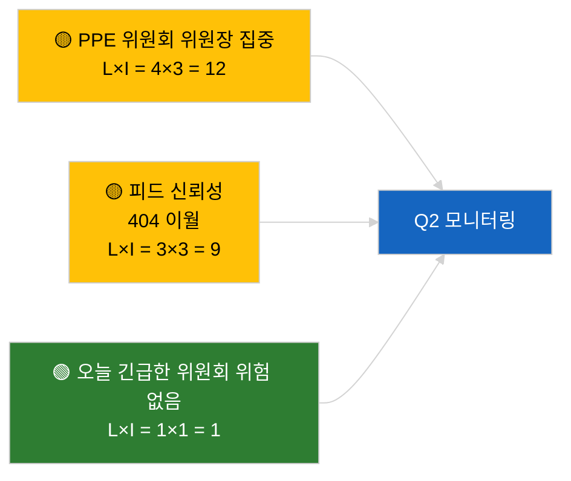
```mermaid
%%{init: {"theme":"dark"}}%%
graph LR
    R1["🟡 PPE 위원회 위원장 집중<br/>L×I = 4×3 = 12"] --> CONS["Q2 모니터링"]
    R2["🟡 피드 신뢰성<br/>404 이월<br/>L×I = 3×3 = 9"] --> CONS
    R3["🟢 오늘 긴급한 위원회 위험 없음<br/>L×I = 1×1 = 1"] --> CONS
    style R1 fill:#FFC107,color:#000000
    style R2 fill:#FFC107,color:#000000
    style R3 fill:#2E7D32,color:#FFFFFF
    style CONS fill:#1565C0,color:#FFFFFF
```

| 위험 | L | I | 점수 | 촉발 요인 | 출처 | 제독 평가 |
|------|:-:|:-:|:---:|----------|------|:--------:|
| PPE 위원회 위원장 집중 | 4 | 3 | 12 | Q2 보고자 임명 | 구조적 | A2 |
| 피드 API 신뢰성 | 3 | 3 | 9 | 지속적인 404 | 자매 실행 breaking | B2 |

---

### 🔮 가장 중요한 미래 촉발 요인

**2026년 4월 13-17일 위원회 활동 주** — 첫 번째 실질적인 Q2 위원회 보고 사이클.

---

### 🛡️ 출처 품질 평가

- **1차 출처:** 유럽의회 공개 데이터 포털; 실행 `b64d7ca7-e49c-4fb7-9203-9946d31bfcae`.
- **데이터 제한:** 피드 API 404가 전날부터 이월됨.
- **신뢰도:** 🟢 높음, 일정 주도 비활성 상태에 대해.

---

### 📎 링크

| 링크 | 경로 |
|------|------|
| 기사 | `./article.md` |
| 자매 실행 | `analysis/daily/2026-04-02/breaking/`, `motions/`, `propositions/` |
| 매니페스트 | `./manifest.json` |

---

### 🔄 교차 참조

2026-04-02의 모든 병렬 실행이 동일한 빈 템플릿 출력을 보여줍니다. 2026-03-27 이후 기록된 5일 이상의 휴회 패턴이 계속됩니다.

---

**문서 관리**
- **템플릿:** `/analysis/templates/executive-brief.md`
- **아티팩트 경로:** `analysis/daily/2026-04-02/committee-reports/executive-brief.md`
- **분류:** 공개
- **소급 생성:** 백필 세션.

### Executive Brief Nl

### 🎯 BLUF

**Geen nieuwe commissierapporten op 2026-04-02; recessweek 2 van 4 duurt voort.** Uitvoering `b64d7ca7-e49c-4fb7-9203-9946d31bfcae` leverde **0 geclassificeerde actoren** en **ROUTINEMATIGE** significantie in alle dimensies, identiek aan de sjabloonstatus voor 2026-04-01/committee-reports. De inhoudelijke commissie-basisreferentie blijft de overdrachtspositie van maart: ECON (Vice-voorzitter ECB TA-10-2026-0060), TRAN/ENVI (HDV-emissies TA-10-2026-0084), JURI (Braun-immuniteit TA-10-2026-0088), AFET (Georgië TA-10-2026-0083). **🟢 HOGE betrouwbaarheid** voor kalendergestuurde leegstand.

---

### 🧭 3 besluiten die deze briefing ondersteunt

| # | Besluit | Wie beslist | Deadline | Bewijs |
|:-:|---------|-------------|:--------:|--------|
| 1 | **Redactioneel:** committee-reports dagelijks OVERSLAAN | Redacteur | +24u | Lege uitvoeringsuitvoer |
| 2 | **Monitoring:** `get_committee_documents_feed` gezondheidstatus onderhouden | Datapipeline | +24u | Aanhoudend 404-patroon |
| 3 | **Vooruitblik:** commissiewerkweek 13-17 april voor substantiële Q2-rapporten | Analyseleider | 2026-04-13 | Pre-plenumcyclus |

---

### 📰 60-secondenlecture

- 🔴 **Geen commissiedocumenten geïndexeerd** vandaag; recessweek, geen commissievergaderingen gepland. (🟢 Hoog)
- 🟠 **0 actoren geclassificeerd**; geen rapporteurs, schaduwrapporteurs of commissievoorzitters geïdentificeerd. (🟢 Hoog)
- 🟢 **Overdrachtsbasisreferentie commissie:** ECON-, TRAN/ENVI-, JURI-, AFET-portefeuilles blijven actieve Q2-oppervlakken. (🟢 Hoog)
- 🟡 **Alle risicoDimensies «geen»** — geen acuut commissierisico vandaag. (🟢 Hoog)
- 🔵 **Economische context:** ECONs ECB-bevestiging biedt Q2-institutioneel anker. (🟢 Hoog)
- 🟣 **Kruisverwijzing:** parallelle uitvoeringen 2026-04-02 tonen alle lege sjablonen; systeembrede recesspatroon. (🟢 Hoog)
- 🩷 **Verstoringsvector:** vandaag geen acuut. (🟢 Hoog)
- ⚪ **Overgedragen:** EU-Mercosur INTA-dossier wacht op HvJ-advies.

---

### 🗂️ Topdocumenten / Procedureastabel

| Rang | EP-referentie | Titel (kort) | Significantie | Betrouwbaarheid | Status |
|:----:|---------------|--------------|:-------------:|:---------------:|--------|
| 1 | — | Geen commissierapporten 2026-04-02 | 0,0 | 🟢 HOOG | Recess — geen activiteit |
| 2 | TA-10-2026-0060 | ECON — Vice-voorzitter ECB (overgedragen) | 7,5 | 🟢 HOOG | Q2-basislijn |
| 3 | TA-10-2026-0084 | TRAN/ENVI — HDV-emissies (overgedragen) | 7,0 | 🟢 HOOG | Transpositiebewaking |

---

### ⚠️ Risico- en dreigingsoverzicht

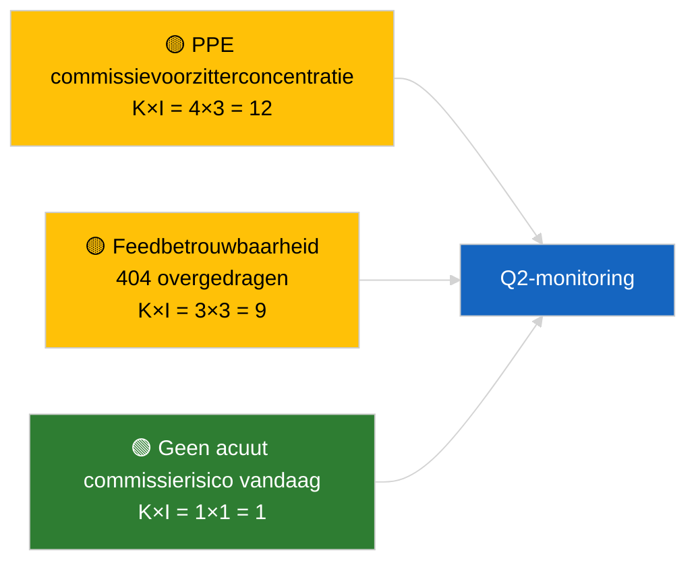
```mermaid
%%{init: {"theme":"dark"}}%%
graph LR
    R1["🟡 PPE commissievoorzitterconcentratie<br/>K×I = 4×3 = 12"] --> CONS["Q2-monitoring"]
    R2["🟡 Feedbetrouwbaarheid<br/>404 overgedragen<br/>K×I = 3×3 = 9"] --> CONS
    R3["🟢 Geen acuut commissierisico vandaag<br/>K×I = 1×1 = 1"] --> CONS
    style R1 fill:#FFC107,color:#000000
    style R2 fill:#FFC107,color:#000000
    style R3 fill:#2E7D32,color:#FFFFFF
    style CONS fill:#1565C0,color:#FFFFFF
```

| Risico | K | I | Score | Trigger | Bron | Admiraliteit |
|--------|:-:|:-:|:-----:|---------|------|:------------:|
| PPE commissievoorzitterconcentratie | 4 | 3 | 12 | Q2 rapporteurbenoemingen | Structureel | A2 |
| Feed-API-betrouwbaarheid | 3 | 3 | 9 | Aanhoudende 404 | Zusteruitvoering breaking | B2 |

---

### 🔮 Voornaamste toekomstige trigger

**Commissiewerkweek 13-17 april 2026** — eerste substantiële Q2-commissierapportcyclus.

---

### 🛡️ Bronkwaliteitsbeoordeling

- **Primaire bronnen:** Open dataportaal EP; uitvoering `b64d7ca7-e49c-4fb7-9203-9946d31bfcae`.
- **Databeperkingen:** Feed-API 404 overgedragen van de vorige dag.
- **Betrouwbaarheid:** 🟢 HOOG voor kalendergestuurde inactiviteit.

---

### 📎 Links

| Link | Pad |
|------|-----|
| Artikel | `./article.md` |
| Zusteruitvoeringen | `analysis/daily/2026-04-02/breaking/`, `motions/`, `propositions/` |
| Manifest | `./manifest.json` |

---

### 🔄 Kruisverwijzing

Alle parallelle uitvoeringen 2026-04-02 tonen identieke lege sjabloonuitvoer. Zet het 5+-dagenrecesspatroon voort dat is geregistreerd sinds 2026-03-27.

---

**Documentbeheer**
- **Sjabloon:** `/analysis/templates/executive-brief.md`
- **Artefactpad:** `analysis/daily/2026-04-02/committee-reports/executive-brief.md`
- **Classificatie:** Openbaar
- **Retrospectieve generatie:** Back-fill-sessie.

### Executive Brief No

### 🎯 BLUF

**Ingen nye komitérapporter 2026-04-02; resesuke 2 av 4 fortsetter.** Kjøring `b64d7ca7-e49c-4fb7-9203-9946d31bfcae` returnerte **0 klassifiserte aktører** og **RUTINEMESSIG** signifikans i alle dimensjoner, identisk med malltilstand for 2026-04-01/committee-reports. Den substansielle komitégrunnlinjen er fortsatt mars-overføringen: ECON (ECBs visepresidenten TA-10-2026-0060), TRAN/ENVI (HDV-utslipp TA-10-2026-0084), JURI (Braun-immunitet TA-10-2026-0088), AFET (Georgia TA-10-2026-0083). **🟢 HØY konfidensgrad** for kalenderdrevet tom tilstand.

---

### 🧭 3 Beslutninger denne orienteringen støtter

| # | Beslutning | Hvem bestemmer | Frist | Dokumentasjon |
|:-:|-----------|----------------|:-----:|---------------|
| 1 | **Redaksjonelt:** HOPP OVER committee-reports daglig | Redaktør | +24t | Tom kjøreresultat |
| 2 | **Overvåkning:** vedlikehold `get_committee_documents_feed` helsekontroll | Datapipeline | +24t | Pågående 404-mønster |
| 3 | **Fremtidsvakt:** komitéarbeidsuke 13-17 april for substansielle Q2-rapporter | Analyseleder | 2026-04-13 | Pré-plenumssyklus |

---

### 📰 60-sekunders lesning

- 🔴 **Ingen komitédokumenter indeksert** i dag; resesuke, ingen komitémøter planlagt. (🟢 Høy)
- 🟠 **0 aktører klassifisert**; ingen ordførere, skyggeordførere eller komitéledere identifisert. (🟢 Høy)
- 🟢 **Komitéens overføringsgrunnlinje:** ECON, TRAN/ENVI, JURI, AFET-porteføljer er fortsatt aktive Q2-overflater. (🟢 Høy)
- 🟡 **Alle risikodimensjoner «ingen»** — ingen akutt komitérisiko i dag. (🟢 Høy)
- 🔵 **Økonomisk kontekst:** ECONs ECB-bekreftelse gir Q2 institusjonelt anker. (🟢 Høy)
- 🟣 **Kryssreferanse:** søskenkjøringer 2026-04-02 alle tomme maler; systemomfattende resessmønster. (🟢 Høy)
- 🩷 **Forstyrrelsesvektorer:** ingen akutte i dag. (🟢 Høy)
- ⚪ **Overføres:** EU-Mercosur INTA-saken avventer EUD-uttalelse.

---

### 🗂️ Topdokumenter / Prosedyrtabell

| Rang | EP-referanse | Tittel (kort) | Signifikans | Konfidensgrad | Status |
|:----:|--------------|---------------|:-----------:|:-------------:|--------|
| 1 | — | Ingen komitérapporter 2026-04-02 | 0,0 | 🟢 HØY | Reses — ingen aktivitet |
| 2 | TA-10-2026-0060 | ECON — ECBs visepresidenten (overført) | 7,5 | 🟢 HØY | Q2-grunnlinje |
| 3 | TA-10-2026-0084 | TRAN/ENVI — HDV-utslipp (overført) | 7,0 | 🟢 HØY | Transposisjonsovervåking |

---

### ⚠️ Risiko- og trusselbilde

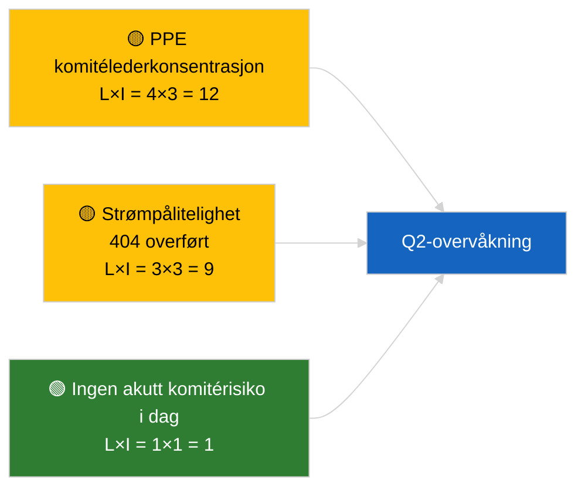
```mermaid
%%{init: {"theme":"dark"}}%%
graph LR
    R1["🟡 PPE komitélederkonsentrasjon<br/>L×I = 4×3 = 12"] --> CONS["Q2-overvåkning"]
    R2["🟡 Strømpålitelighet<br/>404 overført<br/>L×I = 3×3 = 9"] --> CONS
    R3["🟢 Ingen akutt komitérisiko i dag<br/>L×I = 1×1 = 1"] --> CONS
    style R1 fill:#FFC107,color:#000000
    style R2 fill:#FFC107,color:#000000
    style R3 fill:#2E7D32,color:#FFFFFF
    style CONS fill:#1565C0,color:#FFFFFF
```

| Risiko | S | I | Score | Utløser | Kilde | Admiralitet |
|--------|:-:|:-:|:-----:|---------|-------|:-----------:|
| PPE komitélederkonsentrasjon | 4 | 3 | 12 | Q2 ordføreroppnevnelser | Strukturell | A2 |
| Strøm-API-pålitelighet | 3 | 3 | 9 | Vedvarende 404 | Søskenkjøring breaking | B2 |

---

### 🔮 Fremste fremtidige utløser

**Komitéarbeidsuke 13-17 april 2026** — første substansielle Q2 komitérapportsyklus.

---

### 🛡️ Kildekvalitetsvurdering

- **Primære kilder:** EPs åpne dataportal; kjøring `b64d7ca7-e49c-4fb7-9203-9946d31bfcae`.
- **Databegrensninger:** Strøm-API 404 overført fra forrige dag.
- **Konfidensgrad:** 🟢 HØY for kalenderdrevet inaktivitet.

---

### 📎 Lenker

| Lenke | Sti |
|-------|-----|
| Artikkel | `./article.md` |
| Søskenkjøringer | `analysis/daily/2026-04-02/breaking/`, `motions/`, `propositions/` |
| Manifest | `./manifest.json` |

---

### 🔄 Kryssreferanse

Alle parallelle kjøringer 2026-04-02 viser identisk tom malresultat. Fortsetter det 5+ dagers resessmønster logget siden 2026-03-27.

---

**Dokumentkontroll**
- **Mal:** `/analysis/templates/executive-brief.md`
- **Artefaktsti:** `analysis/daily/2026-04-02/committee-reports/executive-brief.md`
- **Klassifisering:** Offentlig
- **Retrospektiv generering:** Back-fill-session.

### Executive Brief Sv

### 🎯 BLUF

**Inga nya utskottsrapporter den 2026-04-02; recessvecka 2 av 4 fortsätter.** Körning `b64d7ca7-e49c-4fb7-9203-9946d31bfcae` returnerade **0 klassificerade aktörer** och **RUTINMÄSSIG** signifikans i alla dimensioner, identisk med malltillståndet för 2026-04-01/committee-reports. Det substantiella utskottsbaslinjen är fortsatt mars-övergången: ECON (ECB:s vice ordförande TA-10-2026-0060), TRAN/ENVI (HDV-utsläpp TA-10-2026-0084), JURI (Braun immunitet TA-10-2026-0088), AFET (Georgien TA-10-2026-0083). **🟢 HÖG tillförlitlighet** för tomt läge drivet av kalender.

---

### 🧭 3 Beslut som denna rapport stödjer

| # | Beslut | Vem beslutar | Deadline | Underlag |
|:-:|--------|--------------|:--------:|----------|
| 1 | **Redaktionellt:** HOPPA ÖVER committee-reports dagligen | Redaktör | +24h | Tomt körningsresultat |
| 2 | **Övervakning:** underhåll `get_committee_documents_feed` hälsokontroll | Datapipeline | +24h | Pågående 404-mönster |
| 3 | **Framtidsbevakning:** utskottsarbetsvecka 13-17 april för substantiella Q2-rapporter | Analysansvarig | 2026-04-13 | Förmöte-cykel |

---

### 📰 60-sekunders läsning

- 🔴 **Inga utskottsdokument indexerade** idag; recessvecka, inga utskottsmöten planerade. (🟢 Hög)
- 🟠 **0 aktörer klassificerade**; inga föredragande, skuggföredragande eller utskottsordföranden identifierade. (🟢 Hög)
- 🟢 **Utskottets fortsättningsbas:** ECON, TRAN/ENVI, JURI, AFET-portföljer är fortsatt aktiva Q2-ytor. (🟢 Hög)
- 🟡 **Alla riskdimensioner "inga"** — ingen akut utskottsrisknivårisk idag. (🟢 Hög)
- 🔵 **Ekonomisk kontext:** ECON:s ECB-bekräftelse ger Q2 institutionellt ankare. (🟢 Hög)
- 🟣 **Korsreferens:** syskorkörningar 2026-04-02 alla tomma mallar; systemomfattande recessmönster. (🟢 Hög)
- 🩷 **Störningsvektor:** ingen akut idag. (🟢 Hög)
- ⚪ **Överfört:** EU-Mercosur INTA-ärendet avvaktar EUD-yttrande.

---

### 🗂️ Toppdokument / Procedurtabell

| Rang | EP-referens | Titel (kort) | Signifikans | Tillförlitlighet | Status |
|:----:|-------------|--------------|:-----------:|:----------------:|--------|
| 1 | — | Inga utskottsrapporter 2026-04-02 | 0,0 | 🟢 HÖG | Recess — ingen aktivitet |
| 2 | TA-10-2026-0060 | ECON — ECB:s vice ordförande (överförd) | 7,5 | 🟢 HÖG | Q2-baslinje |
| 3 | TA-10-2026-0084 | TRAN/ENVI — HDV-utsläpp (överförd) | 7,0 | 🟢 HÖG | Transpositionsbevakning |

---

### ⚠️ Risk- och hotögonblicksbild

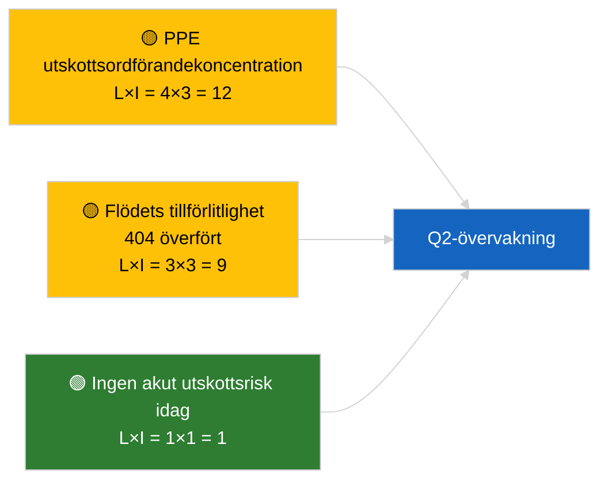
```mermaid
%%{init: {"theme":"dark"}}%%
graph LR
    R1["🟡 PPE utskottsordförandekoncentration<br/>L×I = 4×3 = 12"] --> CONS["Q2-övervakning"]
    R2["🟡 Flödets tillförlitlighet<br/>404 överfört<br/>L×I = 3×3 = 9"] --> CONS
    R3["🟢 Ingen akut utskottsrisk idag<br/>L×I = 1×1 = 1"] --> CONS
    style R1 fill:#FFC107,color:#000000
    style R2 fill:#FFC107,color:#000000
    style R3 fill:#2E7D32,color:#FFFFFF
    style CONS fill:#1565C0,color:#FFFFFF
```

| Risk | S | I | Poäng | Utlösare | Källa | Admiralitet |
|------|:-:|:-:|:-----:|----------|-------|:-----------:|
| PPE utskottsordförandekoncentration | 4 | 3 | 12 | Q2 föredragandeförordnanden | Strukturell | A2 |
| Flöde-API tillförlitlighet | 3 | 3 | 9 | Bestående 404 | Syskorkörning breaking | B2 |

---

### 🔮 Främsta framtida utlösare

**Utskottsarbetsvecka 13-17 april 2026** — första substantiella Q2 utskottsrapportscykeln.

---

### 🛡️ Källkvalitetsbedömning

- **Primära källor:** EP:s öppna dataportal; körning `b64d7ca7-e49c-4fb7-9203-9946d31bfcae`.
- **Databegränsningar:** Flöde-API 404 överfört från föregående dag.
- **Tillförlitlighet:** 🟢 HÖG för kalenderdriven inaktivitet.

---

### 📎 Länkar

| Länk | Sökväg |
|------|--------|
| Artikel | `./article.md` |
| Syskorkörningar | `analysis/daily/2026-04-02/breaking/`, `motions/`, `propositions/` |
| Manifest | `./manifest.json` |

---

### 🔄 Korsreferens

Samtliga parallella körningar 2026-04-02 visar identisk tom mallutdata. Fortsätter det 5+ dagars recessmönster som loggats sedan 2026-03-27.

---

**Dokumentkontroll**
- **Mall:** `/analysis/templates/executive-brief.md`
- **Artefaktsökväg:** `analysis/daily/2026-04-02/committee-reports/executive-brief.md`
- **Klassificering:** Offentlig
- **Retrospektiv generering:** Back-fill-session.

### Executive Brief Zh

**分类：** OSINT | 公开议会记录
**可靠性：** 🟢 高（议会休会期间结构性评估）
**生成日期：** 2026-04-02T00:00:00Z（追溯性简报）
**文章类型：** 委员会报告
**运行ID：** `b64d7ca7-e49c-4fb7-9203-9946d31bfcae`
**来源：** 欧洲议会开放数据门户

---

### 🎯 BLUF

**2026-04-02无新委员会报告；共4周休会中的第2周持续进行。** 运行 `b64d7ca7-e49c-4fb7-9203-9946d31bfcae` 返回了**0名分类行为者**，以及所有维度上的**常规**显著性，与2026-04-01/committee-reports的模板状态完全一致。实质性委员会基准线维持3月延续：ECON（ECB副行长 TA-10-2026-0060）、TRAN/ENVI（重型车辆排放 TA-10-2026-0084）、JURI（布劳恩豁免权 TA-10-2026-0088）、AFET（格鲁吉亚 TA-10-2026-0083）。**🟢 高可靠性**，适用于日历驱动的空状态。

---

### 🧭 本简报支持的3项决策

| # | 决策 | 决策者 | 截止日期 | 依据 |
|:-:|------|--------|:--------:|------|
| 1 | **编辑：** 每日跳过委员会报告 | 编辑 | +24小时 | 空运行输出 |
| 2 | **监控：** 维持 `get_committee_documents_feed` 健康检查 | 数据管道 | +24小时 | 持续404模式 |
| 3 | **前瞻监控：** 4月13-17日委员会工作周 — 实质性Q2报告 | 分析负责人 | 2026-04-13 | 全体会议前周期 |

---

### 📰 60秒阅读

- 🔴 **今日无委员会文件被索引；** 休会周，无委员会会议安排。（🟢 高）
- 🟠 **0名行为者被分类；** 未识别任何报告员、影子报告员或委员会主席。（🟢 高）
- 🟢 **委员会延续基准线：** ECON、TRAN/ENVI、JURI、AFET投资组合仍是Q2的活跃前沿。（🟢 高）
- 🟡 **所有风险维度均为"无"** — 今日委员会无紧急风险。（🟢 高）
- 🔵 **经济背景：** ECON对ECB的确认提供了Q2的机构锚定。（🟢 高）
- 🟣 **交叉参照：** 2026-04-02的所有并行运行均显示相同的空模板输出；全系统休会模式。（🟢 高）
- 🩷 **干扰向量：** 今日无紧急情况。（🟢 高）
- ⚪ **延续：** 欧盟-南方共同市场INTA文件等待欧盟法院意见。

---

### 🗂️ 重要文件 / 程序表

| 排名 | EP参考 | 标题（简称） | 重要性 | 可靠性 | 状态 |
|:---:|--------|------------|:-----:|:------:|------|
| 1 | — | 2026-04-02无委员会报告 | 0.0 | 🟢 高 | 休会 — 无活动 |
| 2 | TA-10-2026-0060 | ECON — ECB副行长（延续） | 7.5 | 🟢 高 | Q2基准线 |
| 3 | TA-10-2026-0084 | TRAN/ENVI — 重型车辆排放（延续） | 7.0 | 🟢 高 | 转置监控 |

---

### ⚠️ 风险与威胁概况

```mermaid
%%{init: {"theme":"dark"}}%%
graph LR
    R1["🟡 PPE委员会主席职位集中<br/>L×I = 4×3 = 12"] --> CONS["Q2监控"]
    R2["🟡 信息流可靠性<br/>404延续<br/>L×I = 3×3 = 9"] --> CONS
    R3["🟢 今日委员会无紧急风险<br/>L×I = 1×1 = 1"] --> CONS
    style R1 fill:#FFC107,color:#000000
    style R2 fill:#FFC107,color:#000000
    style R3 fill:#2E7D32,color:#FFFFFF
    style CONS fill:#1565C0,color:#FFFFFF
```

| 风险 | L | I | 分值 | 触发因素 | 来源 | 海军评级 |
|------|:-:|:-:|:---:|---------|------|:-------:|
| PPE委员会主席职位集中 | 4 | 3 | 12 | Q2报告员任命 | 结构性 | A2 |
| 信息流API可靠性 | 3 | 3 | 9 | 持续404 | 姊妹运行 breaking | B2 |

---

### 🔮 最重要的未来触发因素

**2026年4月13-17日委员会工作周** — 第一个实质性Q2委员会报告周期。

---

### 🛡️ 信息来源质量评估

- **主要来源：** 欧洲议会开放数据门户；运行 `b64d7ca7-e49c-4fb7-9203-9946d31bfcae`。
- **数据限制：** 信息流API 404从前一天延续。
- **可靠性：** 🟢 高，适用于日历驱动的非活动状态。

---

### 📎 链接

| 链接 | 路径 |
|------|------|
| 文章 | `./article.md` |
| 姊妹运行 | `analysis/daily/2026-04-02/breaking/`, `motions/`, `propositions/` |
| 清单 | `./manifest.json` |

---

### 🔄 交叉参照

2026-04-02的所有并行运行均显示相同的空模板输出。延续自2026-03-27以来记录的5天以上休会模式。

---

**文件控制**
- **模板：** `/analysis/templates/executive-brief.md`
- **制品路径：** `analysis/daily/2026-04-02/committee-reports/executive-brief.md`
- **分类：** 公开
- **追溯性生成：** 回填会话。

### Coalition Analysis

### Overview
Analysis of political group cohesion and coalition dynamics.

### Coalition Metrics
- **Overall Stability**: 0.0%
- **Forecast**: volatile
- **Patterns Analysed**: 0

### Group Analysis
- **Stable Groups**: No stable groups identified
- **Declining Groups**: No declining groups identified

### Coalition Intelligence
- **Patterns Evaluated**: 0

### Date: 2026-04-02

### Stakeholder Analysis

### Data Available for Stakeholder Assessment
| Stakeholder Group | Primary Data Sources | Data Points |
|-------------------|---------------------|-------------|
| Political Groups | Procedures, Adopted Texts, Voting Records, Coalitions | 30 |
| Civil Society | Documents, Questions, Events | 0 |
| Industry | Procedures, Adopted Texts | 30 |
| National Governments | Adopted Texts, Procedures, Coalitions | 30 |
| Citizens | Questions, MEP Updates, Events | 0 |
| EU Institutions | Events, Procedures, Adopted Texts, Voting Records | 30 |

### Data Source Summary
| Source | Count |
|--------|-------|
| patterns | 0 |
| votingRecords | 0 |
| events | 0 |
| documents | 0 |
| adoptedTexts | 30 |
| procedures | 0 |
| mepUpdates | 0 |
| plenaryDocuments | 0 |
| committeeDocuments | 0 |
| plenarySessionDocuments | 0 |
| externalDocuments | 0 |
| questions | 0 |
| declarations | 0 |
| corporateBodies | 0 |

### Date: 2026-04-02

> **Provenance & Audit**
>
> - **Article type:** `committee-reports`
> - **Run date:** 2026-04-02
> - **Run id:** `b64d7ca7-e49c-4fb7-9203-9946d31bfcae`
> - **Gate result:** `PENDING`
> - **Analysis tree:** [analysis/daily/2026-04-02/committee-reports](https://github.com/Hack23/euparliamentmonitor/tree/main/analysis/daily/2026-04-02/committee-reports)
> - **Manifest:** [manifest.json](https://github.com/Hack23/euparliamentmonitor/blob/main/analysis/daily/2026-04-02/committee-reports/manifest.json)

<h2 id="aggregator-tradecraft-references">Tradecraft References</h2>

This article is produced under the [Hack23 AB](https://hack23.com) intelligence tradecraft library. Every methodology and artifact template applied to this run is linked below.

### Artifact templates

- [README](https://github.com/Hack23/euparliamentmonitor/blob/main/analysis/templates/README.md)
- [Actor Mapping](https://github.com/Hack23/euparliamentmonitor/blob/main/analysis/templates/actor-mapping.md)
- [Actor Threat Profiles](https://github.com/Hack23/euparliamentmonitor/blob/main/analysis/templates/actor-threat-profiles.md)
- [Analysis Index](https://github.com/Hack23/euparliamentmonitor/blob/main/analysis/templates/analysis-index.md)
- [Coalition Dynamics](https://github.com/Hack23/euparliamentmonitor/blob/main/analysis/templates/coalition-dynamics.md)
- [Coalition Mathematics](https://github.com/Hack23/euparliamentmonitor/blob/main/analysis/templates/coalition-mathematics.md)
- [Commission Wp Alignment](https://github.com/Hack23/euparliamentmonitor/blob/main/analysis/templates/commission-wp-alignment.md)
- [Comparative International](https://github.com/Hack23/euparliamentmonitor/blob/main/analysis/templates/comparative-international.md)
- [Consequence Trees](https://github.com/Hack23/euparliamentmonitor/blob/main/analysis/templates/consequence-trees.md)
- [Cross Reference Map](https://github.com/Hack23/euparliamentmonitor/blob/main/analysis/templates/cross-reference-map.md)
- [Cross Run Diff](https://github.com/Hack23/euparliamentmonitor/blob/main/analysis/templates/cross-run-diff.md)
- [Cross Session Intelligence](https://github.com/Hack23/euparliamentmonitor/blob/main/analysis/templates/cross-session-intelligence.md)
- [Data Availability Assessment](https://github.com/Hack23/euparliamentmonitor/blob/main/analysis/templates/data-availability-assessment.md)
- [Data Download Manifest](https://github.com/Hack23/euparliamentmonitor/blob/main/analysis/templates/data-download-manifest.md)
- [Deep Analysis](https://github.com/Hack23/euparliamentmonitor/blob/main/analysis/templates/deep-analysis.md)
- [Devils Advocate Analysis](https://github.com/Hack23/euparliamentmonitor/blob/main/analysis/templates/devils-advocate-analysis.md)
- [Economic Context](https://github.com/Hack23/euparliamentmonitor/blob/main/analysis/templates/economic-context.md)
- [Executive Brief](https://github.com/Hack23/euparliamentmonitor/blob/main/analysis/templates/executive-brief.md)
- [Forces Analysis](https://github.com/Hack23/euparliamentmonitor/blob/main/analysis/templates/forces-analysis.md)
- [Forward Indicators](https://github.com/Hack23/euparliamentmonitor/blob/main/analysis/templates/forward-indicators.md)
- [Forward Projection](https://github.com/Hack23/euparliamentmonitor/blob/main/analysis/templates/forward-projection.md)
- [Historical Baseline](https://github.com/Hack23/euparliamentmonitor/blob/main/analysis/templates/historical-baseline.md)
- [Historical Parallels](https://github.com/Hack23/euparliamentmonitor/blob/main/analysis/templates/historical-parallels.md)
- [Imf Vintage Audit](https://github.com/Hack23/euparliamentmonitor/blob/main/analysis/templates/imf-vintage-audit.md)
- [Impact Matrix](https://github.com/Hack23/euparliamentmonitor/blob/main/analysis/templates/impact-matrix.md)
- [Implementation Feasibility](https://github.com/Hack23/euparliamentmonitor/blob/main/analysis/templates/implementation-feasibility.md)
- [Intelligence Assessment](https://github.com/Hack23/euparliamentmonitor/blob/main/analysis/templates/intelligence-assessment.md)
- [Legislative Disruption](https://github.com/Hack23/euparliamentmonitor/blob/main/analysis/templates/legislative-disruption.md)
- [Legislative Pipeline Forecast](https://github.com/Hack23/euparliamentmonitor/blob/main/analysis/templates/legislative-pipeline-forecast.md)
- [Legislative Velocity Risk](https://github.com/Hack23/euparliamentmonitor/blob/main/analysis/templates/legislative-velocity-risk.md)
- [Mandate Fulfilment Scorecard](https://github.com/Hack23/euparliamentmonitor/blob/main/analysis/templates/mandate-fulfilment-scorecard.md)
- [Mcp Reliability Audit](https://github.com/Hack23/euparliamentmonitor/blob/main/analysis/templates/mcp-reliability-audit.md)
- [Media Framing Analysis](https://github.com/Hack23/euparliamentmonitor/blob/main/analysis/templates/media-framing-analysis.md)
- [Methodology Reflection](https://github.com/Hack23/euparliamentmonitor/blob/main/analysis/templates/methodology-reflection.md)
- [Parliamentary Calendar Projection](https://github.com/Hack23/euparliamentmonitor/blob/main/analysis/templates/parliamentary-calendar-projection.md)
- [Per File Political Intelligence](https://github.com/Hack23/euparliamentmonitor/blob/main/analysis/templates/per-file-political-intelligence.md)
- [Pestle Analysis](https://github.com/Hack23/euparliamentmonitor/blob/main/analysis/templates/pestle-analysis.md)
- [Political Capital Risk](https://github.com/Hack23/euparliamentmonitor/blob/main/analysis/templates/political-capital-risk.md)
- [Political Classification](https://github.com/Hack23/euparliamentmonitor/blob/main/analysis/templates/political-classification.md)
- [Political Threat Landscape](https://github.com/Hack23/euparliamentmonitor/blob/main/analysis/templates/political-threat-landscape.md)
- [Presidency Trio Context](https://github.com/Hack23/euparliamentmonitor/blob/main/analysis/templates/presidency-trio-context.md)
- [Quantitative Swot](https://github.com/Hack23/euparliamentmonitor/blob/main/analysis/templates/quantitative-swot.md)
- [Reference Analysis Quality](https://github.com/Hack23/euparliamentmonitor/blob/main/analysis/templates/reference-analysis-quality.md)
- [Risk Assessment](https://github.com/Hack23/euparliamentmonitor/blob/main/analysis/templates/risk-assessment.md)
- [Risk Matrix](https://github.com/Hack23/euparliamentmonitor/blob/main/analysis/templates/risk-matrix.md)
- [Scenario Forecast](https://github.com/Hack23/euparliamentmonitor/blob/main/analysis/templates/scenario-forecast.md)
- [Seat Projection](https://github.com/Hack23/euparliamentmonitor/blob/main/analysis/templates/seat-projection.md)
- [Session Baseline](https://github.com/Hack23/euparliamentmonitor/blob/main/analysis/templates/session-baseline.md)
- [Significance Classification](https://github.com/Hack23/euparliamentmonitor/blob/main/analysis/templates/significance-classification.md)
- [Significance Scoring](https://github.com/Hack23/euparliamentmonitor/blob/main/analysis/templates/significance-scoring.md)
- [Stakeholder Impact](https://github.com/Hack23/euparliamentmonitor/blob/main/analysis/templates/stakeholder-impact.md)
- [Stakeholder Map](https://github.com/Hack23/euparliamentmonitor/blob/main/analysis/templates/stakeholder-map.md)
- [Swot Analysis](https://github.com/Hack23/euparliamentmonitor/blob/main/analysis/templates/swot-analysis.md)
- [Synthesis Summary](https://github.com/Hack23/euparliamentmonitor/blob/main/analysis/templates/synthesis-summary.md)
- [Term Arc](https://github.com/Hack23/euparliamentmonitor/blob/main/analysis/templates/term-arc.md)
- [Threat Analysis](https://github.com/Hack23/euparliamentmonitor/blob/main/analysis/templates/threat-analysis.md)
- [Threat Model](https://github.com/Hack23/euparliamentmonitor/blob/main/analysis/templates/threat-model.md)
- [Voter Segmentation](https://github.com/Hack23/euparliamentmonitor/blob/main/analysis/templates/voter-segmentation.md)
- [Voting Patterns](https://github.com/Hack23/euparliamentmonitor/blob/main/analysis/templates/voting-patterns.md)
- [Wildcards Blackswans](https://github.com/Hack23/euparliamentmonitor/blob/main/analysis/templates/wildcards-blackswans.md)
- [Workflow Audit](https://github.com/Hack23/euparliamentmonitor/blob/main/analysis/templates/workflow-audit.md)

### Methodologies

- [README](https://github.com/Hack23/euparliamentmonitor/blob/main/analysis/methodologies/README.md)
- [Ai Driven Analysis Guide](https://github.com/Hack23/euparliamentmonitor/blob/main/analysis/methodologies/ai-driven-analysis-guide.md)
- [Analytical Supplementary Methodology](https://github.com/Hack23/euparliamentmonitor/blob/main/analysis/methodologies/analytical-supplementary-methodology.md)
- [Artifact Catalog](https://github.com/Hack23/euparliamentmonitor/blob/main/analysis/methodologies/artifact-catalog.md)
- [Confidence Calibration](https://github.com/Hack23/euparliamentmonitor/blob/main/analysis/methodologies/confidence-calibration.md)
- [Electoral Cycle Methodology](https://github.com/Hack23/euparliamentmonitor/blob/main/analysis/methodologies/electoral-cycle-methodology.md)
- [Electoral Domain Methodology](https://github.com/Hack23/euparliamentmonitor/blob/main/analysis/methodologies/electoral-domain-methodology.md)
- [Forward Projection Methodology](https://github.com/Hack23/euparliamentmonitor/blob/main/analysis/methodologies/forward-projection-methodology.md)
- [Imf Indicator Mapping](https://github.com/Hack23/euparliamentmonitor/blob/main/analysis/methodologies/imf-indicator-mapping.md)
- [Osint Tradecraft Standards](https://github.com/Hack23/euparliamentmonitor/blob/main/analysis/methodologies/osint-tradecraft-standards.md)
- [Per Artifact Methodologies](https://github.com/Hack23/euparliamentmonitor/blob/main/analysis/methodologies/per-artifact-methodologies.md)
- [Per Document Methodology](https://github.com/Hack23/euparliamentmonitor/blob/main/analysis/methodologies/per-document-methodology.md)
- [Political Classification Guide](https://github.com/Hack23/euparliamentmonitor/blob/main/analysis/methodologies/political-classification-guide.md)
- [Political Risk Methodology](https://github.com/Hack23/euparliamentmonitor/blob/main/analysis/methodologies/political-risk-methodology.md)
- [Political Style Guide](https://github.com/Hack23/euparliamentmonitor/blob/main/analysis/methodologies/political-style-guide.md)
- [Political Swot Framework](https://github.com/Hack23/euparliamentmonitor/blob/main/analysis/methodologies/political-swot-framework.md)
- [Political Threat Framework](https://github.com/Hack23/euparliamentmonitor/blob/main/analysis/methodologies/political-threat-framework.md)
- [Seo Headers Policy](https://github.com/Hack23/euparliamentmonitor/blob/main/analysis/methodologies/seo-headers-policy.md)
- [Source Triangulation](https://github.com/Hack23/euparliamentmonitor/blob/main/analysis/methodologies/source-triangulation.md)
- [Strategic Extensions Methodology](https://github.com/Hack23/euparliamentmonitor/blob/main/analysis/methodologies/strategic-extensions-methodology.md)
- [Structural Metadata Methodology](https://github.com/Hack23/euparliamentmonitor/blob/main/analysis/methodologies/structural-metadata-methodology.md)
- [Synthesis Methodology](https://github.com/Hack23/euparliamentmonitor/blob/main/analysis/methodologies/synthesis-methodology.md)
- [Voter Segmentation Methodology](https://github.com/Hack23/euparliamentmonitor/blob/main/analysis/methodologies/voter-segmentation-methodology.md)
- [Worldbank Indicator Mapping](https://github.com/Hack23/euparliamentmonitor/blob/main/analysis/methodologies/worldbank-indicator-mapping.md)

<h2 id="aggregator-analysis-index">Analysis Index</h2>

Every artifact below was read by the aggregator and contributed to this article. The raw [manifest.json](https://github.com/Hack23/euparliamentmonitor/blob/main/analysis/daily/2026-04-02/committee-reports/manifest.json) carries the full machine-readable list, including gate-result history.

| Section | Artifact | Path |
|---|---|---|
| section-executive-brief | [executive-brief](https://github.com/Hack23/euparliamentmonitor/blob/main/analysis/daily/2026-04-02/committee-reports/executive-brief.md) | `executive-brief.md` |
| section-actors-forces | [actor-mapping](https://github.com/Hack23/euparliamentmonitor/blob/main/analysis/daily/2026-04-02/committee-reports/classification/actor-mapping.md) | `classification/actor-mapping.md` |
| section-actors-forces | [forces-analysis](https://github.com/Hack23/euparliamentmonitor/blob/main/analysis/daily/2026-04-02/committee-reports/classification/forces-analysis.md) | `classification/forces-analysis.md` |
| section-actors-forces | [impact-matrix](https://github.com/Hack23/euparliamentmonitor/blob/main/analysis/daily/2026-04-02/committee-reports/classification/impact-matrix.md) | `classification/impact-matrix.md` |
| section-actors-forces | [significance-assessment](https://github.com/Hack23/euparliamentmonitor/blob/main/analysis/daily/2026-04-02/committee-reports/classification/significance-assessment.md) | `classification/significance-assessment.md` |
| section-coalitions-voting | [voting-patterns](https://github.com/Hack23/euparliamentmonitor/blob/main/analysis/daily/2026-04-02/committee-reports/existing/voting-patterns.md) | `existing/voting-patterns.md` |
| section-risk | [risk-matrix](https://github.com/Hack23/euparliamentmonitor/blob/main/analysis/daily/2026-04-02/committee-reports/risk-scoring/risk-matrix.md) | `risk-scoring/risk-matrix.md` |
| section-risk | [quantitative-swot](https://github.com/Hack23/euparliamentmonitor/blob/main/analysis/daily/2026-04-02/committee-reports/risk-scoring/quantitative-swot.md) | `risk-scoring/quantitative-swot.md` |
| section-risk | [political-capital-risk](https://github.com/Hack23/euparliamentmonitor/blob/main/analysis/daily/2026-04-02/committee-reports/risk-scoring/political-capital-risk.md) | `risk-scoring/political-capital-risk.md` |
| section-risk | [legislative-velocity-risk](https://github.com/Hack23/euparliamentmonitor/blob/main/analysis/daily/2026-04-02/committee-reports/risk-scoring/legislative-velocity-risk.md) | `risk-scoring/legislative-velocity-risk.md` |
| section-risk | [agent-risk-workflow](https://github.com/Hack23/euparliamentmonitor/blob/main/analysis/daily/2026-04-02/committee-reports/risk-scoring/agent-risk-workflow.md) | `risk-scoring/agent-risk-workflow.md` |
| section-threat | [actor-threat-profiles](https://github.com/Hack23/euparliamentmonitor/blob/main/analysis/daily/2026-04-02/committee-reports/threat-assessment/actor-threat-profiles.md) | `threat-assessment/actor-threat-profiles.md` |
| section-threat | [consequence-trees](https://github.com/Hack23/euparliamentmonitor/blob/main/analysis/daily/2026-04-02/committee-reports/threat-assessment/consequence-trees.md) | `threat-assessment/consequence-trees.md` |
| section-threat | [legislative-disruption](https://github.com/Hack23/euparliamentmonitor/blob/main/analysis/daily/2026-04-02/committee-reports/threat-assessment/legislative-disruption.md) | `threat-assessment/legislative-disruption.md` |
| section-threat | [political-threat-landscape](https://github.com/Hack23/euparliamentmonitor/blob/main/analysis/daily/2026-04-02/committee-reports/threat-assessment/political-threat-landscape.md) | `threat-assessment/political-threat-landscape.md` |
| section-continuity | [cross-session-intelligence](https://github.com/Hack23/euparliamentmonitor/blob/main/analysis/daily/2026-04-02/committee-reports/existing/cross-session-intelligence.md) | `existing/cross-session-intelligence.md` |
| section-deep-analysis | [deep-analysis](https://github.com/Hack23/euparliamentmonitor/blob/main/analysis/daily/2026-04-02/committee-reports/existing/deep-analysis.md) | `existing/deep-analysis.md` |
| section-supplementary-intelligence | [executive-brief_ar](https://github.com/Hack23/euparliamentmonitor/blob/main/analysis/daily/2026-04-02/committee-reports/executive-brief_ar.md) | `executive-brief_ar.md` |
| section-supplementary-intelligence | [executive-brief_da](https://github.com/Hack23/euparliamentmonitor/blob/main/analysis/daily/2026-04-02/committee-reports/executive-brief_da.md) | `executive-brief_da.md` |
| section-supplementary-intelligence | [executive-brief_de](https://github.com/Hack23/euparliamentmonitor/blob/main/analysis/daily/2026-04-02/committee-reports/executive-brief_de.md) | `executive-brief_de.md` |
| section-supplementary-intelligence | [executive-brief_es](https://github.com/Hack23/euparliamentmonitor/blob/main/analysis/daily/2026-04-02/committee-reports/executive-brief_es.md) | `executive-brief_es.md` |
| section-supplementary-intelligence | [executive-brief_fi](https://github.com/Hack23/euparliamentmonitor/blob/main/analysis/daily/2026-04-02/committee-reports/executive-brief_fi.md) | `executive-brief_fi.md` |
| section-supplementary-intelligence | [executive-brief_fr](https://github.com/Hack23/euparliamentmonitor/blob/main/analysis/daily/2026-04-02/committee-reports/executive-brief_fr.md) | `executive-brief_fr.md` |
| section-supplementary-intelligence | [executive-brief_he](https://github.com/Hack23/euparliamentmonitor/blob/main/analysis/daily/2026-04-02/committee-reports/executive-brief_he.md) | `executive-brief_he.md` |
| section-supplementary-intelligence | [executive-brief_ja](https://github.com/Hack23/euparliamentmonitor/blob/main/analysis/daily/2026-04-02/committee-reports/executive-brief_ja.md) | `executive-brief_ja.md` |
| section-supplementary-intelligence | [executive-brief_ko](https://github.com/Hack23/euparliamentmonitor/blob/main/analysis/daily/2026-04-02/committee-reports/executive-brief_ko.md) | `executive-brief_ko.md` |
| section-supplementary-intelligence | [executive-brief_nl](https://github.com/Hack23/euparliamentmonitor/blob/main/analysis/daily/2026-04-02/committee-reports/executive-brief_nl.md) | `executive-brief_nl.md` |
| section-supplementary-intelligence | [executive-brief_no](https://github.com/Hack23/euparliamentmonitor/blob/main/analysis/daily/2026-04-02/committee-reports/executive-brief_no.md) | `executive-brief_no.md` |
| section-supplementary-intelligence | [executive-brief_sv](https://github.com/Hack23/euparliamentmonitor/blob/main/analysis/daily/2026-04-02/committee-reports/executive-brief_sv.md) | `executive-brief_sv.md` |
| section-supplementary-intelligence | [executive-brief_zh](https://github.com/Hack23/euparliamentmonitor/blob/main/analysis/daily/2026-04-02/committee-reports/executive-brief_zh.md) | `executive-brief_zh.md` |
| section-supplementary-intelligence | [coalition-analysis](https://github.com/Hack23/euparliamentmonitor/blob/main/analysis/daily/2026-04-02/committee-reports/existing/coalition-analysis.md) | `existing/coalition-analysis.md` |
| section-supplementary-intelligence | [stakeholder-analysis](https://github.com/Hack23/euparliamentmonitor/blob/main/analysis/daily/2026-04-02/committee-reports/existing/stakeholder-analysis.md) | `existing/stakeholder-analysis.md` |

