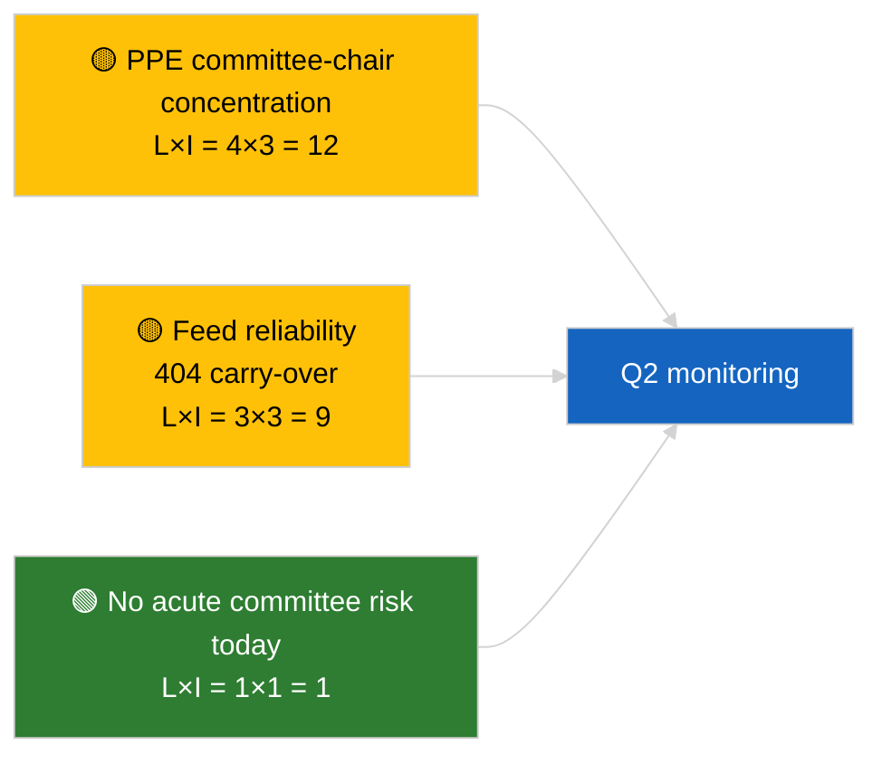

<!-- SPDX-FileCopyrightText: 2026 Hack23 AB -->
<!-- SPDX-License-Identifier: Apache-2.0 -->

# Executive Brief — Committee Reports | 2026-04-02

**Classification:** OSINT | Public Parliamentary Record
**Confidence:** 🟢 High (recess-period structural assessment)
**Generated:** 2026-04-02T00:00:00Z (retrospective brief)
**Article Type:** Committee Reports
**Run ID:** `b64d7ca7-e49c-4fb7-9203-9946d31bfcae`
**Source:** European Parliament Open Data Portal

---

## 🎯 BLUF

**No new committee reports on 2026-04-02; recess week 2 of 4 continues.** Run `b64d7ca7-e49c-4fb7-9203-9946d31bfcae` returned **0 classified actors** and **ROUTINE** significance across all dimensions, identical to the 2026-04-01/committee-reports template state. Substantive committee baseline remains the March carry-over: ECON (ECB Vice-President TA-10-2026-0060), TRAN/ENVI (HDV emissions TA-10-2026-0084), JURI (Braun immunity TA-10-2026-0088), AFET (Georgia TA-10-2026-0083). **🟢 HIGH confidence** empty state is calendar-driven.

---

## 🧭 3 Decisions This Brief Supports

| # | Decision | Who Decides | Deadline | Evidence |
|:-:|----------|-------------|:--------:|----------|
| 1 | **Editorial:** SKIP committee-reports daily | Editor | +24h | Empty run output |
| 2 | **Monitoring:** maintain `get_committee_documents_feed` health watch | Data pipeline | +24h | Concurrent 404 pattern |
| 3 | **Forward-watch:** committee work-week 13-17 April for substantive Q2 reports | Analysis lead | 2026-04-13 | Pre-plenary cycle |

---

## 📰 60-Second Read

- 🔴 **No committee documents indexed** today; recess week, no committee sittings scheduled. (🟢 High)
- 🟠 **0 actors classified**; no rapporteurs, shadow rapporteurs, or committee chairs identified. (🟢 High)
- 🟢 **Committee carry-over baseline:** ECON, TRAN/ENVI, JURI, AFET portfolios remain the active Q2 surfaces. (🟢 High)
- 🟡 **Risk dimensions all "none"** — no acute committee-stage risk today. (🟢 High)
- 🔵 **Economic context:** ECON's ECB confirmation provides Q2 institutional anchor. (🟢 High)
- 🟣 **Cross-reference:** sibling 2026-04-02 runs all empty-template; system-wide recess pattern. (🟢 High)
- 🩷 **Disruption vector:** none acute today. (🟢 High)
- ⚪ **Carry-forward:** EU-Mercosur INTA file awaits ECJ opinion.

---

## 🗂️ Top Documents / Procedures Table

| Rank | EP reference | Title (short) | Significance | Confidence | Status |
|:----:|--------------|---------------|:------------:|:----------:|--------|
| 1 | — | No committee reports on 2026-04-02 | 0.0 | 🟢 HIGH | Recess — no activity |
| 2 | TA-10-2026-0060 | ECON — ECB Vice-President (carry-over) | 7.5 | 🟢 HIGH | Q2 baseline |
| 3 | TA-10-2026-0084 | TRAN/ENVI — HDV emissions (carry-over) | 7.0 | 🟢 HIGH | Transposition watch |

---

## ⚠️ Risk & Threat Snapshot

| Risk | L | I | Score | Trigger | Source | Admiralty |
|------|:-:|:-:|:-----:|---------|--------|:---------:|
| PPE committee-chair concentration | 4 | 3 | 12 | Q2 rapporteur appointments | Structural | A2 |
| Feed-API reliability | 3 | 3 | 9 | Sustained 404 | Sibling breaking run | B2 |

---

## 🔮 Top Forward Trigger

**Committee work-week 13-17 April 2026** — first substantive Q2 committee-reports cycle.

---

## 🛡️ Source Quality Assessment

- **Primary sources:** EP Open Data Portal; run `b64d7ca7-e49c-4fb7-9203-9946d31bfcae`.
- **Data limitations:** Feed-API 404 carry-over from previous day.
- **Confidence:** 🟢 HIGH on calendar-driven inactivity.

---

## 📎 Links

| Link | Path |
|------|------|
| Article | `./article.md` |
| Sibling runs | `analysis/daily/2026-04-02/breaking/`, `motions/`, `propositions/` |
| Manifest | `./manifest.json` |

---

## 🔄 Cross-Reference

Concurrent 2026-04-02 runs all show identical empty-template output. Continues the 5+ day recess pattern logged since 2026-03-27.

---

**Document Control**
- **Template:** `/analysis/templates/executive-brief.md`
- **Artifact path:** `analysis/daily/2026-04-02/committee-reports/executive-brief.md`
- **Classification:** Public
- **Retrospective generation:** Back-fill session.
