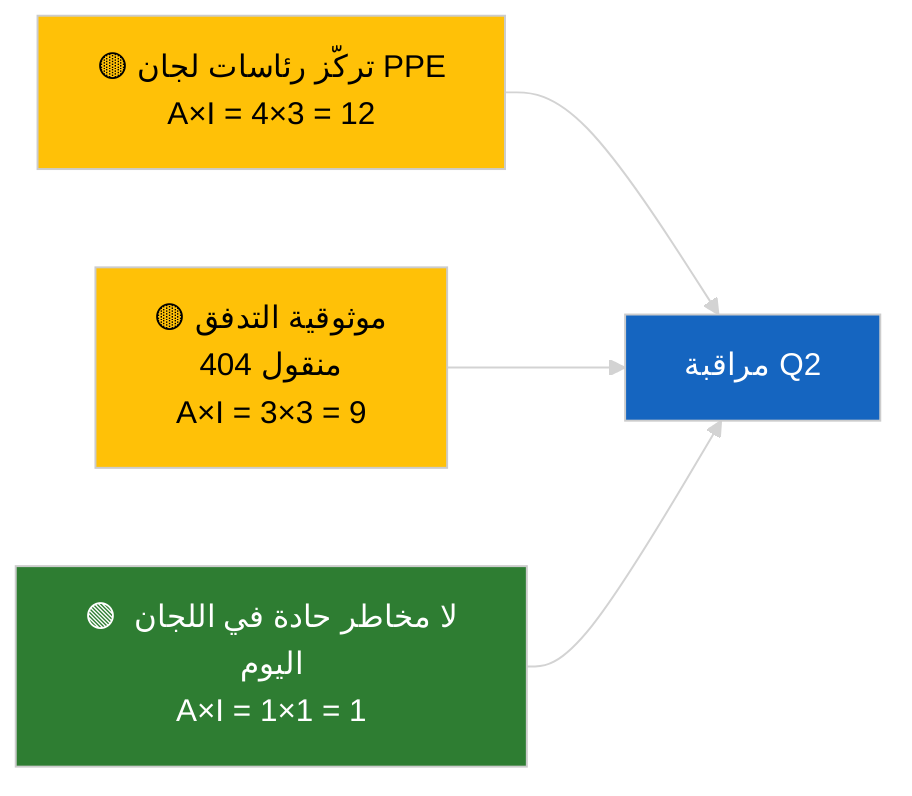

<!-- SPDX-FileCopyrightText: 2026 Hack23 AB -->
<!-- SPDX-License-Identifier: Apache-2.0 -->

# إحاطة تنفيذية — تقارير اللجان | 2026-04-02

**التصنيف:** OSINT | سجل برلماني عام
**الموثوقية:** 🟢 عالية (تقييم هيكلي خلال فترة عطلة البرلمان)
**تاريخ الإنشاء:** 2026-04-02T00:00:00Z (إحاطة استعادية)
**نوع المقال:** تقارير اللجان
**معرّف التشغيل:** `b64d7ca7-e49c-4fb7-9203-9946d31bfcae`
**المصدر:** البوابة المفتوحة للبيانات للبرلمان الأوروبي

---

## 🎯 BLUF

**لا تقارير لجان جديدة في 2026-04-02؛ أسبوع العطلة البرلمانية 2 من أصل 4 مستمر.** أعاد التشغيل `b64d7ca7-e49c-4fb7-9203-9946d31bfcae` **صفر فاعلين مصنّفين** ودرجة أهمية **روتينية** في جميع الأبعاد، مطابقة لحالة النموذج في 2026-04-01/committee-reports. يبقى الخط الأساسي الموضوعي للجان هو الإرث المنقول من مارس: ECON (نائب رئيس البنك المركزي الأوروبي TA-10-2026-0060)، TRAN/ENVI (انبعاثات المركبات الثقيلة TA-10-2026-0084)، JURI (حصانة براون TA-10-2026-0088)، AFET (جورجيا TA-10-2026-0083). **🟢 ثقة عالية** في الحالة الفارغة المدفوعة بالتقويم.

---

## 🧭 3 قرارات تدعمها هذه الإحاطة

| # | القرار | من يقرّر | الموعد النهائي | الدليل |
|:-:|--------|----------|:--------------:|--------|
| 1 | **تحريري:** تجاهل تقارير اللجان يومياً | المحرر | +24 ساعة | نتيجة تشغيل فارغة |
| 2 | **مراقبة:** صيانة فحص صحة `get_committee_documents_feed` | خط أنابيب البيانات | +24 ساعة | نمط 404 مستمر |
| 3 | **رصد مستقبلي:** أسبوع عمل اللجان 13-17 أبريل لتقارير الربع الثاني الجوهرية | رئيس التحليل | 2026-04-13 | دورة ما قبل الجلسة العامة |

---

## 📰 قراءة 60 ثانية

- 🔴 **لا وثائق لجان مفهرسة** اليوم؛ أسبوع عطلة، لا اجتماعات لجان مجدولة. (🟢 عالية)
- 🟠 **صفر فاعلين مصنّفين**؛ لا مقرّرين أو مقرّرين ظل أو رؤساء لجان محددين. (🟢 عالية)
- 🟢 **الخط الأساسي المنقول للجان:** تبقى محافظ ECON وTRAN/ENVI وJURI وAFET أسطحاً نشطة للربع الثاني. (🟢 عالية)
- 🟡 **جميع أبعاد المخاطر «لا شيء»** — لا مخاطر حادة في اللجان اليوم. (🟢 عالية)
- 🔵 **السياق الاقتصادي:** تأكيد ECON للبنك المركزي الأوروبي يوفر مرساة مؤسسية للربع الثاني. (🟢 عالية)
- 🟣 **الإسناد المتبادل:** تظهر جميع التشغيلات المتوازية في 2026-04-02 نماذج فارغة؛ نمط عطلة شامل للنظام. (🟢 عالية)
- 🩷 **متجه الاضطراب:** لا شيء حاد اليوم. (🟢 عالية)
- ⚪ **منقول:** ملف INTA للاتحاد الأوروبي-ميركوسور ينتظر رأي محكمة العدل الأوروبية.

---

## 🗂️ أبرز الوثائق / جدول الإجراءات

| الترتيب | المرجع في البرلمان | العنوان (مختصر) | الأهمية | الموثوقية | الحالة |
|:-------:|-------------------|-----------------|:-------:|:---------:|--------|
| 1 | — | لا تقارير لجان في 2026-04-02 | 0.0 | 🟢 عالية | عطلة — لا نشاط |
| 2 | TA-10-2026-0060 | ECON — نائب رئيس البنك المركزي الأوروبي (منقول) | 7.5 | 🟢 عالية | خط Q2 الأساسي |
| 3 | TA-10-2026-0084 | TRAN/ENVI — انبعاثات المركبات الثقيلة (منقول) | 7.0 | 🟢 عالية | مراقبة النقل |

---

## ⚠️ لمحة عن المخاطر والتهديدات

| المخاطرة | أ | I | الدرجة | المحرّك | المصدر | الأميرالية |
|---------|:-:|:-:|:------:|---------|--------|:----------:|
| تركّز رئاسات لجان PPE | 4 | 3 | 12 | تعيينات مقرري الربع الثاني | هيكلي | A2 |
| موثوقية واجهة API للتدفق | 3 | 3 | 9 | 404 مستمر | تشغيل موازٍ breaking | B2 |

---

## 🔮 أبرز محفّز مستقبلي

**أسبوع عمل اللجان 13-17 أبريل 2026** — أول دورة جوهرية لتقارير لجان الربع الثاني.

---

## 🛡️ تقييم جودة المصادر

- **المصادر الأولية:** البوابة المفتوحة للبيانات للبرلمان الأوروبي؛ التشغيل `b64d7ca7-e49c-4fb7-9203-9946d31bfcae`.
- **قيود البيانات:** واجهة API للتدفق 404 منقولة من اليوم السابق.
- **الموثوقية:** 🟢 عالية للخمول المدفوع بالتقويم.

---

## 📎 الروابط

| الرابط | المسار |
|--------|--------|
| المقال | `./article.md` |
| التشغيلات الموازية | `analysis/daily/2026-04-02/breaking/`, `motions/`, `propositions/` |
| البيان | `./manifest.json` |

---

## 🔄 الإسناد المتبادل

تُظهر جميع التشغيلات المتوازية في 2026-04-02 نتيجة نموذج فارغ مطابقة. يستمر نمط العطلة لمدة 5 أيام أو أكثر المسجّل منذ 2026-03-27.

---

**ضبط الوثيقة**
- **النموذج:** `/analysis/templates/executive-brief.md`
- **مسار المنتج:** `analysis/daily/2026-04-02/committee-reports/executive-brief.md`
- **التصنيف:** عام
- **الإنشاء الاستعادي:** جلسة التعبئة الخلفية.
