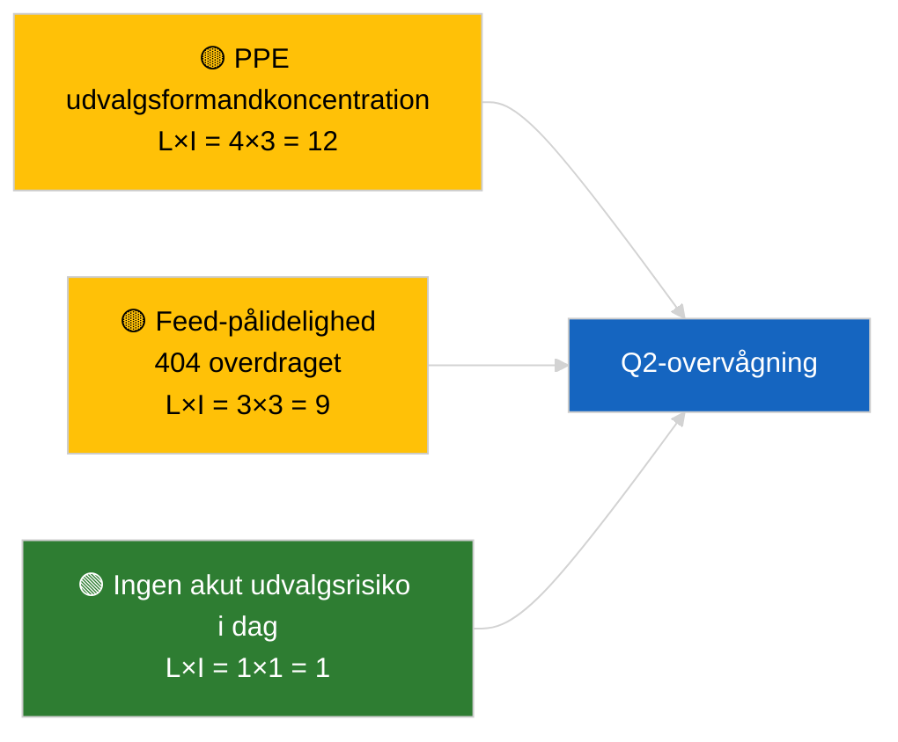

<!-- SPDX-FileCopyrightText: 2026 Hack23 AB -->
<!-- SPDX-License-Identifier: Apache-2.0 -->

# Ledelsesbriefing — Udvalgsbetænkninger | 2026-04-02

**Klassifikation:** OSINT | Offentlig parlamentarisk dokumentation
**Tillid:** 🟢 Høj (strukturel vurdering i recessperiode)
**Genereret:** 2026-04-02T00:00:00Z (retrospektiv briefing)
**Artikeltype:** Udvalgsbetænkninger
**Kørsels-ID:** `b64d7ca7-e49c-4fb7-9203-9946d31bfcae`
**Kilde:** Europa-Parlamentets åbne dataportal

---

## 🎯 BLUF

**Ingen nye udvalgsbetænkninger den 2026-04-02; recessuge 2 af 4 fortsætter.** Kørsel `b64d7ca7-e49c-4fb7-9203-9946d31bfcae` returnerede **0 klassificerede aktører** og **RUTINE**-signifikans i alle dimensioner, identisk med skabelonstatus for 2026-04-01/committee-reports. Det substantielle udvalgsbaseline er fortsat marts-overdragelsen: ECON (ECB's vicepræsident TA-10-2026-0060), TRAN/ENVI (HDV-emissioner TA-10-2026-0084), JURI (Braun-immunitet TA-10-2026-0088), AFET (Georgien TA-10-2026-0083). **🟢 HØJ tillid** for kalender-drevet tom tilstand.

---

## 🧭 3 Beslutninger denne briefing understøtter

| # | Beslutning | Hvem beslutter | Frist | Dokumentation |
|:-:|-----------|----------------|:-----:|---------------|
| 1 | **Redaktionelt:** SPRING committee-reports dagligt OVER | Redaktør | +24h | Tom kørselsoutput |
| 2 | **Overvågning:** oprethold `get_committee_documents_feed` sundhedstjek | Datapipeline | +24h | Løbende 404-mønster |
| 3 | **Fremtidsvagt:** udvalgsarbejdsuge 13-17 april for substantielle Q2-betænkninger | Analyseleder | 2026-04-13 | Præ-plenumcyklus |

---

## 📰 60-sekunders læsning

- 🔴 **Ingen udvalgsdokumenter indekseret** i dag; recessuge, ingen udvalgsmøder planlagt. (🟢 Høj)
- 🟠 **0 aktører klassificeret**; ingen ordførere, skyggeordførere eller udvalgsformænd identificeret. (🟢 Høj)
- 🟢 **Udvalgets overdragelsesbaseline:** ECON, TRAN/ENVI, JURI, AFET-porteføljer er fortsat aktive Q2-overflader. (🟢 Høj)
- 🟡 **Alle risicodimensioner "ingen"** — ingen akut udvalgsrisiko i dag. (🟢 Høj)
- 🔵 **Økonomisk kontekst:** ECON's ECB-bekræftelse giver Q2 institutionelt anker. (🟢 Høj)
- 🟣 **Krydshenvising:** parallelle kørsler 2026-04-02 alle tomme skabeloner; systemdækkende recessmønster. (🟢 Høj)
- 🩷 **Forstyrrelsesvektorer:** ingen akutte i dag. (🟢 Høj)
- ⚪ **Overføres:** EU-Mercosur INTA-sag afventer EUD-udtalelse.

---

## 🗂️ Topdokumenter / Procedurtabel

| Rang | EP-reference | Titel (kort) | Signifikans | Tillid | Status |
|:----:|--------------|--------------|:-----------:|:------:|--------|
| 1 | — | Ingen udvalgsbetænkninger 2026-04-02 | 0,0 | 🟢 HØJ | Recess — ingen aktivitet |
| 2 | TA-10-2026-0060 | ECON — ECB's vicepræsident (overdraget) | 7,5 | 🟢 HØJ | Q2-baseline |
| 3 | TA-10-2026-0084 | TRAN/ENVI — HDV-emissioner (overdraget) | 7,0 | 🟢 HØJ | Transpositionsovervågning |

---

## ⚠️ Risiko- og trusselbillede

| Risiko | S | I | Score | Udløser | Kilde | Admiralitet |
|--------|:-:|:-:|:-----:|---------|-------|:-----------:|
| PPE udvalgsformandkoncentration | 4 | 3 | 12 | Q2 ordførerforordninger | Strukturel | A2 |
| Feed-API-pålidelighed | 3 | 3 | 9 | Vedvarende 404 | Søsterløb breaking | B2 |

---

## 🔮 Vigtigste fremtidige udløser

**Udvalgsarbejdsuge 13-17 april 2026** — første substantielle Q2 udvalgsbetæknignscyklus.

---

## 🛡️ Kildekvalitetsvurdering

- **Primære kilder:** EP's åbne dataportal; kørsel `b64d7ca7-e49c-4fb7-9203-9946d31bfcae`.
- **Databegrænsninger:** Feed-API 404 overdraget fra forrige dag.
- **Tillid:** 🟢 HØJ for kalender-drevet inaktivitet.

---

## 📎 Links

| Link | Sti |
|------|-----|
| Artikel | `./article.md` |
| Søsterløb | `analysis/daily/2026-04-02/breaking/`, `motions/`, `propositions/` |
| Manifest | `./manifest.json` |

---

## 🔄 Krydshenvising

Samtlige parallelle kørsler 2026-04-02 viser identisk tom skabelonoutput. Fortsætter det 5+ dages recessmønster logget siden 2026-03-27.

---

**Dokumentkontrol**
- **Skabelon:** `/analysis/templates/executive-brief.md`
- **Artefaktsti:** `analysis/daily/2026-04-02/committee-reports/executive-brief.md`
- **Klassifikation:** Offentlig
- **Retrospektiv generering:** Back-fill-session.
