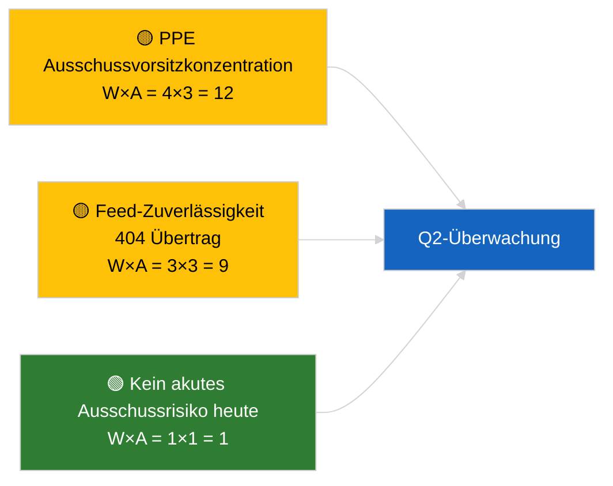

<!-- SPDX-FileCopyrightText: 2026 Hack23 AB -->
<!-- SPDX-License-Identifier: Apache-2.0 -->

# Führungsbriefing — Ausschussberichte | 2026-04-02

**Einstufung:** OSINT | Öffentlicher parlamentarischer Eintrag
**Verlässlichkeit:** 🟢 Hoch (strukturelle Bewertung in der Recessperiode)
**Erstellt:** 2026-04-02T00:00:00Z (retrospektives Briefing)
**Artikeltyp:** Ausschussberichte
**Lauf-ID:** `b64d7ca7-e49c-4fb7-9203-9946d31bfcae`
**Quelle:** Offenes Datenportal des Europäischen Parlaments

---

## 🎯 BLUF

**Keine neuen Ausschussberichte am 2026-04-02; Recesswoche 2 von 4 dauert an.** Lauf `b64d7ca7-e49c-4fb7-9203-9946d31bfcae` lieferte **0 klassifizierte Akteure** und **ROUTINE**-Signifikanz in allen Dimensionen, identisch mit dem Vorlagestatus für 2026-04-01/committee-reports. Die sachliche Ausschuss-Grundlinie bleibt der März-Übertrag: ECON (Vizepräsident der EZB TA-10-2026-0060), TRAN/ENVI (Schwere-Nutzfahrzeug-Emissionen TA-10-2026-0084), JURI (Braun-Immunität TA-10-2026-0088), AFET (Georgien TA-10-2026-0083). **🟢 HOHE Verlässlichkeit** für kalendergesteuerten Leerstand.

---

## 🧭 3 Entscheidungen, die dieses Briefing unterstützt

| # | Entscheidung | Wer entscheidet | Frist | Belege |
|:-:|-------------|-----------------|:-----:|--------|
| 1 | **Redaktionell:** committee-reports täglich ÜBERSPRINGEN | Redakteur | +24h | Leere Laufausgabe |
| 2 | **Überwachung:** `get_committee_documents_feed` Gesundheitscheck aufrechterhalten | Datenpipeline | +24h | Anhaltendes 404-Muster |
| 3 | **Vorschau:** Ausschuss-Arbeitswoche 13.–17. April für substanzielle Q2-Berichte | Analyseleiter | 2026-04-13 | Pré-Plenum-Zyklus |

---

## 📰 60-Sekunden-Lektüre

- 🔴 **Keine Ausschussdokumente indiziert** heute; Recesswoche, keine Ausschusssitzungen geplant. (🟢 Hoch)
- 🟠 **0 Akteure klassifiziert**; keine Berichterstatter, Schattenberichterstatter oder Ausschussvorsitzende identifiziert. (🟢 Hoch)
- 🟢 **Ausschuss-Übertragsgrundlinie:** ECON-, TRAN/ENVI-, JURI-, AFET-Portfolios bleiben aktive Q2-Flächen. (🟢 Hoch)
- 🟡 **Alle Risikodimensionen „keine"** — kein akutes Ausschussrisiko heute. (🟢 Hoch)
- 🔵 **Wirtschaftlicher Kontext:** ECONs EZB-Bestätigung liefert Q2-institutionellen Anker. (🟢 Hoch)
- 🟣 **Querverweise:** Parallelläufe 2026-04-02 alle leere Vorlagen; systemweites Recessmuster. (🟢 Hoch)
- 🩷 **Störungsvektor:** heute kein akuter. (🟢 Hoch)
- ⚪ **Übertragen:** EU-Mercosur INTA-Akte wartet auf EuGH-Stellungnahme.

---

## 🗂️ Wichtigste Dokumente / Verfahrenstabelle

| Rang | EP-Referenz | Titel (kurz) | Signifikanz | Verlässlichkeit | Status |
|:----:|-------------|--------------|:-----------:|:---------------:|--------|
| 1 | — | Keine Ausschussberichte 2026-04-02 | 0,0 | 🟢 HOCH | Recess — keine Aktivität |
| 2 | TA-10-2026-0060 | ECON — Vizepräsident der EZB (Übertrag) | 7,5 | 🟢 HOCH | Q2-Grundlinie |
| 3 | TA-10-2026-0084 | TRAN/ENVI — Schwere-Nutzfahrzeug-Emissionen (Übertrag) | 7,0 | 🟢 HOCH | Transpositionsüberwachung |

---

## ⚠️ Risiko- und Bedrohungsübersicht

| Risiko | W | A | Wert | Auslöser | Quelle | Admiralität |
|--------|:-:|:-:|:----:|----------|--------|:-----------:|
| PPE Ausschussvorsitzkonzentration | 4 | 3 | 12 | Q2 Berichterstatterberufungen | Strukturell | A2 |
| Feed-API-Zuverlässigkeit | 3 | 3 | 9 | Anhaltende 404 | Schwester-Lauf Breaking | B2 |

---

## 🔮 Wichtigster Zukunftsauslöser

**Ausschuss-Arbeitswoche 13.–17. April 2026** — erster substanzieller Q2-Ausschussberichtszyklus.

---

## 🛡️ Quellqualitätsbewertung

- **Primärquellen:** Offenes Datenportal des EP; Lauf `b64d7ca7-e49c-4fb7-9203-9946d31bfcae`.
- **Datenbeschränkungen:** Feed-API 404 Übertrag vom Vortag.
- **Verlässlichkeit:** 🟢 HOCH für kalendergesteuerte Inaktivität.

---

## 📎 Links

| Link | Pfad |
|------|------|
| Artikel | `./article.md` |
| Parallelläufe | `analysis/daily/2026-04-02/breaking/`, `motions/`, `propositions/` |
| Manifest | `./manifest.json` |

---

## 🔄 Querverweise

Alle Parallelläufe 2026-04-02 zeigen identische leere Vorlagenausgabe. Setzt das 5+ Tage anhaltende Recessmuster fort, das seit dem 2026-03-27 protokolliert wurde.

---

**Dokumentenkontrolle**
- **Vorlage:** `/analysis/templates/executive-brief.md`
- **Artefaktpfad:** `analysis/daily/2026-04-02/committee-reports/executive-brief.md`
- **Einstufung:** Öffentlich
- **Retrospektive Erstellung:** Back-fill-Sitzung.
