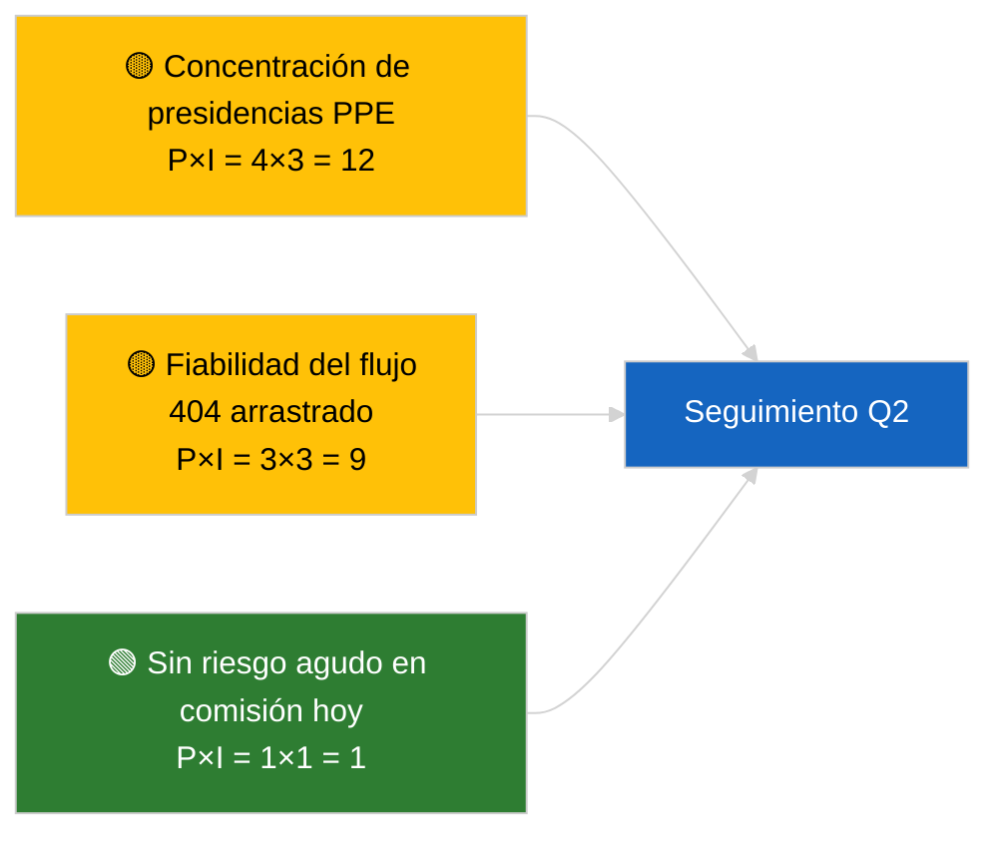

<!-- SPDX-FileCopyrightText: 2026 Hack23 AB -->
<!-- SPDX-License-Identifier: Apache-2.0 -->

# Resumen ejecutivo — Informes de comisión | 2026-04-02

**Clasificación:** OSINT | Registro parlamentario público
**Fiabilidad:** 🟢 Alta (evaluación estructural durante el período de receso)
**Generado:** 2026-04-02T00:00:00Z (resumen retrospectivo)
**Tipo de artículo:** Informes de comisión
**ID de ejecución:** `b64d7ca7-e49c-4fb7-9203-9946d31bfcae`
**Fuente:** Portal de datos abiertos del Parlamento Europeo

---

## 🎯 BLUF

**Ningún informe nuevo de comisión el 2026-04-02; la semana de receso 2 de 4 continúa.** La ejecución `b64d7ca7-e49c-4fb7-9203-9946d31bfcae` devolvió **0 actores clasificados** y significancia **RUTINARIA** en todas las dimensiones, idéntica al estado de la plantilla para 2026-04-01/committee-reports. La base referencial sustantiva de comisiones sigue siendo el arrastre de marzo: ECON (Vicepresidente del BCE TA-10-2026-0060), TRAN/ENVI (emisiones de vehículos pesados TA-10-2026-0084), JURI (inmunidad Braun TA-10-2026-0088), AFET (Georgia TA-10-2026-0083). **🟢 ALTA fiabilidad** para el estado vacío impulsado por el calendario.

---

## 🧭 3 decisiones que este resumen apoya

| # | Decisión | Quién decide | Plazo | Evidencia |
|:-:|----------|--------------|:-----:|-----------|
| 1 | **Editorial:** OMITIR committee-reports diariamente | Editor | +24h | Salida de ejecución vacía |
| 2 | **Monitoreo:** mantener vigilancia de estado `get_committee_documents_feed` | Pipeline de datos | +24h | Patrón 404 continuo |
| 3 | **Vigilancia anticipatoria:** semana de trabajo de comisión 13-17 de abril para informes Q2 sustantivos | Responsable de análisis | 2026-04-13 | Ciclo pre-plenario |

---

## 📰 Lectura de 60 segundos

- 🔴 **Ningún documento de comisión indexado** hoy; semana de receso, ninguna sesión de comisión programada. (🟢 Alta)
- 🟠 **0 actores clasificados**; ningún ponente, ponente en la sombra o presidente de comisión identificado. (🟢 Alta)
- 🟢 **Base referencial de arrastre de comisión:** Las carteras ECON, TRAN/ENVI, JURI, AFET siguen siendo superficies activas Q2. (🟢 Alta)
- 🟡 **Todas las dimensiones de riesgo «ninguna»** — ningún riesgo agudo en comisión hoy. (🟢 Alta)
- 🔵 **Contexto económico:** La confirmación del BCE por parte de ECON proporciona un anclaje institucional Q2. (🟢 Alta)
- 🟣 **Referencia cruzada:** Ejecuciones paralelas del 2026-04-02 muestran todas plantillas vacías; patrón de receso a nivel de todo el sistema. (🟢 Alta)
- 🩷 **Vector de perturbación:** ninguno agudo hoy. (🟢 Alta)
- ⚪ **Arrastrado:** El expediente INTA UE-Mercosur aguarda dictamen del TJUE.

---

## 🗂️ Principales documentos / Tabla de procedimientos

| Rango | Referencia PE | Título (corto) | Significancia | Fiabilidad | Estado |
|:-----:|---------------|----------------|:-------------:|:----------:|--------|
| 1 | — | Ningún informe de comisión el 2026-04-02 | 0,0 | 🟢 ALTA | Receso — sin actividad |
| 2 | TA-10-2026-0060 | ECON — Vicepresidente del BCE (arrastrado) | 7,5 | 🟢 ALTA | Base Q2 |
| 3 | TA-10-2026-0084 | TRAN/ENVI — Emisiones de vehículos pesados (arrastrado) | 7,0 | 🟢 ALTA | Vigilancia de transposición |

---

## ⚠️ Panorama de riesgos y amenazas

| Riesgo | P | I | Puntuación | Desencadenante | Fuente | Almirantazgo |
|--------|:-:|:-:|:----------:|----------------|--------|:------------:|
| Concentración de presidencias PPE | 4 | 3 | 12 | Nombramientos de ponentes Q2 | Estructural | A2 |
| Fiabilidad de la API de flujo | 3 | 3 | 9 | 404 sostenido | Ejecución hermana breaking | B2 |

---

## 🔮 Principal desencadenante futuro

**Semana de trabajo de comisión 13-17 de abril de 2026** — primer ciclo sustantivo de informes de comisión Q2.

---

## 🛡️ Evaluación de la calidad de las fuentes

- **Fuentes primarias:** Portal de datos abiertos del PE; ejecución `b64d7ca7-e49c-4fb7-9203-9946d31bfcae`.
- **Limitaciones de datos:** API de flujo 404 arrastrada del día anterior.
- **Fiabilidad:** 🟢 ALTA para la inactividad impulsada por el calendario.

---

## 📎 Enlaces

| Enlace | Ruta |
|--------|------|
| Artículo | `./article.md` |
| Ejecuciones hermanas | `analysis/daily/2026-04-02/breaking/`, `motions/`, `propositions/` |
| Manifiesto | `./manifest.json` |

---

## 🔄 Referencia cruzada

Todas las ejecuciones paralelas del 2026-04-02 muestran una salida de plantilla vacía idéntica. Continúa el patrón de receso de 5+ días registrado desde el 2026-03-27.

---

**Control del documento**
- **Plantilla:** `/analysis/templates/executive-brief.md`
- **Ruta del artefacto:** `analysis/daily/2026-04-02/committee-reports/executive-brief.md`
- **Clasificación:** Público
- **Generación retrospectiva:** Sesión de relleno.
