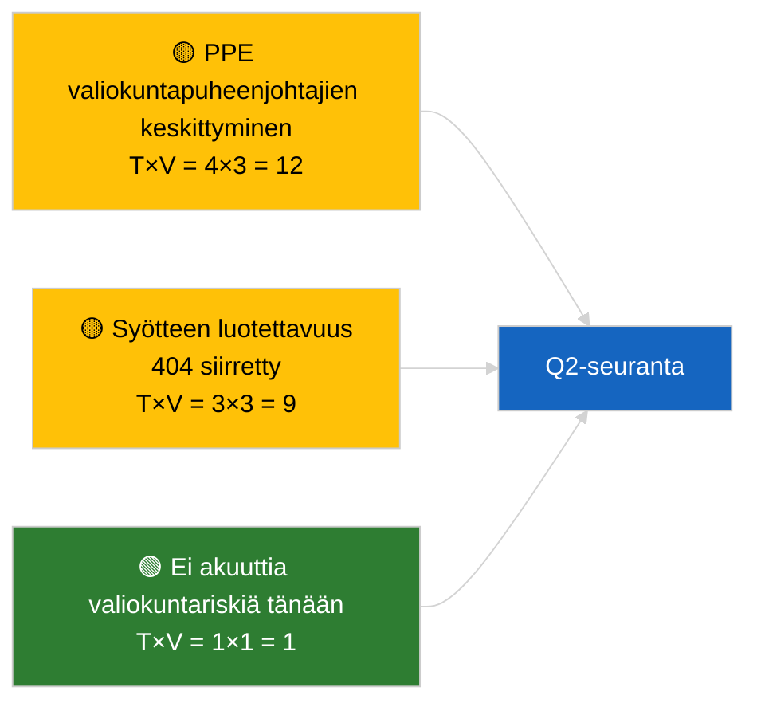

<!-- SPDX-FileCopyrightText: 2026 Hack23 AB -->
<!-- SPDX-License-Identifier: Apache-2.0 -->

# Johdon tiedote — Valiokuntaraportit | 2026-04-02

**Luokittelu:** OSINT | Julkinen parlamentaarinen asiakirja
**Luottamustaso:** 🟢 Korkea (rakenteellinen arviointi istuntotauon aikana)
**Luotu:** 2026-04-02T00:00:00Z (retrospektiivinen tiedote)
**Artikkelityyppi:** Valiokuntaraportit
**Suoritustunnus:** `b64d7ca7-e49c-4fb7-9203-9946d31bfcae`
**Lähde:** Euroopan parlamentin avoin dataporttaali

---

## 🎯 BLUF

**Ei uusia valiokuntaraportteja 2.4.2026; istuntotauon viikko 2/4 jatkuu.** Suoritus `b64d7ca7-e49c-4fb7-9203-9946d31bfcae` palautti **0 luokiteltua toimijaa** ja **RUTIINI**-merkittävyyden kaikissa ulottuvuuksissa, identtinen mallin tilan kanssa 2026-04-01/committee-reports. Aineellinen valiokuntaperustaso on edelleen maaliskuun siirtymä: ECON (EKP:n varapuheenjohtaja TA-10-2026-0060), TRAN/ENVI (HDV-päästöt TA-10-2026-0084), JURI (Braunin koskemattomuus TA-10-2026-0088), AFET (Georgia TA-10-2026-0083). **🟢 KORKEA luottamustaso** kalenterin ohjaamalle tyhjälle tilalle.

---

## 🧭 3 päätöstä, joita tämä tiedote tukee

| # | Päätös | Kuka päättää | Määräaika | Näyttö |
|:-:|--------|--------------|:---------:|--------|
| 1 | **Toimituksellinen:** OHITA committee-reports päivittäin | Toimittaja | +24h | Tyhjä suoritustulos |
| 2 | **Seuranta:** ylläpidä `get_committee_documents_feed` terveystarkistusta | Datapipeliini | +24h | Jatkuva 404-kaava |
| 3 | **Eteenpäin katsova:** valiokuntien työviikko 13.–17. huhtikuuta merkittäville Q2-raporteille | Analyysijohtaja | 2026-04-13 | Ennen täysistuntoa -sykli |

---

## 📰 60 sekunnin lukeminen

- 🔴 **Ei valiokunta-asiakirjoja indeksoitu** tänään; istuntotaukoviikko, ei valiokuntakokouksia suunniteltu. (🟢 Korkea)
- 🟠 **0 toimijaa luokiteltu**; ei esittelijöitä, varjoesittelijöitä tai valiokuntien puheenjohtajia tunnistettu. (🟢 Korkea)
- 🟢 **Valiokunnan siirtymäperustaso:** ECON, TRAN/ENVI, JURI, AFET-salkut ovat edelleen aktiivisia Q2-pintoja. (🟢 Korkea)
- 🟡 **Kaikki riskilosuluotteet "ei mitään"** — ei akuuttia valiokuntariskiä tänään. (🟢 Korkea)
- 🔵 **Taloudellinen konteksti:** ECONin EKP-vahvistus tarjoaa Q2 institutionaalisen ankkurin. (🟢 Korkea)
- 🟣 **Ristiviittaus:** rinnakkaissuoritukset 2026-04-02 kaikki tyhjiä malleja; koko järjestelmän istuntotaukokaava. (🟢 Korkea)
- 🩷 **Häiriövektori:** ei akuuttia tänään. (🟢 Korkea)
- ⚪ **Siirtyy eteenpäin:** EU–Mercosur INTA-asia odottaa EUT:n lausuntoa.

---

## 🗂️ Tärkeimmät asiakirjat / Menettelytaulukko

| Sija | EP-viite | Otsikko (lyhyt) | Merkittävyys | Luottamustaso | Tila |
|:----:|----------|-----------------|:------------:|:-------------:|------|
| 1 | — | Ei valiokuntaraportteja 2.4.2026 | 0,0 | 🟢 KORKEA | Istuntotauko — ei toimintaa |
| 2 | TA-10-2026-0060 | ECON — EKP:n varapuheenjohtaja (siirretty) | 7,5 | 🟢 KORKEA | Q2-perustaso |
| 3 | TA-10-2026-0084 | TRAN/ENVI — HDV-päästöt (siirretty) | 7,0 | 🟢 KORKEA | Täytäntöönpanon seuranta |

---

## ⚠️ Riski- ja uhkakatsaus

| Riski | T | V | Pisteet | Laukaisin | Lähde | Ammiraalisto |
|-------|:-:|:-:|:-------:|-----------|-------|:------------:|
| PPE valiokuntapuheenjohtajien keskittyminen | 4 | 3 | 12 | Q2 esittelijänimitykset | Rakenteellinen | A2 |
| Syöte-API:n luotettavuus | 3 | 3 | 9 | Jatkuva 404 | Rinnakkaissuoritus breaking | B2 |

---

## 🔮 Tärkein tuleva laukaisin

**Valiokuntien työviikko 13.–17. huhtikuuta 2026** — ensimmäinen merkittävä Q2 valiokuntaraporttisykli.

---

## 🛡️ Lähteen laadun arviointi

- **Ensisijaiset lähteet:** EP:n avoin dataporttaali; suoritus `b64d7ca7-e49c-4fb7-9203-9946d31bfcae`.
- **Datarajoitukset:** Syöte-API 404 siirretty edelliseltä päivältä.
- **Luottamustaso:** 🟢 KORKEA kalenterin ohjaamalle toiminnon puuttumiselle.

---

## 📎 Linkit

| Linkki | Polku |
|--------|-------|
| Artikkeli | `./article.md` |
| Rinnakkaissuoritukset | `analysis/daily/2026-04-02/breaking/`, `motions/`, `propositions/` |
| Manifesti | `./manifest.json` |

---

## 🔄 Ristiviittaus

Kaikki rinnakkaissuoritukset 2026-04-02 näyttävät identtisen tyhjän mallilähdön. Jatkaa 5+ päivän istuntotaukokaavaa, joka on kirjattu 27.3.2026 lähtien.

---

**Asiakirjan hallinta**
- **Malli:** `/analysis/templates/executive-brief.md`
- **Artefaktipolku:** `analysis/daily/2026-04-02/committee-reports/executive-brief.md`
- **Luokittelu:** Julkinen
- **Retrospektiivinen luonti:** Back-fill-istunto.
