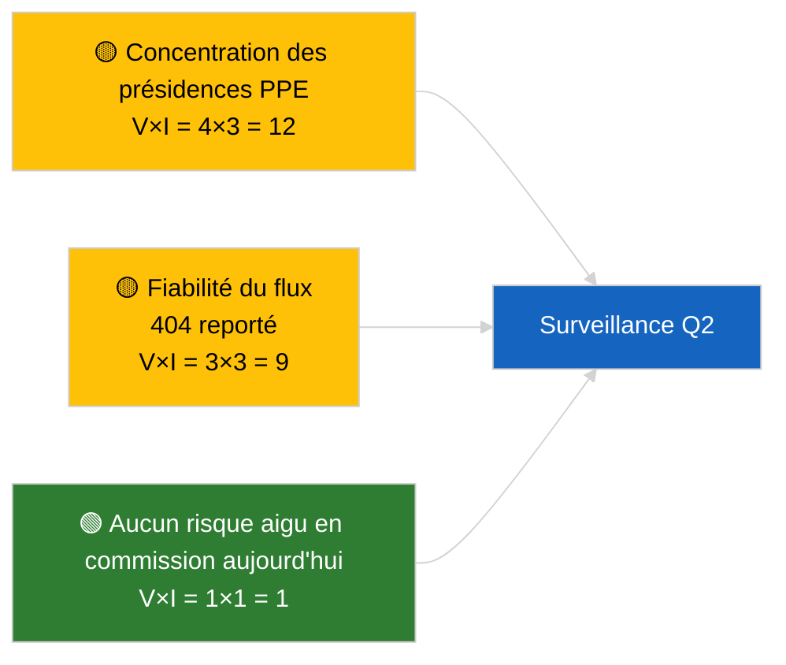

<!-- SPDX-FileCopyrightText: 2026 Hack23 AB -->
<!-- SPDX-License-Identifier: Apache-2.0 -->

# Note de synthèse exécutive — Rapports de commission | 2026-04-02

**Classification :** OSINT | Document parlementaire public
**Fiabilité :** 🟢 Élevée (évaluation structurelle pendant la période de récession)
**Générée :** 2026-04-02T00:00:00Z (note rétrospective)
**Type d'article :** Rapports de commission
**ID d'exécution :** `b64d7ca7-e49c-4fb7-9203-9946d31bfcae`
**Source :** Portail de données ouvertes du Parlement européen

---

## 🎯 BLUF

**Aucun nouveau rapport de commission le 2026-04-02 ; semaine de récession 2 sur 4 en cours.** L'exécution `b64d7ca7-e49c-4fb7-9203-9946d31bfcae` a retourné **0 acteur classifié** et une signification **ROUTINIÈRE** dans toutes les dimensions, identique à l'état du modèle pour 2026-04-01/committee-reports. La base de référence substantielle des commissions reste le transfert de mars : ECON (Vice-président de la BCE TA-10-2026-0060), TRAN/ENVI (émissions de poids lourds TA-10-2026-0084), JURI (immunité Braun TA-10-2026-0088), AFET (Géorgie TA-10-2026-0083). **🟢 HAUTE fiabilité** pour l'état vide piloté par le calendrier.

---

## 🧭 3 décisions que cette note appuie

| # | Décision | Qui décide | Délai | Justification |
|:-:|----------|-----------|:-----:|---------------|
| 1 | **Éditorial :** IGNORER committee-reports quotidiennement | Rédacteur | +24h | Sortie d'exécution vide |
| 2 | **Surveillance :** maintenir le contrôle d'état `get_committee_documents_feed` | Pipeline de données | +24h | Schéma 404 persistant |
| 3 | **Veille prospective :** semaine de travail des commissions 13-17 avril pour les rapports Q2 substantiels | Responsable analyse | 2026-04-13 | Cycle pré-plénière |

---

## 📰 Lecture en 60 secondes

- 🔴 **Aucun document de commission indexé** aujourd'hui ; semaine de récession, aucune réunion de commission prévue. (🟢 Élevée)
- 🟠 **0 acteur classifié** ; aucun rapporteur, rapporteur fictif ou président de commission identifié. (🟢 Élevée)
- 🟢 **Base de référence de report des commissions :** les portefeuilles ECON, TRAN/ENVI, JURI, AFET restent des surfaces actives pour le Q2. (🟢 Élevée)
- 🟡 **Toutes les dimensions de risque « aucun »** — aucun risque aigu en commission aujourd'hui. (🟢 Élevée)
- 🔵 **Contexte économique :** la confirmation de la BCE par l'ECON fournit l'ancrage institutionnel du Q2. (🟢 Élevée)
- 🟣 **Référence croisée :** les exécutions parallèles du 2026-04-02 affichent toutes des modèles vides ; schéma de récession à l'échelle du système. (🟢 Élevée)
- 🩷 **Vecteur de perturbation :** aucun aigu aujourd'hui. (🟢 Élevée)
- ⚪ **Report :** le dossier INTA EU-Mercosur attend l'avis de la CJUE.

---

## 🗂️ Principaux documents / Tableau des procédures

| Rang | Référence PE | Titre (abrégé) | Signification | Fiabilité | Statut |
|:----:|--------------|----------------|:-------------:|:---------:|--------|
| 1 | — | Aucun rapport de commission le 2026-04-02 | 0,0 | 🟢 ÉLEVÉE | Récession — aucune activité |
| 2 | TA-10-2026-0060 | ECON — Vice-président de la BCE (report) | 7,5 | 🟢 ÉLEVÉE | Base Q2 |
| 3 | TA-10-2026-0084 | TRAN/ENVI — Émissions de poids lourds (report) | 7,0 | 🟢 ÉLEVÉE | Surveillance de transposition |

---

## ⚠️ Panorama des risques et menaces

| Risque | V | I | Score | Déclencheur | Source | Amirauté |
|--------|:-:|:-:|:-----:|-------------|--------|:--------:|
| Concentration des présidences PPE | 4 | 3 | 12 | Désignations rapporteurs Q2 | Structurel | A2 |
| Fiabilité de l'API flux | 3 | 3 | 9 | 404 persistant | Exécution sœur breaking | B2 |

---

## 🔮 Principal déclencheur prospectif

**Semaine de travail des commissions 13-17 avril 2026** — premier cycle substantiel de rapports de commission Q2.

---

## 🛡️ Évaluation de la qualité des sources

- **Sources primaires :** Portail de données ouvertes du PE ; exécution `b64d7ca7-e49c-4fb7-9203-9946d31bfcae`.
- **Limites des données :** API flux 404 reportée du jour précédent.
- **Fiabilité :** 🟢 ÉLEVÉE pour l'inactivité pilotée par le calendrier.

---

## 📎 Liens

| Lien | Chemin |
|------|--------|
| Article | `./article.md` |
| Exécutions sœurs | `analysis/daily/2026-04-02/breaking/`, `motions/`, `propositions/` |
| Manifeste | `./manifest.json` |

---

## 🔄 Référence croisée

Toutes les exécutions parallèles du 2026-04-02 affichent une sortie de modèle vide identique. Prolongement du schéma de récession de 5 jours ou plus enregistré depuis le 2026-03-27.

---

**Contrôle du document**
- **Modèle :** `/analysis/templates/executive-brief.md`
- **Chemin de l'artefact :** `analysis/daily/2026-04-02/committee-reports/executive-brief.md`
- **Classification :** Public
- **Génération rétrospective :** Session de remplissage.
