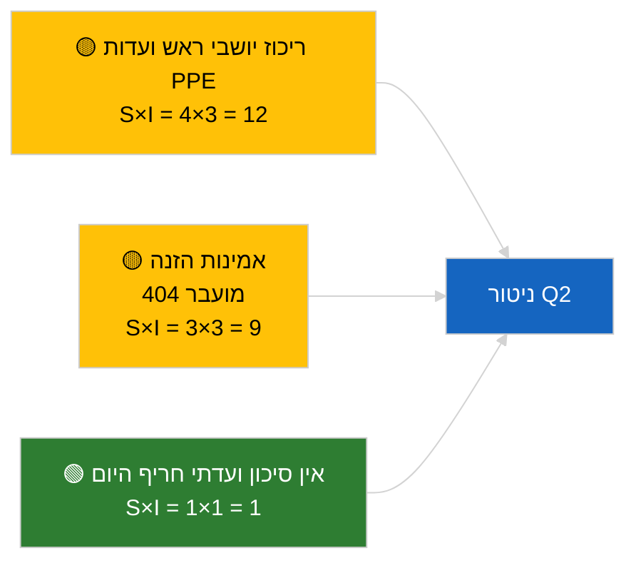

<!-- SPDX-FileCopyrightText: 2026 Hack23 AB -->
<!-- SPDX-License-Identifier: Apache-2.0 -->

# תדריך מנהלים — דוחות ועדות | 2026-04-02

**סיווג:** OSINT | תיעוד פרלמנטרי ציבורי
**אמינות:** 🟢 גבוהה (הערכה מבנית בתקופת הפגרה)
**נוצר:** 2026-04-02T00:00:00Z (תדריך רטרוספקטיבי)
**סוג כתבה:** דוחות ועדות
**מזהה הרצה:** `b64d7ca7-e49c-4fb7-9203-9946d31bfcae`
**מקור:** פורטל נתונים פתוח של הפרלמנט האירופי

---

## 🎯 BLUF

**אין דוחות ועדות חדשים ב-2026-04-02; שבוע פגרה 2 מתוך 4 נמשך.** הרצה `b64d7ca7-e49c-4fb7-9203-9946d31bfcae` החזירה **0 שחקנים מסווגים** ומשמעות **שגרתית** בכל הממדים, זהה למצב התבנית עבור 2026-04-01/committee-reports. קו הבסיס המהותי של הוועדות נשאר מהעברת מרץ: ECON (סגן נשיא הבנק המרכזי האירופי TA-10-2026-0060), TRAN/ENVI (פליטות רכבים כבדים TA-10-2026-0084), JURI (חסינות בראון TA-10-2026-0088), AFET (גיאורגיה TA-10-2026-0083). **🟢 אמינות גבוהה** עבור מצב ריק מונע-לוח שנה.

---

## 🧭 3 החלטות שתדריך זה תומך בהן

| # | החלטה | מי מחליט | מועד אחרון | ראיה |
|:-:|-------|----------|:----------:|------|
| 1 | **מערכתי:** דלג על דוחות ועדות יומי | עורך | +24 שעות | פלט הרצה ריק |
| 2 | **ניטור:** שמור על בדיקת תקינות `get_committee_documents_feed` | צינור נתונים | +24 שעות | דפוס 404 מתמשך |
| 3 | **מעקב קדימה:** שבוע עבודה של ועדות 13-17 באפריל לדוחות מהותיים של Q2 | ראש ניתוח | 2026-04-13 | מחזור טרום-מליאה |

---

## 📰 קריאה של 60 שניות

- 🔴 **אין מסמכי ועדה אינדקסים** היום; שבוע פגרה, אין ישיבות ועדה מתוכננות. (🟢 גבוהה)
- 🟠 **0 שחקנים מסווגים**; לא זוהו מדווחים, מדווחי צל, או יושבי ראש ועדה. (🟢 גבוהה)
- 🟢 **קו בסיס ועדתי של העברה:** תיקי ECON, TRAN/ENVI, JURI, AFET נשארים משטחים פעילים של Q2. (🟢 גבוהה)
- 🟡 **כל ממדי הסיכון «אפס»** — אין סיכון ועדתי חריף היום. (🟢 גבוהה)
- 🔵 **הקשר כלכלי:** אישור ה-ECB על ידי ECON מספק עוגן מוסדי ל-Q2. (🟢 גבוהה)
- 🟣 **הפניה צולבת:** הרצות מקבילות 2026-04-02 מציגות כולן תבניות ריקות; דפוס פגרה כלל-מערכתי. (🟢 גבוהה)
- 🩷 **וקטור הפרעה:** אין חריף היום. (🟢 גבוהה)
- ⚪ **מועבר:** תיק INTA EU-Mercosur ממתין לחוות דעת בית הדין של האיחוד האירופי.

---

## 🗂️ מסמכים עיקריים / טבלת נהלים

| דירוג | הפניה לפרלמנט | כותרת (קצרה) | משמעות | אמינות | סטטוס |
|:-----:|---------------|--------------|:------:|:------:|-------|
| 1 | — | אין דוחות ועדות ב-2026-04-02 | 0.0 | 🟢 גבוהה | פגרה — אין פעילות |
| 2 | TA-10-2026-0060 | ECON — סגן נשיא ה-ECB (מועבר) | 7.5 | 🟢 גבוהה | קו בסיס Q2 |
| 3 | TA-10-2026-0084 | TRAN/ENVI — פליטות רכבים כבדים (מועבר) | 7.0 | 🟢 גבוהה | מעקב יישום |

---

## ⚠️ תמונת מצב סיכונים ואיומים

| סיכון | S | I | ציון | מפעיל | מקור | אדמירלות |
|-------|:-:|:-:|:----:|-------|------|:---------:|
| ריכוז יושבי ראש ועדות PPE | 4 | 3 | 12 | מינויי מדווחי Q2 | מבני | A2 |
| אמינות API הזנה | 3 | 3 | 9 | 404 מתמשך | הרצה אחות breaking | B2 |

---

## 🔮 מפעיל עתידי מוביל

**שבוע עבודה ועדתי 13-17 באפריל 2026** — מחזור הדוחות המהותי הראשון של הוועדות לרבעון Q2.

---

## 🛡️ הערכת איכות מקורות

- **מקורות ראשוניים:** פורטל נתונים פתוח של הפרלמנט האירופי; הרצה `b64d7ca7-e49c-4fb7-9203-9946d31bfcae`.
- **מגבלות נתונים:** API הזנה 404 מועברת מהיום הקודם.
- **אמינות:** 🟢 גבוהה עבור אי-פעילות מונעת-לוח שנה.

---

## 📎 קישורים

| קישור | נתיב |
|-------|------|
| כתבה | `./article.md` |
| הרצות אחיות | `analysis/daily/2026-04-02/breaking/`, `motions/`, `propositions/` |
| מניפסט | `./manifest.json` |

---

## 🔄 הפניה צולבת

כל ההרצות המקבילות של 2026-04-02 מציגות פלט תבנית ריק זהה. ממשיכות את דפוס הפגרה של 5+ ימים שתועד מאז 2026-03-27.

---

**בקרת מסמכים**
- **תבנית:** `/analysis/templates/executive-brief.md`
- **נתיב תוצר:** `analysis/daily/2026-04-02/committee-reports/executive-brief.md`
- **סיווג:** ציבורי
- **יצירה רטרוספקטיבית:** סשן מילוי-אחורי.
