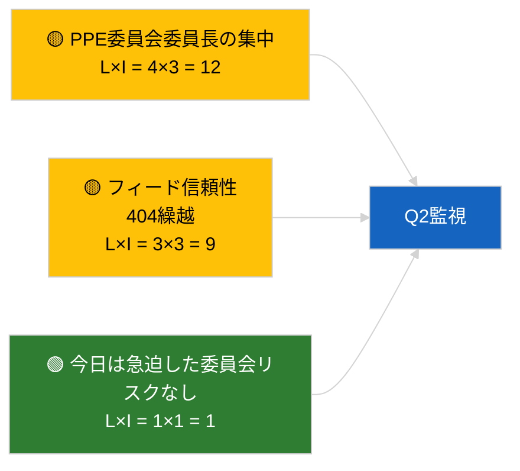

<!-- SPDX-FileCopyrightText: 2026 Hack23 AB -->
<!-- SPDX-License-Identifier: Apache-2.0 -->

# 幹部向け概要 — 欧州議会委員会報告 | 2026-04-02

**分類：** OSINT | 公開議会記録
**信頼性：** 🟢 高（会期休会期間の構造的評価）
**作成日：** 2026-04-02T00:00:00Z（遡及的概要）
**記事の種類：** 委員会報告
**実行ID：** `b64d7ca7-e49c-4fb7-9203-9946d31bfcae`
**情報源：** 欧州議会オープンデータポータル

---

## 🎯 BLUF

**2026年4月2日、新しい委員会報告はなし。休会第2週（全4週中）が継続中。** 実行 `b64d7ca7-e49c-4fb7-9203-9946d31bfcae` は**分類された関係者ゼロ**、および全ての次元において 2026-04-01/committee-reports のテンプレート状態と同一の**ルーティン**重要度を返した。実質的な委員会ベースラインは3月からの繰越のまま維持：ECON（ECB副総裁 TA-10-2026-0060）、TRAN/ENVI（大型車両排出量 TA-10-2026-0084）、JURI（ブラウン免責 TA-10-2026-0088）、AFET（ジョージア TA-10-2026-0083）。カレンダー主導の空の状態に対して**🟢 高い信頼性**。

---

## 🧭 この概要が支援する3つの意思決定

| # | 決定事項 | 決定者 | 期限 | 根拠 |
|:-:|---------|--------|:----:|------|
| 1 | **編集上の判断：** 委員会報告の日次発行をスキップ | 編集長 | +24時間 | 空の実行結果 |
| 2 | **監視：** `get_committee_documents_feed` の稼働状況を継続監視 | データパイプライン | +24時間 | 継続的な404パターン |
| 3 | **先行監視：** 実質的なQ2報告のための4月13〜17日の委員会活動週 | 分析責任者 | 2026-04-13 | 本会議前サイクル |

---

## 📰 60秒レビュー

- 🔴 **委員会文書なし**：今日は休会週のため、委員会会合の予定なし。（🟢 高）
- 🟠 **分類された関係者ゼロ**：報告者、シャドー報告者、委員会委員長のいずれも特定されず。（🟢 高）
- 🟢 **委員会の繰越ベースライン：** ECON、TRAN/ENVI、JURI、AFETの各ポートフォリオは引き続きQ2の活動フロントとして残る。（🟢 高）
- 🟡 **全リスク次元「なし」** — 今日、委員会に急迫したリスクはない。（🟢 高）
- 🔵 **経済的文脈：** ECONによるECB承認はQ2の制度的錨を提供。（🟢 高）
- 🟣 **相互参照：** 2026-04-02の並行実行はすべて同一の空テンプレート結果。システム全体の休会パターン。（🟢 高）
- 🩷 **混乱ベクトル：** 今日は急迫したものなし。（🟢 高）
- ⚪ **繰越：** EU-Mercosur INTAファイルはECJの見解を待機中。

---

## 🗂️ 主要文書 / 手続き一覧

| 順位 | EP参照 | タイトル（略称） | 重要度 | 信頼性 | 状態 |
|:---:|--------|----------------|:-----:|:------:|------|
| 1 | — | 2026-04-02、委員会報告なし | 0.0 | 🟢 高 | 休会 — 活動なし |
| 2 | TA-10-2026-0060 | ECON — ECB副総裁（繰越） | 7.5 | 🟢 高 | Q2ベースライン |
| 3 | TA-10-2026-0084 | TRAN/ENVI — 大型車両排出量（繰越） | 7.0 | 🟢 高 | 移行監視 |

---

## ⚠️ リスク・脅威スナップショット

| リスク | L | I | スコア | 引き金 | 情報源 | 提督評価 |
|--------|:-:|:-:|:------:|-------|--------|:-------:|
| PPE委員会委員長の集中 | 4 | 3 | 12 | Q2報告者任命 | 構造的 | A2 |
| フィードAPI信頼性 | 3 | 3 | 9 | 持続的404 | 並行実行breaking | B2 |

---

## 🔮 最重要将来引き金

**2026年4月13〜17日の委員会活動週** — 最初の実質的なQ2委員会報告サイクル。

---

## 🛡️ 情報源品質評価

- **一次情報源：** 欧州議会オープンデータポータル；実行 `b64d7ca7-e49c-4fb7-9203-9946d31bfcae`。
- **データ制限：** フィードAPI 404が前日から繰り越し。
- **信頼性：** 🟢 高、カレンダー主導の不活性状態について。

---

## 📎 リンク

| リンク | パス |
|-------|------|
| 記事 | `./article.md` |
| 並行実行 | `analysis/daily/2026-04-02/breaking/`, `motions/`, `propositions/` |
| マニフェスト | `./manifest.json` |

---

## 🔄 相互参照

2026-04-02の全並行実行が同一の空テンプレート出力を示している。2026年3月27日以来記録されている5日以上の休会パターンが継続。

---

**文書管理**
- **テンプレート：** `/analysis/templates/executive-brief.md`
- **成果物パス：** `analysis/daily/2026-04-02/committee-reports/executive-brief.md`
- **分類：** 公開
- **遡及的生成：** バックフィルセッション。
