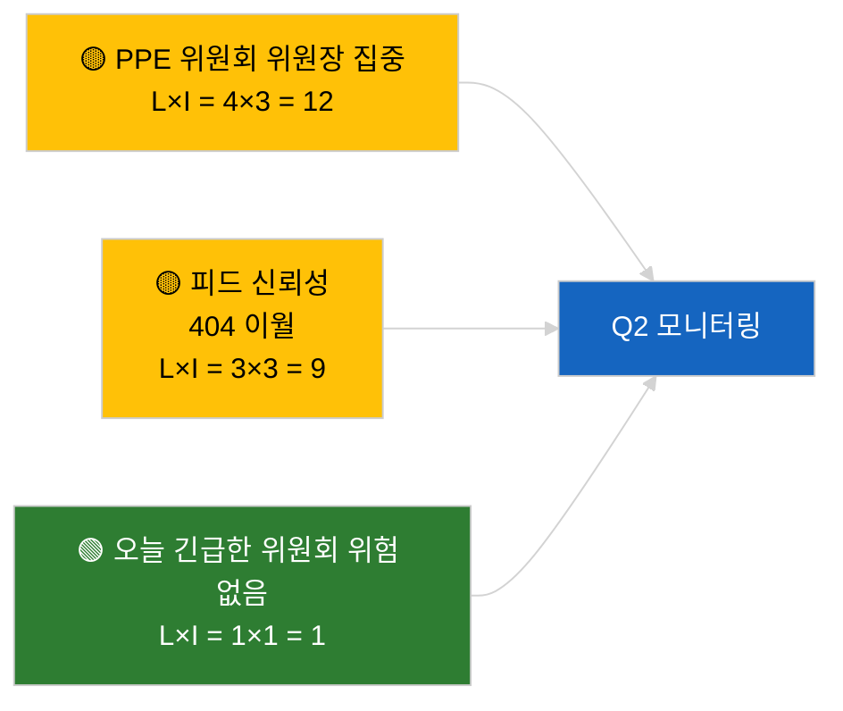

<!-- SPDX-FileCopyrightText: 2026 Hack23 AB -->
<!-- SPDX-License-Identifier: Apache-2.0 -->

# 집행 브리핑 — 유럽의회 위원회 보고서 | 2026-04-02

**분류:** OSINT | 공개 의회 기록
**신뢰도:** 🟢 높음 (의회 휴회기간 구조적 평가)
**작성일:** 2026-04-02T00:00:00Z (소급 브리핑)
**기사 유형:** 위원회 보고서
**실행 ID:** `b64d7ca7-e49c-4fb7-9203-9946d31bfcae`
**출처:** 유럽의회 공개 데이터 포털

---

## 🎯 BLUF

**2026-04-02에 새로운 위원회 보고서 없음; 4주 중 2번째 휴회 주 진행 중.** 실행 `b64d7ca7-e49c-4fb7-9203-9946d31bfcae`은 **0명의 분류된 행위자**와 모든 차원에서 2026-04-01/committee-reports 템플릿 상태와 동일한 **일상적** 중요도를 반환했습니다. 실질적 위원회 기준선은 3월 이월 내용을 유지합니다: ECON (ECB 부총재 TA-10-2026-0060), TRAN/ENVI (대형차량 배출량 TA-10-2026-0084), JURI (브라운 면책 TA-10-2026-0088), AFET (조지아 TA-10-2026-0083). 일정 주도 공백 상태에 대해 **🟢 높은 신뢰도**.

---

## 🧭 이 브리핑이 지원하는 3가지 결정

| # | 결정 | 결정자 | 기한 | 근거 |
|:-:|------|--------|:----:|------|
| 1 | **편집:** 위원회 보고서 일일 게시 건너뜀 | 편집장 | +24시간 | 빈 실행 결과 |
| 2 | **모니터링:** `get_committee_documents_feed` 상태 점검 유지 | 데이터 파이프라인 | +24시간 | 지속적인 404 패턴 |
| 3 | **선행 모니터링:** 실질적 Q2 보고를 위한 4월 13-17일 위원회 활동 주 | 분석 책임자 | 2026-04-13 | 본회의 전 사이클 |

---

## 📰 60초 읽기

- 🔴 **위원회 문서 미색인:** 오늘은 휴회 주로 위원회 회의 예정 없음. (🟢 높음)
- 🟠 **0명의 행위자 분류됨;** 보고자, 그림자 보고자, 위원회 위원장 어느 누구도 확인되지 않음. (🟢 높음)
- 🟢 **위원회 이월 기준선:** ECON, TRAN/ENVI, JURI, AFET 포트폴리오가 Q2 활동 전선으로 남아 있음. (🟢 높음)
- 🟡 **모든 위험 차원 «없음»** — 오늘 위원회에 긴급 위험 없음. (🟢 높음)
- 🔵 **경제적 맥락:** ECON의 ECB 확인이 Q2 제도적 닻을 제공. (🟢 높음)
- 🟣 **교차 참조:** 2026-04-02 병렬 실행 모두 빈 템플릿 출력; 시스템 전체 휴회 패턴. (🟢 높음)
- 🩷 **교란 벡터:** 오늘 긴급한 것 없음. (🟢 높음)
- ⚪ **이월:** EU-Mercosur INTA 파일이 유럽사법재판소 의견 대기 중.

---

## 🗂️ 주요 문서 / 절차 표

| 순위 | EP 참조 | 제목 (약식) | 중요도 | 신뢰도 | 상태 |
|:---:|---------|------------|:-----:|:------:|------|
| 1 | — | 2026-04-02 위원회 보고서 없음 | 0.0 | 🟢 높음 | 휴회 — 활동 없음 |
| 2 | TA-10-2026-0060 | ECON — ECB 부총재 (이월) | 7.5 | 🟢 높음 | Q2 기준선 |
| 3 | TA-10-2026-0084 | TRAN/ENVI — 대형차량 배출량 (이월) | 7.0 | 🟢 높음 | 이행 모니터링 |

---

## ⚠️ 위험 및 위협 현황

| 위험 | L | I | 점수 | 촉발 요인 | 출처 | 제독 평가 |
|------|:-:|:-:|:---:|----------|------|:--------:|
| PPE 위원회 위원장 집중 | 4 | 3 | 12 | Q2 보고자 임명 | 구조적 | A2 |
| 피드 API 신뢰성 | 3 | 3 | 9 | 지속적인 404 | 자매 실행 breaking | B2 |

---

## 🔮 가장 중요한 미래 촉발 요인

**2026년 4월 13-17일 위원회 활동 주** — 첫 번째 실질적인 Q2 위원회 보고 사이클.

---

## 🛡️ 출처 품질 평가

- **1차 출처:** 유럽의회 공개 데이터 포털; 실행 `b64d7ca7-e49c-4fb7-9203-9946d31bfcae`.
- **데이터 제한:** 피드 API 404가 전날부터 이월됨.
- **신뢰도:** 🟢 높음, 일정 주도 비활성 상태에 대해.

---

## 📎 링크

| 링크 | 경로 |
|------|------|
| 기사 | `./article.md` |
| 자매 실행 | `analysis/daily/2026-04-02/breaking/`, `motions/`, `propositions/` |
| 매니페스트 | `./manifest.json` |

---

## 🔄 교차 참조

2026-04-02의 모든 병렬 실행이 동일한 빈 템플릿 출력을 보여줍니다. 2026-03-27 이후 기록된 5일 이상의 휴회 패턴이 계속됩니다.

---

**문서 관리**
- **템플릿:** `/analysis/templates/executive-brief.md`
- **아티팩트 경로:** `analysis/daily/2026-04-02/committee-reports/executive-brief.md`
- **분류:** 공개
- **소급 생성:** 백필 세션.
