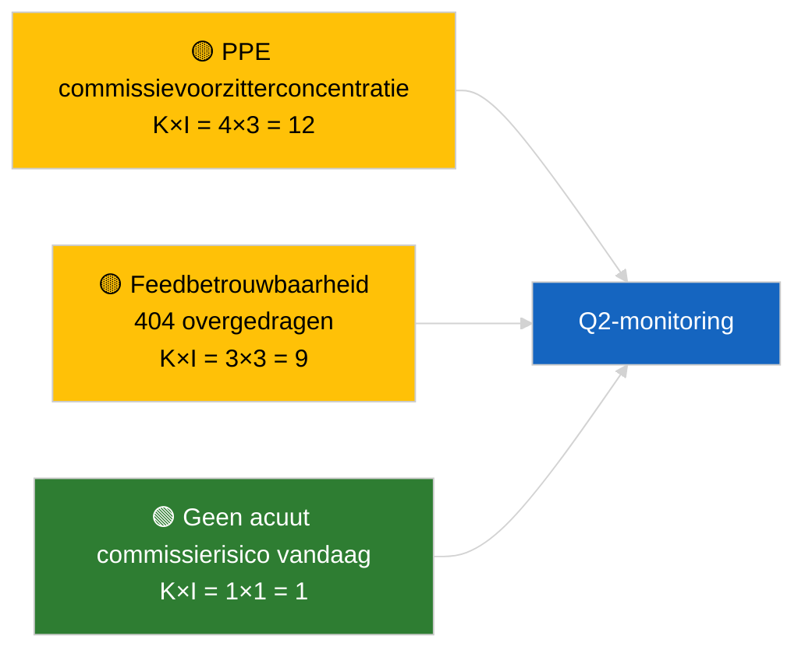

<!-- SPDX-FileCopyrightText: 2026 Hack23 AB -->
<!-- SPDX-License-Identifier: Apache-2.0 -->

# Uitvoerende briefing — Commissierapporten | 2026-04-02

**Classificatie:** OSINT | Openbaar parlementair register
**Betrouwbaarheid:** 🟢 Hoog (structurele beoordeling in recessperiode)
**Gegenereerd:** 2026-04-02T00:00:00Z (retrospectieve briefing)
**Artikeltype:** Commissierapporten
**Uitvoerings-ID:** `b64d7ca7-e49c-4fb7-9203-9946d31bfcae`
**Bron:** Open dataportaal van het Europees Parlement

---

## 🎯 BLUF

**Geen nieuwe commissierapporten op 2026-04-02; recessweek 2 van 4 duurt voort.** Uitvoering `b64d7ca7-e49c-4fb7-9203-9946d31bfcae` leverde **0 geclassificeerde actoren** en **ROUTINEMATIGE** significantie in alle dimensies, identiek aan de sjabloonstatus voor 2026-04-01/committee-reports. De inhoudelijke commissie-basisreferentie blijft de overdrachtspositie van maart: ECON (Vice-voorzitter ECB TA-10-2026-0060), TRAN/ENVI (HDV-emissies TA-10-2026-0084), JURI (Braun-immuniteit TA-10-2026-0088), AFET (Georgië TA-10-2026-0083). **🟢 HOGE betrouwbaarheid** voor kalendergestuurde leegstand.

---

## 🧭 3 besluiten die deze briefing ondersteunt

| # | Besluit | Wie beslist | Deadline | Bewijs |
|:-:|---------|-------------|:--------:|--------|
| 1 | **Redactioneel:** committee-reports dagelijks OVERSLAAN | Redacteur | +24u | Lege uitvoeringsuitvoer |
| 2 | **Monitoring:** `get_committee_documents_feed` gezondheidstatus onderhouden | Datapipeline | +24u | Aanhoudend 404-patroon |
| 3 | **Vooruitblik:** commissiewerkweek 13-17 april voor substantiële Q2-rapporten | Analyseleider | 2026-04-13 | Pre-plenumcyclus |

---

## 📰 60-secondenlecture

- 🔴 **Geen commissiedocumenten geïndexeerd** vandaag; recessweek, geen commissievergaderingen gepland. (🟢 Hoog)
- 🟠 **0 actoren geclassificeerd**; geen rapporteurs, schaduwrapporteurs of commissievoorzitters geïdentificeerd. (🟢 Hoog)
- 🟢 **Overdrachtsbasisreferentie commissie:** ECON-, TRAN/ENVI-, JURI-, AFET-portefeuilles blijven actieve Q2-oppervlakken. (🟢 Hoog)
- 🟡 **Alle risicoDimensies «geen»** — geen acuut commissierisico vandaag. (🟢 Hoog)
- 🔵 **Economische context:** ECONs ECB-bevestiging biedt Q2-institutioneel anker. (🟢 Hoog)
- 🟣 **Kruisverwijzing:** parallelle uitvoeringen 2026-04-02 tonen alle lege sjablonen; systeembrede recesspatroon. (🟢 Hoog)
- 🩷 **Verstoringsvector:** vandaag geen acuut. (🟢 Hoog)
- ⚪ **Overgedragen:** EU-Mercosur INTA-dossier wacht op HvJ-advies.

---

## 🗂️ Topdocumenten / Procedureastabel

| Rang | EP-referentie | Titel (kort) | Significantie | Betrouwbaarheid | Status |
|:----:|---------------|--------------|:-------------:|:---------------:|--------|
| 1 | — | Geen commissierapporten 2026-04-02 | 0,0 | 🟢 HOOG | Recess — geen activiteit |
| 2 | TA-10-2026-0060 | ECON — Vice-voorzitter ECB (overgedragen) | 7,5 | 🟢 HOOG | Q2-basislijn |
| 3 | TA-10-2026-0084 | TRAN/ENVI — HDV-emissies (overgedragen) | 7,0 | 🟢 HOOG | Transpositiebewaking |

---

## ⚠️ Risico- en dreigingsoverzicht

| Risico | K | I | Score | Trigger | Bron | Admiraliteit |
|--------|:-:|:-:|:-----:|---------|------|:------------:|
| PPE commissievoorzitterconcentratie | 4 | 3 | 12 | Q2 rapporteurbenoemingen | Structureel | A2 |
| Feed-API-betrouwbaarheid | 3 | 3 | 9 | Aanhoudende 404 | Zusteruitvoering breaking | B2 |

---

## 🔮 Voornaamste toekomstige trigger

**Commissiewerkweek 13-17 april 2026** — eerste substantiële Q2-commissierapportcyclus.

---

## 🛡️ Bronkwaliteitsbeoordeling

- **Primaire bronnen:** Open dataportaal EP; uitvoering `b64d7ca7-e49c-4fb7-9203-9946d31bfcae`.
- **Databeperkingen:** Feed-API 404 overgedragen van de vorige dag.
- **Betrouwbaarheid:** 🟢 HOOG voor kalendergestuurde inactiviteit.

---

## 📎 Links

| Link | Pad |
|------|-----|
| Artikel | `./article.md` |
| Zusteruitvoeringen | `analysis/daily/2026-04-02/breaking/`, `motions/`, `propositions/` |
| Manifest | `./manifest.json` |

---

## 🔄 Kruisverwijzing

Alle parallelle uitvoeringen 2026-04-02 tonen identieke lege sjabloonuitvoer. Zet het 5+-dagenrecesspatroon voort dat is geregistreerd sinds 2026-03-27.

---

**Documentbeheer**
- **Sjabloon:** `/analysis/templates/executive-brief.md`
- **Artefactpad:** `analysis/daily/2026-04-02/committee-reports/executive-brief.md`
- **Classificatie:** Openbaar
- **Retrospectieve generatie:** Back-fill-sessie.
