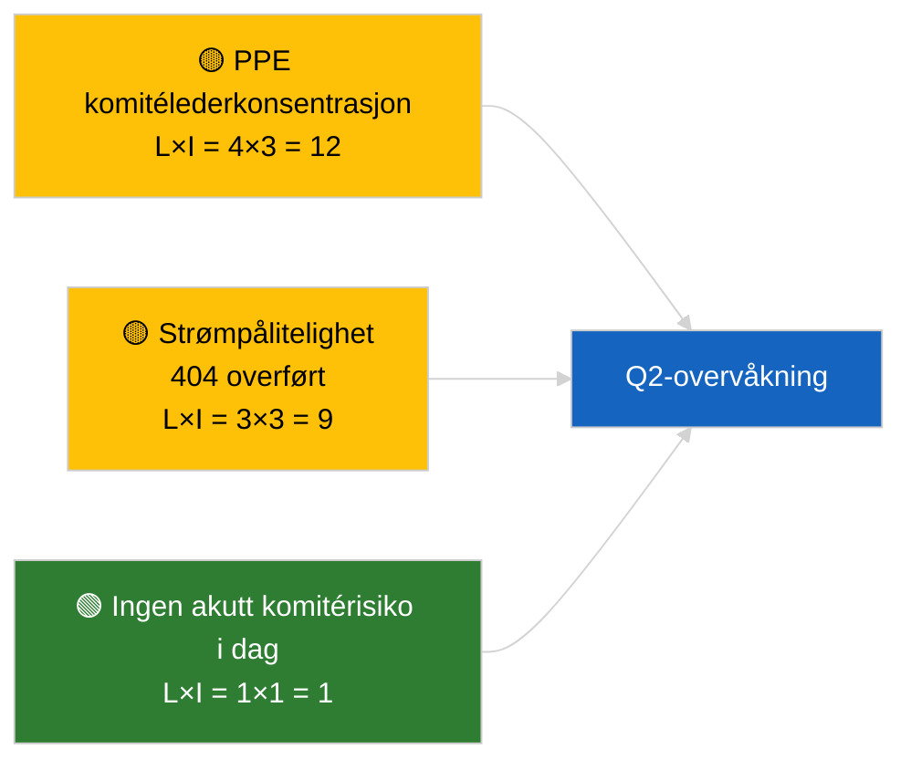

<!-- SPDX-FileCopyrightText: 2026 Hack23 AB -->
<!-- SPDX-License-Identifier: Apache-2.0 -->

# Lederorientering — Komitérapporter | 2026-04-02

**Klassifisering:** OSINT | Offentlig parlamentarisk dokumentasjon
**Konfidensgrad:** 🟢 Høy (strukturell vurdering i resesperiode)
**Generert:** 2026-04-02T00:00:00Z (retrospektiv orientering)
**Artikkeltype:** Komitérapporter
**Kjøre-ID:** `b64d7ca7-e49c-4fb7-9203-9946d31bfcae`
**Kilde:** Europaparlamentets åpne dataportal

---

## 🎯 BLUF

**Ingen nye komitérapporter 2026-04-02; resesuke 2 av 4 fortsetter.** Kjøring `b64d7ca7-e49c-4fb7-9203-9946d31bfcae` returnerte **0 klassifiserte aktører** og **RUTINEMESSIG** signifikans i alle dimensjoner, identisk med malltilstand for 2026-04-01/committee-reports. Den substansielle komitégrunnlinjen er fortsatt mars-overføringen: ECON (ECBs visepresidenten TA-10-2026-0060), TRAN/ENVI (HDV-utslipp TA-10-2026-0084), JURI (Braun-immunitet TA-10-2026-0088), AFET (Georgia TA-10-2026-0083). **🟢 HØY konfidensgrad** for kalenderdrevet tom tilstand.

---

## 🧭 3 Beslutninger denne orienteringen støtter

| # | Beslutning | Hvem bestemmer | Frist | Dokumentasjon |
|:-:|-----------|----------------|:-----:|---------------|
| 1 | **Redaksjonelt:** HOPP OVER committee-reports daglig | Redaktør | +24t | Tom kjøreresultat |
| 2 | **Overvåkning:** vedlikehold `get_committee_documents_feed` helsekontroll | Datapipeline | +24t | Pågående 404-mønster |
| 3 | **Fremtidsvakt:** komitéarbeidsuke 13-17 april for substansielle Q2-rapporter | Analyseleder | 2026-04-13 | Pré-plenumssyklus |

---

## 📰 60-sekunders lesning

- 🔴 **Ingen komitédokumenter indeksert** i dag; resesuke, ingen komitémøter planlagt. (🟢 Høy)
- 🟠 **0 aktører klassifisert**; ingen ordførere, skyggeordførere eller komitéledere identifisert. (🟢 Høy)
- 🟢 **Komitéens overføringsgrunnlinje:** ECON, TRAN/ENVI, JURI, AFET-porteføljer er fortsatt aktive Q2-overflater. (🟢 Høy)
- 🟡 **Alle risikodimensjoner «ingen»** — ingen akutt komitérisiko i dag. (🟢 Høy)
- 🔵 **Økonomisk kontekst:** ECONs ECB-bekreftelse gir Q2 institusjonelt anker. (🟢 Høy)
- 🟣 **Kryssreferanse:** søskenkjøringer 2026-04-02 alle tomme maler; systemomfattende resessmønster. (🟢 Høy)
- 🩷 **Forstyrrelsesvektorer:** ingen akutte i dag. (🟢 Høy)
- ⚪ **Overføres:** EU-Mercosur INTA-saken avventer EUD-uttalelse.

---

## 🗂️ Topdokumenter / Prosedyrtabell

| Rang | EP-referanse | Tittel (kort) | Signifikans | Konfidensgrad | Status |
|:----:|--------------|---------------|:-----------:|:-------------:|--------|
| 1 | — | Ingen komitérapporter 2026-04-02 | 0,0 | 🟢 HØY | Reses — ingen aktivitet |
| 2 | TA-10-2026-0060 | ECON — ECBs visepresidenten (overført) | 7,5 | 🟢 HØY | Q2-grunnlinje |
| 3 | TA-10-2026-0084 | TRAN/ENVI — HDV-utslipp (overført) | 7,0 | 🟢 HØY | Transposisjonsovervåking |

---

## ⚠️ Risiko- og trusselbilde

| Risiko | S | I | Score | Utløser | Kilde | Admiralitet |
|--------|:-:|:-:|:-----:|---------|-------|:-----------:|
| PPE komitélederkonsentrasjon | 4 | 3 | 12 | Q2 ordføreroppnevnelser | Strukturell | A2 |
| Strøm-API-pålitelighet | 3 | 3 | 9 | Vedvarende 404 | Søskenkjøring breaking | B2 |

---

## 🔮 Fremste fremtidige utløser

**Komitéarbeidsuke 13-17 april 2026** — første substansielle Q2 komitérapportsyklus.

---

## 🛡️ Kildekvalitetsvurdering

- **Primære kilder:** EPs åpne dataportal; kjøring `b64d7ca7-e49c-4fb7-9203-9946d31bfcae`.
- **Databegrensninger:** Strøm-API 404 overført fra forrige dag.
- **Konfidensgrad:** 🟢 HØY for kalenderdrevet inaktivitet.

---

## 📎 Lenker

| Lenke | Sti |
|-------|-----|
| Artikkel | `./article.md` |
| Søskenkjøringer | `analysis/daily/2026-04-02/breaking/`, `motions/`, `propositions/` |
| Manifest | `./manifest.json` |

---

## 🔄 Kryssreferanse

Alle parallelle kjøringer 2026-04-02 viser identisk tom malresultat. Fortsetter det 5+ dagers resessmønster logget siden 2026-03-27.

---

**Dokumentkontroll**
- **Mal:** `/analysis/templates/executive-brief.md`
- **Artefaktsti:** `analysis/daily/2026-04-02/committee-reports/executive-brief.md`
- **Klassifisering:** Offentlig
- **Retrospektiv generering:** Back-fill-session.
