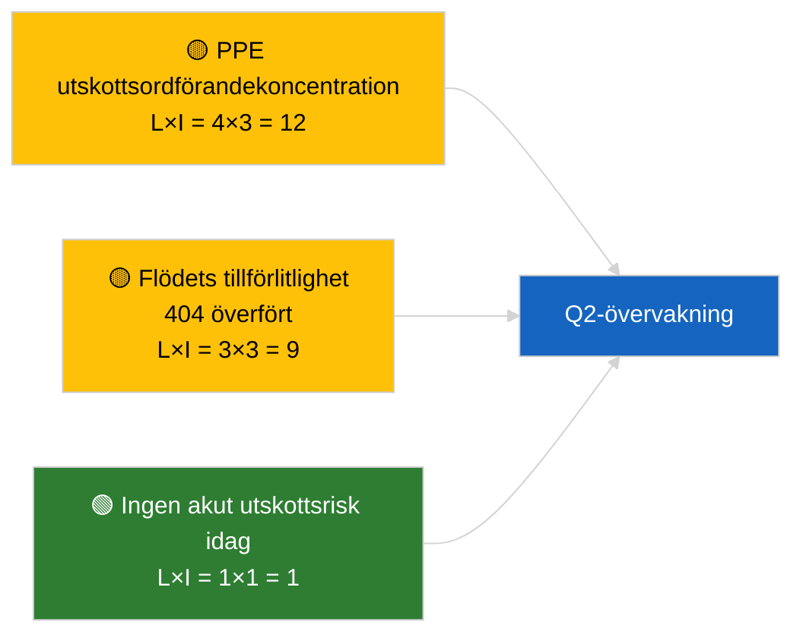

<!-- SPDX-FileCopyrightText: 2026 Hack23 AB -->
<!-- SPDX-License-Identifier: Apache-2.0 -->

# Verksamhetsrapport — Utskottsrapporter | 2026-04-02

**Klassificering:** OSINT | Offentligt parlamentariskt register
**Tillförlitlighet:** 🟢 Hög (strukturell bedömning under recessperiod)
**Genererad:** 2026-04-02T00:00:00Z (retrospektiv rapport)
**Artikeltyp:** Utskottsrapporter
**Körnings-ID:** `b64d7ca7-e49c-4fb7-9203-9946d31bfcae`
**Källa:** Europaparlamentets öppna dataportalen

---

## 🎯 BLUF

**Inga nya utskottsrapporter den 2026-04-02; recessvecka 2 av 4 fortsätter.** Körning `b64d7ca7-e49c-4fb7-9203-9946d31bfcae` returnerade **0 klassificerade aktörer** och **RUTINMÄSSIG** signifikans i alla dimensioner, identisk med malltillståndet för 2026-04-01/committee-reports. Det substantiella utskottsbaslinjen är fortsatt mars-övergången: ECON (ECB:s vice ordförande TA-10-2026-0060), TRAN/ENVI (HDV-utsläpp TA-10-2026-0084), JURI (Braun immunitet TA-10-2026-0088), AFET (Georgien TA-10-2026-0083). **🟢 HÖG tillförlitlighet** för tomt läge drivet av kalender.

---

## 🧭 3 Beslut som denna rapport stödjer

| # | Beslut | Vem beslutar | Deadline | Underlag |
|:-:|--------|--------------|:--------:|----------|
| 1 | **Redaktionellt:** HOPPA ÖVER committee-reports dagligen | Redaktör | +24h | Tomt körningsresultat |
| 2 | **Övervakning:** underhåll `get_committee_documents_feed` hälsokontroll | Datapipeline | +24h | Pågående 404-mönster |
| 3 | **Framtidsbevakning:** utskottsarbetsvecka 13-17 april för substantiella Q2-rapporter | Analysansvarig | 2026-04-13 | Förmöte-cykel |

---

## 📰 60-sekunders läsning

- 🔴 **Inga utskottsdokument indexerade** idag; recessvecka, inga utskottsmöten planerade. (🟢 Hög)
- 🟠 **0 aktörer klassificerade**; inga föredragande, skuggföredragande eller utskottsordföranden identifierade. (🟢 Hög)
- 🟢 **Utskottets fortsättningsbas:** ECON, TRAN/ENVI, JURI, AFET-portföljer är fortsatt aktiva Q2-ytor. (🟢 Hög)
- 🟡 **Alla riskdimensioner "inga"** — ingen akut utskottsrisknivårisk idag. (🟢 Hög)
- 🔵 **Ekonomisk kontext:** ECON:s ECB-bekräftelse ger Q2 institutionellt ankare. (🟢 Hög)
- 🟣 **Korsreferens:** syskorkörningar 2026-04-02 alla tomma mallar; systemomfattande recessmönster. (🟢 Hög)
- 🩷 **Störningsvektor:** ingen akut idag. (🟢 Hög)
- ⚪ **Överfört:** EU-Mercosur INTA-ärendet avvaktar EUD-yttrande.

---

## 🗂️ Toppdokument / Procedurtabell

| Rang | EP-referens | Titel (kort) | Signifikans | Tillförlitlighet | Status |
|:----:|-------------|--------------|:-----------:|:----------------:|--------|
| 1 | — | Inga utskottsrapporter 2026-04-02 | 0,0 | 🟢 HÖG | Recess — ingen aktivitet |
| 2 | TA-10-2026-0060 | ECON — ECB:s vice ordförande (överförd) | 7,5 | 🟢 HÖG | Q2-baslinje |
| 3 | TA-10-2026-0084 | TRAN/ENVI — HDV-utsläpp (överförd) | 7,0 | 🟢 HÖG | Transpositionsbevakning |

---

## ⚠️ Risk- och hotögonblicksbild

| Risk | S | I | Poäng | Utlösare | Källa | Admiralitet |
|------|:-:|:-:|:-----:|----------|-------|:-----------:|
| PPE utskottsordförandekoncentration | 4 | 3 | 12 | Q2 föredragandeförordnanden | Strukturell | A2 |
| Flöde-API tillförlitlighet | 3 | 3 | 9 | Bestående 404 | Syskorkörning breaking | B2 |

---

## 🔮 Främsta framtida utlösare

**Utskottsarbetsvecka 13-17 april 2026** — första substantiella Q2 utskottsrapportscykeln.

---

## 🛡️ Källkvalitetsbedömning

- **Primära källor:** EP:s öppna dataportal; körning `b64d7ca7-e49c-4fb7-9203-9946d31bfcae`.
- **Databegränsningar:** Flöde-API 404 överfört från föregående dag.
- **Tillförlitlighet:** 🟢 HÖG för kalenderdriven inaktivitet.

---

## 📎 Länkar

| Länk | Sökväg |
|------|--------|
| Artikel | `./article.md` |
| Syskorkörningar | `analysis/daily/2026-04-02/breaking/`, `motions/`, `propositions/` |
| Manifest | `./manifest.json` |

---

## 🔄 Korsreferens

Samtliga parallella körningar 2026-04-02 visar identisk tom mallutdata. Fortsätter det 5+ dagars recessmönster som loggats sedan 2026-03-27.

---

**Dokumentkontroll**
- **Mall:** `/analysis/templates/executive-brief.md`
- **Artefaktsökväg:** `analysis/daily/2026-04-02/committee-reports/executive-brief.md`
- **Klassificering:** Offentlig
- **Retrospektiv generering:** Back-fill-session.
