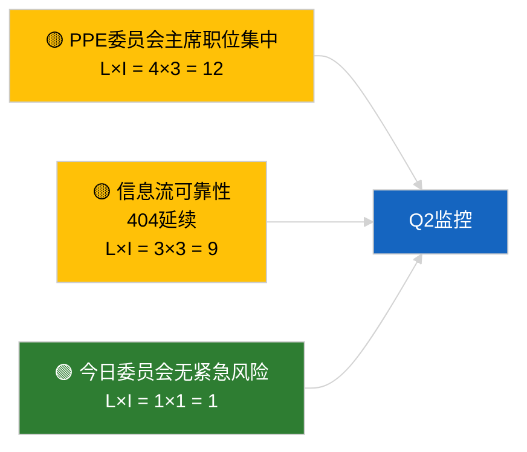

<!-- SPDX-FileCopyrightText: 2026 Hack23 AB -->
<!-- SPDX-License-Identifier: Apache-2.0 -->

# 执行简报 — 欧洲议会委员会报告 | 2026-04-02

**分类：** OSINT | 公开议会记录
**可靠性：** 🟢 高（议会休会期间结构性评估）
**生成日期：** 2026-04-02T00:00:00Z（追溯性简报）
**文章类型：** 委员会报告
**运行ID：** `b64d7ca7-e49c-4fb7-9203-9946d31bfcae`
**来源：** 欧洲议会开放数据门户

---

## 🎯 BLUF

**2026-04-02无新委员会报告；共4周休会中的第2周持续进行。** 运行 `b64d7ca7-e49c-4fb7-9203-9946d31bfcae` 返回了**0名分类行为者**，以及所有维度上的**常规**显著性，与2026-04-01/committee-reports的模板状态完全一致。实质性委员会基准线维持3月延续：ECON（ECB副行长 TA-10-2026-0060）、TRAN/ENVI（重型车辆排放 TA-10-2026-0084）、JURI（布劳恩豁免权 TA-10-2026-0088）、AFET（格鲁吉亚 TA-10-2026-0083）。**🟢 高可靠性**，适用于日历驱动的空状态。

---

## 🧭 本简报支持的3项决策

| # | 决策 | 决策者 | 截止日期 | 依据 |
|:-:|------|--------|:--------:|------|
| 1 | **编辑：** 每日跳过委员会报告 | 编辑 | +24小时 | 空运行输出 |
| 2 | **监控：** 维持 `get_committee_documents_feed` 健康检查 | 数据管道 | +24小时 | 持续404模式 |
| 3 | **前瞻监控：** 4月13-17日委员会工作周 — 实质性Q2报告 | 分析负责人 | 2026-04-13 | 全体会议前周期 |

---

## 📰 60秒阅读

- 🔴 **今日无委员会文件被索引；** 休会周，无委员会会议安排。（🟢 高）
- 🟠 **0名行为者被分类；** 未识别任何报告员、影子报告员或委员会主席。（🟢 高）
- 🟢 **委员会延续基准线：** ECON、TRAN/ENVI、JURI、AFET投资组合仍是Q2的活跃前沿。（🟢 高）
- 🟡 **所有风险维度均为"无"** — 今日委员会无紧急风险。（🟢 高）
- 🔵 **经济背景：** ECON对ECB的确认提供了Q2的机构锚定。（🟢 高）
- 🟣 **交叉参照：** 2026-04-02的所有并行运行均显示相同的空模板输出；全系统休会模式。（🟢 高）
- 🩷 **干扰向量：** 今日无紧急情况。（🟢 高）
- ⚪ **延续：** 欧盟-南方共同市场INTA文件等待欧盟法院意见。

---

## 🗂️ 重要文件 / 程序表

| 排名 | EP参考 | 标题（简称） | 重要性 | 可靠性 | 状态 |
|:---:|--------|------------|:-----:|:------:|------|
| 1 | — | 2026-04-02无委员会报告 | 0.0 | 🟢 高 | 休会 — 无活动 |
| 2 | TA-10-2026-0060 | ECON — ECB副行长（延续） | 7.5 | 🟢 高 | Q2基准线 |
| 3 | TA-10-2026-0084 | TRAN/ENVI — 重型车辆排放（延续） | 7.0 | 🟢 高 | 转置监控 |

---

## ⚠️ 风险与威胁概况

| 风险 | L | I | 分值 | 触发因素 | 来源 | 海军评级 |
|------|:-:|:-:|:---:|---------|------|:-------:|
| PPE委员会主席职位集中 | 4 | 3 | 12 | Q2报告员任命 | 结构性 | A2 |
| 信息流API可靠性 | 3 | 3 | 9 | 持续404 | 姊妹运行 breaking | B2 |

---

## 🔮 最重要的未来触发因素

**2026年4月13-17日委员会工作周** — 第一个实质性Q2委员会报告周期。

---

## 🛡️ 信息来源质量评估

- **主要来源：** 欧洲议会开放数据门户；运行 `b64d7ca7-e49c-4fb7-9203-9946d31bfcae`。
- **数据限制：** 信息流API 404从前一天延续。
- **可靠性：** 🟢 高，适用于日历驱动的非活动状态。

---

## 📎 链接

| 链接 | 路径 |
|------|------|
| 文章 | `./article.md` |
| 姊妹运行 | `analysis/daily/2026-04-02/breaking/`, `motions/`, `propositions/` |
| 清单 | `./manifest.json` |

---

## 🔄 交叉参照

2026-04-02的所有并行运行均显示相同的空模板输出。延续自2026-03-27以来记录的5天以上休会模式。

---

**文件控制**
- **模板：** `/analysis/templates/executive-brief.md`
- **制品路径：** `analysis/daily/2026-04-02/committee-reports/executive-brief.md`
- **分类：** 公开
- **追溯性生成：** 回填会话。
