# Motions — 2026-04-02

<h2 id="section-executive-brief">Executive Brief</h2>

### 🎯 BLUF

**No new motions for a resolution tabled on 2026-04-02; recess week 2 of 4 continues.** Run `c93513b6-9f22-4b36-a984-d0512328769c` returned **0 classified actors** and **ROUTINE** significance, mirroring the 2026-04-01/motions empty-template state. Motions-stage activity is calendar-bound to the days immediately preceding plenary; first April tabling not expected before ~17-20 April. Carry-over priorities entering April: Georgia political-prisoners follow-up (TA-10-2026-0083), HDV emission-credits transposition (TA-10-2026-0084), US customs tariff (TA-10-2026-0096), Braun immunity precedent (TA-10-2026-0088), ECB Vice-President file (TA-10-2026-0060). **🟢 HIGH confidence** empty state is calendar-driven.

---

### 🧭 3 Decisions This Brief Supports

| # | Decision | Who Decides | Deadline | Evidence |
|:-:|----------|-------------|:--------:|----------|
| 1 | **Editorial:** SKIP motions daily | Editor | +24h | Empty run output |
| 2 | **Monitoring:** flag first April motion-tabling wave 17-20 April | Analyst | 2026-04-17 | EP tabling pattern |
| 3 | **Forward-watch:** track trade-heavy vs RoL motion mix for April scenario calibration | Analysis lead | 2026-04-20 | Scenario A vs B |

---

### 📰 60-Second Read

- 🔴 **No new motions tabled** on 2026-04-02; recess. (🟢 High)
- 🟠 **0 actors classified** in motions-focused run. (🟢 High)
- 🟢 **March carry-over motions inventory** anchors the April watch list. (🟢 High)
- 🟡 **Risk dimensions all "none"** today. (🟢 High)
- 🔵 **Economic context:** US tariff and ECB files dominant. (🟢 High)
- 🟣 **Cross-reference:** sibling 2026-04-02 runs empty-template. (🟢 High)
- 🩷 **Disruption vector:** none acute today. (🟢 High)
- ⚪ **Carry-forward:** Mercosur ECJ opinion will likely spawn motion(s).

---

### 🗂️ Top Documents / Procedures — Motions Watch

| Rank | EP reference | Title (short) | Significance | Confidence | Status |
|:----:|--------------|---------------|:------------:|:----------:|--------|
| 1 | — | No new motions on 2026-04-02 | 0.0 | 🟢 HIGH | Recess — no tabling |
| 2 | TA-10-2026-0083 | Georgia political prisoners (carry-over) | 7.0 | 🟢 HIGH | Implementation watch |
| 3 | TA-10-2026-0096 | US customs tariff (carry-over) | 7.0 | 🟢 HIGH | April motion likely |

---

### ⚠️ Risk & Threat Snapshot

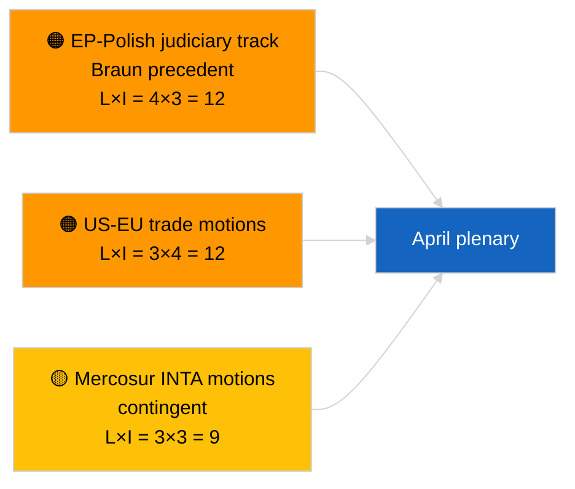
```mermaid
%%{init: {"theme":"dark"}}%%
graph LR
    R1["🟠 EP-Polish judiciary track<br/>Braun precedent<br/>L×I = 4×3 = 12"] --> CONS["April plenary"]
    R2["🟠 US-EU trade motions<br/>L×I = 3×4 = 12"] --> CONS
    R3["🟡 Mercosur INTA motions<br/>contingent<br/>L×I = 3×3 = 9"] --> CONS
    style R1 fill:#FF9800,color:#000000
    style R2 fill:#FF9800,color:#000000
    style R3 fill:#FFC107,color:#000000
    style CONS fill:#1565C0,color:#FFFFFF
```

| Risk | L | I | Score | Trigger | Source | Admiralty |
|------|:-:|:-:|:-----:|---------|--------|:---------:|
| EP-Polish judiciary motion track | 4 | 3 | 12 | New immunity case | TA-10-2026-0088 | A1 |
| US-EU trade motions | 3 | 4 | 12 | US action | TA-10-2026-0096 | A1 |
| Mercosur motions (contingent) | 3 | 3 | 9 | ECJ opinion | TA-10-2026-0008 | A2 |

---

### 🔮 Top Forward Trigger

**First April motion-tabling wave ~17-20 April 2026.** Topic mix calibrates Scenario A (trade) vs B (RoL) vs C (economic) for the 27-30 April Strasbourg plenary.

---

### 🛡️ Source Quality Assessment

- **Primary sources:** EP Open Data Portal; run `c93513b6-9f22-4b36-a984-d0512328769c`.
- **Confidence:** 🟢 HIGH on calendar-driven inactivity.

---

### 📎 Links

| Link | Path |
|------|------|
| Article | `./article.md` |
| Sibling runs | `analysis/daily/2026-04-02/breaking/`, `committee-reports/`, `propositions/` |
| Manifest | `./manifest.json` |

---

**Document Control**
- **Template:** `/analysis/templates/executive-brief.md`
- **Artifact path:** `analysis/daily/2026-04-02/motions/executive-brief.md`
- **Classification:** Public
- **Retrospective generation:** Back-fill session.

<h2 id="reader-intelligence-guide">Reader Intelligence Guide</h2>

Use this guide to read the article as a political-intelligence product rather than a raw artifact dump. High-value reader lenses appear first; technical provenance remains available in the audit appendices.

| Reader need | What you'll get | Source artifact |
|---|---|---|
| [BLUF and editorial decisions](#section-executive-brief) | fast answer to what happened, why it matters, who is accountable, and the next dated trigger | `executive-brief.md` |
| [Actors and forces](#section-actors-forces) | who is driving the story, what political forces line up behind them, and which institutional levers they can pull | `classification/actor-mapping.md` |
| [Coalitions and voting](#section-coalitions-voting) | political group alignment, voting evidence, and coalition pressure points | `existing/voting-patterns.md` |
| [Risk assessment](#section-risk) | policy, institutional, coalition, communications, and implementation risk register | `risk-scoring/risk-matrix.md` |
| [Threat landscape](#section-threat) | hostile actors, attack vectors, consequence trees, and legislative-disruption pathways | `threat-assessment/actor-threat-profiles.md` |
| [Cross-run continuity](#section-continuity) | what changed since prior sessions and how confidence shifted between runs | `existing/cross-session-intelligence.md` |
| [Deep analysis](#section-deep-analysis) | long-form Economist-style explanation for readers who want the full argument | `existing/deep-analysis.md` |
| [Supplementary intelligence](#section-supplementary-intelligence) | additional markdown discovered in the run that has not yet been assigned to a canonical section | `executive-brief_ar.md` |

<h2 id="section-actors-forces">Actors & Forces</h2>

### Actor Mapping

### Actors Identified: 0

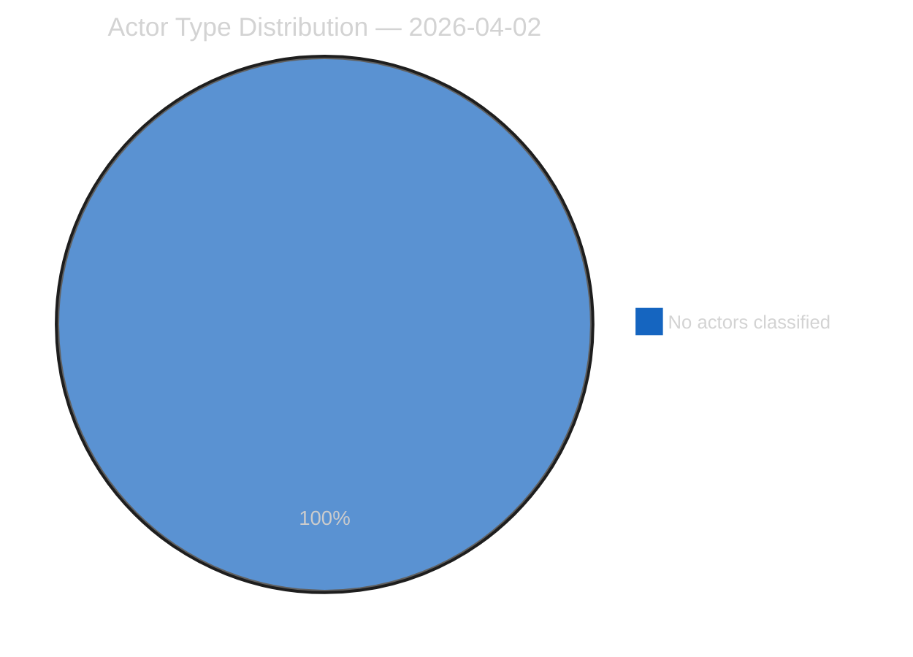
```mermaid
%%{init: {"theme":"dark","themeVariables":{"primaryColor":"#1565C0","primaryTextColor":"#ffffff","primaryBorderColor":"#0A3F7F","lineColor":"#90CAF9","secondaryColor":"#2E7D32","secondaryTextColor":"#ffffff","secondaryBorderColor":"#0F3F00","tertiaryColor":"#FF9800","tertiaryTextColor":"#000000","tertiaryBorderColor":"#7F4F00","mainBkg":"#1565C0","secondBkg":"#2E7D32","tertiaryBkg":"#FF9800","noteBkgColor":"#FFC107","noteTextColor":"#000000","noteBorderColor":"#7F6000","errorBkgColor":"#D32F2F","errorTextColor":"#ffffff","fontFamily":"Inter, Helvetica, Arial, sans-serif","pie1":"#1565C0","pie2":"#2E7D32","pie3":"#FF9800","pie4":"#D32F2F","pie5":"#FFC107","pie6":"#7B1FA2","pie7":"#9E9E9E","pie8":"#0288D1","pie9":"#388E3C","pie10":"#F57C00","pie11":"#C62828","pie12":"#FBC02D","pieTitleTextSize":"18px","pieSectionTextSize":"14px","pieLegendTextSize":"13px","pieStrokeColor":"#1e1e1e","pieOuterStrokeColor":"#1e1e1e","git0":"#1565C0","git1":"#2E7D32","git2":"#FF9800","git3":"#D32F2F","gitBranchLabel0":"#ffffff","gitBranchLabel1":"#ffffff","gitBranchLabel2":"#000000","gitBranchLabel3":"#ffffff","cScale0":"#1565C0","cScale1":"#2E7D32","cScale2":"#FF9800","cScale3":"#D32F2F","cScale4":"#FFC107","cScale5":"#7B1FA2","cScale6":"#9E9E9E","cScale7":"#0288D1","xyChart":{"backgroundColor":"#1e1e1e","plotColorPalette":"#1565C0,#2E7D32,#FF9800,#D32F2F,#FFC107,#7B1FA2,#9E9E9E"}}}}%%
pie title Actor Type Distribution — 2026-04-02
    "No actors classified" : 1
```

### Actor Classification

| Actor | Type | Influence | Position | Role |
|-------|------|-----------|----------|------|
| — | — | — | — | — |

### Type Counts

| Type | Count |
|------|-------|
| — | 0 |

### Date: 2026-04-02

### Forces Analysis

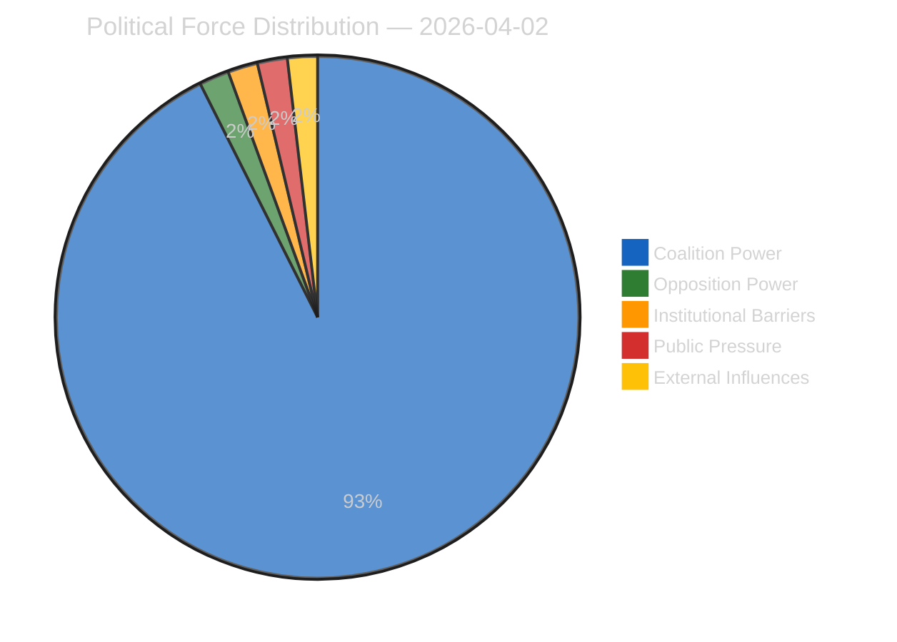
```mermaid
%%{init: {"theme":"dark","themeVariables":{"primaryColor":"#1565C0","primaryTextColor":"#ffffff","primaryBorderColor":"#0A3F7F","lineColor":"#90CAF9","secondaryColor":"#2E7D32","secondaryTextColor":"#ffffff","secondaryBorderColor":"#0F3F00","tertiaryColor":"#FF9800","tertiaryTextColor":"#000000","tertiaryBorderColor":"#7F4F00","mainBkg":"#1565C0","secondBkg":"#2E7D32","tertiaryBkg":"#FF9800","noteBkgColor":"#FFC107","noteTextColor":"#000000","noteBorderColor":"#7F6000","errorBkgColor":"#D32F2F","errorTextColor":"#ffffff","fontFamily":"Inter, Helvetica, Arial, sans-serif","pie1":"#1565C0","pie2":"#2E7D32","pie3":"#FF9800","pie4":"#D32F2F","pie5":"#FFC107","pie6":"#7B1FA2","pie7":"#9E9E9E","pie8":"#0288D1","pie9":"#388E3C","pie10":"#F57C00","pie11":"#C62828","pie12":"#FBC02D","pieTitleTextSize":"18px","pieSectionTextSize":"14px","pieLegendTextSize":"13px","pieStrokeColor":"#1e1e1e","pieOuterStrokeColor":"#1e1e1e","git0":"#1565C0","git1":"#2E7D32","git2":"#FF9800","git3":"#D32F2F","gitBranchLabel0":"#ffffff","gitBranchLabel1":"#ffffff","gitBranchLabel2":"#000000","gitBranchLabel3":"#ffffff","cScale0":"#1565C0","cScale1":"#2E7D32","cScale2":"#FF9800","cScale3":"#D32F2F","cScale4":"#FFC107","cScale5":"#7B1FA2","cScale6":"#9E9E9E","cScale7":"#0288D1","xyChart":{"backgroundColor":"#1e1e1e","plotColorPalette":"#1565C0,#2E7D32,#FF9800,#D32F2F,#FFC107,#7B1FA2,#9E9E9E"}}}}%%
pie title Political Force Distribution — 2026-04-02
    "Coalition Power" : 50
    "Opposition Power" : 1
    "Institutional Barriers" : 1
    "Public Pressure" : 1
    "External Influences" : 1
```

### Forces Data

| Force | Trend | Strength | Key Actors | Confidence |
|-------|-------|----------|------------|------------|
| Coalition Power | stable | 50% | — | low |
| Opposition Power | stable | 0% | — | low |
| Institutional Barriers | stable | 0% | — | low |
| Public Pressure | stable | 0% | — | low |
| External Influences | stable | 0% | — | low |

### Balance

| Metric | Value |
|--------|-------|
| Coalition vs Opposition | 50% vs 1% |
| Dominant force | Coalition |
| Date | 2026-04-02 |

### Date: 2026-04-02

### Impact Matrix

### Overall Significance: **ROUTINE**

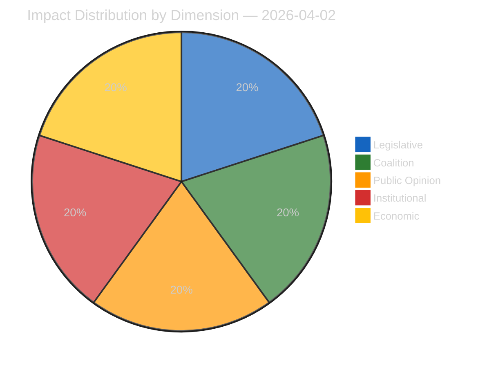
```mermaid
%%{init: {"theme":"dark","themeVariables":{"primaryColor":"#1565C0","primaryTextColor":"#ffffff","primaryBorderColor":"#0A3F7F","lineColor":"#90CAF9","secondaryColor":"#2E7D32","secondaryTextColor":"#ffffff","secondaryBorderColor":"#0F3F00","tertiaryColor":"#FF9800","tertiaryTextColor":"#000000","tertiaryBorderColor":"#7F4F00","mainBkg":"#1565C0","secondBkg":"#2E7D32","tertiaryBkg":"#FF9800","noteBkgColor":"#FFC107","noteTextColor":"#000000","noteBorderColor":"#7F6000","errorBkgColor":"#D32F2F","errorTextColor":"#ffffff","fontFamily":"Inter, Helvetica, Arial, sans-serif","pie1":"#1565C0","pie2":"#2E7D32","pie3":"#FF9800","pie4":"#D32F2F","pie5":"#FFC107","pie6":"#7B1FA2","pie7":"#9E9E9E","pie8":"#0288D1","pie9":"#388E3C","pie10":"#F57C00","pie11":"#C62828","pie12":"#FBC02D","pieTitleTextSize":"18px","pieSectionTextSize":"14px","pieLegendTextSize":"13px","pieStrokeColor":"#1e1e1e","pieOuterStrokeColor":"#1e1e1e","git0":"#1565C0","git1":"#2E7D32","git2":"#FF9800","git3":"#D32F2F","gitBranchLabel0":"#ffffff","gitBranchLabel1":"#ffffff","gitBranchLabel2":"#000000","gitBranchLabel3":"#ffffff","cScale0":"#1565C0","cScale1":"#2E7D32","cScale2":"#FF9800","cScale3":"#D32F2F","cScale4":"#FFC107","cScale5":"#7B1FA2","cScale6":"#9E9E9E","cScale7":"#0288D1","xyChart":{"backgroundColor":"#1e1e1e","plotColorPalette":"#1565C0,#2E7D32,#FF9800,#D32F2F,#FFC107,#7B1FA2,#9E9E9E"}}}}%%
pie title Impact Distribution by Dimension — 2026-04-02
    "Legislative" : 5
    "Coalition" : 5
    "Public Opinion" : 5
    "Institutional" : 5
    "Economic" : 5
```

### Impact Dimensions

| Dimension | Level | Indicator | Numeric |
|-----------|-------|-----------|---------|
| Legislative | none | 🟢 | 5 |
| Coalition | none | 🟢 | 5 |
| Public Opinion | none | 🟢 | 5 |
| Institutional | none | 🟢 | 5 |
| Economic | none | 🟢 | 5 |

### Summary

| Metric | Value |
|--------|-------|
| Overall significance | ROUTINE |
| Highest impact | Legislative |
| Date | 2026-04-02 |

### Date: 2026-04-02

### Significance Assessment

### Overall Significance: **ROUTINE**

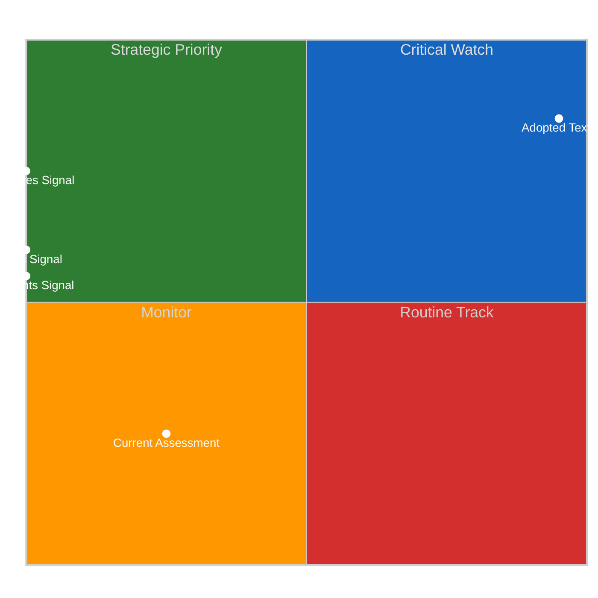
```mermaid
%%{init: {
  "theme": "dark",
  "themeVariables": {
    "quadrant1Fill": "#1565C0",
    "quadrant2Fill": "#2E7D32",
    "quadrant3Fill": "#FF9800",
    "quadrant4Fill": "#D32F2F",
    "quadrantTitleFill": "#ffffff",
    "quadrantPointFill": "#ffffff",
    "quadrantPointTextFill": "#ffffff",
    "quadrantXAxisTextFill": "#ffffff",
    "quadrantYAxisTextFill": "#ffffff"
  },
  "quadrantChart": {
    "chartWidth": 700,
    "chartHeight": 700,
    "pointLabelFontSize": 14,
    "titleFontSize": 22,
    "quadrantLabelFontSize": 18,
    "xAxisLabelFontSize": 16,
    "yAxisLabelFontSize": 16
  }
}}%%
quadrantChart
    title Political Significance Assessment — 2026-04-02
    x-axis Low Volume --> High Volume
    y-axis Low Impact --> High Impact
    quadrant-1 Critical Watch
    quadrant-2 Strategic Priority
    quadrant-3 Monitor
    quadrant-4 Routine Track
    Current Assessment: [0.25, 0.25]
    Events Signal: [0.00, 0.60]
    Documents Signal: [0.00, 0.55]
    Procedures Signal: [0.00, 0.75]
    Adopted Texts: [0.95, 0.85]
```

### 5-Signal Model Scores

| Signal | Raw Data | Score |
|--------|----------|-------|
| Volume | 0 events, 0 documents | 0.0/5 |
| Pipeline | 0 procedures | 0.0/5 |
| Output | 242 adopted texts | 5.0/5 |
| Anomalies | Pattern deviation detection | — |
| Coalition | Group alignment analysis | — |

### Data Summary

| Metric | Value |
|--------|-------|
| Computed significance | ROUTINE |
| Total data points | 242 |
| Events | 0 |
| Documents | 0 |
| Procedures | 0 |
| Adopted texts | 242 |
| Date | 2026-04-02 |

### Date: 2026-04-02

<h2 id="section-coalitions-voting">Coalitions & Voting</h2>

### Voting Patterns

### Overview
Detection and analysis of voting trends across European Parliament proceedings.

### Detected Trends
| Trend ID | Direction | Confidence | Data Points |
|----------|-----------|------------|-------------|
| No trend data available | — | — | — |

### Summary
- **Trends identified**: 0
- **Records analysed**: 0
- **Date**: 2026-04-02

<h2 id="section-risk">Risk Assessment</h2>

### Risk Matrix

### Overview

Quantitative risk scoring across 0 identified political dimensions.
This matrix uses a standardized likelihood × impact framework to quantify and
prioritize political risks affecting the European Parliament legislative process.

### Risk Heat Map

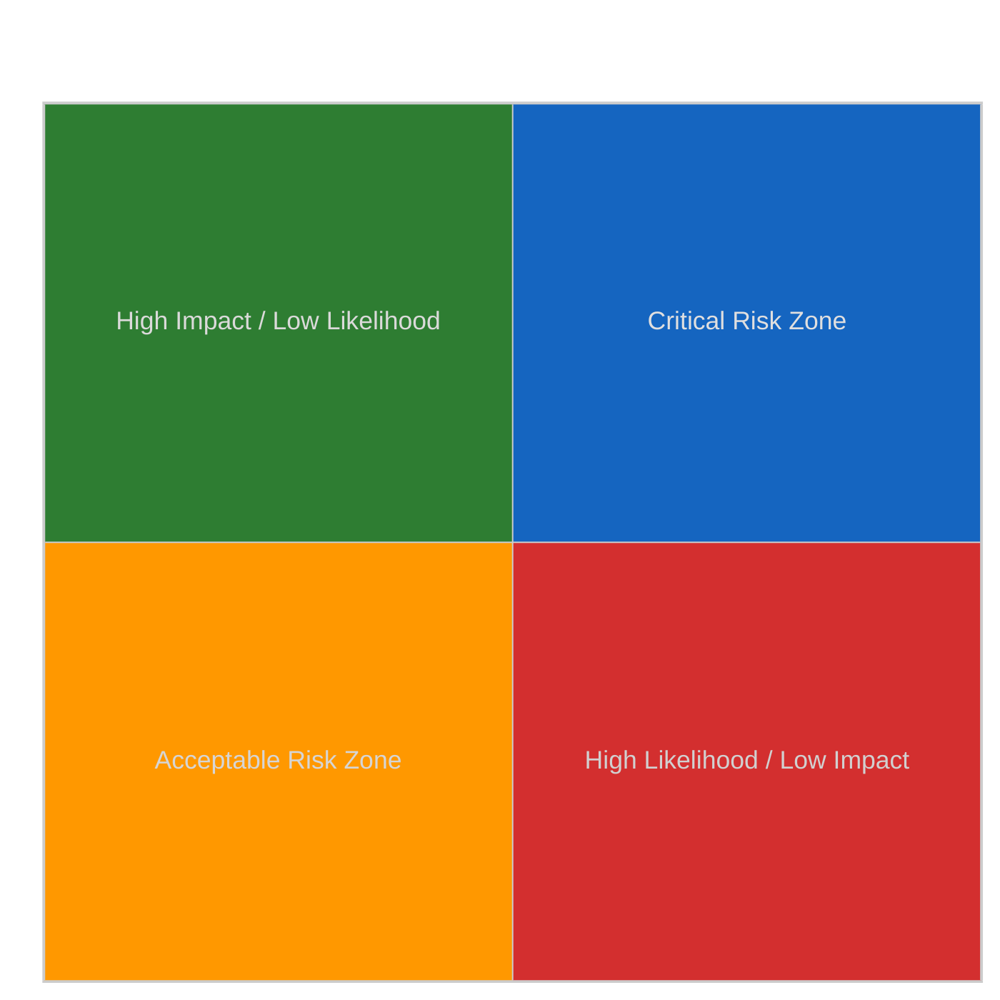
```mermaid
%%{init: {
  "theme": "dark",
  "themeVariables": {
    "quadrant1Fill": "#1565C0",
    "quadrant2Fill": "#2E7D32",
    "quadrant3Fill": "#FF9800",
    "quadrant4Fill": "#D32F2F",
    "quadrantTitleFill": "#ffffff",
    "quadrantPointFill": "#ffffff",
    "quadrantPointTextFill": "#ffffff",
    "quadrantXAxisTextFill": "#ffffff",
    "quadrantYAxisTextFill": "#ffffff"
  },
  "quadrantChart": {
    "chartWidth": 700,
    "chartHeight": 700,
    "pointLabelFontSize": 14,
    "titleFontSize": 22,
    "quadrantLabelFontSize": 18,
    "xAxisLabelFontSize": 16,
    "yAxisLabelFontSize": 16
  }
}}%%
quadrantChart
    title Political Risk Heat Map — 2026-04-02
    x-axis Low Likelihood --> High Likelihood
    y-axis Low Impact --> High Impact
    quadrant-1 Critical Risk Zone
    quadrant-2 High Impact / Low Likelihood
    quadrant-3 Acceptable Risk Zone
    quadrant-4 High Likelihood / Low Impact

```

### Risk Matrix

| Risk ID | Description | Likelihood | Impact | Score | Level |
|---------|-------------|------------|--------|-------|-------|
| — | — | — | — | — | — |

> **Risk Score** = Likelihood × Impact. **Levels**: 🟢 LOW (≤1.0), 🟡 MEDIUM (≤2.0), 🟠 HIGH (≤3.5), 🔴 CRITICAL (>3.5)

### Risk Assessment Details

| — | — | — | — | — | — |

### Risk Mitigation Framework

| Risk Level | Count | Tolerance | Action Required |
|------------|-------|-----------|-----------------|
| 🔴 CRITICAL | 0 | Zero tolerance | Immediate escalation |
| 🟠 HIGH | 0 | Low tolerance | Active mitigation |
| 🟡 MEDIUM | 0 | Moderate | Enhanced monitoring |
| 🟢 LOW | 0 | Acceptable | Routine tracking |

### Date: 2026-04-02

### Quantitative Swot

### Executive Summary

**Strategic Position Score**: 3.4/10
**Overall Assessment**: Weak strategic position: weaknesses and threats dominate — urgent mitigation needed.
**Analysis Date**: 2026-04-02

> This SWOT analysis is derived from 0 procedures, 0 events, 242 adopted texts, 0 documents, 0 voting records, and 0 coalition data points fetched from the European Parliament.

### SWOT Quadrant Chart

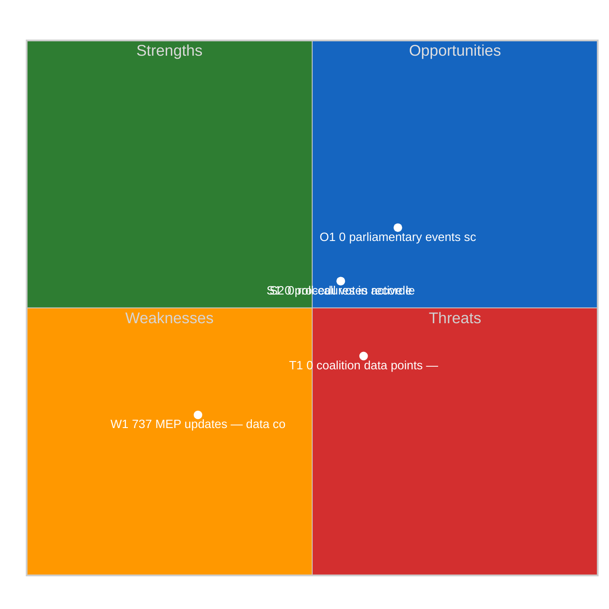
```mermaid
%%{init: {
  "theme": "dark",
  "themeVariables": {
    "quadrant1Fill": "#1565C0",
    "quadrant2Fill": "#2E7D32",
    "quadrant3Fill": "#FF9800",
    "quadrant4Fill": "#D32F2F",
    "quadrantTitleFill": "#ffffff",
    "quadrantPointFill": "#ffffff",
    "quadrantPointTextFill": "#ffffff",
    "quadrantXAxisTextFill": "#ffffff",
    "quadrantYAxisTextFill": "#ffffff"
  },
  "quadrantChart": {
    "chartWidth": 700,
    "chartHeight": 700,
    "pointLabelFontSize": 14,
    "titleFontSize": 22,
    "quadrantLabelFontSize": 18,
    "xAxisLabelFontSize": 16,
    "yAxisLabelFontSize": 16
  }
}}%%
quadrantChart
    title Political SWOT — Strategic Position (2026-04-02)
    x-axis Low Impact --> High Impact
    y-axis Low Priority --> High Priority
    quadrant-1 Opportunities
    quadrant-2 Strengths
    quadrant-3 Weaknesses
    quadrant-4 Threats
    S1 0 procedures in active le: [0.55, 0.55]
    S2 0 roll-call votes recorde: [0.55, 0.55]
    W1 737 MEP updates — data co: [0.30, 0.30]
    O1 0 parliamentary events sc: [0.65, 0.65]
    T1 0 coalition data points —: [0.59, 0.41]
```

### SWOT Overview

| Category | Items | Avg Score | Trend |
|----------|-------|-----------|-------|
| 🟢 Strengths | 2 | 0.0 | stable |
| 🔴 Weaknesses | 1 | 2.0 | stable |
| 🔵 Opportunities | 1 | 1.5 | stable |
| 🟠 Threats | 1 | 0.9 | stable |

### 🟢 Strengths

#### S1: 0 procedures in active legislative pipeline
- **Score**: 0.0/5
- **Confidence**: low
- **Trend**: stable
- **Evidence**:
  - 0 procedures tracked in current period
  - 242 texts adopted
  - 0 documents published

#### S2: 0 roll-call votes recorded with 0 questions
- **Score**: 0.0/5
- **Confidence**: low
- **Trend**: stable
- **Evidence**:
  - 0 voting records available
  - 0 parliamentary questions filed
  - 737 MEP activity updates

### 🔴 Weaknesses

#### W1: 737 MEP updates — data coverage gap assessment
- **Score**: 2.0/5
- **Confidence**: medium
- **Trend**: stable
- **Evidence**:
  - 737 MEP updates in current period
  - 0 documents vs 0 procedures ratio
  - Data freshness depends on EP feed update frequency

### 🔵 Opportunities

#### O1: 0 parliamentary events scheduled
- **Score**: 1.5/5
- **Confidence**: medium
- **Trend**: stable
- **Evidence**:
  - 0 events in analysis period
  - 242 texts adopted indicates legislative throughput
  - 0 procedures in various stages

### 🟠 Threats

#### T1: 0 coalition data points — cohesion monitoring
- **Score**: 0.9/5
- **Confidence**: low
- **Trend**: stable
- **Evidence**:
  - 0 coalition observations recorded
  - Cross-reference with 0 voting records
  - 0 procedures may be affected by coalition shifts

### Cross-Impact Matrix

| Interaction | Net Effect | Rationale |
|-------------|-----------|----------|
| strength #1 × threat #1 | 0.00 | Strength "0 procedures in active legislative pipeline" partially mitigates threat "0 coalition data points — cohesion monitoring" |
| strength #2 × threat #1 | 0.00 | Strength "0 roll-call votes recorded with 0 questions" partially mitigates threat "0 coalition data points — cohesion monitoring" |
| weakness #1 × threat #1 | 0.30 | Weakness "737 MEP updates — data coverage gap assessment" amplifies threat "0 coalition data points — cohesion monitoring" |

### Strategic Priorities Matrix

### Data Summary

| Data Source | Count |
|-------------|-------|
| Procedures | 0 |
| Events | 0 |
| Documents | 0 |
| Voting Records | 0 |
| Adopted Texts | 242 |
| Coalitions | 0 |
| Questions | 0 |
| MEP Updates | 737 |
| **Total Data Points** | **242** |

### Date: 2026-04-02

### Political Capital Risk

### Data Inventory for Capital Risk Assessment
| Data Source | Count | Relevance |
|-------------|-------|-----------|
| Coalition data points | 0 | Group cohesion indicators |
| Voting records | 0 | Voting alignment metrics |
| Voting patterns | 0 | Trend and anomaly data |
| Active procedures | 0 | Legislative engagement |

### Date: 2026-04-02

### Legislative Velocity Risk

### Overview
Risk assessment based on legislative processing speed for 0 procedures.

### Top Velocity Risks
| Procedure | Title | Stage | Days (actual/expected) | Risk Score | Level |
|-----------|-------|-------|----------------------|------------|-------|
| — | — | — | — | — | — |

### Summary
- **Procedures analysed**: 0
- **High/Critical risks**: 0
- **Date**: 2026-04-02

### Agent Risk Workflow

### Risk Heat Map

| Impact ↓ / Likelihood → | Rare | Unlikely | Possible | Likely | Almost Certain |
|--------------------------|------|----------|----------|--------|----------------|
| **Severe** | 🟢 | 🟡 | 🟠 | 🟠 | 🔴 |
| **Major** | 🟢 | 🟡 | 🟡 | 🟠 | 🔴 |
| **Moderate** | 🟢 | 🟢 | 🟡 | 🟠 | 🟠 |
| **Minor** | 🟢 | 🟢 | 🟢 | 🟡 | 🟡 |
| **Negligible** | 🟢 | 🟢 | 🟢 | 🟢 | 🟢 |

### Identified Risks

#### RISK-W00: Baseline political risk
- **Likelihood**: rare (0.1) | **Impact**: minor (2) | **Score**: 0.2 (LOW) | **Confidence**: low
- **Evidence**: Routine parliamentary activity
- **Mitigating Factors**: Stable institutional framework

### Risk Evaluation Matrix

| Rank | Risk ID | Description | Score | Level | Confidence |
|------|---------|-------------|-------|-------|------------|
| 1 | RISK-W00 | Baseline political risk | 0.2 | LOW | low |

### Risk Treatment Plan

- Monitor legislative velocity indicators
- Track coalition voting patterns

### Recommendations

- Monitor legislative velocity indicators
- Track coalition voting patterns

<h2 id="section-threat">Threat Landscape</h2>

### Actor Threat Profiles

### Overview
Individual threat profiles for 0 political actors.

### Actor Threat Matrix
| Actor | Type | Capability | Motivation | Opportunity | Threat Level |
|-------|------|------------|------------|-------------|--------------|
| — | — | — | — | — | — |

### Date: 2026-04-02

### Consequence Trees

### Overview
Structured analysis of action-consequence chains for 0 legislative procedures.

### No procedures available for consequence analysis

### Date: 2026-04-02

### Legislative Disruption

### Overview
Identification of factors disrupting the normal legislative process.

### Disruption Assessment
| Procedure ID | Title | Stage | Resilience | Disruption Points |
|-------------|-------|-------|-----------|-------------------|
| — | — | — | — | — |

### Date: 2026-04-02

### Political Threat Landscape

### Political Threat Landscape Analysis

#### Coalition Shifts
**Threat Level**: 🟢 Low

Coalition stability appears maintained. No significant realignment signals.

**Evidence:**
- No coalition shift signals detected in available data

#### Transparency Deficit
**Threat Level**: ⚠️ Moderate

Transparency concerns at moderate level. Review committee meeting records and public documentation.

**Evidence:**
- No committee activity data available — potential information gap

#### Policy Reversal
**Threat Level**: 🟢 Low

Legislative trajectory appears stable. No major reversal signals.

**Evidence:**
- No significant policy reversal signals detected

#### Institutional Pressure
**Threat Level**: 🟢 Low

Institutional balance appears maintained. Power distribution within normal parameters.

**Evidence:**
- No institutional threat signals detected

#### Legislative Obstruction
**Threat Level**: 🟢 Low

Legislative pace within normal parameters. No obstruction signals.

**Evidence:**
- No significant legislative delay signals detected

#### Democratic Erosion
**Threat Level**: 🟢 Low

Democratic norms appear stable. Institutional processes functioning within expected parameters.

**Evidence:**
- Democratic norms appear stable. No systematic erosion signals.

### Actor Threat Profiles

*No actor threat profiles generated from available data.*

### Consequence Trees

#### Consequence Tree: Standard legislative activity assessment

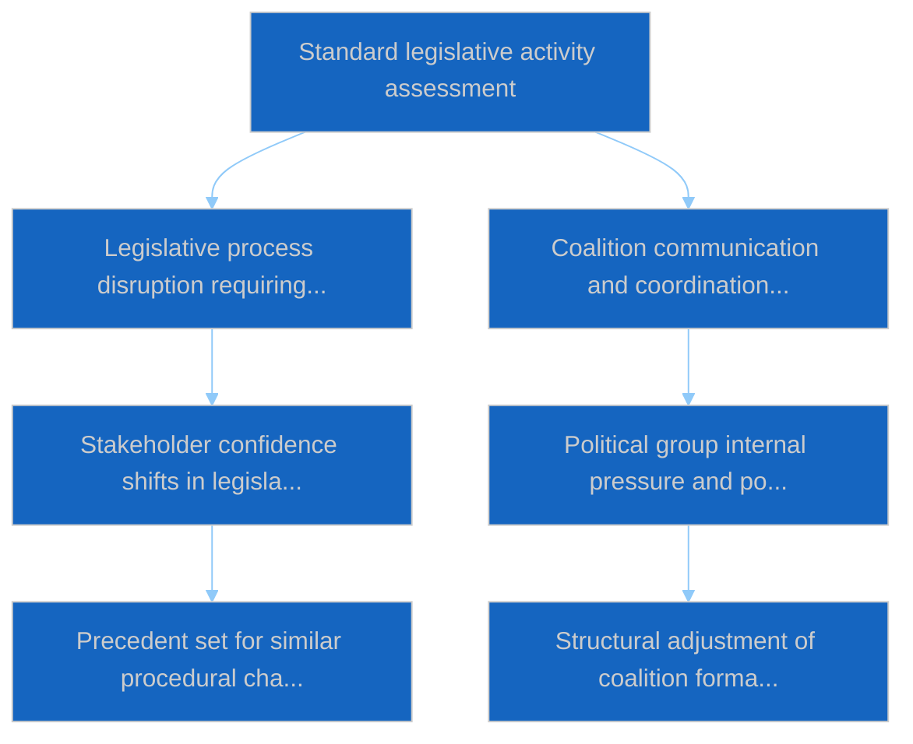
```mermaid
%%{init: {"theme":"dark","themeVariables":{"primaryColor":"#1565C0","primaryTextColor":"#ffffff","primaryBorderColor":"#0A3F7F","lineColor":"#90CAF9","secondaryColor":"#2E7D32","secondaryTextColor":"#ffffff","secondaryBorderColor":"#0F3F00","tertiaryColor":"#FF9800","tertiaryTextColor":"#000000","tertiaryBorderColor":"#7F4F00","mainBkg":"#1565C0","secondBkg":"#2E7D32","tertiaryBkg":"#FF9800","noteBkgColor":"#FFC107","noteTextColor":"#000000","noteBorderColor":"#7F6000","errorBkgColor":"#D32F2F","errorTextColor":"#ffffff","fontFamily":"Inter, Helvetica, Arial, sans-serif","pie1":"#1565C0","pie2":"#2E7D32","pie3":"#FF9800","pie4":"#D32F2F","pie5":"#FFC107","pie6":"#7B1FA2","pie7":"#9E9E9E","pie8":"#0288D1","pie9":"#388E3C","pie10":"#F57C00","pie11":"#C62828","pie12":"#FBC02D","pieTitleTextSize":"18px","pieSectionTextSize":"14px","pieLegendTextSize":"13px","pieStrokeColor":"#1e1e1e","pieOuterStrokeColor":"#1e1e1e","git0":"#1565C0","git1":"#2E7D32","git2":"#FF9800","git3":"#D32F2F","gitBranchLabel0":"#ffffff","gitBranchLabel1":"#ffffff","gitBranchLabel2":"#000000","gitBranchLabel3":"#ffffff","cScale0":"#1565C0","cScale1":"#2E7D32","cScale2":"#FF9800","cScale3":"#D32F2F","cScale4":"#FFC107","cScale5":"#7B1FA2","cScale6":"#9E9E9E","cScale7":"#0288D1","xyChart":{"backgroundColor":"#1e1e1e","plotColorPalette":"#1565C0,#2E7D32,#FF9800,#D32F2F,#FFC107,#7B1FA2,#9E9E9E"}}}}%%
graph TD
    A["Standard legislative activity assessment"]
    B0["Legislative process disruption requiring..."]
    A --> B0
    B1["Coalition communication and coordination..."]
    A --> B1
    C0["Stakeholder confidence shifts in legisla..."]
    B0 --> C0
    C1["Political group internal pressure and po..."]
    B1 --> C1
    D0["Precedent set for similar procedural cha..."]
    C0 --> D0
    D1["Structural adjustment of coalition forma..."]
    C1 --> D1
```

**Mitigating Factors:**
- Institutional resilience mechanisms
- Cross-party dialogue channels

**Amplifying Factors:**
- No significant amplifying factors identified

### Legislative Disruption Analysis

#### Procedure: General legislative pipeline

**Current Stage**: proposal | **Resilience**: high

| Stage | Threat Category | Likelihood | Risk Level |
|-------|----------------|------------|------------|
| proposal | delay | 8% | 🟢 Low |
| committee | transparency | 18% | 🟢 Low |
| plenary first reading | shift | 22% | 🟢 Low |
| council position | delay | 12% | 🟢 Low |
| plenary second reading | shift | 21% | 🟢 Low |
| conciliation | reversal | 17% | 🟢 Low |
| adoption | delay | 5% | 🟢 Low |

**Alternative Pathways:**
- Commission resubmission with revised proposal
- Enhanced informal trilogue engagement
- Interim resolution as procedural bridge

### Key Findings

- No high-priority threats detected across threat landscape dimensions

### Recommendations

- Continue routine monitoring of parliamentary activity

---
*Assessment generated by EU Parliament Monitor Political Threat Assessment Pipeline.*  
*Based on public European Parliament data. GDPR-compliant.*

<h2 id="section-continuity">Cross-Run Continuity</h2>

### Cross Session Intelligence

### Overview
Analysis of coalition stability patterns across multiple plenary sessions.

### Stability Report
- **Overall Stability**: 0.0%
- **Forecast**: volatile
- **Patterns Analysed**: 0

### Group Analysis
- **Stable Groups**: None identified
- **Declining Groups**: None identified

### Date: 2026-04-02

<h2 id="section-deep-analysis">Deep Analysis</h2>

### Raw Data Inventory
| Data Source | Count |
|-------------|-------|
| Events | 0 |
| Procedures | 0 |
| Documents | 0 |
| Adopted Texts | 242 |
| Questions | 0 |
| MEP Updates | 737 |
| **Total** | **979** |

### Stakeholder Groups for AI Analysis
| Stakeholder Group | Data Points Available |
|-------------------|---------------------|
| Political Groups | 242 (procedures + adopted texts) |
| Civil Society | 0 (documents + questions) |
| Industry | 0 (procedures) |
| National Governments | 242 (adopted texts) |
| Citizens | 737 (questions + MEP updates) |
| EU Institutions | 0 (events + procedures) |

### Date: 2026-04-02

<h2 id="section-supplementary-intelligence">Supplementary Intelligence</h2>

### Executive Brief Ar

**التصنيف:** OSINT | سجل برلماني عام
**مستوى الثقة:** 🟢 عالٍ (تقييم هيكلي خلال فترة التوقف البرلماني)
**تاريخ الإنشاء:** 2026-04-02T00:00:00Z (ملخص استرجاعي)
**نوع المقال:** مقترحات قرارات
**معرّف التشغيل:** `c93513b6-9f22-4b36-a984-d0512328769c`
**المصدر:** بوابة البيانات المفتوحة للبرلمان الأوروبي

---

### 🎯 BLUF

**لم تُقدَّم أي مقترحات قرارات جديدة في 2026-04-02؛ الأسبوع الثاني من أصل 4 من فترة التوقف البرلماني لا يزال مستمراً.** أسفرت عملية التشغيل `c93513b6-9f22-4b36-a984-d0512328769c` عن **0 من الجهات الفاعلة المصنّفة** وأهمية **روتينية**، مما يعكس حالة القالب الفارغ لـ 2026-04-01/المقترحات. يرتبط نشاط مرحلة المقترحات بالتقويم الزمني للأيام التي تسبق مباشرةً الجلسة العامة؛ ولا يُتوقع أول تقديم في أبريل قبل حوالي 17-20 أبريل. الأولويات المُرحَّلة إلى أبريل: متابعة المعتقلين السياسيين في جورجيا (TA-10-2026-0083)، نقل اعتمادات انبعاثات HDV (TA-10-2026-0084)، رسوم جمركية أمريكية (TA-10-2026-0096)، سابقة حصانة براون (TA-10-2026-0088)، منصب نائب رئيس البنك المركزي الأوروبي (TA-10-2026-0060). **🟢 ثقة عالية** — الحالة الفارغة مدفوعة بالتقويم الزمني.

---

### 🧭 3 قرارات يدعمها هذا الملخص

| # | القرار | متخذ القرار | الموعد النهائي | الدليل |
|:-:|--------|------------|:--------------:|--------|
| 1 | **تحريري:** تخطّي مقترحات القرارات اليومية | المحرر | +24 ساعة | نتيجة تشغيل فارغة |
| 2 | **مراقبة:** الإشارة إلى الموجة الأولى من تقديمات أبريل في الفترة 17-20 أبريل | المحلل | 2026-04-17 | نمط تقديم البرلمان الأوروبي |
| 3 | **مراقبة استشرافية:** تتبّع توازن مقترحات التجارة مقابل سيادة القانون لمعايرة سيناريوهات أبريل | قيادة التحليل | 2026-04-20 | السيناريو A مقابل B |

---

### 📰 قراءة 60 ثانية

- 🔴 **لم تُقدَّم مقترحات قرارات جديدة** في 2026-04-02؛ فترة توقف. (🟢 عالٍ)
- 🟠 **0 جهة فاعلة مصنّفة** في عملية التشغيل المركّزة على المقترحات. (🟢 عالٍ)
- 🟢 **الملفات المُرحَّلة من مارس** ترسّخ قائمة المراقبة في أبريل. (🟢 عالٍ)
- 🟡 **أبعاد المخاطر كلها "لا شيء"** اليوم. (🟢 عالٍ)
- 🔵 **السياق الاقتصادي:** الرسوم الجمركية الأمريكية وملفات البنك المركزي الأوروبي مهيمنة. (🟢 عالٍ)
- 🟣 **مرجع متقاطع:** عمليات التشغيل الشقيقة 2026-04-02 قوالب فارغة. (🟢 عالٍ)
- 🩷 **متجه التعطيل:** لا شيء حاد اليوم. (🟢 عالٍ)
- ⚪ **ترحيل:** رأي محكمة العدل الأوروبية بشأن ميركوسور سيُولّد على الأرجح مقترحات.

---

### 🗂️ أبرز الوثائق/الإجراءات — مراقبة المقترحات

| الترتيب | مرجع البرلمان الأوروبي | العنوان (مختصر) | الأهمية | الثقة | الوضع |
|:-------:|----------------------|----------------|:-------:|:-----:|-------|
| 1 | — | لا توجد مقترحات جديدة في 2026-04-02 | 0.0 | 🟢 عالٍ | توقف — لا تقديم |
| 2 | TA-10-2026-0083 | المعتقلون السياسيون في جورجيا (مُرحَّل) | 7.0 | 🟢 عالٍ | مراقبة التنفيذ |
| 3 | TA-10-2026-0096 | الرسوم الجمركية الأمريكية (مُرحَّل) | 7.0 | 🟢 عالٍ | مقترح أبريل محتمل |

---

### ⚠️ لقطة المخاطر والتهديدات

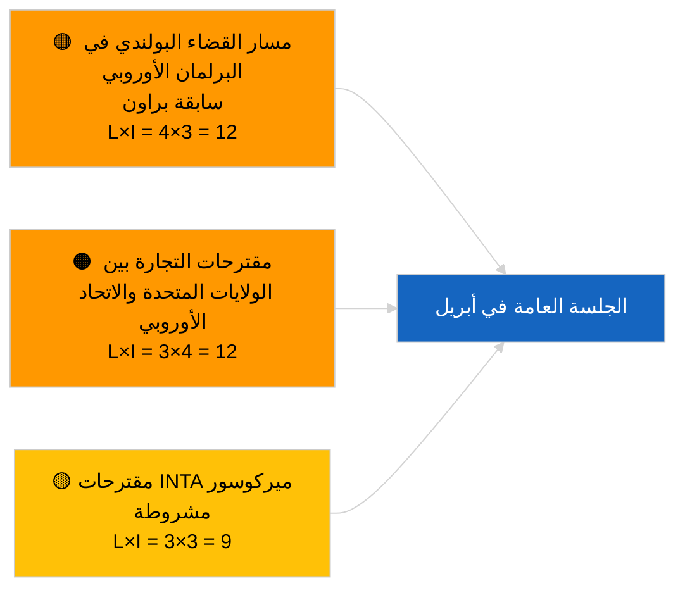
```mermaid
%%{init: {"theme":"dark"}}%%
graph LR
    R1["🟠 مسار القضاء البولندي في البرلمان الأوروبي<br/>سابقة براون<br/>L×I = 4×3 = 12"] --> CONS["الجلسة العامة في أبريل"]
    R2["🟠 مقترحات التجارة بين الولايات المتحدة والاتحاد الأوروبي<br/>L×I = 3×4 = 12"] --> CONS
    R3["🟡 مقترحات INTA ميركوسور<br/>مشروطة<br/>L×I = 3×3 = 9"] --> CONS
    style R1 fill:#FF9800,color:#000000
    style R2 fill:#FF9800,color:#000000
    style R3 fill:#FFC107,color:#000000
    style CONS fill:#1565C0,color:#FFFFFF
```

| المخاطرة | L | I | الدرجة | المحفّز | المصدر | الأدميرالية |
|----------|:-:|:-:|:------:|---------|--------|:----------:|
| مسار القضاء البولندي | 4 | 3 | 12 | قضية حصانة جديدة | TA-10-2026-0088 | A1 |
| مقترحات التجارة بين الولايات المتحدة والاتحاد الأوروبي | 3 | 4 | 12 | إجراء أمريكي | TA-10-2026-0096 | A1 |
| مقترحات ميركوسور (مشروطة) | 3 | 3 | 9 | رأي محكمة العدل الأوروبية | TA-10-2026-0008 | A2 |

---

### 🔮 أهم محفّز استشرافي

**الموجة الأولى من تقديمات أبريل في الفترة 17-20 أبريل 2026.** يُعاير مزيج الموضوعات السيناريو A (التجارة) مقابل B (سيادة القانون) مقابل C (الاقتصاد) استعداداً للجلسة العامة في ستراسبورغ في الفترة 27-30 أبريل.

---

### 🛡️ تقييم جودة المصادر

- **المصادر الأولية:** بوابة البيانات المفتوحة للبرلمان الأوروبي؛ التشغيل `c93513b6-9f22-4b36-a984-d0512328769c`.
- **الثقة:** 🟢 عالية لحالة عدم النشاط المدفوعة بالتقويم.

---

### 📎 روابط

| الرابط | المسار |
|--------|--------|
| المقال | `./article.md` |
| عمليات التشغيل الشقيقة | `analysis/daily/2026-04-02/breaking/`, `committee-reports/`, `propositions/` |
| البيان الوصفي | `./manifest.json` |

---

**ضبط الوثيقة**
- **القالب:** `/analysis/templates/executive-brief.md`
- **مسار الأرتيفاكت:** `analysis/daily/2026-04-02/motions/executive-brief.md`
- **التصنيف:** عام
- **الإنشاء الاسترجاعي:** جلسة ملء بأثر رجعي.

### Executive Brief Da

### 🎯 BLUF

**Ingen nye beslutningsforslag indgivet den 2026-04-02; parlamentsrecessens uge 2 af 4 fortsætter.** Kørsel `c93513b6-9f22-4b36-a984-d0512328769c` returnerede **0 klassificerede aktører** og **RUTINE**-signifikans, hvilket afspejler den tomme skabelontilstand for 2026-04-01/beslutningsforslag. Aktivitet i forslagsfasen er kalenterbundet til dagene umiddelbart forud for plenarsamlingen; den første april-indgivelse forventes ikke før ca. 17-20 april. Overførte prioriteter i april: Opfølgning på politiske fanger i Georgien (TA-10-2026-0083), transponering af HDV-emissionskreditter (TA-10-2026-0084), amerikanske told (TA-10-2026-0096), Braun-immunitetspræcedens (TA-10-2026-0088), ECB's næstformandspost (TA-10-2026-0060). **🟢 HØJ tillid** — den tomme tilstand er kalenterbetinget.

---

### 🧭 3 beslutninger denne briefing understøtter

| # | Beslutning | Beslutningstager | Frist | Bevis |
|:-:|------------|-----------------|:-----:|-------|
| 1 | **Redaktionelt:** SPRING daglige beslutningsforslag over | Redaktør | +24t | Tomt kørselsresultat |
| 2 | **Overvågning:** markér første april-indgivelsesbølge 17-20 april | Analytiker | 2026-04-17 | EP's indgivelsesmønster |
| 3 | **Fremadrettet overvågning:** spor handel vs. RoL-forslagsbalance for aprilscenariekalibrering | Analyseleder | 2026-04-20 | Scenario A vs. B |

---

### 📰 60-sekunders læsning

- 🔴 **Ingen nye beslutningsforslag indgivet** den 2026-04-02; recessperiode. (🟢 Høj)
- 🟠 **0 aktører klassificeret** i forslagsfokuseret kørsel. (🟢 Høj)
- 🟢 **Marts-restancer** forankrer april-overvågningslisten. (🟢 Høj)
- 🟡 **Risikodimensioner alle "ingen"** i dag. (🟢 Høj)
- 🔵 **Økonomisk kontekst:** amerikanske told og ECB-poster dominerer. (🟢 Høj)
- 🟣 **Krydsreference:** søskendeløb 2026-04-02 tomme skabeloner. (🟢 Høj)
- 🩷 **Forstyrrelsesvektor:** ingen akut i dag. (🟢 Høj)
- ⚪ **Videreførelse:** Mercosur ECJ-udtalelse vil sandsynligvis generere forslag.

---

### 🗂️ Toplistede dokumenter/procedurer — Forslagsovervågning

| Rang | EP-reference | Titel (kort) | Signifikans | Tillid | Status |
|:----:|--------------|-------------|:-----------:|:------:|--------|
| 1 | — | Ingen nye beslutningsforslag 2026-04-02 | 0,0 | 🟢 HØJ | Recessperiode — ingen indgivelse |
| 2 | TA-10-2026-0083 | Georgiens politiske fanger (overført) | 7,0 | 🟢 HØJ | Implementeringsovervågning |
| 3 | TA-10-2026-0096 | Amerikanske told (overført) | 7,0 | 🟢 HØJ | April-forslag sandsynligt |

---

### ⚠️ Risiko- og trusselsøjebliksbillede

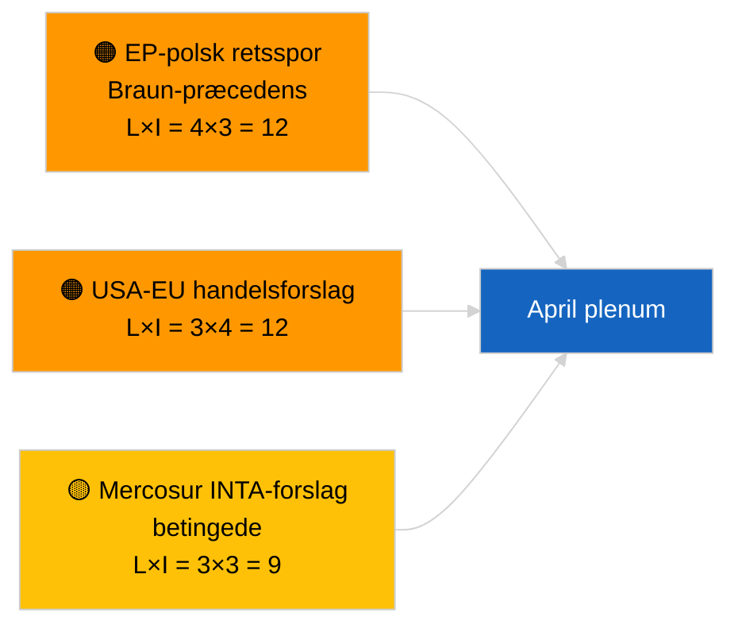
```mermaid
%%{init: {"theme":"dark"}}%%
graph LR
    R1["🟠 EP-polsk retsspor<br/>Braun-præcedens<br/>L×I = 4×3 = 12"] --> CONS["April plenum"]
    R2["🟠 USA-EU handels­forslag<br/>L×I = 3×4 = 12"] --> CONS
    R3["🟡 Mercosur INTA-forslag<br/>betingede<br/>L×I = 3×3 = 9"] --> CONS
    style R1 fill:#FF9800,color:#000000
    style R2 fill:#FF9800,color:#000000
    style R3 fill:#FFC107,color:#000000
    style CONS fill:#1565C0,color:#FFFFFF
```

| Risiko | L | I | Score | Udløser | Kilde | Admiralitet |
|--------|:-:|:-:|:-----:|---------|-------|:-----------:|
| EP-polsk retsspor | 4 | 3 | 12 | Ny immunitetsag | TA-10-2026-0088 | A1 |
| USA-EU handels­forslag | 3 | 4 | 12 | USA-foranstaltning | TA-10-2026-0096 | A1 |
| Mercosur-forslag (betingede) | 3 | 3 | 9 | ECJ-udtalelse | TA-10-2026-0008 | A2 |

---

### 🔮 Vigtigste fremadrettede udløser

**Første april-indgivelsesbølge ~17-20 april 2026.** Emnefordelingen kalibrerer Scenario A (handel) vs. B (RoL) vs. C (økonomi) forud for Strasbourg-plenarsessionen 27-30 april.

---

### 🛡️ Vurdering af kildekvalitet

- **Primære kilder:** EP's åbne dataportal; kørsel `c93513b6-9f22-4b36-a984-d0512328769c`.
- **Tillid:** 🟢 HØJ for kalenterdrevet inaktivitet.

---

### 📎 Links

| Link | Sti |
|------|-----|
| Artikel | `./article.md` |
| Søskendeløb | `analysis/daily/2026-04-02/breaking/`, `committee-reports/`, `propositions/` |
| Manifest | `./manifest.json` |

---

**Dokumentkontrol**
- **Skabelon:** `/analysis/templates/executive-brief.md`
- **Artefaktsti:** `analysis/daily/2026-04-02/motions/executive-brief.md`
- **Klassifikation:** Offentlig
- **Retrospektiv generering:** Tilbagedateringssession.

### Executive Brief De

### 🎯 BLUF

**Am 2026-04-02 wurden keine neuen Entschließungsanträge eingereicht; 2. Woche von 4 der Parlamentspause dauert an.** Ausführung `c93513b6-9f22-4b36-a984-d0512328769c` ergab **0 klassifizierte Akteure** und die Einstufung **ROUTINE**, was den leeren Vorlagenzustand für 2026-04-01/Anträge widerspiegelt. Die Aktivität in der Antragsphase ist kalendergebunden an die Tage unmittelbar vor der Plenarsitzung; die erste Einreichung im April wird nicht vor dem ~17.–20. April erwartet. Übertragene Prioritäten für den April: Nachverfolgung politischer Gefangener in Georgien (TA-10-2026-0083), Umsetzung der HDV-Emissionsgutschriften (TA-10-2026-0084), US-Zölle (TA-10-2026-0096), Braun-Immunitätspräzedenzfall (TA-10-2026-0088), EZB-Vizepräsidentenstelle (TA-10-2026-0060). **🟢 HOHE Konfidenz** — der leere Zustand ist kalenderbedingt.

---

### 🧭 3 Entscheidungen, die diese Kurzinformation unterstützt

| # | Entscheidung | Entscheidungsträger | Frist | Beleg |
|:-:|--------------|--------------------:|:-----:|-------|
| 1 | **Redaktionell:** Tägliche Entschließungsanträge ÜBERSPRINGEN | Redakteur | +24h | Leeres Ausführungsergebnis |
| 2 | **Überwachung:** Erste April-Einreichungswelle 17.–20. April markieren | Analytiker | 2026-04-17 | EP-Einreichungsmuster |
| 3 | **Vorausschauende Überwachung:** Handel-vs.-RoL-Antragssaldo für April-Szenariokalibrierung verfolgen | Analyseführung | 2026-04-20 | Szenario A vs. B |

---

### 📰 60-Sekunden-Lektüre

- 🔴 **Keine neuen Entschließungsanträge eingereicht** am 2026-04-02; Sitzungspause. (🟢 Hoch)
- 🟠 **0 Akteure klassifiziert** in antragsfokussierter Ausführung. (🟢 Hoch)
- 🟢 **März-Überträge** verankern die April-Überwachungsliste. (🟢 Hoch)
- 🟡 **Risikodimensionen alle „keine"** heute. (🟢 Hoch)
- 🔵 **Wirtschaftlicher Kontext:** US-Zölle und EZB-Akten dominieren. (🟢 Hoch)
- 🟣 **Querverweis:** Schwester-Ausführungen 2026-04-02 leere Vorlagen. (🟢 Hoch)
- 🩷 **Störungsvektor:** heute kein akuter. (🟢 Hoch)
- ⚪ **Übertrag:** Mercosur-EuGH-Gutachten wird voraussichtlich Anträge generieren.

---

### 🗂️ Top-Dokumente/Verfahren — Antragsüberwachung

| Rang | EP-Referenz | Titel (kurz) | Signifikanz | Konfidenz | Status |
|:----:|-------------|-------------|:-----------:|:---------:|--------|
| 1 | — | Keine neuen Entschließungsanträge 2026-04-02 | 0,0 | 🟢 HOCH | Sitzungspause — keine Einreichung |
| 2 | TA-10-2026-0083 | Georgiens politische Gefangene (Übertrag) | 7,0 | 🟢 HOCH | Umsetzungsüberwachung |
| 3 | TA-10-2026-0096 | US-Zölle (Übertrag) | 7,0 | 🟢 HOCH | April-Antrag wahrscheinlich |

---

### ⚠️ Risiko- und Bedrohungsübersicht

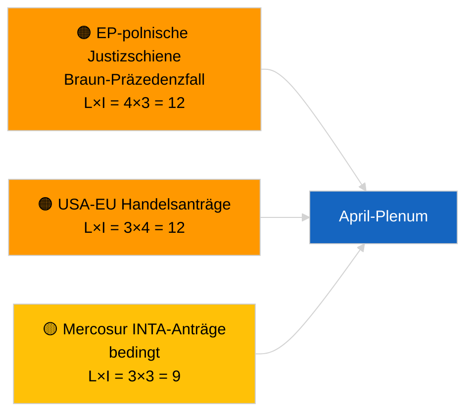
```mermaid
%%{init: {"theme":"dark"}}%%
graph LR
    R1["🟠 EP-polnische Justizschiene<br/>Braun-Präzedenzfall<br/>L×I = 4×3 = 12"] --> CONS["April-Plenum"]
    R2["🟠 USA-EU Handels­anträge<br/>L×I = 3×4 = 12"] --> CONS
    R3["🟡 Mercosur INTA-Anträge<br/>bedingt<br/>L×I = 3×3 = 9"] --> CONS
    style R1 fill:#FF9800,color:#000000
    style R2 fill:#FF9800,color:#000000
    style R3 fill:#FFC107,color:#000000
    style CONS fill:#1565C0,color:#FFFFFF
```

| Risiko | L | I | Wert | Auslöser | Quelle | Admiralität |
|--------|:-:|:-:|:----:|----------|--------|:-----------:|
| EP-polnische Justizschiene | 4 | 3 | 12 | Neues Immunitätsverfahren | TA-10-2026-0088 | A1 |
| USA-EU Handels­anträge | 3 | 4 | 12 | US-Maßnahme | TA-10-2026-0096 | A1 |
| Mercosur-Anträge (bedingt) | 3 | 3 | 9 | EuGH-Gutachten | TA-10-2026-0008 | A2 |

---

### 🔮 Wichtigster Vorausauslöser

**Erste April-Einreichungswelle ~17.–20. April 2026.** Die Themenmischung kalibriert Szenario A (Handel) vs. B (RoL) vs. C (Wirtschaft) für das Straßburger Plenum vom 27.–30. April.

---

### 🛡️ Bewertung der Quellenqualität

- **Primärquellen:** Offenes Datenportal des EP; Ausführung `c93513b6-9f22-4b36-a984-d0512328769c`.
- **Konfidenz:** 🟢 HOCH für kalenderbedingte Inaktivität.

---

### 📎 Links

| Link | Pfad |
|------|------|
| Artikel | `./article.md` |
| Schwester-Ausführungen | `analysis/daily/2026-04-02/breaking/`, `committee-reports/`, `propositions/` |
| Manifest | `./manifest.json` |

---

**Dokumentenkontrolle**
- **Vorlage:** `/analysis/templates/executive-brief.md`
- **Artefaktpfad:** `analysis/daily/2026-04-02/motions/executive-brief.md`
- **Einstufung:** Öffentlich
- **Retrospektive Erstellung:** Rückfüllungssitzung.

### Executive Brief Es

### 🎯 BLUF

**No se presentaron nuevas propuestas de resolución el 2026-04-02; continúa la semana 2 de 4 del receso parlamentario.** La ejecución `c93513b6-9f22-4b36-a984-d0512328769c` devolvió **0 actores clasificados** y significancia **RUTINA**, lo que refleja el estado de plantilla vacía para 2026-04-01/propuestas. La actividad en la fase de propuestas está vinculada al calendario en los días inmediatamente anteriores al pleno; no se espera la primera presentación de abril hasta el ~17-20 de abril. Prioridades trasladadas a abril: seguimiento de presos políticos de Georgia (TA-10-2026-0083), transposición de créditos de emisión HDV (TA-10-2026-0084), aranceles de EE.UU. (TA-10-2026-0096), precedente de inmunidad Braun (TA-10-2026-0088), puesto de vicepresidente del BCE (TA-10-2026-0060). **🟢 ALTA confianza** — el estado vacío está impulsado por el calendario.

---

### 🧭 3 decisiones que apoya este informe

| # | Decisión | Responsable | Plazo | Evidencia |
|:-:|----------|-------------|:-----:|-----------|
| 1 | **Editorial:** OMITIR propuestas diarias | Editor | +24h | Resultado de ejecución vacío |
| 2 | **Seguimiento:** marcar la primera oleada de presentaciones de abril del 17-20 de abril | Analista | 2026-04-17 | Patrón de presentación del PE |
| 3 | **Seguimiento prospectivo:** rastrear el equilibrio de propuestas comerciales vs. Estado de Derecho para calibración de escenarios de abril | Responsable de análisis | 2026-04-20 | Escenario A vs. B |

---

### 📰 Lectura de 60 segundos

- 🔴 **No se presentaron nuevas propuestas** el 2026-04-02; período de receso. (🟢 Alta)
- 🟠 **0 actores clasificados** en ejecución enfocada en propuestas. (🟢 Alta)
- 🟢 **Los carryovers de marzo** anclan la lista de seguimiento de abril. (🟢 Alta)
- 🟡 **Dimensiones de riesgo todas "ninguna"** hoy. (🟢 Alta)
- 🔵 **Contexto económico:** aranceles de EE.UU. y expedientes del BCE dominantes. (🟢 Alta)
- 🟣 **Referencia cruzada:** ejecuciones hermanas 2026-04-02 plantillas vacías. (🟢 Alta)
- 🩷 **Vector de perturbación:** ninguno agudo hoy. (🟢 Alta)
- ⚪ **Traslado:** el dictamen del TJUE sobre el Mercosur generará probablemente propuestas.

---

### 🗂️ Principales documentos/procedimientos — Seguimiento de propuestas

| Rango | Referencia PE | Título (breve) | Significancia | Confianza | Estado |
|:-----:|---------------|---------------|:-------------:|:---------:|--------|
| 1 | — | No hay nuevas propuestas el 2026-04-02 | 0,0 | 🟢 ALTA | Receso — sin presentación |
| 2 | TA-10-2026-0083 | Presos políticos de Georgia (trasladado) | 7,0 | 🟢 ALTA | Seguimiento de implementación |
| 3 | TA-10-2026-0096 | Aranceles de EE.UU. (trasladado) | 7,0 | 🟢 ALTA | Propuesta de abril probable |

---

### ⚠️ Panorama de riesgos y amenazas

```mermaid
%%{init: {"theme":"dark"}}%%
graph LR
    R1["🟠 Expediente judicial EP-Polonia<br/>precedente Braun<br/>L×I = 4×3 = 12"] --> CONS["Pleno de abril"]
    R2["🟠 Propuestas comerciales UE-EE.UU.<br/>L×I = 3×4 = 12"] --> CONS
    R3["🟡 Propuestas INTA Mercosur<br/>contingentes<br/>L×I = 3×3 = 9"] --> CONS
    style R1 fill:#FF9800,color:#000000
    style R2 fill:#FF9800,color:#000000
    style R3 fill:#FFC107,color:#000000
    style CONS fill:#1565C0,color:#FFFFFF
```

| Riesgo | L | I | Puntuación | Desencadenante | Fuente | Almirantazgo |
|--------|:-:|:-:|:----------:|----------------|--------|:------------:|
| Expediente judicial EP-Polonia | 4 | 3 | 12 | Nuevo caso de inmunidad | TA-10-2026-0088 | A1 |
| Propuestas comerciales UE-EE.UU. | 3 | 4 | 12 | Acción de EE.UU. | TA-10-2026-0096 | A1 |
| Propuestas Mercosur (contingentes) | 3 | 3 | 9 | Dictamen TJUE | TA-10-2026-0008 | A2 |

---

### 🔮 Principal desencadenante prospectivo

**Primera oleada de presentaciones de abril ~17-20 de abril de 2026.** La mezcla temática calibra el Escenario A (comercio) vs. B (Estado de Derecho) vs. C (económico) para el pleno de Estrasburgo del 27-30 de abril.

---

### 🛡️ Evaluación de la calidad de las fuentes

- **Fuentes primarias:** Portal de datos abiertos del PE; ejecución `c93513b6-9f22-4b36-a984-d0512328769c`.
- **Confianza:** 🟢 ALTA para la inactividad impulsada por el calendario.

---

### 📎 Enlaces

| Enlace | Ruta |
|--------|------|
| Artículo | `./article.md` |
| Ejecuciones hermanas | `analysis/daily/2026-04-02/breaking/`, `committee-reports/`, `propositions/` |
| Manifiesto | `./manifest.json` |

---

**Control documental**
- **Plantilla:** `/analysis/templates/executive-brief.md`
- **Ruta del artefacto:** `analysis/daily/2026-04-02/motions/executive-brief.md`
- **Clasificación:** Público
- **Generación retrospectiva:** Sesión de relleno retroactivo.

### Executive Brief Fi

### 🎯 BLUF

**Uusia päätöslauselmaesityksiä ei jätetty 2026-04-02; istuntotauon 2. viikko 4:stä jatkuu.** Suoritus `c93513b6-9f22-4b36-a984-d0512328769c` palautti **0 luokiteltua toimijaa** ja **RUTIINI**-merkittävyyden, mikä heijastaa 2026-04-01/esitysten tyhjää mallitilaa. Ehdotusvaiheessa tapahtuva toiminta on kalenterisidonnainen välittömästi ennen täysistuntoa oleviin päiviin; ensimmäistä huhtikuun jättämistä ei odoteta ennen n. 17.–20. huhtikuuta. Huhtikuuhun siirtyvät painopisteet: Georgian poliittisten vankien seuranta (TA-10-2026-0083), HDV-päästöhyvitysten implementointi (TA-10-2026-0084), Yhdysvaltain tullitoimet (TA-10-2026-0096), Braun-immuniteettiprecedenssi (TA-10-2026-0088), EKP:n varapuheenjohtajan toimi (TA-10-2026-0060). **🟢 KORKEA luotettavuus** — tyhjä tila on kalenterisidonnainen.

---

### 🧭 3 päätöstä, joita tämä tiedote tukee

| # | Päätös | Päätöksentekijä | Määräaika | Perustelu |
|:-:|--------|----------------|:---------:|-----------|
| 1 | **Toimituksellinen:** OHITA päivittäiset päätöslauselmaesitykset | Toimittaja | +24t | Tyhjä suoritustulos |
| 2 | **Seuranta:** merkitse ensimmäinen huhtikuun jättämisaalto 17.–20. huhtikuuta | Analyytikko | 2026-04-17 | EP:n jättämismalli |
| 3 | **Ennakoiva seuranta:** seuraa kauppa vs. oikeusvaltion esitysten tasapainoa huhtikuun skenaariokalibrointia varten | Analyysijohto | 2026-04-20 | Skenaario A vs. B |

---

### 📰 60 sekunnin katsaus

- 🔴 **Uusia päätöslauselmaesityksiä ei jätetty** 2026-04-02; istuntotauko. (🟢 Korkea)
- 🟠 **0 toimijaa luokiteltu** esityskeskeisessä suorituksessa. (🟢 Korkea)
- 🟢 **Maaliskuun jäljellä olevat asiat** ankkuroivat huhtikuun seurantalistan. (🟢 Korkea)
- 🟡 **Riskidimensiot kaikki "ei mitään"** tänään. (🟢 Korkea)
- 🔵 **Taloudellinen konteksti:** Yhdysvaltain tullitoimet ja EKP-asiat hallitsevat. (🟢 Korkea)
- 🟣 **Ristiviittaus:** sisarsuoritukset 2026-04-02 tyhjiä malleja. (🟢 Korkea)
- 🩷 **Häiriövektorit:** ei akuutteja tänään. (🟢 Korkea)
- ⚪ **Siirtyvä asia:** Mercosur EUT:n lausunto luo todennäköisesti esityksiä.

---

### 🗂️ Kärkiasiakirjat/menettelyt — Esitysten seuranta

| Sijoitus | EP-viite | Otsikko (lyhyt) | Merkittävyys | Luotettavuus | Tila |
|:--------:|----------|----------------|:------------:|:------------:|------|
| 1 | — | Ei uusia esityksiä 2026-04-02 | 0,0 | 🟢 KORKEA | Istuntotauko — ei jättämistä |
| 2 | TA-10-2026-0083 | Georgian poliittiset vangit (siirretty) | 7,0 | 🟢 KORKEA | Implementoinnin seuranta |
| 3 | TA-10-2026-0096 | Yhdysvaltain tullitoimet (siirretty) | 7,0 | 🟢 KORKEA | Huhtikuun esitys todennäköinen |

---

### ⚠️ Riski- ja uhkakatsaus

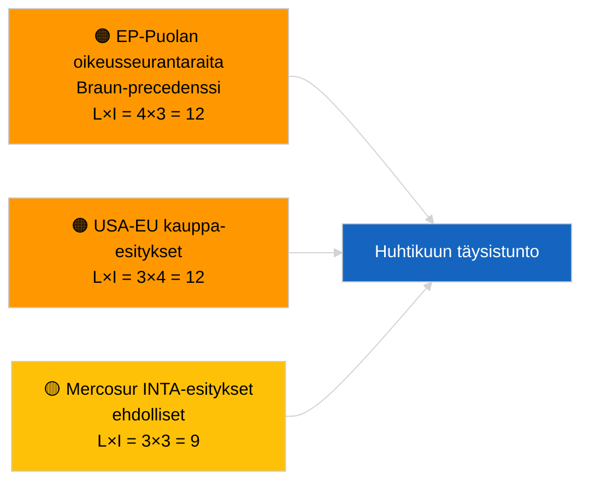
```mermaid
%%{init: {"theme":"dark"}}%%
graph LR
    R1["🟠 EP-Puolan oikeusseurantaraita<br/>Braun-precedenssi<br/>L×I = 4×3 = 12"] --> CONS["Huhtikuun täysistunto"]
    R2["🟠 USA-EU kauppa­esitykset<br/>L×I = 3×4 = 12"] --> CONS
    R3["🟡 Mercosur INTA-esitykset<br/>ehdolliset<br/>L×I = 3×3 = 9"] --> CONS
    style R1 fill:#FF9800,color:#000000
    style R2 fill:#FF9800,color:#000000
    style R3 fill:#FFC107,color:#000000
    style CONS fill:#1565C0,color:#FFFFFF
```

| Riski | L | I | Pisteet | Laukaisin | Lähde | Admiraliteetti |
|-------|:-:|:-:|:-------:|-----------|-------|:--------------:|
| EP-Puolan oikeusseurantaraita | 4 | 3 | 12 | Uusi immuniteettitapaus | TA-10-2026-0088 | A1 |
| USA-EU kauppa­esitykset | 3 | 4 | 12 | USA-toimenpide | TA-10-2026-0096 | A1 |
| Mercosur-esitykset (ehdolliset) | 3 | 3 | 9 | EUT:n lausunto | TA-10-2026-0008 | A2 |

---

### 🔮 Tärkein ennakoiva laukaisin

**Ensimmäinen huhtikuun jättämisaalto n. 17.–20. huhtikuuta 2026.** Aiheiden jakautuminen kalibroi Skenaarion A (kauppa) vs. B (oikeusvaltio) vs. C (talous) Strasbourgin täysistuntoa 27.–30. huhtikuuta varten.

---

### 🛡️ Lähdelaadun arviointi

- **Ensisijaiset lähteet:** EP:n avoin dataporttaali; suoritus `c93513b6-9f22-4b36-a984-d0512328769c`.
- **Luotettavuus:** 🟢 KORKEA kalenterisidonnaisen inaktiivisuuden osalta.

---

### 📎 Linkit

| Linkki | Polku |
|--------|-------|
| Artikkeli | `./article.md` |
| Sisarsuoritukset | `analysis/daily/2026-04-02/breaking/`, `committee-reports/`, `propositions/` |
| Manifesti | `./manifest.json` |

---

**Asiakirjavalvonta**
- **Malli:** `/analysis/templates/executive-brief.md`
- **Artefaktipolku:** `analysis/daily/2026-04-02/motions/executive-brief.md`
- **Luokitus:** Julkinen
- **Retrospektiivinen luonti:** Takautuvantäyttämissessio.

### Executive Brief Fr

### 🎯 BLUF

**Aucune nouvelle proposition de résolution déposée le 2026-04-02 ; 2e semaine sur 4 de la session de vacances parlementaires en cours.** L'exécution `c93513b6-9f22-4b36-a984-d0512328769c` a retourné **0 acteur classifié** et une signification **ROUTINE**, reflétant l'état de modèle vide pour 2026-04-01/propositions. L'activité en phase de proposition est calendairement liée aux jours précédant immédiatement la session plénière ; le premier dépôt d'avril n'est pas attendu avant le 17-20 avril environ. Priorités reportées en avril : suivi des prisonniers politiques géorgiens (TA-10-2026-0083), transposition des crédits d'émission HDV (TA-10-2026-0084), droits de douane américains (TA-10-2026-0096), précédent d'immunité Braun (TA-10-2026-0088), poste de vice-président de la BCE (TA-10-2026-0060). **🟢 HAUTE confiance** — l'état vide est dicté par le calendrier.

---

### 🧭 3 décisions que cette note soutient

| # | Décision | Décideur | Échéance | Preuve |
|:-:|----------|----------|:--------:|--------|
| 1 | **Rédactionnel :** IGNORER les propositions quotidiennes | Rédacteur | +24h | Résultat d'exécution vide |
| 2 | **Surveillance :** signaler la première vague de dépôts d'avril du 17 au 20 avril | Analyste | 2026-04-17 | Schéma de dépôt du PE |
| 3 | **Surveillance prospective :** suivre l'équilibre commerce vs. RoL pour calibrer les scénarios d'avril | Responsable analyse | 2026-04-20 | Scénario A vs. B |

---

### 📰 Lecture en 60 secondes

- 🔴 **Aucune nouvelle proposition déposée** le 2026-04-02 ; période de vacances. (🟢 Élevé)
- 🟠 **0 acteur classifié** lors de l'exécution axée sur les propositions. (🟢 Élevé)
- 🟢 **Les reports de mars** ancrent la liste de surveillance d'avril. (🟢 Élevé)
- 🟡 **Dimensions de risque toutes « aucun »** aujourd'hui. (🟢 Élevé)
- 🔵 **Contexte économique :** droits de douane américains et dossiers BCE dominants. (🟢 Élevé)
- 🟣 **Renvoi croisé :** exécutions sœurs 2026-04-02 modèles vides. (🟢 Élevé)
- 🩷 **Vecteur de perturbation :** aucun aigu aujourd'hui. (🟢 Élevé)
- ⚪ **Report :** l'avis de la Cour de justice sur le Mercosur générera vraisemblablement des propositions.

---

### 🗂️ Documents/procédures de tête — Surveillance des propositions

| Rang | Référence PE | Titre (court) | Signification | Confiance | Statut |
|:----:|--------------|--------------|:-------------:|:---------:|--------|
| 1 | — | Aucune nouvelle proposition le 2026-04-02 | 0,0 | 🟢 ÉLEVÉ | Session de vacances — aucun dépôt |
| 2 | TA-10-2026-0083 | Prisonniers politiques géorgiens (report) | 7,0 | 🟢 ÉLEVÉ | Surveillance de mise en œuvre |
| 3 | TA-10-2026-0096 | Droits de douane américains (report) | 7,0 | 🟢 ÉLEVÉ | Proposition d'avril probable |

---

### ⚠️ Panorama des risques et menaces

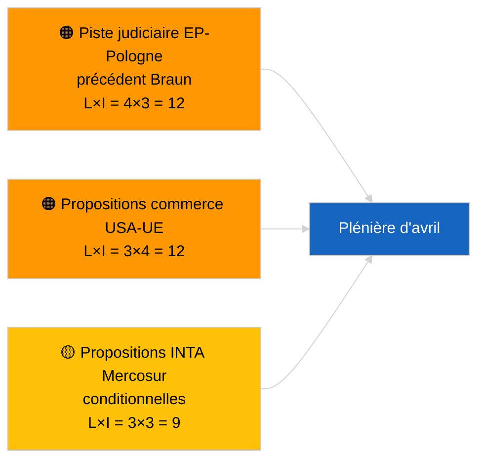
```mermaid
%%{init: {"theme":"dark"}}%%
graph LR
    R1["🟠 Piste judiciaire EP-Pologne<br/>précédent Braun<br/>L×I = 4×3 = 12"] --> CONS["Plénière d'avril"]
    R2["🟠 Propositions commerce USA-UE<br/>L×I = 3×4 = 12"] --> CONS
    R3["🟡 Propositions INTA Mercosur<br/>conditionnelles<br/>L×I = 3×3 = 9"] --> CONS
    style R1 fill:#FF9800,color:#000000
    style R2 fill:#FF9800,color:#000000
    style R3 fill:#FFC107,color:#000000
    style CONS fill:#1565C0,color:#FFFFFF
```

| Risque | L | I | Score | Déclencheur | Source | Amirauté |
|--------|:-:|:-:|:-----:|-------------|--------|:--------:|
| Piste judiciaire EP-Pologne | 4 | 3 | 12 | Nouveau cas d'immunité | TA-10-2026-0088 | A1 |
| Propositions commerce USA-UE | 3 | 4 | 12 | Mesure américaine | TA-10-2026-0096 | A1 |
| Propositions Mercosur (cond.) | 3 | 3 | 9 | Avis CJE | TA-10-2026-0008 | A2 |

---

### 🔮 Principal déclencheur prospectif

**Première vague de dépôts d'avril ~17-20 avril 2026.** La répartition thématique calibre le Scénario A (commerce) vs. B (RoL) vs. C (économique) pour la plénière de Strasbourg du 27 au 30 avril.

---

### 🛡️ Évaluation de la qualité des sources

- **Sources primaires :** portail de données ouvertes du PE ; exécution `c93513b6-9f22-4b36-a984-d0512328769c`.
- **Confiance :** 🟢 ÉLEVÉE pour l'inactivité dictée par le calendrier.

---

### 📎 Liens

| Lien | Chemin |
|------|--------|
| Article | `./article.md` |
| Exécutions sœurs | `analysis/daily/2026-04-02/breaking/`, `committee-reports/`, `propositions/` |
| Manifeste | `./manifest.json` |

---

**Contrôle documentaire**
- **Modèle :** `/analysis/templates/executive-brief.md`
- **Chemin de l'artefact :** `analysis/daily/2026-04-02/motions/executive-brief.md`
- **Classification :** Public
- **Génération rétrospective :** Session de remplissage rétroactif.

### Executive Brief He

**סיווג:** OSINT | רישום פרלמנטרי ציבורי
**אמינות:** 🟢 גבוהה (הערכה מבנית בתקופת הפסקת מושב)
**נוצר:** 2026-04-02T00:00:00Z (דוח רטרוספקטיבי)
**סוג הפריט:** הצעות לאימוץ החלטות
**מזהה ריצה:** `c93513b6-9f22-4b36-a984-d0512328769c`
**מקור:** פורטל הנתונים הפתוח של הפרלמנט האירופי

---

### 🎯 BLUF

**לא הוגשו הצעות להחלטות חדשות ב-2026-04-02; שבוע 2 מתוך 4 של הפסקת המושב הפרלמנטרי נמשך.** ריצה `c93513b6-9f22-4b36-a984-d0512328769c` החזירה **0 שחקנים מסווגים** ומשמעות **שגרתית**, המשקפת את מצב התבנית הריקה עבור 2026-04-01/הצעות. פעילות בשלב ההצעות קשורה לוחית זמנים לימים שקודמים מיידית למליאה; ההגשה הראשונה של אפריל לא צפויה לפני בערך 17-20 באפריל. עדיפויות המועברות לאפריל: מעקב אחר אסירים פוליטיים בגאורגיה (TA-10-2026-0083), תמלול זיכויי פליטת HDV (TA-10-2026-0084), מכסי ארה"ב (TA-10-2026-0096), תקדים חסינות ברואון (TA-10-2026-0088), תפקיד סגן נשיא ה-ECB (TA-10-2026-0060). **🟢 אמינות גבוהה** — המצב הריק מונע על ידי לוח הזמנים.

---

### 🧭 3 החלטות שדוח זה תומך בהן

| # | החלטה | מקבל ההחלטה | מועד אחרון | ראיה |
|:-:|-------|------------|:----------:|------|
| 1 | **מערכתי:** לדלג על הצעות יומיות | עורך | +24ש | תוצאת ריצה ריקה |
| 2 | **ניטור:** לסמן גל ההגשות הראשון של אפריל ב-17-20 באפריל | אנליסט | 2026-04-17 | תבנית הגשה של PE |
| 3 | **ניטור צופה פני עתיד:** לעקוב אחר יחס הצעות מסחר מול שלטון החוק לכיול תרחישי אפריל | ראש ניתוח | 2026-04-20 | תרחיש A מול B |

---

### 📰 קריאה בת 60 שניות

- 🔴 **לא הוגשו הצעות חדשות** ב-2026-04-02; תקופת הפסקה. (🟢 גבוהה)
- 🟠 **0 שחקנים סווגו** בריצה ממוקדת הצעות. (🟢 גבוהה)
- 🟢 **יתרות מרץ** מעגנות את רשימת הניטור של אפריל. (🟢 גבוהה)
- 🟡 **ממדי סיכון כולם "ללא"** היום. (🟢 גבוהה)
- 🔵 **הקשר כלכלי:** מכסי ארה"ב ותיקי ECB דומיננטיים. (🟢 גבוהה)
- 🟣 **הפניה צולבת:** ריצות אחיות 2026-04-02 תבניות ריקות. (🟢 גבוהה)
- 🩷 **וקטור שיבוש:** ללא חריף היום. (🟢 גבוהה)
- ⚪ **העברה קדימה:** חוות דעת ה-ECJ על מרקוסור עשויה ליצור הצעות.

---

### 🗂️ מסמכים/נהלים מובילים — ניטור הצעות

| דירוג | מקור PE | כותרת (קצרה) | חשיבות | אמינות | סטטוס |
|:-----:|---------|-------------|:------:|:------:|-------|
| 1 | — | אין הצעות חדשות ב-2026-04-02 | 0.0 | 🟢 גבוהה | הפסקת מושב — ללא הגשה |
| 2 | TA-10-2026-0083 | אסירים פוליטיים בגאורגיה (מועבר) | 7.0 | 🟢 גבוהה | ניטור יישום |
| 3 | TA-10-2026-0096 | מכסי ארה"ב (מועבר) | 7.0 | 🟢 גבוהה | הצעת אפריל סבירה |

---

### ⚠️ תמונת מצב סיכונים ואיומים

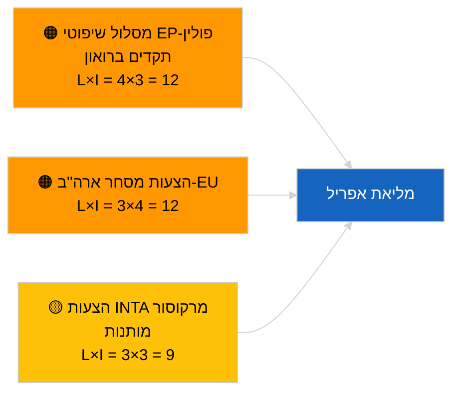
```mermaid
%%{init: {"theme":"dark"}}%%
graph LR
    R1["🟠 מסלול שיפוטי EP-פולין<br/>תקדים ברואון<br/>L×I = 4×3 = 12"] --> CONS["מליאת אפריל"]
    R2["🟠 הצעות מסחר ארה''ב-EU<br/>L×I = 3×4 = 12"] --> CONS
    R3["🟡 הצעות INTA מרקוסור<br/>מותנות<br/>L×I = 3×3 = 9"] --> CONS
    style R1 fill:#FF9800,color:#000000
    style R2 fill:#FF9800,color:#000000
    style R3 fill:#FFC107,color:#000000
    style CONS fill:#1565C0,color:#FFFFFF
```

| סיכון | L | I | ציון | טריגר | מקור | אדמירלות |
|-------|:-:|:-:|:----:|-------|------|:--------:|
| מסלול שיפוטי EP-פולין | 4 | 3 | 12 | מקרה חסינות חדש | TA-10-2026-0088 | A1 |
| הצעות מסחר ארה"ב-EU | 3 | 4 | 12 | פעולה אמריקאית | TA-10-2026-0096 | A1 |
| הצעות מרקוסור (מותנות) | 3 | 3 | 9 | חוות דעת ECJ | TA-10-2026-0008 | A2 |

---

### 🔮 טריגר עתידי מוביל

**גל הגשות אפריל הראשון ~17-20 אפריל 2026.** תמהיל הנושאים מכייל תרחיש A (מסחר) מול B (שלטון החוק) מול C (כלכלי) לקראת מליאת שטרסבורג 27-30 באפריל.

---

### 🛡️ הערכת איכות המקורות

- **מקורות ראשוניים:** פורטל הנתונים הפתוח של ה-EP; ריצה `c93513b6-9f22-4b36-a984-d0512328779c`.
- **אמינות:** 🟢 גבוהה לחוסר פעילות המונע על ידי לוח הזמנים.

---

### 📎 קישורים

| קישור | נתיב |
|-------|------|
| מאמר | `./article.md` |
| ריצות אחיות | `analysis/daily/2026-04-02/breaking/`, `committee-reports/`, `propositions/` |
| מניפסט | `./manifest.json` |

---

**בקרת מסמכים**
- **תבנית:** `/analysis/templates/executive-brief.md`
- **נתיב ארטיפקט:** `analysis/daily/2026-04-02/motions/executive-brief.md`
- **סיווג:** ציבורי
- **יצירה רטרוספקטיבית:** סשן מילוי לאחור.

### Executive Brief Ja

**分類:** OSINT | 公開議会記録
**信頼度:** 🟢 高（会期休会中の構造的評価）
**作成:** 2026-04-02T00:00:00Z（遡及レポート）
**アイテムタイプ:** 決議採択提案
**実行ID:** `c93513b6-9f22-4b36-a984-d0512328769c`
**出典:** 欧州議会オープンデータポータル

---

### 🎯 BLUF

**2026-04-02に新規提案は提出されず。議会休会第2週（全4週）が継続中です。** 実行`c93513b6-9f22-4b36-a984-d0512328769c`は**分類アクター0名**を返し、意味合いは**定常（ルーティン）**と評価されます。これは2026-04-01/propositionsに対する空テンプレートパターンを反映しています。提案段階の活動は本会議直前の日程に連動しており、4月の最初の提出は4月17〜20日頃と予想されます。4月への繰越優先事項：ジョージア政治犯問題（TA-10-2026-0083）、HDV排出クレジット修正（TA-10-2026-0084）、米国関税対応（TA-10-2026-0096）、ブラウン議員免責先例（TA-10-2026-0088）、ECB副総裁ポスト（TA-10-2026-0060）。**🟢 高信頼度** — 空状態はスケジュールに起因します。

---

### 🧭 本ブリーフが支援する3つの意思決定

| # | 決定事項 | 意思決定者 | 期限 | 根拠 |
|:-:|---------|-----------|:----:|------|
| 1 | **定常業務：** 本日の提案モニタリングをスキップ | 編集者 | +24時間 | 実行結果が空 |
| 2 | **モニタリング：** 4月17〜20日の第一次提出ウェーブに注目 | アナリスト | 2026-04-17 | EPの提出パターン |
| 3 | **先行指標監視：** 貿易提案対法の支配提案の比率を追跡し、4月シナリオを較正 | 分析責任者 | 2026-04-20 | シナリオA対B |

---

### 📰 60秒概要

- 🔴 **新規提案なし** 2026-04-02；休会期間中。（🟢 高）
- 🟠 **分類アクター0名** の提案特化実行。（🟢 高）
- 🟢 **3月の繰越分** が4月の監視リストの基礎となる。（🟢 高）
- 🟡 **リスク次元はすべて「なし」** 本日。（🟢 高）
- 🔵 **経済的文脈：** 米国関税とECB案件が支配的。（🟢 高）
- 🟣 **相互参照：** 2026-04-02の姉妹実行も空テンプレート。（🟢 高）
- 🩷 **破壊ベクター：** 本日は緊急ではなし。（🟢 高）
- ⚪ **先行きへの移行：** ECJのメルコスール意見書が提案を生む可能性。

---

### 🗂️ 主要文書/手続き — 提案監視

| 順位 | PE参照 | タイトル（短縮版） | 重要度 | 信頼度 | ステータス |
|:---:|--------|-----------------|:------:|:------:|---------|
| 1 | — | 2026-04-02に新規提案なし | 0.0 | 🟢 高 | 休会中 — 提出なし |
| 2 | TA-10-2026-0083 | ジョージア政治犯（繰越） | 7.0 | 🟢 高 | 実施モニタリング |
| 3 | TA-10-2026-0096 | 米国関税（繰越） | 7.0 | 🟢 高 | 4月提案の可能性 |

---

### ⚠️ リスク・脅威スナップショット

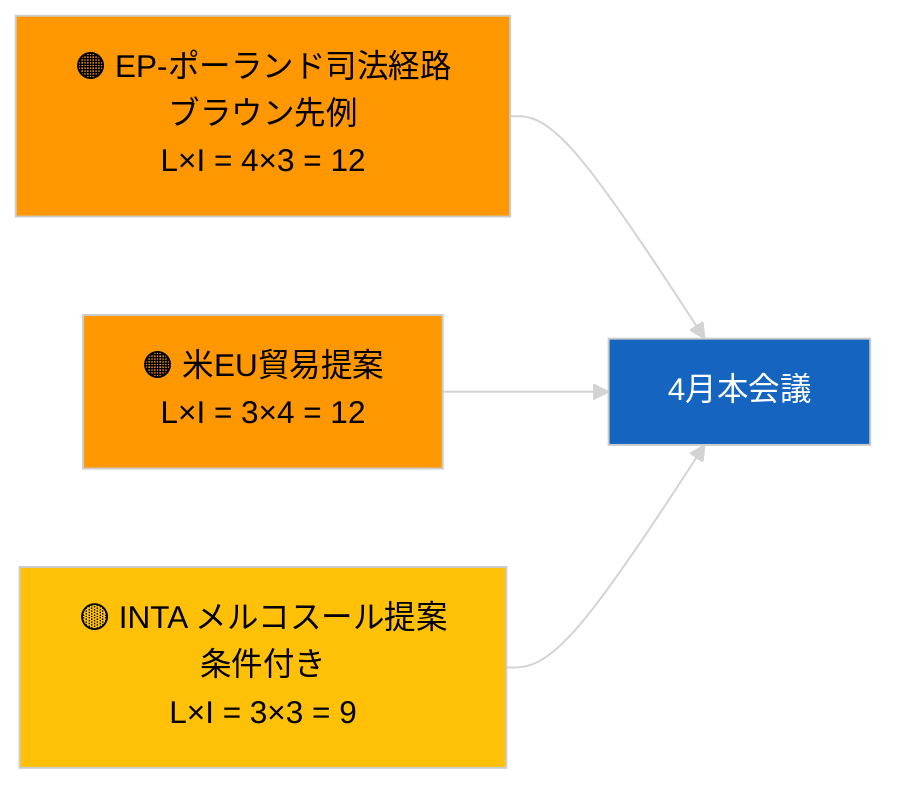
```mermaid
%%{init: {"theme":"dark"}}%%
graph LR
    R1["🟠 EP-ポーランド司法経路<br/>ブラウン先例<br/>L×I = 4×3 = 12"] --> CONS["4月本会議"]
    R2["🟠 米EU貿易提案<br/>L×I = 3×4 = 12"] --> CONS
    R3["🟡 INTA メルコスール提案<br/>条件付き<br/>L×I = 3×3 = 9"] --> CONS
    style R1 fill:#FF9800,color:#000000
    style R2 fill:#FF9800,color:#000000
    style R3 fill:#FFC107,color:#000000
    style CONS fill:#1565C0,color:#FFFFFF
```

| リスク | L | I | スコア | トリガー | 出典 | 提督性 |
|-------|:-:|:-:|:-----:|---------|------|:------:|
| EP-ポーランド司法経路 | 4 | 3 | 12 | 新たな免責訴訟 | TA-10-2026-0088 | A1 |
| 米EU貿易提案 | 3 | 4 | 12 | 米国の行動 | TA-10-2026-0096 | A1 |
| メルコスール提案（条件付き） | 3 | 3 | 9 | ECJ意見書 | TA-10-2026-0008 | A2 |

---

### 🔮 主要先行トリガー

**4月第一次提出ウェーブ ～2026年4月17〜20日。** テーマ構成がシナリオA（貿易）対B（法の支配）対C（経済）を较正し、4月27〜30日のストラスブール本会議に向けた指針を示します。

---

### 🛡️ ソース品質評価

- **一次ソース：** 欧州議会オープンデータポータル；実行`c93513b6-9f22-4b36-a984-d0512328769c`。
- **信頼度：** 🟢 高（スケジュール起因の非活動に対して）。

---

### 📎 リンク

| リンク | パス |
|-------|------|
| 記事 | `./article.md` |
| 姉妹実行 | `analysis/daily/2026-04-02/breaking/`、`committee-reports/`、`propositions/` |
| マニフェスト | `./manifest.json` |

---

**文書管理**
- **テンプレート：** `/analysis/templates/executive-brief.md`
- **アーティファクトパス：** `analysis/daily/2026-04-02/motions/executive-brief.md`
- **分類：** 公開
- **遡及作成：** バックフィルセッション。

### Executive Brief Ko

**분류:** OSINT | 공개 의회 기록
**신뢰도:** 🟢 높음 (회기 휴회 중 구조적 평가)
**작성:** 2026-04-02T00:00:00Z (소급 보고서)
**항목 유형:** 결의안 채택 제안
**실행 ID:** `c93513b6-9f22-4b36-a984-d0512328769c`
**출처:** 유럽의회 공개 데이터 포털

---

### 🎯 BLUF

**2026-04-02에 새로운 제안서 없음; 의회 휴회 4주 중 2주차 진행 중.** 실행 `c93513b6-9f22-4b36-a984-d0512328769c`는 **분류된 행위자 0명**을 반환하며 의미는 **정상(루틴)**으로 평가됩니다. 이는 2026-04-01/제안서의 빈 템플릿 패턴을 반영합니다. 제안 단계 활동은 본회의 직전 일정에 연동되며, 4월 첫 제출은 4월 17~20일경으로 예상됩니다. 4월 이월 우선순위: 조지아 정치범 문제(TA-10-2026-0083), HDV 배출 크레딧 수정(TA-10-2026-0084), 미국 관세 대응(TA-10-2026-0096), 브라운 의원 면책 선례(TA-10-2026-0088), ECB 부총재 직위(TA-10-2026-0060). **🟢 높은 신뢰도** — 빈 상태는 일정에 기인합니다.

---

### 🧭 이 브리핑이 지원하는 3가지 의사결정

| # | 결정 사항 | 의사결정자 | 기한 | 근거 |
|:-:|---------|-----------|:----:|------|
| 1 | **정상 업무:** 오늘 제안 모니터링 건너뜀 | 편집자 | +24시간 | 실행 결과 없음 |
| 2 | **모니터링:** 4월 17~20일 첫 번째 제출 물결 표시 | 분석가 | 2026-04-17 | EP 제출 패턴 |
| 3 | **선행 지표 모니터링:** 무역 제안 대 법치 제안 비율 추적으로 4월 시나리오 보정 | 분석 책임자 | 2026-04-20 | 시나리오 A 대 B |

---

### 📰 60초 요약

- 🔴 **새로운 제안 없음** 2026-04-02; 휴회 기간. (🟢 높음)
- 🟠 **분류된 행위자 0명** 제안 특화 실행. (🟢 높음)
- 🟢 **3월 이월분**이 4월 모니터링 목록의 기반. (🟢 높음)
- 🟡 **리스크 차원 모두 "없음"** 오늘. (🟢 높음)
- 🔵 **경제적 맥락:** 미국 관세와 ECB 사안이 주도적. (🟢 높음)
- 🟣 **교차 참조:** 2026-04-02 자매 실행도 빈 템플릿. (🟢 높음)
- 🩷 **파괴 벡터:** 오늘은 긴급하지 않음. (🟢 높음)
- ⚪ **향후 전환:** ECJ 메르코수르 의견서가 제안서 생성 가능.

---

### 🗂️ 주요 문서/절차 — 제안 모니터링

| 순위 | PE 참조 | 제목 (약식) | 중요도 | 신뢰도 | 상태 |
|:---:|--------|------------|:------:|:------:|------|
| 1 | — | 2026-04-02 새로운 제안 없음 | 0.0 | 🟢 높음 | 휴회 — 제출 없음 |
| 2 | TA-10-2026-0083 | 조지아 정치범 (이월) | 7.0 | 🟢 높음 | 이행 모니터링 |
| 3 | TA-10-2026-0096 | 미국 관세 (이월) | 7.0 | 🟢 높음 | 4월 제안 가능 |

---

### ⚠️ 리스크 및 위협 스냅샷

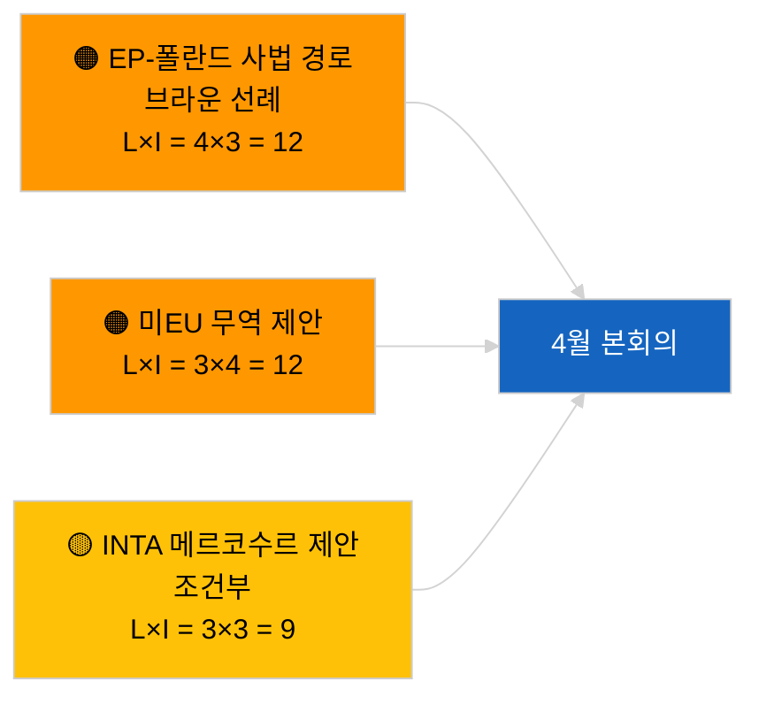
```mermaid
%%{init: {"theme":"dark"}}%%
graph LR
    R1["🟠 EP-폴란드 사법 경로<br/>브라운 선례<br/>L×I = 4×3 = 12"] --> CONS["4월 본회의"]
    R2["🟠 미EU 무역 제안<br/>L×I = 3×4 = 12"] --> CONS
    R3["🟡 INTA 메르코수르 제안<br/>조건부<br/>L×I = 3×3 = 9"] --> CONS
    style R1 fill:#FF9800,color:#000000
    style R2 fill:#FF9800,color:#000000
    style R3 fill:#FFC107,color:#000000
    style CONS fill:#1565C0,color:#FFFFFF
```

| 리스크 | L | I | 점수 | 트리거 | 출처 | 신뢰도 |
|-------|:-:|:-:|:---:|---------|------|:------:|
| EP-폴란드 사법 경로 | 4 | 3 | 12 | 새로운 면책 소송 | TA-10-2026-0088 | A1 |
| 미EU 무역 제안 | 3 | 4 | 12 | 미국 행동 | TA-10-2026-0096 | A1 |
| 메르코수르 제안 (조건부) | 3 | 3 | 9 | ECJ 의견서 | TA-10-2026-0008 | A2 |

---

### 🔮 주요 선행 트리거

**4월 첫 번째 제출 물결 ~2026년 4월 17~20일.** 주제 구성이 시나리오 A(무역) 대 B(법치) 대 C(경제)를 보정하며 4월 27~30일 스트라스부르 본회의를 위한 지침을 제공합니다.

---

### 🛡️ 출처 품질 평가

- **1차 출처:** 유럽의회 공개 데이터 포털; 실행 `c93513b6-9f22-4b36-a984-d0512328769c`.
- **신뢰도:** 🟢 높음 (일정 기인 비활동에 대해).

---

### 📎 링크

| 링크 | 경로 |
|-----|------|
| 기사 | `./article.md` |
| 자매 실행 | `analysis/daily/2026-04-02/breaking/`, `committee-reports/`, `propositions/` |
| 매니페스트 | `./manifest.json` |

---

**문서 관리**
- **템플릿:** `/analysis/templates/executive-brief.md`
- **아티팩트 경로:** `analysis/daily/2026-04-02/motions/executive-brief.md`
- **분류:** 공개
- **소급 작성:** 백필 세션.

### Executive Brief Nl

### 🎯 BLUF

**Op 2026-04-02 zijn geen nieuwe ontwerpresoluties ingediend; week 2 van 4 van de parlementaire recessperiode loopt door.** Uitvoering `c93513b6-9f22-4b36-a984-d0512328769c` leverde **0 geclassificeerde actoren** en **ROUTINE**-significantie op, overeenkomend met de lege sjabloonstatus voor 2026-04-01/moties. Activiteit in de moties-fase is kalendergebonden aan de dagen direct voorafgaand aan de plenaire vergadering; de eerste indiening in april wordt niet verwacht vóór ~17-20 april. Overgedragen prioriteiten voor april: opvolging politieke gevangenen Georgië (TA-10-2026-0083), omzetting HDV-emissiekredieten (TA-10-2026-0084), Amerikaanse douanerechten (TA-10-2026-0096), Braun-immuniteitsprecedent (TA-10-2026-0088), ECB-vicepresidentsfunctie (TA-10-2026-0060). **🟢 HOGE betrouwbaarheid** — de lege status wordt door de kalender bepaald.

---

### 🧭 3 beslissingen die deze rapportage ondersteunt

| # | Beslissing | Beslisser | Termijn | Bewijs |
|:-:|------------|-----------|:-------:|--------|
| 1 | **Redactioneel:** Dagelijkse moties OVERSLAAN | Redacteur | +24u | Leeg uitvoeringsresultaat |
| 2 | **Monitoring:** Eerste april-indiengolf 17-20 april markeren | Analist | 2026-04-17 | EP-indieningspatroon |
| 3 | **Vooruitkijkende monitoring:** Verhouding handel vs. RoL-moties volgen voor april-scenariokalibratie | Analyseleidinggevende | 2026-04-20 | Scenario A vs. B |

---

### 📰 60-secondenlezing

- 🔴 **Geen nieuwe moties ingediend** op 2026-04-02; recessperiode. (🟢 Hoog)
- 🟠 **0 actoren geclassificeerd** in op moties gerichte uitvoering. (🟢 Hoog)
- 🟢 **Overgedragen zaken uit maart** verankeren de april-bewakingslijst. (🟢 Hoog)
- 🟡 **Risicoadimensies allemaal "geen"** vandaag. (🟢 Hoog)
- 🔵 **Economische context:** Amerikaanse douanerechten en ECB-dossiers dominant. (🟢 Hoog)
- 🟣 **Kruisverwijzing:** zuster-uitvoeringen 2026-04-02 lege sjablonen. (🟢 Hoog)
- 🩷 **Verstoringsvector:** vandaag geen acute. (🟢 Hoog)
- ⚪ **Overdracht:** Mercosur HvJ-advies zal waarschijnlijk moties genereren.

---

### 🗂️ Top-documenten/procedures — Moties-monitoring

| Rang | EP-referentie | Titel (kort) | Significantie | Betrouwbaarheid | Status |
|:----:|---------------|-------------|:-------------:|:---------------:|--------|
| 1 | — | Geen nieuwe moties op 2026-04-02 | 0,0 | 🟢 HOOG | Recessperiode — geen indiening |
| 2 | TA-10-2026-0083 | Georgische politieke gevangenen (overgedragen) | 7,0 | 🟢 HOOG | Implementatiemonitoring |
| 3 | TA-10-2026-0096 | Amerikaanse douanerechten (overgedragen) | 7,0 | 🟢 HOOG | April-motie waarschijnlijk |

---

### ⚠️ Risico- en dreigingsoverzicht

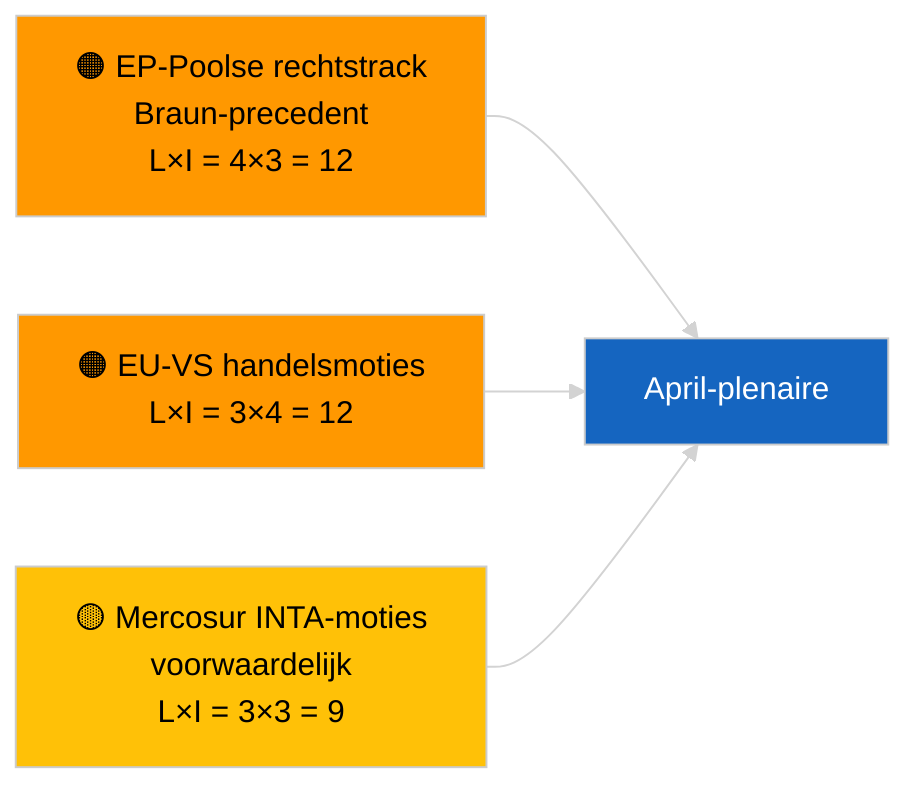
```mermaid
%%{init: {"theme":"dark"}}%%
graph LR
    R1["🟠 EP-Poolse rechtstrack<br/>Braun-precedent<br/>L×I = 4×3 = 12"] --> CONS["April-plenaire"]
    R2["🟠 EU-VS handels­moties<br/>L×I = 3×4 = 12"] --> CONS
    R3["🟡 Mercosur INTA-moties<br/>voorwaardelijk<br/>L×I = 3×3 = 9"] --> CONS
    style R1 fill:#FF9800,color:#000000
    style R2 fill:#FF9800,color:#000000
    style R3 fill:#FFC107,color:#000000
    style CONS fill:#1565C0,color:#FFFFFF
```

| Risico | L | I | Score | Trigger | Bron | Admiraliteit |
|--------|:-:|:-:|:-----:|---------|------|:------------:|
| EP-Poolse rechtstrack | 4 | 3 | 12 | Nieuwe immuniteitszaak | TA-10-2026-0088 | A1 |
| EU-VS handels­moties | 3 | 4 | 12 | VS-maatregel | TA-10-2026-0096 | A1 |
| Mercosur-moties (voorwaardelijk) | 3 | 3 | 9 | HvJ-advies | TA-10-2026-0008 | A2 |

---

### 🔮 Belangrijkste vooruitziende trigger

**Eerste april-indiengolf ~17-20 april 2026.** De themamix kalibreert Scenario A (handel) vs. B (rechtsstaat) vs. C (economisch) voor de Straatsburgse plenaire vergadering van 27-30 april.

---

### 🛡️ Beoordeling van bronkwaliteit

- **Primaire bronnen:** Open dataportaal van het EP; uitvoering `c93513b6-9f22-4b36-a984-d0512328769c`.
- **Betrouwbaarheid:** 🟢 HOOG voor door de kalender bepaalde inactiviteit.

---

### 📎 Links

| Link | Pad |
|------|-----|
| Artikel | `./article.md` |
| Zuster-uitvoeringen | `analysis/daily/2026-04-02/breaking/`, `committee-reports/`, `propositions/` |
| Manifest | `./manifest.json` |

---

**Documentbeheer**
- **Sjabloon:** `/analysis/templates/executive-brief.md`
- **Artefactpad:** `analysis/daily/2026-04-02/motions/executive-brief.md`
- **Classificatie:** Openbaar
- **Retrospectieve generatie:** Terugvullsessie.

### Executive Brief No

### 🎯 BLUF

**Ingen nye resolusjonsforslag levert inn den 2026-04-02; parlamentsrecessens uke 2 av 4 fortsetter.** Kjøring `c93513b6-9f22-4b36-a984-d0512328769c` returnerte **0 klassifiserte aktører** og **RUTINE**-signifikans, noe som speiler den tomme maltilstanden for 2026-04-01/forslag. Aktivitet i forslagsfasen er kalenderbundet til dagene umiddelbart forut for plenumssesjonen; den første april-innsendelsen forventes ikke før ca. 17-20. april. Overførte prioriteringer i april: Oppfølging av politiske fanger i Georgia (TA-10-2026-0083), transponering av HDV-utslippskreditter (TA-10-2026-0084), amerikanske tollsatser (TA-10-2026-0096), Braun-immunitetspresedens (TA-10-2026-0088), ECBs visegeneraldirektørpost (TA-10-2026-0060). **🟢 HØY tillit** — den tomme tilstanden er kalenderbetinget.

---

### 🧭 3 beslutninger dette sammendraget støtter

| # | Beslutning | Beslutningstaker | Frist | Bevis |
|:-:|------------|-----------------|:-----:|-------|
| 1 | **Redaksjonelt:** HOPP OVER daglige resolusjonsforslag | Redaktør | +24t | Tomt kjøringsresultat |
| 2 | **Overvåking:** merk første april-innleveringsbølge 17-20. april | Analytiker | 2026-04-17 | EPs innleveringsmønster |
| 3 | **Fremoverskuende overvåking:** spor handel vs. RoL-forslagsbalanse for aprilscenariekalibrering | Analyseleder | 2026-04-20 | Scenario A vs. B |

---

### 📰 60-sekunders lesing

- 🔴 **Ingen nye resolusjonsforslag levert inn** den 2026-04-02; recessperiode. (🟢 Høy)
- 🟠 **0 aktører klassifisert** i forslagsfokusert kjøring. (🟢 Høy)
- 🟢 **Mars-restanser** forankrer april-overvåkingslisten. (🟢 Høy)
- 🟡 **Risikodimensjoner alle "ingen"** i dag. (🟢 Høy)
- 🔵 **Økonomisk kontekst:** amerikanske tollsatser og ECB-poster dominerer. (🟢 Høy)
- 🟣 **Kryssreferanse:** søskenkjøringer 2026-04-02 tomme maler. (🟢 Høy)
- 🩷 **Forstyrrelsesvektorer:** ingen akutte i dag. (🟢 Høy)
- ⚪ **Fremoverføring:** Mercosur ECJ-uttalelse vil sannsynligvis generere forslag.

---

### 🗂️ Toplistede dokumenter/prosedyrer — Forslagsovervåking

| Rang | EP-referanse | Tittel (kort) | Signifikans | Tillit | Status |
|:----:|--------------|--------------|:-----------:|:------:|--------|
| 1 | — | Ingen nye resolusjonsforslag 2026-04-02 | 0,0 | 🟢 HØY | Recessperiode — ingen innlevering |
| 2 | TA-10-2026-0083 | Georgias politiske fanger (overført) | 7,0 | 🟢 HØY | Implementeringsovervåking |
| 3 | TA-10-2026-0096 | Amerikanske tollsatser (overført) | 7,0 | 🟢 HØY | April-forslag sannsynlig |

---

### ⚠️ Risiko- og trusselbilde

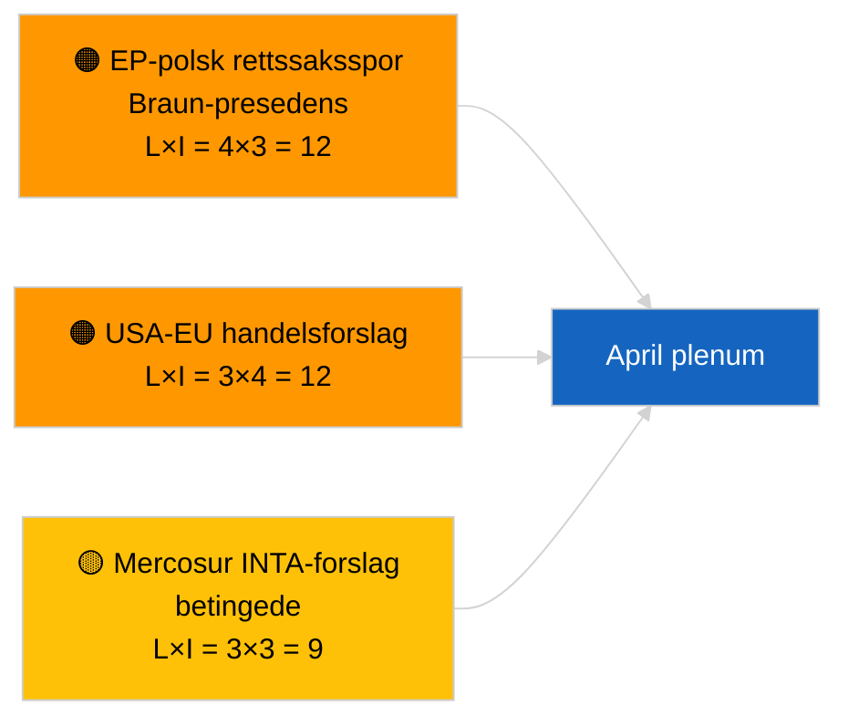
```mermaid
%%{init: {"theme":"dark"}}%%
graph LR
    R1["🟠 EP-polsk rettssaksspor<br/>Braun-presedens<br/>L×I = 4×3 = 12"] --> CONS["April plenum"]
    R2["🟠 USA-EU handels­forslag<br/>L×I = 3×4 = 12"] --> CONS
    R3["🟡 Mercosur INTA-forslag<br/>betingede<br/>L×I = 3×3 = 9"] --> CONS
    style R1 fill:#FF9800,color:#000000
    style R2 fill:#FF9800,color:#000000
    style R3 fill:#FFC107,color:#000000
    style CONS fill:#1565C0,color:#FFFFFF
```

| Risiko | L | I | Score | Utløser | Kilde | Admiralitet |
|--------|:-:|:-:|:-----:|---------|-------|:-----------:|
| EP-polsk rettssaksspor | 4 | 3 | 12 | Ny immunitetsak | TA-10-2026-0088 | A1 |
| USA-EU handels­forslag | 3 | 4 | 12 | USA-tiltak | TA-10-2026-0096 | A1 |
| Mercosur-forslag (betingede) | 3 | 3 | 9 | ECJ-uttalelse | TA-10-2026-0008 | A2 |

---

### 🔮 Viktigste fremoverskuende utløser

**Første april-innleveringsbølge ~17-20. april 2026.** Temafordelingen kalibrerer Scenario A (handel) vs. B (RoL) vs. C (økonomi) foran Strasbourg-plenumsesjonen 27-30. april.

---

### 🛡️ Vurdering av kildekvalitet

- **Primære kilder:** EPs åpne dataportal; kjøring `c93513b6-9f22-4b36-a984-d0512328769c`.
- **Tillit:** 🟢 HØY for kalenderdrevet inaktivitet.

---

### 📎 Lenker

| Lenke | Sti |
|-------|-----|
| Artikkel | `./article.md` |
| Søskenkjøringer | `analysis/daily/2026-04-02/breaking/`, `committee-reports/`, `propositions/` |
| Manifest | `./manifest.json` |

---

**Dokumentkontroll**
- **Mal:** `/analysis/templates/executive-brief.md`
- **Artefaktsti:** `analysis/daily/2026-04-02/motions/executive-brief.md`
- **Klassifisering:** Offentlig
- **Retrospektiv generering:** Tilbakefyllingssesjon.

### Executive Brief Sv

### 🎯 BLUF

**Inga nya resolutionsförslag inlämnade den 2026-04-02; riksdagsrecessens vecka 2 av 4 fortsätter.** Körning `c93513b6-9f22-4b36-a984-d0512328769c` returnerade **0 klassificerade aktörer** och **RUTIN**-signifikans, vilket speglar det tomma malltillståndet för 2026-04-01/motioner. Aktivitet i motionsfasen är kalenterbunden till dagarna omedelbart före plenarsessionen; den första april-inlämningen förväntas inte förrän cirka 17-20 april. Överförda prioriteringar i april: Uppföljning av politiska fångar i Georgien (TA-10-2026-0083), transponering av HDV-utsläppskrediter (TA-10-2026-0084), amerikanska tullar (TA-10-2026-0096), Braun-immunitetspreceens (TA-10-2026-0088), ECB:s vice ordförandeärende (TA-10-2026-0060). **🟢 HÖG konfidens** — det tomma tillståndet är kalenderbetyingat.

---

### 🧭 3 beslut som detta underlag stödjer

| # | Beslut | Beslutsfattare | Deadline | Bevis |
|:-:|--------|----------------|:--------:|-------|
| 1 | **Redaktionellt:** HOPPA ÖVER dagliga motioner | Redaktör | +24h | Tomt körningsresultat |
| 2 | **Bevakning:** flagga den första inlämningsvågen i april 17-20 april | Analytiker | 2026-04-17 | EP:s inlämningsmönster |
| 3 | **Framåtblickande bevakning:** spåra balansen handel vs RoL-motioner för aprilscenariokalibrering | Analysledning | 2026-04-20 | Scenario A vs B |

---

### 📰 60-sekunders läsning

- 🔴 **Inga nya motioner inlämnade** den 2026-04-02; recessperiod. (🟢 Hög)
- 🟠 **0 aktörer klassificerade** i motionsfokuserad körning. (🟢 Hög)
- 🟢 **Marsobligatorier** förankrar april-bevakningslistan. (🟢 Hög)
- 🟡 **Riskdimensioner samtliga "inga"** idag. (🟢 Hög)
- 🔵 **Ekonomisk kontext:** amerikanska tullar och ECB-ärenden dominerande. (🟢 Hög)
- 🟣 **Korsreferens:** syskondatum 2026-04-02 körningar tomma mallar. (🟢 Hög)
- 🩷 **Störningsvektorer:** inga akuta idag. (🟢 Hög)
- ⚪ **Framåtförande:** Mercosur ECJ-yttrande kommer sannolikt att generera motion(er).

---

### 🗂️ Topplistade dokument/procedurer — Motionsbevakning

| Rang | EP-referens | Titel (kort) | Signifikans | Konfidens | Status |
|:----:|-------------|--------------|:-----------:|:---------:|--------|
| 1 | — | Inga nya motioner 2026-04-02 | 0,0 | 🟢 HÖG | Recessperiod — ingen inlämning |
| 2 | TA-10-2026-0083 | Georgiens politiska fångar (överförd) | 7,0 | 🟢 HÖG | Implementeringsbevakning |
| 3 | TA-10-2026-0096 | Amerikanska tullar (överförd) | 7,0 | 🟢 HÖG | April-motion sannolik |

---

### ⚠️ Risk- och hotöversikt

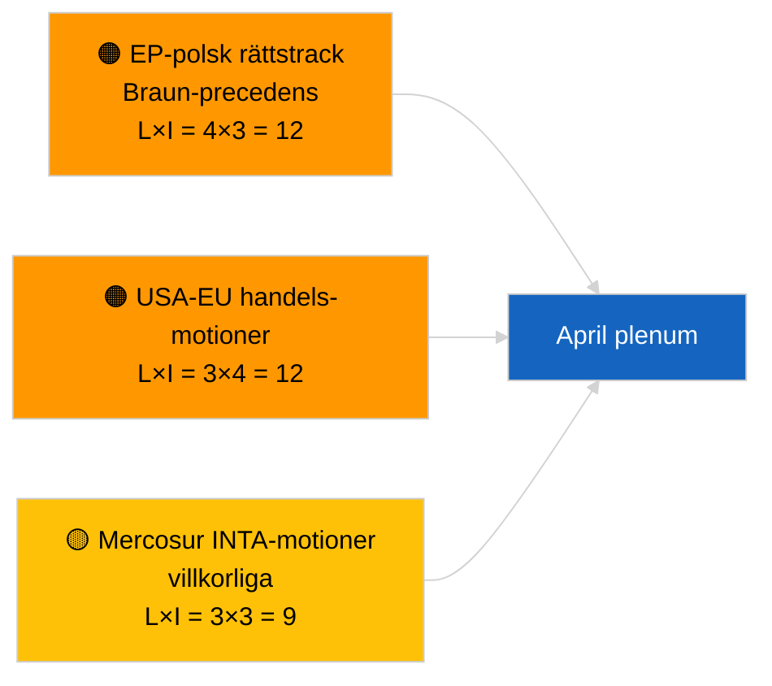
```mermaid
%%{init: {"theme":"dark"}}%%
graph LR
    R1["🟠 EP-polsk rättstrack<br/>Braun-precedens<br/>L×I = 4×3 = 12"] --> CONS["April plenum"]
    R2["🟠 USA-EU handels­motioner<br/>L×I = 3×4 = 12"] --> CONS
    R3["🟡 Mercosur INTA-motioner<br/>villkorliga<br/>L×I = 3×3 = 9"] --> CONS
    style R1 fill:#FF9800,color:#000000
    style R2 fill:#FF9800,color:#000000
    style R3 fill:#FFC107,color:#000000
    style CONS fill:#1565C0,color:#FFFFFF
```

| Risk | L | I | Poäng | Utlösare | Källa | Admiralitet |
|------|:-:|:-:|:-----:|----------|-------|:-----------:|
| EP-polsk rättstrack | 4 | 3 | 12 | Nytt immunitetsärende | TA-10-2026-0088 | A1 |
| USA-EU handels­motioner | 3 | 4 | 12 | USA-åtgärd | TA-10-2026-0096 | A1 |
| Mercosur-motioner (villkorliga) | 3 | 3 | 9 | ECJ-yttrande | TA-10-2026-0008 | A2 |

---

### 🔮 Viktigaste framåtutlösaren

**Första april-inlämningsvågen ~17-20 april 2026.** Ämnesmixen kalibrerar Scenario A (handel) vs B (RoL) vs C (ekonomi) inför Strasbourgplenaren 27-30 april.

---

### 🛡️ Bedömning av källkvalitet

- **Primärkällor:** EP:s öppna dataportal; körning `c93513b6-9f22-4b36-a984-d0512328769c`.
- **Konfidens:** 🟢 HÖG avseende kalenderdriven inaktivitet.

---

### 📎 Länkar

| Länk | Sökväg |
|------|--------|
| Artikel | `./article.md` |
| Syskonkörningar | `analysis/daily/2026-04-02/breaking/`, `committee-reports/`, `propositions/` |
| Manifest | `./manifest.json` |

---

**Dokumentkontroll**
- **Mall:** `/analysis/templates/executive-brief.md`
- **Artefaktsökväg:** `analysis/daily/2026-04-02/motions/executive-brief.md`
- **Klassificering:** Offentlig
- **Retrospektiv generering:** Bakåtfyllningssession.

### Executive Brief Zh

**分类：** OSINT | 公开议会记录
**可信度：** 🟢 高（议会休会期间的结构性评估）
**创建：** 2026-04-02T00:00:00Z（追溯报告）
**项目类型：** 决议采纳提案
**运行ID：** `c93513b6-9f22-4b36-a984-d0512328769c`
**来源：** 欧洲议会开放数据门户

---

### 🎯 BLUF

**2026-04-02无新提案提交；议会休会第2周（共4周）持续进行中。** 运行`c93513b6-9f22-4b36-a984-d0512328769c`返回**0名已分类行为者**，意义评估为**常规（例行）**，反映了2026-04-01/提案的空模板模式。提案阶段活动与紧邻全体会议前的日程挂钩，4月首批提交预计约在4月17至20日。4月延续优先事项：格鲁吉亚政治犯问题（TA-10-2026-0083）、HDV排放积分修正（TA-10-2026-0084）、美国关税应对（TA-10-2026-0096）、布朗议员豁免先例（TA-10-2026-0088）、ECB副行长职位（TA-10-2026-0060）。**🟢 高可信度** — 空状态源于日程安排。

---

### 🧭 本简报支持的3项决策

| # | 决策事项 | 决策者 | 截止日期 | 依据 |
|:-:|---------|--------|:--------:|------|
| 1 | **常规业务：** 跳过今日提案监控 | 编辑 | +24小时 | 运行结果为空 |
| 2 | **监控：** 标记4月17至20日首批提交浪潮 | 分析师 | 2026-04-17 | EP提交模式 |
| 3 | **领先指标监控：** 追踪贸易提案与法治提案比率以校准4月情景 | 分析主管 | 2026-04-20 | 情景A对比B |

---

### 📰 60秒速读

- 🔴 **无新提案** 2026-04-02；休会期间。（🟢 高）
- 🟠 **0名已分类行为者** 提案专项运行。（🟢 高）
- 🟢 **3月延续事项**构成4月监控清单基础。（🟢 高）
- 🟡 **风险维度均为"无"** 今日。（🟢 高）
- 🔵 **经济背景：** 美国关税与ECB案件主导。（🟢 高）
- 🟣 **交叉参考：** 2026-04-02姊妹运行也为空模板。（🟢 高）
- 🩷 **破坏向量：** 今日无紧迫性。（🟢 高）
- ⚪ **前瞻过渡：** ECJ的南方共同市场意见书可能产生提案。

---

### 🗂️ 主要文件/程序 — 提案监控

| 排名 | PE参考 | 标题（简短） | 重要性 | 可信度 | 状态 |
|:---:|--------|------------|:------:|:------:|------|
| 1 | — | 2026-04-02无新提案 | 0.0 | 🟢 高 | 休会 — 无提交 |
| 2 | TA-10-2026-0083 | 格鲁吉亚政治犯（延续） | 7.0 | 🟢 高 | 执行监控 |
| 3 | TA-10-2026-0096 | 美国关税（延续） | 7.0 | 🟢 高 | 4月提案可能 |

---

### ⚠️ 风险与威胁快照

```mermaid
%%{init: {"theme":"dark"}}%%
graph LR
    R1["🟠 EP-波兰司法路径<br/>布朗先例<br/>L×I = 4×3 = 12"] --> CONS["4月全体会议"]
    R2["🟠 美欧贸易提案<br/>L×I = 3×4 = 12"] --> CONS
    R3["🟡 INTA南方共同市场提案<br/>条件性<br/>L×I = 3×3 = 9"] --> CONS
    style R1 fill:#FF9800,color:#000000
    style R2 fill:#FF9800,color:#000000
    style R3 fill:#FFC107,color:#000000
    style CONS fill:#1565C0,color:#FFFFFF
```

| 风险 | L | I | 得分 | 触发因素 | 来源 | 海军准将性 |
|-----|:-:|:-:|:---:|---------|------|:--------:|
| EP-波兰司法路径 | 4 | 3 | 12 | 新豁免诉讼 | TA-10-2026-0088 | A1 |
| 美欧贸易提案 | 3 | 4 | 12 | 美国行动 | TA-10-2026-0096 | A1 |
| 南方共同市场提案（条件性） | 3 | 3 | 9 | ECJ意见书 | TA-10-2026-0008 | A2 |

---

### 🔮 主要前瞻触发器

**4月首批提交浪潮 ~2026年4月17至20日。** 主题构成校准情景A（贸易）对B（法治）对C（经济），为4月27至30日斯特拉斯堡全体会议提供方向性指引。

---

### 🛡️ 来源质量评估

- **一级来源：** 欧洲议会开放数据门户；运行`c93513b6-9f22-4b36-a984-d0512328769c`。
- **可信度：** 🟢 高（针对日程驱动的非活动状态）。

---

### 📎 链接

| 链接 | 路径 |
|-----|------|
| 文章 | `./article.md` |
| 姊妹运行 | `analysis/daily/2026-04-02/breaking/`、`committee-reports/`、`propositions/` |
| 清单 | `./manifest.json` |

---

**文件管理**
- **模板：** `/analysis/templates/executive-brief.md`
- **构件路径：** `analysis/daily/2026-04-02/motions/executive-brief.md`
- **分类：** 公开
- **追溯创建：** 回填会话。

### Coalition Analysis

### Overview
Analysis of political group cohesion and coalition dynamics.

### Coalition Metrics
- **Overall Stability**: 0.0%
- **Forecast**: volatile
- **Patterns Analysed**: 0

### Group Analysis
- **Stable Groups**: No stable groups identified
- **Declining Groups**: No declining groups identified

### Coalition Intelligence
- **Patterns Evaluated**: 0

### Date: 2026-04-02

### Stakeholder Analysis

### Data Available for Stakeholder Assessment
| Stakeholder Group | Primary Data Sources | Data Points |
|-------------------|---------------------|-------------|
| Political Groups | Procedures, Adopted Texts, Voting Records, Coalitions | 242 |
| Civil Society | Documents, Questions, Events | 0 |
| Industry | Procedures, Adopted Texts | 242 |
| National Governments | Adopted Texts, Procedures, Coalitions | 242 |
| Citizens | Questions, MEP Updates, Events | 737 |
| EU Institutions | Events, Procedures, Adopted Texts, Voting Records | 242 |

### Data Source Summary
| Source | Count |
|--------|-------|
| patterns | 0 |
| votingRecords | 0 |
| events | 0 |
| documents | 0 |
| adoptedTexts | 242 |
| procedures | 0 |
| mepUpdates | 737 |
| plenaryDocuments | 0 |
| committeeDocuments | 0 |
| plenarySessionDocuments | 0 |
| externalDocuments | 30 |
| questions | 0 |
| declarations | 498 |
| corporateBodies | 0 |

### Date: 2026-04-02

> **Provenance & Audit**
>
> - **Article type:** `motions`
> - **Run date:** 2026-04-02
> - **Run id:** `c93513b6-9f22-4b36-a984-d0512328769c`
> - **Gate result:** `PENDING`
> - **Analysis tree:** [analysis/daily/2026-04-02/motions](https://github.com/Hack23/euparliamentmonitor/tree/main/analysis/daily/2026-04-02/motions)
> - **Manifest:** [manifest.json](https://github.com/Hack23/euparliamentmonitor/blob/main/analysis/daily/2026-04-02/motions/manifest.json)

<h2 id="aggregator-tradecraft-references">Tradecraft References</h2>

This article is produced under the [Hack23 AB](https://hack23.com) intelligence tradecraft library. Every methodology and artifact template applied to this run is linked below.

### Artifact templates

- [README](https://github.com/Hack23/euparliamentmonitor/blob/main/analysis/templates/README.md)
- [Actor Mapping](https://github.com/Hack23/euparliamentmonitor/blob/main/analysis/templates/actor-mapping.md)
- [Actor Threat Profiles](https://github.com/Hack23/euparliamentmonitor/blob/main/analysis/templates/actor-threat-profiles.md)
- [Analysis Index](https://github.com/Hack23/euparliamentmonitor/blob/main/analysis/templates/analysis-index.md)
- [Coalition Dynamics](https://github.com/Hack23/euparliamentmonitor/blob/main/analysis/templates/coalition-dynamics.md)
- [Coalition Mathematics](https://github.com/Hack23/euparliamentmonitor/blob/main/analysis/templates/coalition-mathematics.md)
- [Commission Wp Alignment](https://github.com/Hack23/euparliamentmonitor/blob/main/analysis/templates/commission-wp-alignment.md)
- [Comparative International](https://github.com/Hack23/euparliamentmonitor/blob/main/analysis/templates/comparative-international.md)
- [Consequence Trees](https://github.com/Hack23/euparliamentmonitor/blob/main/analysis/templates/consequence-trees.md)
- [Cross Reference Map](https://github.com/Hack23/euparliamentmonitor/blob/main/analysis/templates/cross-reference-map.md)
- [Cross Run Diff](https://github.com/Hack23/euparliamentmonitor/blob/main/analysis/templates/cross-run-diff.md)
- [Cross Session Intelligence](https://github.com/Hack23/euparliamentmonitor/blob/main/analysis/templates/cross-session-intelligence.md)
- [Data Availability Assessment](https://github.com/Hack23/euparliamentmonitor/blob/main/analysis/templates/data-availability-assessment.md)
- [Data Download Manifest](https://github.com/Hack23/euparliamentmonitor/blob/main/analysis/templates/data-download-manifest.md)
- [Deep Analysis](https://github.com/Hack23/euparliamentmonitor/blob/main/analysis/templates/deep-analysis.md)
- [Devils Advocate Analysis](https://github.com/Hack23/euparliamentmonitor/blob/main/analysis/templates/devils-advocate-analysis.md)
- [Economic Context](https://github.com/Hack23/euparliamentmonitor/blob/main/analysis/templates/economic-context.md)
- [Executive Brief](https://github.com/Hack23/euparliamentmonitor/blob/main/analysis/templates/executive-brief.md)
- [Forces Analysis](https://github.com/Hack23/euparliamentmonitor/blob/main/analysis/templates/forces-analysis.md)
- [Forward Indicators](https://github.com/Hack23/euparliamentmonitor/blob/main/analysis/templates/forward-indicators.md)
- [Forward Projection](https://github.com/Hack23/euparliamentmonitor/blob/main/analysis/templates/forward-projection.md)
- [Historical Baseline](https://github.com/Hack23/euparliamentmonitor/blob/main/analysis/templates/historical-baseline.md)
- [Historical Parallels](https://github.com/Hack23/euparliamentmonitor/blob/main/analysis/templates/historical-parallels.md)
- [Imf Vintage Audit](https://github.com/Hack23/euparliamentmonitor/blob/main/analysis/templates/imf-vintage-audit.md)
- [Impact Matrix](https://github.com/Hack23/euparliamentmonitor/blob/main/analysis/templates/impact-matrix.md)
- [Implementation Feasibility](https://github.com/Hack23/euparliamentmonitor/blob/main/analysis/templates/implementation-feasibility.md)
- [Intelligence Assessment](https://github.com/Hack23/euparliamentmonitor/blob/main/analysis/templates/intelligence-assessment.md)
- [Legislative Disruption](https://github.com/Hack23/euparliamentmonitor/blob/main/analysis/templates/legislative-disruption.md)
- [Legislative Pipeline Forecast](https://github.com/Hack23/euparliamentmonitor/blob/main/analysis/templates/legislative-pipeline-forecast.md)
- [Legislative Velocity Risk](https://github.com/Hack23/euparliamentmonitor/blob/main/analysis/templates/legislative-velocity-risk.md)
- [Mandate Fulfilment Scorecard](https://github.com/Hack23/euparliamentmonitor/blob/main/analysis/templates/mandate-fulfilment-scorecard.md)
- [Mcp Reliability Audit](https://github.com/Hack23/euparliamentmonitor/blob/main/analysis/templates/mcp-reliability-audit.md)
- [Media Framing Analysis](https://github.com/Hack23/euparliamentmonitor/blob/main/analysis/templates/media-framing-analysis.md)
- [Methodology Reflection](https://github.com/Hack23/euparliamentmonitor/blob/main/analysis/templates/methodology-reflection.md)
- [Parliamentary Calendar Projection](https://github.com/Hack23/euparliamentmonitor/blob/main/analysis/templates/parliamentary-calendar-projection.md)
- [Per File Political Intelligence](https://github.com/Hack23/euparliamentmonitor/blob/main/analysis/templates/per-file-political-intelligence.md)
- [Pestle Analysis](https://github.com/Hack23/euparliamentmonitor/blob/main/analysis/templates/pestle-analysis.md)
- [Political Capital Risk](https://github.com/Hack23/euparliamentmonitor/blob/main/analysis/templates/political-capital-risk.md)
- [Political Classification](https://github.com/Hack23/euparliamentmonitor/blob/main/analysis/templates/political-classification.md)
- [Political Threat Landscape](https://github.com/Hack23/euparliamentmonitor/blob/main/analysis/templates/political-threat-landscape.md)
- [Presidency Trio Context](https://github.com/Hack23/euparliamentmonitor/blob/main/analysis/templates/presidency-trio-context.md)
- [Quantitative Swot](https://github.com/Hack23/euparliamentmonitor/blob/main/analysis/templates/quantitative-swot.md)
- [Reference Analysis Quality](https://github.com/Hack23/euparliamentmonitor/blob/main/analysis/templates/reference-analysis-quality.md)
- [Risk Assessment](https://github.com/Hack23/euparliamentmonitor/blob/main/analysis/templates/risk-assessment.md)
- [Risk Matrix](https://github.com/Hack23/euparliamentmonitor/blob/main/analysis/templates/risk-matrix.md)
- [Scenario Forecast](https://github.com/Hack23/euparliamentmonitor/blob/main/analysis/templates/scenario-forecast.md)
- [Seat Projection](https://github.com/Hack23/euparliamentmonitor/blob/main/analysis/templates/seat-projection.md)
- [Session Baseline](https://github.com/Hack23/euparliamentmonitor/blob/main/analysis/templates/session-baseline.md)
- [Significance Classification](https://github.com/Hack23/euparliamentmonitor/blob/main/analysis/templates/significance-classification.md)
- [Significance Scoring](https://github.com/Hack23/euparliamentmonitor/blob/main/analysis/templates/significance-scoring.md)
- [Stakeholder Impact](https://github.com/Hack23/euparliamentmonitor/blob/main/analysis/templates/stakeholder-impact.md)
- [Stakeholder Map](https://github.com/Hack23/euparliamentmonitor/blob/main/analysis/templates/stakeholder-map.md)
- [Swot Analysis](https://github.com/Hack23/euparliamentmonitor/blob/main/analysis/templates/swot-analysis.md)
- [Synthesis Summary](https://github.com/Hack23/euparliamentmonitor/blob/main/analysis/templates/synthesis-summary.md)
- [Term Arc](https://github.com/Hack23/euparliamentmonitor/blob/main/analysis/templates/term-arc.md)
- [Threat Analysis](https://github.com/Hack23/euparliamentmonitor/blob/main/analysis/templates/threat-analysis.md)
- [Threat Model](https://github.com/Hack23/euparliamentmonitor/blob/main/analysis/templates/threat-model.md)
- [Voter Segmentation](https://github.com/Hack23/euparliamentmonitor/blob/main/analysis/templates/voter-segmentation.md)
- [Voting Patterns](https://github.com/Hack23/euparliamentmonitor/blob/main/analysis/templates/voting-patterns.md)
- [Wildcards Blackswans](https://github.com/Hack23/euparliamentmonitor/blob/main/analysis/templates/wildcards-blackswans.md)
- [Workflow Audit](https://github.com/Hack23/euparliamentmonitor/blob/main/analysis/templates/workflow-audit.md)

### Methodologies

- [README](https://github.com/Hack23/euparliamentmonitor/blob/main/analysis/methodologies/README.md)
- [Ai Driven Analysis Guide](https://github.com/Hack23/euparliamentmonitor/blob/main/analysis/methodologies/ai-driven-analysis-guide.md)
- [Analytical Supplementary Methodology](https://github.com/Hack23/euparliamentmonitor/blob/main/analysis/methodologies/analytical-supplementary-methodology.md)
- [Artifact Catalog](https://github.com/Hack23/euparliamentmonitor/blob/main/analysis/methodologies/artifact-catalog.md)
- [Confidence Calibration](https://github.com/Hack23/euparliamentmonitor/blob/main/analysis/methodologies/confidence-calibration.md)
- [Electoral Cycle Methodology](https://github.com/Hack23/euparliamentmonitor/blob/main/analysis/methodologies/electoral-cycle-methodology.md)
- [Electoral Domain Methodology](https://github.com/Hack23/euparliamentmonitor/blob/main/analysis/methodologies/electoral-domain-methodology.md)
- [Forward Projection Methodology](https://github.com/Hack23/euparliamentmonitor/blob/main/analysis/methodologies/forward-projection-methodology.md)
- [Imf Indicator Mapping](https://github.com/Hack23/euparliamentmonitor/blob/main/analysis/methodologies/imf-indicator-mapping.md)
- [Osint Tradecraft Standards](https://github.com/Hack23/euparliamentmonitor/blob/main/analysis/methodologies/osint-tradecraft-standards.md)
- [Per Artifact Methodologies](https://github.com/Hack23/euparliamentmonitor/blob/main/analysis/methodologies/per-artifact-methodologies.md)
- [Per Document Methodology](https://github.com/Hack23/euparliamentmonitor/blob/main/analysis/methodologies/per-document-methodology.md)
- [Political Classification Guide](https://github.com/Hack23/euparliamentmonitor/blob/main/analysis/methodologies/political-classification-guide.md)
- [Political Risk Methodology](https://github.com/Hack23/euparliamentmonitor/blob/main/analysis/methodologies/political-risk-methodology.md)
- [Political Style Guide](https://github.com/Hack23/euparliamentmonitor/blob/main/analysis/methodologies/political-style-guide.md)
- [Political Swot Framework](https://github.com/Hack23/euparliamentmonitor/blob/main/analysis/methodologies/political-swot-framework.md)
- [Political Threat Framework](https://github.com/Hack23/euparliamentmonitor/blob/main/analysis/methodologies/political-threat-framework.md)
- [Seo Headers Policy](https://github.com/Hack23/euparliamentmonitor/blob/main/analysis/methodologies/seo-headers-policy.md)
- [Source Triangulation](https://github.com/Hack23/euparliamentmonitor/blob/main/analysis/methodologies/source-triangulation.md)
- [Strategic Extensions Methodology](https://github.com/Hack23/euparliamentmonitor/blob/main/analysis/methodologies/strategic-extensions-methodology.md)
- [Structural Metadata Methodology](https://github.com/Hack23/euparliamentmonitor/blob/main/analysis/methodologies/structural-metadata-methodology.md)
- [Synthesis Methodology](https://github.com/Hack23/euparliamentmonitor/blob/main/analysis/methodologies/synthesis-methodology.md)
- [Voter Segmentation Methodology](https://github.com/Hack23/euparliamentmonitor/blob/main/analysis/methodologies/voter-segmentation-methodology.md)
- [Worldbank Indicator Mapping](https://github.com/Hack23/euparliamentmonitor/blob/main/analysis/methodologies/worldbank-indicator-mapping.md)

<h2 id="aggregator-analysis-index">Analysis Index</h2>

Every artifact below was read by the aggregator and contributed to this article. The raw [manifest.json](https://github.com/Hack23/euparliamentmonitor/blob/main/analysis/daily/2026-04-02/motions/manifest.json) carries the full machine-readable list, including gate-result history.

| Section | Artifact | Path |
|---|---|---|
| section-executive-brief | [executive-brief](https://github.com/Hack23/euparliamentmonitor/blob/main/analysis/daily/2026-04-02/motions/executive-brief.md) | `executive-brief.md` |
| section-actors-forces | [actor-mapping](https://github.com/Hack23/euparliamentmonitor/blob/main/analysis/daily/2026-04-02/motions/classification/actor-mapping.md) | `classification/actor-mapping.md` |
| section-actors-forces | [forces-analysis](https://github.com/Hack23/euparliamentmonitor/blob/main/analysis/daily/2026-04-02/motions/classification/forces-analysis.md) | `classification/forces-analysis.md` |
| section-actors-forces | [impact-matrix](https://github.com/Hack23/euparliamentmonitor/blob/main/analysis/daily/2026-04-02/motions/classification/impact-matrix.md) | `classification/impact-matrix.md` |
| section-actors-forces | [significance-assessment](https://github.com/Hack23/euparliamentmonitor/blob/main/analysis/daily/2026-04-02/motions/classification/significance-assessment.md) | `classification/significance-assessment.md` |
| section-coalitions-voting | [voting-patterns](https://github.com/Hack23/euparliamentmonitor/blob/main/analysis/daily/2026-04-02/motions/existing/voting-patterns.md) | `existing/voting-patterns.md` |
| section-risk | [risk-matrix](https://github.com/Hack23/euparliamentmonitor/blob/main/analysis/daily/2026-04-02/motions/risk-scoring/risk-matrix.md) | `risk-scoring/risk-matrix.md` |
| section-risk | [quantitative-swot](https://github.com/Hack23/euparliamentmonitor/blob/main/analysis/daily/2026-04-02/motions/risk-scoring/quantitative-swot.md) | `risk-scoring/quantitative-swot.md` |
| section-risk | [political-capital-risk](https://github.com/Hack23/euparliamentmonitor/blob/main/analysis/daily/2026-04-02/motions/risk-scoring/political-capital-risk.md) | `risk-scoring/political-capital-risk.md` |
| section-risk | [legislative-velocity-risk](https://github.com/Hack23/euparliamentmonitor/blob/main/analysis/daily/2026-04-02/motions/risk-scoring/legislative-velocity-risk.md) | `risk-scoring/legislative-velocity-risk.md` |
| section-risk | [agent-risk-workflow](https://github.com/Hack23/euparliamentmonitor/blob/main/analysis/daily/2026-04-02/motions/risk-scoring/agent-risk-workflow.md) | `risk-scoring/agent-risk-workflow.md` |
| section-threat | [actor-threat-profiles](https://github.com/Hack23/euparliamentmonitor/blob/main/analysis/daily/2026-04-02/motions/threat-assessment/actor-threat-profiles.md) | `threat-assessment/actor-threat-profiles.md` |
| section-threat | [consequence-trees](https://github.com/Hack23/euparliamentmonitor/blob/main/analysis/daily/2026-04-02/motions/threat-assessment/consequence-trees.md) | `threat-assessment/consequence-trees.md` |
| section-threat | [legislative-disruption](https://github.com/Hack23/euparliamentmonitor/blob/main/analysis/daily/2026-04-02/motions/threat-assessment/legislative-disruption.md) | `threat-assessment/legislative-disruption.md` |
| section-threat | [political-threat-landscape](https://github.com/Hack23/euparliamentmonitor/blob/main/analysis/daily/2026-04-02/motions/threat-assessment/political-threat-landscape.md) | `threat-assessment/political-threat-landscape.md` |
| section-continuity | [cross-session-intelligence](https://github.com/Hack23/euparliamentmonitor/blob/main/analysis/daily/2026-04-02/motions/existing/cross-session-intelligence.md) | `existing/cross-session-intelligence.md` |
| section-deep-analysis | [deep-analysis](https://github.com/Hack23/euparliamentmonitor/blob/main/analysis/daily/2026-04-02/motions/existing/deep-analysis.md) | `existing/deep-analysis.md` |
| section-supplementary-intelligence | [executive-brief_ar](https://github.com/Hack23/euparliamentmonitor/blob/main/analysis/daily/2026-04-02/motions/executive-brief_ar.md) | `executive-brief_ar.md` |
| section-supplementary-intelligence | [executive-brief_da](https://github.com/Hack23/euparliamentmonitor/blob/main/analysis/daily/2026-04-02/motions/executive-brief_da.md) | `executive-brief_da.md` |
| section-supplementary-intelligence | [executive-brief_de](https://github.com/Hack23/euparliamentmonitor/blob/main/analysis/daily/2026-04-02/motions/executive-brief_de.md) | `executive-brief_de.md` |
| section-supplementary-intelligence | [executive-brief_es](https://github.com/Hack23/euparliamentmonitor/blob/main/analysis/daily/2026-04-02/motions/executive-brief_es.md) | `executive-brief_es.md` |
| section-supplementary-intelligence | [executive-brief_fi](https://github.com/Hack23/euparliamentmonitor/blob/main/analysis/daily/2026-04-02/motions/executive-brief_fi.md) | `executive-brief_fi.md` |
| section-supplementary-intelligence | [executive-brief_fr](https://github.com/Hack23/euparliamentmonitor/blob/main/analysis/daily/2026-04-02/motions/executive-brief_fr.md) | `executive-brief_fr.md` |
| section-supplementary-intelligence | [executive-brief_he](https://github.com/Hack23/euparliamentmonitor/blob/main/analysis/daily/2026-04-02/motions/executive-brief_he.md) | `executive-brief_he.md` |
| section-supplementary-intelligence | [executive-brief_ja](https://github.com/Hack23/euparliamentmonitor/blob/main/analysis/daily/2026-04-02/motions/executive-brief_ja.md) | `executive-brief_ja.md` |
| section-supplementary-intelligence | [executive-brief_ko](https://github.com/Hack23/euparliamentmonitor/blob/main/analysis/daily/2026-04-02/motions/executive-brief_ko.md) | `executive-brief_ko.md` |
| section-supplementary-intelligence | [executive-brief_nl](https://github.com/Hack23/euparliamentmonitor/blob/main/analysis/daily/2026-04-02/motions/executive-brief_nl.md) | `executive-brief_nl.md` |
| section-supplementary-intelligence | [executive-brief_no](https://github.com/Hack23/euparliamentmonitor/blob/main/analysis/daily/2026-04-02/motions/executive-brief_no.md) | `executive-brief_no.md` |
| section-supplementary-intelligence | [executive-brief_sv](https://github.com/Hack23/euparliamentmonitor/blob/main/analysis/daily/2026-04-02/motions/executive-brief_sv.md) | `executive-brief_sv.md` |
| section-supplementary-intelligence | [executive-brief_zh](https://github.com/Hack23/euparliamentmonitor/blob/main/analysis/daily/2026-04-02/motions/executive-brief_zh.md) | `executive-brief_zh.md` |
| section-supplementary-intelligence | [coalition-analysis](https://github.com/Hack23/euparliamentmonitor/blob/main/analysis/daily/2026-04-02/motions/existing/coalition-analysis.md) | `existing/coalition-analysis.md` |
| section-supplementary-intelligence | [stakeholder-analysis](https://github.com/Hack23/euparliamentmonitor/blob/main/analysis/daily/2026-04-02/motions/existing/stakeholder-analysis.md) | `existing/stakeholder-analysis.md` |

