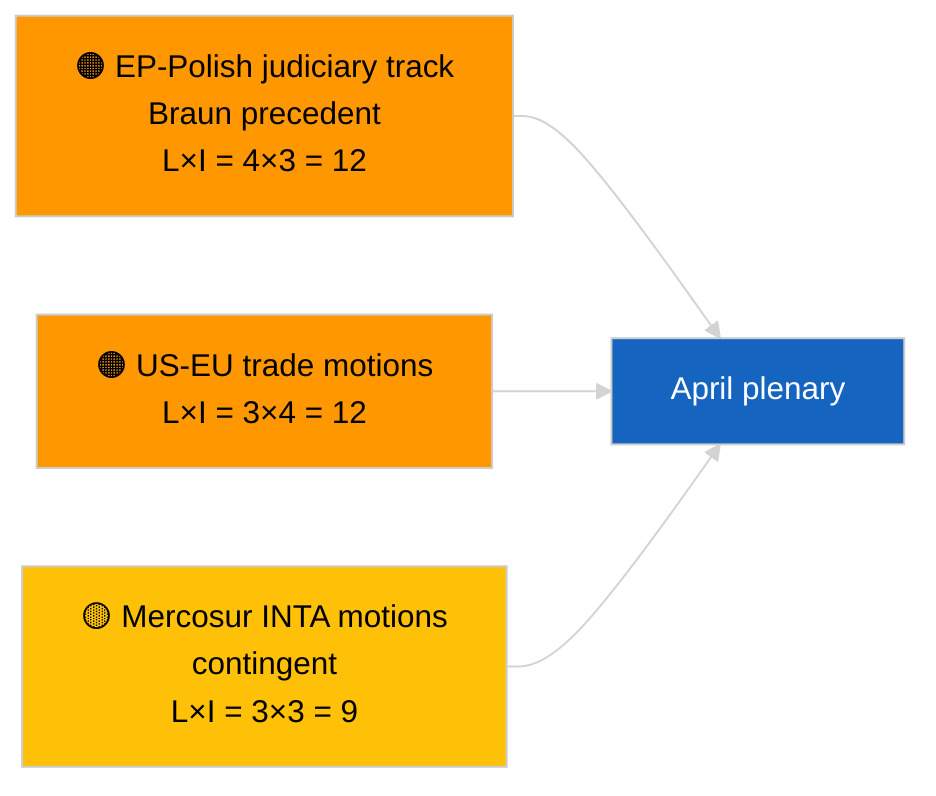

<!-- SPDX-FileCopyrightText: 2026 Hack23 AB -->
<!-- SPDX-License-Identifier: Apache-2.0 -->

# Executive Brief — Motions | 2026-04-02

**Classification:** OSINT | Public Parliamentary Record
**Confidence:** 🟢 High (recess-period structural assessment)
**Generated:** 2026-04-02T00:00:00Z (retrospective brief)
**Article Type:** Motions
**Run ID:** `c93513b6-9f22-4b36-a984-d0512328769c`
**Source:** European Parliament Open Data Portal

---

## 🎯 BLUF

**No new motions for a resolution tabled on 2026-04-02; recess week 2 of 4 continues.** Run `c93513b6-9f22-4b36-a984-d0512328769c` returned **0 classified actors** and **ROUTINE** significance, mirroring the 2026-04-01/motions empty-template state. Motions-stage activity is calendar-bound to the days immediately preceding plenary; first April tabling not expected before ~17-20 April. Carry-over priorities entering April: Georgia political-prisoners follow-up (TA-10-2026-0083), HDV emission-credits transposition (TA-10-2026-0084), US customs tariff (TA-10-2026-0096), Braun immunity precedent (TA-10-2026-0088), ECB Vice-President file (TA-10-2026-0060). **🟢 HIGH confidence** empty state is calendar-driven.

---

## 🧭 3 Decisions This Brief Supports

| # | Decision | Who Decides | Deadline | Evidence |
|:-:|----------|-------------|:--------:|----------|
| 1 | **Editorial:** SKIP motions daily | Editor | +24h | Empty run output |
| 2 | **Monitoring:** flag first April motion-tabling wave 17-20 April | Analyst | 2026-04-17 | EP tabling pattern |
| 3 | **Forward-watch:** track trade-heavy vs RoL motion mix for April scenario calibration | Analysis lead | 2026-04-20 | Scenario A vs B |

---

## 📰 60-Second Read

- 🔴 **No new motions tabled** on 2026-04-02; recess. (🟢 High)
- 🟠 **0 actors classified** in motions-focused run. (🟢 High)
- 🟢 **March carry-over motions inventory** anchors the April watch list. (🟢 High)
- 🟡 **Risk dimensions all "none"** today. (🟢 High)
- 🔵 **Economic context:** US tariff and ECB files dominant. (🟢 High)
- 🟣 **Cross-reference:** sibling 2026-04-02 runs empty-template. (🟢 High)
- 🩷 **Disruption vector:** none acute today. (🟢 High)
- ⚪ **Carry-forward:** Mercosur ECJ opinion will likely spawn motion(s).

---

## 🗂️ Top Documents / Procedures — Motions Watch

| Rank | EP reference | Title (short) | Significance | Confidence | Status |
|:----:|--------------|---------------|:------------:|:----------:|--------|
| 1 | — | No new motions on 2026-04-02 | 0.0 | 🟢 HIGH | Recess — no tabling |
| 2 | TA-10-2026-0083 | Georgia political prisoners (carry-over) | 7.0 | 🟢 HIGH | Implementation watch |
| 3 | TA-10-2026-0096 | US customs tariff (carry-over) | 7.0 | 🟢 HIGH | April motion likely |

---

## ⚠️ Risk & Threat Snapshot

| Risk | L | I | Score | Trigger | Source | Admiralty |
|------|:-:|:-:|:-----:|---------|--------|:---------:|
| EP-Polish judiciary motion track | 4 | 3 | 12 | New immunity case | TA-10-2026-0088 | A1 |
| US-EU trade motions | 3 | 4 | 12 | US action | TA-10-2026-0096 | A1 |
| Mercosur motions (contingent) | 3 | 3 | 9 | ECJ opinion | TA-10-2026-0008 | A2 |

---

## 🔮 Top Forward Trigger

**First April motion-tabling wave ~17-20 April 2026.** Topic mix calibrates Scenario A (trade) vs B (RoL) vs C (economic) for the 27-30 April Strasbourg plenary.

---

## 🛡️ Source Quality Assessment

- **Primary sources:** EP Open Data Portal; run `c93513b6-9f22-4b36-a984-d0512328769c`.
- **Confidence:** 🟢 HIGH on calendar-driven inactivity.

---

## 📎 Links

| Link | Path |
|------|------|
| Article | `./article.md` |
| Sibling runs | `analysis/daily/2026-04-02/breaking/`, `committee-reports/`, `propositions/` |
| Manifest | `./manifest.json` |

---

**Document Control**
- **Template:** `/analysis/templates/executive-brief.md`
- **Artifact path:** `analysis/daily/2026-04-02/motions/executive-brief.md`
- **Classification:** Public
- **Retrospective generation:** Back-fill session.
