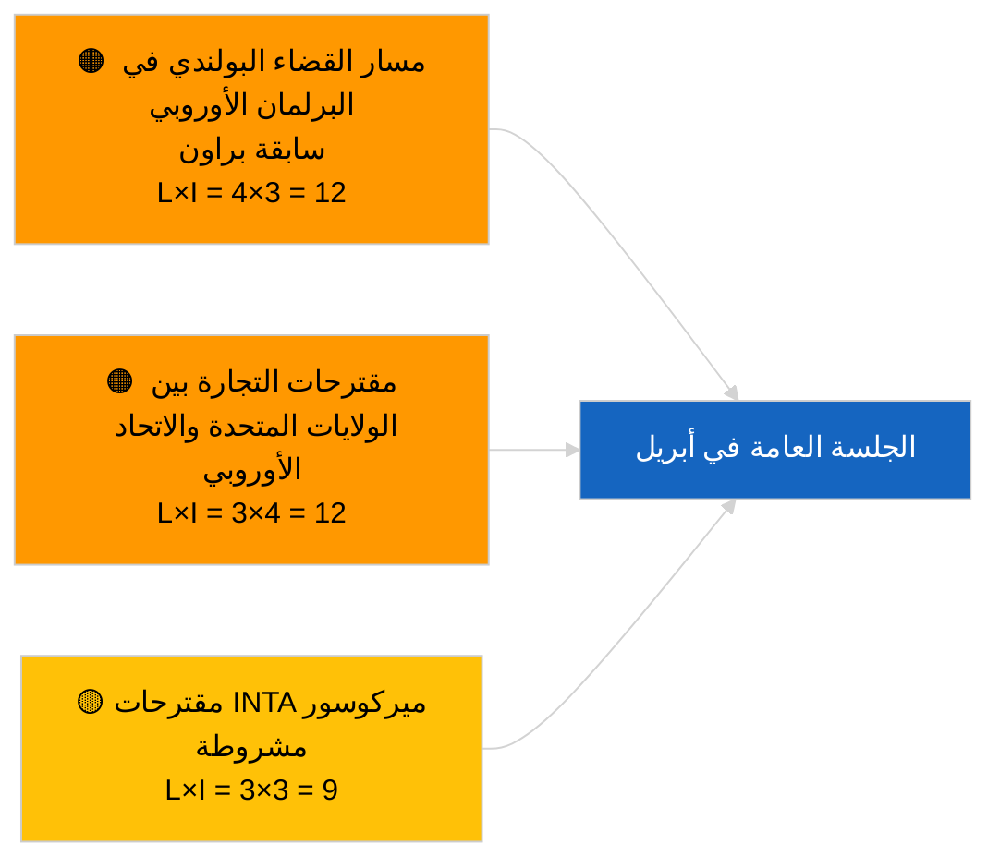

<!-- SPDX-FileCopyrightText: 2026 Hack23 AB -->
<!-- SPDX-License-Identifier: Apache-2.0 -->

# الملخص التنفيذي — مقترحات القرارات | 2026-04-02

**التصنيف:** OSINT | سجل برلماني عام
**مستوى الثقة:** 🟢 عالٍ (تقييم هيكلي خلال فترة التوقف البرلماني)
**تاريخ الإنشاء:** 2026-04-02T00:00:00Z (ملخص استرجاعي)
**نوع المقال:** مقترحات قرارات
**معرّف التشغيل:** `c93513b6-9f22-4b36-a984-d0512328769c`
**المصدر:** بوابة البيانات المفتوحة للبرلمان الأوروبي

---

## 🎯 BLUF

**لم تُقدَّم أي مقترحات قرارات جديدة في 2026-04-02؛ الأسبوع الثاني من أصل 4 من فترة التوقف البرلماني لا يزال مستمراً.** أسفرت عملية التشغيل `c93513b6-9f22-4b36-a984-d0512328769c` عن **0 من الجهات الفاعلة المصنّفة** وأهمية **روتينية**، مما يعكس حالة القالب الفارغ لـ 2026-04-01/المقترحات. يرتبط نشاط مرحلة المقترحات بالتقويم الزمني للأيام التي تسبق مباشرةً الجلسة العامة؛ ولا يُتوقع أول تقديم في أبريل قبل حوالي 17-20 أبريل. الأولويات المُرحَّلة إلى أبريل: متابعة المعتقلين السياسيين في جورجيا (TA-10-2026-0083)، نقل اعتمادات انبعاثات HDV (TA-10-2026-0084)، رسوم جمركية أمريكية (TA-10-2026-0096)، سابقة حصانة براون (TA-10-2026-0088)، منصب نائب رئيس البنك المركزي الأوروبي (TA-10-2026-0060). **🟢 ثقة عالية** — الحالة الفارغة مدفوعة بالتقويم الزمني.

---

## 🧭 3 قرارات يدعمها هذا الملخص

| # | القرار | متخذ القرار | الموعد النهائي | الدليل |
|:-:|--------|------------|:--------------:|--------|
| 1 | **تحريري:** تخطّي مقترحات القرارات اليومية | المحرر | +24 ساعة | نتيجة تشغيل فارغة |
| 2 | **مراقبة:** الإشارة إلى الموجة الأولى من تقديمات أبريل في الفترة 17-20 أبريل | المحلل | 2026-04-17 | نمط تقديم البرلمان الأوروبي |
| 3 | **مراقبة استشرافية:** تتبّع توازن مقترحات التجارة مقابل سيادة القانون لمعايرة سيناريوهات أبريل | قيادة التحليل | 2026-04-20 | السيناريو A مقابل B |

---

## 📰 قراءة 60 ثانية

- 🔴 **لم تُقدَّم مقترحات قرارات جديدة** في 2026-04-02؛ فترة توقف. (🟢 عالٍ)
- 🟠 **0 جهة فاعلة مصنّفة** في عملية التشغيل المركّزة على المقترحات. (🟢 عالٍ)
- 🟢 **الملفات المُرحَّلة من مارس** ترسّخ قائمة المراقبة في أبريل. (🟢 عالٍ)
- 🟡 **أبعاد المخاطر كلها "لا شيء"** اليوم. (🟢 عالٍ)
- 🔵 **السياق الاقتصادي:** الرسوم الجمركية الأمريكية وملفات البنك المركزي الأوروبي مهيمنة. (🟢 عالٍ)
- 🟣 **مرجع متقاطع:** عمليات التشغيل الشقيقة 2026-04-02 قوالب فارغة. (🟢 عالٍ)
- 🩷 **متجه التعطيل:** لا شيء حاد اليوم. (🟢 عالٍ)
- ⚪ **ترحيل:** رأي محكمة العدل الأوروبية بشأن ميركوسور سيُولّد على الأرجح مقترحات.

---

## 🗂️ أبرز الوثائق/الإجراءات — مراقبة المقترحات

| الترتيب | مرجع البرلمان الأوروبي | العنوان (مختصر) | الأهمية | الثقة | الوضع |
|:-------:|----------------------|----------------|:-------:|:-----:|-------|
| 1 | — | لا توجد مقترحات جديدة في 2026-04-02 | 0.0 | 🟢 عالٍ | توقف — لا تقديم |
| 2 | TA-10-2026-0083 | المعتقلون السياسيون في جورجيا (مُرحَّل) | 7.0 | 🟢 عالٍ | مراقبة التنفيذ |
| 3 | TA-10-2026-0096 | الرسوم الجمركية الأمريكية (مُرحَّل) | 7.0 | 🟢 عالٍ | مقترح أبريل محتمل |

---

## ⚠️ لقطة المخاطر والتهديدات

| المخاطرة | L | I | الدرجة | المحفّز | المصدر | الأدميرالية |
|----------|:-:|:-:|:------:|---------|--------|:----------:|
| مسار القضاء البولندي | 4 | 3 | 12 | قضية حصانة جديدة | TA-10-2026-0088 | A1 |
| مقترحات التجارة بين الولايات المتحدة والاتحاد الأوروبي | 3 | 4 | 12 | إجراء أمريكي | TA-10-2026-0096 | A1 |
| مقترحات ميركوسور (مشروطة) | 3 | 3 | 9 | رأي محكمة العدل الأوروبية | TA-10-2026-0008 | A2 |

---

## 🔮 أهم محفّز استشرافي

**الموجة الأولى من تقديمات أبريل في الفترة 17-20 أبريل 2026.** يُعاير مزيج الموضوعات السيناريو A (التجارة) مقابل B (سيادة القانون) مقابل C (الاقتصاد) استعداداً للجلسة العامة في ستراسبورغ في الفترة 27-30 أبريل.

---

## 🛡️ تقييم جودة المصادر

- **المصادر الأولية:** بوابة البيانات المفتوحة للبرلمان الأوروبي؛ التشغيل `c93513b6-9f22-4b36-a984-d0512328769c`.
- **الثقة:** 🟢 عالية لحالة عدم النشاط المدفوعة بالتقويم.

---

## 📎 روابط

| الرابط | المسار |
|--------|--------|
| المقال | `./article.md` |
| عمليات التشغيل الشقيقة | `analysis/daily/2026-04-02/breaking/`, `committee-reports/`, `propositions/` |
| البيان الوصفي | `./manifest.json` |

---

**ضبط الوثيقة**
- **القالب:** `/analysis/templates/executive-brief.md`
- **مسار الأرتيفاكت:** `analysis/daily/2026-04-02/motions/executive-brief.md`
- **التصنيف:** عام
- **الإنشاء الاسترجاعي:** جلسة ملء بأثر رجعي.
