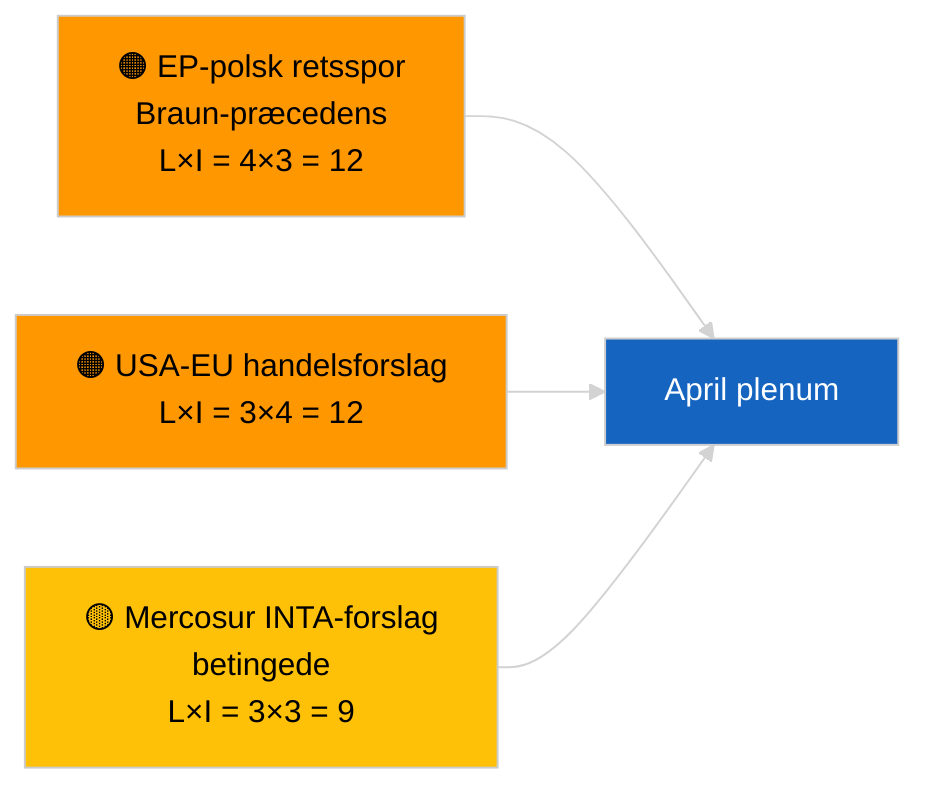

<!-- SPDX-FileCopyrightText: 2026 Hack23 AB -->
<!-- SPDX-License-Identifier: Apache-2.0 -->

# Ledelsesbriefing — Beslutningsforslag | 2026-04-02

**Klassifikation:** OSINT | Offentlig parlamentarisk registrering
**Tillid:** 🟢 Høj (strukturel vurdering under recessperiode)
**Genereret:** 2026-04-02T00:00:00Z (retrospektiv briefing)
**Artikeltype:** Beslutningsforslag
**Kørsels-ID:** `c93513b6-9f22-4b36-a984-d0512328769c`
**Kilde:** Europa-Parlamentets åbne dataportal

---

## 🎯 BLUF

**Ingen nye beslutningsforslag indgivet den 2026-04-02; parlamentsrecessens uge 2 af 4 fortsætter.** Kørsel `c93513b6-9f22-4b36-a984-d0512328769c` returnerede **0 klassificerede aktører** og **RUTINE**-signifikans, hvilket afspejler den tomme skabelontilstand for 2026-04-01/beslutningsforslag. Aktivitet i forslagsfasen er kalenterbundet til dagene umiddelbart forud for plenarsamlingen; den første april-indgivelse forventes ikke før ca. 17-20 april. Overførte prioriteter i april: Opfølgning på politiske fanger i Georgien (TA-10-2026-0083), transponering af HDV-emissionskreditter (TA-10-2026-0084), amerikanske told (TA-10-2026-0096), Braun-immunitetspræcedens (TA-10-2026-0088), ECB's næstformandspost (TA-10-2026-0060). **🟢 HØJ tillid** — den tomme tilstand er kalenterbetinget.

---

## 🧭 3 beslutninger denne briefing understøtter

| # | Beslutning | Beslutningstager | Frist | Bevis |
|:-:|------------|-----------------|:-----:|-------|
| 1 | **Redaktionelt:** SPRING daglige beslutningsforslag over | Redaktør | +24t | Tomt kørselsresultat |
| 2 | **Overvågning:** markér første april-indgivelsesbølge 17-20 april | Analytiker | 2026-04-17 | EP's indgivelsesmønster |
| 3 | **Fremadrettet overvågning:** spor handel vs. RoL-forslagsbalance for aprilscenariekalibrering | Analyseleder | 2026-04-20 | Scenario A vs. B |

---

## 📰 60-sekunders læsning

- 🔴 **Ingen nye beslutningsforslag indgivet** den 2026-04-02; recessperiode. (🟢 Høj)
- 🟠 **0 aktører klassificeret** i forslagsfokuseret kørsel. (🟢 Høj)
- 🟢 **Marts-restancer** forankrer april-overvågningslisten. (🟢 Høj)
- 🟡 **Risikodimensioner alle "ingen"** i dag. (🟢 Høj)
- 🔵 **Økonomisk kontekst:** amerikanske told og ECB-poster dominerer. (🟢 Høj)
- 🟣 **Krydsreference:** søskendeløb 2026-04-02 tomme skabeloner. (🟢 Høj)
- 🩷 **Forstyrrelsesvektor:** ingen akut i dag. (🟢 Høj)
- ⚪ **Videreførelse:** Mercosur ECJ-udtalelse vil sandsynligvis generere forslag.

---

## 🗂️ Toplistede dokumenter/procedurer — Forslagsovervågning

| Rang | EP-reference | Titel (kort) | Signifikans | Tillid | Status |
|:----:|--------------|-------------|:-----------:|:------:|--------|
| 1 | — | Ingen nye beslutningsforslag 2026-04-02 | 0,0 | 🟢 HØJ | Recessperiode — ingen indgivelse |
| 2 | TA-10-2026-0083 | Georgiens politiske fanger (overført) | 7,0 | 🟢 HØJ | Implementeringsovervågning |
| 3 | TA-10-2026-0096 | Amerikanske told (overført) | 7,0 | 🟢 HØJ | April-forslag sandsynligt |

---

## ⚠️ Risiko- og trusselsøjebliksbillede

| Risiko | L | I | Score | Udløser | Kilde | Admiralitet |
|--------|:-:|:-:|:-----:|---------|-------|:-----------:|
| EP-polsk retsspor | 4 | 3 | 12 | Ny immunitetsag | TA-10-2026-0088 | A1 |
| USA-EU handels­forslag | 3 | 4 | 12 | USA-foranstaltning | TA-10-2026-0096 | A1 |
| Mercosur-forslag (betingede) | 3 | 3 | 9 | ECJ-udtalelse | TA-10-2026-0008 | A2 |

---

## 🔮 Vigtigste fremadrettede udløser

**Første april-indgivelsesbølge ~17-20 april 2026.** Emnefordelingen kalibrerer Scenario A (handel) vs. B (RoL) vs. C (økonomi) forud for Strasbourg-plenarsessionen 27-30 april.

---

## 🛡️ Vurdering af kildekvalitet

- **Primære kilder:** EP's åbne dataportal; kørsel `c93513b6-9f22-4b36-a984-d0512328769c`.
- **Tillid:** 🟢 HØJ for kalenterdrevet inaktivitet.

---

## 📎 Links

| Link | Sti |
|------|-----|
| Artikel | `./article.md` |
| Søskendeløb | `analysis/daily/2026-04-02/breaking/`, `committee-reports/`, `propositions/` |
| Manifest | `./manifest.json` |

---

**Dokumentkontrol**
- **Skabelon:** `/analysis/templates/executive-brief.md`
- **Artefaktsti:** `analysis/daily/2026-04-02/motions/executive-brief.md`
- **Klassifikation:** Offentlig
- **Retrospektiv generering:** Tilbagedateringssession.
