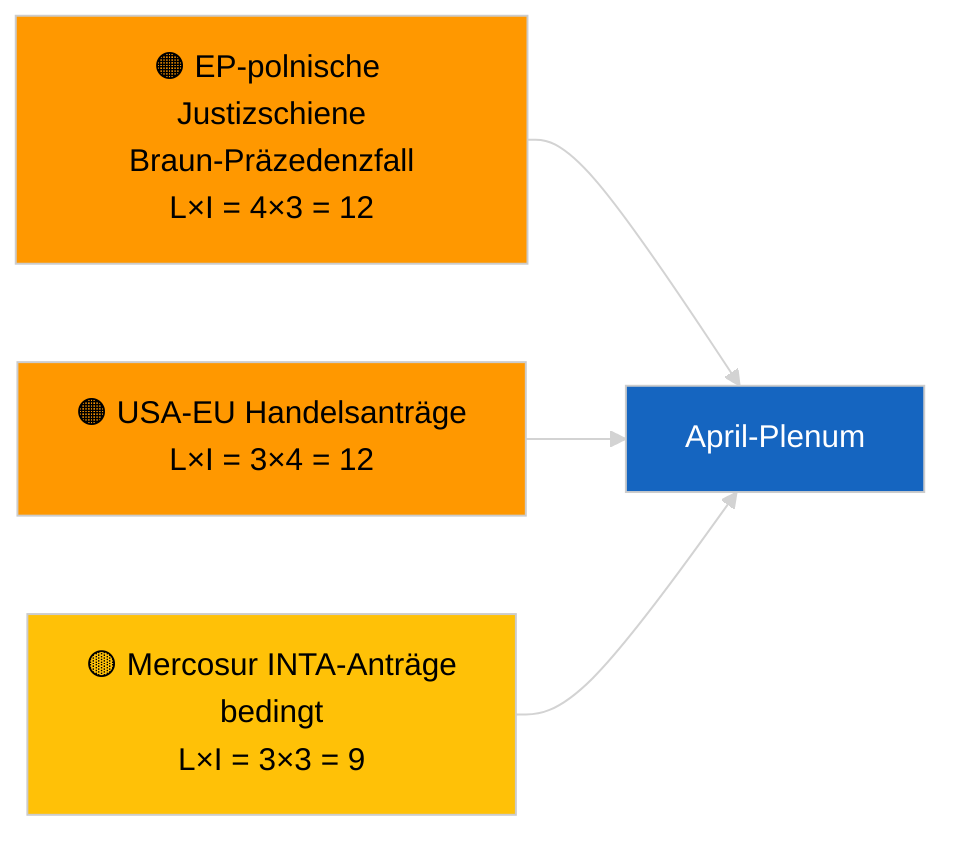

<!-- SPDX-FileCopyrightText: 2026 Hack23 AB -->
<!-- SPDX-License-Identifier: Apache-2.0 -->

# Kurzinformation für die Führungsebene — Entschließungsanträge | 2026-04-02

**Einstufung:** OSINT | Öffentliches Parlamentsdokument
**Konfidenzniveau:** 🟢 Hoch (strukturelle Bewertung während der Sitzungspause)
**Erstellt:** 2026-04-02T00:00:00Z (retrospektive Kurzinformation)
**Artikeltyp:** Entschließungsanträge
**Ausführungs-ID:** `c93513b6-9f22-4b36-a984-d0512328769c`
**Quelle:** Offenes Datenportal des Europäischen Parlaments

---

## 🎯 BLUF

**Am 2026-04-02 wurden keine neuen Entschließungsanträge eingereicht; 2. Woche von 4 der Parlamentspause dauert an.** Ausführung `c93513b6-9f22-4b36-a984-d0512328769c` ergab **0 klassifizierte Akteure** und die Einstufung **ROUTINE**, was den leeren Vorlagenzustand für 2026-04-01/Anträge widerspiegelt. Die Aktivität in der Antragsphase ist kalendergebunden an die Tage unmittelbar vor der Plenarsitzung; die erste Einreichung im April wird nicht vor dem ~17.–20. April erwartet. Übertragene Prioritäten für den April: Nachverfolgung politischer Gefangener in Georgien (TA-10-2026-0083), Umsetzung der HDV-Emissionsgutschriften (TA-10-2026-0084), US-Zölle (TA-10-2026-0096), Braun-Immunitätspräzedenzfall (TA-10-2026-0088), EZB-Vizepräsidentenstelle (TA-10-2026-0060). **🟢 HOHE Konfidenz** — der leere Zustand ist kalenderbedingt.

---

## 🧭 3 Entscheidungen, die diese Kurzinformation unterstützt

| # | Entscheidung | Entscheidungsträger | Frist | Beleg |
|:-:|--------------|--------------------:|:-----:|-------|
| 1 | **Redaktionell:** Tägliche Entschließungsanträge ÜBERSPRINGEN | Redakteur | +24h | Leeres Ausführungsergebnis |
| 2 | **Überwachung:** Erste April-Einreichungswelle 17.–20. April markieren | Analytiker | 2026-04-17 | EP-Einreichungsmuster |
| 3 | **Vorausschauende Überwachung:** Handel-vs.-RoL-Antragssaldo für April-Szenariokalibrierung verfolgen | Analyseführung | 2026-04-20 | Szenario A vs. B |

---

## 📰 60-Sekunden-Lektüre

- 🔴 **Keine neuen Entschließungsanträge eingereicht** am 2026-04-02; Sitzungspause. (🟢 Hoch)
- 🟠 **0 Akteure klassifiziert** in antragsfokussierter Ausführung. (🟢 Hoch)
- 🟢 **März-Überträge** verankern die April-Überwachungsliste. (🟢 Hoch)
- 🟡 **Risikodimensionen alle „keine"** heute. (🟢 Hoch)
- 🔵 **Wirtschaftlicher Kontext:** US-Zölle und EZB-Akten dominieren. (🟢 Hoch)
- 🟣 **Querverweis:** Schwester-Ausführungen 2026-04-02 leere Vorlagen. (🟢 Hoch)
- 🩷 **Störungsvektor:** heute kein akuter. (🟢 Hoch)
- ⚪ **Übertrag:** Mercosur-EuGH-Gutachten wird voraussichtlich Anträge generieren.

---

## 🗂️ Top-Dokumente/Verfahren — Antragsüberwachung

| Rang | EP-Referenz | Titel (kurz) | Signifikanz | Konfidenz | Status |
|:----:|-------------|-------------|:-----------:|:---------:|--------|
| 1 | — | Keine neuen Entschließungsanträge 2026-04-02 | 0,0 | 🟢 HOCH | Sitzungspause — keine Einreichung |
| 2 | TA-10-2026-0083 | Georgiens politische Gefangene (Übertrag) | 7,0 | 🟢 HOCH | Umsetzungsüberwachung |
| 3 | TA-10-2026-0096 | US-Zölle (Übertrag) | 7,0 | 🟢 HOCH | April-Antrag wahrscheinlich |

---

## ⚠️ Risiko- und Bedrohungsübersicht

| Risiko | L | I | Wert | Auslöser | Quelle | Admiralität |
|--------|:-:|:-:|:----:|----------|--------|:-----------:|
| EP-polnische Justizschiene | 4 | 3 | 12 | Neues Immunitätsverfahren | TA-10-2026-0088 | A1 |
| USA-EU Handels­anträge | 3 | 4 | 12 | US-Maßnahme | TA-10-2026-0096 | A1 |
| Mercosur-Anträge (bedingt) | 3 | 3 | 9 | EuGH-Gutachten | TA-10-2026-0008 | A2 |

---

## 🔮 Wichtigster Vorausauslöser

**Erste April-Einreichungswelle ~17.–20. April 2026.** Die Themenmischung kalibriert Szenario A (Handel) vs. B (RoL) vs. C (Wirtschaft) für das Straßburger Plenum vom 27.–30. April.

---

## 🛡️ Bewertung der Quellenqualität

- **Primärquellen:** Offenes Datenportal des EP; Ausführung `c93513b6-9f22-4b36-a984-d0512328769c`.
- **Konfidenz:** 🟢 HOCH für kalenderbedingte Inaktivität.

---

## 📎 Links

| Link | Pfad |
|------|------|
| Artikel | `./article.md` |
| Schwester-Ausführungen | `analysis/daily/2026-04-02/breaking/`, `committee-reports/`, `propositions/` |
| Manifest | `./manifest.json` |

---

**Dokumentenkontrolle**
- **Vorlage:** `/analysis/templates/executive-brief.md`
- **Artefaktpfad:** `analysis/daily/2026-04-02/motions/executive-brief.md`
- **Einstufung:** Öffentlich
- **Retrospektive Erstellung:** Rückfüllungssitzung.
