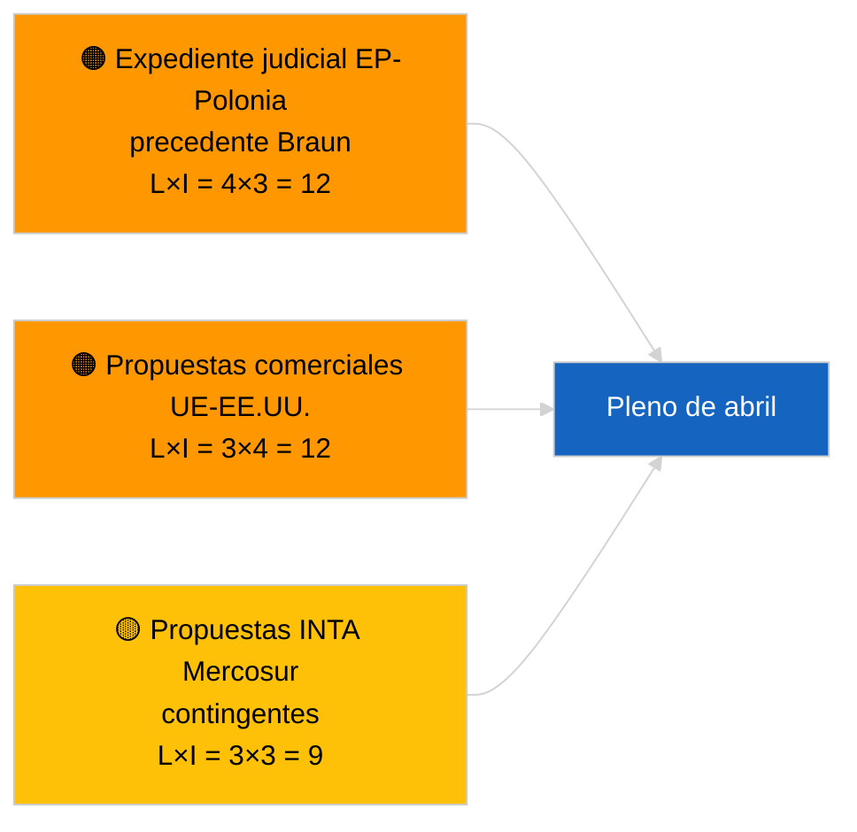

<!-- SPDX-FileCopyrightText: 2026 Hack23 AB -->
<!-- SPDX-License-Identifier: Apache-2.0 -->

# Informe ejecutivo — Propuestas de resolución | 2026-04-02

**Clasificación:** OSINT | Registro parlamentario público
**Confianza:** 🟢 Alta (evaluación estructural durante período de receso)
**Generado:** 2026-04-02T00:00:00Z (informe retrospectivo)
**Tipo de artículo:** Propuestas de resolución
**ID de ejecución:** `c93513b6-9f22-4b36-a984-d0512328769c`
**Fuente:** Portal de datos abiertos del Parlamento Europeo

---

## 🎯 BLUF

**No se presentaron nuevas propuestas de resolución el 2026-04-02; continúa la semana 2 de 4 del receso parlamentario.** La ejecución `c93513b6-9f22-4b36-a984-d0512328769c` devolvió **0 actores clasificados** y significancia **RUTINA**, lo que refleja el estado de plantilla vacía para 2026-04-01/propuestas. La actividad en la fase de propuestas está vinculada al calendario en los días inmediatamente anteriores al pleno; no se espera la primera presentación de abril hasta el ~17-20 de abril. Prioridades trasladadas a abril: seguimiento de presos políticos de Georgia (TA-10-2026-0083), transposición de créditos de emisión HDV (TA-10-2026-0084), aranceles de EE.UU. (TA-10-2026-0096), precedente de inmunidad Braun (TA-10-2026-0088), puesto de vicepresidente del BCE (TA-10-2026-0060). **🟢 ALTA confianza** — el estado vacío está impulsado por el calendario.

---

## 🧭 3 decisiones que apoya este informe

| # | Decisión | Responsable | Plazo | Evidencia |
|:-:|----------|-------------|:-----:|-----------|
| 1 | **Editorial:** OMITIR propuestas diarias | Editor | +24h | Resultado de ejecución vacío |
| 2 | **Seguimiento:** marcar la primera oleada de presentaciones de abril del 17-20 de abril | Analista | 2026-04-17 | Patrón de presentación del PE |
| 3 | **Seguimiento prospectivo:** rastrear el equilibrio de propuestas comerciales vs. Estado de Derecho para calibración de escenarios de abril | Responsable de análisis | 2026-04-20 | Escenario A vs. B |

---

## 📰 Lectura de 60 segundos

- 🔴 **No se presentaron nuevas propuestas** el 2026-04-02; período de receso. (🟢 Alta)
- 🟠 **0 actores clasificados** en ejecución enfocada en propuestas. (🟢 Alta)
- 🟢 **Los carryovers de marzo** anclan la lista de seguimiento de abril. (🟢 Alta)
- 🟡 **Dimensiones de riesgo todas "ninguna"** hoy. (🟢 Alta)
- 🔵 **Contexto económico:** aranceles de EE.UU. y expedientes del BCE dominantes. (🟢 Alta)
- 🟣 **Referencia cruzada:** ejecuciones hermanas 2026-04-02 plantillas vacías. (🟢 Alta)
- 🩷 **Vector de perturbación:** ninguno agudo hoy. (🟢 Alta)
- ⚪ **Traslado:** el dictamen del TJUE sobre el Mercosur generará probablemente propuestas.

---

## 🗂️ Principales documentos/procedimientos — Seguimiento de propuestas

| Rango | Referencia PE | Título (breve) | Significancia | Confianza | Estado |
|:-----:|---------------|---------------|:-------------:|:---------:|--------|
| 1 | — | No hay nuevas propuestas el 2026-04-02 | 0,0 | 🟢 ALTA | Receso — sin presentación |
| 2 | TA-10-2026-0083 | Presos políticos de Georgia (trasladado) | 7,0 | 🟢 ALTA | Seguimiento de implementación |
| 3 | TA-10-2026-0096 | Aranceles de EE.UU. (trasladado) | 7,0 | 🟢 ALTA | Propuesta de abril probable |

---

## ⚠️ Panorama de riesgos y amenazas

| Riesgo | L | I | Puntuación | Desencadenante | Fuente | Almirantazgo |
|--------|:-:|:-:|:----------:|----------------|--------|:------------:|
| Expediente judicial EP-Polonia | 4 | 3 | 12 | Nuevo caso de inmunidad | TA-10-2026-0088 | A1 |
| Propuestas comerciales UE-EE.UU. | 3 | 4 | 12 | Acción de EE.UU. | TA-10-2026-0096 | A1 |
| Propuestas Mercosur (contingentes) | 3 | 3 | 9 | Dictamen TJUE | TA-10-2026-0008 | A2 |

---

## 🔮 Principal desencadenante prospectivo

**Primera oleada de presentaciones de abril ~17-20 de abril de 2026.** La mezcla temática calibra el Escenario A (comercio) vs. B (Estado de Derecho) vs. C (económico) para el pleno de Estrasburgo del 27-30 de abril.

---

## 🛡️ Evaluación de la calidad de las fuentes

- **Fuentes primarias:** Portal de datos abiertos del PE; ejecución `c93513b6-9f22-4b36-a984-d0512328769c`.
- **Confianza:** 🟢 ALTA para la inactividad impulsada por el calendario.

---

## 📎 Enlaces

| Enlace | Ruta |
|--------|------|
| Artículo | `./article.md` |
| Ejecuciones hermanas | `analysis/daily/2026-04-02/breaking/`, `committee-reports/`, `propositions/` |
| Manifiesto | `./manifest.json` |

---

**Control documental**
- **Plantilla:** `/analysis/templates/executive-brief.md`
- **Ruta del artefacto:** `analysis/daily/2026-04-02/motions/executive-brief.md`
- **Clasificación:** Público
- **Generación retrospectiva:** Sesión de relleno retroactivo.
