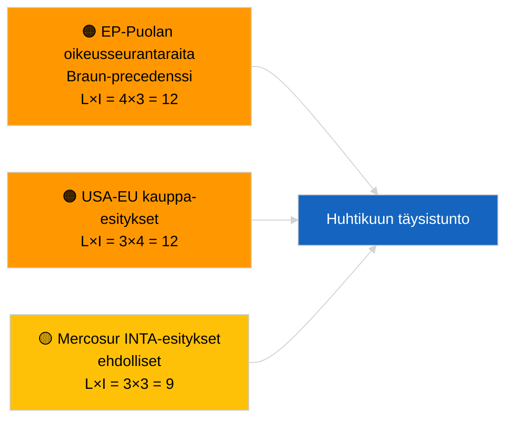

<!-- SPDX-FileCopyrightText: 2026 Hack23 AB -->
<!-- SPDX-License-Identifier: Apache-2.0 -->

# Johdon tiedote — Päätöslauselmaesitykset | 2026-04-02

**Luokitus:** OSINT | Julkinen parlamentaarinen asiakirja
**Luotettavuus:** 🟢 Korkea (rakenteellinen arvio istuntotauon aikana)
**Luotu:** 2026-04-02T00:00:00Z (retrospektiivinen tiedote)
**Artikkelityyppi:** Päätöslauselmaesitykset
**Suoritustunnus:** `c93513b6-9f22-4b36-a984-d0512328769c`
**Lähde:** Euroopan parlamentin avoin dataporttaali

---

## 🎯 BLUF

**Uusia päätöslauselmaesityksiä ei jätetty 2026-04-02; istuntotauon 2. viikko 4:stä jatkuu.** Suoritus `c93513b6-9f22-4b36-a984-d0512328769c` palautti **0 luokiteltua toimijaa** ja **RUTIINI**-merkittävyyden, mikä heijastaa 2026-04-01/esitysten tyhjää mallitilaa. Ehdotusvaiheessa tapahtuva toiminta on kalenterisidonnainen välittömästi ennen täysistuntoa oleviin päiviin; ensimmäistä huhtikuun jättämistä ei odoteta ennen n. 17.–20. huhtikuuta. Huhtikuuhun siirtyvät painopisteet: Georgian poliittisten vankien seuranta (TA-10-2026-0083), HDV-päästöhyvitysten implementointi (TA-10-2026-0084), Yhdysvaltain tullitoimet (TA-10-2026-0096), Braun-immuniteettiprecedenssi (TA-10-2026-0088), EKP:n varapuheenjohtajan toimi (TA-10-2026-0060). **🟢 KORKEA luotettavuus** — tyhjä tila on kalenterisidonnainen.

---

## 🧭 3 päätöstä, joita tämä tiedote tukee

| # | Päätös | Päätöksentekijä | Määräaika | Perustelu |
|:-:|--------|----------------|:---------:|-----------|
| 1 | **Toimituksellinen:** OHITA päivittäiset päätöslauselmaesitykset | Toimittaja | +24t | Tyhjä suoritustulos |
| 2 | **Seuranta:** merkitse ensimmäinen huhtikuun jättämisaalto 17.–20. huhtikuuta | Analyytikko | 2026-04-17 | EP:n jättämismalli |
| 3 | **Ennakoiva seuranta:** seuraa kauppa vs. oikeusvaltion esitysten tasapainoa huhtikuun skenaariokalibrointia varten | Analyysijohto | 2026-04-20 | Skenaario A vs. B |

---

## 📰 60 sekunnin katsaus

- 🔴 **Uusia päätöslauselmaesityksiä ei jätetty** 2026-04-02; istuntotauko. (🟢 Korkea)
- 🟠 **0 toimijaa luokiteltu** esityskeskeisessä suorituksessa. (🟢 Korkea)
- 🟢 **Maaliskuun jäljellä olevat asiat** ankkuroivat huhtikuun seurantalistan. (🟢 Korkea)
- 🟡 **Riskidimensiot kaikki "ei mitään"** tänään. (🟢 Korkea)
- 🔵 **Taloudellinen konteksti:** Yhdysvaltain tullitoimet ja EKP-asiat hallitsevat. (🟢 Korkea)
- 🟣 **Ristiviittaus:** sisarsuoritukset 2026-04-02 tyhjiä malleja. (🟢 Korkea)
- 🩷 **Häiriövektorit:** ei akuutteja tänään. (🟢 Korkea)
- ⚪ **Siirtyvä asia:** Mercosur EUT:n lausunto luo todennäköisesti esityksiä.

---

## 🗂️ Kärkiasiakirjat/menettelyt — Esitysten seuranta

| Sijoitus | EP-viite | Otsikko (lyhyt) | Merkittävyys | Luotettavuus | Tila |
|:--------:|----------|----------------|:------------:|:------------:|------|
| 1 | — | Ei uusia esityksiä 2026-04-02 | 0,0 | 🟢 KORKEA | Istuntotauko — ei jättämistä |
| 2 | TA-10-2026-0083 | Georgian poliittiset vangit (siirretty) | 7,0 | 🟢 KORKEA | Implementoinnin seuranta |
| 3 | TA-10-2026-0096 | Yhdysvaltain tullitoimet (siirretty) | 7,0 | 🟢 KORKEA | Huhtikuun esitys todennäköinen |

---

## ⚠️ Riski- ja uhkakatsaus

| Riski | L | I | Pisteet | Laukaisin | Lähde | Admiraliteetti |
|-------|:-:|:-:|:-------:|-----------|-------|:--------------:|
| EP-Puolan oikeusseurantaraita | 4 | 3 | 12 | Uusi immuniteettitapaus | TA-10-2026-0088 | A1 |
| USA-EU kauppa­esitykset | 3 | 4 | 12 | USA-toimenpide | TA-10-2026-0096 | A1 |
| Mercosur-esitykset (ehdolliset) | 3 | 3 | 9 | EUT:n lausunto | TA-10-2026-0008 | A2 |

---

## 🔮 Tärkein ennakoiva laukaisin

**Ensimmäinen huhtikuun jättämisaalto n. 17.–20. huhtikuuta 2026.** Aiheiden jakautuminen kalibroi Skenaarion A (kauppa) vs. B (oikeusvaltio) vs. C (talous) Strasbourgin täysistuntoa 27.–30. huhtikuuta varten.

---

## 🛡️ Lähdelaadun arviointi

- **Ensisijaiset lähteet:** EP:n avoin dataporttaali; suoritus `c93513b6-9f22-4b36-a984-d0512328769c`.
- **Luotettavuus:** 🟢 KORKEA kalenterisidonnaisen inaktiivisuuden osalta.

---

## 📎 Linkit

| Linkki | Polku |
|--------|-------|
| Artikkeli | `./article.md` |
| Sisarsuoritukset | `analysis/daily/2026-04-02/breaking/`, `committee-reports/`, `propositions/` |
| Manifesti | `./manifest.json` |

---

**Asiakirjavalvonta**
- **Malli:** `/analysis/templates/executive-brief.md`
- **Artefaktipolku:** `analysis/daily/2026-04-02/motions/executive-brief.md`
- **Luokitus:** Julkinen
- **Retrospektiivinen luonti:** Takautuvantäyttämissessio.
