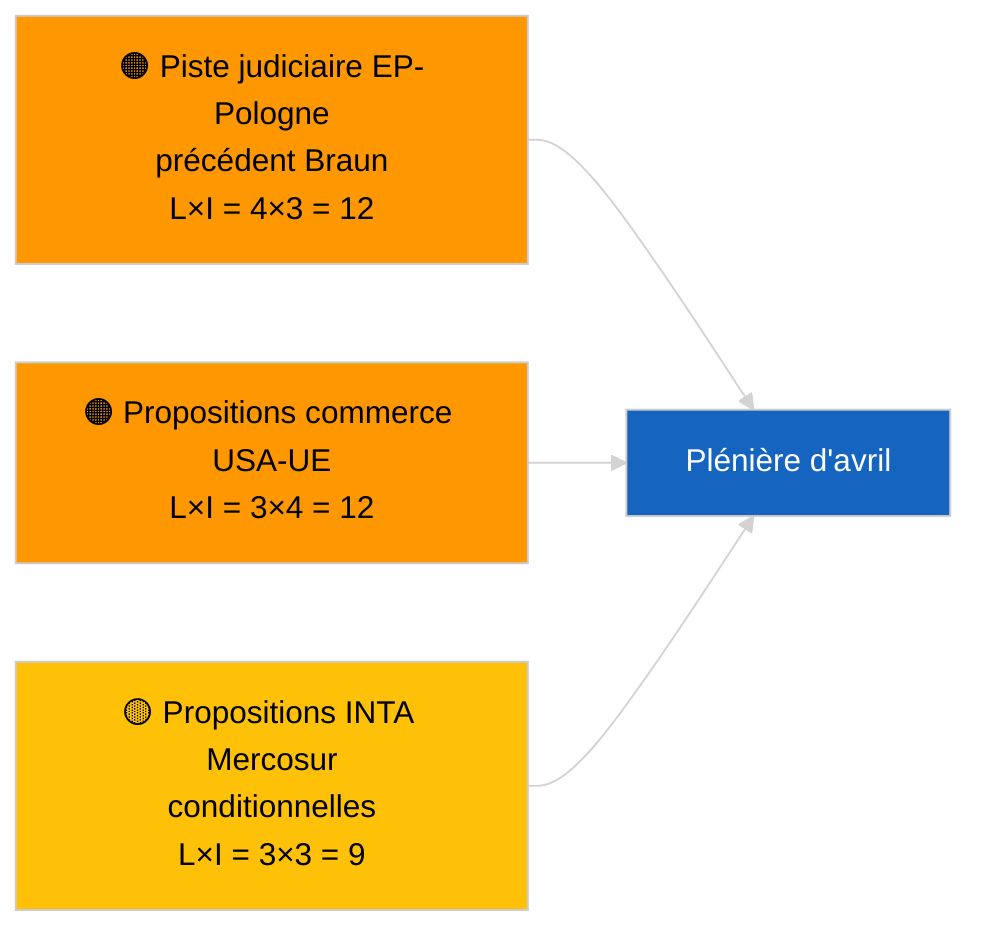

<!-- SPDX-FileCopyrightText: 2026 Hack23 AB -->
<!-- SPDX-License-Identifier: Apache-2.0 -->

# Note de synthèse — Propositions de résolution | 2026-04-02

**Classification :** OSINT | Document parlementaire public
**Niveau de confiance :** 🟢 Élevé (évaluation structurelle en période de vacances parlementaires)
**Généré :** 2026-04-02T00:00:00Z (note rétrospective)
**Type d'article :** Propositions de résolution
**Identifiant d'exécution :** `c93513b6-9f22-4b36-a984-d0512328769c`
**Source :** Portail de données ouvertes du Parlement européen

---

## 🎯 BLUF

**Aucune nouvelle proposition de résolution déposée le 2026-04-02 ; 2e semaine sur 4 de la session de vacances parlementaires en cours.** L'exécution `c93513b6-9f22-4b36-a984-d0512328769c` a retourné **0 acteur classifié** et une signification **ROUTINE**, reflétant l'état de modèle vide pour 2026-04-01/propositions. L'activité en phase de proposition est calendairement liée aux jours précédant immédiatement la session plénière ; le premier dépôt d'avril n'est pas attendu avant le 17-20 avril environ. Priorités reportées en avril : suivi des prisonniers politiques géorgiens (TA-10-2026-0083), transposition des crédits d'émission HDV (TA-10-2026-0084), droits de douane américains (TA-10-2026-0096), précédent d'immunité Braun (TA-10-2026-0088), poste de vice-président de la BCE (TA-10-2026-0060). **🟢 HAUTE confiance** — l'état vide est dicté par le calendrier.

---

## 🧭 3 décisions que cette note soutient

| # | Décision | Décideur | Échéance | Preuve |
|:-:|----------|----------|:--------:|--------|
| 1 | **Rédactionnel :** IGNORER les propositions quotidiennes | Rédacteur | +24h | Résultat d'exécution vide |
| 2 | **Surveillance :** signaler la première vague de dépôts d'avril du 17 au 20 avril | Analyste | 2026-04-17 | Schéma de dépôt du PE |
| 3 | **Surveillance prospective :** suivre l'équilibre commerce vs. RoL pour calibrer les scénarios d'avril | Responsable analyse | 2026-04-20 | Scénario A vs. B |

---

## 📰 Lecture en 60 secondes

- 🔴 **Aucune nouvelle proposition déposée** le 2026-04-02 ; période de vacances. (🟢 Élevé)
- 🟠 **0 acteur classifié** lors de l'exécution axée sur les propositions. (🟢 Élevé)
- 🟢 **Les reports de mars** ancrent la liste de surveillance d'avril. (🟢 Élevé)
- 🟡 **Dimensions de risque toutes « aucun »** aujourd'hui. (🟢 Élevé)
- 🔵 **Contexte économique :** droits de douane américains et dossiers BCE dominants. (🟢 Élevé)
- 🟣 **Renvoi croisé :** exécutions sœurs 2026-04-02 modèles vides. (🟢 Élevé)
- 🩷 **Vecteur de perturbation :** aucun aigu aujourd'hui. (🟢 Élevé)
- ⚪ **Report :** l'avis de la Cour de justice sur le Mercosur générera vraisemblablement des propositions.

---

## 🗂️ Documents/procédures de tête — Surveillance des propositions

| Rang | Référence PE | Titre (court) | Signification | Confiance | Statut |
|:----:|--------------|--------------|:-------------:|:---------:|--------|
| 1 | — | Aucune nouvelle proposition le 2026-04-02 | 0,0 | 🟢 ÉLEVÉ | Session de vacances — aucun dépôt |
| 2 | TA-10-2026-0083 | Prisonniers politiques géorgiens (report) | 7,0 | 🟢 ÉLEVÉ | Surveillance de mise en œuvre |
| 3 | TA-10-2026-0096 | Droits de douane américains (report) | 7,0 | 🟢 ÉLEVÉ | Proposition d'avril probable |

---

## ⚠️ Panorama des risques et menaces

| Risque | L | I | Score | Déclencheur | Source | Amirauté |
|--------|:-:|:-:|:-----:|-------------|--------|:--------:|
| Piste judiciaire EP-Pologne | 4 | 3 | 12 | Nouveau cas d'immunité | TA-10-2026-0088 | A1 |
| Propositions commerce USA-UE | 3 | 4 | 12 | Mesure américaine | TA-10-2026-0096 | A1 |
| Propositions Mercosur (cond.) | 3 | 3 | 9 | Avis CJE | TA-10-2026-0008 | A2 |

---

## 🔮 Principal déclencheur prospectif

**Première vague de dépôts d'avril ~17-20 avril 2026.** La répartition thématique calibre le Scénario A (commerce) vs. B (RoL) vs. C (économique) pour la plénière de Strasbourg du 27 au 30 avril.

---

## 🛡️ Évaluation de la qualité des sources

- **Sources primaires :** portail de données ouvertes du PE ; exécution `c93513b6-9f22-4b36-a984-d0512328769c`.
- **Confiance :** 🟢 ÉLEVÉE pour l'inactivité dictée par le calendrier.

---

## 📎 Liens

| Lien | Chemin |
|------|--------|
| Article | `./article.md` |
| Exécutions sœurs | `analysis/daily/2026-04-02/breaking/`, `committee-reports/`, `propositions/` |
| Manifeste | `./manifest.json` |

---

**Contrôle documentaire**
- **Modèle :** `/analysis/templates/executive-brief.md`
- **Chemin de l'artefact :** `analysis/daily/2026-04-02/motions/executive-brief.md`
- **Classification :** Public
- **Génération rétrospective :** Session de remplissage rétroactif.
