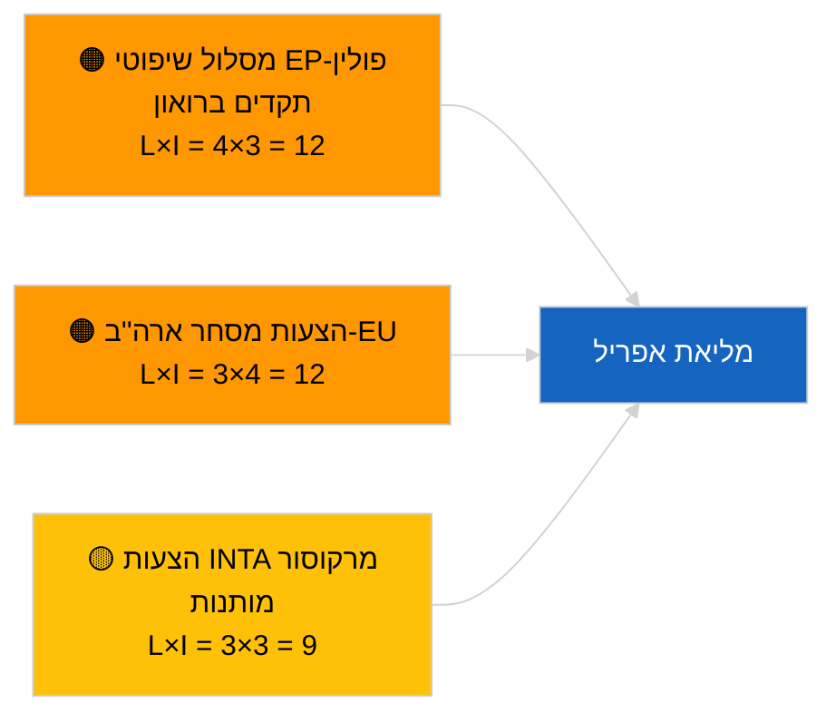

<!-- SPDX-FileCopyrightText: 2026 Hack23 AB -->
<!-- SPDX-License-Identifier: Apache-2.0 -->

# דוח מנהלים — הצעות לאימוץ החלטות | 2026-04-02

**סיווג:** OSINT | רישום פרלמנטרי ציבורי
**אמינות:** 🟢 גבוהה (הערכה מבנית בתקופת הפסקת מושב)
**נוצר:** 2026-04-02T00:00:00Z (דוח רטרוספקטיבי)
**סוג הפריט:** הצעות לאימוץ החלטות
**מזהה ריצה:** `c93513b6-9f22-4b36-a984-d0512328769c`
**מקור:** פורטל הנתונים הפתוח של הפרלמנט האירופי

---

## 🎯 BLUF

**לא הוגשו הצעות להחלטות חדשות ב-2026-04-02; שבוע 2 מתוך 4 של הפסקת המושב הפרלמנטרי נמשך.** ריצה `c93513b6-9f22-4b36-a984-d0512328769c` החזירה **0 שחקנים מסווגים** ומשמעות **שגרתית**, המשקפת את מצב התבנית הריקה עבור 2026-04-01/הצעות. פעילות בשלב ההצעות קשורה לוחית זמנים לימים שקודמים מיידית למליאה; ההגשה הראשונה של אפריל לא צפויה לפני בערך 17-20 באפריל. עדיפויות המועברות לאפריל: מעקב אחר אסירים פוליטיים בגאורגיה (TA-10-2026-0083), תמלול זיכויי פליטת HDV (TA-10-2026-0084), מכסי ארה"ב (TA-10-2026-0096), תקדים חסינות ברואון (TA-10-2026-0088), תפקיד סגן נשיא ה-ECB (TA-10-2026-0060). **🟢 אמינות גבוהה** — המצב הריק מונע על ידי לוח הזמנים.

---

## 🧭 3 החלטות שדוח זה תומך בהן

| # | החלטה | מקבל ההחלטה | מועד אחרון | ראיה |
|:-:|-------|------------|:----------:|------|
| 1 | **מערכתי:** לדלג על הצעות יומיות | עורך | +24ש | תוצאת ריצה ריקה |
| 2 | **ניטור:** לסמן גל ההגשות הראשון של אפריל ב-17-20 באפריל | אנליסט | 2026-04-17 | תבנית הגשה של PE |
| 3 | **ניטור צופה פני עתיד:** לעקוב אחר יחס הצעות מסחר מול שלטון החוק לכיול תרחישי אפריל | ראש ניתוח | 2026-04-20 | תרחיש A מול B |

---

## 📰 קריאה בת 60 שניות

- 🔴 **לא הוגשו הצעות חדשות** ב-2026-04-02; תקופת הפסקה. (🟢 גבוהה)
- 🟠 **0 שחקנים סווגו** בריצה ממוקדת הצעות. (🟢 גבוהה)
- 🟢 **יתרות מרץ** מעגנות את רשימת הניטור של אפריל. (🟢 גבוהה)
- 🟡 **ממדי סיכון כולם "ללא"** היום. (🟢 גבוהה)
- 🔵 **הקשר כלכלי:** מכסי ארה"ב ותיקי ECB דומיננטיים. (🟢 גבוהה)
- 🟣 **הפניה צולבת:** ריצות אחיות 2026-04-02 תבניות ריקות. (🟢 גבוהה)
- 🩷 **וקטור שיבוש:** ללא חריף היום. (🟢 גבוהה)
- ⚪ **העברה קדימה:** חוות דעת ה-ECJ על מרקוסור עשויה ליצור הצעות.

---

## 🗂️ מסמכים/נהלים מובילים — ניטור הצעות

| דירוג | מקור PE | כותרת (קצרה) | חשיבות | אמינות | סטטוס |
|:-----:|---------|-------------|:------:|:------:|-------|
| 1 | — | אין הצעות חדשות ב-2026-04-02 | 0.0 | 🟢 גבוהה | הפסקת מושב — ללא הגשה |
| 2 | TA-10-2026-0083 | אסירים פוליטיים בגאורגיה (מועבר) | 7.0 | 🟢 גבוהה | ניטור יישום |
| 3 | TA-10-2026-0096 | מכסי ארה"ב (מועבר) | 7.0 | 🟢 גבוהה | הצעת אפריל סבירה |

---

## ⚠️ תמונת מצב סיכונים ואיומים

| סיכון | L | I | ציון | טריגר | מקור | אדמירלות |
|-------|:-:|:-:|:----:|-------|------|:--------:|
| מסלול שיפוטי EP-פולין | 4 | 3 | 12 | מקרה חסינות חדש | TA-10-2026-0088 | A1 |
| הצעות מסחר ארה"ב-EU | 3 | 4 | 12 | פעולה אמריקאית | TA-10-2026-0096 | A1 |
| הצעות מרקוסור (מותנות) | 3 | 3 | 9 | חוות דעת ECJ | TA-10-2026-0008 | A2 |

---

## 🔮 טריגר עתידי מוביל

**גל הגשות אפריל הראשון ~17-20 אפריל 2026.** תמהיל הנושאים מכייל תרחיש A (מסחר) מול B (שלטון החוק) מול C (כלכלי) לקראת מליאת שטרסבורג 27-30 באפריל.

---

## 🛡️ הערכת איכות המקורות

- **מקורות ראשוניים:** פורטל הנתונים הפתוח של ה-EP; ריצה `c93513b6-9f22-4b36-a984-d0512328779c`.
- **אמינות:** 🟢 גבוהה לחוסר פעילות המונע על ידי לוח הזמנים.

---

## 📎 קישורים

| קישור | נתיב |
|-------|------|
| מאמר | `./article.md` |
| ריצות אחיות | `analysis/daily/2026-04-02/breaking/`, `committee-reports/`, `propositions/` |
| מניפסט | `./manifest.json` |

---

**בקרת מסמכים**
- **תבנית:** `/analysis/templates/executive-brief.md`
- **נתיב ארטיפקט:** `analysis/daily/2026-04-02/motions/executive-brief.md`
- **סיווג:** ציבורי
- **יצירה רטרוספקטיבית:** סשן מילוי לאחור.
