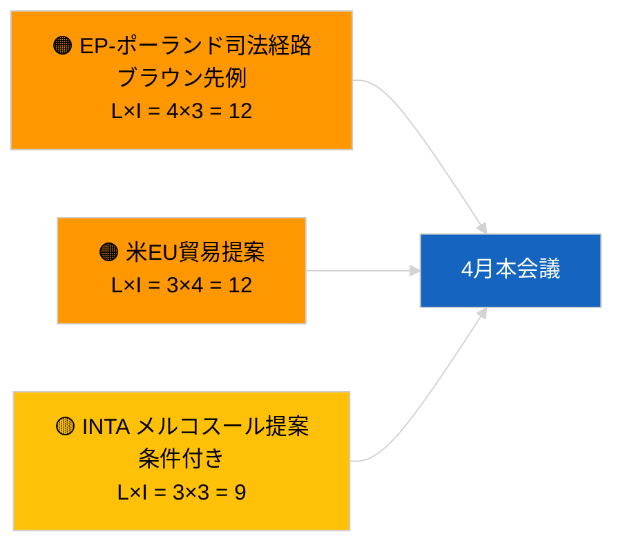

<!-- SPDX-FileCopyrightText: 2026 Hack23 AB -->
<!-- SPDX-License-Identifier: Apache-2.0 -->

# エグゼクティブ・ブリーフ — 決議採択提案 | 2026-04-02

**分類:** OSINT | 公開議会記録
**信頼度:** 🟢 高（会期休会中の構造的評価）
**作成:** 2026-04-02T00:00:00Z（遡及レポート）
**アイテムタイプ:** 決議採択提案
**実行ID:** `c93513b6-9f22-4b36-a984-d0512328769c`
**出典:** 欧州議会オープンデータポータル

---

## 🎯 BLUF

**2026-04-02に新規提案は提出されず。議会休会第2週（全4週）が継続中です。** 実行`c93513b6-9f22-4b36-a984-d0512328769c`は**分類アクター0名**を返し、意味合いは**定常（ルーティン）**と評価されます。これは2026-04-01/propositionsに対する空テンプレートパターンを反映しています。提案段階の活動は本会議直前の日程に連動しており、4月の最初の提出は4月17〜20日頃と予想されます。4月への繰越優先事項：ジョージア政治犯問題（TA-10-2026-0083）、HDV排出クレジット修正（TA-10-2026-0084）、米国関税対応（TA-10-2026-0096）、ブラウン議員免責先例（TA-10-2026-0088）、ECB副総裁ポスト（TA-10-2026-0060）。**🟢 高信頼度** — 空状態はスケジュールに起因します。

---

## 🧭 本ブリーフが支援する3つの意思決定

| # | 決定事項 | 意思決定者 | 期限 | 根拠 |
|:-:|---------|-----------|:----:|------|
| 1 | **定常業務：** 本日の提案モニタリングをスキップ | 編集者 | +24時間 | 実行結果が空 |
| 2 | **モニタリング：** 4月17〜20日の第一次提出ウェーブに注目 | アナリスト | 2026-04-17 | EPの提出パターン |
| 3 | **先行指標監視：** 貿易提案対法の支配提案の比率を追跡し、4月シナリオを較正 | 分析責任者 | 2026-04-20 | シナリオA対B |

---

## 📰 60秒概要

- 🔴 **新規提案なし** 2026-04-02；休会期間中。（🟢 高）
- 🟠 **分類アクター0名** の提案特化実行。（🟢 高）
- 🟢 **3月の繰越分** が4月の監視リストの基礎となる。（🟢 高）
- 🟡 **リスク次元はすべて「なし」** 本日。（🟢 高）
- 🔵 **経済的文脈：** 米国関税とECB案件が支配的。（🟢 高）
- 🟣 **相互参照：** 2026-04-02の姉妹実行も空テンプレート。（🟢 高）
- 🩷 **破壊ベクター：** 本日は緊急ではなし。（🟢 高）
- ⚪ **先行きへの移行：** ECJのメルコスール意見書が提案を生む可能性。

---

## 🗂️ 主要文書/手続き — 提案監視

| 順位 | PE参照 | タイトル（短縮版） | 重要度 | 信頼度 | ステータス |
|:---:|--------|-----------------|:------:|:------:|---------|
| 1 | — | 2026-04-02に新規提案なし | 0.0 | 🟢 高 | 休会中 — 提出なし |
| 2 | TA-10-2026-0083 | ジョージア政治犯（繰越） | 7.0 | 🟢 高 | 実施モニタリング |
| 3 | TA-10-2026-0096 | 米国関税（繰越） | 7.0 | 🟢 高 | 4月提案の可能性 |

---

## ⚠️ リスク・脅威スナップショット

| リスク | L | I | スコア | トリガー | 出典 | 提督性 |
|-------|:-:|:-:|:-----:|---------|------|:------:|
| EP-ポーランド司法経路 | 4 | 3 | 12 | 新たな免責訴訟 | TA-10-2026-0088 | A1 |
| 米EU貿易提案 | 3 | 4 | 12 | 米国の行動 | TA-10-2026-0096 | A1 |
| メルコスール提案（条件付き） | 3 | 3 | 9 | ECJ意見書 | TA-10-2026-0008 | A2 |

---

## 🔮 主要先行トリガー

**4月第一次提出ウェーブ ～2026年4月17〜20日。** テーマ構成がシナリオA（貿易）対B（法の支配）対C（経済）を较正し、4月27〜30日のストラスブール本会議に向けた指針を示します。

---

## 🛡️ ソース品質評価

- **一次ソース：** 欧州議会オープンデータポータル；実行`c93513b6-9f22-4b36-a984-d0512328769c`。
- **信頼度：** 🟢 高（スケジュール起因の非活動に対して）。

---

## 📎 リンク

| リンク | パス |
|-------|------|
| 記事 | `./article.md` |
| 姉妹実行 | `analysis/daily/2026-04-02/breaking/`、`committee-reports/`、`propositions/` |
| マニフェスト | `./manifest.json` |

---

**文書管理**
- **テンプレート：** `/analysis/templates/executive-brief.md`
- **アーティファクトパス：** `analysis/daily/2026-04-02/motions/executive-brief.md`
- **分類：** 公開
- **遡及作成：** バックフィルセッション。
