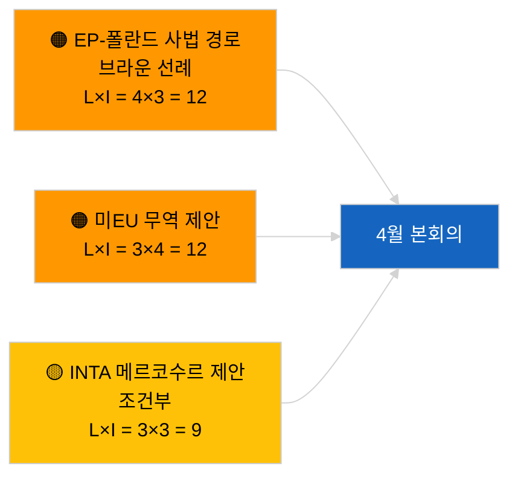

<!-- SPDX-FileCopyrightText: 2026 Hack23 AB -->
<!-- SPDX-License-Identifier: Apache-2.0 -->

# 집행 브리핑 — 결의안 채택 제안 | 2026-04-02

**분류:** OSINT | 공개 의회 기록
**신뢰도:** 🟢 높음 (회기 휴회 중 구조적 평가)
**작성:** 2026-04-02T00:00:00Z (소급 보고서)
**항목 유형:** 결의안 채택 제안
**실행 ID:** `c93513b6-9f22-4b36-a984-d0512328769c`
**출처:** 유럽의회 공개 데이터 포털

---

## 🎯 BLUF

**2026-04-02에 새로운 제안서 없음; 의회 휴회 4주 중 2주차 진행 중.** 실행 `c93513b6-9f22-4b36-a984-d0512328769c`는 **분류된 행위자 0명**을 반환하며 의미는 **정상(루틴)**으로 평가됩니다. 이는 2026-04-01/제안서의 빈 템플릿 패턴을 반영합니다. 제안 단계 활동은 본회의 직전 일정에 연동되며, 4월 첫 제출은 4월 17~20일경으로 예상됩니다. 4월 이월 우선순위: 조지아 정치범 문제(TA-10-2026-0083), HDV 배출 크레딧 수정(TA-10-2026-0084), 미국 관세 대응(TA-10-2026-0096), 브라운 의원 면책 선례(TA-10-2026-0088), ECB 부총재 직위(TA-10-2026-0060). **🟢 높은 신뢰도** — 빈 상태는 일정에 기인합니다.

---

## 🧭 이 브리핑이 지원하는 3가지 의사결정

| # | 결정 사항 | 의사결정자 | 기한 | 근거 |
|:-:|---------|-----------|:----:|------|
| 1 | **정상 업무:** 오늘 제안 모니터링 건너뜀 | 편집자 | +24시간 | 실행 결과 없음 |
| 2 | **모니터링:** 4월 17~20일 첫 번째 제출 물결 표시 | 분석가 | 2026-04-17 | EP 제출 패턴 |
| 3 | **선행 지표 모니터링:** 무역 제안 대 법치 제안 비율 추적으로 4월 시나리오 보정 | 분석 책임자 | 2026-04-20 | 시나리오 A 대 B |

---

## 📰 60초 요약

- 🔴 **새로운 제안 없음** 2026-04-02; 휴회 기간. (🟢 높음)
- 🟠 **분류된 행위자 0명** 제안 특화 실행. (🟢 높음)
- 🟢 **3월 이월분**이 4월 모니터링 목록의 기반. (🟢 높음)
- 🟡 **리스크 차원 모두 "없음"** 오늘. (🟢 높음)
- 🔵 **경제적 맥락:** 미국 관세와 ECB 사안이 주도적. (🟢 높음)
- 🟣 **교차 참조:** 2026-04-02 자매 실행도 빈 템플릿. (🟢 높음)
- 🩷 **파괴 벡터:** 오늘은 긴급하지 않음. (🟢 높음)
- ⚪ **향후 전환:** ECJ 메르코수르 의견서가 제안서 생성 가능.

---

## 🗂️ 주요 문서/절차 — 제안 모니터링

| 순위 | PE 참조 | 제목 (약식) | 중요도 | 신뢰도 | 상태 |
|:---:|--------|------------|:------:|:------:|------|
| 1 | — | 2026-04-02 새로운 제안 없음 | 0.0 | 🟢 높음 | 휴회 — 제출 없음 |
| 2 | TA-10-2026-0083 | 조지아 정치범 (이월) | 7.0 | 🟢 높음 | 이행 모니터링 |
| 3 | TA-10-2026-0096 | 미국 관세 (이월) | 7.0 | 🟢 높음 | 4월 제안 가능 |

---

## ⚠️ 리스크 및 위협 스냅샷

| 리스크 | L | I | 점수 | 트리거 | 출처 | 신뢰도 |
|-------|:-:|:-:|:---:|---------|------|:------:|
| EP-폴란드 사법 경로 | 4 | 3 | 12 | 새로운 면책 소송 | TA-10-2026-0088 | A1 |
| 미EU 무역 제안 | 3 | 4 | 12 | 미국 행동 | TA-10-2026-0096 | A1 |
| 메르코수르 제안 (조건부) | 3 | 3 | 9 | ECJ 의견서 | TA-10-2026-0008 | A2 |

---

## 🔮 주요 선행 트리거

**4월 첫 번째 제출 물결 ~2026년 4월 17~20일.** 주제 구성이 시나리오 A(무역) 대 B(법치) 대 C(경제)를 보정하며 4월 27~30일 스트라스부르 본회의를 위한 지침을 제공합니다.

---

## 🛡️ 출처 품질 평가

- **1차 출처:** 유럽의회 공개 데이터 포털; 실행 `c93513b6-9f22-4b36-a984-d0512328769c`.
- **신뢰도:** 🟢 높음 (일정 기인 비활동에 대해).

---

## 📎 링크

| 링크 | 경로 |
|-----|------|
| 기사 | `./article.md` |
| 자매 실행 | `analysis/daily/2026-04-02/breaking/`, `committee-reports/`, `propositions/` |
| 매니페스트 | `./manifest.json` |

---

**문서 관리**
- **템플릿:** `/analysis/templates/executive-brief.md`
- **아티팩트 경로:** `analysis/daily/2026-04-02/motions/executive-brief.md`
- **분류:** 공개
- **소급 작성:** 백필 세션.
