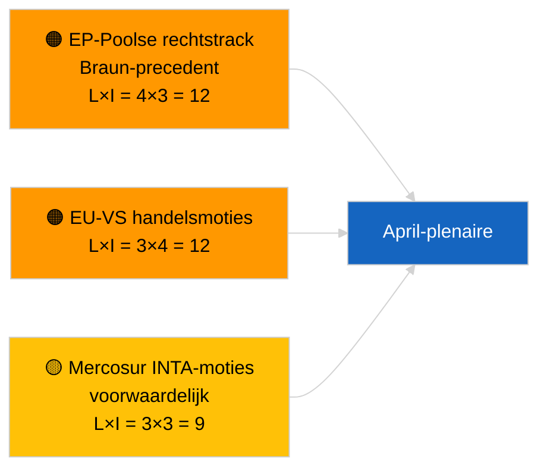

<!-- SPDX-FileCopyrightText: 2026 Hack23 AB -->
<!-- SPDX-License-Identifier: Apache-2.0 -->

# Beknopte managementrapportage — Ontwerpresoluties | 2026-04-02

**Classificatie:** OSINT | Openbaar parlementair document
**Betrouwbaarheid:** 🟢 Hoog (structurele beoordeling tijdens recessperiode)
**Gegenereerd:** 2026-04-02T00:00:00Z (retrospectieve rapportage)
**Artikeltype:** Ontwerpresoluties
**Uitvoerings-ID:** `c93513b6-9f22-4b36-a984-d0512328769c`
**Bron:** Open dataportaal van het Europees Parlement

---

## 🎯 BLUF

**Op 2026-04-02 zijn geen nieuwe ontwerpresoluties ingediend; week 2 van 4 van de parlementaire recessperiode loopt door.** Uitvoering `c93513b6-9f22-4b36-a984-d0512328769c` leverde **0 geclassificeerde actoren** en **ROUTINE**-significantie op, overeenkomend met de lege sjabloonstatus voor 2026-04-01/moties. Activiteit in de moties-fase is kalendergebonden aan de dagen direct voorafgaand aan de plenaire vergadering; de eerste indiening in april wordt niet verwacht vóór ~17-20 april. Overgedragen prioriteiten voor april: opvolging politieke gevangenen Georgië (TA-10-2026-0083), omzetting HDV-emissiekredieten (TA-10-2026-0084), Amerikaanse douanerechten (TA-10-2026-0096), Braun-immuniteitsprecedent (TA-10-2026-0088), ECB-vicepresidentsfunctie (TA-10-2026-0060). **🟢 HOGE betrouwbaarheid** — de lege status wordt door de kalender bepaald.

---

## 🧭 3 beslissingen die deze rapportage ondersteunt

| # | Beslissing | Beslisser | Termijn | Bewijs |
|:-:|------------|-----------|:-------:|--------|
| 1 | **Redactioneel:** Dagelijkse moties OVERSLAAN | Redacteur | +24u | Leeg uitvoeringsresultaat |
| 2 | **Monitoring:** Eerste april-indiengolf 17-20 april markeren | Analist | 2026-04-17 | EP-indieningspatroon |
| 3 | **Vooruitkijkende monitoring:** Verhouding handel vs. RoL-moties volgen voor april-scenariokalibratie | Analyseleidinggevende | 2026-04-20 | Scenario A vs. B |

---

## 📰 60-secondenlezing

- 🔴 **Geen nieuwe moties ingediend** op 2026-04-02; recessperiode. (🟢 Hoog)
- 🟠 **0 actoren geclassificeerd** in op moties gerichte uitvoering. (🟢 Hoog)
- 🟢 **Overgedragen zaken uit maart** verankeren de april-bewakingslijst. (🟢 Hoog)
- 🟡 **Risicoadimensies allemaal "geen"** vandaag. (🟢 Hoog)
- 🔵 **Economische context:** Amerikaanse douanerechten en ECB-dossiers dominant. (🟢 Hoog)
- 🟣 **Kruisverwijzing:** zuster-uitvoeringen 2026-04-02 lege sjablonen. (🟢 Hoog)
- 🩷 **Verstoringsvector:** vandaag geen acute. (🟢 Hoog)
- ⚪ **Overdracht:** Mercosur HvJ-advies zal waarschijnlijk moties genereren.

---

## 🗂️ Top-documenten/procedures — Moties-monitoring

| Rang | EP-referentie | Titel (kort) | Significantie | Betrouwbaarheid | Status |
|:----:|---------------|-------------|:-------------:|:---------------:|--------|
| 1 | — | Geen nieuwe moties op 2026-04-02 | 0,0 | 🟢 HOOG | Recessperiode — geen indiening |
| 2 | TA-10-2026-0083 | Georgische politieke gevangenen (overgedragen) | 7,0 | 🟢 HOOG | Implementatiemonitoring |
| 3 | TA-10-2026-0096 | Amerikaanse douanerechten (overgedragen) | 7,0 | 🟢 HOOG | April-motie waarschijnlijk |

---

## ⚠️ Risico- en dreigingsoverzicht

| Risico | L | I | Score | Trigger | Bron | Admiraliteit |
|--------|:-:|:-:|:-----:|---------|------|:------------:|
| EP-Poolse rechtstrack | 4 | 3 | 12 | Nieuwe immuniteitszaak | TA-10-2026-0088 | A1 |
| EU-VS handels­moties | 3 | 4 | 12 | VS-maatregel | TA-10-2026-0096 | A1 |
| Mercosur-moties (voorwaardelijk) | 3 | 3 | 9 | HvJ-advies | TA-10-2026-0008 | A2 |

---

## 🔮 Belangrijkste vooruitziende trigger

**Eerste april-indiengolf ~17-20 april 2026.** De themamix kalibreert Scenario A (handel) vs. B (rechtsstaat) vs. C (economisch) voor de Straatsburgse plenaire vergadering van 27-30 april.

---

## 🛡️ Beoordeling van bronkwaliteit

- **Primaire bronnen:** Open dataportaal van het EP; uitvoering `c93513b6-9f22-4b36-a984-d0512328769c`.
- **Betrouwbaarheid:** 🟢 HOOG voor door de kalender bepaalde inactiviteit.

---

## 📎 Links

| Link | Pad |
|------|-----|
| Artikel | `./article.md` |
| Zuster-uitvoeringen | `analysis/daily/2026-04-02/breaking/`, `committee-reports/`, `propositions/` |
| Manifest | `./manifest.json` |

---

**Documentbeheer**
- **Sjabloon:** `/analysis/templates/executive-brief.md`
- **Artefactpad:** `analysis/daily/2026-04-02/motions/executive-brief.md`
- **Classificatie:** Openbaar
- **Retrospectieve generatie:** Terugvullsessie.
