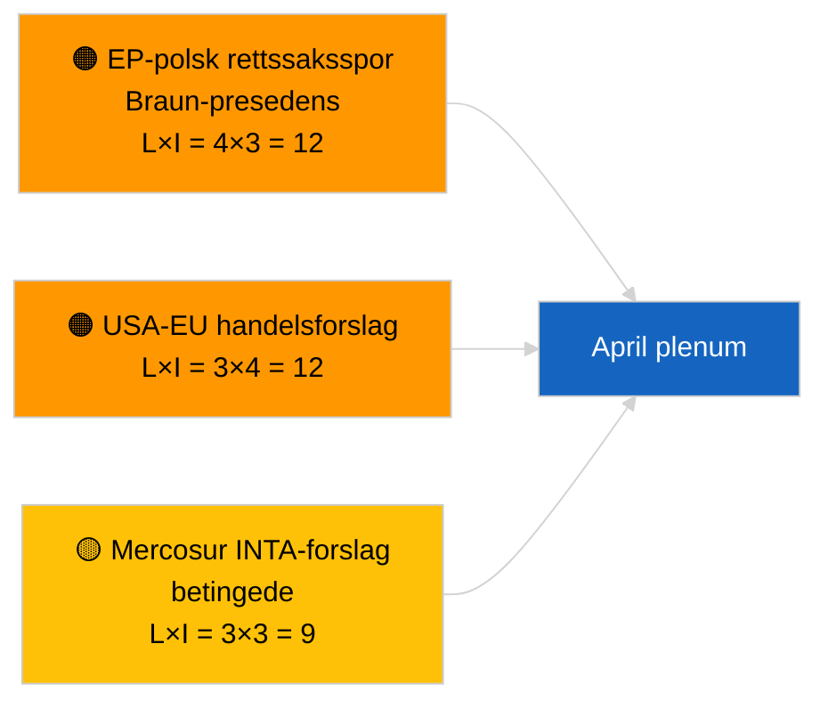

<!-- SPDX-FileCopyrightText: 2026 Hack23 AB -->
<!-- SPDX-License-Identifier: Apache-2.0 -->

# Ledersammendrag — Resolusjonsforslag | 2026-04-02

**Klassifisering:** OSINT | Offentlig parlamentarisk registrering
**Tillit:** 🟢 Høy (strukturell vurdering under recessperiode)
**Generert:** 2026-04-02T00:00:00Z (retrospektivt sammendrag)
**Artikkeltype:** Forslag til resolusjon
**Kjørings-ID:** `c93513b6-9f22-4b36-a984-d0512328769c`
**Kilde:** Europaparlamentets åpne dataportal

---

## 🎯 BLUF

**Ingen nye resolusjonsforslag levert inn den 2026-04-02; parlamentsrecessens uke 2 av 4 fortsetter.** Kjøring `c93513b6-9f22-4b36-a984-d0512328769c` returnerte **0 klassifiserte aktører** og **RUTINE**-signifikans, noe som speiler den tomme maltilstanden for 2026-04-01/forslag. Aktivitet i forslagsfasen er kalenderbundet til dagene umiddelbart forut for plenumssesjonen; den første april-innsendelsen forventes ikke før ca. 17-20. april. Overførte prioriteringer i april: Oppfølging av politiske fanger i Georgia (TA-10-2026-0083), transponering av HDV-utslippskreditter (TA-10-2026-0084), amerikanske tollsatser (TA-10-2026-0096), Braun-immunitetspresedens (TA-10-2026-0088), ECBs visegeneraldirektørpost (TA-10-2026-0060). **🟢 HØY tillit** — den tomme tilstanden er kalenderbetinget.

---

## 🧭 3 beslutninger dette sammendraget støtter

| # | Beslutning | Beslutningstaker | Frist | Bevis |
|:-:|------------|-----------------|:-----:|-------|
| 1 | **Redaksjonelt:** HOPP OVER daglige resolusjonsforslag | Redaktør | +24t | Tomt kjøringsresultat |
| 2 | **Overvåking:** merk første april-innleveringsbølge 17-20. april | Analytiker | 2026-04-17 | EPs innleveringsmønster |
| 3 | **Fremoverskuende overvåking:** spor handel vs. RoL-forslagsbalanse for aprilscenariekalibrering | Analyseleder | 2026-04-20 | Scenario A vs. B |

---

## 📰 60-sekunders lesing

- 🔴 **Ingen nye resolusjonsforslag levert inn** den 2026-04-02; recessperiode. (🟢 Høy)
- 🟠 **0 aktører klassifisert** i forslagsfokusert kjøring. (🟢 Høy)
- 🟢 **Mars-restanser** forankrer april-overvåkingslisten. (🟢 Høy)
- 🟡 **Risikodimensjoner alle "ingen"** i dag. (🟢 Høy)
- 🔵 **Økonomisk kontekst:** amerikanske tollsatser og ECB-poster dominerer. (🟢 Høy)
- 🟣 **Kryssreferanse:** søskenkjøringer 2026-04-02 tomme maler. (🟢 Høy)
- 🩷 **Forstyrrelsesvektorer:** ingen akutte i dag. (🟢 Høy)
- ⚪ **Fremoverføring:** Mercosur ECJ-uttalelse vil sannsynligvis generere forslag.

---

## 🗂️ Toplistede dokumenter/prosedyrer — Forslagsovervåking

| Rang | EP-referanse | Tittel (kort) | Signifikans | Tillit | Status |
|:----:|--------------|--------------|:-----------:|:------:|--------|
| 1 | — | Ingen nye resolusjonsforslag 2026-04-02 | 0,0 | 🟢 HØY | Recessperiode — ingen innlevering |
| 2 | TA-10-2026-0083 | Georgias politiske fanger (overført) | 7,0 | 🟢 HØY | Implementeringsovervåking |
| 3 | TA-10-2026-0096 | Amerikanske tollsatser (overført) | 7,0 | 🟢 HØY | April-forslag sannsynlig |

---

## ⚠️ Risiko- og trusselbilde

| Risiko | L | I | Score | Utløser | Kilde | Admiralitet |
|--------|:-:|:-:|:-----:|---------|-------|:-----------:|
| EP-polsk rettssaksspor | 4 | 3 | 12 | Ny immunitetsak | TA-10-2026-0088 | A1 |
| USA-EU handels­forslag | 3 | 4 | 12 | USA-tiltak | TA-10-2026-0096 | A1 |
| Mercosur-forslag (betingede) | 3 | 3 | 9 | ECJ-uttalelse | TA-10-2026-0008 | A2 |

---

## 🔮 Viktigste fremoverskuende utløser

**Første april-innleveringsbølge ~17-20. april 2026.** Temafordelingen kalibrerer Scenario A (handel) vs. B (RoL) vs. C (økonomi) foran Strasbourg-plenumsesjonen 27-30. april.

---

## 🛡️ Vurdering av kildekvalitet

- **Primære kilder:** EPs åpne dataportal; kjøring `c93513b6-9f22-4b36-a984-d0512328769c`.
- **Tillit:** 🟢 HØY for kalenderdrevet inaktivitet.

---

## 📎 Lenker

| Lenke | Sti |
|-------|-----|
| Artikkel | `./article.md` |
| Søskenkjøringer | `analysis/daily/2026-04-02/breaking/`, `committee-reports/`, `propositions/` |
| Manifest | `./manifest.json` |

---

**Dokumentkontroll**
- **Mal:** `/analysis/templates/executive-brief.md`
- **Artefaktsti:** `analysis/daily/2026-04-02/motions/executive-brief.md`
- **Klassifisering:** Offentlig
- **Retrospektiv generering:** Tilbakefyllingssesjon.
