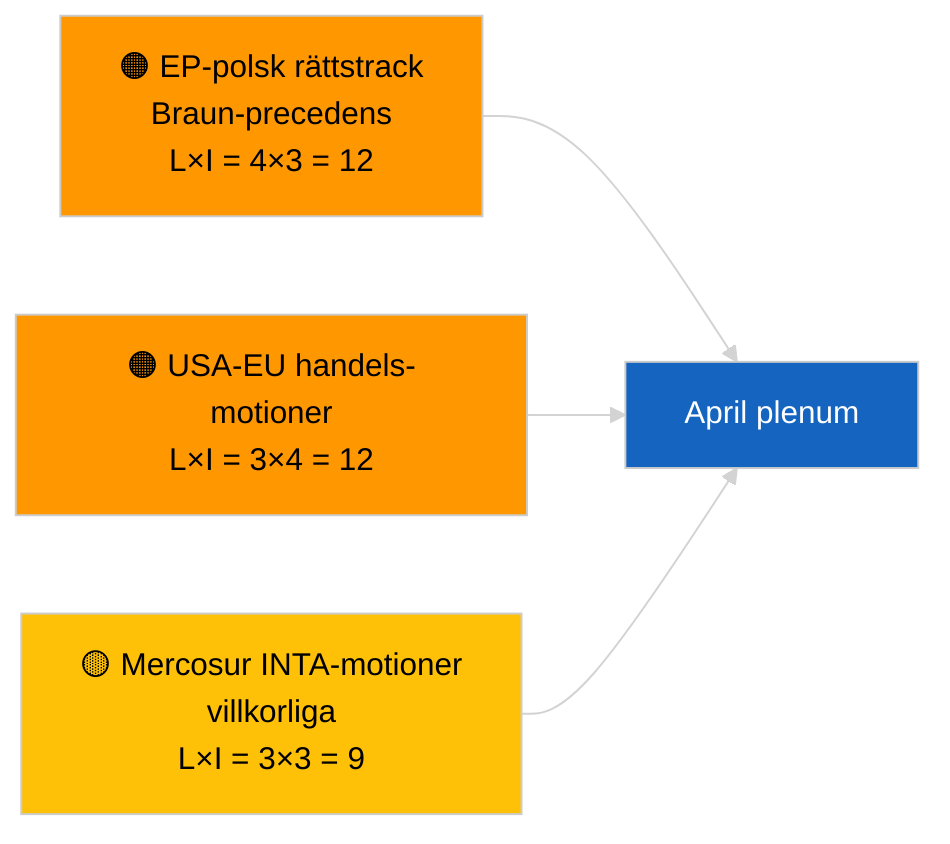

<!-- SPDX-FileCopyrightText: 2026 Hack23 AB -->
<!-- SPDX-License-Identifier: Apache-2.0 -->

# Exekutivt underlag — Resolutionsförslag | 2026-04-02

**Klassificering:** OSINT | Offentligt parlamentsdokument
**Konfidens:** 🟢 Hög (strukturell bedömning under recessperiod)
**Genererat:** 2026-04-02T00:00:00Z (retrospektivt underlag)
**Artikeltyp:** Motioner
**Körnings-ID:** `c93513b6-9f22-4b36-a984-d0512328769c`
**Källa:** Europeiska parlamentets öppna dataportal

---

## 🎯 BLUF

**Inga nya resolutionsförslag inlämnade den 2026-04-02; riksdagsrecessens vecka 2 av 4 fortsätter.** Körning `c93513b6-9f22-4b36-a984-d0512328769c` returnerade **0 klassificerade aktörer** och **RUTIN**-signifikans, vilket speglar det tomma malltillståndet för 2026-04-01/motioner. Aktivitet i motionsfasen är kalenterbunden till dagarna omedelbart före plenarsessionen; den första april-inlämningen förväntas inte förrän cirka 17-20 april. Överförda prioriteringar i april: Uppföljning av politiska fångar i Georgien (TA-10-2026-0083), transponering av HDV-utsläppskrediter (TA-10-2026-0084), amerikanska tullar (TA-10-2026-0096), Braun-immunitetspreceens (TA-10-2026-0088), ECB:s vice ordförandeärende (TA-10-2026-0060). **🟢 HÖG konfidens** — det tomma tillståndet är kalenderbetyingat.

---

## 🧭 3 beslut som detta underlag stödjer

| # | Beslut | Beslutsfattare | Deadline | Bevis |
|:-:|--------|----------------|:--------:|-------|
| 1 | **Redaktionellt:** HOPPA ÖVER dagliga motioner | Redaktör | +24h | Tomt körningsresultat |
| 2 | **Bevakning:** flagga den första inlämningsvågen i april 17-20 april | Analytiker | 2026-04-17 | EP:s inlämningsmönster |
| 3 | **Framåtblickande bevakning:** spåra balansen handel vs RoL-motioner för aprilscenariokalibrering | Analysledning | 2026-04-20 | Scenario A vs B |

---

## 📰 60-sekunders läsning

- 🔴 **Inga nya motioner inlämnade** den 2026-04-02; recessperiod. (🟢 Hög)
- 🟠 **0 aktörer klassificerade** i motionsfokuserad körning. (🟢 Hög)
- 🟢 **Marsobligatorier** förankrar april-bevakningslistan. (🟢 Hög)
- 🟡 **Riskdimensioner samtliga "inga"** idag. (🟢 Hög)
- 🔵 **Ekonomisk kontext:** amerikanska tullar och ECB-ärenden dominerande. (🟢 Hög)
- 🟣 **Korsreferens:** syskondatum 2026-04-02 körningar tomma mallar. (🟢 Hög)
- 🩷 **Störningsvektorer:** inga akuta idag. (🟢 Hög)
- ⚪ **Framåtförande:** Mercosur ECJ-yttrande kommer sannolikt att generera motion(er).

---

## 🗂️ Topplistade dokument/procedurer — Motionsbevakning

| Rang | EP-referens | Titel (kort) | Signifikans | Konfidens | Status |
|:----:|-------------|--------------|:-----------:|:---------:|--------|
| 1 | — | Inga nya motioner 2026-04-02 | 0,0 | 🟢 HÖG | Recessperiod — ingen inlämning |
| 2 | TA-10-2026-0083 | Georgiens politiska fångar (överförd) | 7,0 | 🟢 HÖG | Implementeringsbevakning |
| 3 | TA-10-2026-0096 | Amerikanska tullar (överförd) | 7,0 | 🟢 HÖG | April-motion sannolik |

---

## ⚠️ Risk- och hotöversikt

| Risk | L | I | Poäng | Utlösare | Källa | Admiralitet |
|------|:-:|:-:|:-----:|----------|-------|:-----------:|
| EP-polsk rättstrack | 4 | 3 | 12 | Nytt immunitetsärende | TA-10-2026-0088 | A1 |
| USA-EU handels­motioner | 3 | 4 | 12 | USA-åtgärd | TA-10-2026-0096 | A1 |
| Mercosur-motioner (villkorliga) | 3 | 3 | 9 | ECJ-yttrande | TA-10-2026-0008 | A2 |

---

## 🔮 Viktigaste framåtutlösaren

**Första april-inlämningsvågen ~17-20 april 2026.** Ämnesmixen kalibrerar Scenario A (handel) vs B (RoL) vs C (ekonomi) inför Strasbourgplenaren 27-30 april.

---

## 🛡️ Bedömning av källkvalitet

- **Primärkällor:** EP:s öppna dataportal; körning `c93513b6-9f22-4b36-a984-d0512328769c`.
- **Konfidens:** 🟢 HÖG avseende kalenderdriven inaktivitet.

---

## 📎 Länkar

| Länk | Sökväg |
|------|--------|
| Artikel | `./article.md` |
| Syskonkörningar | `analysis/daily/2026-04-02/breaking/`, `committee-reports/`, `propositions/` |
| Manifest | `./manifest.json` |

---

**Dokumentkontroll**
- **Mall:** `/analysis/templates/executive-brief.md`
- **Artefaktsökväg:** `analysis/daily/2026-04-02/motions/executive-brief.md`
- **Klassificering:** Offentlig
- **Retrospektiv generering:** Bakåtfyllningssession.
