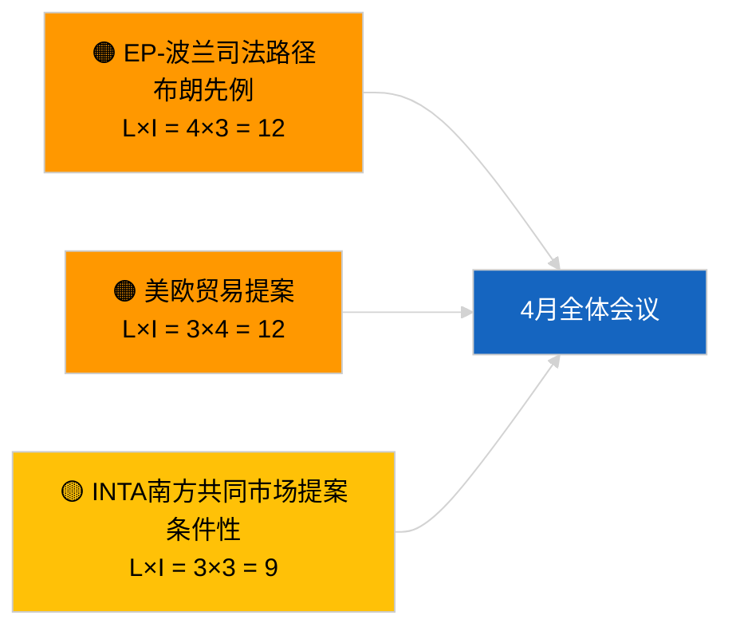

<!-- SPDX-FileCopyrightText: 2026 Hack23 AB -->
<!-- SPDX-License-Identifier: Apache-2.0 -->

# 执行简报 — 决议采纳提案 | 2026-04-02

**分类：** OSINT | 公开议会记录
**可信度：** 🟢 高（议会休会期间的结构性评估）
**创建：** 2026-04-02T00:00:00Z（追溯报告）
**项目类型：** 决议采纳提案
**运行ID：** `c93513b6-9f22-4b36-a984-d0512328769c`
**来源：** 欧洲议会开放数据门户

---

## 🎯 BLUF

**2026-04-02无新提案提交；议会休会第2周（共4周）持续进行中。** 运行`c93513b6-9f22-4b36-a984-d0512328769c`返回**0名已分类行为者**，意义评估为**常规（例行）**，反映了2026-04-01/提案的空模板模式。提案阶段活动与紧邻全体会议前的日程挂钩，4月首批提交预计约在4月17至20日。4月延续优先事项：格鲁吉亚政治犯问题（TA-10-2026-0083）、HDV排放积分修正（TA-10-2026-0084）、美国关税应对（TA-10-2026-0096）、布朗议员豁免先例（TA-10-2026-0088）、ECB副行长职位（TA-10-2026-0060）。**🟢 高可信度** — 空状态源于日程安排。

---

## 🧭 本简报支持的3项决策

| # | 决策事项 | 决策者 | 截止日期 | 依据 |
|:-:|---------|--------|:--------:|------|
| 1 | **常规业务：** 跳过今日提案监控 | 编辑 | +24小时 | 运行结果为空 |
| 2 | **监控：** 标记4月17至20日首批提交浪潮 | 分析师 | 2026-04-17 | EP提交模式 |
| 3 | **领先指标监控：** 追踪贸易提案与法治提案比率以校准4月情景 | 分析主管 | 2026-04-20 | 情景A对比B |

---

## 📰 60秒速读

- 🔴 **无新提案** 2026-04-02；休会期间。（🟢 高）
- 🟠 **0名已分类行为者** 提案专项运行。（🟢 高）
- 🟢 **3月延续事项**构成4月监控清单基础。（🟢 高）
- 🟡 **风险维度均为"无"** 今日。（🟢 高）
- 🔵 **经济背景：** 美国关税与ECB案件主导。（🟢 高）
- 🟣 **交叉参考：** 2026-04-02姊妹运行也为空模板。（🟢 高）
- 🩷 **破坏向量：** 今日无紧迫性。（🟢 高）
- ⚪ **前瞻过渡：** ECJ的南方共同市场意见书可能产生提案。

---

## 🗂️ 主要文件/程序 — 提案监控

| 排名 | PE参考 | 标题（简短） | 重要性 | 可信度 | 状态 |
|:---:|--------|------------|:------:|:------:|------|
| 1 | — | 2026-04-02无新提案 | 0.0 | 🟢 高 | 休会 — 无提交 |
| 2 | TA-10-2026-0083 | 格鲁吉亚政治犯（延续） | 7.0 | 🟢 高 | 执行监控 |
| 3 | TA-10-2026-0096 | 美国关税（延续） | 7.0 | 🟢 高 | 4月提案可能 |

---

## ⚠️ 风险与威胁快照

| 风险 | L | I | 得分 | 触发因素 | 来源 | 海军准将性 |
|-----|:-:|:-:|:---:|---------|------|:--------:|
| EP-波兰司法路径 | 4 | 3 | 12 | 新豁免诉讼 | TA-10-2026-0088 | A1 |
| 美欧贸易提案 | 3 | 4 | 12 | 美国行动 | TA-10-2026-0096 | A1 |
| 南方共同市场提案（条件性） | 3 | 3 | 9 | ECJ意见书 | TA-10-2026-0008 | A2 |

---

## 🔮 主要前瞻触发器

**4月首批提交浪潮 ~2026年4月17至20日。** 主题构成校准情景A（贸易）对B（法治）对C（经济），为4月27至30日斯特拉斯堡全体会议提供方向性指引。

---

## 🛡️ 来源质量评估

- **一级来源：** 欧洲议会开放数据门户；运行`c93513b6-9f22-4b36-a984-d0512328769c`。
- **可信度：** 🟢 高（针对日程驱动的非活动状态）。

---

## 📎 链接

| 链接 | 路径 |
|-----|------|
| 文章 | `./article.md` |
| 姊妹运行 | `analysis/daily/2026-04-02/breaking/`、`committee-reports/`、`propositions/` |
| 清单 | `./manifest.json` |

---

**文件管理**
- **模板：** `/analysis/templates/executive-brief.md`
- **构件路径：** `analysis/daily/2026-04-02/motions/executive-brief.md`
- **分类：** 公开
- **追溯创建：** 回填会话。
