# Propositions — 2026-04-02

<h2 id="section-executive-brief">Executive Brief</h2>

### 🎯 BLUF

**No new Commission propositions or EP own-initiative procedures opened on 2026-04-02.** Run `a3fdcdee-e95c-4a90-a4de-4c41509e1c1d` returned **0 classified actors** and **ROUTINE** significance, mirroring the 2026-04-01/propositions empty state. The 6/8 advisory-feed 404 pattern logged on 2026-04-01 continues; `get_procedures_feed` is among the affected endpoints. Substantive propositions inventory entering April is therefore the inherited pipeline (HDV emissions framework TA-10-2026-0084, ECB Vice-President procedure TA-10-2026-0060, Better Law-Making report TA-10-2026-0063, EU-Mercosur ECJ referral TA-10-2026-0008). **🟢 HIGH confidence** the empty state is calendar- and feed-availability-driven; **🟡 MEDIUM confidence** on absence of new procedures during the feed-API degradation.

---

### 🧭 3 Decisions This Brief Supports

| # | Decision | Who Decides | Deadline | Evidence |
|:-:|----------|-------------|:--------:|----------|
| 1 | **Editorial:** SKIP propositions daily | Editor | +24h | Empty run output |
| 2 | **Monitoring:** continue feed-health watch; flag 48h+ of `get_procedures_feed` 404s as incident | Data pipeline | 2026-04-03 | Sustained pattern |
| 3 | **Forward-watch:** Commission Tuesday meeting 7 April 2026 — first post-Easter college tabling | Analysis lead | 2026-04-07 | Commission cadence |

---

### 📰 60-Second Read

- 🔴 **No new procedures** on 2026-04-02; `get_procedures_feed` 404 continues. (🟡 Medium)
- 🟠 **0 actors classified**; no Commissioner, DG, or rapporteur identified. (🟢 High)
- 🟢 **Pipeline carry-over** anchors April watch list (HDV, ECB, Better Law-Making, Mercosur). (🟢 High)
- 🟡 **Risk dimensions all "none"** today. (🟢 High)
- 🔵 **Economic context:** anticipated Q2 propositions on AI Act implementing rules, Defence Industrial Strategy, MFF preparatory communications. (🟡 Medium)
- 🟣 **Cross-reference:** sibling 2026-04-02 runs empty-template; 2026-04-03/breaking-2 formalises the feed-API concern. (🟢 High)
- 🩷 **Disruption vector:** US trade pressure may force a fast-track Commission proposition in April. (🟡 Medium)
- ⚪ **Carry-forward:** Mercosur ECJ opinion remains the highest-impact pending propositions trigger.

---

### 🗂️ Top Documents / Procedures — Propositions Watch

| Rank | EP reference | Title (short) | Significance | Confidence | Status |
|:----:|--------------|---------------|:------------:|:----------:|--------|
| 1 | — | No new propositions on 2026-04-02 | 0.0 | 🟡 MEDIUM | Feed 404 caveat |
| 2 | TA-10-2026-0008 | EU-Mercosur ECJ referral (pending) | 8.0 | 🟡 MEDIUM | Court opinion expected |
| 3 | TA-10-2026-0084 | HDV emission credits 2025-2029 | 7.0 | 🟢 HIGH | Transposition pipeline |

---

### ⚠️ Risk & Threat Snapshot

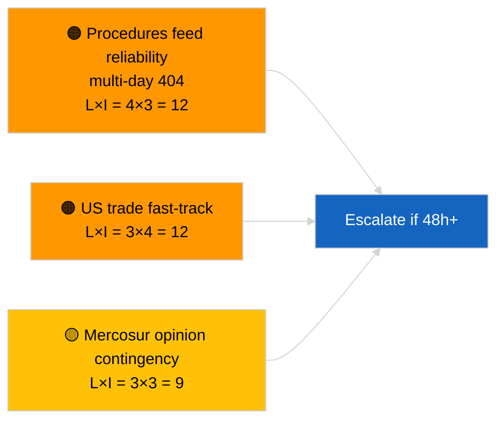
```mermaid
%%{init: {"theme":"dark"}}%%
graph LR
    R1["🟠 Procedures feed reliability<br/>multi-day 404<br/>L×I = 4×3 = 12"] --> CONS["Escalate if 48h+"]
    R2["🟠 US trade fast-track<br/>L×I = 3×4 = 12"] --> CONS
    R3["🟡 Mercosur opinion contingency<br/>L×I = 3×3 = 9"] --> CONS
    style R1 fill:#FF9800,color:#000000
    style R2 fill:#FF9800,color:#000000
    style R3 fill:#FFC107,color:#000000
    style CONS fill:#1565C0,color:#FFFFFF
```

| Risk | L | I | Score | Trigger | Source | Admiralty |
|------|:-:|:-:|:-----:|---------|--------|:---------:|
| Procedures feed reliability | 4 | 3 | 12 | 48h+ sustained 404 | Sibling breaking runs | B2 |
| US trade fast-track proposition | 3 | 4 | 12 | US action | TA-10-2026-0096 | A1 |
| Mercosur opinion contingency | 3 | 3 | 9 | Court releases | TA-10-2026-0008 | A2 |
| MFF preparatory friction | 3 | 4 | 12 | Q2 Commission communication | Commission cadence | B2 |

---

### 🔮 Top Forward Trigger

**Commission Tuesday meeting 7 April 2026** — first post-Easter college tabling; topical mix calibrates Q2 propositions watch list.

---

### 🛡️ Source Quality Assessment

- **Primary sources:** EP Open Data Portal; run `a3fdcdee-e95c-4a90-a4de-4c41509e1c1d`.
- **Data limitations:** `get_procedures_feed` 404 prevents corroboration.
- **Confidence:** 🟡 MEDIUM on procedural-absence claim; 🟢 HIGH on calendar driver.

---

### 📎 Links

| Link | Path |
|------|------|
| Article | `./article.md` |
| Sibling runs | `analysis/daily/2026-04-02/breaking/`, `committee-reports/`, `motions/` |
| Manifest | `./manifest.json` |

---

**Document Control**
- **Template:** `/analysis/templates/executive-brief.md`
- **Artifact path:** `analysis/daily/2026-04-02/propositions/executive-brief.md`
- **Classification:** Public
- **Retrospective generation:** Back-fill session.

<h2 id="reader-intelligence-guide">Reader Intelligence Guide</h2>

Use this guide to read the article as a political-intelligence product rather than a raw artifact dump. High-value reader lenses appear first; technical provenance remains available in the audit appendices.

| Reader need | What you'll get | Source artifact |
|---|---|---|
| [BLUF and editorial decisions](#section-executive-brief) | fast answer to what happened, why it matters, who is accountable, and the next dated trigger | `executive-brief.md` |
| [Actors and forces](#section-actors-forces) | who is driving the story, what political forces line up behind them, and which institutional levers they can pull | `classification/actor-mapping.md` |
| [Coalitions and voting](#section-coalitions-voting) | political group alignment, voting evidence, and coalition pressure points | `existing/voting-patterns.md` |
| [Risk assessment](#section-risk) | policy, institutional, coalition, communications, and implementation risk register | `risk-scoring/risk-matrix.md` |
| [Threat landscape](#section-threat) | hostile actors, attack vectors, consequence trees, and legislative-disruption pathways | `threat-assessment/actor-threat-profiles.md` |
| [Cross-run continuity](#section-continuity) | what changed since prior sessions and how confidence shifted between runs | `existing/cross-session-intelligence.md` |
| [Deep analysis](#section-deep-analysis) | long-form Economist-style explanation for readers who want the full argument | `existing/deep-analysis.md` |
| [Supplementary intelligence](#section-supplementary-intelligence) | additional markdown discovered in the run that has not yet been assigned to a canonical section | `executive-brief_ar.md` |

<h2 id="section-actors-forces">Actors & Forces</h2>

### Actor Mapping

### Actors Identified: 0

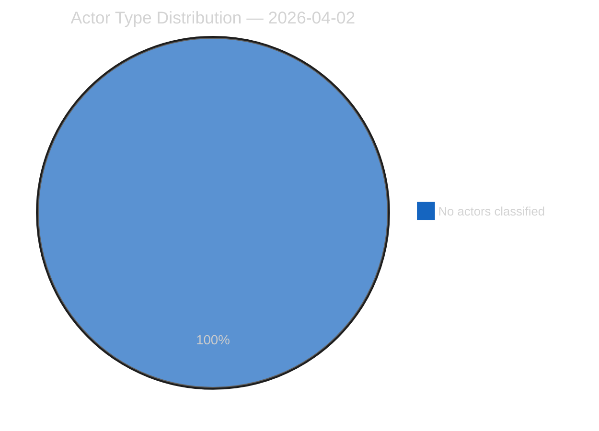
```mermaid
%%{init: {"theme":"dark","themeVariables":{"primaryColor":"#1565C0","primaryTextColor":"#ffffff","primaryBorderColor":"#0A3F7F","lineColor":"#90CAF9","secondaryColor":"#2E7D32","secondaryTextColor":"#ffffff","secondaryBorderColor":"#0F3F00","tertiaryColor":"#FF9800","tertiaryTextColor":"#000000","tertiaryBorderColor":"#7F4F00","mainBkg":"#1565C0","secondBkg":"#2E7D32","tertiaryBkg":"#FF9800","noteBkgColor":"#FFC107","noteTextColor":"#000000","noteBorderColor":"#7F6000","errorBkgColor":"#D32F2F","errorTextColor":"#ffffff","fontFamily":"Inter, Helvetica, Arial, sans-serif","pie1":"#1565C0","pie2":"#2E7D32","pie3":"#FF9800","pie4":"#D32F2F","pie5":"#FFC107","pie6":"#7B1FA2","pie7":"#9E9E9E","pie8":"#0288D1","pie9":"#388E3C","pie10":"#F57C00","pie11":"#C62828","pie12":"#FBC02D","pieTitleTextSize":"18px","pieSectionTextSize":"14px","pieLegendTextSize":"13px","pieStrokeColor":"#1e1e1e","pieOuterStrokeColor":"#1e1e1e","git0":"#1565C0","git1":"#2E7D32","git2":"#FF9800","git3":"#D32F2F","gitBranchLabel0":"#ffffff","gitBranchLabel1":"#ffffff","gitBranchLabel2":"#000000","gitBranchLabel3":"#ffffff","cScale0":"#1565C0","cScale1":"#2E7D32","cScale2":"#FF9800","cScale3":"#D32F2F","cScale4":"#FFC107","cScale5":"#7B1FA2","cScale6":"#9E9E9E","cScale7":"#0288D1","xyChart":{"backgroundColor":"#1e1e1e","plotColorPalette":"#1565C0,#2E7D32,#FF9800,#D32F2F,#FFC107,#7B1FA2,#9E9E9E"}}}}%%
pie title Actor Type Distribution — 2026-04-02
    "No actors classified" : 1
```

### Actor Classification

| Actor | Type | Influence | Position | Role |
|-------|------|-----------|----------|------|
| — | — | — | — | — |

### Type Counts

| Type | Count |
|------|-------|
| — | 0 |

### Date: 2026-04-02

### Forces Analysis

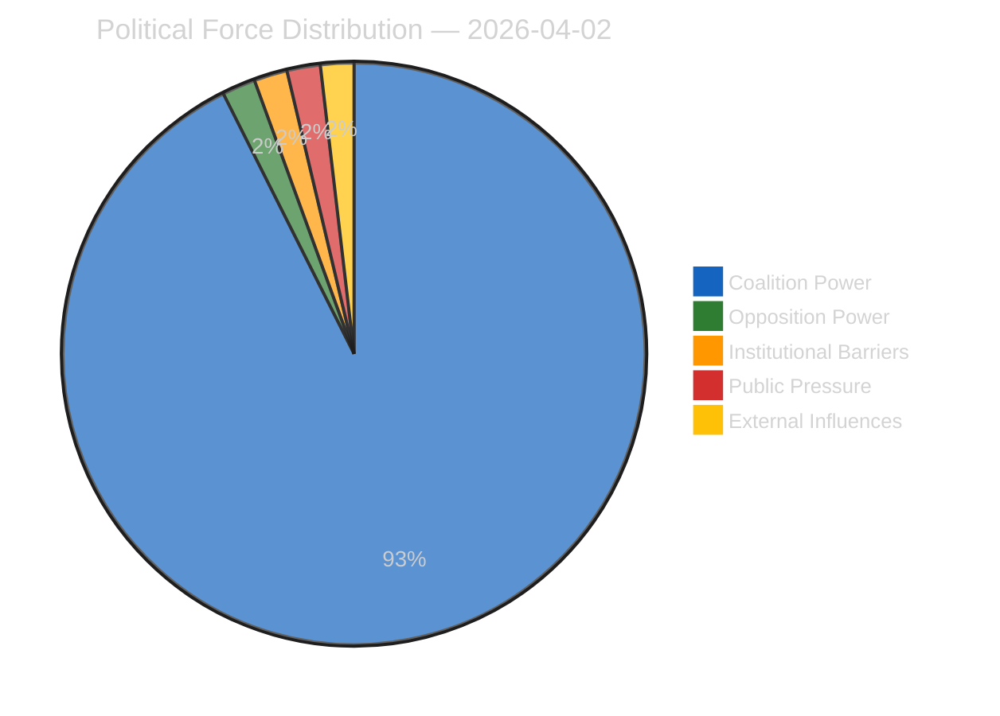
```mermaid
%%{init: {"theme":"dark","themeVariables":{"primaryColor":"#1565C0","primaryTextColor":"#ffffff","primaryBorderColor":"#0A3F7F","lineColor":"#90CAF9","secondaryColor":"#2E7D32","secondaryTextColor":"#ffffff","secondaryBorderColor":"#0F3F00","tertiaryColor":"#FF9800","tertiaryTextColor":"#000000","tertiaryBorderColor":"#7F4F00","mainBkg":"#1565C0","secondBkg":"#2E7D32","tertiaryBkg":"#FF9800","noteBkgColor":"#FFC107","noteTextColor":"#000000","noteBorderColor":"#7F6000","errorBkgColor":"#D32F2F","errorTextColor":"#ffffff","fontFamily":"Inter, Helvetica, Arial, sans-serif","pie1":"#1565C0","pie2":"#2E7D32","pie3":"#FF9800","pie4":"#D32F2F","pie5":"#FFC107","pie6":"#7B1FA2","pie7":"#9E9E9E","pie8":"#0288D1","pie9":"#388E3C","pie10":"#F57C00","pie11":"#C62828","pie12":"#FBC02D","pieTitleTextSize":"18px","pieSectionTextSize":"14px","pieLegendTextSize":"13px","pieStrokeColor":"#1e1e1e","pieOuterStrokeColor":"#1e1e1e","git0":"#1565C0","git1":"#2E7D32","git2":"#FF9800","git3":"#D32F2F","gitBranchLabel0":"#ffffff","gitBranchLabel1":"#ffffff","gitBranchLabel2":"#000000","gitBranchLabel3":"#ffffff","cScale0":"#1565C0","cScale1":"#2E7D32","cScale2":"#FF9800","cScale3":"#D32F2F","cScale4":"#FFC107","cScale5":"#7B1FA2","cScale6":"#9E9E9E","cScale7":"#0288D1","xyChart":{"backgroundColor":"#1e1e1e","plotColorPalette":"#1565C0,#2E7D32,#FF9800,#D32F2F,#FFC107,#7B1FA2,#9E9E9E"}}}}%%
pie title Political Force Distribution — 2026-04-02
    "Coalition Power" : 50
    "Opposition Power" : 1
    "Institutional Barriers" : 1
    "Public Pressure" : 1
    "External Influences" : 1
```

### Forces Data

| Force | Trend | Strength | Key Actors | Confidence |
|-------|-------|----------|------------|------------|
| Coalition Power | stable | 50% | — | low |
| Opposition Power | stable | 0% | — | low |
| Institutional Barriers | stable | 0% | — | low |
| Public Pressure | stable | 0% | — | low |
| External Influences | stable | 0% | — | low |

### Balance

| Metric | Value |
|--------|-------|
| Coalition vs Opposition | 50% vs 1% |
| Dominant force | Coalition |
| Date | 2026-04-02 |

### Date: 2026-04-02

### Impact Matrix

### Overall Significance: **ROUTINE**

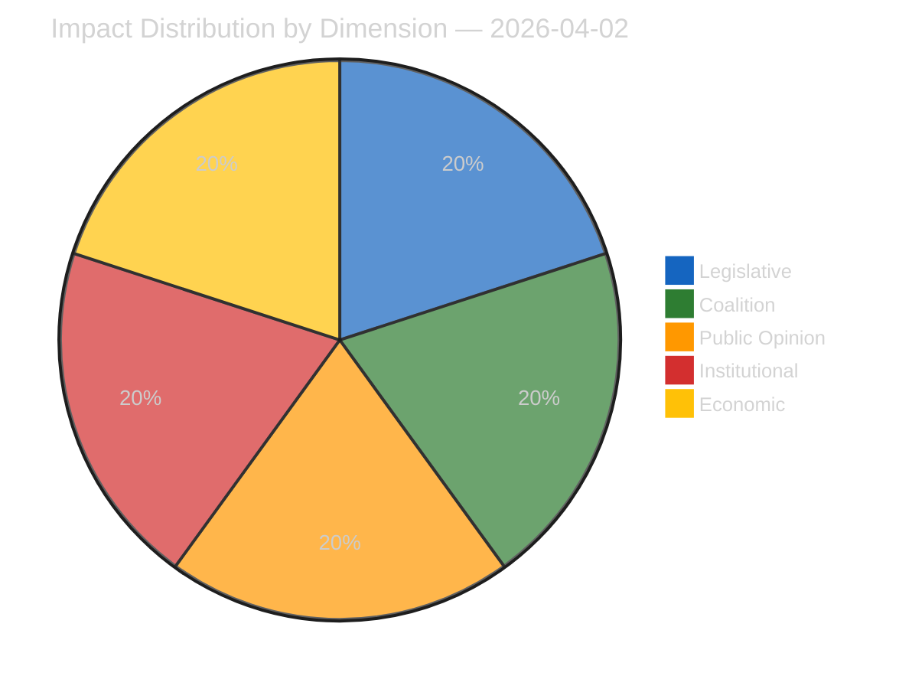
```mermaid
%%{init: {"theme":"dark","themeVariables":{"primaryColor":"#1565C0","primaryTextColor":"#ffffff","primaryBorderColor":"#0A3F7F","lineColor":"#90CAF9","secondaryColor":"#2E7D32","secondaryTextColor":"#ffffff","secondaryBorderColor":"#0F3F00","tertiaryColor":"#FF9800","tertiaryTextColor":"#000000","tertiaryBorderColor":"#7F4F00","mainBkg":"#1565C0","secondBkg":"#2E7D32","tertiaryBkg":"#FF9800","noteBkgColor":"#FFC107","noteTextColor":"#000000","noteBorderColor":"#7F6000","errorBkgColor":"#D32F2F","errorTextColor":"#ffffff","fontFamily":"Inter, Helvetica, Arial, sans-serif","pie1":"#1565C0","pie2":"#2E7D32","pie3":"#FF9800","pie4":"#D32F2F","pie5":"#FFC107","pie6":"#7B1FA2","pie7":"#9E9E9E","pie8":"#0288D1","pie9":"#388E3C","pie10":"#F57C00","pie11":"#C62828","pie12":"#FBC02D","pieTitleTextSize":"18px","pieSectionTextSize":"14px","pieLegendTextSize":"13px","pieStrokeColor":"#1e1e1e","pieOuterStrokeColor":"#1e1e1e","git0":"#1565C0","git1":"#2E7D32","git2":"#FF9800","git3":"#D32F2F","gitBranchLabel0":"#ffffff","gitBranchLabel1":"#ffffff","gitBranchLabel2":"#000000","gitBranchLabel3":"#ffffff","cScale0":"#1565C0","cScale1":"#2E7D32","cScale2":"#FF9800","cScale3":"#D32F2F","cScale4":"#FFC107","cScale5":"#7B1FA2","cScale6":"#9E9E9E","cScale7":"#0288D1","xyChart":{"backgroundColor":"#1e1e1e","plotColorPalette":"#1565C0,#2E7D32,#FF9800,#D32F2F,#FFC107,#7B1FA2,#9E9E9E"}}}}%%
pie title Impact Distribution by Dimension — 2026-04-02
    "Legislative" : 5
    "Coalition" : 5
    "Public Opinion" : 5
    "Institutional" : 5
    "Economic" : 5
```

### Impact Dimensions

| Dimension | Level | Indicator | Numeric |
|-----------|-------|-----------|---------|
| Legislative | none | 🟢 | 5 |
| Coalition | none | 🟢 | 5 |
| Public Opinion | none | 🟢 | 5 |
| Institutional | none | 🟢 | 5 |
| Economic | none | 🟢 | 5 |

### Summary

| Metric | Value |
|--------|-------|
| Overall significance | ROUTINE |
| Highest impact | Legislative |
| Date | 2026-04-02 |

### Date: 2026-04-02

### Significance Assessment

### Overall Significance: **ROUTINE**

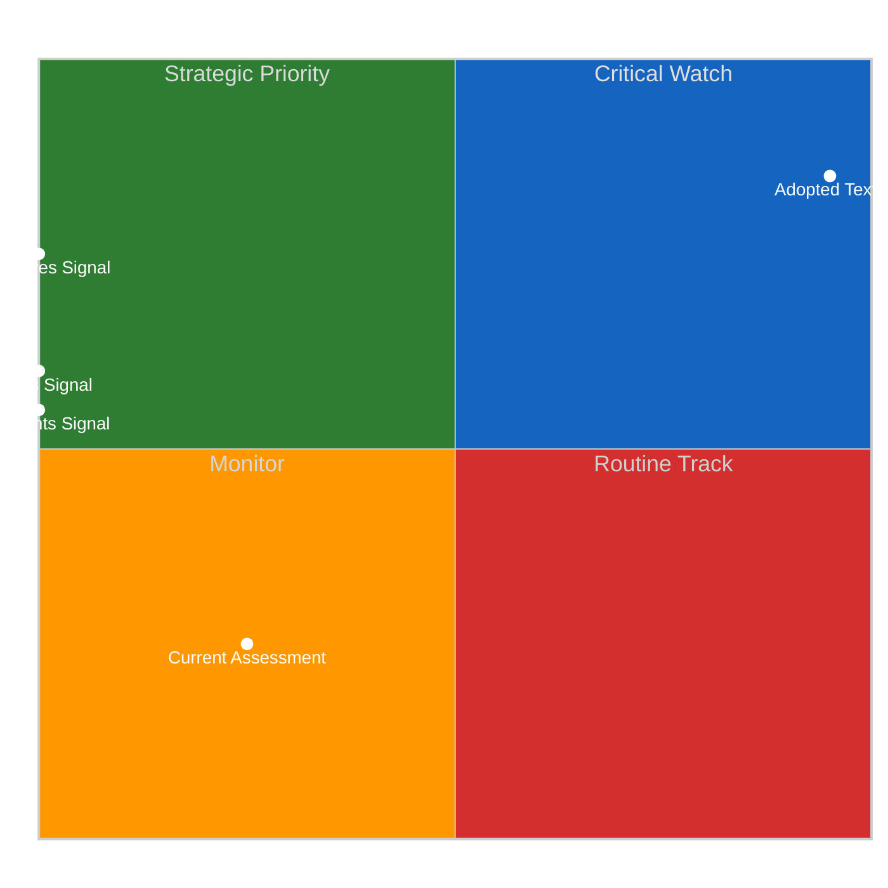
```mermaid
%%{init: {
  "theme": "dark",
  "themeVariables": {
    "quadrant1Fill": "#1565C0",
    "quadrant2Fill": "#2E7D32",
    "quadrant3Fill": "#FF9800",
    "quadrant4Fill": "#D32F2F",
    "quadrantTitleFill": "#ffffff",
    "quadrantPointFill": "#ffffff",
    "quadrantPointTextFill": "#ffffff",
    "quadrantXAxisTextFill": "#ffffff",
    "quadrantYAxisTextFill": "#ffffff"
  },
  "quadrantChart": {
    "chartWidth": 700,
    "chartHeight": 700,
    "pointLabelFontSize": 14,
    "titleFontSize": 22,
    "quadrantLabelFontSize": 18,
    "xAxisLabelFontSize": 16,
    "yAxisLabelFontSize": 16
  }
}}%%
quadrantChart
    title Political Significance Assessment — 2026-04-02
    x-axis Low Volume --> High Volume
    y-axis Low Impact --> High Impact
    quadrant-1 Critical Watch
    quadrant-2 Strategic Priority
    quadrant-3 Monitor
    quadrant-4 Routine Track
    Current Assessment: [0.25, 0.25]
    Events Signal: [0.00, 0.60]
    Documents Signal: [0.00, 0.55]
    Procedures Signal: [0.00, 0.75]
    Adopted Texts: [0.95, 0.85]
```

### 5-Signal Model Scores

| Signal | Raw Data | Score |
|--------|----------|-------|
| Volume | 0 events, 0 documents | 0.0/5 |
| Pipeline | 0 procedures | 0.0/5 |
| Output | 114 adopted texts | 5.0/5 |
| Anomalies | Pattern deviation detection | — |
| Coalition | Group alignment analysis | — |

### Data Summary

| Metric | Value |
|--------|-------|
| Computed significance | ROUTINE |
| Total data points | 114 |
| Events | 0 |
| Documents | 0 |
| Procedures | 0 |
| Adopted texts | 114 |
| Date | 2026-04-02 |

### Date: 2026-04-02

<h2 id="section-coalitions-voting">Coalitions & Voting</h2>

### Voting Patterns

### Overview
Detection and analysis of voting trends across European Parliament proceedings.

### Detected Trends
| Trend ID | Direction | Confidence | Data Points |
|----------|-----------|------------|-------------|
| No trend data available | — | — | — |

### Summary
- **Trends identified**: 0
- **Records analysed**: 0
- **Date**: 2026-04-02

<h2 id="section-risk">Risk Assessment</h2>

### Risk Matrix

### Overview

Quantitative risk scoring across 0 identified political dimensions.
This matrix uses a standardized likelihood × impact framework to quantify and
prioritize political risks affecting the European Parliament legislative process.

### Risk Heat Map

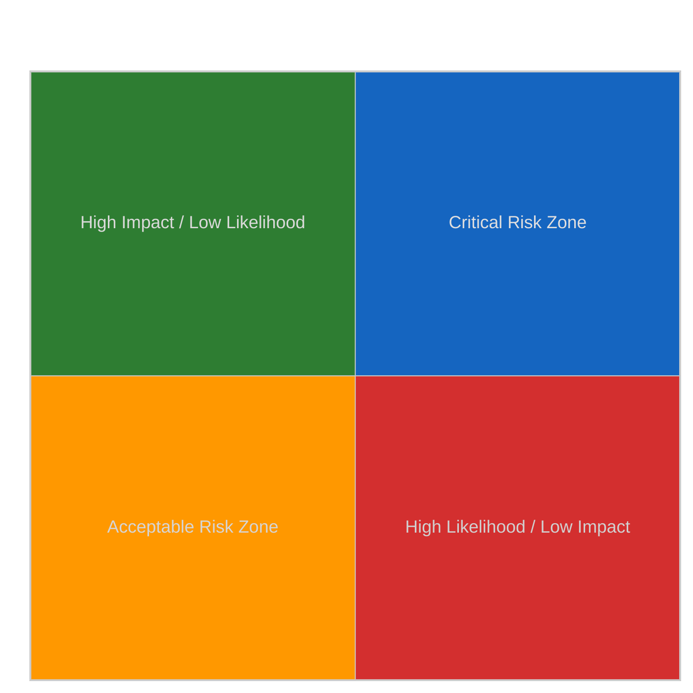
```mermaid
%%{init: {
  "theme": "dark",
  "themeVariables": {
    "quadrant1Fill": "#1565C0",
    "quadrant2Fill": "#2E7D32",
    "quadrant3Fill": "#FF9800",
    "quadrant4Fill": "#D32F2F",
    "quadrantTitleFill": "#ffffff",
    "quadrantPointFill": "#ffffff",
    "quadrantPointTextFill": "#ffffff",
    "quadrantXAxisTextFill": "#ffffff",
    "quadrantYAxisTextFill": "#ffffff"
  },
  "quadrantChart": {
    "chartWidth": 700,
    "chartHeight": 700,
    "pointLabelFontSize": 14,
    "titleFontSize": 22,
    "quadrantLabelFontSize": 18,
    "xAxisLabelFontSize": 16,
    "yAxisLabelFontSize": 16
  }
}}%%
quadrantChart
    title Political Risk Heat Map — 2026-04-02
    x-axis Low Likelihood --> High Likelihood
    y-axis Low Impact --> High Impact
    quadrant-1 Critical Risk Zone
    quadrant-2 High Impact / Low Likelihood
    quadrant-3 Acceptable Risk Zone
    quadrant-4 High Likelihood / Low Impact

```

### Risk Matrix

| Risk ID | Description | Likelihood | Impact | Score | Level |
|---------|-------------|------------|--------|-------|-------|
| — | — | — | — | — | — |

> **Risk Score** = Likelihood × Impact. **Levels**: 🟢 LOW (≤1.0), 🟡 MEDIUM (≤2.0), 🟠 HIGH (≤3.5), 🔴 CRITICAL (>3.5)

### Risk Assessment Details

| — | — | — | — | — | — |

### Risk Mitigation Framework

| Risk Level | Count | Tolerance | Action Required |
|------------|-------|-----------|-----------------|
| 🔴 CRITICAL | 0 | Zero tolerance | Immediate escalation |
| 🟠 HIGH | 0 | Low tolerance | Active mitigation |
| 🟡 MEDIUM | 0 | Moderate | Enhanced monitoring |
| 🟢 LOW | 0 | Acceptable | Routine tracking |

### Date: 2026-04-02

### Quantitative Swot

### Executive Summary

**Strategic Position Score**: 3.4/10
**Overall Assessment**: Weak strategic position: weaknesses and threats dominate — urgent mitigation needed.
**Analysis Date**: 2026-04-02

> This SWOT analysis is derived from 0 procedures, 0 events, 114 adopted texts, 0 documents, 0 voting records, and 0 coalition data points fetched from the European Parliament.

### SWOT Quadrant Chart

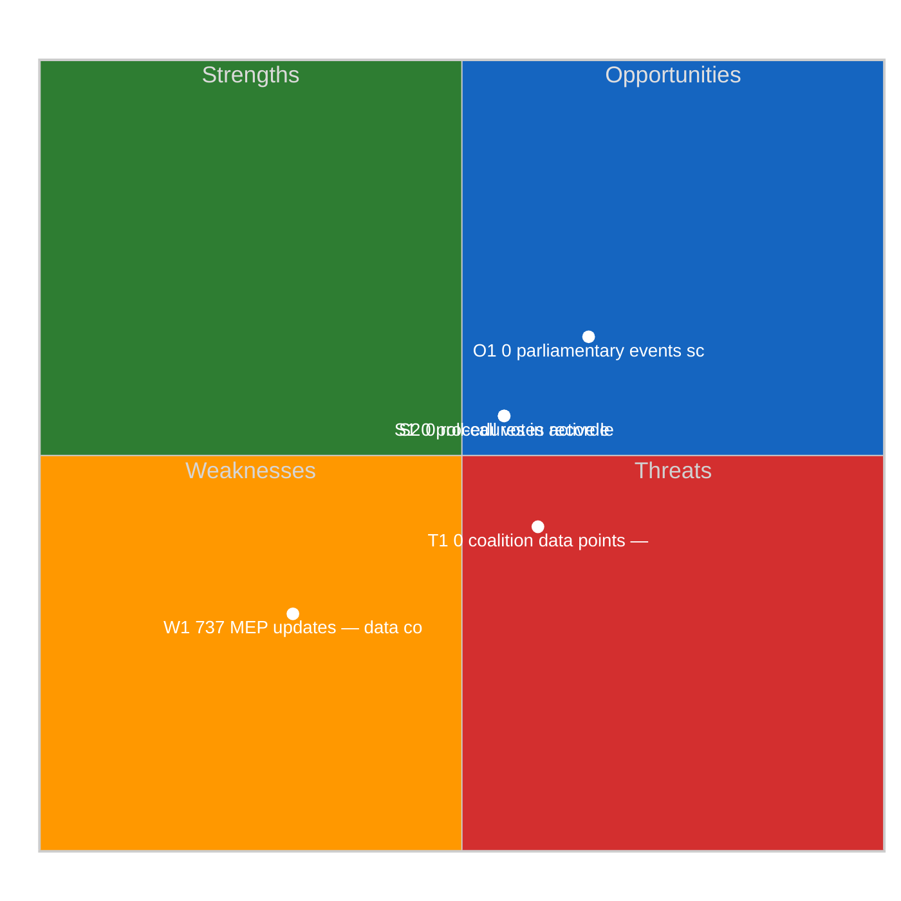
```mermaid
%%{init: {
  "theme": "dark",
  "themeVariables": {
    "quadrant1Fill": "#1565C0",
    "quadrant2Fill": "#2E7D32",
    "quadrant3Fill": "#FF9800",
    "quadrant4Fill": "#D32F2F",
    "quadrantTitleFill": "#ffffff",
    "quadrantPointFill": "#ffffff",
    "quadrantPointTextFill": "#ffffff",
    "quadrantXAxisTextFill": "#ffffff",
    "quadrantYAxisTextFill": "#ffffff"
  },
  "quadrantChart": {
    "chartWidth": 700,
    "chartHeight": 700,
    "pointLabelFontSize": 14,
    "titleFontSize": 22,
    "quadrantLabelFontSize": 18,
    "xAxisLabelFontSize": 16,
    "yAxisLabelFontSize": 16
  }
}}%%
quadrantChart
    title Political SWOT — Strategic Position (2026-04-02)
    x-axis Low Impact --> High Impact
    y-axis Low Priority --> High Priority
    quadrant-1 Opportunities
    quadrant-2 Strengths
    quadrant-3 Weaknesses
    quadrant-4 Threats
    S1 0 procedures in active le: [0.55, 0.55]
    S2 0 roll-call votes recorde: [0.55, 0.55]
    W1 737 MEP updates — data co: [0.30, 0.30]
    O1 0 parliamentary events sc: [0.65, 0.65]
    T1 0 coalition data points —: [0.59, 0.41]
```

### SWOT Overview

| Category | Items | Avg Score | Trend |
|----------|-------|-----------|-------|
| 🟢 Strengths | 2 | 0.0 | stable |
| 🔴 Weaknesses | 1 | 2.0 | stable |
| 🔵 Opportunities | 1 | 1.5 | stable |
| 🟠 Threats | 1 | 0.9 | stable |

### 🟢 Strengths

#### S1: 0 procedures in active legislative pipeline
- **Score**: 0.0/5
- **Confidence**: low
- **Trend**: stable
- **Evidence**:
  - 0 procedures tracked in current period
  - 114 texts adopted
  - 0 documents published

#### S2: 0 roll-call votes recorded with 0 questions
- **Score**: 0.0/5
- **Confidence**: low
- **Trend**: stable
- **Evidence**:
  - 0 voting records available
  - 0 parliamentary questions filed
  - 737 MEP activity updates

### 🔴 Weaknesses

#### W1: 737 MEP updates — data coverage gap assessment
- **Score**: 2.0/5
- **Confidence**: medium
- **Trend**: stable
- **Evidence**:
  - 737 MEP updates in current period
  - 0 documents vs 0 procedures ratio
  - Data freshness depends on EP feed update frequency

### 🔵 Opportunities

#### O1: 0 parliamentary events scheduled
- **Score**: 1.5/5
- **Confidence**: medium
- **Trend**: stable
- **Evidence**:
  - 0 events in analysis period
  - 114 texts adopted indicates legislative throughput
  - 0 procedures in various stages

### 🟠 Threats

#### T1: 0 coalition data points — cohesion monitoring
- **Score**: 0.9/5
- **Confidence**: low
- **Trend**: stable
- **Evidence**:
  - 0 coalition observations recorded
  - Cross-reference with 0 voting records
  - 0 procedures may be affected by coalition shifts

### Cross-Impact Matrix

| Interaction | Net Effect | Rationale |
|-------------|-----------|----------|
| strength #1 × threat #1 | 0.00 | Strength "0 procedures in active legislative pipeline" partially mitigates threat "0 coalition data points — cohesion monitoring" |
| strength #2 × threat #1 | 0.00 | Strength "0 roll-call votes recorded with 0 questions" partially mitigates threat "0 coalition data points — cohesion monitoring" |
| weakness #1 × threat #1 | 0.30 | Weakness "737 MEP updates — data coverage gap assessment" amplifies threat "0 coalition data points — cohesion monitoring" |

### Strategic Priorities Matrix

### Data Summary

| Data Source | Count |
|-------------|-------|
| Procedures | 0 |
| Events | 0 |
| Documents | 0 |
| Voting Records | 0 |
| Adopted Texts | 114 |
| Coalitions | 0 |
| Questions | 0 |
| MEP Updates | 737 |
| **Total Data Points** | **114** |

### Date: 2026-04-02

### Political Capital Risk

### Data Inventory for Capital Risk Assessment
| Data Source | Count | Relevance |
|-------------|-------|-----------|
| Coalition data points | 0 | Group cohesion indicators |
| Voting records | 0 | Voting alignment metrics |
| Voting patterns | 0 | Trend and anomaly data |
| Active procedures | 0 | Legislative engagement |

### Date: 2026-04-02

### Legislative Velocity Risk

### Overview
Risk assessment based on legislative processing speed for 0 procedures.

### Top Velocity Risks
| Procedure | Title | Stage | Days (actual/expected) | Risk Score | Level |
|-----------|-------|-------|----------------------|------------|-------|
| — | — | — | — | — | — |

### Summary
- **Procedures analysed**: 0
- **High/Critical risks**: 0
- **Date**: 2026-04-02

### Agent Risk Workflow

### Risk Heat Map

| Impact ↓ / Likelihood → | Rare | Unlikely | Possible | Likely | Almost Certain |
|--------------------------|------|----------|----------|--------|----------------|
| **Severe** | 🟢 | 🟡 | 🟠 | 🟠 | 🔴 |
| **Major** | 🟢 | 🟡 | 🟡 | 🟠 | 🔴 |
| **Moderate** | 🟢 | 🟢 | 🟡 | 🟠 | 🟠 |
| **Minor** | 🟢 | 🟢 | 🟢 | 🟡 | 🟡 |
| **Negligible** | 🟢 | 🟢 | 🟢 | 🟢 | 🟢 |

### Identified Risks

#### RISK-W00: Baseline political risk
- **Likelihood**: rare (0.1) | **Impact**: minor (2) | **Score**: 0.2 (LOW) | **Confidence**: low
- **Evidence**: Routine parliamentary activity
- **Mitigating Factors**: Stable institutional framework

### Risk Evaluation Matrix

| Rank | Risk ID | Description | Score | Level | Confidence |
|------|---------|-------------|-------|-------|------------|
| 1 | RISK-W00 | Baseline political risk | 0.2 | LOW | low |

### Risk Treatment Plan

- Monitor legislative velocity indicators
- Track coalition voting patterns

### Recommendations

- Monitor legislative velocity indicators
- Track coalition voting patterns

<h2 id="section-threat">Threat Landscape</h2>

### Actor Threat Profiles

### Overview
Individual threat profiles for 0 political actors.

### Actor Threat Matrix
| Actor | Type | Capability | Motivation | Opportunity | Threat Level |
|-------|------|------------|------------|-------------|--------------|
| — | — | — | — | — | — |

### Date: 2026-04-02

### Consequence Trees

### Overview
Structured analysis of action-consequence chains for 0 legislative procedures.

### No procedures available for consequence analysis

### Date: 2026-04-02

### Legislative Disruption

### Overview
Identification of factors disrupting the normal legislative process.

### Disruption Assessment
| Procedure ID | Title | Stage | Resilience | Disruption Points |
|-------------|-------|-------|-----------|-------------------|
| — | — | — | — | — |

### Date: 2026-04-02

### Political Threat Landscape

### Political Threat Landscape Analysis

#### Coalition Shifts
**Threat Level**: 🟢 Low

Coalition stability appears maintained. No significant realignment signals.

**Evidence:**
- No coalition shift signals detected in available data

#### Transparency Deficit
**Threat Level**: ⚠️ Moderate

Transparency concerns at moderate level. Review committee meeting records and public documentation.

**Evidence:**
- No committee activity data available — potential information gap

#### Policy Reversal
**Threat Level**: 🟢 Low

Legislative trajectory appears stable. No major reversal signals.

**Evidence:**
- No significant policy reversal signals detected

#### Institutional Pressure
**Threat Level**: 🟢 Low

Institutional balance appears maintained. Power distribution within normal parameters.

**Evidence:**
- No institutional threat signals detected

#### Legislative Obstruction
**Threat Level**: 🟢 Low

Legislative pace within normal parameters. No obstruction signals.

**Evidence:**
- No significant legislative delay signals detected

#### Democratic Erosion
**Threat Level**: 🟢 Low

Democratic norms appear stable. Institutional processes functioning within expected parameters.

**Evidence:**
- Democratic norms appear stable. No systematic erosion signals.

### Actor Threat Profiles

*No actor threat profiles generated from available data.*

### Consequence Trees

#### Consequence Tree: Standard legislative activity assessment

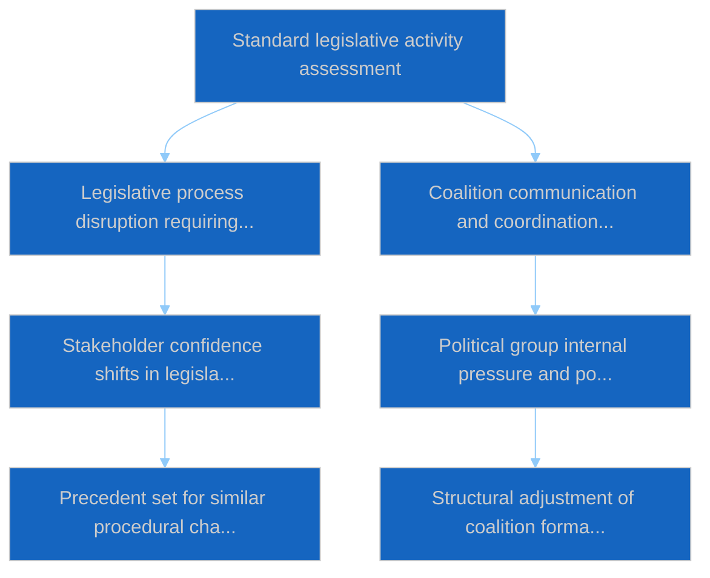
```mermaid
%%{init: {"theme":"dark","themeVariables":{"primaryColor":"#1565C0","primaryTextColor":"#ffffff","primaryBorderColor":"#0A3F7F","lineColor":"#90CAF9","secondaryColor":"#2E7D32","secondaryTextColor":"#ffffff","secondaryBorderColor":"#0F3F00","tertiaryColor":"#FF9800","tertiaryTextColor":"#000000","tertiaryBorderColor":"#7F4F00","mainBkg":"#1565C0","secondBkg":"#2E7D32","tertiaryBkg":"#FF9800","noteBkgColor":"#FFC107","noteTextColor":"#000000","noteBorderColor":"#7F6000","errorBkgColor":"#D32F2F","errorTextColor":"#ffffff","fontFamily":"Inter, Helvetica, Arial, sans-serif","pie1":"#1565C0","pie2":"#2E7D32","pie3":"#FF9800","pie4":"#D32F2F","pie5":"#FFC107","pie6":"#7B1FA2","pie7":"#9E9E9E","pie8":"#0288D1","pie9":"#388E3C","pie10":"#F57C00","pie11":"#C62828","pie12":"#FBC02D","pieTitleTextSize":"18px","pieSectionTextSize":"14px","pieLegendTextSize":"13px","pieStrokeColor":"#1e1e1e","pieOuterStrokeColor":"#1e1e1e","git0":"#1565C0","git1":"#2E7D32","git2":"#FF9800","git3":"#D32F2F","gitBranchLabel0":"#ffffff","gitBranchLabel1":"#ffffff","gitBranchLabel2":"#000000","gitBranchLabel3":"#ffffff","cScale0":"#1565C0","cScale1":"#2E7D32","cScale2":"#FF9800","cScale3":"#D32F2F","cScale4":"#FFC107","cScale5":"#7B1FA2","cScale6":"#9E9E9E","cScale7":"#0288D1","xyChart":{"backgroundColor":"#1e1e1e","plotColorPalette":"#1565C0,#2E7D32,#FF9800,#D32F2F,#FFC107,#7B1FA2,#9E9E9E"}}}}%%
graph TD
    A["Standard legislative activity assessment"]
    B0["Legislative process disruption requiring..."]
    A --> B0
    B1["Coalition communication and coordination..."]
    A --> B1
    C0["Stakeholder confidence shifts in legisla..."]
    B0 --> C0
    C1["Political group internal pressure and po..."]
    B1 --> C1
    D0["Precedent set for similar procedural cha..."]
    C0 --> D0
    D1["Structural adjustment of coalition forma..."]
    C1 --> D1
```

**Mitigating Factors:**
- Institutional resilience mechanisms
- Cross-party dialogue channels

**Amplifying Factors:**
- No significant amplifying factors identified

### Legislative Disruption Analysis

#### Procedure: General legislative pipeline

**Current Stage**: proposal | **Resilience**: high

| Stage | Threat Category | Likelihood | Risk Level |
|-------|----------------|------------|------------|
| proposal | delay | 8% | 🟢 Low |
| committee | transparency | 18% | 🟢 Low |
| plenary first reading | shift | 22% | 🟢 Low |
| council position | delay | 12% | 🟢 Low |
| plenary second reading | shift | 21% | 🟢 Low |
| conciliation | reversal | 17% | 🟢 Low |
| adoption | delay | 5% | 🟢 Low |

**Alternative Pathways:**
- Commission resubmission with revised proposal
- Enhanced informal trilogue engagement
- Interim resolution as procedural bridge

### Key Findings

- No high-priority threats detected across threat landscape dimensions

### Recommendations

- Continue routine monitoring of parliamentary activity

---
*Assessment generated by EU Parliament Monitor Political Threat Assessment Pipeline.*  
*Based on public European Parliament data. GDPR-compliant.*

<h2 id="section-continuity">Cross-Run Continuity</h2>

### Cross Session Intelligence

### Overview
Analysis of coalition stability patterns across multiple plenary sessions.

### Stability Report
- **Overall Stability**: 0.0%
- **Forecast**: volatile
- **Patterns Analysed**: 0

### Group Analysis
- **Stable Groups**: None identified
- **Declining Groups**: None identified

### Date: 2026-04-02

<h2 id="section-deep-analysis">Deep Analysis</h2>

### Raw Data Inventory
| Data Source | Count |
|-------------|-------|
| Events | 0 |
| Procedures | 0 |
| Documents | 0 |
| Adopted Texts | 114 |
| Questions | 0 |
| MEP Updates | 737 |
| **Total** | **851** |

### Stakeholder Groups for AI Analysis
| Stakeholder Group | Data Points Available |
|-------------------|---------------------|
| Political Groups | 114 (procedures + adopted texts) |
| Civil Society | 0 (documents + questions) |
| Industry | 0 (procedures) |
| National Governments | 114 (adopted texts) |
| Citizens | 737 (questions + MEP updates) |
| EU Institutions | 0 (events + procedures) |

### Date: 2026-04-02

<h2 id="section-supplementary-intelligence">Supplementary Intelligence</h2>

### Executive Brief Ar

**التصنيف:** OSINT | السجل البرلماني العام
**مستوى الثقة:** 🟢 مرتفع (تقييم هيكلي خلال فترة العطلة البرلمانية)
**تاريخ الإنشاء:** 2026-04-02T00:00:00Z (تقرير استرجاعي)
**نوع المقال:** المقترحات
**معرّف التشغيل:** `a3fdcdee-e95c-4a90-a4de-4c41509e1c1d`
**المصدر:** بوابة البيانات المفتوحة للبرلمان الأوروبي

---

### 🎯 BLUF

**لم تُفتح أي مقترحات جديدة من المفوضية أو إجراءات مبادرة خاصة بالبرلمان الأوروبي في 2 أبريل 2026.** أسفر التشغيل `a3fdcdee-e95c-4a90-a4de-4c41509e1c1d` عن **0 جهة فاعلة مصنّفة** وأهمية **روتينية**، مما يعكس الحالة الفارغة لـ 2026-04-01/المقترحات. يتواصل نمط أخطاء 404 البالغة 6/8 في تغذيات المشورة المسجّلة في 1 أبريل 2026؛ ويُعدّ `get_procedures_feed` من بين نقاط النهاية المتأثرة. وبذلك يكون المخزون الموضوعي للمقترحات مع مطلع أبريل هو خط الأنابيب الموروث (إطار انبعاثات HDV TA-10-2026-0084، إجراء نائب رئيس البنك المركزي الأوروبي TA-10-2026-0060، تقرير التشريع الأفضل TA-10-2026-0063، إحالة الاتحاد الأوروبي-ميركوسور إلى محكمة العدل الأوروبية TA-10-2026-0008). **🟢 ثقة مرتفعة** في أن الحالة الفارغة مدفوعة بالتقويم وتوافر التغذية؛ **🟡 ثقة متوسطة** فيما يخص غياب إجراءات جديدة خلال تدهور واجهة برمجة التطبيقات.

---

### 🧭 3 قرارات يدعمها هذا التقرير

| # | القرار | من يقرر | الموعد النهائي | الأدلة |
|:-:|--------|---------|:-------------:|--------|
| 1 | **تحريري:** تخطّي المقترحات اليومية | المحرر | +24 ساعة | مخرجات التشغيل فارغة |
| 2 | **المراقبة:** مواصلة رصد صحة التغذية؛ تصنيف 48 ساعة+ من أخطاء 404 لـ `get_procedures_feed` كحادثة | خط أنابيب البيانات | 2026-04-03 | نمط مستمر |
| 3 | **الرصد الاستشرافي:** اجتماع هيئة مفوضية الاتحاد الأوروبي يوم الثلاثاء 7 أبريل 2026 — أول جلسة بعد عطلة عيد الفصح | رئيس التحليل | 2026-04-07 | إيقاع المفوضية |

---

### 📰 قراءة في 60 ثانية

- 🔴 **لا إجراءات جديدة** في 2 أبريل 2026؛ يستمر خطأ 404 في `get_procedures_feed`. (🟡 متوسط)
- 🟠 **0 جهة فاعلة مصنّفة**؛ لم يُحدَّد أي مفوض أو مديرية أو مقرر. (🟢 مرتفع)
- 🟢 **ترحيل خط الأنابيب** يُرسّخ قائمة رصد أبريل (HDV، البنك المركزي الأوروبي، التشريع الأفضل، ميركوسور). (🟢 مرتفع)
- 🟡 **أبعاد المخاطر جميعها "لا شيء"** اليوم. (🟢 مرتفع)
- 🔵 **السياق الاقتصادي:** مقترحات الربع الثاني المتوقعة بشأن قواعد تطبيق قانون الذكاء الاصطناعي، واستراتيجية الصناعة الدفاعية، ومراسلات الإطار المالي متعدد السنوات التحضيرية. (🟡 متوسط)
- 🟣 **الإسناد المتقاطع:** عمليات التشغيل الشقيقة 2026-04-02 قوالب فارغة؛ يُرسّخ 2026-04-03/breaking-2 قلق واجهة برمجة تطبيقات التغذية. (🟢 مرتفع)
- 🩷 **ناقل الاضطراب:** قد يُجبر الضغط التجاري الأمريكي على مقترح مفوضية بإجراءات مسرّعة في أبريل. (🟡 متوسط)
- ⚪ **الترحيل للأمام:** يظل رأي محكمة العدل الأوروبية بشأن ميركوسور أكثر محفزات المقترحات المعلّقة تأثيراً.

---

### 🗂️ أهم الوثائق/الإجراءات — رصد المقترحات

| الترتيب | مرجع البرلمان الأوروبي | العنوان (مختصر) | الأهمية | الثقة | الحالة |
|:-------:|----------------------|----------------|:-------:|:-----:|--------|
| 1 | — | لا مقترحات جديدة في 2026-04-02 | 0.0 | 🟡 متوسط | تحفظ خطأ 404 في التغذية |
| 2 | TA-10-2026-0008 | إحالة الاتحاد الأوروبي-ميركوسور إلى محكمة العدل (معلّقة) | 8.0 | 🟡 متوسط | رأي المحكمة منتظر |
| 3 | TA-10-2026-0084 | اعتمادات انبعاثات HDV 2025–2029 | 7.0 | 🟢 مرتفع | خط أنابيب النقل |

---

### ⚠️ لمحة سريعة عن المخاطر والتهديدات

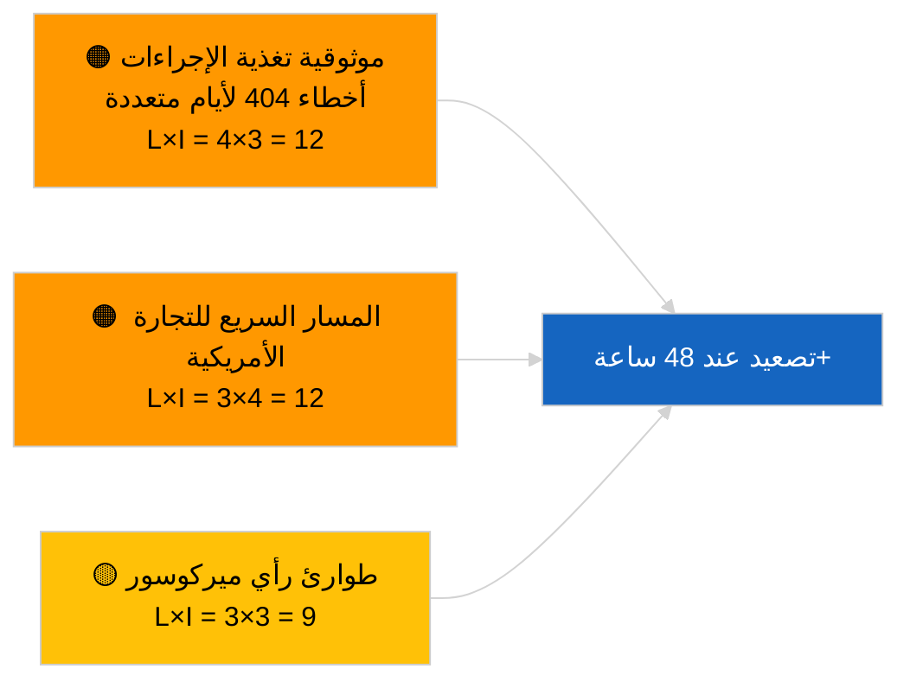
```mermaid
%%{init: {"theme":"dark"}}%%
graph LR
    R1["🟠 موثوقية تغذية الإجراءات<br/>أخطاء 404 لأيام متعددة<br/>L×I = 4×3 = 12"] --> CONS["تصعيد عند 48 ساعة+"]
    R2["🟠 المسار السريع للتجارة الأمريكية<br/>L×I = 3×4 = 12"] --> CONS
    R3["🟡 طوارئ رأي ميركوسور<br/>L×I = 3×3 = 9"] --> CONS
    style R1 fill:#FF9800,color:#000000
    style R2 fill:#FF9800,color:#000000
    style R3 fill:#FFC107,color:#000000
    style CONS fill:#1565C0,color:#FFFFFF
```

| المخاطرة | L | I | النقاط | المحفّز | المصدر | الأدميرالية |
|----------|:-:|:-:|:------:|---------|--------|:-----------:|
| موثوقية تغذية الإجراءات | 4 | 3 | 12 | 48 ساعة+ من أخطاء 404 المستمرة | عمليات التشغيل الشقيقة | B2 |
| مقترح المسار السريع للتجارة الأمريكية | 3 | 4 | 12 | الإجراء الأمريكي | TA-10-2026-0096 | A1 |
| طوارئ رأي ميركوسور | 3 | 3 | 9 | المحكمة تنشر | TA-10-2026-0008 | A2 |
| احتكاك الإطار المالي التحضيري | 3 | 4 | 12 | مراسلة المفوضية الربع الثاني | إيقاع المفوضية | B2 |

---

### 🔮 المحفّز الاستشرافي الرئيسي

**اجتماع هيئة المفوضية يوم الثلاثاء 7 أبريل 2026** — أول جلسة جدول أعمال بعد عطلة عيد الفصح؛ يُعيّر المزيج الموضوعي قائمة رصد مقترحات الربع الثاني.

---

### 🛡️ تقييم جودة المصادر

- **المصادر الأولية:** بوابة البيانات المفتوحة للبرلمان الأوروبي؛ التشغيل `a3fdcdee-e95c-4a90-a4de-4c41509e1c1d`.
- **قيود البيانات:** يمنع خطأ 404 في `get_procedures_feed` التحقق التكميلي.
- **الثقة:** 🟡 متوسط للادعاء بغياب الإجراءات؛ 🟢 مرتفع للمحرّك التقويمي.

---

### 📎 الروابط

| الرابط | المسار |
|--------|--------|
| المقال | `./article.md` |
| عمليات التشغيل الشقيقة | `analysis/daily/2026-04-02/breaking/`, `committee-reports/`, `motions/` |
| البيان | `./manifest.json` |

---

**التحكم في الوثيقة**
- **القالب:** `/analysis/templates/executive-brief.md`
- **مسار القطعة الأثرية:** `analysis/daily/2026-04-02/propositions/executive-brief.md`
- **التصنيف:** عام
- **الإنشاء الاسترجاعي:** جلسة ملء بأثر رجعي.

### Executive Brief Da

### 🎯 BLUF

**Ingen nye Kommissionsforslag eller EP-egne initiativprocedurer åbnede den 2. april 2026.** Kørsel `a3fdcdee-e95c-4a90-a4de-4c41509e1c1d` returnerede **0 klassificerede aktører** og **RUTINE**-betydning, hvilket afspejler den tomme tilstand for 2026-04-01/forslag. Mønsteret med 6/8 rådgivningsstrøms-404'er, der blev logget den 1. april 2026, fortsætter; `get_procedures_feed` er blandt de berørte slutpunkter. Den substantielle forslagsopgørelse ved indgangen til april er derfor den nedarvede pipeline (HDV-emissionsramme TA-10-2026-0084, ECB-næstformandsproces TA-10-2026-0060, Bedre lovgivningsrapport TA-10-2026-0063, EU-Mercosur ECJ-forelæggelse TA-10-2026-0008). **🟢 HØJ tillid** til at den tomme tilstand er kalender- og feedtilgængelighedsdrevet; **🟡 MIDDEL tillid** til fravær af nye procedurer under feed-API-degraderingen.

---

### 🧭 3 Beslutninger denne rapport understøtter

| # | Beslutning | Hvem beslutter | Frist | Dokumentation |
|:-:|-----------|----------------|:-----:|---------------|
| 1 | **Redaktionel:** SPRING forslag dagligt over | Redaktør | +24t | Tom kørselsoutput |
| 2 | **Overvågning:** fortsæt overvågning af feedhelbred; markér 48t+ af `get_procedures_feed` 404'er som hændelse | Datapipeline | 2026-04-03 | Vedvarende mønster |
| 3 | **Fremadrettet overvågning:** Kommissionens tirsdagsmøde 7. april 2026 — første post-påske-kollegiums-dagsordensættelse | Analyseleder | 2026-04-07 | Kommissionens kadence |

---

### 📰 60-sekunders læsning

- 🔴 **Ingen nye procedurer** den 2. april 2026; `get_procedures_feed` 404 fortsætter. (🟡 Middel)
- 🟠 **0 aktører klassificeret**; ingen kommissær, GD eller ordfører identificeret. (🟢 Høj)
- 🟢 **Pipeline-carry-over** forankrer april-overvågningslisten (HDV, ECB, Bedre lovgivning, Mercosur). (🟢 Høj)
- 🟡 **Risikoimensioner alle "ingen"** i dag. (🟢 Høj)
- 🔵 **Økonomisk kontekst:** forventede Q2-forslag om gennemførelsesregler for AI Act, Forsvarsindustriel strategi, MFF-forberedende meddelelser. (🟡 Middel)
- 🟣 **Krydsreference:** søsterkørsler 2026-04-02 tomme skabeloner; 2026-04-03/breaking-2 formaliserer feed-API-bekymringen. (🟢 Høj)
- 🩷 **Forstyrrelsesvektor:** US handelspres kan fremtvinge et hurtigsporet Kommissionsforslag i april. (🟡 Middel)
- ⚪ **Carry-forward:** Mercosur ECJ-udtalelse forbliver den mest impaktfulde ventende forslagstrigger.

---

### 🗂️ Topdokumenter/procedurer — Forslags-overvågning

| Rang | EP-reference | Titel (kortform) | Betydning | Tillid | Status |
|:----:|-------------|-----------------|:---------:|:------:|--------|
| 1 | — | Ingen nye forslag den 2026-04-02 | 0,0 | 🟡 MIDDEL | Feed-404-forbehold |
| 2 | TA-10-2026-0008 | EU-Mercosur ECJ-forelæggelse (verserende) | 8,0 | 🟡 MIDDEL | Domstolsudtalelse forventet |
| 3 | TA-10-2026-0084 | HDV-emissionskreditter 2025–2029 | 7,0 | 🟢 HØJ | Transpositionspipeline |

---

### ⚠️ Risiko- og trusselsoversigt

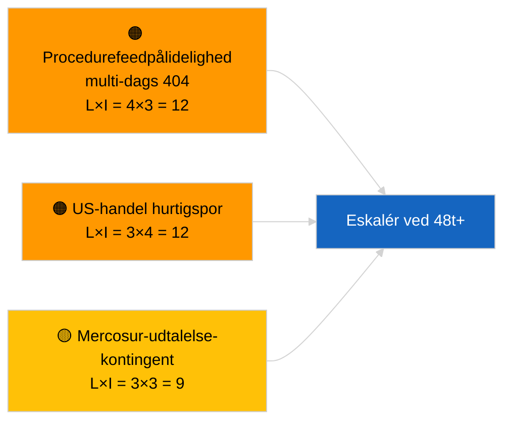
```mermaid
%%{init: {"theme":"dark"}}%%
graph LR
    R1["🟠 Procedurefeedpålidelighed<br/>multi-dags 404<br/>L×I = 4×3 = 12"] --> CONS["Eskalér ved 48t+"]
    R2["🟠 US-handel hurtigspor<br/>L×I = 3×4 = 12"] --> CONS
    R3["🟡 Mercosur-udtalelse-kontingent<br/>L×I = 3×3 = 9"] --> CONS
    style R1 fill:#FF9800,color:#000000
    style R2 fill:#FF9800,color:#000000
    style R3 fill:#FFC107,color:#000000
    style CONS fill:#1565C0,color:#FFFFFF
```

| Risiko | L | I | Score | Trigger | Kilde | Admiralitet |
|--------|:-:|:-:|:-----:|---------|-------|:-----------:|
| Procedurefeedpålidelighed | 4 | 3 | 12 | 48t+ vedvarende 404 | Søsterkørsler | B2 |
| US-handel hurtigsporsforslag | 3 | 4 | 12 | US-handling | TA-10-2026-0096 | A1 |
| Mercosur-udtalelse-kontingent | 3 | 3 | 9 | Domstol udgiver | TA-10-2026-0008 | A2 |
| MFF-forberedende friktion | 3 | 4 | 12 | Q2-Kommissionsmeddelelse | Kommissionens kadence | B2 |

---

### 🔮 Ledende fremadrettet trigger

**Kommissionens tirsdagsmøde 7. april 2026** — første post-påske-kollegiums-dagsordensættelse; emneblandning kalibrerer Q2-forslagsovervågningslisten.

---

### 🛡️ Kildekvalitetsvurdering

- **Primære kilder:** EP:s åbne dataportal; kørsel `a3fdcdee-e95c-4a90-a4de-4c41509e1c1d`.
- **Databegrænsninger:** `get_procedures_feed` 404 forhindrer korroboration.
- **Tillid:** 🟡 MIDDEL til påstand om procedurefravær; 🟢 HØJ til kalenderdriver.

---

### 📎 Links

| Link | Sti |
|------|-----|
| Artikel | `./article.md` |
| Søsterkørsler | `analysis/daily/2026-04-02/breaking/`, `committee-reports/`, `motions/` |
| Manifest | `./manifest.json` |

---

**Dokumentkontrol**
- **Skabelon:** `/analysis/templates/executive-brief.md`
- **Artefaktsti:** `analysis/daily/2026-04-02/propositions/executive-brief.md`
- **Klassifikation:** Offentlig
- **Retrospektiv generering:** Backfill-session.

### Executive Brief De

### 🎯 BLUF

**Am 2. April 2026 wurden keine neuen Kommissionsvorschläge oder EP-Eigeninitiativverfahren eröffnet.** Die Ausführung `a3fdcdee-e95c-4a90-a4de-4c41509e1c1d` lieferte **0 klassifizierte Akteure** und **ROUTINEMÄSSIGE** Bedeutung, was den leeren Zustand vom 2026-04-01/Vorschläge widerspiegelt. Das am 1. April 2026 protokollierte Muster von 6/8 Beratungs-Feed-404-Fehlern setzt sich fort; `get_procedures_feed` gehört zu den betroffenen Endpunkten. Der substantielle Vorschlagsbestand zu Beginn des Aprils ist daher die ererbte Pipeline (HDV-Emissionsrahmen TA-10-2026-0084, EZB-Vizepräsidentenverfahren TA-10-2026-0060, Bessere Rechtsetzung-Bericht TA-10-2026-0063, EU-Mercosur-EuGH-Vorlage TA-10-2026-0008). **🟢 HOHE Zuversicht**, dass der leere Zustand kalender- und feed-verfügbarkeitsbedingt ist; **🟡 MITTLERE Zuversicht** hinsichtlich des Fehlens neuer Verfahren während der API-Degradierung.

---

### 🧭 3 Entscheidungen, die dieser Bericht unterstützt

| # | Entscheidung | Zuständig | Frist | Belege |
|:-:|-------------|-----------|:-----:|--------|
| 1 | **Redaktionell:** Vorschläge täglich ÜBERSPRINGEN | Redakteur | +24h | Leere Ausführungsausgabe |
| 2 | **Überwachung:** Feed-Gesundheitsüberwachung fortsetzen; 48h+ `get_procedures_feed` 404-Fehler als Vorfall markieren | Datenpipeline | 2026-04-03 | Anhaltendes Muster |
| 3 | **Vorausschauende Beobachtung:** Kommissions-Kollegiumssitzung 7. April 2026 — erste Tagesordnung nach Ostern | Analyseleiter | 2026-04-07 | Kommissionsrhythmus |

---

### 📰 60-Sekunden-Lektüre

- 🔴 **Keine neuen Verfahren** am 2. April 2026; `get_procedures_feed` 404 setzt sich fort. (🟡 Mittel)
- 🟠 **0 Akteure klassifiziert**; kein Kommissar, keine GD, kein Berichterstatter identifiziert. (🟢 Hoch)
- 🟢 **Pipeline-Carry-over** verankert die April-Beobachtungsliste (HDV, EZB, Bessere Rechtsetzung, Mercosur). (🟢 Hoch)
- 🟡 **Risikodimensionen alle „keine"** heute. (🟢 Hoch)
- 🔵 **Wirtschaftlicher Kontext:** erwartete Q2-Vorschläge zu Durchführungsvorschriften des AI Act, Industriestrategie Verteidigung, MFF-vorbereitende Mitteilungen. (🟡 Mittel)
- 🟣 **Querverweise:** Geschwisterläufe 2026-04-02 leere Vorlagen; 2026-04-03/breaking-2 formalisiert die Feed-API-Besorgnis. (🟢 Hoch)
- 🩷 **Störungsvektor:** US-Handelsdruck könnte im April einen Schnellverfahrens-Kommissionsvorschlag erzwingen. (🟡 Mittel)
- ⚪ **Carry-forward:** Mercosur-EuGH-Gutachten bleibt der wirkungsmächtigste ausstehende Vorschlags-Trigger.

---

### 🗂️ Top-Dokumente/Verfahren — Vorschlagsüberwachung

| Rang | EP-Referenz | Titel (Kurzform) | Bedeutung | Zuversicht | Status |
|:----:|------------|-----------------|:---------:|:----------:|--------|
| 1 | — | Keine neuen Vorschläge am 2026-04-02 | 0,0 | 🟡 MITTEL | Feed-404-Vorbehalt |
| 2 | TA-10-2026-0008 | EU-Mercosur-EuGH-Vorlage (ausstehend) | 8,0 | 🟡 MITTEL | Gutachten erwartet |
| 3 | TA-10-2026-0084 | HDV-Emissionskredite 2025–2029 | 7,0 | 🟢 HOCH | Umsetzungspipeline |

---

### ⚠️ Risiko- und Bedrohungsübersicht

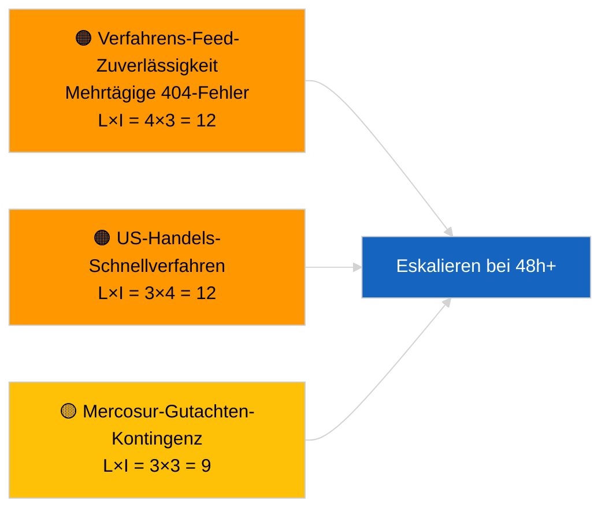
```mermaid
%%{init: {"theme":"dark"}}%%
graph LR
    R1["🟠 Verfahrens-Feed-Zuverlässigkeit<br/>Mehrtägige 404-Fehler<br/>L×I = 4×3 = 12"] --> CONS["Eskalieren bei 48h+"]
    R2["🟠 US-Handels-Schnellverfahren<br/>L×I = 3×4 = 12"] --> CONS
    R3["🟡 Mercosur-Gutachten-Kontingenz<br/>L×I = 3×3 = 9"] --> CONS
    style R1 fill:#FF9800,color:#000000
    style R2 fill:#FF9800,color:#000000
    style R3 fill:#FFC107,color:#000000
    style CONS fill:#1565C0,color:#FFFFFF
```

| Risiko | L | I | Wertung | Auslöser | Quelle | Admiralität |
|--------|:-:|:-:|:-------:|----------|--------|:-----------:|
| Verfahrens-Feed-Zuverlässigkeit | 4 | 3 | 12 | 48h+ anhaltende 404-Fehler | Geschwisterläufe | B2 |
| US-Handels-Schnellvorschlag | 3 | 4 | 12 | US-Maßnahme | TA-10-2026-0096 | A1 |
| Mercosur-Gutachten-Kontingenz | 3 | 3 | 9 | Gericht veröffentlicht | TA-10-2026-0008 | A2 |
| MFF-Vorbereitungsreibung | 3 | 4 | 12 | Q2-Kommissionsmitteilung | Kommissionsrhythmus | B2 |

---

### 🔮 Führender Vorwärtstrigger

**Kommissions-Kollegiumssitzung 7. April 2026** — erste Tagesordnung nach Ostern; Themengemisch kalibriert die Q2-Vorschlagsbeobachtungsliste.

---

### 🛡️ Quellqualitätsbewertung

- **Primärquellen:** EP-Offenes Datenportal; Ausführung `a3fdcdee-e95c-4a90-a4de-4c41509e1c1d`.
- **Datenbeschränkungen:** `get_procedures_feed` 404 verhindert Korroboration.
- **Zuversicht:** 🟡 MITTEL für Verfahrensabwesenheitsbehauptung; 🟢 HOCH für Kalender-Treiber.

---

### 📎 Links

| Link | Pfad |
|------|------|
| Artikel | `./article.md` |
| Geschwisterläufe | `analysis/daily/2026-04-02/breaking/`, `committee-reports/`, `motions/` |
| Manifest | `./manifest.json` |

---

**Dokumentenkontrolle**
- **Vorlage:** `/analysis/templates/executive-brief.md`
- **Artefaktpfad:** `analysis/daily/2026-04-02/propositions/executive-brief.md`
- **Klassifizierung:** Öffentlich
- **Retrospektive Erstellung:** Rückwirkende Befüllung.

### Executive Brief Es

### 🎯 BLUF

**No se abrieron nuevas propuestas de la Comisión ni procedimientos de iniciativa propia del PE el 2 de abril de 2026.** La ejecución `a3fdcdee-e95c-4a90-a4de-4c41509e1c1d` devolvió **0 actores clasificados** e importancia **RUTINARIA**, lo que refleja el estado vacío de 2026-04-01/propuestas. El patrón de 6/8 errores 404 en los flujos de asesoramiento registrado el 1 de abril de 2026 continúa; `get_procedures_feed` se encuentra entre los puntos de conexión afectados. El inventario sustantivo de propuestas al inicio de abril es por tanto la canalización heredada (marco de emisiones HDV TA-10-2026-0084, procedimiento vicepresidente BCE TA-10-2026-0060, informe de Legislar Mejor TA-10-2026-0063, remisión UE-Mercosur al TJUE TA-10-2026-0008). **🟢 ALTA confianza** en que el estado vacío se debe al calendario y a la disponibilidad de los flujos; **🟡 CONFIANZA MEDIA** sobre la ausencia de nuevos procedimientos durante la degradación de la API.

---

### 🧭 3 Decisiones que apoya este informe

| # | Decisión | Quién decide | Plazo | Evidencia |
|:-:|---------|-------------|:-----:|-----------|
| 1 | **Editorial:** OMITIR propuestas diariamente | Editor | +24h | Resultado de ejecución vacío |
| 2 | **Monitoreo:** continuar vigilancia del estado del flujo; marcar 48h+ de errores 404 de `get_procedures_feed` como incidente | Canal de datos | 2026-04-03 | Patrón sostenido |
| 3 | **Vigilancia prospectiva:** reunión del Colegio de la Comisión martes 7 de abril de 2026 — primera sesión post-Semana Santa | Responsable de análisis | 2026-04-07 | Cadencia de la Comisión |

---

### 📰 Lectura de 60 segundos

- 🔴 **Sin nuevos procedimientos** el 2 de abril de 2026; error 404 de `get_procedures_feed` continúa. (🟡 Medio)
- 🟠 **0 actores clasificados**; ningún comisario, DG ni ponente identificado. (🟢 Alto)
- 🟢 **Pipeline carry-over** ancla la lista de vigilancia de abril (HDV, BCE, Legislar Mejor, Mercosur). (🟢 Alto)
- 🟡 **Dimensiones de riesgo todas «ninguna»** hoy. (🟢 Alto)
- 🔵 **Contexto económico:** propuestas Q2 esperadas sobre normas de aplicación del Reglamento de IA, Estrategia Industrial de Defensa, comunicaciones preparatorias del MFP. (🟡 Medio)
- 🟣 **Referencia cruzada:** ejecuciones hermanas 2026-04-02 plantillas vacías; 2026-04-03/breaking-2 formaliza la preocupación de la API del flujo. (🟢 Alto)
- 🩷 **Vector de disrupción:** la presión comercial de EE. UU. podría forzar una propuesta de la Comisión por vía rápida en abril. (🟡 Medio)
- ⚪ **Carry-forward:** el dictamen del TJUE sobre Mercosur sigue siendo el detonante de propuesta pendiente de mayor impacto.

---

### 🗂️ Principales documentos/procedimientos — Seguimiento de propuestas

| Rango | Referencia PE | Título (abreviado) | Importancia | Confianza | Estado |
|:-----:|-------------|-------------------|:-----------:|:---------:|--------|
| 1 | — | No hay nuevas propuestas en 2026-04-02 | 0,0 | 🟡 MEDIO | Reserva error 404 flujo |
| 2 | TA-10-2026-0008 | Remisión UE-Mercosur al TJUE (pendiente) | 8,0 | 🟡 MEDIO | Dictamen del TJUE esperado |
| 3 | TA-10-2026-0084 | Créditos de emisiones HDV 2025–2029 | 7,0 | 🟢 ALTO | Canalización de transposición |

---

### ⚠️ Panorama de riesgos y amenazas

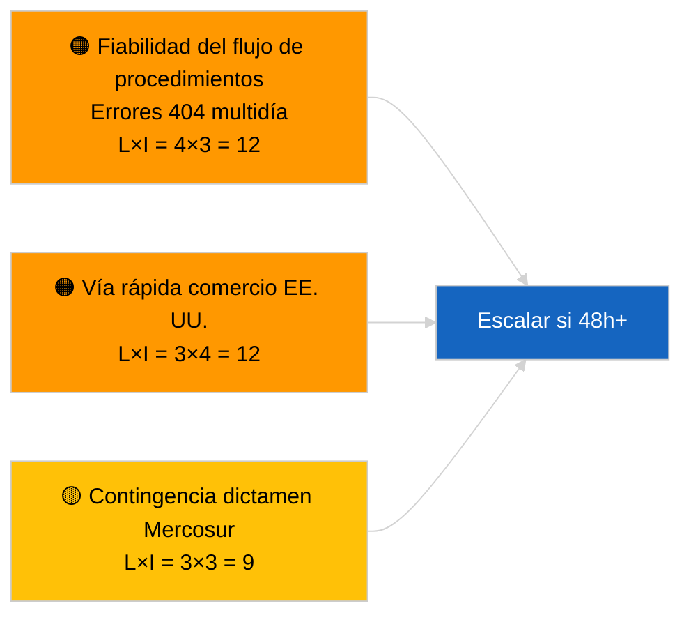
```mermaid
%%{init: {"theme":"dark"}}%%
graph LR
    R1["🟠 Fiabilidad del flujo de procedimientos<br/>Errores 404 multidía<br/>L×I = 4×3 = 12"] --> CONS["Escalar si 48h+"]
    R2["🟠 Vía rápida comercio EE. UU.<br/>L×I = 3×4 = 12"] --> CONS
    R3["🟡 Contingencia dictamen Mercosur<br/>L×I = 3×3 = 9"] --> CONS
    style R1 fill:#FF9800,color:#000000
    style R2 fill:#FF9800,color:#000000
    style R3 fill:#FFC107,color:#000000
    style CONS fill:#1565C0,color:#FFFFFF
```

| Riesgo | L | I | Puntuación | Desencadenante | Fuente | Almirantazgo |
|--------|:-:|:-:|:----------:|----------------|--------|:------------:|
| Fiabilidad del flujo de procedimientos | 4 | 3 | 12 | 404 persistente 48h+ | Ejecuciones hermanas | B2 |
| Propuesta vía rápida comercio EE. UU. | 3 | 4 | 12 | Acción de EE. UU. | TA-10-2026-0096 | A1 |
| Contingencia dictamen Mercosur | 3 | 3 | 9 | Publicación del TJUE | TA-10-2026-0008 | A2 |
| Fricción preparatoria MFP | 3 | 4 | 12 | Comunicación Comisión Q2 | Cadencia Comisión | B2 |

---

### 🔮 Principal desencadenante prospectivo

**Reunión del Colegio de la Comisión, martes 7 de abril de 2026** — primera sesión de programación post-Semana Santa; la combinación temática calibra la lista de seguimiento de propuestas Q2.

---

### 🛡️ Evaluación de la calidad de las fuentes

- **Fuentes primarias:** Portal de datos abiertos del PE; ejecución `a3fdcdee-e95c-4a90-a4de-4c41509e1c1d`.
- **Limitaciones de los datos:** `get_procedures_feed` 404 impide la corroboración.
- **Confianza:** 🟡 MEDIO para la afirmación de ausencia de procedimientos; 🟢 ALTO para el motor calendario.

---

### 📎 Enlaces

| Enlace | Ruta |
|--------|------|
| Artículo | `./article.md` |
| Ejecuciones hermanas | `analysis/daily/2026-04-02/breaking/`, `committee-reports/`, `motions/` |
| Manifiesto | `./manifest.json` |

---

**Control de documentos**
- **Plantilla:** `/analysis/templates/executive-brief.md`
- **Ruta del artefacto:** `analysis/daily/2026-04-02/propositions/executive-brief.md`
- **Clasificación:** Público
- **Generación retrospectiva:** Sesión de relleno.

### Executive Brief Fi

### 🎯 BLUF

**Uusia komission ehdotuksia tai EP:n omia aloitemenettelyjä ei avattu 2. huhtikuuta 2026.** Ajo `a3fdcdee-e95c-4a90-a4de-4c41509e1c1d` palautti **0 luokiteltua toimijaa** ja **RUTIINITASON** merkityksen, mikä heijastaa 2026-04-01/ehdotusten tyhjää tilaa. 1. huhtikuuta 2026 kirjattu 6/8 neuvontavirta-404-virheideenmalli jatkuu; `get_procedures_feed` kuuluu vaikuttaneisiin päätepisteisiin. Huhtikuun alussa käytössä oleva substantiivinen ehdotusvarasto on siis peritty putkilinja (HDV-päästökehys TA-10-2026-0084, EKP:n varapuheenjohtajamenettely TA-10-2026-0060, Paremman sääntelyn raportti TA-10-2026-0063, EU-Mercosur ECJ-ennakkoratkaisu TA-10-2026-0008). **🟢 KORKEA luottamustaso** siihen, että tyhjä tila johtuu kalenterista ja syötteen saatavuudesta; **🟡 KESKITASOINEN luottamustaso** uusien menettelyjen puuttumiselle API-heikentymisen aikana.

---

### 🧭 3 päätöstä, joita tämä raportti tukee

| # | Päätös | Kuka päättää | Määräaika | Näyttö |
|:-:|--------|--------------|:---------:|--------|
| 1 | **Toimituksellinen:** OHITA ehdotukset päivittäin | Toimittaja | +24h | Tyhjä ajotuloste |
| 2 | **Seuranta:** jatka syötteen terveydentilan seurantaa; merkitse 48h+ `get_procedures_feed` 404-virheet tapahtumaksi | Datapipeline | 2026-04-03 | Pysyvä malli |
| 3 | **Eteenpäin katsova seuranta:** Komission tiistaikokous 7. huhtikuuta 2026 — ensimmäinen pääsiäisen jälkeinen kollegiokäsittely | Analyysipäällikkö | 2026-04-07 | Komission tahti |

---

### 📰 60 sekunnin luku

- 🔴 **Ei uusia menettelyjä** 2. huhtikuuta 2026; `get_procedures_feed` 404 jatkuu. (🟡 Keskiluokan)
- 🟠 **0 toimijaa luokiteltu**; ei komissaaria, pääosastoa tai esittelijää tunnistettu. (🟢 Korkea)
- 🟢 **Putkilinjan carry-over** ankkuroi huhtikuun seurantalistan (HDV, EKP, Parempi sääntely, Mercosur). (🟢 Korkea)
- 🟡 **Riskidimensiot kaikki "ei mitään"** tänään. (🟢 Korkea)
- 🔵 **Taloudellinen konteksti:** odotetut Q2-ehdotukset tekoälylain täytäntöönpanosäännöistä, Puolustusalan teollisesta strategiasta, MFF:n valmistelevista tiedonannoista. (🟡 Keskiluokan)
- 🟣 **Ristiviittaus:** sisarusajot 2026-04-02 tyhjät pohjat; 2026-04-03/breaking-2 muodollistaa syöte-API-huolen. (🟢 Korkea)
- 🩷 **Häiriövektori:** Yhdysvaltain kauppapaine voi pakottaa pikamenettelykohteisen komission ehdotuksen huhtikuussa. (🟡 Keskiluokan)
- ⚪ **Carry-forward:** Mercosur ECJ:n lausunto on edelleen odottavista ehdotusten laukaisimista vaikutukseltaan suurin.

---

### 🗂️ Huipputiedostot/menettelyt — Ehdotusten seuranta

| Sija | EP-viittaus | Otsikko (lyhyt) | Merkitys | Luottamustaso | Tila |
|:----:|-------------|-----------------|:--------:|:-------------:|------|
| 1 | — | Ei uusia ehdotuksia 2026-04-02 | 0,0 | 🟡 KESKILUOKAN | Syöte-404-varaus |
| 2 | TA-10-2026-0008 | EU-Mercosur ECJ-ennakkoratkaisu (vireillä) | 8,0 | 🟡 KESKILUOKAN | Tuomioistuimen lausunto odottaa |
| 3 | TA-10-2026-0084 | HDV-päästöhyvitykset 2025–2029 | 7,0 | 🟢 KORKEA | Implementointipipeline |

---

### ⚠️ Riski- ja uhkakatsaus

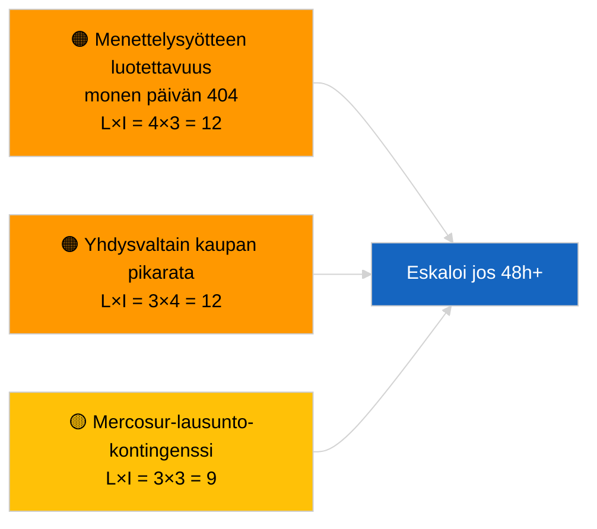
```mermaid
%%{init: {"theme":"dark"}}%%
graph LR
    R1["🟠 Menettelysyötteen luotettavuus<br/>monen päivän 404<br/>L×I = 4×3 = 12"] --> CONS["Eskaloi jos 48h+"]
    R2["🟠 Yhdysvaltain kaupan pikarata<br/>L×I = 3×4 = 12"] --> CONS
    R3["🟡 Mercosur-lausunto-kontingenssi<br/>L×I = 3×3 = 9"] --> CONS
    style R1 fill:#FF9800,color:#000000
    style R2 fill:#FF9800,color:#000000
    style R3 fill:#FFC107,color:#000000
    style CONS fill:#1565C0,color:#FFFFFF
```

| Riski | L | I | Pistemäärä | Laukaisin | Lähde | Amiraalisuus |
|-------|:-:|:-:|:----------:|-----------|-------|:------------:|
| Menettelysyötteen luotettavuus | 4 | 3 | 12 | 48h+ pysyvä 404 | Sisarusajot | B2 |
| Yhdysvaltain kaupan pikaehdotus | 3 | 4 | 12 | Yhdysvaltain toimi | TA-10-2026-0096 | A1 |
| Mercosur-lausunto-kontingenssi | 3 | 3 | 9 | Tuomioistuin julkaisee | TA-10-2026-0008 | A2 |
| MFF-valmisteleva kitka | 3 | 4 | 12 | Q2-komission tiedonanto | Komission tahti | B2 |

---

### 🔮 Johtava eteenpäin katsova laukaisin

**Komission tiistaikokous 7. huhtikuuta 2026** — ensimmäinen pääsiäisen jälkeinen kollegiokäsittely; aiheiden yhdistelmä kalibroi Q2-ehdotusten seurantalistaa.

---

### 🛡️ Lähteen laadun arviointi

- **Ensisijaiset lähteet:** EP:n avoin dataportti; ajo `a3fdcdee-e95c-4a90-a4de-4c41509e1c1d`.
- **Datan rajoitukset:** `get_procedures_feed` 404 estää korroboraation.
- **Luottamustaso:** 🟡 KESKILUOKAN menettelyen puuttumista koskevaan väitteeseen; 🟢 KORKEA kalenteriajuriin.

---

### 📎 Linkit

| Linkki | Polku |
|--------|-------|
| Artikkeli | `./article.md` |
| Sisarusajot | `analysis/daily/2026-04-02/breaking/`, `committee-reports/`, `motions/` |
| Manifesti | `./manifest.json` |

---

**Asiakirjavalvonta**
- **Pohja:** `/analysis/templates/executive-brief.md`
- **Artefaktipolku:** `analysis/daily/2026-04-02/propositions/executive-brief.md`
- **Luokitus:** Julkinen
- **Retrospektiivinen luominen:** Täyttöistunto.

### Executive Brief Fr

### 🎯 BLUF

**Aucune nouvelle proposition de la Commission ni nouvelle procédure d'initiative propre du PE n'a été ouverte le 2 avril 2026.** L'exécution `a3fdcdee-e95c-4a90-a4de-4c41509e1c1d` a renvoyé **0 acteur classifié** et une importance **ROUTINIÈRE**, reflétant l'état vide de 2026-04-01/propositions. Le schéma de 6/8 erreurs 404 sur les flux consultatifs consigné le 1er avril 2026 persiste ; `get_procedures_feed` figure parmi les points de terminaison affectés. L'inventaire substantiel des propositions à l'entrée d'avril est donc la chaîne héritée (cadre d'émissions HDV TA-10-2026-0084, procédure vice-président BCE TA-10-2026-0060, rapport Mieux légiférer TA-10-2026-0063, renvoi UE-Mercosur Cour de justice TA-10-2026-0008). **🟢 HAUTE confiance** que l'état vide est dû au calendrier et à la disponibilité des flux ; **🟡 CONFIANCE MOYENNE** quant à l'absence de nouvelles procédures pendant la dégradation de l'API.

---

### 🧭 3 Décisions que ce rapport éclaire

| # | Décision | Décideur | Délai | Éléments probants |
|:-:|---------|----------|:-----:|-------------------|
| 1 | **Éditorial :** IGNORER les propositions quotidiennes | Rédacteur | +24h | Résultat d'exécution vide |
| 2 | **Surveillance :** poursuivre le suivi de l'état des flux ; signaler 48h+ d'erreurs 404 de `get_procedures_feed` comme incident | Chaîne de données | 2026-04-03 | Schéma persistant |
| 3 | **Veille prospective :** réunion du collège de la Commission mardi 7 avril 2026 — première mise à l'ordre du jour post-Pâques | Responsable d'analyse | 2026-04-07 | Cadence de la Commission |

---

### 📰 Lecture en 60 secondes

- 🔴 **Aucune nouvelle procédure** le 2 avril 2026 ; erreur 404 de `get_procedures_feed` persiste. (🟡 Moyen)
- 🟠 **0 acteur classifié** ; aucun commissaire, DG ni rapporteur identifié. (🟢 Élevé)
- 🟢 **Carry-over de la chaîne** ancre la liste de surveillance d'avril (HDV, BCE, Mieux légiférer, Mercosur). (🟢 Élevé)
- 🟡 **Dimensions de risque toutes « aucune »** aujourd'hui. (🟢 Élevé)
- 🔵 **Contexte économique :** propositions Q2 attendues sur les règles d'exécution du règlement sur l'IA, la stratégie industrielle de défense, les communications préparatoires du CFP. (🟡 Moyen)
- 🟣 **Référence croisée :** exécutions sœurs 2026-04-02 modèles vides ; 2026-04-03/breaking-2 formalise le problème de l'API de flux. (🟢 Élevé)
- 🩷 **Vecteur de perturbation :** la pression commerciale américaine pourrait forcer une proposition de la Commission en procédure accélérée en avril. (🟡 Moyen)
- ⚪ **Carry-forward :** l'avis de la Cour de justice sur Mercosur demeure le déclencheur de propositions en attente le plus impactant.

---

### 🗂️ Principaux documents/procédures — Veille sur les propositions

| Rang | Référence PE | Titre (abrégé) | Importance | Confiance | Statut |
|:----:|-------------|---------------|:----------:|:---------:|--------|
| 1 | — | Aucune nouvelle proposition le 2026-04-02 | 0,0 | 🟡 MOYEN | Réserve erreur 404 flux |
| 2 | TA-10-2026-0008 | Renvoi UE-Mercosur Cour de justice (en attente) | 8,0 | 🟡 MOYEN | Avis de la Cour attendu |
| 3 | TA-10-2026-0084 | Crédits d'émissions HDV 2025–2029 | 7,0 | 🟢 ÉLEVÉ | Chaîne de transposition |

---

### ⚠️ Aperçu des risques et menaces

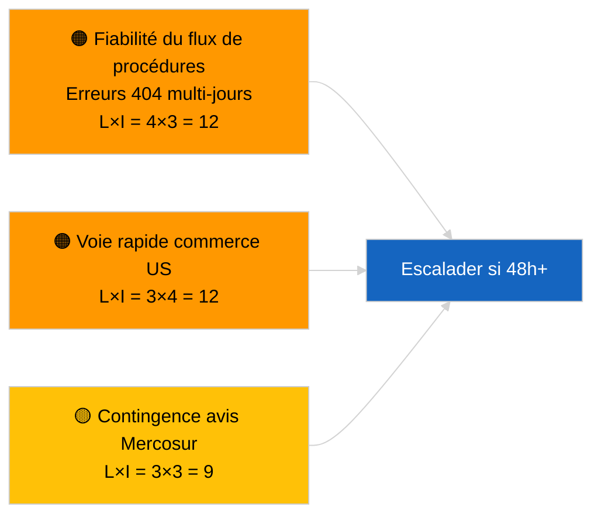
```mermaid
%%{init: {"theme":"dark"}}%%
graph LR
    R1["🟠 Fiabilité du flux de procédures<br/>Erreurs 404 multi-jours<br/>L×I = 4×3 = 12"] --> CONS["Escalader si 48h+"]
    R2["🟠 Voie rapide commerce US<br/>L×I = 3×4 = 12"] --> CONS
    R3["🟡 Contingence avis Mercosur<br/>L×I = 3×3 = 9"] --> CONS
    style R1 fill:#FF9800,color:#000000
    style R2 fill:#FF9800,color:#000000
    style R3 fill:#FFC107,color:#000000
    style CONS fill:#1565C0,color:#FFFFFF
```

| Risque | L | I | Score | Déclencheur | Source | Amirauté |
|--------|:-:|:-:|:-----:|-------------|--------|:--------:|
| Fiabilité du flux de procédures | 4 | 3 | 12 | 404 persistante 48h+ | Exécutions sœurs | B2 |
| Proposition de voie rapide commerce US | 3 | 4 | 12 | Action américaine | TA-10-2026-0096 | A1 |
| Contingence avis Mercosur | 3 | 3 | 9 | Publication de la Cour | TA-10-2026-0008 | A2 |
| Friction préparatoire CFP | 3 | 4 | 12 | Communication Commission Q2 | Cadence Commission | B2 |

---

### 🔮 Principal déclencheur prospectif

**Réunion du collège de la Commission, mardi 7 avril 2026** — première mise à l'ordre du jour post-Pâques ; le mélange thématique calibre la liste de veille Q2 des propositions.

---

### 🛡️ Évaluation de la qualité des sources

- **Sources primaires :** Portail de données ouvertes du PE ; exécution `a3fdcdee-e95c-4a90-a4de-4c41509e1c1d`.
- **Limites des données :** `get_procedures_feed` 404 empêche la corroboration.
- **Confiance :** 🟡 MOYEN pour l'affirmation d'absence de procédure ; 🟢 ÉLEVÉ pour le moteur calendaire.

---

### 📎 Liens

| Lien | Chemin |
|------|--------|
| Article | `./article.md` |
| Exécutions sœurs | `analysis/daily/2026-04-02/breaking/`, `committee-reports/`, `motions/` |
| Manifeste | `./manifest.json` |

---

**Contrôle documentaire**
- **Modèle :** `/analysis/templates/executive-brief.md`
- **Chemin d'artefact :** `analysis/daily/2026-04-02/propositions/executive-brief.md`
- **Classification :** Public
- **Génération rétrospective :** Session de remplissage.

### Executive Brief He

**סיווג:** OSINT | תיעוד פרלמנטרי ציבורי
**רמת אמינות:** 🟢 גבוהה (הערכה מבנית בתקופת הפסקה פרלמנטרית)
**נוצר:** 2026-04-02T00:00:00Z (דוח רטרוספקטיבי)
**סוג מאמר:** הצעות
**מזהה הרצה:** `a3fdcdee-e95c-4a90-a4de-4c41509e1c1d`
**מקור:** פורטל הנתונים הפתוחים של הפרלמנט האירופי

---

### 🎯 BLUF

**לא נפתחו הצעות חדשות של המפקדה או הליכי יוזמה עצמית של הפרלמנט האירופי ב-2 באפריל 2026.** הרצה `a3fdcdee-e95c-4a90-a4de-4c41509e1c1d` החזירה **0 שחקנים מסווגים** ומשמעות **שגרתית**, המשקפת את המצב הריק של 2026-04-01/הצעות. דפוס 6/8 שגיאות 404 בזרמי ייעוץ שנרשם ב-1 באפריל 2026 נמשך; `get_procedures_feed` נמנה עם נקודות הקצה המושפעות. מלאי ההצעות המהותי בכניסה לאפריל הוא אפוא הצינור הקיים (מסגרת פליטות HDV TA-10-2026-0084, הליך סגן נשיא ה-ECB TA-10-2026-0060, דוח חקיקה טובה יותר TA-10-2026-0063, הפניית האיחוד האירופי-מרקוסור ל-ECJ TA-10-2026-0008). **🟢 אמינות גבוהה** שהמצב הריק מונע מלוח שנה וזמינות זרם נתונים; **🟡 אמינות בינונית** לגבי היעדר הליכים חדשים בעת שחיקת ה-API.

---

### 🧭 3 החלטות שדוח זה תומך בהן

| # | החלטה | מי מחליט | מועד | ראיות |
|:-:|--------|---------|:----:|-------|
| 1 | **עריכתי:** דלג על הצעות יומיות | עורך | +24 שעות | תפוקת הרצה ריקה |
| 2 | **מעקב:** המשך ניטור בריאות זרם; סמן 48+ שעות של שגיאות 404 של `get_procedures_feed` כתקרית | צינור נתונים | 2026-04-03 | דפוס מתמשך |
| 3 | **ניטור קדימה:** פגישת המכללה של המפקדה יום שלישי 7 באפריל 2026 — סדר יום ראשון אחרי חג הפסחא | ראש ניתוח | 2026-04-07 | קצב המפקדה |

---

### 📰 קריאה של 60 שניות

- 🔴 **ללא הליכים חדשים** ב-2 באפריל 2026; שגיאת 404 של `get_procedures_feed` נמשכת. (🟡 בינוני)
- 🟠 **0 שחקנים מסווגים**; לא זוהה קומיסר, מנהלייה כללית או מדווח. (🟢 גבוה)
- 🟢 **העברת צינור** מעגנת רשימת מעקב אפריל (HDV, ECB, חקיקה טובה יותר, מרקוסור). (🟢 גבוה)
- 🟡 **ממדי סיכון כולם "אין"** היום. (🟢 גבוה)
- 🔵 **הקשר כלכלי:** הצעות Q2 צפויות לכללי יישום חוק הבינה המלאכותית, אסטרטגיה תעשייתית ביטחונית, תקשורות מקדימות ל-MFF. (🟡 בינוני)
- 🟣 **הפניה צולבת:** הרצות-אחיות 2026-04-02 תבניות ריקות; 2026-04-03/breaking-2 ממסד את חשש ה-API של הזרם. (🟢 גבוה)
- 🩷 **וקטור הפרעה:** לחץ סחר אמריקני עשוי לאלץ הצעת מפקדה בנתיב מהיר באפריל. (🟡 בינוני)
- ⚪ **העברה קדימה:** חוות דעת ECJ לגבי מרקוסור נשארת הטריגר הממתין בעל ההשפעה הגבוהה ביותר.

---

### 🗂️ מסמכים/הליכים מובילים — מעקב הצעות

| דרוג | הפניית הפרלמנט האירופי | כותרת (קצרה) | חשיבות | אמינות | סטטוס |
|:----:|----------------------|------------|:------:|:------:|--------|
| 1 | — | ללא הצעות חדשות ב-2026-04-02 | 0.0 | 🟡 בינוני | הסתייגות שגיאת 404 בזרם |
| 2 | TA-10-2026-0008 | הפניית האיחוד האירופי-מרקוסור ל-ECJ (תלויה) | 8.0 | 🟡 בינוני | חוות דעת בית המשפט צפויה |
| 3 | TA-10-2026-0084 | קרדיטים לפליטות HDV 2025–2029 | 7.0 | 🟢 גבוה | צינור השתלה |

---

### ⚠️ תמונת מצב סיכונים ואיומים

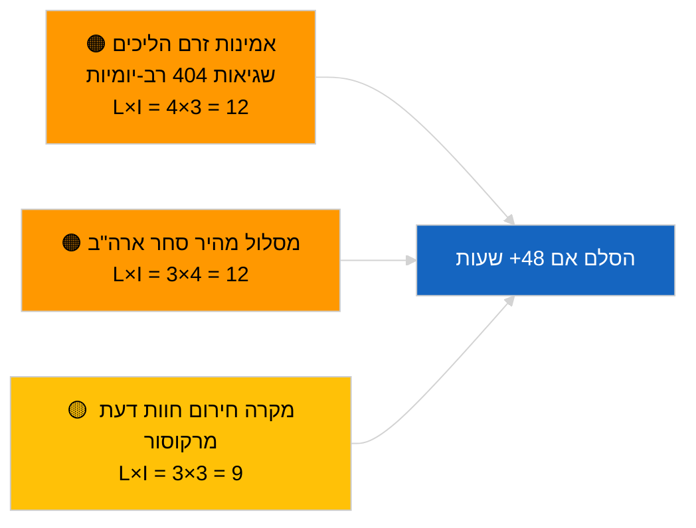
```mermaid
%%{init: {"theme":"dark"}}%%
graph LR
    R1["🟠 אמינות זרם הליכים<br/>שגיאות 404 רב-יומיות<br/>L×I = 4×3 = 12"] --> CONS["הסלם אם 48+ שעות"]
    R2["🟠 מסלול מהיר סחר ארה&quot;ב<br/>L×I = 3×4 = 12"] --> CONS
    R3["🟡 מקרה חירום חוות דעת מרקוסור<br/>L×I = 3×3 = 9"] --> CONS
    style R1 fill:#FF9800,color:#000000
    style R2 fill:#FF9800,color:#000000
    style R3 fill:#FFC107,color:#000000
    style CONS fill:#1565C0,color:#FFFFFF
```

| סיכון | L | I | ציון | טריגר | מקור | אדמירלות |
|-------|:-:|:-:|:----:|-------|------|:---------:|
| אמינות זרם הליכים | 4 | 3 | 12 | 48+ שעות שגיאת 404 מתמשכת | הרצות-אחיות | B2 |
| הצעת מסלול מהיר לסחר ארה"ב | 3 | 4 | 12 | פעולה אמריקאית | TA-10-2026-0096 | A1 |
| מקרה חירום חוות דעת מרקוסור | 3 | 3 | 9 | בית המשפט מפרסם | TA-10-2026-0008 | A2 |
| חיכוך הכנת MFF | 3 | 4 | 12 | תקשורת מפקדה Q2 | קצב המפקדה | B2 |

---

### 🔮 הטריגר הקדימי המוביל

**פגישת המכללה של המפקדה, יום שלישי 7 באפריל 2026** — סדר יום ראשון אחרי חג הפסחא; תמהיל הנושאים מכייל את רשימת מעקב ההצעות ל-Q2.

---

### 🛡️ הערכת איכות מקורות

- **מקורות ראשוניים:** פורטל הנתונים הפתוחים של הפרלמנט האירופי; הרצה `a3fdcdee-e95c-4a90-a4de-4c41509e1c1d`.
- **מגבלות נתונים:** שגיאת 404 של `get_procedures_feed` מונעת אישוש.
- **אמינות:** 🟡 בינוני לטענת היעדר הליכים; 🟢 גבוה לגורם לוח השנה.

---

### 📎 קישורים

| קישור | נתיב |
|-------|------|
| מאמר | `./article.md` |
| הרצות-אחיות | `analysis/daily/2026-04-02/breaking/`, `committee-reports/`, `motions/` |
| מניפסט | `./manifest.json` |

---

**בקרת מסמכים**
- **תבנית:** `/analysis/templates/executive-brief.md`
- **נתיב ארטיפקט:** `analysis/daily/2026-04-02/propositions/executive-brief.md`
- **סיווג:** ציבורי
- **יצירה רטרוספקטיבית:** סשן מילוי.

### Executive Brief Ja

**分類:** OSINT | 公開議会記録
**信頼度:** 🟢 高（議会休会期間中の構造的評価）
**作成日時:** 2026-04-02T00:00:00Z（遡及レポート）
**記事タイプ:** 提案
**実行ID:** `a3fdcdee-e95c-4a90-a4de-4c41509e1c1d`
**出典:** 欧州議会オープンデータポータル

---

### 🎯 BLUF

**2026年4月2日に新規の委員会提案または欧州議会独自の提案手続きは開始されませんでした。** 実行 `a3fdcdee-e95c-4a90-a4de-4c41509e1c1d` は**0件の分類済みアクター**と**ルーティン**の重要度を返し、2026-04-01/提案の空状態を反映しています。2026年4月1日に記録された6/8の助言フィード404エラーパターンが継続中であり、`get_procedures_feed` も影響を受けているエンドポイントに含まれます。したがって4月初頭の実質的な提案在庫は継承パイプライン（HDV排出枠組み TA-10-2026-0084、ECB副総裁手続き TA-10-2026-0060、よりよい立法報告 TA-10-2026-0063、EU-メルコスールECJ付託 TA-10-2026-0008）です。空状態がカレンダーとフィード可用性によるものという**🟢 高い信頼度**；API劣化中の新手続き不在については**🟡 中程度の信頼度**。

---

### 🧭 本レポートが支援する3つの意思決定

| # | 意思決定 | 決定者 | 期限 | 根拠 |
|:-:|---------|--------|:----:|------|
| 1 | **編集判断:** 提案の日次配信をスキップ | 編集者 | +24時間 | 実行結果が空 |
| 2 | **モニタリング:** フィード健全性監視を継続；`get_procedures_feed` 404エラーが48時間以上続いた場合はインシデントとして記録 | データパイプライン | 2026-04-03 | 持続パターン |
| 3 | **先行監視:** 2026年4月7日（火）委員会コレジウム会議 — イースター後初の議題設定 | 分析責任者 | 2026-04-07 | 委員会のペース |

---

### 📰 60秒読了

- 🔴 2026年4月2日に**新規手続きなし**；`get_procedures_feed` 404継続中。（🟡 中）
- 🟠 **0件のアクター分類**；委員、DG、報告者いずれも特定されず。（🟢 高）
- 🟢 **パイプライン繰越**が4月の監視リストを固定（HDV、ECB、よりよい立法、メルコスール）。（🟢 高）
- 🟡 **リスク次元はすべて「なし」**（本日）。（🟢 高）
- 🔵 **経済的文脈:** Q2に予定される提案——AI法施行規則、防衛産業戦略、MFF準備的コミュニケーション。（🟡 中）
- 🟣 **クロスリファレンス:** 姉妹実行 2026-04-02 は空テンプレート；2026-04-03/breaking-2 がフィードAPI懸念を正式化。（🟢 高）
- 🩷 **混乱ベクター:** 米国貿易圧力により4月に迅速手続きの委員会提案が強制される可能性。（🟡 中）
- ⚪ **繰越:** メルコスールECJ意見は依然として最も影響の大きい保留中の提案トリガー。

---

### 🗂️ 主要文書/手続き — 提案監視

| 順位 | EP参照番号 | タイトル（略称） | 重要度 | 信頼度 | 状態 |
|:---:|----------|----------------|:------:|:------:|------|
| 1 | — | 2026-04-02に新規提案なし | 0.0 | 🟡 中 | フィード404留保 |
| 2 | TA-10-2026-0008 | EU-メルコスールECJ付託（係属中） | 8.0 | 🟡 中 | 裁判所意見待ち |
| 3 | TA-10-2026-0084 | HDV排出クレジット2025–2029 | 7.0 | 🟢 高 | 移植パイプライン |

---

### ⚠️ リスク・脅威スナップショット

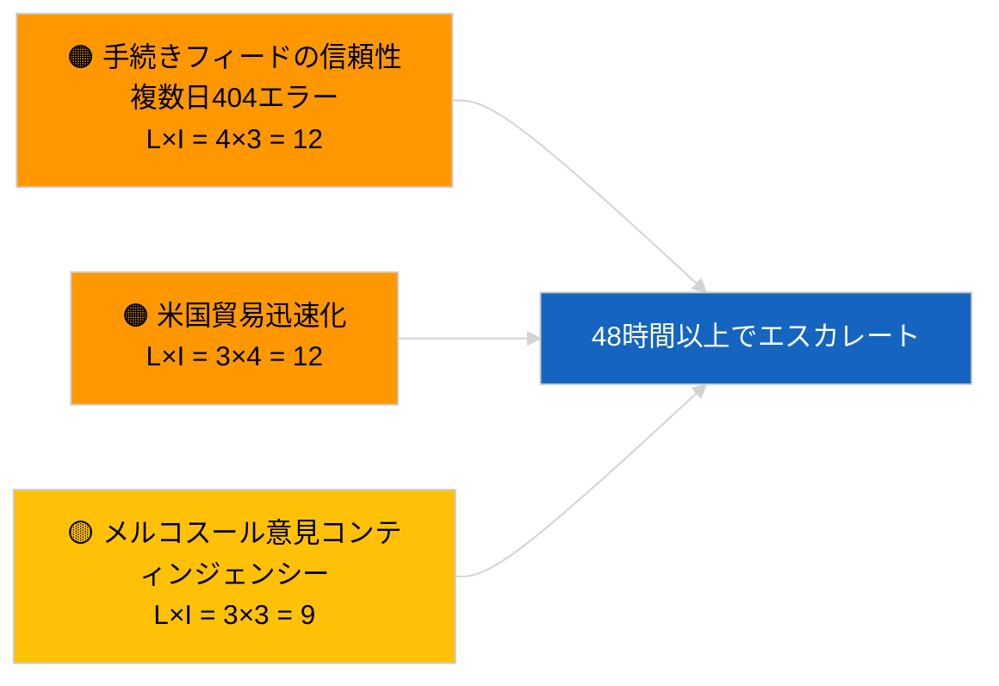
```mermaid
%%{init: {"theme":"dark"}}%%
graph LR
    R1["🟠 手続きフィードの信頼性<br/>複数日404エラー<br/>L×I = 4×3 = 12"] --> CONS["48時間以上でエスカレート"]
    R2["🟠 米国貿易迅速化<br/>L×I = 3×4 = 12"] --> CONS
    R3["🟡 メルコスール意見コンティンジェンシー<br/>L×I = 3×3 = 9"] --> CONS
    style R1 fill:#FF9800,color:#000000
    style R2 fill:#FF9800,color:#000000
    style R3 fill:#FFC107,color:#000000
    style CONS fill:#1565C0,color:#FFFFFF
```

| リスク | L | I | スコア | トリガー | 出典 | アドミラリティ |
|--------|:-:|:-:|:------:|---------|------|:------------:|
| 手続きフィードの信頼性 | 4 | 3 | 12 | 48時間以上の持続的404 | 姉妹実行 | B2 |
| 米国貿易迅速化提案 | 3 | 4 | 12 | 米国の行動 | TA-10-2026-0096 | A1 |
| メルコスール意見コンティンジェンシー | 3 | 3 | 9 | 裁判所が発表 | TA-10-2026-0008 | A2 |
| MFF準備摩擦 | 3 | 4 | 12 | Q2委員会コミュニケーション | 委員会のペース | B2 |

---

### 🔮 主要な先行トリガー

**2026年4月7日（火）委員会コレジウム会議** — イースター後初の議題設定；テーマの組み合わせがQ2提案監視リストを調整。

---

### 🛡️ 情報源の品質評価

- **一次情報源:** 欧州議会オープンデータポータル；実行 `a3fdcdee-e95c-4a90-a4de-4c41509e1c1d`。
- **データ制限:** `get_procedures_feed` 404により裏付けが不可。
- **信頼度:** 手続き不在の主張について 🟡 中；カレンダー要因については 🟢 高。

---

### 📎 リンク

| リンク | パス |
|--------|------|
| 記事 | `./article.md` |
| 姉妹実行 | `analysis/daily/2026-04-02/breaking/`, `committee-reports/`, `motions/` |
| マニフェスト | `./manifest.json` |

---

**文書管理**
- **テンプレート:** `/analysis/templates/executive-brief.md`
- **アーティファクトパス:** `analysis/daily/2026-04-02/propositions/executive-brief.md`
- **分類:** 公開
- **遡及生成:** バックフィルセッション。

### Executive Brief Ko

**분류:** OSINT | 공개 의회 기록
**신뢰도:** 🟢 높음（의회 휴회 기간 중 구조적 평가）
**생성일시:** 2026-04-02T00:00:00Z（소급 보고서）
**기사 유형:** 제안
**실행 ID:** `a3fdcdee-e95c-4a90-a4de-4c41509e1c1d`
**출처:** 유럽의회 오픈데이터 포털

---

### 🎯 BLUF

**2026년 4월 2일에 새로운 집행위원회 제안이나 유럽의회 자체 발의 절차가 개시되지 않았습니다.** 실행 `a3fdcdee-e95c-4a90-a4de-4c41509e1c1d`는 **0건의 분류된 행위자**와 **일상적** 중요도를 반환하여 2026-04-01/제안의 빈 상태를 반영하였습니다. 2026년 4월 1일에 기록된 6/8 자문 피드 404 오류 패턴이 지속되고 있으며, `get_procedures_feed`도 영향을 받는 엔드포인트에 포함됩니다. 따라서 4월 초 실질적인 제안 재고는 상속된 파이프라인（HDV 배출 체계 TA-10-2026-0084, ECB 부총재 절차 TA-10-2026-0060, 더 나은 입법 보고서 TA-10-2026-0063, EU-메르코수르 ECJ 회부 TA-10-2026-0008）입니다. 빈 상태가 달력과 피드 가용성에 의한 것이라는 **🟢 높은 신뢰도**；API 저하 중 새 절차 부재에 대한 **🟡 중간 신뢰도**.

---

### 🧭 이 보고서가 지원하는 3가지 결정

| # | 결정 | 결정자 | 기한 | 근거 |
|:-:|------|--------|:----:|------|
| 1 | **편집 판단:** 일간 제안 건너뛰기 | 편집자 | +24시간 | 실행 결과 비어있음 |
| 2 | **모니터링:** 피드 건강 상태 감시 지속；`get_procedures_feed` 404 오류가 48시간 이상 지속되면 사건으로 기록 | 데이터 파이프라인 | 2026-04-03 | 지속 패턴 |
| 3 | **선행 감시:** 2026년 4월 7일（화）집행위원회 의회 회의 — 부활절 후 첫 의제 설정 | 분석 책임자 | 2026-04-07 | 집행위원회 일정 |

---

### 📰 60초 읽기

- 🔴 2026년 4월 2일 **새 절차 없음**；`get_procedures_feed` 404 지속. （🟡 중간）
- 🟠 **0명의 행위자 분류**；위원, DG, 보고자 누구도 식별되지 않음. （🟢 높음）
- 🟢 **파이프라인 이월**이 4월 감시 목록 고정（HDV, ECB, 더 나은 입법, 메르코수르）. （🟢 높음）
- 🟡 **리스크 차원 모두 "없음"**（오늘）. （🟢 높음）
- 🔵 **경제적 맥락:** Q2에 예상되는 제안 — AI법 시행규칙, 방산 전략, MFF 준비 통보. （🟡 중간）
- 🟣 **교차 참조:** 자매 실행 2026-04-02 빈 템플릿；2026-04-03/breaking-2가 피드 API 우려를 공식화. （🟢 높음）
- 🩷 **혼란 벡터:** 미국 무역 압박으로 4월에 신속 절차 집행위원회 제안이 강제될 가능성. （🟡 중간）
- ⚪ **이월:** 메르코수르 ECJ 의견은 여전히 보류 중인 제안 트리거 중 가장 영향력이 큼.

---

### 🗂️ 주요 문서/절차 — 제안 모니터링

| 순위 | EP 참조번호 | 제목（약칭） | 중요도 | 신뢰도 | 상태 |
|:---:|-----------|------------|:------:|:------:|------|
| 1 | — | 2026-04-02에 새 제안 없음 | 0.0 | 🟡 중간 | 피드 404 유보 |
| 2 | TA-10-2026-0008 | EU-메르코수르 ECJ 회부（계류 중） | 8.0 | 🟡 중간 | 법원 의견 대기 |
| 3 | TA-10-2026-0084 | HDV 배출 크레딧 2025–2029 | 7.0 | 🟢 높음 | 이식 파이프라인 |

---

### ⚠️ 리스크 및 위협 스냅숏

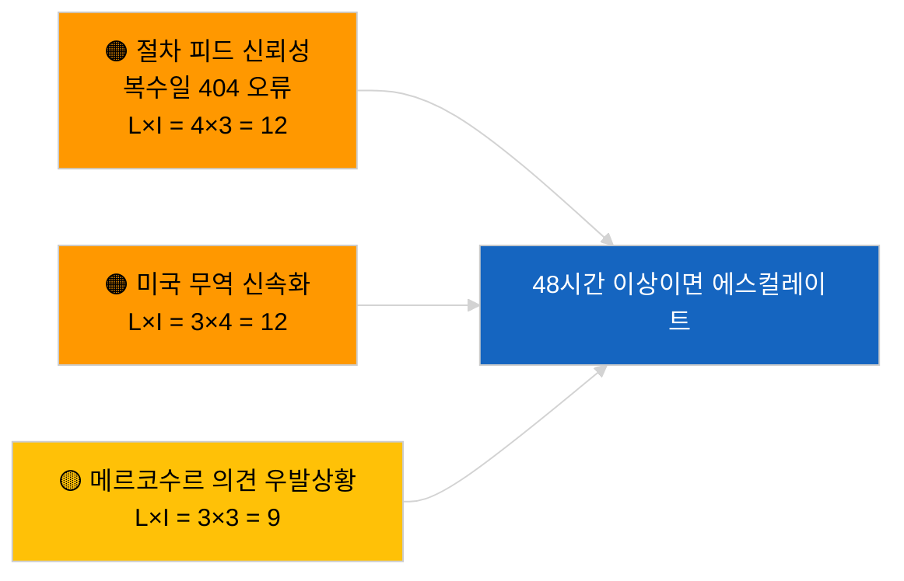
```mermaid
%%{init: {"theme":"dark"}}%%
graph LR
    R1["🟠 절차 피드 신뢰성<br/>복수일 404 오류<br/>L×I = 4×3 = 12"] --> CONS["48시간 이상이면 에스컬레이트"]
    R2["🟠 미국 무역 신속화<br/>L×I = 3×4 = 12"] --> CONS
    R3["🟡 메르코수르 의견 우발상황<br/>L×I = 3×3 = 9"] --> CONS
    style R1 fill:#FF9800,color:#000000
    style R2 fill:#FF9800,color:#000000
    style R3 fill:#FFC107,color:#000000
    style CONS fill:#1565C0,color:#FFFFFF
```

| 리스크 | L | I | 점수 | 트리거 | 출처 | 해군성 |
|--------|:-:|:-:|:----:|--------|------|:------:|
| 절차 피드 신뢰성 | 4 | 3 | 12 | 48시간 이상 지속 404 | 자매 실행 | B2 |
| 미국 무역 신속 제안 | 3 | 4 | 12 | 미국의 행동 | TA-10-2026-0096 | A1 |
| 메르코수르 의견 우발상황 | 3 | 3 | 9 | 법원 발표 | TA-10-2026-0008 | A2 |
| MFF 준비 마찰 | 3 | 4 | 12 | Q2 집행위원회 통보 | 집행위원회 일정 | B2 |

---

### 🔮 주요 선행 트리거

**2026년 4월 7일（화）집행위원회 의회 회의** — 부활절 후 첫 의제 설정；주제 조합이 Q2 제안 감시 목록을 보정.

---

### 🛡️ 정보 출처 품질 평가

- **1차 출처:** 유럽의회 오픈데이터 포털；실행 `a3fdcdee-e95c-4a90-a4de-4c41509e1c1d`.
- **데이터 제한:** `get_procedures_feed` 404로 인해 보완 확인 불가.
- **신뢰도:** 절차 부재 주장에 대해 🟡 중간；달력 요인에 대해 🟢 높음.

---

### 📎 링크

| 링크 | 경로 |
|------|------|
| 기사 | `./article.md` |
| 자매 실행 | `analysis/daily/2026-04-02/breaking/`, `committee-reports/`, `motions/` |
| 매니페스트 | `./manifest.json` |

---

**문서 관리**
- **템플릿:** `/analysis/templates/executive-brief.md`
- **아티팩트 경로:** `analysis/daily/2026-04-02/propositions/executive-brief.md`
- **분류:** 공개
- **소급 생성:** 백필 세션.

### Executive Brief Nl

### 🎯 BLUF

**Op 2 april 2026 zijn geen nieuwe Commissievoorstellen of EP-eigeninitiatief­procedures geopend.** Uitvoering `a3fdcdee-e95c-4a90-a4de-4c41509e1c1d` leverde **0 geclassificeerde actoren** en **ROUTINE**-belang op, wat de lege status van 2026-04-01/voorstellen weerspiegelt. Het patroon van 6/8 adviesstream-404-fouten dat op 1 april 2026 is geregistreerd, zet zich voort; `get_procedures_feed` behoort tot de getroffen eindpunten. De substantiële voorstelvoorraad bij aanvang van april is daarom de geërf­de pijplijn (HDV-emissieskader TA-10-2026-0084, ECB-vicevoorzitters­procedure TA-10-2026-0060, Betere Regelgeving-rapport TA-10-2026-0063, EU-Mercosur HvJ-verwijzing TA-10-2026-0008). **🟢 HOOG vertrouwen** dat de lege status kalender- en feedbeschikbaarheids­gedreven is; **🟡 MATIG vertrouwen** over het ontbreken van nieuwe procedures tijdens de API-degradatie.

---

### 🧭 3 Beslissingen die dit rapport ondersteunt

| # | Beslissing | Wie beslist | Deadline | Bewijs |
|:-:|-----------|-------------|:--------:|--------|
| 1 | **Redactioneel:** dagelijkse voorstellen OVERSLAAN | Redacteur | +24u | Lege uitvoeringsuitvoer |
| 2 | **Monitoring:** feedgezondheids­bewaking voortzetten; 48u+ `get_procedures_feed` 404-fouten als incident markeren | Datapijplijn | 2026-04-03 | Aanhoudend patroon |
| 3 | **Vooruitblikkende bewaking:** Commissie-collegevergadering dinsdag 7 april 2026 — eerste post-Paas-agendastelling | Analyse­leider | 2026-04-07 | Commissie-cadans |

---

### 📰 60-secondenlecture

- 🔴 **Geen nieuwe procedures** op 2 april 2026; `get_procedures_feed` 404 zet zich voort. (🟡 Matig)
- 🟠 **0 actoren geclassificeerd**; geen commissaris, DG of rapporteur geïdentificeerd. (🟢 Hoog)
- 🟢 **Pipeline-carry-over** verankert de april-bewakingslijst (HDV, ECB, Betere Regelgeving, Mercosur). (🟢 Hoog)
- 🟡 **Risico­dimensies alle «geen»** vandaag. (🟢 Hoog)
- 🔵 **Economische context:** verwachte Q2-voorstellen over uitvoerings­regels AI-verordening, Defensie-industrie­strategie, MFK-voorbereidende mededelingen. (🟡 Matig)
- 🟣 **Kruisverwijzing:** zusteruitvoeringen 2026-04-02 lege sjablonen; 2026-04-03/breaking-2 formaliseert de feed-API-zorg. (🟢 Hoog)
- 🩷 **Verstoring­vector:** US-handelsdruk kan in april een spoedprocedure-Commissievoorstel afdwingen. (🟡 Matig)
- ⚪ **Carry-forward:** Mercosur HvJ-advies blijft de meest impactvolle openstaande voorstelstrigger.

---

### 🗂️ Topdocumenten/procedures — Voorstelmonitoring

| Rang | EP-referentie | Titel (beknopt) | Belang | Betrouwbaarheid | Status |
|:----:|--------------|----------------|:------:|:---------------:|--------|
| 1 | — | Geen nieuwe voorstellen op 2026-04-02 | 0,0 | 🟡 MATIG | Feed-404-voorbehoud |
| 2 | TA-10-2026-0008 | EU-Mercosur HvJ-verwijzing (hangende) | 8,0 | 🟡 MATIG | Hof­advies verwacht |
| 3 | TA-10-2026-0084 | HDV-emissie­credits 2025–2029 | 7,0 | 🟢 HOOG | Transpositie­pijplijn |

---

### ⚠️ Risico- en dreigings­overzicht

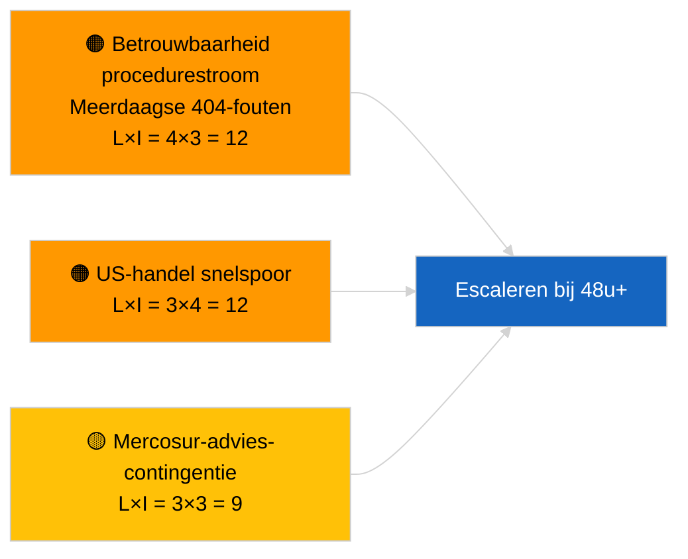
```mermaid
%%{init: {"theme":"dark"}}%%
graph LR
    R1["🟠 Betrouwbaarheid procedure­stroom<br/>Meerdaagse 404-fouten<br/>L×I = 4×3 = 12"] --> CONS["Escaleren bij 48u+"]
    R2["🟠 US-handel snelspoor<br/>L×I = 3×4 = 12"] --> CONS
    R3["🟡 Mercosur-advies-contingentie<br/>L×I = 3×3 = 9"] --> CONS
    style R1 fill:#FF9800,color:#000000
    style R2 fill:#FF9800,color:#000000
    style R3 fill:#FFC107,color:#000000
    style CONS fill:#1565C0,color:#FFFFFF
```

| Risico | L | I | Score | Trigger | Bron | Admiraliteit |
|--------|:-:|:-:|:-----:|---------|------|:------------:|
| Betrouwbaarheid procedurestroom | 4 | 3 | 12 | 48u+ aanhoudende 404 | Zusteruitvoeringen | B2 |
| US-handel snelspoorvoorstel | 3 | 4 | 12 | US-maatregel | TA-10-2026-0096 | A1 |
| Mercosur-advies-contingentie | 3 | 3 | 9 | Hof publiceert | TA-10-2026-0008 | A2 |
| MFK-voorbereidende wrijving | 3 | 4 | 12 | Q2-Commissiemededeling | Commissie-cadans | B2 |

---

### 🔮 Leidende vooruitblikkende trigger

**Commissie-collegevergadering dinsdag 7 april 2026** — eerste post-Paas-agendastelling; thematische mix kalibreert de Q2-voorstel­bewakingslijst.

---

### 🛡️ Beoordeling van de bronkwaliteit

- **Primaire bronnen:** EP-Open Dataportal; uitvoering `a3fdcdee-e95c-4a90-a4de-4c41509e1c1d`.
- **Databeperkingen:** `get_procedures_feed` 404 verhindert corroboratie.
- **Betrouwbaarheid:** 🟡 MATIG voor bewering over afwezigheid van procedures; 🟢 HOOG voor kalenderstuurder.

---

### 📎 Links

| Link | Pad |
|------|-----|
| Artikel | `./article.md` |
| Zusteruitvoeringen | `analysis/daily/2026-04-02/breaking/`, `committee-reports/`, `motions/` |
| Manifest | `./manifest.json` |

---

**Documentbeheer**
- **Sjabloon:** `/analysis/templates/executive-brief.md`
- **Artefactpad:** `analysis/daily/2026-04-02/propositions/executive-brief.md`
- **Classificatie:** Openbaar
- **Retrospectieve generatie:** Terugvullingssessie.

### Executive Brief No

### 🎯 BLUF

**Ingen nye Kommisjonsforslag eller EP-egne initiativprosedyrer ble åpnet 2. april 2026.** Kjøring `a3fdcdee-e95c-4a90-a4de-4c41509e1c1d` returnerte **0 klassifiserte aktører** og **RUTINE**-betydning, noe som gjenspeiler den tomme tilstanden for 2026-04-01/forslag. Mønsteret med 6/8 rådgivningsstrøms-404-feil som ble logget 1. april 2026, fortsetter; `get_procedures_feed` er blant de berørte endepunktene. Den substantielle forslags­beholdningen ved inngangen til april er dermed den nedarvede pipelinen (HDV-utslippsramme TA-10-2026-0084, ECB-visepresident­prosedyre TA-10-2026-0060, rapport om bedre lovgivning TA-10-2026-0063, EU-Mercosur ECJ-forelæggelse TA-10-2026-0008). **🟢 HØY tillitsgrad** til at den tomme tilstanden skyldes kalender og tilgjengelighet av datastrøm; **🟡 MIDDELS tillitsgrad** til fravær av nye prosedyrer under API-degraderingen.

---

### 🧭 3 Beslutninger denne rapporten støtter

| # | Beslutning | Hvem bestemmer | Frist | Dokumentasjon |
|:-:|-----------|----------------|:-----:|---------------|
| 1 | **Redaksjonelt:** HOPP OVER forslag daglig | Redaktør | +24t | Tom kjøringsoutput |
| 2 | **Overvåking:** fortsett overvåking av strømmehelse; merk 48t+ av `get_procedures_feed` 404-feil som hendelse | Datapipeline | 2026-04-03 | Vedvarende mønster |
| 3 | **Fremovervåking:** Kommisjonens tirsdagsmøte 7. april 2026 — første post-påske-kollegiebordlegging | Analyseleder | 2026-04-07 | Kommisjonens kadense |

---

### 📰 60-sekunders lesing

- 🔴 **Ingen nye prosedyrer** 2. april 2026; `get_procedures_feed` 404 fortsetter. (🟡 Middels)
- 🟠 **0 aktører klassifisert**; ingen kommissær, GD eller ordfører identifisert. (🟢 Høy)
- 🟢 **Pipeline-carry-over** forankrer aprilovervåkingslisten (HDV, ECB, Bedre lovgivning, Mercosur). (🟢 Høy)
- 🟡 **Risikoimensjoner alle «ingen»** i dag. (🟢 Høy)
- 🔵 **Økonomisk kontekst:** forventede Q2-forslag om gjennomføringsregler for AI Act, Forsvarsindustriell strategi, MFF-forberedende meddelelser. (🟡 Middels)
- 🟣 **Kryssreferanse:** søsterkjøringer 2026-04-02 tomme maler; 2026-04-03/breaking-2 formaliserer feed-API-bekymringen. (🟢 Høy)
- 🩷 **Forstyrrelsesvektor:** US-handelspress kan fremtvinge et hurtigsporet Kommisjonsforslag i april. (🟡 Middels)
- ⚪ **Carry-forward:** Mercosur ECJ-uttalelse er fortsatt den mest impaktfulle ventende forslagstriggeren.

---

### 🗂️ Topdokumenter/prosedyrer — Forslagsovervåking

| Rang | EP-referanse | Tittel (kortform) | Betydning | Tillitsgrad | Status |
|:----:|-------------|------------------|:---------:|:-----------:|--------|
| 1 | — | Ingen nye forslag 2026-04-02 | 0,0 | 🟡 MIDDELS | Strøm-404-forbehold |
| 2 | TA-10-2026-0008 | EU-Mercosur ECJ-forelæggelse (ventende) | 8,0 | 🟡 MIDDELS | Domstolsuttalelse forventet |
| 3 | TA-10-2026-0084 | HDV-utslippskreditter 2025–2029 | 7,0 | 🟢 HØY | Transposisjonspipeline |

---

### ⚠️ Risiko- og trusseloversikt

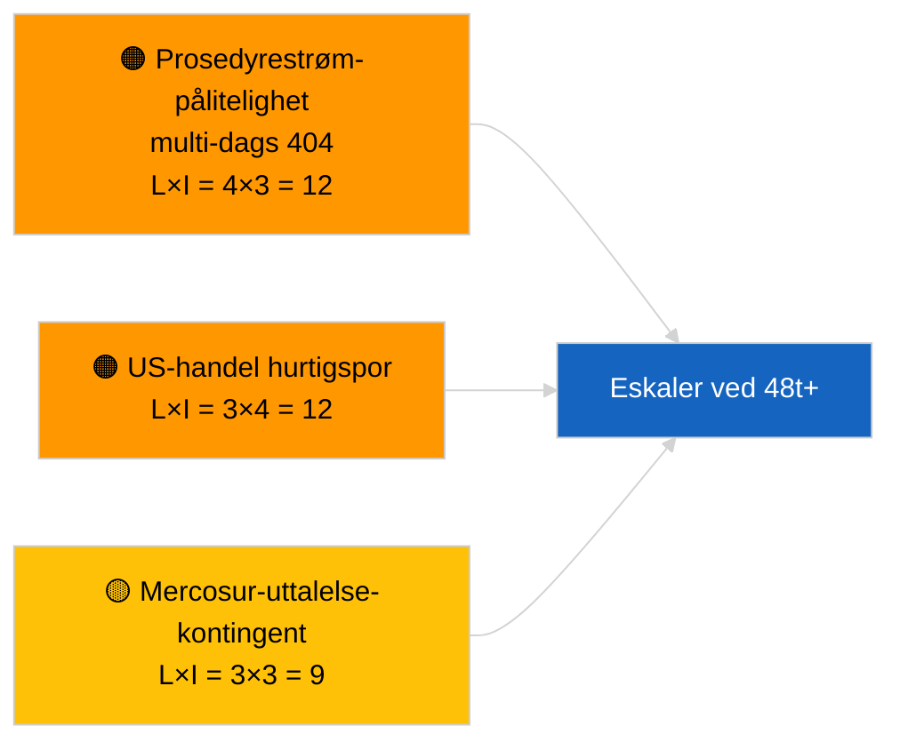
```mermaid
%%{init: {"theme":"dark"}}%%
graph LR
    R1["🟠 Prosedyrestrøm­pålitelighet<br/>multi-dags 404<br/>L×I = 4×3 = 12"] --> CONS["Eskaler ved 48t+"]
    R2["🟠 US-handel hurtigspor<br/>L×I = 3×4 = 12"] --> CONS
    R3["🟡 Mercosur-uttalelse-kontingent<br/>L×I = 3×3 = 9"] --> CONS
    style R1 fill:#FF9800,color:#000000
    style R2 fill:#FF9800,color:#000000
    style R3 fill:#FFC107,color:#000000
    style CONS fill:#1565C0,color:#FFFFFF
```

| Risiko | L | I | Score | Trigger | Kilde | Admiralitet |
|--------|:-:|:-:|:-----:|---------|-------|:-----------:|
| Prosedyrestrømpålitelighet | 4 | 3 | 12 | 48t+ vedvarende 404 | Søsterkjøringer | B2 |
| US-handel hurtigsporet forslag | 3 | 4 | 12 | US-handling | TA-10-2026-0096 | A1 |
| Mercosur-uttalelse-kontingent | 3 | 3 | 9 | Domstol publiserer | TA-10-2026-0008 | A2 |
| MFF-forberedende friksjon | 3 | 4 | 12 | Q2-Kommisjonsmeddelelse | Kommisjonens kadense | B2 |

---

### 🔮 Ledende fremovrettet trigger

**Kommisjonens tirsdagsmøte 7. april 2026** — første post-påske-kollegiebordlegging; tematisk blanding kalibrerer Q2-forslagsovervåkingslisten.

---

### 🛡️ Kildekvalitetsvurdering

- **Primære kilder:** EPs åpne dataportal; kjøring `a3fdcdee-e95c-4a90-a4de-4c41509e1c1d`.
- **Databegrensninger:** `get_procedures_feed` 404 forhindrer korroborasjon.
- **Tillitsgrad:** 🟡 MIDDELS for påstand om prosedurefravær; 🟢 HØY for kalenderdriver.

---

### 📎 Lenker

| Lenke | Sti |
|-------|-----|
| Artikkel | `./article.md` |
| Søsterkjøringer | `analysis/daily/2026-04-02/breaking/`, `committee-reports/`, `motions/` |
| Manifest | `./manifest.json` |

---

**Dokumentkontroll**
- **Mal:** `/analysis/templates/executive-brief.md`
- **Artefaktsti:** `analysis/daily/2026-04-02/propositions/executive-brief.md`
- **Klassifisering:** Offentlig
- **Retrospektiv generering:** Backfill-sesjon.

### Executive Brief Sv

### 🎯 BLUF

**Inga nya kommissionspropositioner eller EP:s egna initiativförfaranden öppnades den 2 april 2026.** Körning `a3fdcdee-e95c-4a90-a4de-4c41509e1c1d` returnerade **0 klassificerade aktörer** och **RUTINMÄSSIG** betydelse, vilket speglar det tomma tillståndet för 2026-04-01/propositioner. Mönstret med 6/8 rådgivningsflödes-404 som loggades den 1 april 2026 fortsätter; `get_procedures_feed` är bland de drabbade slutpunkterna. Det substantiella förslagslagret inför april är därför den ärvda pipelinen (HDV-utsläppsramverk TA-10-2026-0084, ECB-vice-ordförandeförfarande TA-10-2026-0060, rapport om bättre lagstiftning TA-10-2026-0063, EU-Mercosur ECJ-hänskjutning TA-10-2026-0008). **🟢 HÖG konfidensgrad** att det tomma tillståndet beror på kalender- och flödestillgänglighet; **🟡 MEDEL konfidensgrad** vad gäller avsaknad av nya förfaranden under API-degraderingen.

---

### 🧭 3 Beslut som denna rapport stöder

| # | Beslut | Vem beslutar | Deadline | Underlag |
|:-:|--------|--------------|:--------:|----------|
| 1 | **Redaktionellt:** HOPPA ÖVER propositioner dagligen | Redaktör | +24h | Tom körningsoutput |
| 2 | **Övervakning:** fortsätt flödeshälsogranskning; markera 48h+ av `get_procedures_feed` 404:or som incident | Datapipeline | 2026-04-03 | Ihållande mönster |
| 3 | **Framåtbevakning:** Kommissionens torsdagsmöte 7 april 2026 — första post-påsk-collegium-bordläggning | Analysledare | 2026-04-07 | Kommissionens kadens |

---

### 📰 60-sekunders läsning

- 🔴 **Inga nya förfaranden** den 2 april 2026; `get_procedures_feed` 404 fortsätter. (🟡 Medel)
- 🟠 **0 aktörer klassificerade**; ingen kommissionär, GD eller föredragande identifierad. (🟢 Hög)
- 🟢 **Pipeline-carry-over** förankrar aprilopplistan (HDV, ECB, Bättre lagstiftning, Mercosur). (🟢 Hög)
- 🟡 **Riskdimensioner alla "inga"** idag. (🟢 Hög)
- 🔵 **Ekonomisk kontext:** förväntade Q2-propositioner om genomförandebestämmelser för AI Act, Industriell försvarsstrategi, MFF-förberedande kommunikationer. (🟡 Medel)
- 🟣 **Korsreferens:** syskonkörningar 2026-04-02 tomma mallar; 2026-04-03/breaking-2 formaliserar flärdets-API-problemet. (🟢 Hög)
- 🩷 **Störningsvektor:** US handelstryck kan tvinga fram en snabbspår-kommissionsproposition i april. (🟡 Medel)
- ⚪ **Carry-forward:** Mercosur ECJ-yttrande kvarstår som den mest impaktfulla väntande propositionstriggern.

---

### 🗂️ Toppokument/förfaranden — Propositionsbevakning

| Rang | EP-referens | Titel (kortform) | Signifikans | Konfidensgrad | Status |
|:----:|-------------|------------------|:-----------:|:-------------:|--------|
| 1 | — | Inga nya propositioner den 2026-04-02 | 0,0 | 🟡 MEDEL | Flödes-404-förbehåll |
| 2 | TA-10-2026-0008 | EU-Mercosur ECJ-hänskjutning (väntande) | 8,0 | 🟡 MEDEL | Domstolsyttrande förväntas |
| 3 | TA-10-2026-0084 | HDV-utsläppskrediter 2025–2029 | 7,0 | 🟢 HÖG | Transpositionspipeline |

---

### ⚠️ Risk- och hotöversikt

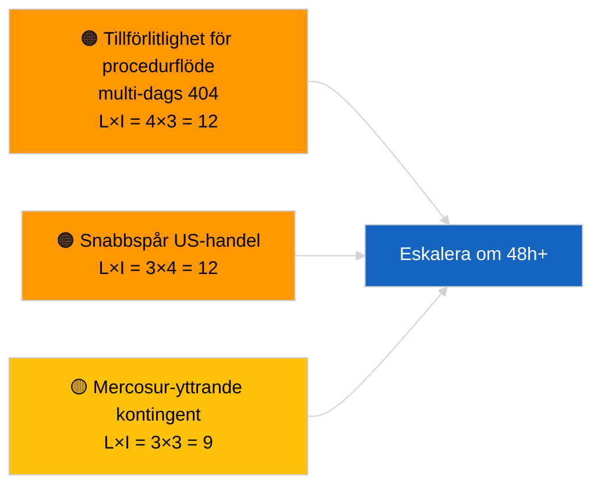
```mermaid
%%{init: {"theme":"dark"}}%%
graph LR
    R1["🟠 Tillförlitlighet för procedurflöde<br/>multi-dags 404<br/>L×I = 4×3 = 12"] --> CONS["Eskalera om 48h+"]
    R2["🟠 Snabbspår US-handel<br/>L×I = 3×4 = 12"] --> CONS
    R3["🟡 Mercosur-yttrande kontingent<br/>L×I = 3×3 = 9"] --> CONS
    style R1 fill:#FF9800,color:#000000
    style R2 fill:#FF9800,color:#000000
    style R3 fill:#FFC107,color:#000000
    style CONS fill:#1565C0,color:#FFFFFF
```

| Risk | L | I | Poäng | Trigger | Källa | Admiralitet |
|------|:-:|:-:|:-----:|---------|-------|:-----------:|
| Tillförlitlighet för procedurflöde | 4 | 3 | 12 | 48h+ ihållande 404 | Syskonkörningar | B2 |
| Snabbspår US-handelsproposition | 3 | 4 | 12 | US-åtgärd | TA-10-2026-0096 | A1 |
| Mercosur-yttrande kontingent | 3 | 3 | 9 | Domstol publicerar | TA-10-2026-0008 | A2 |
| MFF-förberedande friktion | 3 | 4 | 12 | Q2-kommissionskommunikation | Kommissionens kadens | B2 |

---

### 🔮 Ledande framåttrigger

**Kommissionens torsdagsmöte 7 april 2026** — första post-påsk-collegium-bordläggning; ämnesblandning kalibrerar Q2-propositionsbevaningslistan.

---

### 🛡️ Källkvalitetsbedömning

- **Primärkällor:** EP:s öppna dataportal; körning `a3fdcdee-e95c-4a90-a4de-4c41509e1c1d`.
- **Databegränsningar:** `get_procedures_feed` 404 förhindrar korroboration.
- **Konfidensgrad:** 🟡 MEDEL för procedurfrånvaro-påstående; 🟢 HÖG för kalenderdrivare.

---

### 📎 Länkar

| Länk | Sökväg |
|------|--------|
| Artikel | `./article.md` |
| Syskonkörningar | `analysis/daily/2026-04-02/breaking/`, `committee-reports/`, `motions/` |
| Manifest | `./manifest.json` |

---

**Dokumentkontroll**
- **Mall:** `/analysis/templates/executive-brief.md`
- **Artefaktsökväg:** `analysis/daily/2026-04-02/propositions/executive-brief.md`
- **Klassificering:** Offentlig
- **Retrospektiv generering:** Backfillssession.

### Executive Brief Zh

**分类：** OSINT | 公开议会记录
**置信度：** 🟢 高（议会休会期间的结构性评估）
**生成日期：** 2026-04-02T00:00:00Z（追溯报告）
**文章类型：** 提案
**运行标识符：** `a3fdcdee-e95c-4a90-a4de-4c41509e1c1d`
**来源：** 欧洲议会开放数据门户

---

### 🎯 BLUF

**2026年4月2日未开启任何新的委员会提案或欧洲议会自主倡议程序。** 运行 `a3fdcdee-e95c-4a90-a4de-4c41509e1c1d` 返回 **0个已分类行为者** 和 **例行性** 重要度，反映了 2026-04-01/提案的空白状态。2026年4月1日记录的 6/8 咨询信息流404错误模式仍在持续；`get_procedures_feed` 属于受影响的端点之一。因此，4月初的实质性提案库存是已继承的管道（HDV排放框架 TA-10-2026-0084、欧洲央行副行长程序 TA-10-2026-0060、更好立法报告 TA-10-2026-0063、欧盟-南方共同市场欧盟法院提交 TA-10-2026-0008）。对于空状态由日历和信息流可用性驱动，**🟢 置信度高**；对于API降级期间无新程序，**🟡 置信度中等**。

---

### 🧭 本报告支持的3项决策

| # | 决策 | 决策者 | 截止期 | 依据 |
|:-:|------|--------|:------:|------|
| 1 | **编辑决策：** 跳过提案日报 | 编辑 | +24小时 | 运行输出为空 |
| 2 | **监控：** 继续信息流健康状态监测；将 `get_procedures_feed` 的404错误超过48小时标记为事件 | 数据管道 | 2026-04-03 | 持续模式 |
| 3 | **前瞻监视：** 委员会会议 2026年4月7日（星期二）— 复活节后首次议事议程设定 | 分析负责人 | 2026-04-07 | 委员会节奏 |

---

### 📰 60秒阅读

- 🔴 2026年4月2日**无新程序**；`get_procedures_feed` 404持续。（🟡 中等）
- 🟠 **0个行为者被分类**；未识别任何专员、总司或报告员。（🟢 高）
- 🟢 **管道延续**锚定4月监视清单（HDV、欧洲央行、更好立法、南方共同市场）。（🟢 高）
- 🟡 **风险维度全部"无"**（今日）。（🟢 高）
- 🔵 **经济背景：** 预期Q2提案——AI法案实施细则、国防工业战略、多年期财政框架准备性通信。（🟡 中等）
- 🟣 **交叉参考：** 姐妹运行 2026-04-02 模板为空；2026-04-03/breaking-2 正式确认信息流API问题。（🟢 高）
- 🩷 **扰动向量：** 美国贸易压力可能迫使4月出现快速通道委员会提案。（🟡 中等）
- ⚪ **延续：** 南方共同市场欧盟法院意见仍是影响最大的待定提案触发点。

---

### 🗂️ 主要文件/程序 — 提案监控

| 排名 | 欧洲议会参考编号 | 标题（简称） | 重要性 | 置信度 | 状态 |
|:---:|--------------|-----------|:------:|:------:|------|
| 1 | — | 2026-04-02无新提案 | 0.0 | 🟡 中等 | 信息流404保留 |
| 2 | TA-10-2026-0008 | 欧盟-南方共同市场欧盟法院提交（待定） | 8.0 | 🟡 中等 | 法院意见待发 |
| 3 | TA-10-2026-0084 | HDV排放信用额度2025–2029 | 7.0 | 🟢 高 | 移植管道 |

---

### ⚠️ 风险与威胁快照

```mermaid
%%{init: {"theme":"dark"}}%%
graph LR
    R1["🟠 程序信息流可靠性<br/>多日404错误<br/>L×I = 4×3 = 12"] --> CONS["48小时以上则升级处理"]
    R2["🟠 美国贸易快速通道<br/>L×I = 3×4 = 12"] --> CONS
    R3["🟡 南方共同市场意见应急<br/>L×I = 3×3 = 9"] --> CONS
    style R1 fill:#FF9800,color:#000000
    style R2 fill:#FF9800,color:#000000
    style R3 fill:#FFC107,color:#000000
    style CONS fill:#1565C0,color:#FFFFFF
```

| 风险 | L | I | 评分 | 触发因素 | 来源 | 海军情报评级 |
|------|:-:|:-:|:---:|---------|------|:----------:|
| 程序信息流可靠性 | 4 | 3 | 12 | 48小时以上持续404 | 姐妹运行 | B2 |
| 美国贸易快速通道提案 | 3 | 4 | 12 | 美国行动 | TA-10-2026-0096 | A1 |
| 南方共同市场意见应急 | 3 | 3 | 9 | 法院发布 | TA-10-2026-0008 | A2 |
| 多年期财政框架准备摩擦 | 3 | 4 | 12 | Q2委员会通信 | 委员会节奏 | B2 |

---

### 🔮 领先的前瞻触发因素

**委员会会议 2026年4月7日（星期二）** — 复活节后首次议事议程设定；主题组合校准Q2提案监视清单。

---

### 🛡️ 来源质量评估

- **主要来源：** 欧洲议会开放数据门户；运行 `a3fdcdee-e95c-4a90-a4de-4c41509e1c1d`。
- **数据局限性：** `get_procedures_feed` 404阻止交叉核实。
- **置信度：** 程序缺席声明 🟡 中等；日历驱动因素 🟢 高。

---

### 📎 链接

| 链接 | 路径 |
|------|------|
| 文章 | `./article.md` |
| 姐妹运行 | `analysis/daily/2026-04-02/breaking/`, `committee-reports/`, `motions/` |
| 清单 | `./manifest.json` |

---

**文件控制**
- **模板：** `/analysis/templates/executive-brief.md`
- **制品路径：** `analysis/daily/2026-04-02/propositions/executive-brief.md`
- **分类：** 公开
- **追溯生成：** 补录会话。

### Coalition Analysis

### Overview
Analysis of political group cohesion and coalition dynamics.

### Coalition Metrics
- **Overall Stability**: 0.0%
- **Forecast**: volatile
- **Patterns Analysed**: 0

### Group Analysis
- **Stable Groups**: No stable groups identified
- **Declining Groups**: No declining groups identified

### Coalition Intelligence
- **Patterns Evaluated**: 0

### Date: 2026-04-02

### Stakeholder Analysis

### Data Available for Stakeholder Assessment
| Stakeholder Group | Primary Data Sources | Data Points |
|-------------------|---------------------|-------------|
| Political Groups | Procedures, Adopted Texts, Voting Records, Coalitions | 114 |
| Civil Society | Documents, Questions, Events | 0 |
| Industry | Procedures, Adopted Texts | 114 |
| National Governments | Adopted Texts, Procedures, Coalitions | 114 |
| Citizens | Questions, MEP Updates, Events | 737 |
| EU Institutions | Events, Procedures, Adopted Texts, Voting Records | 114 |

### Data Source Summary
| Source | Count |
|--------|-------|
| patterns | 0 |
| votingRecords | 0 |
| events | 0 |
| documents | 0 |
| adoptedTexts | 114 |
| procedures | 0 |
| mepUpdates | 737 |
| plenaryDocuments | 0 |
| committeeDocuments | 0 |
| plenarySessionDocuments | 0 |
| externalDocuments | 0 |
| questions | 0 |
| declarations | 93 |
| corporateBodies | 0 |

### Date: 2026-04-02

> **Provenance & Audit**
>
> - **Article type:** `propositions`
> - **Run date:** 2026-04-02
> - **Run id:** `a3fdcdee-e95c-4a90-a4de-4c41509e1c1d`
> - **Gate result:** `PENDING`
> - **Analysis tree:** [analysis/daily/2026-04-02/propositions](https://github.com/Hack23/euparliamentmonitor/tree/main/analysis/daily/2026-04-02/propositions)
> - **Manifest:** [manifest.json](https://github.com/Hack23/euparliamentmonitor/blob/main/analysis/daily/2026-04-02/propositions/manifest.json)

<h2 id="aggregator-tradecraft-references">Tradecraft References</h2>

This article is produced under the [Hack23 AB](https://hack23.com) intelligence tradecraft library. Every methodology and artifact template applied to this run is linked below.

### Artifact templates

- [README](https://github.com/Hack23/euparliamentmonitor/blob/main/analysis/templates/README.md)
- [Actor Mapping](https://github.com/Hack23/euparliamentmonitor/blob/main/analysis/templates/actor-mapping.md)
- [Actor Threat Profiles](https://github.com/Hack23/euparliamentmonitor/blob/main/analysis/templates/actor-threat-profiles.md)
- [Analysis Index](https://github.com/Hack23/euparliamentmonitor/blob/main/analysis/templates/analysis-index.md)
- [Coalition Dynamics](https://github.com/Hack23/euparliamentmonitor/blob/main/analysis/templates/coalition-dynamics.md)
- [Coalition Mathematics](https://github.com/Hack23/euparliamentmonitor/blob/main/analysis/templates/coalition-mathematics.md)
- [Commission Wp Alignment](https://github.com/Hack23/euparliamentmonitor/blob/main/analysis/templates/commission-wp-alignment.md)
- [Comparative International](https://github.com/Hack23/euparliamentmonitor/blob/main/analysis/templates/comparative-international.md)
- [Consequence Trees](https://github.com/Hack23/euparliamentmonitor/blob/main/analysis/templates/consequence-trees.md)
- [Cross Reference Map](https://github.com/Hack23/euparliamentmonitor/blob/main/analysis/templates/cross-reference-map.md)
- [Cross Run Diff](https://github.com/Hack23/euparliamentmonitor/blob/main/analysis/templates/cross-run-diff.md)
- [Cross Session Intelligence](https://github.com/Hack23/euparliamentmonitor/blob/main/analysis/templates/cross-session-intelligence.md)
- [Data Availability Assessment](https://github.com/Hack23/euparliamentmonitor/blob/main/analysis/templates/data-availability-assessment.md)
- [Data Download Manifest](https://github.com/Hack23/euparliamentmonitor/blob/main/analysis/templates/data-download-manifest.md)
- [Deep Analysis](https://github.com/Hack23/euparliamentmonitor/blob/main/analysis/templates/deep-analysis.md)
- [Devils Advocate Analysis](https://github.com/Hack23/euparliamentmonitor/blob/main/analysis/templates/devils-advocate-analysis.md)
- [Economic Context](https://github.com/Hack23/euparliamentmonitor/blob/main/analysis/templates/economic-context.md)
- [Executive Brief](https://github.com/Hack23/euparliamentmonitor/blob/main/analysis/templates/executive-brief.md)
- [Forces Analysis](https://github.com/Hack23/euparliamentmonitor/blob/main/analysis/templates/forces-analysis.md)
- [Forward Indicators](https://github.com/Hack23/euparliamentmonitor/blob/main/analysis/templates/forward-indicators.md)
- [Forward Projection](https://github.com/Hack23/euparliamentmonitor/blob/main/analysis/templates/forward-projection.md)
- [Historical Baseline](https://github.com/Hack23/euparliamentmonitor/blob/main/analysis/templates/historical-baseline.md)
- [Historical Parallels](https://github.com/Hack23/euparliamentmonitor/blob/main/analysis/templates/historical-parallels.md)
- [Imf Vintage Audit](https://github.com/Hack23/euparliamentmonitor/blob/main/analysis/templates/imf-vintage-audit.md)
- [Impact Matrix](https://github.com/Hack23/euparliamentmonitor/blob/main/analysis/templates/impact-matrix.md)
- [Implementation Feasibility](https://github.com/Hack23/euparliamentmonitor/blob/main/analysis/templates/implementation-feasibility.md)
- [Intelligence Assessment](https://github.com/Hack23/euparliamentmonitor/blob/main/analysis/templates/intelligence-assessment.md)
- [Legislative Disruption](https://github.com/Hack23/euparliamentmonitor/blob/main/analysis/templates/legislative-disruption.md)
- [Legislative Pipeline Forecast](https://github.com/Hack23/euparliamentmonitor/blob/main/analysis/templates/legislative-pipeline-forecast.md)
- [Legislative Velocity Risk](https://github.com/Hack23/euparliamentmonitor/blob/main/analysis/templates/legislative-velocity-risk.md)
- [Mandate Fulfilment Scorecard](https://github.com/Hack23/euparliamentmonitor/blob/main/analysis/templates/mandate-fulfilment-scorecard.md)
- [Mcp Reliability Audit](https://github.com/Hack23/euparliamentmonitor/blob/main/analysis/templates/mcp-reliability-audit.md)
- [Media Framing Analysis](https://github.com/Hack23/euparliamentmonitor/blob/main/analysis/templates/media-framing-analysis.md)
- [Methodology Reflection](https://github.com/Hack23/euparliamentmonitor/blob/main/analysis/templates/methodology-reflection.md)
- [Parliamentary Calendar Projection](https://github.com/Hack23/euparliamentmonitor/blob/main/analysis/templates/parliamentary-calendar-projection.md)
- [Per File Political Intelligence](https://github.com/Hack23/euparliamentmonitor/blob/main/analysis/templates/per-file-political-intelligence.md)
- [Pestle Analysis](https://github.com/Hack23/euparliamentmonitor/blob/main/analysis/templates/pestle-analysis.md)
- [Political Capital Risk](https://github.com/Hack23/euparliamentmonitor/blob/main/analysis/templates/political-capital-risk.md)
- [Political Classification](https://github.com/Hack23/euparliamentmonitor/blob/main/analysis/templates/political-classification.md)
- [Political Threat Landscape](https://github.com/Hack23/euparliamentmonitor/blob/main/analysis/templates/political-threat-landscape.md)
- [Presidency Trio Context](https://github.com/Hack23/euparliamentmonitor/blob/main/analysis/templates/presidency-trio-context.md)
- [Quantitative Swot](https://github.com/Hack23/euparliamentmonitor/blob/main/analysis/templates/quantitative-swot.md)
- [Reference Analysis Quality](https://github.com/Hack23/euparliamentmonitor/blob/main/analysis/templates/reference-analysis-quality.md)
- [Risk Assessment](https://github.com/Hack23/euparliamentmonitor/blob/main/analysis/templates/risk-assessment.md)
- [Risk Matrix](https://github.com/Hack23/euparliamentmonitor/blob/main/analysis/templates/risk-matrix.md)
- [Scenario Forecast](https://github.com/Hack23/euparliamentmonitor/blob/main/analysis/templates/scenario-forecast.md)
- [Seat Projection](https://github.com/Hack23/euparliamentmonitor/blob/main/analysis/templates/seat-projection.md)
- [Session Baseline](https://github.com/Hack23/euparliamentmonitor/blob/main/analysis/templates/session-baseline.md)
- [Significance Classification](https://github.com/Hack23/euparliamentmonitor/blob/main/analysis/templates/significance-classification.md)
- [Significance Scoring](https://github.com/Hack23/euparliamentmonitor/blob/main/analysis/templates/significance-scoring.md)
- [Stakeholder Impact](https://github.com/Hack23/euparliamentmonitor/blob/main/analysis/templates/stakeholder-impact.md)
- [Stakeholder Map](https://github.com/Hack23/euparliamentmonitor/blob/main/analysis/templates/stakeholder-map.md)
- [Swot Analysis](https://github.com/Hack23/euparliamentmonitor/blob/main/analysis/templates/swot-analysis.md)
- [Synthesis Summary](https://github.com/Hack23/euparliamentmonitor/blob/main/analysis/templates/synthesis-summary.md)
- [Term Arc](https://github.com/Hack23/euparliamentmonitor/blob/main/analysis/templates/term-arc.md)
- [Threat Analysis](https://github.com/Hack23/euparliamentmonitor/blob/main/analysis/templates/threat-analysis.md)
- [Threat Model](https://github.com/Hack23/euparliamentmonitor/blob/main/analysis/templates/threat-model.md)
- [Voter Segmentation](https://github.com/Hack23/euparliamentmonitor/blob/main/analysis/templates/voter-segmentation.md)
- [Voting Patterns](https://github.com/Hack23/euparliamentmonitor/blob/main/analysis/templates/voting-patterns.md)
- [Wildcards Blackswans](https://github.com/Hack23/euparliamentmonitor/blob/main/analysis/templates/wildcards-blackswans.md)
- [Workflow Audit](https://github.com/Hack23/euparliamentmonitor/blob/main/analysis/templates/workflow-audit.md)

### Methodologies

- [README](https://github.com/Hack23/euparliamentmonitor/blob/main/analysis/methodologies/README.md)
- [Ai Driven Analysis Guide](https://github.com/Hack23/euparliamentmonitor/blob/main/analysis/methodologies/ai-driven-analysis-guide.md)
- [Analytical Supplementary Methodology](https://github.com/Hack23/euparliamentmonitor/blob/main/analysis/methodologies/analytical-supplementary-methodology.md)
- [Artifact Catalog](https://github.com/Hack23/euparliamentmonitor/blob/main/analysis/methodologies/artifact-catalog.md)
- [Confidence Calibration](https://github.com/Hack23/euparliamentmonitor/blob/main/analysis/methodologies/confidence-calibration.md)
- [Electoral Cycle Methodology](https://github.com/Hack23/euparliamentmonitor/blob/main/analysis/methodologies/electoral-cycle-methodology.md)
- [Electoral Domain Methodology](https://github.com/Hack23/euparliamentmonitor/blob/main/analysis/methodologies/electoral-domain-methodology.md)
- [Forward Projection Methodology](https://github.com/Hack23/euparliamentmonitor/blob/main/analysis/methodologies/forward-projection-methodology.md)
- [Imf Indicator Mapping](https://github.com/Hack23/euparliamentmonitor/blob/main/analysis/methodologies/imf-indicator-mapping.md)
- [Osint Tradecraft Standards](https://github.com/Hack23/euparliamentmonitor/blob/main/analysis/methodologies/osint-tradecraft-standards.md)
- [Per Artifact Methodologies](https://github.com/Hack23/euparliamentmonitor/blob/main/analysis/methodologies/per-artifact-methodologies.md)
- [Per Document Methodology](https://github.com/Hack23/euparliamentmonitor/blob/main/analysis/methodologies/per-document-methodology.md)
- [Political Classification Guide](https://github.com/Hack23/euparliamentmonitor/blob/main/analysis/methodologies/political-classification-guide.md)
- [Political Risk Methodology](https://github.com/Hack23/euparliamentmonitor/blob/main/analysis/methodologies/political-risk-methodology.md)
- [Political Style Guide](https://github.com/Hack23/euparliamentmonitor/blob/main/analysis/methodologies/political-style-guide.md)
- [Political Swot Framework](https://github.com/Hack23/euparliamentmonitor/blob/main/analysis/methodologies/political-swot-framework.md)
- [Political Threat Framework](https://github.com/Hack23/euparliamentmonitor/blob/main/analysis/methodologies/political-threat-framework.md)
- [Seo Headers Policy](https://github.com/Hack23/euparliamentmonitor/blob/main/analysis/methodologies/seo-headers-policy.md)
- [Source Triangulation](https://github.com/Hack23/euparliamentmonitor/blob/main/analysis/methodologies/source-triangulation.md)
- [Strategic Extensions Methodology](https://github.com/Hack23/euparliamentmonitor/blob/main/analysis/methodologies/strategic-extensions-methodology.md)
- [Structural Metadata Methodology](https://github.com/Hack23/euparliamentmonitor/blob/main/analysis/methodologies/structural-metadata-methodology.md)
- [Synthesis Methodology](https://github.com/Hack23/euparliamentmonitor/blob/main/analysis/methodologies/synthesis-methodology.md)
- [Voter Segmentation Methodology](https://github.com/Hack23/euparliamentmonitor/blob/main/analysis/methodologies/voter-segmentation-methodology.md)
- [Worldbank Indicator Mapping](https://github.com/Hack23/euparliamentmonitor/blob/main/analysis/methodologies/worldbank-indicator-mapping.md)

<h2 id="aggregator-analysis-index">Analysis Index</h2>

Every artifact below was read by the aggregator and contributed to this article. The raw [manifest.json](https://github.com/Hack23/euparliamentmonitor/blob/main/analysis/daily/2026-04-02/propositions/manifest.json) carries the full machine-readable list, including gate-result history.

| Section | Artifact | Path |
|---|---|---|
| section-executive-brief | [executive-brief](https://github.com/Hack23/euparliamentmonitor/blob/main/analysis/daily/2026-04-02/propositions/executive-brief.md) | `executive-brief.md` |
| section-actors-forces | [actor-mapping](https://github.com/Hack23/euparliamentmonitor/blob/main/analysis/daily/2026-04-02/propositions/classification/actor-mapping.md) | `classification/actor-mapping.md` |
| section-actors-forces | [forces-analysis](https://github.com/Hack23/euparliamentmonitor/blob/main/analysis/daily/2026-04-02/propositions/classification/forces-analysis.md) | `classification/forces-analysis.md` |
| section-actors-forces | [impact-matrix](https://github.com/Hack23/euparliamentmonitor/blob/main/analysis/daily/2026-04-02/propositions/classification/impact-matrix.md) | `classification/impact-matrix.md` |
| section-actors-forces | [significance-assessment](https://github.com/Hack23/euparliamentmonitor/blob/main/analysis/daily/2026-04-02/propositions/classification/significance-assessment.md) | `classification/significance-assessment.md` |
| section-coalitions-voting | [voting-patterns](https://github.com/Hack23/euparliamentmonitor/blob/main/analysis/daily/2026-04-02/propositions/existing/voting-patterns.md) | `existing/voting-patterns.md` |
| section-risk | [risk-matrix](https://github.com/Hack23/euparliamentmonitor/blob/main/analysis/daily/2026-04-02/propositions/risk-scoring/risk-matrix.md) | `risk-scoring/risk-matrix.md` |
| section-risk | [quantitative-swot](https://github.com/Hack23/euparliamentmonitor/blob/main/analysis/daily/2026-04-02/propositions/risk-scoring/quantitative-swot.md) | `risk-scoring/quantitative-swot.md` |
| section-risk | [political-capital-risk](https://github.com/Hack23/euparliamentmonitor/blob/main/analysis/daily/2026-04-02/propositions/risk-scoring/political-capital-risk.md) | `risk-scoring/political-capital-risk.md` |
| section-risk | [legislative-velocity-risk](https://github.com/Hack23/euparliamentmonitor/blob/main/analysis/daily/2026-04-02/propositions/risk-scoring/legislative-velocity-risk.md) | `risk-scoring/legislative-velocity-risk.md` |
| section-risk | [agent-risk-workflow](https://github.com/Hack23/euparliamentmonitor/blob/main/analysis/daily/2026-04-02/propositions/risk-scoring/agent-risk-workflow.md) | `risk-scoring/agent-risk-workflow.md` |
| section-threat | [actor-threat-profiles](https://github.com/Hack23/euparliamentmonitor/blob/main/analysis/daily/2026-04-02/propositions/threat-assessment/actor-threat-profiles.md) | `threat-assessment/actor-threat-profiles.md` |
| section-threat | [consequence-trees](https://github.com/Hack23/euparliamentmonitor/blob/main/analysis/daily/2026-04-02/propositions/threat-assessment/consequence-trees.md) | `threat-assessment/consequence-trees.md` |
| section-threat | [legislative-disruption](https://github.com/Hack23/euparliamentmonitor/blob/main/analysis/daily/2026-04-02/propositions/threat-assessment/legislative-disruption.md) | `threat-assessment/legislative-disruption.md` |
| section-threat | [political-threat-landscape](https://github.com/Hack23/euparliamentmonitor/blob/main/analysis/daily/2026-04-02/propositions/threat-assessment/political-threat-landscape.md) | `threat-assessment/political-threat-landscape.md` |
| section-continuity | [cross-session-intelligence](https://github.com/Hack23/euparliamentmonitor/blob/main/analysis/daily/2026-04-02/propositions/existing/cross-session-intelligence.md) | `existing/cross-session-intelligence.md` |
| section-deep-analysis | [deep-analysis](https://github.com/Hack23/euparliamentmonitor/blob/main/analysis/daily/2026-04-02/propositions/existing/deep-analysis.md) | `existing/deep-analysis.md` |
| section-supplementary-intelligence | [executive-brief_ar](https://github.com/Hack23/euparliamentmonitor/blob/main/analysis/daily/2026-04-02/propositions/executive-brief_ar.md) | `executive-brief_ar.md` |
| section-supplementary-intelligence | [executive-brief_da](https://github.com/Hack23/euparliamentmonitor/blob/main/analysis/daily/2026-04-02/propositions/executive-brief_da.md) | `executive-brief_da.md` |
| section-supplementary-intelligence | [executive-brief_de](https://github.com/Hack23/euparliamentmonitor/blob/main/analysis/daily/2026-04-02/propositions/executive-brief_de.md) | `executive-brief_de.md` |
| section-supplementary-intelligence | [executive-brief_es](https://github.com/Hack23/euparliamentmonitor/blob/main/analysis/daily/2026-04-02/propositions/executive-brief_es.md) | `executive-brief_es.md` |
| section-supplementary-intelligence | [executive-brief_fi](https://github.com/Hack23/euparliamentmonitor/blob/main/analysis/daily/2026-04-02/propositions/executive-brief_fi.md) | `executive-brief_fi.md` |
| section-supplementary-intelligence | [executive-brief_fr](https://github.com/Hack23/euparliamentmonitor/blob/main/analysis/daily/2026-04-02/propositions/executive-brief_fr.md) | `executive-brief_fr.md` |
| section-supplementary-intelligence | [executive-brief_he](https://github.com/Hack23/euparliamentmonitor/blob/main/analysis/daily/2026-04-02/propositions/executive-brief_he.md) | `executive-brief_he.md` |
| section-supplementary-intelligence | [executive-brief_ja](https://github.com/Hack23/euparliamentmonitor/blob/main/analysis/daily/2026-04-02/propositions/executive-brief_ja.md) | `executive-brief_ja.md` |
| section-supplementary-intelligence | [executive-brief_ko](https://github.com/Hack23/euparliamentmonitor/blob/main/analysis/daily/2026-04-02/propositions/executive-brief_ko.md) | `executive-brief_ko.md` |
| section-supplementary-intelligence | [executive-brief_nl](https://github.com/Hack23/euparliamentmonitor/blob/main/analysis/daily/2026-04-02/propositions/executive-brief_nl.md) | `executive-brief_nl.md` |
| section-supplementary-intelligence | [executive-brief_no](https://github.com/Hack23/euparliamentmonitor/blob/main/analysis/daily/2026-04-02/propositions/executive-brief_no.md) | `executive-brief_no.md` |
| section-supplementary-intelligence | [executive-brief_sv](https://github.com/Hack23/euparliamentmonitor/blob/main/analysis/daily/2026-04-02/propositions/executive-brief_sv.md) | `executive-brief_sv.md` |
| section-supplementary-intelligence | [executive-brief_zh](https://github.com/Hack23/euparliamentmonitor/blob/main/analysis/daily/2026-04-02/propositions/executive-brief_zh.md) | `executive-brief_zh.md` |
| section-supplementary-intelligence | [coalition-analysis](https://github.com/Hack23/euparliamentmonitor/blob/main/analysis/daily/2026-04-02/propositions/existing/coalition-analysis.md) | `existing/coalition-analysis.md` |
| section-supplementary-intelligence | [stakeholder-analysis](https://github.com/Hack23/euparliamentmonitor/blob/main/analysis/daily/2026-04-02/propositions/existing/stakeholder-analysis.md) | `existing/stakeholder-analysis.md` |

