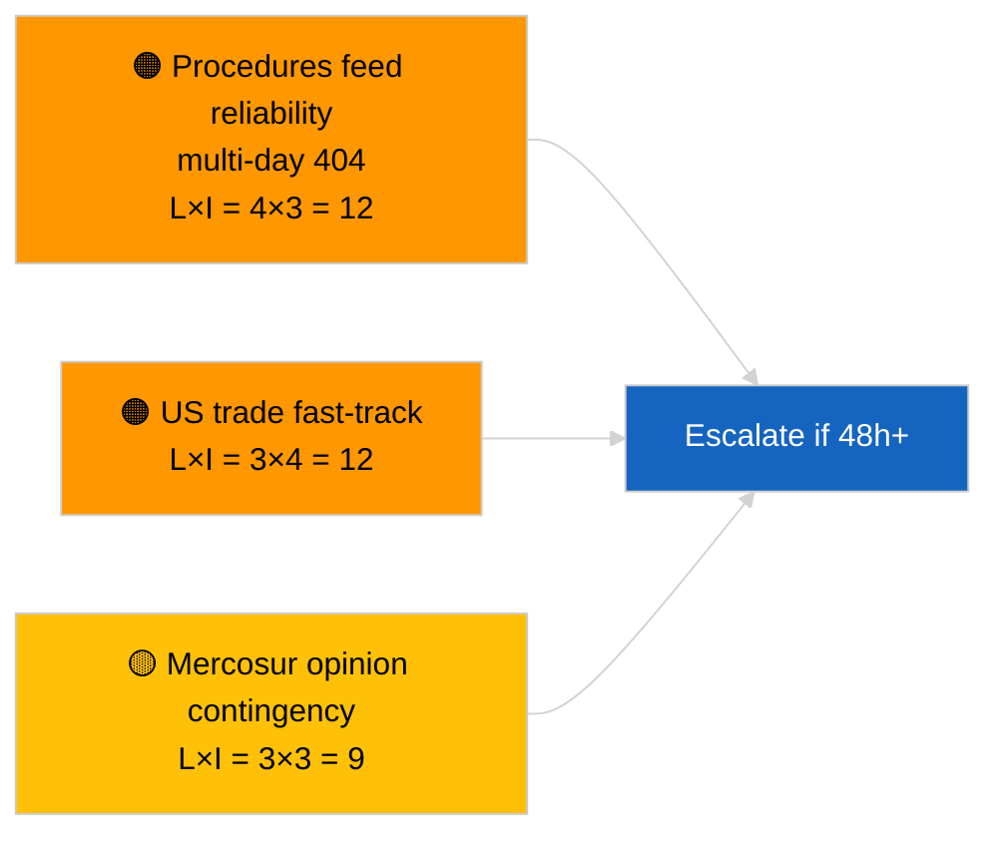

<!-- SPDX-FileCopyrightText: 2026 Hack23 AB -->
<!-- SPDX-License-Identifier: Apache-2.0 -->

# Executive Brief — Propositions | 2026-04-02

**Classification:** OSINT | Public Parliamentary Record
**Confidence:** 🟢 High (recess-period structural assessment)
**Generated:** 2026-04-02T00:00:00Z (retrospective brief)
**Article Type:** Propositions
**Run ID:** `a3fdcdee-e95c-4a90-a4de-4c41509e1c1d`
**Source:** European Parliament Open Data Portal

---

## 🎯 BLUF

**No new Commission propositions or EP own-initiative procedures opened on 2026-04-02.** Run `a3fdcdee-e95c-4a90-a4de-4c41509e1c1d` returned **0 classified actors** and **ROUTINE** significance, mirroring the 2026-04-01/propositions empty state. The 6/8 advisory-feed 404 pattern logged on 2026-04-01 continues; `get_procedures_feed` is among the affected endpoints. Substantive propositions inventory entering April is therefore the inherited pipeline (HDV emissions framework TA-10-2026-0084, ECB Vice-President procedure TA-10-2026-0060, Better Law-Making report TA-10-2026-0063, EU-Mercosur ECJ referral TA-10-2026-0008). **🟢 HIGH confidence** the empty state is calendar- and feed-availability-driven; **🟡 MEDIUM confidence** on absence of new procedures during the feed-API degradation.

---

## 🧭 3 Decisions This Brief Supports

| # | Decision | Who Decides | Deadline | Evidence |
|:-:|----------|-------------|:--------:|----------|
| 1 | **Editorial:** SKIP propositions daily | Editor | +24h | Empty run output |
| 2 | **Monitoring:** continue feed-health watch; flag 48h+ of `get_procedures_feed` 404s as incident | Data pipeline | 2026-04-03 | Sustained pattern |
| 3 | **Forward-watch:** Commission Tuesday meeting 7 April 2026 — first post-Easter college tabling | Analysis lead | 2026-04-07 | Commission cadence |

---

## 📰 60-Second Read

- 🔴 **No new procedures** on 2026-04-02; `get_procedures_feed` 404 continues. (🟡 Medium)
- 🟠 **0 actors classified**; no Commissioner, DG, or rapporteur identified. (🟢 High)
- 🟢 **Pipeline carry-over** anchors April watch list (HDV, ECB, Better Law-Making, Mercosur). (🟢 High)
- 🟡 **Risk dimensions all "none"** today. (🟢 High)
- 🔵 **Economic context:** anticipated Q2 propositions on AI Act implementing rules, Defence Industrial Strategy, MFF preparatory communications. (🟡 Medium)
- 🟣 **Cross-reference:** sibling 2026-04-02 runs empty-template; 2026-04-03/breaking-2 formalises the feed-API concern. (🟢 High)
- 🩷 **Disruption vector:** US trade pressure may force a fast-track Commission proposition in April. (🟡 Medium)
- ⚪ **Carry-forward:** Mercosur ECJ opinion remains the highest-impact pending propositions trigger.

---

## 🗂️ Top Documents / Procedures — Propositions Watch

| Rank | EP reference | Title (short) | Significance | Confidence | Status |
|:----:|--------------|---------------|:------------:|:----------:|--------|
| 1 | — | No new propositions on 2026-04-02 | 0.0 | 🟡 MEDIUM | Feed 404 caveat |
| 2 | TA-10-2026-0008 | EU-Mercosur ECJ referral (pending) | 8.0 | 🟡 MEDIUM | Court opinion expected |
| 3 | TA-10-2026-0084 | HDV emission credits 2025-2029 | 7.0 | 🟢 HIGH | Transposition pipeline |

---

## ⚠️ Risk & Threat Snapshot

| Risk | L | I | Score | Trigger | Source | Admiralty |
|------|:-:|:-:|:-----:|---------|--------|:---------:|
| Procedures feed reliability | 4 | 3 | 12 | 48h+ sustained 404 | Sibling breaking runs | B2 |
| US trade fast-track proposition | 3 | 4 | 12 | US action | TA-10-2026-0096 | A1 |
| Mercosur opinion contingency | 3 | 3 | 9 | Court releases | TA-10-2026-0008 | A2 |
| MFF preparatory friction | 3 | 4 | 12 | Q2 Commission communication | Commission cadence | B2 |

---

## 🔮 Top Forward Trigger

**Commission Tuesday meeting 7 April 2026** — first post-Easter college tabling; topical mix calibrates Q2 propositions watch list.

---

## 🛡️ Source Quality Assessment

- **Primary sources:** EP Open Data Portal; run `a3fdcdee-e95c-4a90-a4de-4c41509e1c1d`.
- **Data limitations:** `get_procedures_feed` 404 prevents corroboration.
- **Confidence:** 🟡 MEDIUM on procedural-absence claim; 🟢 HIGH on calendar driver.

---

## 📎 Links

| Link | Path |
|------|------|
| Article | `./article.md` |
| Sibling runs | `analysis/daily/2026-04-02/breaking/`, `committee-reports/`, `motions/` |
| Manifest | `./manifest.json` |

---

**Document Control**
- **Template:** `/analysis/templates/executive-brief.md`
- **Artifact path:** `analysis/daily/2026-04-02/propositions/executive-brief.md`
- **Classification:** Public
- **Retrospective generation:** Back-fill session.
