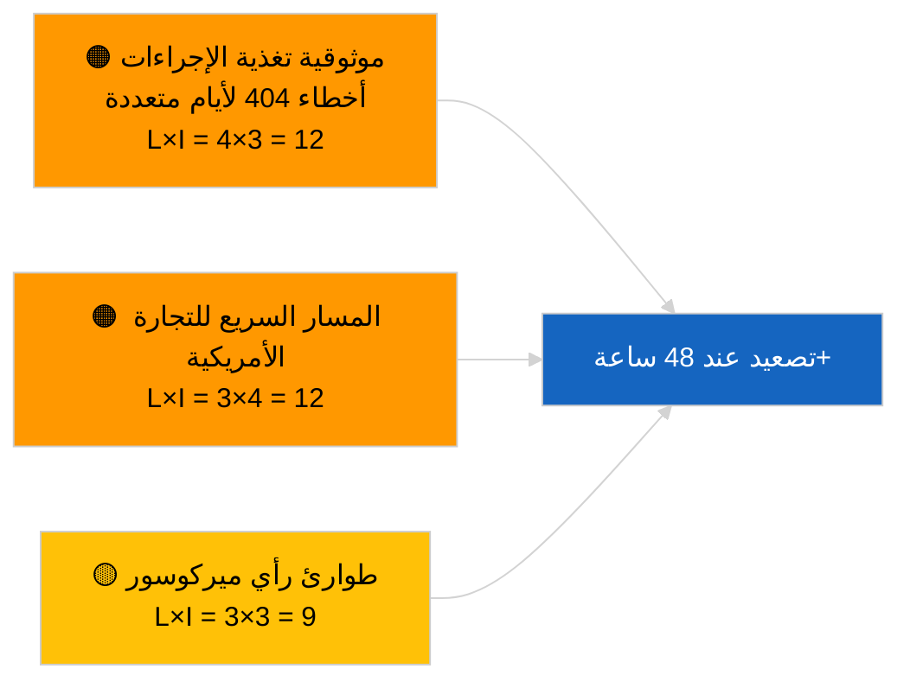

<!-- SPDX-FileCopyrightText: 2026 Hack23 AB -->
<!-- SPDX-License-Identifier: Apache-2.0 -->

# تقرير الاستخبارات — المقترحات | 2026-04-02

**التصنيف:** OSINT | السجل البرلماني العام
**مستوى الثقة:** 🟢 مرتفع (تقييم هيكلي خلال فترة العطلة البرلمانية)
**تاريخ الإنشاء:** 2026-04-02T00:00:00Z (تقرير استرجاعي)
**نوع المقال:** المقترحات
**معرّف التشغيل:** `a3fdcdee-e95c-4a90-a4de-4c41509e1c1d`
**المصدر:** بوابة البيانات المفتوحة للبرلمان الأوروبي

---

## 🎯 BLUF

**لم تُفتح أي مقترحات جديدة من المفوضية أو إجراءات مبادرة خاصة بالبرلمان الأوروبي في 2 أبريل 2026.** أسفر التشغيل `a3fdcdee-e95c-4a90-a4de-4c41509e1c1d` عن **0 جهة فاعلة مصنّفة** وأهمية **روتينية**، مما يعكس الحالة الفارغة لـ 2026-04-01/المقترحات. يتواصل نمط أخطاء 404 البالغة 6/8 في تغذيات المشورة المسجّلة في 1 أبريل 2026؛ ويُعدّ `get_procedures_feed` من بين نقاط النهاية المتأثرة. وبذلك يكون المخزون الموضوعي للمقترحات مع مطلع أبريل هو خط الأنابيب الموروث (إطار انبعاثات HDV TA-10-2026-0084، إجراء نائب رئيس البنك المركزي الأوروبي TA-10-2026-0060، تقرير التشريع الأفضل TA-10-2026-0063، إحالة الاتحاد الأوروبي-ميركوسور إلى محكمة العدل الأوروبية TA-10-2026-0008). **🟢 ثقة مرتفعة** في أن الحالة الفارغة مدفوعة بالتقويم وتوافر التغذية؛ **🟡 ثقة متوسطة** فيما يخص غياب إجراءات جديدة خلال تدهور واجهة برمجة التطبيقات.

---

## 🧭 3 قرارات يدعمها هذا التقرير

| # | القرار | من يقرر | الموعد النهائي | الأدلة |
|:-:|--------|---------|:-------------:|--------|
| 1 | **تحريري:** تخطّي المقترحات اليومية | المحرر | +24 ساعة | مخرجات التشغيل فارغة |
| 2 | **المراقبة:** مواصلة رصد صحة التغذية؛ تصنيف 48 ساعة+ من أخطاء 404 لـ `get_procedures_feed` كحادثة | خط أنابيب البيانات | 2026-04-03 | نمط مستمر |
| 3 | **الرصد الاستشرافي:** اجتماع هيئة مفوضية الاتحاد الأوروبي يوم الثلاثاء 7 أبريل 2026 — أول جلسة بعد عطلة عيد الفصح | رئيس التحليل | 2026-04-07 | إيقاع المفوضية |

---

## 📰 قراءة في 60 ثانية

- 🔴 **لا إجراءات جديدة** في 2 أبريل 2026؛ يستمر خطأ 404 في `get_procedures_feed`. (🟡 متوسط)
- 🟠 **0 جهة فاعلة مصنّفة**؛ لم يُحدَّد أي مفوض أو مديرية أو مقرر. (🟢 مرتفع)
- 🟢 **ترحيل خط الأنابيب** يُرسّخ قائمة رصد أبريل (HDV، البنك المركزي الأوروبي، التشريع الأفضل، ميركوسور). (🟢 مرتفع)
- 🟡 **أبعاد المخاطر جميعها "لا شيء"** اليوم. (🟢 مرتفع)
- 🔵 **السياق الاقتصادي:** مقترحات الربع الثاني المتوقعة بشأن قواعد تطبيق قانون الذكاء الاصطناعي، واستراتيجية الصناعة الدفاعية، ومراسلات الإطار المالي متعدد السنوات التحضيرية. (🟡 متوسط)
- 🟣 **الإسناد المتقاطع:** عمليات التشغيل الشقيقة 2026-04-02 قوالب فارغة؛ يُرسّخ 2026-04-03/breaking-2 قلق واجهة برمجة تطبيقات التغذية. (🟢 مرتفع)
- 🩷 **ناقل الاضطراب:** قد يُجبر الضغط التجاري الأمريكي على مقترح مفوضية بإجراءات مسرّعة في أبريل. (🟡 متوسط)
- ⚪ **الترحيل للأمام:** يظل رأي محكمة العدل الأوروبية بشأن ميركوسور أكثر محفزات المقترحات المعلّقة تأثيراً.

---

## 🗂️ أهم الوثائق/الإجراءات — رصد المقترحات

| الترتيب | مرجع البرلمان الأوروبي | العنوان (مختصر) | الأهمية | الثقة | الحالة |
|:-------:|----------------------|----------------|:-------:|:-----:|--------|
| 1 | — | لا مقترحات جديدة في 2026-04-02 | 0.0 | 🟡 متوسط | تحفظ خطأ 404 في التغذية |
| 2 | TA-10-2026-0008 | إحالة الاتحاد الأوروبي-ميركوسور إلى محكمة العدل (معلّقة) | 8.0 | 🟡 متوسط | رأي المحكمة منتظر |
| 3 | TA-10-2026-0084 | اعتمادات انبعاثات HDV 2025–2029 | 7.0 | 🟢 مرتفع | خط أنابيب النقل |

---

## ⚠️ لمحة سريعة عن المخاطر والتهديدات

| المخاطرة | L | I | النقاط | المحفّز | المصدر | الأدميرالية |
|----------|:-:|:-:|:------:|---------|--------|:-----------:|
| موثوقية تغذية الإجراءات | 4 | 3 | 12 | 48 ساعة+ من أخطاء 404 المستمرة | عمليات التشغيل الشقيقة | B2 |
| مقترح المسار السريع للتجارة الأمريكية | 3 | 4 | 12 | الإجراء الأمريكي | TA-10-2026-0096 | A1 |
| طوارئ رأي ميركوسور | 3 | 3 | 9 | المحكمة تنشر | TA-10-2026-0008 | A2 |
| احتكاك الإطار المالي التحضيري | 3 | 4 | 12 | مراسلة المفوضية الربع الثاني | إيقاع المفوضية | B2 |

---

## 🔮 المحفّز الاستشرافي الرئيسي

**اجتماع هيئة المفوضية يوم الثلاثاء 7 أبريل 2026** — أول جلسة جدول أعمال بعد عطلة عيد الفصح؛ يُعيّر المزيج الموضوعي قائمة رصد مقترحات الربع الثاني.

---

## 🛡️ تقييم جودة المصادر

- **المصادر الأولية:** بوابة البيانات المفتوحة للبرلمان الأوروبي؛ التشغيل `a3fdcdee-e95c-4a90-a4de-4c41509e1c1d`.
- **قيود البيانات:** يمنع خطأ 404 في `get_procedures_feed` التحقق التكميلي.
- **الثقة:** 🟡 متوسط للادعاء بغياب الإجراءات؛ 🟢 مرتفع للمحرّك التقويمي.

---

## 📎 الروابط

| الرابط | المسار |
|--------|--------|
| المقال | `./article.md` |
| عمليات التشغيل الشقيقة | `analysis/daily/2026-04-02/breaking/`, `committee-reports/`, `motions/` |
| البيان | `./manifest.json` |

---

**التحكم في الوثيقة**
- **القالب:** `/analysis/templates/executive-brief.md`
- **مسار القطعة الأثرية:** `analysis/daily/2026-04-02/propositions/executive-brief.md`
- **التصنيف:** عام
- **الإنشاء الاسترجاعي:** جلسة ملء بأثر رجعي.
