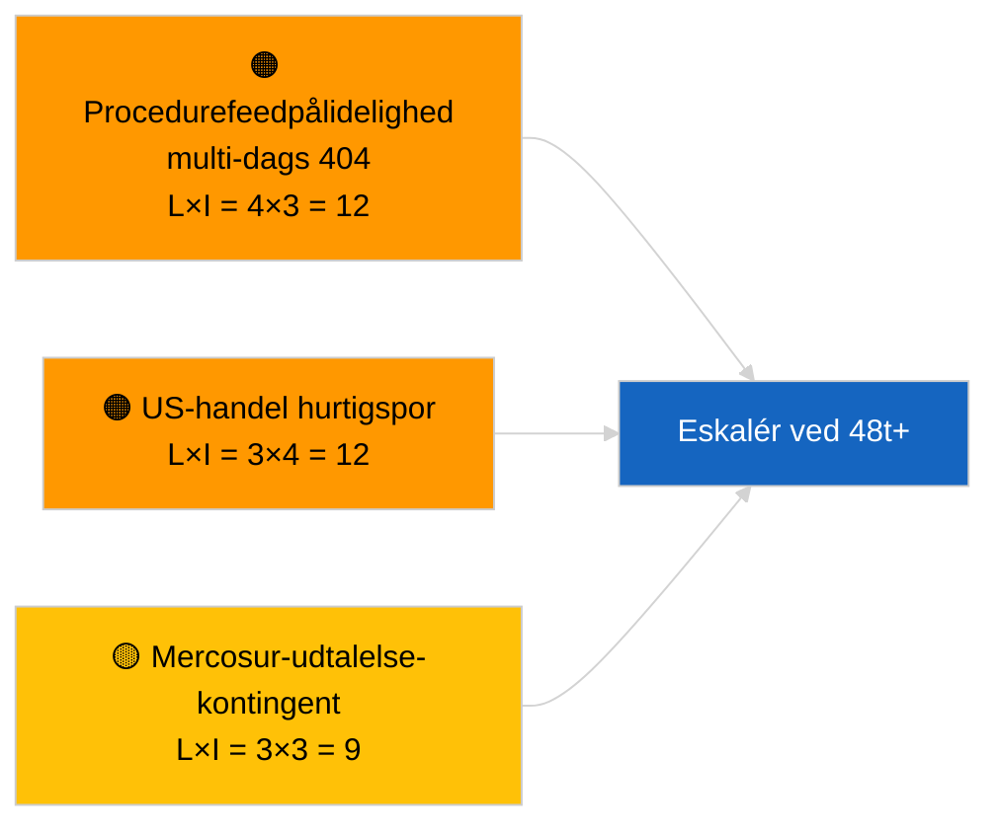

<!-- SPDX-FileCopyrightText: 2026 Hack23 AB -->
<!-- SPDX-License-Identifier: Apache-2.0 -->

# Efterretningsrapport — Forslag | 2026-04-02

**Klassifikation:** OSINT | Offentlig parlamentarisk optegnelse
**Tillid:** 🟢 Høj (strukturel vurdering i parlamentarisk feriepperiode)
**Genereret:** 2026-04-02T00:00:00Z (retrospektiv rapport)
**Artikeltype:** Forslag
**Kørselsnummer:** `a3fdcdee-e95c-4a90-a4de-4c41509e1c1d`
**Kilde:** Europa-Parlamentets åbne dataportal

---

## 🎯 BLUF

**Ingen nye Kommissionsforslag eller EP-egne initiativprocedurer åbnede den 2. april 2026.** Kørsel `a3fdcdee-e95c-4a90-a4de-4c41509e1c1d` returnerede **0 klassificerede aktører** og **RUTINE**-betydning, hvilket afspejler den tomme tilstand for 2026-04-01/forslag. Mønsteret med 6/8 rådgivningsstrøms-404'er, der blev logget den 1. april 2026, fortsætter; `get_procedures_feed` er blandt de berørte slutpunkter. Den substantielle forslagsopgørelse ved indgangen til april er derfor den nedarvede pipeline (HDV-emissionsramme TA-10-2026-0084, ECB-næstformandsproces TA-10-2026-0060, Bedre lovgivningsrapport TA-10-2026-0063, EU-Mercosur ECJ-forelæggelse TA-10-2026-0008). **🟢 HØJ tillid** til at den tomme tilstand er kalender- og feedtilgængelighedsdrevet; **🟡 MIDDEL tillid** til fravær af nye procedurer under feed-API-degraderingen.

---

## 🧭 3 Beslutninger denne rapport understøtter

| # | Beslutning | Hvem beslutter | Frist | Dokumentation |
|:-:|-----------|----------------|:-----:|---------------|
| 1 | **Redaktionel:** SPRING forslag dagligt over | Redaktør | +24t | Tom kørselsoutput |
| 2 | **Overvågning:** fortsæt overvågning af feedhelbred; markér 48t+ af `get_procedures_feed` 404'er som hændelse | Datapipeline | 2026-04-03 | Vedvarende mønster |
| 3 | **Fremadrettet overvågning:** Kommissionens tirsdagsmøde 7. april 2026 — første post-påske-kollegiums-dagsordensættelse | Analyseleder | 2026-04-07 | Kommissionens kadence |

---

## 📰 60-sekunders læsning

- 🔴 **Ingen nye procedurer** den 2. april 2026; `get_procedures_feed` 404 fortsætter. (🟡 Middel)
- 🟠 **0 aktører klassificeret**; ingen kommissær, GD eller ordfører identificeret. (🟢 Høj)
- 🟢 **Pipeline-carry-over** forankrer april-overvågningslisten (HDV, ECB, Bedre lovgivning, Mercosur). (🟢 Høj)
- 🟡 **Risikoimensioner alle "ingen"** i dag. (🟢 Høj)
- 🔵 **Økonomisk kontekst:** forventede Q2-forslag om gennemførelsesregler for AI Act, Forsvarsindustriel strategi, MFF-forberedende meddelelser. (🟡 Middel)
- 🟣 **Krydsreference:** søsterkørsler 2026-04-02 tomme skabeloner; 2026-04-03/breaking-2 formaliserer feed-API-bekymringen. (🟢 Høj)
- 🩷 **Forstyrrelsesvektor:** US handelspres kan fremtvinge et hurtigsporet Kommissionsforslag i april. (🟡 Middel)
- ⚪ **Carry-forward:** Mercosur ECJ-udtalelse forbliver den mest impaktfulde ventende forslagstrigger.

---

## 🗂️ Topdokumenter/procedurer — Forslags-overvågning

| Rang | EP-reference | Titel (kortform) | Betydning | Tillid | Status |
|:----:|-------------|-----------------|:---------:|:------:|--------|
| 1 | — | Ingen nye forslag den 2026-04-02 | 0,0 | 🟡 MIDDEL | Feed-404-forbehold |
| 2 | TA-10-2026-0008 | EU-Mercosur ECJ-forelæggelse (verserende) | 8,0 | 🟡 MIDDEL | Domstolsudtalelse forventet |
| 3 | TA-10-2026-0084 | HDV-emissionskreditter 2025–2029 | 7,0 | 🟢 HØJ | Transpositionspipeline |

---

## ⚠️ Risiko- og trusselsoversigt

| Risiko | L | I | Score | Trigger | Kilde | Admiralitet |
|--------|:-:|:-:|:-----:|---------|-------|:-----------:|
| Procedurefeedpålidelighed | 4 | 3 | 12 | 48t+ vedvarende 404 | Søsterkørsler | B2 |
| US-handel hurtigsporsforslag | 3 | 4 | 12 | US-handling | TA-10-2026-0096 | A1 |
| Mercosur-udtalelse-kontingent | 3 | 3 | 9 | Domstol udgiver | TA-10-2026-0008 | A2 |
| MFF-forberedende friktion | 3 | 4 | 12 | Q2-Kommissionsmeddelelse | Kommissionens kadence | B2 |

---

## 🔮 Ledende fremadrettet trigger

**Kommissionens tirsdagsmøde 7. april 2026** — første post-påske-kollegiums-dagsordensættelse; emneblandning kalibrerer Q2-forslagsovervågningslisten.

---

## 🛡️ Kildekvalitetsvurdering

- **Primære kilder:** EP:s åbne dataportal; kørsel `a3fdcdee-e95c-4a90-a4de-4c41509e1c1d`.
- **Databegrænsninger:** `get_procedures_feed` 404 forhindrer korroboration.
- **Tillid:** 🟡 MIDDEL til påstand om procedurefravær; 🟢 HØJ til kalenderdriver.

---

## 📎 Links

| Link | Sti |
|------|-----|
| Artikel | `./article.md` |
| Søsterkørsler | `analysis/daily/2026-04-02/breaking/`, `committee-reports/`, `motions/` |
| Manifest | `./manifest.json` |

---

**Dokumentkontrol**
- **Skabelon:** `/analysis/templates/executive-brief.md`
- **Artefaktsti:** `analysis/daily/2026-04-02/propositions/executive-brief.md`
- **Klassifikation:** Offentlig
- **Retrospektiv generering:** Backfill-session.
