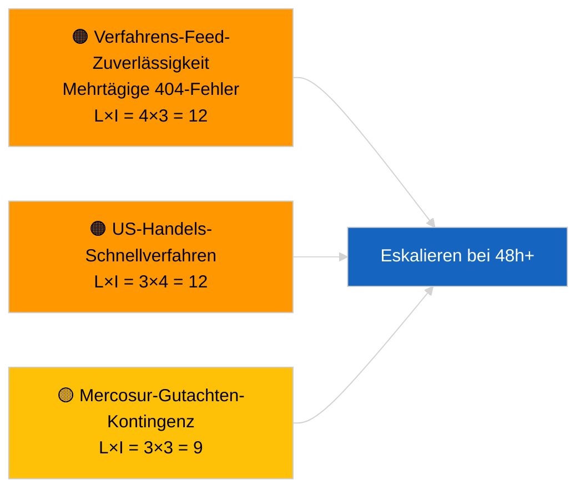

<!-- SPDX-FileCopyrightText: 2026 Hack23 AB -->
<!-- SPDX-License-Identifier: Apache-2.0 -->

# Nachrichtendienstbericht — Gesetzgebungsvorschläge | 2026-04-02

**Klassifizierung:** OSINT | Öffentliche Parlamentsdokumentation
**Vertraulichkeitsstufe:** 🟢 Hoch (strukturelle Beurteilung während parlamentarischer Ruhephase)
**Erstellt:** 2026-04-02T00:00:00Z (retrospektiver Bericht)
**Artikeltyp:** Vorschläge
**Ausführungs-ID:** `a3fdcdee-e95c-4a90-a4de-4c41509e1c1d`
**Quelle:** Offenes Datenportal des Europäischen Parlaments

---

## 🎯 BLUF

**Am 2. April 2026 wurden keine neuen Kommissionsvorschläge oder EP-Eigeninitiativverfahren eröffnet.** Die Ausführung `a3fdcdee-e95c-4a90-a4de-4c41509e1c1d` lieferte **0 klassifizierte Akteure** und **ROUTINEMÄSSIGE** Bedeutung, was den leeren Zustand vom 2026-04-01/Vorschläge widerspiegelt. Das am 1. April 2026 protokollierte Muster von 6/8 Beratungs-Feed-404-Fehlern setzt sich fort; `get_procedures_feed` gehört zu den betroffenen Endpunkten. Der substantielle Vorschlagsbestand zu Beginn des Aprils ist daher die ererbte Pipeline (HDV-Emissionsrahmen TA-10-2026-0084, EZB-Vizepräsidentenverfahren TA-10-2026-0060, Bessere Rechtsetzung-Bericht TA-10-2026-0063, EU-Mercosur-EuGH-Vorlage TA-10-2026-0008). **🟢 HOHE Zuversicht**, dass der leere Zustand kalender- und feed-verfügbarkeitsbedingt ist; **🟡 MITTLERE Zuversicht** hinsichtlich des Fehlens neuer Verfahren während der API-Degradierung.

---

## 🧭 3 Entscheidungen, die dieser Bericht unterstützt

| # | Entscheidung | Zuständig | Frist | Belege |
|:-:|-------------|-----------|:-----:|--------|
| 1 | **Redaktionell:** Vorschläge täglich ÜBERSPRINGEN | Redakteur | +24h | Leere Ausführungsausgabe |
| 2 | **Überwachung:** Feed-Gesundheitsüberwachung fortsetzen; 48h+ `get_procedures_feed` 404-Fehler als Vorfall markieren | Datenpipeline | 2026-04-03 | Anhaltendes Muster |
| 3 | **Vorausschauende Beobachtung:** Kommissions-Kollegiumssitzung 7. April 2026 — erste Tagesordnung nach Ostern | Analyseleiter | 2026-04-07 | Kommissionsrhythmus |

---

## 📰 60-Sekunden-Lektüre

- 🔴 **Keine neuen Verfahren** am 2. April 2026; `get_procedures_feed` 404 setzt sich fort. (🟡 Mittel)
- 🟠 **0 Akteure klassifiziert**; kein Kommissar, keine GD, kein Berichterstatter identifiziert. (🟢 Hoch)
- 🟢 **Pipeline-Carry-over** verankert die April-Beobachtungsliste (HDV, EZB, Bessere Rechtsetzung, Mercosur). (🟢 Hoch)
- 🟡 **Risikodimensionen alle „keine"** heute. (🟢 Hoch)
- 🔵 **Wirtschaftlicher Kontext:** erwartete Q2-Vorschläge zu Durchführungsvorschriften des AI Act, Industriestrategie Verteidigung, MFF-vorbereitende Mitteilungen. (🟡 Mittel)
- 🟣 **Querverweise:** Geschwisterläufe 2026-04-02 leere Vorlagen; 2026-04-03/breaking-2 formalisiert die Feed-API-Besorgnis. (🟢 Hoch)
- 🩷 **Störungsvektor:** US-Handelsdruck könnte im April einen Schnellverfahrens-Kommissionsvorschlag erzwingen. (🟡 Mittel)
- ⚪ **Carry-forward:** Mercosur-EuGH-Gutachten bleibt der wirkungsmächtigste ausstehende Vorschlags-Trigger.

---

## 🗂️ Top-Dokumente/Verfahren — Vorschlagsüberwachung

| Rang | EP-Referenz | Titel (Kurzform) | Bedeutung | Zuversicht | Status |
|:----:|------------|-----------------|:---------:|:----------:|--------|
| 1 | — | Keine neuen Vorschläge am 2026-04-02 | 0,0 | 🟡 MITTEL | Feed-404-Vorbehalt |
| 2 | TA-10-2026-0008 | EU-Mercosur-EuGH-Vorlage (ausstehend) | 8,0 | 🟡 MITTEL | Gutachten erwartet |
| 3 | TA-10-2026-0084 | HDV-Emissionskredite 2025–2029 | 7,0 | 🟢 HOCH | Umsetzungspipeline |

---

## ⚠️ Risiko- und Bedrohungsübersicht

| Risiko | L | I | Wertung | Auslöser | Quelle | Admiralität |
|--------|:-:|:-:|:-------:|----------|--------|:-----------:|
| Verfahrens-Feed-Zuverlässigkeit | 4 | 3 | 12 | 48h+ anhaltende 404-Fehler | Geschwisterläufe | B2 |
| US-Handels-Schnellvorschlag | 3 | 4 | 12 | US-Maßnahme | TA-10-2026-0096 | A1 |
| Mercosur-Gutachten-Kontingenz | 3 | 3 | 9 | Gericht veröffentlicht | TA-10-2026-0008 | A2 |
| MFF-Vorbereitungsreibung | 3 | 4 | 12 | Q2-Kommissionsmitteilung | Kommissionsrhythmus | B2 |

---

## 🔮 Führender Vorwärtstrigger

**Kommissions-Kollegiumssitzung 7. April 2026** — erste Tagesordnung nach Ostern; Themengemisch kalibriert die Q2-Vorschlagsbeobachtungsliste.

---

## 🛡️ Quellqualitätsbewertung

- **Primärquellen:** EP-Offenes Datenportal; Ausführung `a3fdcdee-e95c-4a90-a4de-4c41509e1c1d`.
- **Datenbeschränkungen:** `get_procedures_feed` 404 verhindert Korroboration.
- **Zuversicht:** 🟡 MITTEL für Verfahrensabwesenheitsbehauptung; 🟢 HOCH für Kalender-Treiber.

---

## 📎 Links

| Link | Pfad |
|------|------|
| Artikel | `./article.md` |
| Geschwisterläufe | `analysis/daily/2026-04-02/breaking/`, `committee-reports/`, `motions/` |
| Manifest | `./manifest.json` |

---

**Dokumentenkontrolle**
- **Vorlage:** `/analysis/templates/executive-brief.md`
- **Artefaktpfad:** `analysis/daily/2026-04-02/propositions/executive-brief.md`
- **Klassifizierung:** Öffentlich
- **Retrospektive Erstellung:** Rückwirkende Befüllung.
