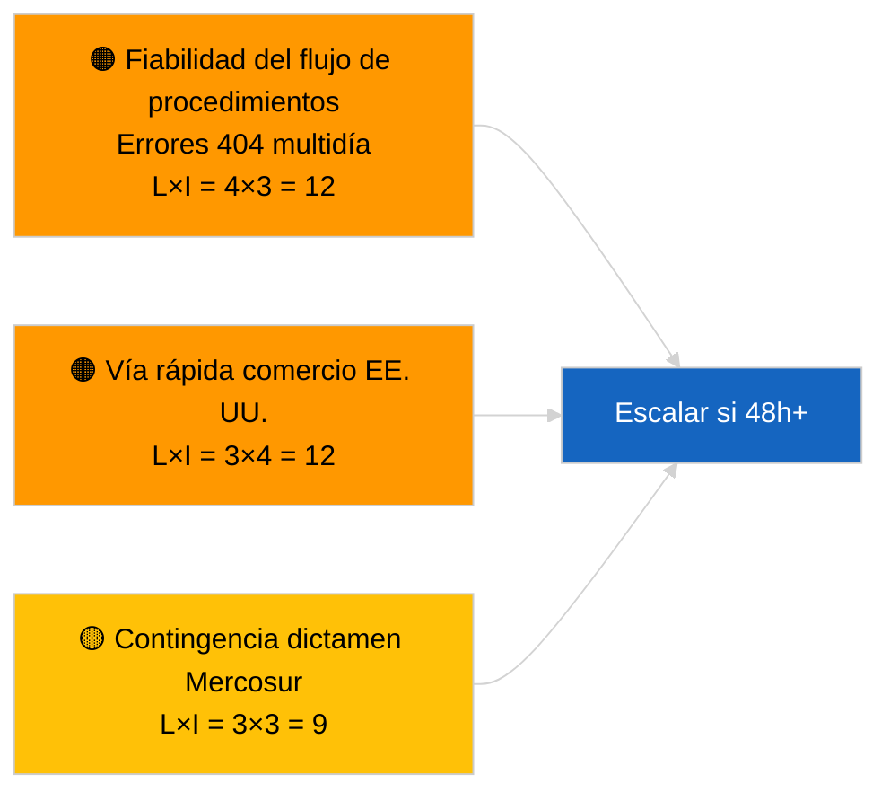

<!-- SPDX-FileCopyrightText: 2026 Hack23 AB -->
<!-- SPDX-License-Identifier: Apache-2.0 -->

# Resumen ejecutivo de inteligencia — Propuestas | 2026-04-02

**Clasificación:** OSINT | Registro parlamentario público
**Nivel de confianza:** 🟢 Alto (evaluación estructural durante período de receso parlamentario)
**Generado:** 2026-04-02T00:00:00Z (informe retrospectivo)
**Tipo de artículo:** Propuestas
**ID de ejecución:** `a3fdcdee-e95c-4a90-a4de-4c41509e1c1d`
**Fuente:** Portal de datos abiertos del Parlamento Europeo

---

## 🎯 BLUF

**No se abrieron nuevas propuestas de la Comisión ni procedimientos de iniciativa propia del PE el 2 de abril de 2026.** La ejecución `a3fdcdee-e95c-4a90-a4de-4c41509e1c1d` devolvió **0 actores clasificados** e importancia **RUTINARIA**, lo que refleja el estado vacío de 2026-04-01/propuestas. El patrón de 6/8 errores 404 en los flujos de asesoramiento registrado el 1 de abril de 2026 continúa; `get_procedures_feed` se encuentra entre los puntos de conexión afectados. El inventario sustantivo de propuestas al inicio de abril es por tanto la canalización heredada (marco de emisiones HDV TA-10-2026-0084, procedimiento vicepresidente BCE TA-10-2026-0060, informe de Legislar Mejor TA-10-2026-0063, remisión UE-Mercosur al TJUE TA-10-2026-0008). **🟢 ALTA confianza** en que el estado vacío se debe al calendario y a la disponibilidad de los flujos; **🟡 CONFIANZA MEDIA** sobre la ausencia de nuevos procedimientos durante la degradación de la API.

---

## 🧭 3 Decisiones que apoya este informe

| # | Decisión | Quién decide | Plazo | Evidencia |
|:-:|---------|-------------|:-----:|-----------|
| 1 | **Editorial:** OMITIR propuestas diariamente | Editor | +24h | Resultado de ejecución vacío |
| 2 | **Monitoreo:** continuar vigilancia del estado del flujo; marcar 48h+ de errores 404 de `get_procedures_feed` como incidente | Canal de datos | 2026-04-03 | Patrón sostenido |
| 3 | **Vigilancia prospectiva:** reunión del Colegio de la Comisión martes 7 de abril de 2026 — primera sesión post-Semana Santa | Responsable de análisis | 2026-04-07 | Cadencia de la Comisión |

---

## 📰 Lectura de 60 segundos

- 🔴 **Sin nuevos procedimientos** el 2 de abril de 2026; error 404 de `get_procedures_feed` continúa. (🟡 Medio)
- 🟠 **0 actores clasificados**; ningún comisario, DG ni ponente identificado. (🟢 Alto)
- 🟢 **Pipeline carry-over** ancla la lista de vigilancia de abril (HDV, BCE, Legislar Mejor, Mercosur). (🟢 Alto)
- 🟡 **Dimensiones de riesgo todas «ninguna»** hoy. (🟢 Alto)
- 🔵 **Contexto económico:** propuestas Q2 esperadas sobre normas de aplicación del Reglamento de IA, Estrategia Industrial de Defensa, comunicaciones preparatorias del MFP. (🟡 Medio)
- 🟣 **Referencia cruzada:** ejecuciones hermanas 2026-04-02 plantillas vacías; 2026-04-03/breaking-2 formaliza la preocupación de la API del flujo. (🟢 Alto)
- 🩷 **Vector de disrupción:** la presión comercial de EE. UU. podría forzar una propuesta de la Comisión por vía rápida en abril. (🟡 Medio)
- ⚪ **Carry-forward:** el dictamen del TJUE sobre Mercosur sigue siendo el detonante de propuesta pendiente de mayor impacto.

---

## 🗂️ Principales documentos/procedimientos — Seguimiento de propuestas

| Rango | Referencia PE | Título (abreviado) | Importancia | Confianza | Estado |
|:-----:|-------------|-------------------|:-----------:|:---------:|--------|
| 1 | — | No hay nuevas propuestas en 2026-04-02 | 0,0 | 🟡 MEDIO | Reserva error 404 flujo |
| 2 | TA-10-2026-0008 | Remisión UE-Mercosur al TJUE (pendiente) | 8,0 | 🟡 MEDIO | Dictamen del TJUE esperado |
| 3 | TA-10-2026-0084 | Créditos de emisiones HDV 2025–2029 | 7,0 | 🟢 ALTO | Canalización de transposición |

---

## ⚠️ Panorama de riesgos y amenazas

| Riesgo | L | I | Puntuación | Desencadenante | Fuente | Almirantazgo |
|--------|:-:|:-:|:----------:|----------------|--------|:------------:|
| Fiabilidad del flujo de procedimientos | 4 | 3 | 12 | 404 persistente 48h+ | Ejecuciones hermanas | B2 |
| Propuesta vía rápida comercio EE. UU. | 3 | 4 | 12 | Acción de EE. UU. | TA-10-2026-0096 | A1 |
| Contingencia dictamen Mercosur | 3 | 3 | 9 | Publicación del TJUE | TA-10-2026-0008 | A2 |
| Fricción preparatoria MFP | 3 | 4 | 12 | Comunicación Comisión Q2 | Cadencia Comisión | B2 |

---

## 🔮 Principal desencadenante prospectivo

**Reunión del Colegio de la Comisión, martes 7 de abril de 2026** — primera sesión de programación post-Semana Santa; la combinación temática calibra la lista de seguimiento de propuestas Q2.

---

## 🛡️ Evaluación de la calidad de las fuentes

- **Fuentes primarias:** Portal de datos abiertos del PE; ejecución `a3fdcdee-e95c-4a90-a4de-4c41509e1c1d`.
- **Limitaciones de los datos:** `get_procedures_feed` 404 impide la corroboración.
- **Confianza:** 🟡 MEDIO para la afirmación de ausencia de procedimientos; 🟢 ALTO para el motor calendario.

---

## 📎 Enlaces

| Enlace | Ruta |
|--------|------|
| Artículo | `./article.md` |
| Ejecuciones hermanas | `analysis/daily/2026-04-02/breaking/`, `committee-reports/`, `motions/` |
| Manifiesto | `./manifest.json` |

---

**Control de documentos**
- **Plantilla:** `/analysis/templates/executive-brief.md`
- **Ruta del artefacto:** `analysis/daily/2026-04-02/propositions/executive-brief.md`
- **Clasificación:** Público
- **Generación retrospectiva:** Sesión de relleno.
