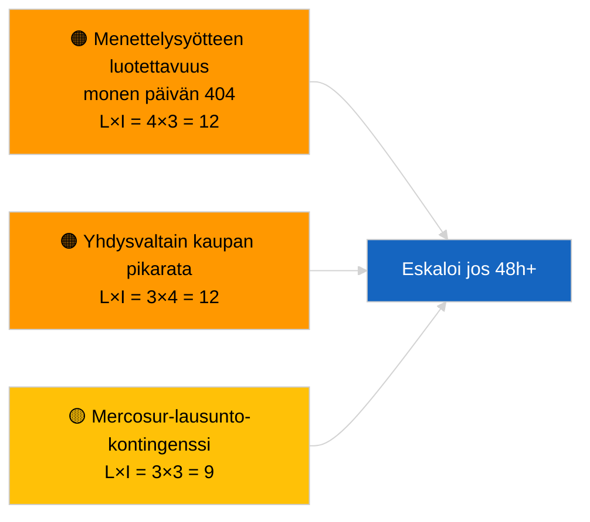

<!-- SPDX-FileCopyrightText: 2026 Hack23 AB -->
<!-- SPDX-License-Identifier: Apache-2.0 -->

# Tiedusteluraportti — Ehdotukset | 2026-04-02

**Luokitus:** OSINT | Julkinen parlamentaarinen asiakirja
**Luottamustaso:** 🟢 Korkea (rakenteellinen arvio parlamentaarisen loma-ajan aikana)
**Luotu:** 2026-04-02T00:00:00Z (retrospektiivinen raportti)
**Artikkelityyppi:** Ehdotukset
**Ajotunus:** `a3fdcdee-e95c-4a90-a4de-4c41509e1c1d`
**Lähde:** Euroopan parlamentin avoin dataportti

---

## 🎯 BLUF

**Uusia komission ehdotuksia tai EP:n omia aloitemenettelyjä ei avattu 2. huhtikuuta 2026.** Ajo `a3fdcdee-e95c-4a90-a4de-4c41509e1c1d` palautti **0 luokiteltua toimijaa** ja **RUTIINITASON** merkityksen, mikä heijastaa 2026-04-01/ehdotusten tyhjää tilaa. 1. huhtikuuta 2026 kirjattu 6/8 neuvontavirta-404-virheideenmalli jatkuu; `get_procedures_feed` kuuluu vaikuttaneisiin päätepisteisiin. Huhtikuun alussa käytössä oleva substantiivinen ehdotusvarasto on siis peritty putkilinja (HDV-päästökehys TA-10-2026-0084, EKP:n varapuheenjohtajamenettely TA-10-2026-0060, Paremman sääntelyn raportti TA-10-2026-0063, EU-Mercosur ECJ-ennakkoratkaisu TA-10-2026-0008). **🟢 KORKEA luottamustaso** siihen, että tyhjä tila johtuu kalenterista ja syötteen saatavuudesta; **🟡 KESKITASOINEN luottamustaso** uusien menettelyjen puuttumiselle API-heikentymisen aikana.

---

## 🧭 3 päätöstä, joita tämä raportti tukee

| # | Päätös | Kuka päättää | Määräaika | Näyttö |
|:-:|--------|--------------|:---------:|--------|
| 1 | **Toimituksellinen:** OHITA ehdotukset päivittäin | Toimittaja | +24h | Tyhjä ajotuloste |
| 2 | **Seuranta:** jatka syötteen terveydentilan seurantaa; merkitse 48h+ `get_procedures_feed` 404-virheet tapahtumaksi | Datapipeline | 2026-04-03 | Pysyvä malli |
| 3 | **Eteenpäin katsova seuranta:** Komission tiistaikokous 7. huhtikuuta 2026 — ensimmäinen pääsiäisen jälkeinen kollegiokäsittely | Analyysipäällikkö | 2026-04-07 | Komission tahti |

---

## 📰 60 sekunnin luku

- 🔴 **Ei uusia menettelyjä** 2. huhtikuuta 2026; `get_procedures_feed` 404 jatkuu. (🟡 Keskiluokan)
- 🟠 **0 toimijaa luokiteltu**; ei komissaaria, pääosastoa tai esittelijää tunnistettu. (🟢 Korkea)
- 🟢 **Putkilinjan carry-over** ankkuroi huhtikuun seurantalistan (HDV, EKP, Parempi sääntely, Mercosur). (🟢 Korkea)
- 🟡 **Riskidimensiot kaikki "ei mitään"** tänään. (🟢 Korkea)
- 🔵 **Taloudellinen konteksti:** odotetut Q2-ehdotukset tekoälylain täytäntöönpanosäännöistä, Puolustusalan teollisesta strategiasta, MFF:n valmistelevista tiedonannoista. (🟡 Keskiluokan)
- 🟣 **Ristiviittaus:** sisarusajot 2026-04-02 tyhjät pohjat; 2026-04-03/breaking-2 muodollistaa syöte-API-huolen. (🟢 Korkea)
- 🩷 **Häiriövektori:** Yhdysvaltain kauppapaine voi pakottaa pikamenettelykohteisen komission ehdotuksen huhtikuussa. (🟡 Keskiluokan)
- ⚪ **Carry-forward:** Mercosur ECJ:n lausunto on edelleen odottavista ehdotusten laukaisimista vaikutukseltaan suurin.

---

## 🗂️ Huipputiedostot/menettelyt — Ehdotusten seuranta

| Sija | EP-viittaus | Otsikko (lyhyt) | Merkitys | Luottamustaso | Tila |
|:----:|-------------|-----------------|:--------:|:-------------:|------|
| 1 | — | Ei uusia ehdotuksia 2026-04-02 | 0,0 | 🟡 KESKILUOKAN | Syöte-404-varaus |
| 2 | TA-10-2026-0008 | EU-Mercosur ECJ-ennakkoratkaisu (vireillä) | 8,0 | 🟡 KESKILUOKAN | Tuomioistuimen lausunto odottaa |
| 3 | TA-10-2026-0084 | HDV-päästöhyvitykset 2025–2029 | 7,0 | 🟢 KORKEA | Implementointipipeline |

---

## ⚠️ Riski- ja uhkakatsaus

| Riski | L | I | Pistemäärä | Laukaisin | Lähde | Amiraalisuus |
|-------|:-:|:-:|:----------:|-----------|-------|:------------:|
| Menettelysyötteen luotettavuus | 4 | 3 | 12 | 48h+ pysyvä 404 | Sisarusajot | B2 |
| Yhdysvaltain kaupan pikaehdotus | 3 | 4 | 12 | Yhdysvaltain toimi | TA-10-2026-0096 | A1 |
| Mercosur-lausunto-kontingenssi | 3 | 3 | 9 | Tuomioistuin julkaisee | TA-10-2026-0008 | A2 |
| MFF-valmisteleva kitka | 3 | 4 | 12 | Q2-komission tiedonanto | Komission tahti | B2 |

---

## 🔮 Johtava eteenpäin katsova laukaisin

**Komission tiistaikokous 7. huhtikuuta 2026** — ensimmäinen pääsiäisen jälkeinen kollegiokäsittely; aiheiden yhdistelmä kalibroi Q2-ehdotusten seurantalistaa.

---

## 🛡️ Lähteen laadun arviointi

- **Ensisijaiset lähteet:** EP:n avoin dataportti; ajo `a3fdcdee-e95c-4a90-a4de-4c41509e1c1d`.
- **Datan rajoitukset:** `get_procedures_feed` 404 estää korroboraation.
- **Luottamustaso:** 🟡 KESKILUOKAN menettelyen puuttumista koskevaan väitteeseen; 🟢 KORKEA kalenteriajuriin.

---

## 📎 Linkit

| Linkki | Polku |
|--------|-------|
| Artikkeli | `./article.md` |
| Sisarusajot | `analysis/daily/2026-04-02/breaking/`, `committee-reports/`, `motions/` |
| Manifesti | `./manifest.json` |

---

**Asiakirjavalvonta**
- **Pohja:** `/analysis/templates/executive-brief.md`
- **Artefaktipolku:** `analysis/daily/2026-04-02/propositions/executive-brief.md`
- **Luokitus:** Julkinen
- **Retrospektiivinen luominen:** Täyttöistunto.
