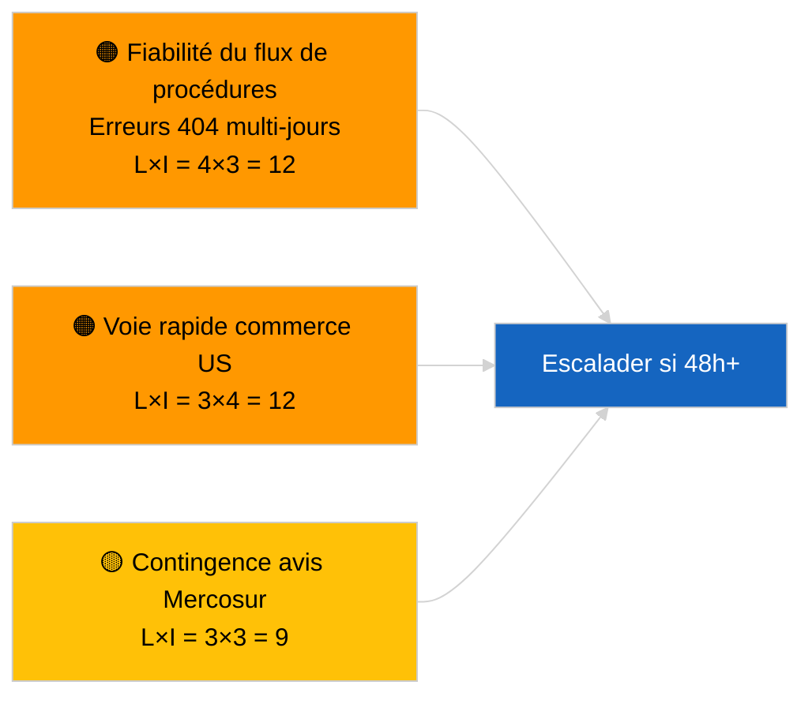

<!-- SPDX-FileCopyrightText: 2026 Hack23 AB -->
<!-- SPDX-License-Identifier: Apache-2.0 -->

# Synthèse de renseignement — Propositions | 2026-04-02

**Classification :** OSINT | Document parlementaire public
**Niveau de confiance :** 🟢 Élevé (évaluation structurelle en période de vacances parlementaires)
**Généré le :** 2026-04-02T00:00:00Z (rapport rétrospectif)
**Type d'article :** Propositions
**Identifiant d'exécution :** `a3fdcdee-e95c-4a90-a4de-4c41509e1c1d`
**Source :** Portail de données ouvertes du Parlement européen

---

## 🎯 BLUF

**Aucune nouvelle proposition de la Commission ni nouvelle procédure d'initiative propre du PE n'a été ouverte le 2 avril 2026.** L'exécution `a3fdcdee-e95c-4a90-a4de-4c41509e1c1d` a renvoyé **0 acteur classifié** et une importance **ROUTINIÈRE**, reflétant l'état vide de 2026-04-01/propositions. Le schéma de 6/8 erreurs 404 sur les flux consultatifs consigné le 1er avril 2026 persiste ; `get_procedures_feed` figure parmi les points de terminaison affectés. L'inventaire substantiel des propositions à l'entrée d'avril est donc la chaîne héritée (cadre d'émissions HDV TA-10-2026-0084, procédure vice-président BCE TA-10-2026-0060, rapport Mieux légiférer TA-10-2026-0063, renvoi UE-Mercosur Cour de justice TA-10-2026-0008). **🟢 HAUTE confiance** que l'état vide est dû au calendrier et à la disponibilité des flux ; **🟡 CONFIANCE MOYENNE** quant à l'absence de nouvelles procédures pendant la dégradation de l'API.

---

## 🧭 3 Décisions que ce rapport éclaire

| # | Décision | Décideur | Délai | Éléments probants |
|:-:|---------|----------|:-----:|-------------------|
| 1 | **Éditorial :** IGNORER les propositions quotidiennes | Rédacteur | +24h | Résultat d'exécution vide |
| 2 | **Surveillance :** poursuivre le suivi de l'état des flux ; signaler 48h+ d'erreurs 404 de `get_procedures_feed` comme incident | Chaîne de données | 2026-04-03 | Schéma persistant |
| 3 | **Veille prospective :** réunion du collège de la Commission mardi 7 avril 2026 — première mise à l'ordre du jour post-Pâques | Responsable d'analyse | 2026-04-07 | Cadence de la Commission |

---

## 📰 Lecture en 60 secondes

- 🔴 **Aucune nouvelle procédure** le 2 avril 2026 ; erreur 404 de `get_procedures_feed` persiste. (🟡 Moyen)
- 🟠 **0 acteur classifié** ; aucun commissaire, DG ni rapporteur identifié. (🟢 Élevé)
- 🟢 **Carry-over de la chaîne** ancre la liste de surveillance d'avril (HDV, BCE, Mieux légiférer, Mercosur). (🟢 Élevé)
- 🟡 **Dimensions de risque toutes « aucune »** aujourd'hui. (🟢 Élevé)
- 🔵 **Contexte économique :** propositions Q2 attendues sur les règles d'exécution du règlement sur l'IA, la stratégie industrielle de défense, les communications préparatoires du CFP. (🟡 Moyen)
- 🟣 **Référence croisée :** exécutions sœurs 2026-04-02 modèles vides ; 2026-04-03/breaking-2 formalise le problème de l'API de flux. (🟢 Élevé)
- 🩷 **Vecteur de perturbation :** la pression commerciale américaine pourrait forcer une proposition de la Commission en procédure accélérée en avril. (🟡 Moyen)
- ⚪ **Carry-forward :** l'avis de la Cour de justice sur Mercosur demeure le déclencheur de propositions en attente le plus impactant.

---

## 🗂️ Principaux documents/procédures — Veille sur les propositions

| Rang | Référence PE | Titre (abrégé) | Importance | Confiance | Statut |
|:----:|-------------|---------------|:----------:|:---------:|--------|
| 1 | — | Aucune nouvelle proposition le 2026-04-02 | 0,0 | 🟡 MOYEN | Réserve erreur 404 flux |
| 2 | TA-10-2026-0008 | Renvoi UE-Mercosur Cour de justice (en attente) | 8,0 | 🟡 MOYEN | Avis de la Cour attendu |
| 3 | TA-10-2026-0084 | Crédits d'émissions HDV 2025–2029 | 7,0 | 🟢 ÉLEVÉ | Chaîne de transposition |

---

## ⚠️ Aperçu des risques et menaces

| Risque | L | I | Score | Déclencheur | Source | Amirauté |
|--------|:-:|:-:|:-----:|-------------|--------|:--------:|
| Fiabilité du flux de procédures | 4 | 3 | 12 | 404 persistante 48h+ | Exécutions sœurs | B2 |
| Proposition de voie rapide commerce US | 3 | 4 | 12 | Action américaine | TA-10-2026-0096 | A1 |
| Contingence avis Mercosur | 3 | 3 | 9 | Publication de la Cour | TA-10-2026-0008 | A2 |
| Friction préparatoire CFP | 3 | 4 | 12 | Communication Commission Q2 | Cadence Commission | B2 |

---

## 🔮 Principal déclencheur prospectif

**Réunion du collège de la Commission, mardi 7 avril 2026** — première mise à l'ordre du jour post-Pâques ; le mélange thématique calibre la liste de veille Q2 des propositions.

---

## 🛡️ Évaluation de la qualité des sources

- **Sources primaires :** Portail de données ouvertes du PE ; exécution `a3fdcdee-e95c-4a90-a4de-4c41509e1c1d`.
- **Limites des données :** `get_procedures_feed` 404 empêche la corroboration.
- **Confiance :** 🟡 MOYEN pour l'affirmation d'absence de procédure ; 🟢 ÉLEVÉ pour le moteur calendaire.

---

## 📎 Liens

| Lien | Chemin |
|------|--------|
| Article | `./article.md` |
| Exécutions sœurs | `analysis/daily/2026-04-02/breaking/`, `committee-reports/`, `motions/` |
| Manifeste | `./manifest.json` |

---

**Contrôle documentaire**
- **Modèle :** `/analysis/templates/executive-brief.md`
- **Chemin d'artefact :** `analysis/daily/2026-04-02/propositions/executive-brief.md`
- **Classification :** Public
- **Génération rétrospective :** Session de remplissage.
