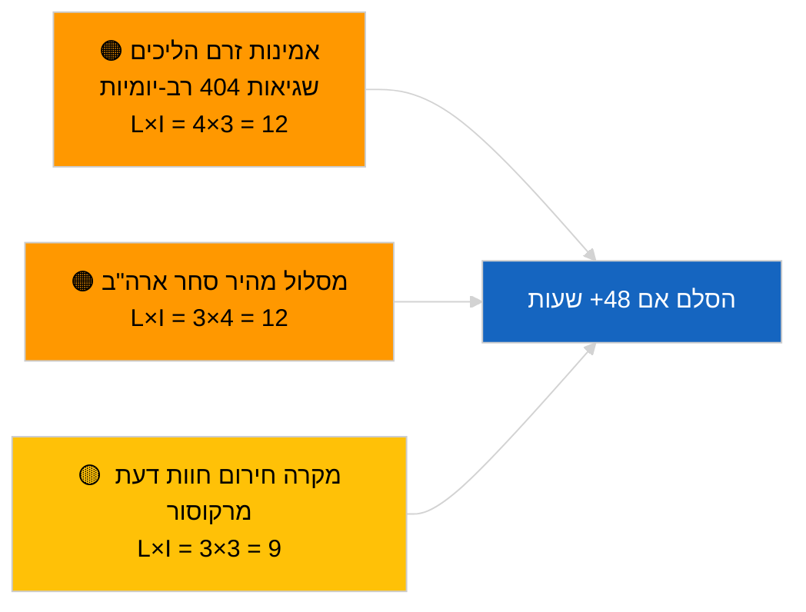

<!-- SPDX-FileCopyrightText: 2026 Hack23 AB -->
<!-- SPDX-License-Identifier: Apache-2.0 -->

# דוח מודיעין — הצעות | 2026-04-02

**סיווג:** OSINT | תיעוד פרלמנטרי ציבורי
**רמת אמינות:** 🟢 גבוהה (הערכה מבנית בתקופת הפסקה פרלמנטרית)
**נוצר:** 2026-04-02T00:00:00Z (דוח רטרוספקטיבי)
**סוג מאמר:** הצעות
**מזהה הרצה:** `a3fdcdee-e95c-4a90-a4de-4c41509e1c1d`
**מקור:** פורטל הנתונים הפתוחים של הפרלמנט האירופי

---

## 🎯 BLUF

**לא נפתחו הצעות חדשות של המפקדה או הליכי יוזמה עצמית של הפרלמנט האירופי ב-2 באפריל 2026.** הרצה `a3fdcdee-e95c-4a90-a4de-4c41509e1c1d` החזירה **0 שחקנים מסווגים** ומשמעות **שגרתית**, המשקפת את המצב הריק של 2026-04-01/הצעות. דפוס 6/8 שגיאות 404 בזרמי ייעוץ שנרשם ב-1 באפריל 2026 נמשך; `get_procedures_feed` נמנה עם נקודות הקצה המושפעות. מלאי ההצעות המהותי בכניסה לאפריל הוא אפוא הצינור הקיים (מסגרת פליטות HDV TA-10-2026-0084, הליך סגן נשיא ה-ECB TA-10-2026-0060, דוח חקיקה טובה יותר TA-10-2026-0063, הפניית האיחוד האירופי-מרקוסור ל-ECJ TA-10-2026-0008). **🟢 אמינות גבוהה** שהמצב הריק מונע מלוח שנה וזמינות זרם נתונים; **🟡 אמינות בינונית** לגבי היעדר הליכים חדשים בעת שחיקת ה-API.

---

## 🧭 3 החלטות שדוח זה תומך בהן

| # | החלטה | מי מחליט | מועד | ראיות |
|:-:|--------|---------|:----:|-------|
| 1 | **עריכתי:** דלג על הצעות יומיות | עורך | +24 שעות | תפוקת הרצה ריקה |
| 2 | **מעקב:** המשך ניטור בריאות זרם; סמן 48+ שעות של שגיאות 404 של `get_procedures_feed` כתקרית | צינור נתונים | 2026-04-03 | דפוס מתמשך |
| 3 | **ניטור קדימה:** פגישת המכללה של המפקדה יום שלישי 7 באפריל 2026 — סדר יום ראשון אחרי חג הפסחא | ראש ניתוח | 2026-04-07 | קצב המפקדה |

---

## 📰 קריאה של 60 שניות

- 🔴 **ללא הליכים חדשים** ב-2 באפריל 2026; שגיאת 404 של `get_procedures_feed` נמשכת. (🟡 בינוני)
- 🟠 **0 שחקנים מסווגים**; לא זוהה קומיסר, מנהלייה כללית או מדווח. (🟢 גבוה)
- 🟢 **העברת צינור** מעגנת רשימת מעקב אפריל (HDV, ECB, חקיקה טובה יותר, מרקוסור). (🟢 גבוה)
- 🟡 **ממדי סיכון כולם "אין"** היום. (🟢 גבוה)
- 🔵 **הקשר כלכלי:** הצעות Q2 צפויות לכללי יישום חוק הבינה המלאכותית, אסטרטגיה תעשייתית ביטחונית, תקשורות מקדימות ל-MFF. (🟡 בינוני)
- 🟣 **הפניה צולבת:** הרצות-אחיות 2026-04-02 תבניות ריקות; 2026-04-03/breaking-2 ממסד את חשש ה-API של הזרם. (🟢 גבוה)
- 🩷 **וקטור הפרעה:** לחץ סחר אמריקני עשוי לאלץ הצעת מפקדה בנתיב מהיר באפריל. (🟡 בינוני)
- ⚪ **העברה קדימה:** חוות דעת ECJ לגבי מרקוסור נשארת הטריגר הממתין בעל ההשפעה הגבוהה ביותר.

---

## 🗂️ מסמכים/הליכים מובילים — מעקב הצעות

| דרוג | הפניית הפרלמנט האירופי | כותרת (קצרה) | חשיבות | אמינות | סטטוס |
|:----:|----------------------|------------|:------:|:------:|--------|
| 1 | — | ללא הצעות חדשות ב-2026-04-02 | 0.0 | 🟡 בינוני | הסתייגות שגיאת 404 בזרם |
| 2 | TA-10-2026-0008 | הפניית האיחוד האירופי-מרקוסור ל-ECJ (תלויה) | 8.0 | 🟡 בינוני | חוות דעת בית המשפט צפויה |
| 3 | TA-10-2026-0084 | קרדיטים לפליטות HDV 2025–2029 | 7.0 | 🟢 גבוה | צינור השתלה |

---

## ⚠️ תמונת מצב סיכונים ואיומים

| סיכון | L | I | ציון | טריגר | מקור | אדמירלות |
|-------|:-:|:-:|:----:|-------|------|:---------:|
| אמינות זרם הליכים | 4 | 3 | 12 | 48+ שעות שגיאת 404 מתמשכת | הרצות-אחיות | B2 |
| הצעת מסלול מהיר לסחר ארה"ב | 3 | 4 | 12 | פעולה אמריקאית | TA-10-2026-0096 | A1 |
| מקרה חירום חוות דעת מרקוסור | 3 | 3 | 9 | בית המשפט מפרסם | TA-10-2026-0008 | A2 |
| חיכוך הכנת MFF | 3 | 4 | 12 | תקשורת מפקדה Q2 | קצב המפקדה | B2 |

---

## 🔮 הטריגר הקדימי המוביל

**פגישת המכללה של המפקדה, יום שלישי 7 באפריל 2026** — סדר יום ראשון אחרי חג הפסחא; תמהיל הנושאים מכייל את רשימת מעקב ההצעות ל-Q2.

---

## 🛡️ הערכת איכות מקורות

- **מקורות ראשוניים:** פורטל הנתונים הפתוחים של הפרלמנט האירופי; הרצה `a3fdcdee-e95c-4a90-a4de-4c41509e1c1d`.
- **מגבלות נתונים:** שגיאת 404 של `get_procedures_feed` מונעת אישוש.
- **אמינות:** 🟡 בינוני לטענת היעדר הליכים; 🟢 גבוה לגורם לוח השנה.

---

## 📎 קישורים

| קישור | נתיב |
|-------|------|
| מאמר | `./article.md` |
| הרצות-אחיות | `analysis/daily/2026-04-02/breaking/`, `committee-reports/`, `motions/` |
| מניפסט | `./manifest.json` |

---

**בקרת מסמכים**
- **תבנית:** `/analysis/templates/executive-brief.md`
- **נתיב ארטיפקט:** `analysis/daily/2026-04-02/propositions/executive-brief.md`
- **סיווג:** ציבורי
- **יצירה רטרוספקטיבית:** סשן מילוי.
