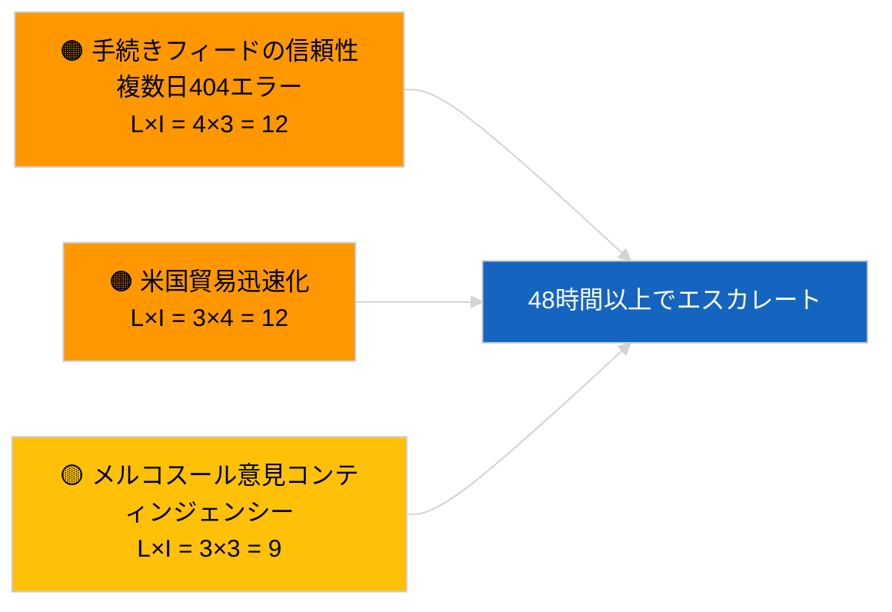

<!-- SPDX-FileCopyrightText: 2026 Hack23 AB -->
<!-- SPDX-License-Identifier: Apache-2.0 -->

# 欧州議会提案インテリジェンス・ブリーフ | 2026-04-02

**分類:** OSINT | 公開議会記録
**信頼度:** 🟢 高（議会休会期間中の構造的評価）
**作成日時:** 2026-04-02T00:00:00Z（遡及レポート）
**記事タイプ:** 提案
**実行ID:** `a3fdcdee-e95c-4a90-a4de-4c41509e1c1d`
**出典:** 欧州議会オープンデータポータル

---

## 🎯 BLUF

**2026年4月2日に新規の委員会提案または欧州議会独自の提案手続きは開始されませんでした。** 実行 `a3fdcdee-e95c-4a90-a4de-4c41509e1c1d` は**0件の分類済みアクター**と**ルーティン**の重要度を返し、2026-04-01/提案の空状態を反映しています。2026年4月1日に記録された6/8の助言フィード404エラーパターンが継続中であり、`get_procedures_feed` も影響を受けているエンドポイントに含まれます。したがって4月初頭の実質的な提案在庫は継承パイプライン（HDV排出枠組み TA-10-2026-0084、ECB副総裁手続き TA-10-2026-0060、よりよい立法報告 TA-10-2026-0063、EU-メルコスールECJ付託 TA-10-2026-0008）です。空状態がカレンダーとフィード可用性によるものという**🟢 高い信頼度**；API劣化中の新手続き不在については**🟡 中程度の信頼度**。

---

## 🧭 本レポートが支援する3つの意思決定

| # | 意思決定 | 決定者 | 期限 | 根拠 |
|:-:|---------|--------|:----:|------|
| 1 | **編集判断:** 提案の日次配信をスキップ | 編集者 | +24時間 | 実行結果が空 |
| 2 | **モニタリング:** フィード健全性監視を継続；`get_procedures_feed` 404エラーが48時間以上続いた場合はインシデントとして記録 | データパイプライン | 2026-04-03 | 持続パターン |
| 3 | **先行監視:** 2026年4月7日（火）委員会コレジウム会議 — イースター後初の議題設定 | 分析責任者 | 2026-04-07 | 委員会のペース |

---

## 📰 60秒読了

- 🔴 2026年4月2日に**新規手続きなし**；`get_procedures_feed` 404継続中。（🟡 中）
- 🟠 **0件のアクター分類**；委員、DG、報告者いずれも特定されず。（🟢 高）
- 🟢 **パイプライン繰越**が4月の監視リストを固定（HDV、ECB、よりよい立法、メルコスール）。（🟢 高）
- 🟡 **リスク次元はすべて「なし」**（本日）。（🟢 高）
- 🔵 **経済的文脈:** Q2に予定される提案——AI法施行規則、防衛産業戦略、MFF準備的コミュニケーション。（🟡 中）
- 🟣 **クロスリファレンス:** 姉妹実行 2026-04-02 は空テンプレート；2026-04-03/breaking-2 がフィードAPI懸念を正式化。（🟢 高）
- 🩷 **混乱ベクター:** 米国貿易圧力により4月に迅速手続きの委員会提案が強制される可能性。（🟡 中）
- ⚪ **繰越:** メルコスールECJ意見は依然として最も影響の大きい保留中の提案トリガー。

---

## 🗂️ 主要文書/手続き — 提案監視

| 順位 | EP参照番号 | タイトル（略称） | 重要度 | 信頼度 | 状態 |
|:---:|----------|----------------|:------:|:------:|------|
| 1 | — | 2026-04-02に新規提案なし | 0.0 | 🟡 中 | フィード404留保 |
| 2 | TA-10-2026-0008 | EU-メルコスールECJ付託（係属中） | 8.0 | 🟡 中 | 裁判所意見待ち |
| 3 | TA-10-2026-0084 | HDV排出クレジット2025–2029 | 7.0 | 🟢 高 | 移植パイプライン |

---

## ⚠️ リスク・脅威スナップショット

| リスク | L | I | スコア | トリガー | 出典 | アドミラリティ |
|--------|:-:|:-:|:------:|---------|------|:------------:|
| 手続きフィードの信頼性 | 4 | 3 | 12 | 48時間以上の持続的404 | 姉妹実行 | B2 |
| 米国貿易迅速化提案 | 3 | 4 | 12 | 米国の行動 | TA-10-2026-0096 | A1 |
| メルコスール意見コンティンジェンシー | 3 | 3 | 9 | 裁判所が発表 | TA-10-2026-0008 | A2 |
| MFF準備摩擦 | 3 | 4 | 12 | Q2委員会コミュニケーション | 委員会のペース | B2 |

---

## 🔮 主要な先行トリガー

**2026年4月7日（火）委員会コレジウム会議** — イースター後初の議題設定；テーマの組み合わせがQ2提案監視リストを調整。

---

## 🛡️ 情報源の品質評価

- **一次情報源:** 欧州議会オープンデータポータル；実行 `a3fdcdee-e95c-4a90-a4de-4c41509e1c1d`。
- **データ制限:** `get_procedures_feed` 404により裏付けが不可。
- **信頼度:** 手続き不在の主張について 🟡 中；カレンダー要因については 🟢 高。

---

## 📎 リンク

| リンク | パス |
|--------|------|
| 記事 | `./article.md` |
| 姉妹実行 | `analysis/daily/2026-04-02/breaking/`, `committee-reports/`, `motions/` |
| マニフェスト | `./manifest.json` |

---

**文書管理**
- **テンプレート:** `/analysis/templates/executive-brief.md`
- **アーティファクトパス:** `analysis/daily/2026-04-02/propositions/executive-brief.md`
- **分類:** 公開
- **遡及生成:** バックフィルセッション。
