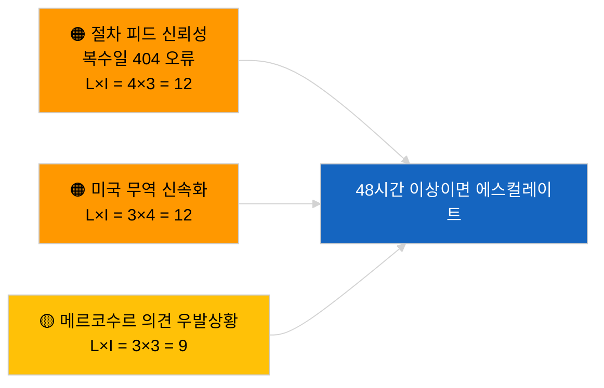

<!-- SPDX-FileCopyrightText: 2026 Hack23 AB -->
<!-- SPDX-License-Identifier: Apache-2.0 -->

# 유럽의회 제안 정보 브리핑 | 2026-04-02

**분류:** OSINT | 공개 의회 기록
**신뢰도:** 🟢 높음（의회 휴회 기간 중 구조적 평가）
**생성일시:** 2026-04-02T00:00:00Z（소급 보고서）
**기사 유형:** 제안
**실행 ID:** `a3fdcdee-e95c-4a90-a4de-4c41509e1c1d`
**출처:** 유럽의회 오픈데이터 포털

---

## 🎯 BLUF

**2026년 4월 2일에 새로운 집행위원회 제안이나 유럽의회 자체 발의 절차가 개시되지 않았습니다.** 실행 `a3fdcdee-e95c-4a90-a4de-4c41509e1c1d`는 **0건의 분류된 행위자**와 **일상적** 중요도를 반환하여 2026-04-01/제안의 빈 상태를 반영하였습니다. 2026년 4월 1일에 기록된 6/8 자문 피드 404 오류 패턴이 지속되고 있으며, `get_procedures_feed`도 영향을 받는 엔드포인트에 포함됩니다. 따라서 4월 초 실질적인 제안 재고는 상속된 파이프라인（HDV 배출 체계 TA-10-2026-0084, ECB 부총재 절차 TA-10-2026-0060, 더 나은 입법 보고서 TA-10-2026-0063, EU-메르코수르 ECJ 회부 TA-10-2026-0008）입니다. 빈 상태가 달력과 피드 가용성에 의한 것이라는 **🟢 높은 신뢰도**；API 저하 중 새 절차 부재에 대한 **🟡 중간 신뢰도**.

---

## 🧭 이 보고서가 지원하는 3가지 결정

| # | 결정 | 결정자 | 기한 | 근거 |
|:-:|------|--------|:----:|------|
| 1 | **편집 판단:** 일간 제안 건너뛰기 | 편집자 | +24시간 | 실행 결과 비어있음 |
| 2 | **모니터링:** 피드 건강 상태 감시 지속；`get_procedures_feed` 404 오류가 48시간 이상 지속되면 사건으로 기록 | 데이터 파이프라인 | 2026-04-03 | 지속 패턴 |
| 3 | **선행 감시:** 2026년 4월 7일（화）집행위원회 의회 회의 — 부활절 후 첫 의제 설정 | 분석 책임자 | 2026-04-07 | 집행위원회 일정 |

---

## 📰 60초 읽기

- 🔴 2026년 4월 2일 **새 절차 없음**；`get_procedures_feed` 404 지속. （🟡 중간）
- 🟠 **0명의 행위자 분류**；위원, DG, 보고자 누구도 식별되지 않음. （🟢 높음）
- 🟢 **파이프라인 이월**이 4월 감시 목록 고정（HDV, ECB, 더 나은 입법, 메르코수르）. （🟢 높음）
- 🟡 **리스크 차원 모두 "없음"**（오늘）. （🟢 높음）
- 🔵 **경제적 맥락:** Q2에 예상되는 제안 — AI법 시행규칙, 방산 전략, MFF 준비 통보. （🟡 중간）
- 🟣 **교차 참조:** 자매 실행 2026-04-02 빈 템플릿；2026-04-03/breaking-2가 피드 API 우려를 공식화. （🟢 높음）
- 🩷 **혼란 벡터:** 미국 무역 압박으로 4월에 신속 절차 집행위원회 제안이 강제될 가능성. （🟡 중간）
- ⚪ **이월:** 메르코수르 ECJ 의견은 여전히 보류 중인 제안 트리거 중 가장 영향력이 큼.

---

## 🗂️ 주요 문서/절차 — 제안 모니터링

| 순위 | EP 참조번호 | 제목（약칭） | 중요도 | 신뢰도 | 상태 |
|:---:|-----------|------------|:------:|:------:|------|
| 1 | — | 2026-04-02에 새 제안 없음 | 0.0 | 🟡 중간 | 피드 404 유보 |
| 2 | TA-10-2026-0008 | EU-메르코수르 ECJ 회부（계류 중） | 8.0 | 🟡 중간 | 법원 의견 대기 |
| 3 | TA-10-2026-0084 | HDV 배출 크레딧 2025–2029 | 7.0 | 🟢 높음 | 이식 파이프라인 |

---

## ⚠️ 리스크 및 위협 스냅숏

| 리스크 | L | I | 점수 | 트리거 | 출처 | 해군성 |
|--------|:-:|:-:|:----:|--------|------|:------:|
| 절차 피드 신뢰성 | 4 | 3 | 12 | 48시간 이상 지속 404 | 자매 실행 | B2 |
| 미국 무역 신속 제안 | 3 | 4 | 12 | 미국의 행동 | TA-10-2026-0096 | A1 |
| 메르코수르 의견 우발상황 | 3 | 3 | 9 | 법원 발표 | TA-10-2026-0008 | A2 |
| MFF 준비 마찰 | 3 | 4 | 12 | Q2 집행위원회 통보 | 집행위원회 일정 | B2 |

---

## 🔮 주요 선행 트리거

**2026년 4월 7일（화）집행위원회 의회 회의** — 부활절 후 첫 의제 설정；주제 조합이 Q2 제안 감시 목록을 보정.

---

## 🛡️ 정보 출처 품질 평가

- **1차 출처:** 유럽의회 오픈데이터 포털；실행 `a3fdcdee-e95c-4a90-a4de-4c41509e1c1d`.
- **데이터 제한:** `get_procedures_feed` 404로 인해 보완 확인 불가.
- **신뢰도:** 절차 부재 주장에 대해 🟡 중간；달력 요인에 대해 🟢 높음.

---

## 📎 링크

| 링크 | 경로 |
|------|------|
| 기사 | `./article.md` |
| 자매 실행 | `analysis/daily/2026-04-02/breaking/`, `committee-reports/`, `motions/` |
| 매니페스트 | `./manifest.json` |

---

**문서 관리**
- **템플릿:** `/analysis/templates/executive-brief.md`
- **아티팩트 경로:** `analysis/daily/2026-04-02/propositions/executive-brief.md`
- **분류:** 공개
- **소급 생성:** 백필 세션.
