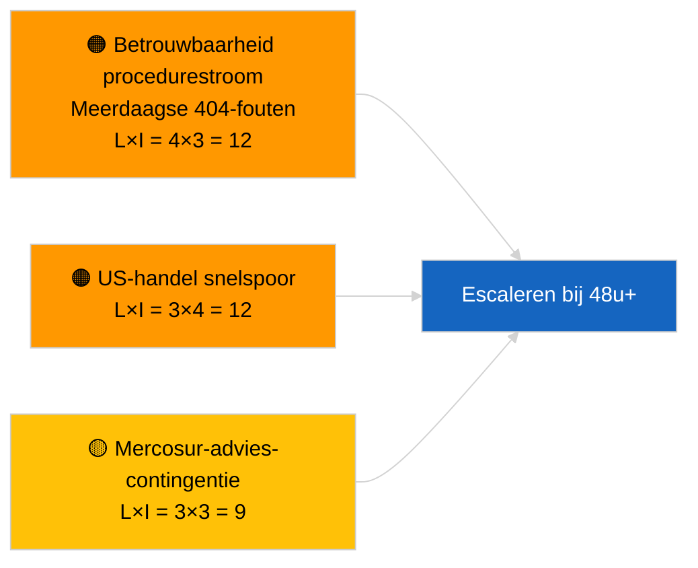

<!-- SPDX-FileCopyrightText: 2026 Hack23 AB -->
<!-- SPDX-License-Identifier: Apache-2.0 -->

# Inlichtingenrapport — Voorstellen | 2026-04-02

**Classificatie:** OSINT | Openbaar parlementair document
**Betrouwbaarheidsniveau:** 🟢 Hoog (structurele beoordeling tijdens parlementair reces)
**Gegenereerd:** 2026-04-02T00:00:00Z (retrospectief rapport)
**Artikeltype:** Voorstellen
**Uitvoerings-ID:** `a3fdcdee-e95c-4a90-a4de-4c41509e1c1d`
**Bron:** Open dataportal van het Europees Parlement

---

## 🎯 BLUF

**Op 2 april 2026 zijn geen nieuwe Commissievoorstellen of EP-eigeninitiatief­procedures geopend.** Uitvoering `a3fdcdee-e95c-4a90-a4de-4c41509e1c1d` leverde **0 geclassificeerde actoren** en **ROUTINE**-belang op, wat de lege status van 2026-04-01/voorstellen weerspiegelt. Het patroon van 6/8 adviesstream-404-fouten dat op 1 april 2026 is geregistreerd, zet zich voort; `get_procedures_feed` behoort tot de getroffen eindpunten. De substantiële voorstelvoorraad bij aanvang van april is daarom de geërf­de pijplijn (HDV-emissieskader TA-10-2026-0084, ECB-vicevoorzitters­procedure TA-10-2026-0060, Betere Regelgeving-rapport TA-10-2026-0063, EU-Mercosur HvJ-verwijzing TA-10-2026-0008). **🟢 HOOG vertrouwen** dat de lege status kalender- en feedbeschikbaarheids­gedreven is; **🟡 MATIG vertrouwen** over het ontbreken van nieuwe procedures tijdens de API-degradatie.

---

## 🧭 3 Beslissingen die dit rapport ondersteunt

| # | Beslissing | Wie beslist | Deadline | Bewijs |
|:-:|-----------|-------------|:--------:|--------|
| 1 | **Redactioneel:** dagelijkse voorstellen OVERSLAAN | Redacteur | +24u | Lege uitvoeringsuitvoer |
| 2 | **Monitoring:** feedgezondheids­bewaking voortzetten; 48u+ `get_procedures_feed` 404-fouten als incident markeren | Datapijplijn | 2026-04-03 | Aanhoudend patroon |
| 3 | **Vooruitblikkende bewaking:** Commissie-collegevergadering dinsdag 7 april 2026 — eerste post-Paas-agendastelling | Analyse­leider | 2026-04-07 | Commissie-cadans |

---

## 📰 60-secondenlecture

- 🔴 **Geen nieuwe procedures** op 2 april 2026; `get_procedures_feed` 404 zet zich voort. (🟡 Matig)
- 🟠 **0 actoren geclassificeerd**; geen commissaris, DG of rapporteur geïdentificeerd. (🟢 Hoog)
- 🟢 **Pipeline-carry-over** verankert de april-bewakingslijst (HDV, ECB, Betere Regelgeving, Mercosur). (🟢 Hoog)
- 🟡 **Risico­dimensies alle «geen»** vandaag. (🟢 Hoog)
- 🔵 **Economische context:** verwachte Q2-voorstellen over uitvoerings­regels AI-verordening, Defensie-industrie­strategie, MFK-voorbereidende mededelingen. (🟡 Matig)
- 🟣 **Kruisverwijzing:** zusteruitvoeringen 2026-04-02 lege sjablonen; 2026-04-03/breaking-2 formaliseert de feed-API-zorg. (🟢 Hoog)
- 🩷 **Verstoring­vector:** US-handelsdruk kan in april een spoedprocedure-Commissievoorstel afdwingen. (🟡 Matig)
- ⚪ **Carry-forward:** Mercosur HvJ-advies blijft de meest impactvolle openstaande voorstelstrigger.

---

## 🗂️ Topdocumenten/procedures — Voorstelmonitoring

| Rang | EP-referentie | Titel (beknopt) | Belang | Betrouwbaarheid | Status |
|:----:|--------------|----------------|:------:|:---------------:|--------|
| 1 | — | Geen nieuwe voorstellen op 2026-04-02 | 0,0 | 🟡 MATIG | Feed-404-voorbehoud |
| 2 | TA-10-2026-0008 | EU-Mercosur HvJ-verwijzing (hangende) | 8,0 | 🟡 MATIG | Hof­advies verwacht |
| 3 | TA-10-2026-0084 | HDV-emissie­credits 2025–2029 | 7,0 | 🟢 HOOG | Transpositie­pijplijn |

---

## ⚠️ Risico- en dreigings­overzicht

| Risico | L | I | Score | Trigger | Bron | Admiraliteit |
|--------|:-:|:-:|:-----:|---------|------|:------------:|
| Betrouwbaarheid procedurestroom | 4 | 3 | 12 | 48u+ aanhoudende 404 | Zusteruitvoeringen | B2 |
| US-handel snelspoorvoorstel | 3 | 4 | 12 | US-maatregel | TA-10-2026-0096 | A1 |
| Mercosur-advies-contingentie | 3 | 3 | 9 | Hof publiceert | TA-10-2026-0008 | A2 |
| MFK-voorbereidende wrijving | 3 | 4 | 12 | Q2-Commissiemededeling | Commissie-cadans | B2 |

---

## 🔮 Leidende vooruitblikkende trigger

**Commissie-collegevergadering dinsdag 7 april 2026** — eerste post-Paas-agendastelling; thematische mix kalibreert de Q2-voorstel­bewakingslijst.

---

## 🛡️ Beoordeling van de bronkwaliteit

- **Primaire bronnen:** EP-Open Dataportal; uitvoering `a3fdcdee-e95c-4a90-a4de-4c41509e1c1d`.
- **Databeperkingen:** `get_procedures_feed` 404 verhindert corroboratie.
- **Betrouwbaarheid:** 🟡 MATIG voor bewering over afwezigheid van procedures; 🟢 HOOG voor kalenderstuurder.

---

## 📎 Links

| Link | Pad |
|------|-----|
| Artikel | `./article.md` |
| Zusteruitvoeringen | `analysis/daily/2026-04-02/breaking/`, `committee-reports/`, `motions/` |
| Manifest | `./manifest.json` |

---

**Documentbeheer**
- **Sjabloon:** `/analysis/templates/executive-brief.md`
- **Artefactpad:** `analysis/daily/2026-04-02/propositions/executive-brief.md`
- **Classificatie:** Openbaar
- **Retrospectieve generatie:** Terugvullingssessie.
