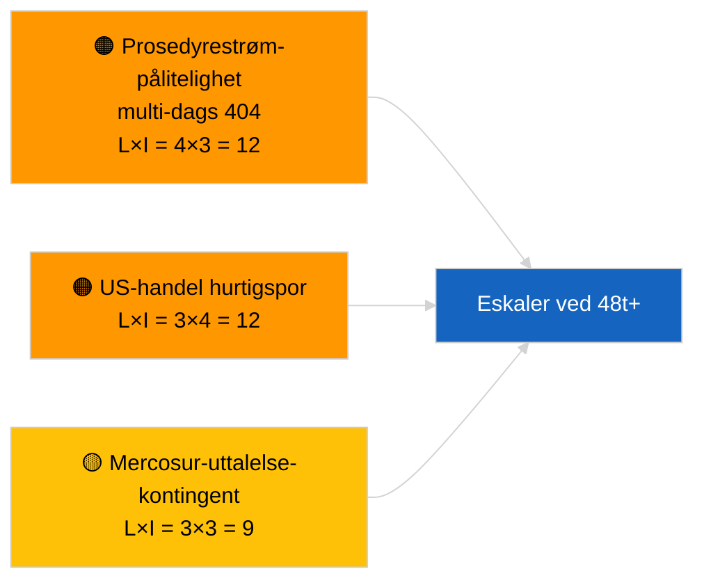

<!-- SPDX-FileCopyrightText: 2026 Hack23 AB -->
<!-- SPDX-License-Identifier: Apache-2.0 -->

# Etterretningsrapport — Forslag | 2026-04-02

**Klassifisering:** OSINT | Offentlig parlamentarisk protokoll
**Tillitsgrad:** 🟢 Høy (strukturell vurdering i parlamentarisk ferieperiode)
**Generert:** 2026-04-02T00:00:00Z (retrospektiv rapport)
**Artikkeltype:** Forslag
**Kjørings-ID:** `a3fdcdee-e95c-4a90-a4de-4c41509e1c1d`
**Kilde:** Europaparlamentets åpne dataportal

---

## 🎯 BLUF

**Ingen nye Kommisjonsforslag eller EP-egne initiativprosedyrer ble åpnet 2. april 2026.** Kjøring `a3fdcdee-e95c-4a90-a4de-4c41509e1c1d` returnerte **0 klassifiserte aktører** og **RUTINE**-betydning, noe som gjenspeiler den tomme tilstanden for 2026-04-01/forslag. Mønsteret med 6/8 rådgivningsstrøms-404-feil som ble logget 1. april 2026, fortsetter; `get_procedures_feed` er blant de berørte endepunktene. Den substantielle forslags­beholdningen ved inngangen til april er dermed den nedarvede pipelinen (HDV-utslippsramme TA-10-2026-0084, ECB-visepresident­prosedyre TA-10-2026-0060, rapport om bedre lovgivning TA-10-2026-0063, EU-Mercosur ECJ-forelæggelse TA-10-2026-0008). **🟢 HØY tillitsgrad** til at den tomme tilstanden skyldes kalender og tilgjengelighet av datastrøm; **🟡 MIDDELS tillitsgrad** til fravær av nye prosedyrer under API-degraderingen.

---

## 🧭 3 Beslutninger denne rapporten støtter

| # | Beslutning | Hvem bestemmer | Frist | Dokumentasjon |
|:-:|-----------|----------------|:-----:|---------------|
| 1 | **Redaksjonelt:** HOPP OVER forslag daglig | Redaktør | +24t | Tom kjøringsoutput |
| 2 | **Overvåking:** fortsett overvåking av strømmehelse; merk 48t+ av `get_procedures_feed` 404-feil som hendelse | Datapipeline | 2026-04-03 | Vedvarende mønster |
| 3 | **Fremovervåking:** Kommisjonens tirsdagsmøte 7. april 2026 — første post-påske-kollegiebordlegging | Analyseleder | 2026-04-07 | Kommisjonens kadense |

---

## 📰 60-sekunders lesing

- 🔴 **Ingen nye prosedyrer** 2. april 2026; `get_procedures_feed` 404 fortsetter. (🟡 Middels)
- 🟠 **0 aktører klassifisert**; ingen kommissær, GD eller ordfører identifisert. (🟢 Høy)
- 🟢 **Pipeline-carry-over** forankrer aprilovervåkingslisten (HDV, ECB, Bedre lovgivning, Mercosur). (🟢 Høy)
- 🟡 **Risikoimensjoner alle «ingen»** i dag. (🟢 Høy)
- 🔵 **Økonomisk kontekst:** forventede Q2-forslag om gjennomføringsregler for AI Act, Forsvarsindustriell strategi, MFF-forberedende meddelelser. (🟡 Middels)
- 🟣 **Kryssreferanse:** søsterkjøringer 2026-04-02 tomme maler; 2026-04-03/breaking-2 formaliserer feed-API-bekymringen. (🟢 Høy)
- 🩷 **Forstyrrelsesvektor:** US-handelspress kan fremtvinge et hurtigsporet Kommisjonsforslag i april. (🟡 Middels)
- ⚪ **Carry-forward:** Mercosur ECJ-uttalelse er fortsatt den mest impaktfulle ventende forslagstriggeren.

---

## 🗂️ Topdokumenter/prosedyrer — Forslagsovervåking

| Rang | EP-referanse | Tittel (kortform) | Betydning | Tillitsgrad | Status |
|:----:|-------------|------------------|:---------:|:-----------:|--------|
| 1 | — | Ingen nye forslag 2026-04-02 | 0,0 | 🟡 MIDDELS | Strøm-404-forbehold |
| 2 | TA-10-2026-0008 | EU-Mercosur ECJ-forelæggelse (ventende) | 8,0 | 🟡 MIDDELS | Domstolsuttalelse forventet |
| 3 | TA-10-2026-0084 | HDV-utslippskreditter 2025–2029 | 7,0 | 🟢 HØY | Transposisjonspipeline |

---

## ⚠️ Risiko- og trusseloversikt

| Risiko | L | I | Score | Trigger | Kilde | Admiralitet |
|--------|:-:|:-:|:-----:|---------|-------|:-----------:|
| Prosedyrestrømpålitelighet | 4 | 3 | 12 | 48t+ vedvarende 404 | Søsterkjøringer | B2 |
| US-handel hurtigsporet forslag | 3 | 4 | 12 | US-handling | TA-10-2026-0096 | A1 |
| Mercosur-uttalelse-kontingent | 3 | 3 | 9 | Domstol publiserer | TA-10-2026-0008 | A2 |
| MFF-forberedende friksjon | 3 | 4 | 12 | Q2-Kommisjonsmeddelelse | Kommisjonens kadense | B2 |

---

## 🔮 Ledende fremovrettet trigger

**Kommisjonens tirsdagsmøte 7. april 2026** — første post-påske-kollegiebordlegging; tematisk blanding kalibrerer Q2-forslagsovervåkingslisten.

---

## 🛡️ Kildekvalitetsvurdering

- **Primære kilder:** EPs åpne dataportal; kjøring `a3fdcdee-e95c-4a90-a4de-4c41509e1c1d`.
- **Databegrensninger:** `get_procedures_feed` 404 forhindrer korroborasjon.
- **Tillitsgrad:** 🟡 MIDDELS for påstand om prosedurefravær; 🟢 HØY for kalenderdriver.

---

## 📎 Lenker

| Lenke | Sti |
|-------|-----|
| Artikkel | `./article.md` |
| Søsterkjøringer | `analysis/daily/2026-04-02/breaking/`, `committee-reports/`, `motions/` |
| Manifest | `./manifest.json` |

---

**Dokumentkontroll**
- **Mal:** `/analysis/templates/executive-brief.md`
- **Artefaktsti:** `analysis/daily/2026-04-02/propositions/executive-brief.md`
- **Klassifisering:** Offentlig
- **Retrospektiv generering:** Backfill-sesjon.
