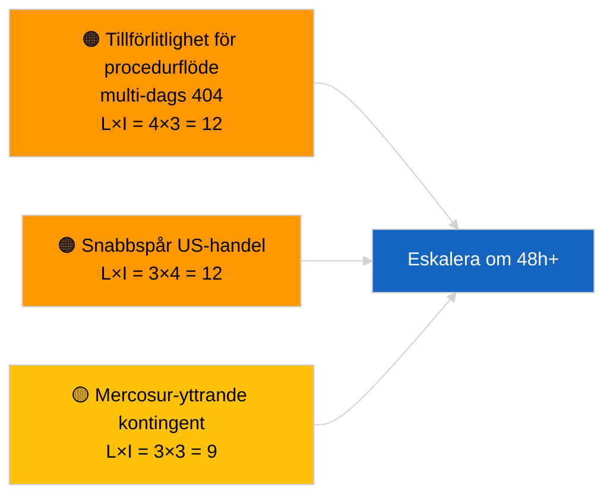

<!-- SPDX-FileCopyrightText: 2026 Hack23 AB -->
<!-- SPDX-License-Identifier: Apache-2.0 -->

# Underrättelserapport — Propositioner | 2026-04-02

**Klassificering:** OSINT | Offentligt parlamentariskt register
**Konfidensgrad:** 🟢 Hög (strukturell bedömning under riksdagsrecessperiod)
**Genererad:** 2026-04-02T00:00:00Z (retrospektiv rapport)
**Artikeltyp:** Propositioner
**Körnings-ID:** `a3fdcdee-e95c-4a90-a4de-4c41509e1c1d`
**Källa:** Europaparlamentets öppna dataportal

---

## 🎯 BLUF

**Inga nya kommissionspropositioner eller EP:s egna initiativförfaranden öppnades den 2 april 2026.** Körning `a3fdcdee-e95c-4a90-a4de-4c41509e1c1d` returnerade **0 klassificerade aktörer** och **RUTINMÄSSIG** betydelse, vilket speglar det tomma tillståndet för 2026-04-01/propositioner. Mönstret med 6/8 rådgivningsflödes-404 som loggades den 1 april 2026 fortsätter; `get_procedures_feed` är bland de drabbade slutpunkterna. Det substantiella förslagslagret inför april är därför den ärvda pipelinen (HDV-utsläppsramverk TA-10-2026-0084, ECB-vice-ordförandeförfarande TA-10-2026-0060, rapport om bättre lagstiftning TA-10-2026-0063, EU-Mercosur ECJ-hänskjutning TA-10-2026-0008). **🟢 HÖG konfidensgrad** att det tomma tillståndet beror på kalender- och flödestillgänglighet; **🟡 MEDEL konfidensgrad** vad gäller avsaknad av nya förfaranden under API-degraderingen.

---

## 🧭 3 Beslut som denna rapport stöder

| # | Beslut | Vem beslutar | Deadline | Underlag |
|:-:|--------|--------------|:--------:|----------|
| 1 | **Redaktionellt:** HOPPA ÖVER propositioner dagligen | Redaktör | +24h | Tom körningsoutput |
| 2 | **Övervakning:** fortsätt flödeshälsogranskning; markera 48h+ av `get_procedures_feed` 404:or som incident | Datapipeline | 2026-04-03 | Ihållande mönster |
| 3 | **Framåtbevakning:** Kommissionens torsdagsmöte 7 april 2026 — första post-påsk-collegium-bordläggning | Analysledare | 2026-04-07 | Kommissionens kadens |

---

## 📰 60-sekunders läsning

- 🔴 **Inga nya förfaranden** den 2 april 2026; `get_procedures_feed` 404 fortsätter. (🟡 Medel)
- 🟠 **0 aktörer klassificerade**; ingen kommissionär, GD eller föredragande identifierad. (🟢 Hög)
- 🟢 **Pipeline-carry-over** förankrar aprilopplistan (HDV, ECB, Bättre lagstiftning, Mercosur). (🟢 Hög)
- 🟡 **Riskdimensioner alla "inga"** idag. (🟢 Hög)
- 🔵 **Ekonomisk kontext:** förväntade Q2-propositioner om genomförandebestämmelser för AI Act, Industriell försvarsstrategi, MFF-förberedande kommunikationer. (🟡 Medel)
- 🟣 **Korsreferens:** syskonkörningar 2026-04-02 tomma mallar; 2026-04-03/breaking-2 formaliserar flärdets-API-problemet. (🟢 Hög)
- 🩷 **Störningsvektor:** US handelstryck kan tvinga fram en snabbspår-kommissionsproposition i april. (🟡 Medel)
- ⚪ **Carry-forward:** Mercosur ECJ-yttrande kvarstår som den mest impaktfulla väntande propositionstriggern.

---

## 🗂️ Toppokument/förfaranden — Propositionsbevakning

| Rang | EP-referens | Titel (kortform) | Signifikans | Konfidensgrad | Status |
|:----:|-------------|------------------|:-----------:|:-------------:|--------|
| 1 | — | Inga nya propositioner den 2026-04-02 | 0,0 | 🟡 MEDEL | Flödes-404-förbehåll |
| 2 | TA-10-2026-0008 | EU-Mercosur ECJ-hänskjutning (väntande) | 8,0 | 🟡 MEDEL | Domstolsyttrande förväntas |
| 3 | TA-10-2026-0084 | HDV-utsläppskrediter 2025–2029 | 7,0 | 🟢 HÖG | Transpositionspipeline |

---

## ⚠️ Risk- och hotöversikt

| Risk | L | I | Poäng | Trigger | Källa | Admiralitet |
|------|:-:|:-:|:-----:|---------|-------|:-----------:|
| Tillförlitlighet för procedurflöde | 4 | 3 | 12 | 48h+ ihållande 404 | Syskonkörningar | B2 |
| Snabbspår US-handelsproposition | 3 | 4 | 12 | US-åtgärd | TA-10-2026-0096 | A1 |
| Mercosur-yttrande kontingent | 3 | 3 | 9 | Domstol publicerar | TA-10-2026-0008 | A2 |
| MFF-förberedande friktion | 3 | 4 | 12 | Q2-kommissionskommunikation | Kommissionens kadens | B2 |

---

## 🔮 Ledande framåttrigger

**Kommissionens torsdagsmöte 7 april 2026** — första post-påsk-collegium-bordläggning; ämnesblandning kalibrerar Q2-propositionsbevaningslistan.

---

## 🛡️ Källkvalitetsbedömning

- **Primärkällor:** EP:s öppna dataportal; körning `a3fdcdee-e95c-4a90-a4de-4c41509e1c1d`.
- **Databegränsningar:** `get_procedures_feed` 404 förhindrar korroboration.
- **Konfidensgrad:** 🟡 MEDEL för procedurfrånvaro-påstående; 🟢 HÖG för kalenderdrivare.

---

## 📎 Länkar

| Länk | Sökväg |
|------|--------|
| Artikel | `./article.md` |
| Syskonkörningar | `analysis/daily/2026-04-02/breaking/`, `committee-reports/`, `motions/` |
| Manifest | `./manifest.json` |

---

**Dokumentkontroll**
- **Mall:** `/analysis/templates/executive-brief.md`
- **Artefaktsökväg:** `analysis/daily/2026-04-02/propositions/executive-brief.md`
- **Klassificering:** Offentlig
- **Retrospektiv generering:** Backfillssession.
