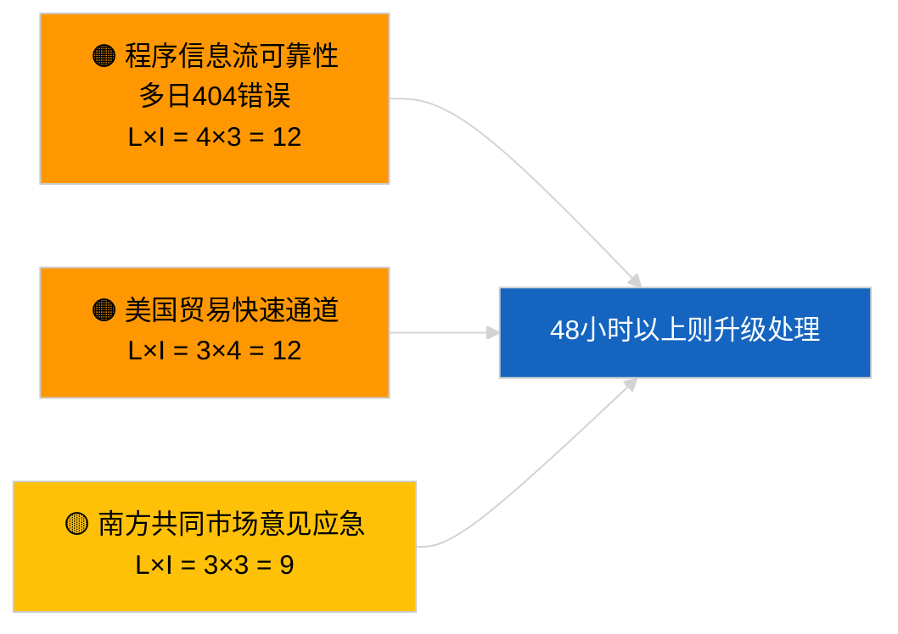

<!-- SPDX-FileCopyrightText: 2026 Hack23 AB -->
<!-- SPDX-License-Identifier: Apache-2.0 -->

# 情报简报 — 欧洲议会提案 | 2026-04-02

**分类：** OSINT | 公开议会记录
**置信度：** 🟢 高（议会休会期间的结构性评估）
**生成日期：** 2026-04-02T00:00:00Z（追溯报告）
**文章类型：** 提案
**运行标识符：** `a3fdcdee-e95c-4a90-a4de-4c41509e1c1d`
**来源：** 欧洲议会开放数据门户

---

## 🎯 BLUF

**2026年4月2日未开启任何新的委员会提案或欧洲议会自主倡议程序。** 运行 `a3fdcdee-e95c-4a90-a4de-4c41509e1c1d` 返回 **0个已分类行为者** 和 **例行性** 重要度，反映了 2026-04-01/提案的空白状态。2026年4月1日记录的 6/8 咨询信息流404错误模式仍在持续；`get_procedures_feed` 属于受影响的端点之一。因此，4月初的实质性提案库存是已继承的管道（HDV排放框架 TA-10-2026-0084、欧洲央行副行长程序 TA-10-2026-0060、更好立法报告 TA-10-2026-0063、欧盟-南方共同市场欧盟法院提交 TA-10-2026-0008）。对于空状态由日历和信息流可用性驱动，**🟢 置信度高**；对于API降级期间无新程序，**🟡 置信度中等**。

---

## 🧭 本报告支持的3项决策

| # | 决策 | 决策者 | 截止期 | 依据 |
|:-:|------|--------|:------:|------|
| 1 | **编辑决策：** 跳过提案日报 | 编辑 | +24小时 | 运行输出为空 |
| 2 | **监控：** 继续信息流健康状态监测；将 `get_procedures_feed` 的404错误超过48小时标记为事件 | 数据管道 | 2026-04-03 | 持续模式 |
| 3 | **前瞻监视：** 委员会会议 2026年4月7日（星期二）— 复活节后首次议事议程设定 | 分析负责人 | 2026-04-07 | 委员会节奏 |

---

## 📰 60秒阅读

- 🔴 2026年4月2日**无新程序**；`get_procedures_feed` 404持续。（🟡 中等）
- 🟠 **0个行为者被分类**；未识别任何专员、总司或报告员。（🟢 高）
- 🟢 **管道延续**锚定4月监视清单（HDV、欧洲央行、更好立法、南方共同市场）。（🟢 高）
- 🟡 **风险维度全部"无"**（今日）。（🟢 高）
- 🔵 **经济背景：** 预期Q2提案——AI法案实施细则、国防工业战略、多年期财政框架准备性通信。（🟡 中等）
- 🟣 **交叉参考：** 姐妹运行 2026-04-02 模板为空；2026-04-03/breaking-2 正式确认信息流API问题。（🟢 高）
- 🩷 **扰动向量：** 美国贸易压力可能迫使4月出现快速通道委员会提案。（🟡 中等）
- ⚪ **延续：** 南方共同市场欧盟法院意见仍是影响最大的待定提案触发点。

---

## 🗂️ 主要文件/程序 — 提案监控

| 排名 | 欧洲议会参考编号 | 标题（简称） | 重要性 | 置信度 | 状态 |
|:---:|--------------|-----------|:------:|:------:|------|
| 1 | — | 2026-04-02无新提案 | 0.0 | 🟡 中等 | 信息流404保留 |
| 2 | TA-10-2026-0008 | 欧盟-南方共同市场欧盟法院提交（待定） | 8.0 | 🟡 中等 | 法院意见待发 |
| 3 | TA-10-2026-0084 | HDV排放信用额度2025–2029 | 7.0 | 🟢 高 | 移植管道 |

---

## ⚠️ 风险与威胁快照

| 风险 | L | I | 评分 | 触发因素 | 来源 | 海军情报评级 |
|------|:-:|:-:|:---:|---------|------|:----------:|
| 程序信息流可靠性 | 4 | 3 | 12 | 48小时以上持续404 | 姐妹运行 | B2 |
| 美国贸易快速通道提案 | 3 | 4 | 12 | 美国行动 | TA-10-2026-0096 | A1 |
| 南方共同市场意见应急 | 3 | 3 | 9 | 法院发布 | TA-10-2026-0008 | A2 |
| 多年期财政框架准备摩擦 | 3 | 4 | 12 | Q2委员会通信 | 委员会节奏 | B2 |

---

## 🔮 领先的前瞻触发因素

**委员会会议 2026年4月7日（星期二）** — 复活节后首次议事议程设定；主题组合校准Q2提案监视清单。

---

## 🛡️ 来源质量评估

- **主要来源：** 欧洲议会开放数据门户；运行 `a3fdcdee-e95c-4a90-a4de-4c41509e1c1d`。
- **数据局限性：** `get_procedures_feed` 404阻止交叉核实。
- **置信度：** 程序缺席声明 🟡 中等；日历驱动因素 🟢 高。

---

## 📎 链接

| 链接 | 路径 |
|------|------|
| 文章 | `./article.md` |
| 姐妹运行 | `analysis/daily/2026-04-02/breaking/`, `committee-reports/`, `motions/` |
| 清单 | `./manifest.json` |

---

**文件控制**
- **模板：** `/analysis/templates/executive-brief.md`
- **制品路径：** `analysis/daily/2026-04-02/propositions/executive-brief.md`
- **分类：** 公开
- **追溯生成：** 补录会话。
