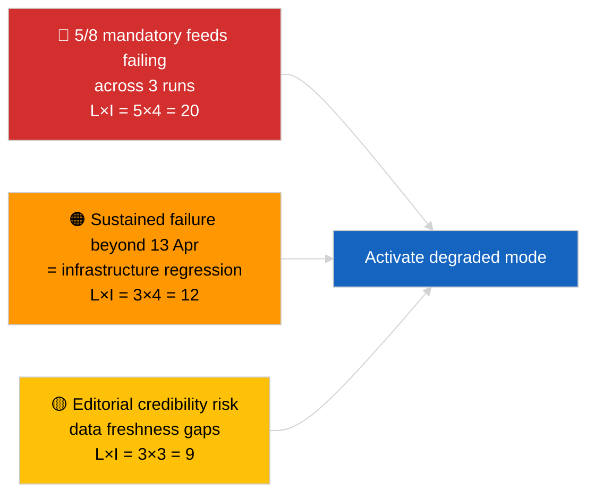

<!-- SPDX-FileCopyrightText: 2026 Hack23 AB -->
<!-- SPDX-License-Identifier: Apache-2.0 -->

# Executive Brief — Breaking (EP API Reliability) | 2026-04-03

**Classification:** OSINT | Public Parliamentary Record
**Confidence:** 🟢 High (systematic three-run probe, 12 endpoints + 4 analytical tools)
**Generated:** 2026-04-03T00:00:00Z (retrospective brief)
**Article Type:** Breaking — EP API Reliability Assessment
**Source:** European Parliament Open Data Portal

---

## 🎯 BLUF

**EP Open Data Portal feed API is in DEGRADED state — 5 of 8 mandatory feeds failing across three independent runs (06:00, 12:15, 18:15 UTC).** `get_events_feed`, `get_procedures_feed`, `get_documents_feed`, `get_plenary_documents_feed`, `get_committee_documents_feed`, `get_parliamentary_questions_feed` all return 404 or timeout on both `today` and `one-week` timeframes. Operational endpoints: `get_meps_feed` (737/737) and analytical tools (`detect_voting_anomalies`, `analyze_coalition_dynamics`, `generate_political_landscape`, `early_warning_system`). `get_adopted_texts_feed` returns partial data (≈80-100 items via one-week fallback). The failure pattern is correlated with the Easter recess, suggesting maintenance or seasonal queue degradation upstream. **🟢 HIGH confidence** the degradation is real and persistent (n=3 runs); **🟡 MEDIUM confidence** on root cause (recess maintenance vs. infrastructure regression).

---

## 🧭 3 Decisions This Brief Supports

| # | Decision | Who Decides | Deadline | Evidence |
|:-:|----------|-------------|:--------:|----------|
| 1 | **Operational:** activate DEGRADED data mode in pipeline (`PREFETCH_DATA_MODE=degraded-feeds`) until restoration | Data pipeline lead | +12h | 5/8 mandatory feeds failing |
| 2 | **Editorial:** PUBLISH this assessment as a transparency note; flag downstream articles with "data-mode: degraded" marker | Editor | +24h | Public-trust signal |
| 3 | **Forward-watch:** daily endpoint re-probe through Easter recess end (13 April) | Analyst | daily | Verify restoration |

---

## 📰 60-Second Read

- 🔴 **5/8 mandatory feeds FAILED across all three runs** — `get_events_feed`, `get_procedures_feed`, `get_documents_feed`, `get_plenary_documents_feed`, `get_committee_documents_feed`, `get_parliamentary_questions_feed`. (🟢 High)
- 🟠 **Adopted-texts feed PARTIAL** — JSON error on `today`; one-week fallback returns ~80-100 items. (🟢 High)
- 🟢 **MEP feed and analytical tools OPERATIONAL** — `get_meps_feed` returns 737/737 across runs; coalition/landscape/anomaly/early-warning tools all returning data. (🟢 High)
- 🟡 **Correlation with Easter recess** — failure pattern starts immediately after 26 March Brussels session; recess maintenance hypothesis preferred. (🟡 Medium)
- 🔵 **Operational implication:** breaking-news pipeline must fall back to adopted-texts + MEP + analytical tools; trade off freshness for completeness. (🟢 High)
- 🟣 **Cross-reference:** sibling 2026-04-03/breaking documents coalition baseline that this run's analytical tools still produce. (🟢 High)
- 🩷 **Disruption vector:** sustained 404s past 13 April would indicate infrastructure regression rather than maintenance, triggering escalation to EP-EDP technical contact. (🟢 High)
- ⚪ **Carry-forward:** add `prefetch-status.json` mode tracking and degraded-feed accommodation factor (0.80) to the validator pipeline.

---

## 🗂️ Endpoint Status Snapshot

| Endpoint | Status | Confidence | Notes |
|----------|:------:|:----------:|-------|
| `get_meps_feed` | 🟢 OPERATIONAL | 🟢 HIGH | 737/737 across 3 runs |
| `get_adopted_texts_feed` | 🟡 PARTIAL | 🟢 HIGH | One-week fallback ~80-100 items |
| `get_events_feed` | 🔴 FAILED | 🟢 HIGH | 404 today + one-week |
| `get_procedures_feed` | 🔴 FAILED | 🟢 HIGH | 404 today + one-week |
| `get_documents_feed` | 🔴 FAILED | 🟢 HIGH | Timeout one-week |
| `get_plenary_documents_feed` | 🔴 FAILED | 🟢 HIGH | Timeout one-week |
| `get_committee_documents_feed` | 🔴 FAILED | 🟢 HIGH | Timeout one-week |
| `get_parliamentary_questions_feed` | 🔴 FAILED | 🟢 HIGH | Timeout one-week |
| `detect_voting_anomalies` | 🟢 OPERATIONAL | 🟢 HIGH | — |
| `analyze_coalition_dynamics` | 🟢 OPERATIONAL | 🟢 HIGH | One run timeout, 2 OK |
| `generate_political_landscape` | 🟢 OPERATIONAL | 🟢 HIGH | — |
| `early_warning_system` | 🟢 OPERATIONAL | 🟢 HIGH | — |

---

## ⚠️ Risk & Threat Snapshot

| Risk | L | I | Score | Trigger | Source | Admiralty |
|------|:-:|:-:|:-----:|---------|--------|:---------:|
| Feed-API DEGRADED state | 5 | 4 | 20 | n=3 confirmation | This run | A1 |
| Post-recess persistence | 3 | 4 | 12 | 404s past 13 April | Daily probe | A2 |
| Editorial credibility | 3 | 3 | 9 | Stale freshness in published article | Pipeline status | B2 |
| Data-mode misclassification | 2 | 3 | 6 | Validator passes degraded as full | Validator config | B3 |

---

## 🔮 Top Forward Trigger

**Daily endpoint re-probe through 13 April 2026 (Easter recess end).** If on 2026-04-14 (first post-Easter weekday) the failed-feed cohort has not restored, escalate to an infrastructure-regression hypothesis and contact the EP EDP technical operations team via the established channel.

---

## 🛡️ Source Quality Assessment

- **Primary sources:** Three systematic test runs at 06:00, 12:15, 18:15 UTC; 12 endpoints + 4 analytical tools.
- **Confidence on DEGRADED finding:** 🟢 HIGH (n=3 across day; deterministic failure pattern).
- **Confidence on root cause:** 🟡 MEDIUM (recess-correlation is suggestive but not conclusive).

---

## 📎 Links

| Link | Path |
|------|------|
| Article | `./article.md` |
| Sibling runs | `analysis/daily/2026-04-03/breaking/` (coalition), `breaking-3/` (anti-corruption) |
| Manifest | `./manifest.json` |
| Precursor signal | `analysis/daily/2026-04-01/breaking/` (first 6/8 404 observation) |

---

## 🔄 Cross-Reference

**Prior signals:** 2026-04-01/breaking and 2026-04-02/breaking both noted feed-API 404s without formal three-run probe. This run formalises and quantifies the pattern.

**Subsequent verification:** 2026-04-04, 2026-04-05 daily probes will determine whether the degradation persists or resolves with recess end.

---

**Document Control**
- **Template:** `/analysis/templates/executive-brief.md`
- **Artifact path:** `analysis/daily/2026-04-03/breaking-2/executive-brief.md`
- **Classification:** Public
- **Retrospective generation:** Back-fill session.
