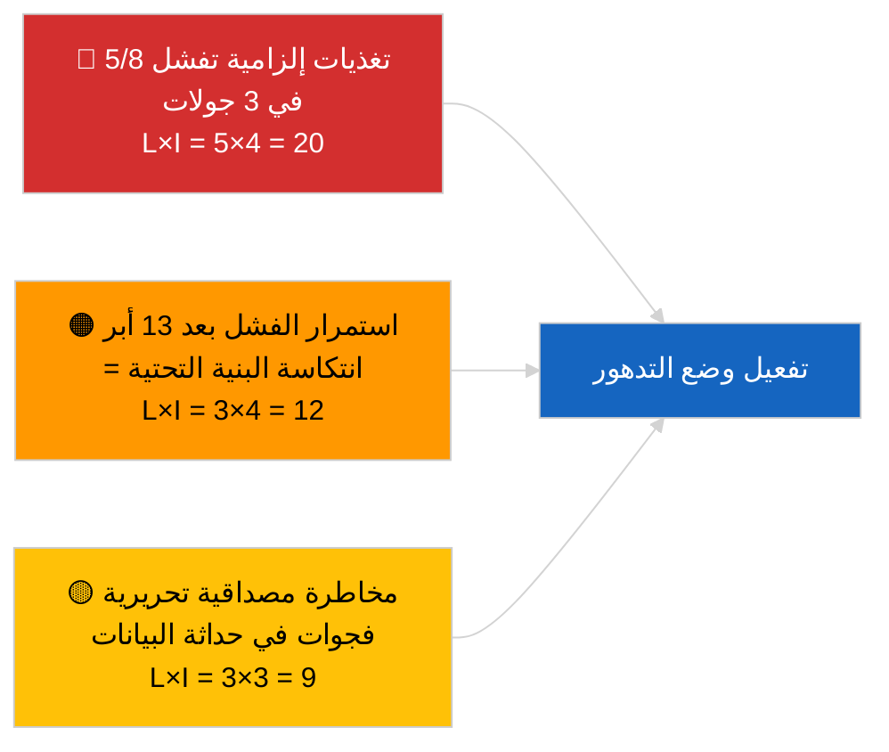

<!-- SPDX-FileCopyrightText: 2026 Hack23 AB -->
<!-- SPDX-License-Identifier: Apache-2.0 -->

# ملخص تنفيذي — عاجل (موثوقية واجهة برمجة التطبيقات) | 2026-04-03

**التصنيف:** OSINT | سجل برلماني عام
**درجة الموثوقية:** 🟢 عالية (مسح منهجي في ثلاث جولات، 12 نقطة نهاية + 4 أدوات تحليلية)
**تاريخ الإنشاء:** 2026-04-03T00:00:00Z (ملخص استعادي)
**نوع المقال:** عاجل — تقييم موثوقية واجهة برمجة تطبيقات البرلمان الأوروبي
**المصدر:** بوابة البيانات المفتوحة للبرلمان الأوروبي

---

## 🎯 BLUF

**واجهة برمجة تطبيقات التغذية الخاصة ببوابة بيانات البرلمان الأوروبي في حالة تدهور — 5 من 8 تغذيات إلزامية تفشل في ثلاث جولات مستقلة (06:00 و12:15 و18:15 بالتوقيت العالمي المنسق).** تُرجع كل من `get_events_feed` و`get_procedures_feed` و`get_documents_feed` و`get_plenary_documents_feed` و`get_committee_documents_feed` و`get_parliamentary_questions_feed` إما أخطاء 404 أو انتهاء المهلة عند الأفق الزمني `today` و`one-week`. نقاط النهاية التشغيلية: `get_meps_feed` (737/737) والأدوات التحليلية (`detect_voting_anomalies` و`analyze_coalition_dynamics` و`generate_political_landscape` و`early_warning_system`). تُرجع `get_adopted_texts_feed` بيانات جزئية (نحو 80–100 عنصر عبر الاحتياطي لأسبوع). يرتبط نمط الفشل بعطلة عيد الفصح، مما يوحي بصيانة أو تدهور موسمي في قائمة الانتظار في المنبع. **🟢 موثوقية عالية** بأن التدهور حقيقي ومستمر (n=3 جولات)؛ **🟡 موثوقية متوسطة** بشأن السبب الجذري (صيانة خلال العطلة مقابل انتكاسة البنية التحتية).

---

## 🧭 3 قرارات يدعمها هذا المستند

| # | القرار | المسؤول | الموعد النهائي | الدليل |
|:-:|--------|---------|:--------------:|--------|
| 1 | **تشغيلي:** تفعيل وضع البيانات المتدهورة في الخط الأنابيب (`PREFETCH_DATA_MODE=degraded-feeds`) حتى الاستعادة | مسؤول خط أنابيب البيانات | +12 ساعة | 5/8 تغذيات إلزامية تفشل |
| 2 | **تحريري:** نشر هذا التقييم كملاحظة شفافية؛ وسم المقالات اللاحقة بـ «data-mode: degraded» | المحرر | +24 ساعة | إشارة ثقة عامة |
| 3 | **مراقبة استشرافية:** مسح يومي لنقاط النهاية خلال عطلة عيد الفصح (حتى 13 أبريل) | المحلل | يومياً | التحقق من الاستعادة |

---

## 📰 قراءة في 60 ثانية

- 🔴 **فشل 5/8 من التغذيات الإلزامية في جميع الجولات الثلاث** — `get_events_feed` و`get_procedures_feed` و`get_documents_feed` و`get_plenary_documents_feed` و`get_committee_documents_feed` و`get_parliamentary_questions_feed`. (🟢 عالية)
- 🟠 **تغذية النصوص المعتمدة جزئية** — خطأ JSON في `today`؛ الاحتياطي الأسبوعي يُرجع نحو 80–100 عنصر. (🟢 عالية)
- 🟢 **تغذية أعضاء البرلمان الأوروبي والأدوات التحليلية تعمل** — `get_meps_feed` تُرجع 737/737 في جميع الجولات؛ أدوات الائتلاف والمشهد والشذوذ والإنذار المبكر تُرجع جميعها بيانات. (🟢 عالية)
- 🟡 **ارتباط بعطلة عيد الفصح** — يبدأ نمط الفشل مباشرة بعد جلسة بروكسيل في 26 مارس؛ يُفضَّل افتراض الصيانة خلال العطلة. (🟡 متوسطة)
- 🔵 **الأثر التشغيلي:** يجب أن يعود خط أنابيب الأخبار العاجلة إلى النصوص المعتمدة + أعضاء البرلمان الأوروبي + الأدوات التحليلية؛ توازن بين الحداثة والشمولية. (🟢 عالية)
- 🟣 **المرجع التقاطعي:** الحزمة الشقيقة 2026-04-03/breaking توثق خط الأساس الائتلافي الذي لا تزال الأدوات التحليلية لهذه الجولة تنتجه. (🟢 عالية)
- 🩷 **متجه التعطيل:** الأخطاء 404 المستمرة بعد 13 أبريل تشير إلى انتكاسة البنية التحتية لا إلى الصيانة، مما يُطلق التصعيد إلى جهة الاتصال التقنية EP-EDP. (🟢 عالية)
- ⚪ **ترحيل للأمام:** إضافة تتبع حالة `prefetch-status.json` ومعامل تكييف التغذيات المتدهورة (0.80) إلى خط أنابيب التحقق.

---

## 🗂️ لقطة حالة نقاط النهاية

| نقطة النهاية | الحالة | الموثوقية | ملاحظات |
|-------------|:------:|:---------:|---------|
| `get_meps_feed` | 🟢 تعمل | 🟢 عالية | 737/737 في 3 جولات |
| `get_adopted_texts_feed` | 🟡 جزئية | 🟢 عالية | احتياطي أسبوعي ~80–100 |
| `get_events_feed` | 🔴 فشلت | 🟢 عالية | 404 today + one-week |
| `get_procedures_feed` | 🔴 فشلت | 🟢 عالية | 404 today + one-week |
| `get_documents_feed` | 🔴 فشلت | 🟢 عالية | انتهاء مهلة one-week |
| `get_plenary_documents_feed` | 🔴 فشلت | 🟢 عالية | انتهاء مهلة one-week |
| `get_committee_documents_feed` | 🔴 فشلت | 🟢 عالية | انتهاء مهلة one-week |
| `get_parliamentary_questions_feed` | 🔴 فشلت | 🟢 عالية | انتهاء مهلة one-week |
| `detect_voting_anomalies` | 🟢 تعمل | 🟢 عالية | — |
| `analyze_coalition_dynamics` | 🟢 تعمل | 🟢 عالية | جولة واحدة انتهت مهلتها، 2 موافقة |
| `generate_political_landscape` | 🟢 تعمل | 🟢 عالية | — |
| `early_warning_system` | 🟢 تعمل | 🟢 عالية | — |

---

## ⚠️ لمحة عن المخاطر والتهديدات

| الخطر | الاحتمال | التأثير | الدرجة | المُطلِق | المصدر | تقدير الاستخبارات |
|-------|:--------:|:-------:|:------:|---------|--------|:-----------------:|
| واجهة التغذية في حالة تدهور | 5 | 4 | 20 | تأكيد n=3 | هذه الجولة | A1 |
| استمرار ما بعد العطلة | 3 | 4 | 12 | أخطاء 404 بعد 13 أبريل | مسح يومي | A2 |
| مصداقية تحريرية | 3 | 3 | 9 | بيانات قديمة في مقال منشور | حالة الخط الأنابيب | B2 |
| تصنيف خاطئ لوضع البيانات | 2 | 3 | 6 | المدقق يقبل المتدهور باعتباره كاملاً | إعداد المدقق | B3 |

---

## 🔮 أهم محفز مستقبلي

**مسح يومي لنقاط النهاية حتى 13 أبريل 2026 (نهاية عطلة عيد الفصح).** إذا لم تُستعد مجموعة التغذيات الفاشلة بحلول 14 أبريل 2026 (أول يوم عمل بعد الفصح)، التصعيد إلى افتراض انتكاسة البنية التحتية والتواصل مع فريق العمليات التقنية EP EDP عبر القناة المعتمدة.

---

## 🛡️ تقييم جودة المصادر

- **المصادر الأولية:** ثلاث جولات اختبار منهجية في 06:00 و12:15 و18:15 بالتوقيت العالمي المنسق؛ 12 نقطة نهاية + 4 أدوات تحليلية.
- **موثوقية استنتاج التدهور:** 🟢 عالية (n=3 خلال اليوم؛ نمط فشل حتمي).
- **موثوقية السبب الجذري:** 🟡 متوسطة (الارتباط بالعطلة مقترح لكن غير قاطع).

---

## 📎 الروابط

| الرابط | المسار |
|--------|--------|
| المقال | `./article.md` |
| الجولات الشقيقة | `analysis/daily/2026-04-03/breaking/` (ائتلاف)، `breaking-3/` (مكافحة الفساد) |
| البيان | `./manifest.json` |
| الإشارة السابقة | `analysis/daily/2026-04-01/breaking/` (أول رصد 6/8 خطأ 404) |

---

## 🔄 المرجع التقاطعي

**الإشارات السابقة:** سجّل كل من 2026-04-01/breaking و2026-04-02/breaking أخطاء 404 لواجهة التغذية دون إجراء مسح رسمي بثلاث جولات. تُضفي هذه الجولة الطابع الرسمي على النمط وتُكمّمه.

**التحقق اللاحق:** تحدد المسوحات اليومية في 4–5 أبريل 2026 ما إذا كان التدهور يستمر أم يُحل مع انتهاء العطلة.

---

**مراقبة الوثائق**
- **القالب:** `/analysis/templates/executive-brief.md`
- **مسار القطعة الأثرية:** `analysis/daily/2026-04-03/breaking-2/executive-brief.md`
- **التصنيف:** عام
- **الإنشاء الاستعادي:** جلسة ملء استعادي.
